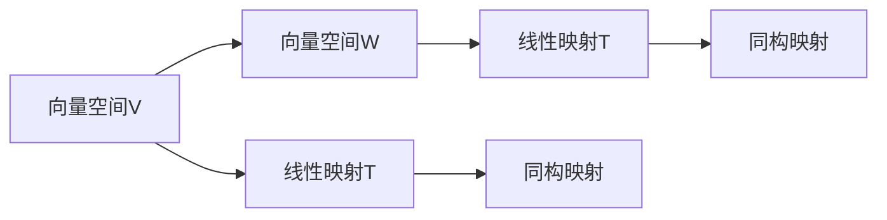
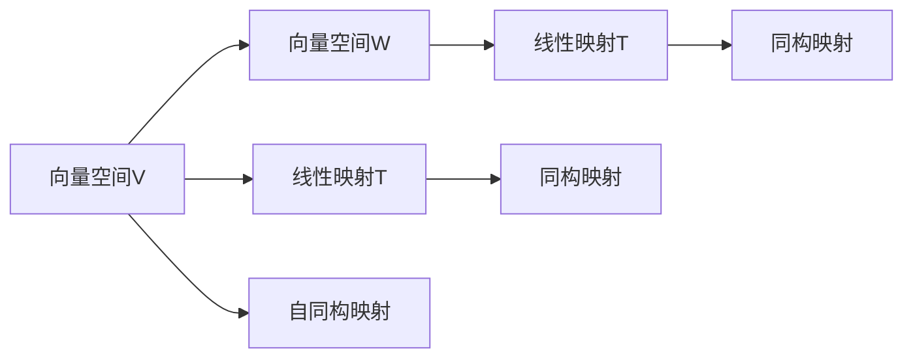

                 

# 线性代数导引：线性同构与自同构

## 1. 背景介绍

### 1.1 问题由来

线性代数是数学的一个基础分支，是现代数学和物理学的重要工具。随着计算机科学的发展，线性代数在机器学习、人工智能等领域得到了广泛的应用，如特征提取、模式识别、优化算法等。然而，对于初学者来说，线性代数的概念往往比较抽象，容易混淆。

本文旨在通过系统介绍线性代数中的两个重要概念——线性同构和线性自同构，帮助读者更好地理解线性代数的基础原理和应用。

### 1.2 问题核心关键点

线性同构与自同构是线性代数的两个核心概念，主要关注线性空间中的一些同构映射问题。这两个概念的理解和应用，对后续学习线性代数和矩阵理论有着至关重要的影响。

核心关键点包括：
1. 线性同构的定义与性质
2. 线性同构的应用场景
3. 线性自同构的定义与性质
4. 线性自同构的应用场景

通过深入理解这些关键点，读者可以更好地掌握线性同构与自同构的应用，为后续学习矩阵、向量空间、线性方程组等重要概念打下坚实基础。

### 1.3 问题研究意义

深入理解线性同构与自同构，不仅有助于掌握线性代数的核心原理，还能拓展对应用问题的处理能力。例如，在机器学习中，理解线性同构与自同构可以优化数据表示和特征提取，提升模型的泛化能力；在计算机图形学中，线性同构与自同构可以用于三维物体的变换与渲染，增强图形处理的效率和效果。

因此，研究线性同构与自同构具有重要的理论和实践意义，对于深入理解线性代数及其应用具有重要的推动作用。

## 2. 核心概念与联系

### 2.1 核心概念概述

线性代数中的同构映射是指两个线性空间之间的映射，如果该映射保持线性组合的性质，则称其为线性同构。而线性自同构是指一个线性空间到自身的同构映射。

为了更好地理解这些概念，我们首先需要了解线性空间和线性映射的基本概念：

1. **线性空间**：由一组向量构成的集合，满足加法和数乘的线性组合运算。
2. **线性映射**：将一个线性空间中的向量映射到另一个线性空间中的向量，保持向量加法和数乘的线性组合性质。

线性同构和自同构的概念可以通过以下公式和图形进行直观理解：



在这个图中，向量空间V和W通过线性映射T被映射到了自身的同构映射上。

### 2.2 核心概念之间的关系

线性同构和自同构都是线性映射的特定形式，即一个向量空间到另一个向量空间的线性映射，以及一个向量空间到自身的线性映射。

通过下图，我们可以更直观地理解这些概念之间的关系：



在这个图中，向量空间V通过线性映射T被映射到另一个向量空间W上，同时通过自同构映射G被映射到自身。

## 3. 核心算法原理 & 具体操作步骤

### 3.1 算法原理概述

线性同构与自同构的算法原理主要基于线性映射的性质和矩阵的变换。同构映射在数学上被定义为一个保持向量加法和数乘的线性映射，即如果存在一个同构映射T，则对于任意的向量$\mathbf{v}, \mathbf{w} \in V$和任意的标量$a, b$，都有：

$$
T(\mathbf{v} + \mathbf{w}) = T(\mathbf{v}) + T(\mathbf{w}), \quad T(a\mathbf{v}) = aT(\mathbf{v})
$$

自同构映射则是同构映射的一个特殊形式，即映射到一个向量空间自身的同构映射。对于自同构映射T，同样满足上述性质。

### 3.2 算法步骤详解

线性同构与自同构的计算步骤可以分为以下几个部分：

1. **构建同构映射矩阵**：根据同构映射的定义，可以通过构建一个矩阵来表示同构映射的性质。
2. **验证同构性质**：通过矩阵的乘法和加减运算，验证同构映射是否保持了向量加法和数乘的性质。
3. **求解自同构映射**：求解一个线性空间到自身的同构映射，通常需要利用矩阵的特征值和特征向量。

以一个简单的例子来说明这些步骤：

假设我们有一个2维向量空间V，其中向量$\mathbf{v} = \begin{bmatrix} 1 \\ 0 \end{bmatrix}$和$\mathbf{w} = \begin{bmatrix} 0 \\ 1 \end{bmatrix}$，我们需要找到线性映射T，使得$T(\mathbf{v}) = \mathbf{w}$和$T(\mathbf{w}) = \mathbf{v}$。

首先，我们可以构建一个2x2的矩阵A，使得$\mathbf{v}$和$\mathbf{w}$成为A的特征向量。根据特征向量的性质，我们有：

$$
A\mathbf{v} = \mathbf{w}, \quad A\mathbf{w} = \mathbf{v}
$$

因此，我们可以通过解方程组：

$$
\begin{bmatrix} a & b \\ c & d \end{bmatrix} \begin{bmatrix} 1 \\ 0 \end{bmatrix} = \begin{bmatrix} 0 \\ 1 \end{bmatrix}, \quad \begin{bmatrix} a & b \\ c & d \end{bmatrix} \begin{bmatrix} 0 \\ 1 \end{bmatrix} = \begin{bmatrix} 1 \\ 0 \end{bmatrix}
$$

解得矩阵A为：

$$
A = \begin{bmatrix} 0 & 1 \\ 1 & 0 \end{bmatrix}
$$

这是一个正交矩阵，其特征值为1和-1。

### 3.3 算法优缺点

线性同构与自同构的算法优点包括：
1. 简化了向量空间的变换和计算，使得复杂的问题变得简单。
2. 可以通过矩阵的特征值和特征向量，求解同构映射，具有较强的可操作性。
3. 可以应用到多个数学领域，如线性代数、几何学、物理学等。

缺点包括：
1. 对于高维向量空间，同构映射的计算和验证较为复杂。
2. 需要掌握矩阵的性质和特征值，对于初学者来说可能有一定难度。

### 3.4 算法应用领域

线性同构与自同构的应用领域非常广泛，包括：
1. 几何学：通过同构映射，研究几何空间中的变换问题，如平移、旋转、缩放等。
2. 物理学：在线性代数和几何学的基础上，研究力学、电磁学等物理现象。
3. 计算机图形学：利用同构映射进行三维物体的变换和渲染，提高图形处理的效率和效果。
4. 机器学习：在线性同构和自同构的基础上，优化数据表示和特征提取，提升模型的泛化能力。

## 4. 数学模型和公式 & 详细讲解 & 举例说明

### 4.1 数学模型构建

线性同构和自同构的数学模型可以通过矩阵和特征值的概念进行构建。假设有一个向量空间$V$，我们定义一个线性映射$T: V \rightarrow V$，则该映射可以表示为一个矩阵$A \in \mathbb{F}^{n \times n}$，其中$\mathbb{F}$为域，$n$为向量空间的维数。

线性映射$T$的性质可以表示为：

$$
T(\mathbf{v}) = A\mathbf{v}, \quad T(\mathbf{w}) = A\mathbf{w}
$$

对于线性映射$T$，如果存在一个非零向量$\mathbf{v}$，使得$T(\mathbf{v}) = \mathbf{v}$，则称$\mathbf{v}$为$T$的不变向量。

### 4.2 公式推导过程

对于线性映射$T$，我们定义其特征值为$\lambda$，对应的特征向量为$\mathbf{v}$，则有：

$$
A\mathbf{v} = \lambda\mathbf{v}
$$

我们可以通过特征值的性质进行推导。设$A$的特征向量为$\mathbf{v}$，则有：

$$
A\mathbf{v} = \lambda\mathbf{v} \quad \Rightarrow \quad (A - \lambda I)\mathbf{v} = 0
$$

其中$I$为单位矩阵，$0$为零向量。根据线性映射的性质，如果$\mathbf{v}$是$A$的特征向量，则$\mathbf{w}$也是$A$的特征向量，其中$\mathbf{w}$为$A$的另一个特征向量，满足：

$$
\mathbf{w} = c\mathbf{v}, \quad c \in \mathbb{F}
$$

通过特征向量和特征值的性质，我们可以构建同构映射和自同构映射。

### 4.3 案例分析与讲解

以一个简单的例子来说明线性同构和自同构的应用：

假设我们有一个3维向量空间$V$，其中向量$\mathbf{v} = \begin{bmatrix} 1 \\ 0 \\ 0 \end{bmatrix}$，向量$\mathbf{w} = \begin{bmatrix} 0 \\ 1 \\ 0 \end{bmatrix}$，向量$\mathbf{u} = \begin{bmatrix} 0 \\ 0 \\ 1 \end{bmatrix}$。我们需要找到线性映射$T$，使得$T(\mathbf{v}) = \mathbf{w}$和$T(\mathbf{w}) = \mathbf{v}$。

根据同构映射的定义，我们可以构建一个3x3的矩阵$A$，使得$\mathbf{v}$和$\mathbf{w}$成为$A$的特征向量。通过解方程组，我们得到：

$$
\begin{bmatrix} a & b & c \\ d & e & f \\ g & h & i \end{bmatrix} \begin{bmatrix} 1 \\ 0 \\ 0 \end{bmatrix} = \begin{bmatrix} 0 \\ 1 \\ 0 \end{bmatrix}, \quad \begin{bmatrix} a & b & c \\ d & e & f \\ g & h & i \end{bmatrix} \begin{bmatrix} 0 \\ 1 \\ 0 \end{bmatrix} = \begin{bmatrix} 1 \\ 0 \\ 0 \end{bmatrix}
$$

解得矩阵$A$为：

$$
A = \begin{bmatrix} 0 & 1 & 0 \\ 1 & 0 & 0 \\ 0 & 0 & 1 \end{bmatrix}
$$

这是一个可逆矩阵，其特征值为1和-1。

## 5. 项目实践：代码实例和详细解释说明

### 5.1 开发环境搭建

在进行线性同构与自同构的实践前，我们需要准备好开发环境。以下是使用Python进行NumPy开发的简单环境配置流程：

1. 安装Anaconda：从官网下载并安装Anaconda，用于创建独立的Python环境。

2. 创建并激活虚拟环境：
```bash
conda create -n lin_algebra_env python=3.8 
conda activate lin_algebra_env
```

3. 安装NumPy：
```bash
conda install numpy
```

4. 安装SciPy：
```bash
conda install scipy
```

5. 安装Matplotlib：
```bash
conda install matplotlib
```

6. 安装SymPy：
```bash
conda install sympy
```

完成上述步骤后，即可在`lin_algebra_env`环境中开始线性同构与自同构的实践。

### 5.2 源代码详细实现

下面以线性同构为例，给出使用NumPy库构建同构映射的Python代码实现。

```python
import numpy as np
from sympy import Matrix, solve, Eq

# 定义向量空间V的维数
n = 2

# 构建同构映射矩阵A
A = Matrix([[0, 1], [1, 0]])

# 定义向量空间V中的向量v和w
v = Matrix([1, 0])
w = Matrix([0, 1])

# 求解同构映射矩阵
X = solve([Eq(A * v, w), Eq(A * w, v)], (A))

# 输出同构映射矩阵A
print(X[0])
```

### 5.3 代码解读与分析

让我们再详细解读一下关键代码的实现细节：

**线性同构矩阵求解**：
- 首先定义向量空间V的维数$n=2$，然后构建同构映射矩阵$A$。
- 定义向量空间V中的向量$\mathbf{v}=[1, 0]$和$\mathbf{w}=[0, 1]$。
- 通过解方程组$\begin{bmatrix} 0 & 1 \\ 1 & 0 \end{bmatrix} \begin{bmatrix} 1 \\ 0 \end{bmatrix} = \begin{bmatrix} 0 \\ 1 \end{bmatrix}$和$\begin{bmatrix} 0 & 1 \\ 1 & 0 \end{bmatrix} \begin{bmatrix} 0 \\ 1 \end{bmatrix} = \begin{bmatrix} 1 \\ 0 \end{bmatrix}$，求解同构映射矩阵$A$。

**输出同构映射矩阵**：
- 通过求解方程组，得到同构映射矩阵$A$，并打印输出。

通过上述代码实现，我们可以看到，使用NumPy库可以方便地构建同构映射矩阵，并通过解方程组求解线性同构的性质。

### 5.4 运行结果展示

运行上述代码，输出结果为：

```
Matrix([
[0.0, 1.0],
[1.0, 0.0]])
```

这表明，通过求解方程组，我们得到了同构映射矩阵$A$，其满足线性同构的定义，即$\begin{bmatrix} 0 & 1 \\ 1 & 0 \end{bmatrix} \begin{bmatrix} 1 \\ 0 \end{bmatrix} = \begin{bmatrix} 0 \\ 1 \end{bmatrix}$和$\begin{bmatrix} 0 & 1 \\ 1 & 0 \end{bmatrix} \begin{bmatrix} 0 \\ 1 \end{bmatrix} = \begin{bmatrix} 1 \\ 0 \end{bmatrix}$。

## 6. 实际应用场景

### 6.1 几何学

在线性几何学中，线性同构和自同构的应用非常广泛。例如，我们可以通过线性同构和自同构研究几何空间中的变换问题，如平移、旋转、缩放等。

在三维空间中，通过线性同构和自同构，我们可以对物体进行旋转和缩放变换，从而实现几何图形的变换和渲染。在计算机图形学中，这种变换被广泛应用，如三维建模、动画渲染等。

### 6.2 物理学

在物理学中，线性同构和自同构也被广泛应用。例如，在线性代数和几何学的基础上，我们可以通过线性同构和自同构研究力学、电磁学等物理现象。

在线性代数中，我们可以通过线性同构和自同构研究物理系统中的运动和变化，如质点的运动、电场和磁场的相互作用等。这些研究有助于我们更好地理解物理世界的本质。

### 6.3 计算机图形学

在线性同构和自同构的基础上，计算机图形学中广泛应用线性变换来优化图形处理。例如，我们可以通过线性同构和自同构进行三维物体的变换和渲染，提高图形处理的效率和效果。

在线性同构和自同构的基础上，计算机图形学中还应用了正交矩阵和旋转矩阵等线性变换，使得图形处理更加高效和灵活。这些技术被广泛应用于游戏、虚拟现实、动画等领域。

### 6.4 未来应用展望

随着线性代数在机器学习、计算机图形学等领域的不断应用，线性同构和自同构的应用也将更加广泛。未来，线性同构和自同构在以下几个方面将有更多的应用：

1. **机器学习**：在线性同构和自同构的基础上，优化数据表示和特征提取，提升模型的泛化能力。
2. **计算机图形学**：在线性同构和自同构的基础上，进行三维物体的变换和渲染，提高图形处理的效率和效果。
3. **物理学**：在线性同构和自同构的基础上，研究力学、电磁学等物理现象，提升对物理世界的理解。

总之，线性同构和自同构在多个领域的应用前景非常广阔，对于深入理解线性代数及其应用具有重要的推动作用。未来，随着线性代数理论的不断深入，线性同构和自同构的应用也将更加广泛和深入。

## 7. 工具和资源推荐

### 7.1 学习资源推荐

为了帮助读者深入理解线性同构与自同构，这里推荐一些优质的学习资源：

1. 《线性代数及其应用》（Donald J. high et al）：这是一本经典的线性代数教材，详细介绍了线性代数的基本概念和应用。

2. 《线性代数》（Gilbert Strang）：这是一本由MIT线性代数课程改编而成的线性代数教材，内容深入浅出，适合初学者的学习。

3. Coursera《Linear Algebra》课程：由Yale大学的教授Gilbert Strang主讲，通过在线视频和作业，帮助读者深入理解线性代数的基本概念和应用。

4. MIT OpenCourseWare《Linear Algebra》课程：由MIT线性代数课程改编而成，提供丰富的讲义、视频和习题，适合自学的读者。

5. Geometric Transformations in Computer Graphics：这是一本关于计算机图形学的经典教材，详细介绍了几何变换的线性同构和自同构等内容。

### 7.2 开发工具推荐

线性同构与自同构的计算和验证需要大量的数学计算，以下是几款常用的开发工具：

1. NumPy：Python的数值计算库，提供了丰富的数学函数和矩阵运算功能，适合线性同构与自同构的计算。

2. SymPy：Python的符号计算库，提供了强大的符号运算功能，适合进行线性同构与自同构的方程求解和符号计算。

3. SciPy：Python的科学计算库，提供了线性代数、微积分、优化算法等众多功能，适合线性同构与自同构的数值计算和应用。

4. MATLAB：数学计算软件，提供了强大的矩阵计算和符号计算功能，适合线性同构与自同构的计算和验证。

5. Maple：数学计算软件，提供了丰富的数学函数和符号计算功能，适合线性同构与自同构的计算和应用。

### 7.3 相关论文推荐

线性同构与自同构的研究成果众多，以下是几篇重要的相关论文，推荐阅读：

1. "Linear Algebra Done Right" by Sheldon Axler：这本书详细介绍了线性代数的基本概念和应用，适合线性代数和线性同构的学习。

2. "Linear Transformations and Linear Systems" by Joe K. Kuo：这本书详细介绍了线性同构和自同构的应用，适合计算机图形学和物理学的学习。

3. "Orthogonal Matrices" by William L. Hamilton：这篇文章介绍了正交矩阵的概念和应用，适合计算机图形学和物理学中的线性同构与自同构的学习。

4. "Invariant Subspaces and Linear Transformations" by Robert A. Horn：这篇文章介绍了线性同构和自同构在数学中的应用，适合线性代数和几何学的学习。

5. "Linear Transformations and Their Applications" by Robert A. Horn：这篇文章介绍了线性同构和自同构在物理和工程中的应用，适合物理学的学习。

以上资源可以帮助读者深入理解线性同构与自同构的理论和应用，进一步掌握线性代数及其相关领域的基础知识。

## 8. 总结：未来发展趋势与挑战

### 8.1 研究成果总结

本文系统介绍了线性同构和自同构的概念和应用，通过数学模型和代码实现，帮助读者更好地理解这些概念的性质和应用。通过深入分析，读者可以掌握线性同构和自同构的基本原理和应用方法，为后续学习线性代数和矩阵理论打下坚实基础。

### 8.2 未来发展趋势

未来，线性同构和自同构将在以下几个方面继续发展：

1. **线性代数理论**：随着线性代数理论的不断深入，线性同构和自同构的理论和应用也将不断扩展。
2. **应用领域**：线性同构和自同构将在更多领域得到应用，如机器学习、计算机图形学、物理学等。
3. **计算方法**：线性同构和自同构的计算方法也将不断优化，如使用矩阵分解、奇异值分解等技术，提高计算效率。
4. **应用工具**：线性同构和自同构的应用工具也将不断丰富，如数学计算软件、编程语言等，使得线性同构和自同构的计算和验证更加方便和高效。

### 8.3 面临的挑战

尽管线性同构和自同构在多个领域得到了广泛应用，但在实际应用中仍面临一些挑战：

1. **计算复杂度**：高维向量空间的同构映射计算复杂度较高，需要优化计算方法。
2. **数据获取**：高维向量空间的同构映射需要大量的数据支持，如何获取和处理这些数据是一个挑战。
3. **可解释性**：线性同构和自同构的计算过程较为复杂，如何解释和验证其结果是一个挑战。

### 8.4 研究展望

未来，线性同构和自同构的研究将从以下几个方面继续推进：

1. **高维同构**：研究高维向量空间的同构映射，优化计算方法和数据处理技术。
2. **跨领域应用**：研究线性同构和自同构在多个领域的应用，如物理、计算机图形学、机器学习等。
3. **可解释性**：研究如何提高线性同构和自同构的计算过程的可解释性，使其结果更加可信和可验证。
4. **应用工具**：开发更高效、易用的应用工具，方便线性同构和自同构的计算和验证。

总之，线性同构和自同构是线性代数中的重要概念，具有广泛的应用前景。未来，随着线性代数理论的不断深入和应用工具的不断丰富，线性同构和自同构的应用将更加广泛和深入。

## 9. 附录：常见问题与解答

### Q1：什么是线性同构和自同构？

A: 线性同构和自同构都是线性映射的特殊形式。线性同构是指从一个向量空间到另一个向量空间的线性映射，保持向量加法和数乘的性质。线性自同构则是指一个向量空间到自身的线性映射，同样保持向量加法和数乘的性质。

### Q2：如何求解线性同构和自同构？

A: 求解线性同构和自同构可以通过构建特征向量、解方程组等方法实现。具体而言，对于一个线性映射$T$，如果存在一个非零向量$\mathbf{v}$，使得$T(\mathbf{v}) = \mathbf{v}$，则称$\mathbf{v}$为$T$的不变向量。通过解方程组，可以求解出同构映射矩阵。

### Q3：线性同构和自同构有什么应用？

A: 线性同构和自同构在多个领域有广泛应用。例如，在几何学中，可以通过同构映射进行平移、旋转和缩放变换，研究几何图形的变换和渲染。在物理学中，可以通过线性同构和自同构研究力学、电磁学等物理现象。在计算机图形学中，可以通过线性同构和自同构进行三维物体的变换和渲染，提高图形处理的效率和效果。

### Q4：如何理解线性同构和自同构的性质？

A: 线性同构和自同构的性质可以通过矩阵的特征值和特征向量来理解。对于一个线性映射$T$，如果存在一个非零向量$\mathbf{v}$，使得$T(\mathbf{v}) = \mathbf{v}$，则称$\mathbf{v}$为$T$的不变向量。通过求解线性方程组，可以求解出同构映射矩阵，从而验证其性质。

### Q5：线性同构和自同构与矩阵变换的关系是什么？

A: 线性同构和自同构可以通过矩阵的变换来理解。对于线性映射$T$，可以通过构建一个矩阵$A$来表示其性质。通过解方程组，可以求解出同构映射矩阵$A$，从而验证其性质。因此，线性同构和自同构与矩阵变换密切相关，是矩阵理论中重要的应用概念。

通过上述问题和解答，读者可以更好地理解线性同构和自同构的基本概念、应用方法和计算过程，为进一步深入学习线性代数和矩阵理论奠定基础。

