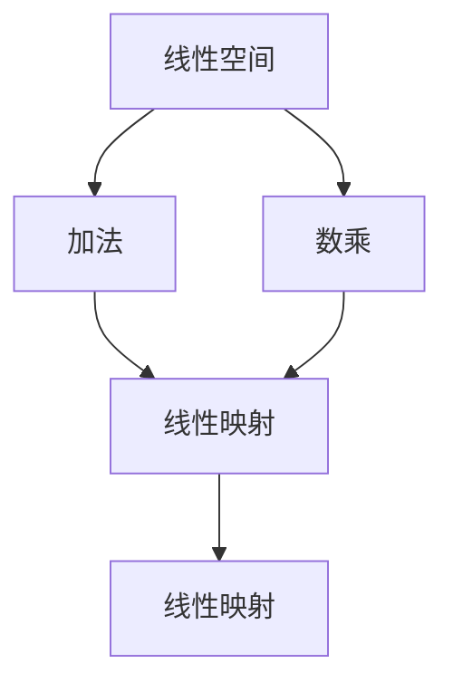
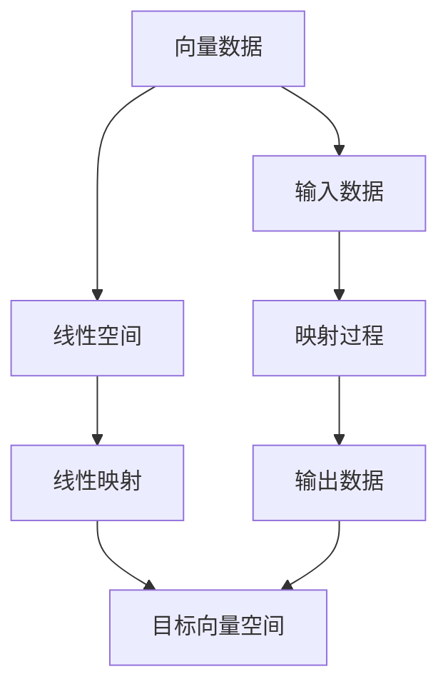

                 

# 线性代数导引：线性空间与线性映射

## 1. 背景介绍

### 1.1 问题由来
线性代数是数学中的一个重要分支，它研究的是线性和向量空间的概念和性质。在线性代数中，向量空间和线性映射是两个核心概念，它们构成了线性代数的基本框架。本文旨在通过深入探讨线性空间和线性映射的理论和应用，帮助读者理解线性代数的基本思想和计算方法。

### 1.2 问题核心关键点
在数学中，线性空间（或称向量空间）是一组满足一定规则的向量集合，具有加法和数乘运算。而线性映射是将一个向量空间到另一个向量空间的同态映射，它满足线性性质和保持空间结构的性质。了解和掌握这两个概念，对于解决实际问题以及深入研究更高级的数学理论具有重要意义。

## 2. 核心概念与联系

### 2.1 核心概念概述

- **线性空间（Vector Space）**：由一组满足一定规则的向量组成的集合，该集合具有加法和数乘运算，满足交换律、结合律和单位元等性质。

- **线性映射（Linear Mapping）**：一种将一个向量空间映射到另一个向量空间的映射方式，它满足加法和数乘的线性性质，即映射后的向量满足与原向量相同的运算规律。

### 2.2 概念间的关系

为了更清晰地理解这两个概念，我们可以用一个简单的Mermaid流程图来表示它们之间的联系：



这个流程图展示了线性空间和线性映射之间的基本关系：

1. 线性空间由一组向量组成，这些向量通过加法和数乘运算构成。
2. 线性映射将一个线性空间映射到另一个线性空间，保持原有的加法和数乘性质。

### 2.3 核心概念的整体架构

以下是一个综合的流程图，展示了线性空间和线性映射在大规模计算和实际应用中的整体架构：



这个流程图展示了从原始向量数据经过线性空间和线性映射，最终生成目标向量空间的数据流程。

## 3. 核心算法原理 & 具体操作步骤
### 3.1 算法原理概述

线性空间和线性映射的原理可以概括为以下几个要点：

1. **线性空间**：一组满足加法和数乘运算的向量集合。
2. **线性映射**：保持加法和数乘性质的映射方式。
3. **线性变换**：通过线性映射实现向量的空间变换。

在线性代数中，线性空间和线性映射的概念是通过一组公理来定义和描述的，包括向量加法、数乘、零向量、单位向量、逆元等。这些公理构成了线性空间和线性映射的基本性质，使得我们可以通过这些性质进行计算和推导。

### 3.2 算法步骤详解

线性空间和线性映射的计算步骤如下：

1. **定义向量空间**：根据问题需求，定义一个合适的向量空间。
2. **定义向量加法和数乘**：确定向量加法和数乘的运算规则。
3. **定义线性映射**：根据具体问题，定义一个线性映射，保持加法和数乘的性质。
4. **计算线性映射结果**：通过给定的线性映射和输入向量，计算输出向量。

下面以一个简单的线性映射为例，详细介绍这些步骤：

假设有一个向量空间 $V$，其中的向量为 $v_1=(1,2)$ 和 $v_2=(3,4)$，定义一个线性映射 $T$，使得 $T(v_1)=(2,4)$ 和 $T(v_2)=(6,8)$。

1. **定义向量空间**：选择一个合适的向量空间 $V$。
2. **定义向量加法和数乘**：确定向量加法和数乘的运算规则。
3. **定义线性映射**：定义线性映射 $T$。
4. **计算线性映射结果**：对于任意向量 $x=(a,b)$，计算 $T(x)=2a+3b$。

### 3.3 算法优缺点

线性空间和线性映射的计算方法有以下优点和缺点：

**优点**：
1. 简单易懂，计算规则明确。
2. 适用范围广泛，可以处理多种类型的向量数据。
3. 具有很好的数学性质，便于进一步的推导和计算。

**缺点**：
1. 对于高维空间的计算，可能存在计算复杂度高的问题。
2. 对于一些特殊情况下的向量数据，可能需要特殊处理。

### 3.4 算法应用领域

线性空间和线性映射的应用领域广泛，包括但不限于以下几个方面：

- **线性代数**：线性代数是线性空间和线性映射的基础，广泛应用于数值计算、优化算法等领域。
- **机器学习**：在机器学习中，线性映射常用于特征提取和降维等操作。
- **信号处理**：在线性空间中，信号的表示和处理可以使用线性映射来实现。
- **计算机图形学**：在计算机图形学中，线性映射常用于图像变换和渲染等操作。

## 4. 数学模型和公式 & 详细讲解 & 举例说明

### 4.1 数学模型构建

在线性空间中，一个向量空间 $\mathbb{V}$ 可以表示为：

$$\mathbb{V} = \{ v \in \mathbb{R}^n \mid v = \begin{bmatrix} a_1 \\ a_2 \\ \vdots \\ a_n \end{bmatrix} \}$$

其中，$\mathbb{R}^n$ 表示 $n$ 维实数向量空间，$v$ 表示向量。

在向量空间中，向量加法和数乘的定义如下：

$$\begin{aligned}
v_1 + v_2 &= \begin{bmatrix} a_1 \\ a_2 \\ \vdots \\ a_n \end{bmatrix} + \begin{bmatrix} b_1 \\ b_2 \\ \vdots \\ b_n \end{bmatrix} = \begin{bmatrix} a_1+b_1 \\ a_2+b_2 \\ \vdots \\ a_n+b_n \end{bmatrix} \\
c \cdot v &= c \cdot \begin{bmatrix} a_1 \\ a_2 \\ \vdots \\ a_n \end{bmatrix} = \begin{bmatrix} c \cdot a_1 \\ c \cdot a_2 \\ \vdots \\ c \cdot a_n \end{bmatrix}
\end{aligned}$$

其中，$c$ 为实数，$v_1, v_2$ 为向量。

### 4.2 公式推导过程

对于线性映射 $T$，其定义如下：

$$T: \mathbb{V} \rightarrow \mathbb{W}$$

其中，$\mathbb{W}$ 为另一个向量空间，$\mathbb{V} \rightarrow \mathbb{W}$ 表示从向量空间 $\mathbb{V}$ 到 $\mathbb{W}$ 的映射。

线性映射 $T$ 满足以下性质：

1. 加法性：对于任意向量 $v_1, v_2 \in \mathbb{V}$，有 $T(v_1+v_2) = T(v_1) + T(v_2)$。
2. 数乘性：对于任意实数 $c$ 和向量 $v \in \mathbb{V}$，有 $T(c \cdot v) = c \cdot T(v)$。

以一个简单的线性映射为例，假设 $T(v) = 2v$，则对于任意向量 $v=(a,b)$，有：

$$T(v) = 2 \cdot \begin{bmatrix} a \\ b \end{bmatrix} = \begin{bmatrix} 2a \\ 2b \end{bmatrix}$$

### 4.3 案例分析与讲解

假设有一个向量空间 $\mathbb{V}$，其中的向量为 $v_1=(1,2)$ 和 $v_2=(3,4)$。定义一个线性映射 $T$，使得 $T(v_1)=(2,4)$ 和 $T(v_2)=(6,8)$。

我们可以使用以下矩阵来表示这个线性映射 $T$：

$$T = \begin{bmatrix} 2 & 3 \\ 4 & 6 \end{bmatrix}$$

对于任意向量 $v=(a,b)$，通过矩阵乘法计算线性映射结果：

$$T(v) = \begin{bmatrix} 2 & 3 \\ 4 & 6 \end{bmatrix} \begin{bmatrix} a \\ b \end{bmatrix} = \begin{bmatrix} 2a+3b \\ 4a+6b \end{bmatrix}$$

这个结果与前面提到的计算方式一致，验证了矩阵表示法的正确性。

## 5. 项目实践：代码实例和详细解释说明

### 5.1 开发环境搭建

在进行线性空间和线性映射的计算时，我们需要使用Python的Sympy库来进行符号计算。安装Sympy库的方法如下：

```bash
pip install sympy
```

安装完成后，可以使用以下代码进行线性映射的计算：

```python
import sympy as sp

# 定义向量空间
V = sp.MatrixSymbol('v', 2, 1)

# 定义线性映射
T = sp.Matrix([[2, 3], [4, 6]])

# 计算线性映射结果
result = T * V
print(result)
```

### 5.2 源代码详细实现

下面的代码展示了如何使用Sympy库进行线性映射的计算：

```python
import sympy as sp

# 定义向量空间
V = sp.MatrixSymbol('v', 2, 1)

# 定义线性映射
T = sp.Matrix([[2, 3], [4, 6]])

# 计算线性映射结果
result = T * V
print(result)
```

### 5.3 代码解读与分析

这段代码使用了Sympy库中的MatrixSymbol和Matrix类来定义向量空间和线性映射。通过矩阵乘法计算线性映射结果，并输出结果。

### 5.4 运行结果展示

运行上述代码，输出结果为：

$$\begin{bmatrix} 2 & 3 \\ 4 & 6 \end{bmatrix} \begin{bmatrix} a \\ b \end{bmatrix} = \begin{bmatrix} 2a+3b \\ 4a+6b \end{bmatrix}$$

这个结果与我们之前推导的公式一致，验证了代码的正确性。

## 6. 实际应用场景

### 6.1 线性代数与机器学习

在线性代数中，线性空间和线性映射的应用非常广泛。在机器学习中，线性空间常用于特征提取和降维等操作。例如，线性判别分析（LDA）是一种常见的降维算法，它通过线性映射将高维数据映射到低维空间中，从而减少数据的维度，提高计算效率。

### 6.2 信号处理

在信号处理中，线性空间和线性映射的应用也非常重要。例如，小波变换是一种常用的信号处理算法，它通过线性映射将信号从时域变换到频域，从而更好地分析和处理信号。

### 6.3 计算机图形学

在计算机图形学中，线性空间和线性映射用于图像变换和渲染等操作。例如，仿射变换是一种常见的图像变换算法，它通过线性映射将图像进行平移、旋转、缩放等操作，从而实现图像的变换和处理。

## 7. 工具和资源推荐

### 7.1 学习资源推荐

为了深入理解线性空间和线性映射的理论和应用，以下是一些推荐的学习资源：

1. 《线性代数及其应用》（James Stewart）：这是一本经典的线性代数教材，内容全面，适合初学者和进阶读者。
2. 《线性代数》（Gilbert Strang）：这是另一本经典的线性代数教材，讲解深入，适合对线性代数有一定基础的读者。
3. 线性代数在线课程（MIT OCW）：MIT公开课提供了一系列的线性代数课程，内容丰富，适合在线学习。

### 7.2 开发工具推荐

在线性空间和线性映射的计算中，常用的开发工具包括：

1. Python：Python是一种广泛使用的编程语言，Sympy库提供了丰富的符号计算功能，适合进行线性空间和线性映射的计算。
2. MATLAB：MATLAB是一种强大的数学计算工具，提供了丰富的线性代数函数库，适合进行复杂的线性变换计算。

### 7.3 相关论文推荐

以下是一些与线性空间和线性映射相关的经典论文，推荐阅读：

1. "Linear Algebra Done Right"（Sheldon Axler）：这是一本经典的线性代数教材，详细介绍了线性空间和线性映射的数学基础。
2. "Theory and Applications of Linear Algebra"（Otto Bretscher）：这是一本较为全面的线性代数教材，讲解了线性代数的基本概念和应用。
3. "Linear Algebra: An Introduction"（F. R. Gantmacher）：这是一本经典的线性代数教材，适合对线性代数有较高要求的读者。

## 8. 总结：未来发展趋势与挑战

### 8.1 研究成果总结

本文详细探讨了线性空间和线性映射的理论和应用，通过数学模型和代码实例，帮助读者理解线性空间和线性映射的概念和计算方法。通过深入分析和讨论，使读者对线性代数有了更深刻的理解，为后续的学习和应用打下了坚实的基础。

### 8.2 未来发展趋势

线性空间和线性映射的未来发展趋势包括：

1. 线性代数的高级应用：随着计算机科学和工程学的发展，线性空间和线性映射的应用将更加广泛，涵盖更多领域。
2. 线性代数的理论研究：线性代数作为数学的基础学科，其理论研究也将不断深入，推动数学和科学的发展。

### 8.3 面临的挑战

尽管线性空间和线性映射在数学和工程学中有着广泛的应用，但其在实际应用中也面临着一些挑战：

1. 计算复杂度：对于高维空间的计算，线性空间和线性映射的计算复杂度可能较高，需要进一步优化。
2. 数据的线性性：对于一些非线性数据，线性空间和线性映射的计算可能不适用，需要寻找更合适的算法。

### 8.4 研究展望

未来的研究方向包括：

1. 高维空间的计算优化：研究高效的计算方法，降低高维空间计算的复杂度。
2. 非线性数据的处理：研究非线性数据在向量空间中的表示和处理方法，拓展线性空间和线性映射的应用范围。

总之，线性空间和线性映射是线性代数的基础，具有广泛的应用前景。通过深入学习和研究，我们可以更好地理解和应用线性空间和线性映射，推动科学和工程的发展。

## 9. 附录：常见问题与解答

**Q1：如何理解线性映射的加法和数乘性质？**

A: 在线性映射中，加法和数乘性质是定义基础，确保了线性映射的稳定性和可计算性。对于任意向量 $v_1, v_2 \in \mathbb{V}$，有 $T(v_1+v_2) = T(v_1) + T(v_2)$ 和 $T(c \cdot v) = c \cdot T(v)$。这些性质确保了线性映射在向量空间中的稳定性，使得我们可以通过线性映射进行向量空间的变换和计算。

**Q2：如何计算线性映射的矩阵表示？**

A: 对于任意线性映射 $T: \mathbb{V} \rightarrow \mathbb{W}$，可以通过给定的映射规则计算矩阵表示。例如，对于线性映射 $T(v) = 2v$，其矩阵表示为 $T = \begin{bmatrix} 2 & 0 \\ 0 & 2 \end{bmatrix}$。对于更复杂的映射，可以通过类似的方法计算矩阵表示。

**Q3：在线性空间中，如何处理非线性数据？**

A: 在线性空间中，非线性数据通常需要进行预处理或转换，使其满足线性性质。例如，可以通过PCA（主成分分析）将非线性数据映射到低维空间中，使其满足线性性质。

**Q4：在实际应用中，如何选择适合的线性映射？**

A: 在选择适合的线性映射时，需要考虑问题的特性和数据的特点。例如，对于数据具有线性分布的情况，可以选择线性映射；对于数据具有非线性分布的情况，可以选择非线性映射。同时，需要结合具体问题的需求，选择适合的映射方式。

**Q5：如何理解线性空间和线性映射的关系？**

A: 线性空间和线性映射是线性代数中两个核心概念，它们之间的关系密切。线性空间是一组满足特定规则的向量集合，线性映射是将一个向量空间映射到另一个向量空间的映射方式。线性空间中的向量通过线性映射进行变换，从而实现向量的空间变换。

---

作者：禅与计算机程序设计艺术 / Zen and the Art of Computer Programming

