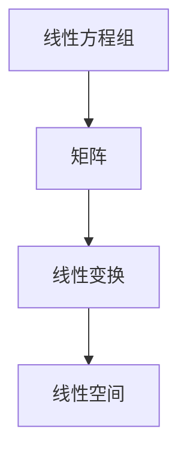

                 

# 线性代数导引：线性运算

> 关键词：
- 线性代数
- 线性运算
- 矩阵
- 线性方程组
- 线性空间
- 线性变换

## 1. 背景介绍

### 1.1 问题由来

线性代数作为计算机科学的重要基础，其核心思想是在向量空间中处理和研究线性关系。线性运算在计算机科学和工程领域有着广泛的应用，例如计算机图形学、机器学习、信号处理、控制系统等。在计算机科学中，线性代数尤其重要，它不仅是许多算法和数据结构的基础，而且对于理解和学习高级主题，如深度学习、优化和信号处理，也是必不可少的。

然而，尽管线性代数具有如此重要的地位，许多计算机科学专业的学生和从业者仍然难以完全理解它的概念和应用。本文章旨在通过详细的讲解和实例，帮助读者系统地掌握线性代数的核心内容，特别是线性运算的基础知识。

### 1.2 问题核心关键点

线性代数中，线性运算是一个基本且重要的概念，它的核心是线性方程组和矩阵运算。线性方程组描述了一组线性关系，矩阵运算则是解决这些方程组的基本工具。本文章将重点讨论线性方程组的求解和矩阵的运算，以及它们在实际应用中的重要性和技巧。

线性运算在实际应用中的常见场景包括但不限于：
- 数据科学中的线性回归和主成分分析(PCA)
- 机器学习中的特征提取和模型训练
- 计算机图形学中的几何变换和光照计算
- 信号处理中的频域和时域转换

因此，理解和掌握线性运算的原理和应用，对于计算机科学的学习和实践都具有重要意义。

### 1.3 问题研究意义

本文章的研究意义在于，帮助计算机科学专业的学生和从业者理解线性代数的核心概念和应用，特别是线性运算的基本知识和技巧。掌握线性运算能够增强解决实际问题的能力，促进对更高级数学和计算机科学知识的理解，同时为深入学习深度学习、优化和信号处理等高级主题奠定基础。

此外，掌握线性运算也有助于开发和优化计算机算法，提高计算效率，降低计算复杂度。在当今数据驱动的时代，处理和分析大规模数据集是计算机科学的重要任务，而线性运算提供了一种高效和准确的方法，广泛应用于各种实际问题中。

## 2. 核心概念与联系

### 2.1 核心概念概述

线性代数中的线性运算主要包括以下几个核心概念：

- 线性方程组：由多个线性变量组成的一组线性方程。
- 矩阵：一个由数字或符号组成的二维表格，用于表示线性运算。
- 线性变换：对一个向量或矩阵进行的线性运算，例如矩阵乘法和向量加法。
- 线性空间：一组向量，满足某些特定条件，例如加法和数乘的可交换性和结合性。

### 2.2 概念间的关系

线性方程组、矩阵、线性变换和线性空间之间存在着紧密的联系。

- 线性方程组是线性代数的基本单位，用于描述一组线性关系。
- 矩阵是表示线性方程组的有效工具，可以用于构建和求解线性方程组。
- 线性变换是矩阵运算的核心，用于描述向量空间中的线性关系。
- 线性空间是线性变换和矩阵运算的基本概念，是研究线性方程组和矩阵运算的基础。

这些概念通过线性变换和矩阵运算的桥梁，紧密地联系在一起，共同构成了线性代数的核心框架。

### 2.3 核心概念的整体架构

下面的Mermaid流程图展示了线性运算的各个核心概念之间的关系：



该流程图表明了线性方程组和矩阵是线性变换的基础，而线性变换和矩阵则构成了线性空间的核心。

## 3. 核心算法原理 & 具体操作步骤
### 3.1 算法原理概述

线性运算是线性代数中的基本操作，包括线性方程组的求解、矩阵的加法和乘法、矩阵的转置和逆矩阵的计算等。线性运算是通过矩阵运算来实现的，矩阵的运算遵循特定的规则，例如矩阵的加法和乘法满足交换律和结合律。

线性方程组的求解是将未知数表示为向量，利用矩阵运算求出其解的过程。矩阵的加法和乘法则是通过矩阵运算实现向量空间中向量的运算。矩阵的转置和逆矩阵的计算则是矩阵运算中的基本操作，用于实现向量和矩阵的变换和还原。

### 3.2 算法步骤详解

下面以线性方程组的求解为例，详细介绍线性运算的算法步骤：

#### 3.2.1 线性方程组的求解

线性方程组的形式为：

$$
\begin{cases}
a_{11}x_1 + a_{12}x_2 + \dots + a_{1n}x_n = b_1 \\
a_{21}x_1 + a_{22}x_2 + \dots + a_{2n}x_n = b_2 \\
\dots \\
a_{m1}x_1 + a_{m2}x_2 + \dots + a_{mn}x_n = b_m \\
\end{cases}
$$

其中，$x_1, x_2, \dots, x_n$ 是未知数向量，$b_1, b_2, \dots, b_m$ 是常数向量，$a_{11}, a_{12}, \dots, a_{mn}$ 是系数矩阵。

求解线性方程组的步骤如下：

1. 将方程组写成增广矩阵的形式，即：

$$
\left[\begin{array}{c|c}
a_{11} & a_{12} & \dots & a_{1n} & | & b_1 \\
a_{21} & a_{22} & \dots & a_{2n} & | & b_2 \\
\dots & \dots & \dots & \dots & \dots & \dots \\
a_{m1} & a_{m2} & \dots & a_{mn} & | & b_m \\
\end{array}\right]
$$

2. 对增广矩阵进行高斯消元，将系数矩阵化为行阶梯形矩阵，即：

$$
\left[\begin{array}{c|c}
a_{11} & a_{12} & \dots & a_{1n} & | & b_1 \\
0 & a_{22} - a_{21}c_{11} & \dots & a_{2n} - a_{21}c_{11} & | & b_2 - a_{21}c_{11} \\
0 & 0 & \dots & a_{m2} - a_{m1}c_{11} & | & b_3 - a_{m1}c_{11} \\
\dots & \dots & \dots & \dots & \dots & \dots \\
0 & 0 & \dots & 0 & | & b_m - a_{m1}c_{11} \\
\end{array}\right]
$$

3. 回代求解未知数向量 $x_1, x_2, \dots, x_n$，得到线性方程组的解。

#### 3.2.2 矩阵的加法和乘法

矩阵的加法和乘法是线性代数中的基本操作，它们遵循特定的规则。

- 矩阵的加法：两个相同大小的矩阵可以通过对应元素相加得到新矩阵。例如：

$$
\left[\begin{array}{cc}
a_{11} & a_{12} \\
a_{21} & a_{22} \\
\end{array}\right]
+
\left[\begin{array}{cc}
b_{11} & b_{12} \\
b_{21} & b_{22} \\
\end{array}\right]
=
\left[\begin{array}{cc}
a_{11} + b_{11} & a_{12} + b_{12} \\
a_{21} + b_{21} & a_{22} + b_{22} \\
\end{array}\right]
$$

- 矩阵的乘法：两个矩阵可以通过按列和按行相乘得到新矩阵。例如：

$$
\left[\begin{array}{cc}
a_{11} & a_{12} \\
a_{21} & a_{22} \\
\end{array}\right]
\times
\left[\begin{array}{cc}
b_{11} & b_{12} \\
b_{21} & b_{22} \\
\end{array}\right]
=
\left[\begin{array}{cc}
a_{11}b_{11} + a_{12}b_{21} & a_{11}b_{12} + a_{12}b_{22} \\
a_{21}b_{11} + a_{22}b_{21} & a_{21}b_{12} + a_{22}b_{22} \\
\end{array}\right]
$$

### 3.3 算法优缺点

线性运算是线性代数中的基本操作，其优点和缺点如下：

#### 3.3.1 优点

- 基础性：线性运算是线性代数和计算机科学中的基础操作，广泛应用于各种实际问题中。
- 可计算性：线性运算可以通过矩阵运算实现，具有高度的计算效率和准确性。
- 通用性：线性运算可以应用于各种领域，如计算机图形学、机器学习、信号处理等。

#### 3.3.2 缺点

- 复杂性：对于大型矩阵的运算，可能会面临计算复杂度高的问题，需要高效的算法和硬件支持。
- 精度问题：矩阵运算可能会引入舍入误差，导致计算精度下降。
- 依赖性：线性运算依赖于矩阵的存储和处理，对存储和计算资源要求较高。

### 3.4 算法应用领域

线性运算是线性代数中的核心操作，其应用领域包括但不限于：

- 计算机图形学：用于实现三维几何变换、光照计算等。
- 机器学习：用于特征提取、模型训练等。
- 信号处理：用于频域和时域转换、滤波等。
- 控制系统：用于状态空间模型的分析和设计。
- 金融工程：用于风险管理、资产定价等。

## 4. 数学模型和公式 & 详细讲解 & 举例说明

### 4.1 数学模型构建

线性代数中，线性运算的核心模型是线性方程组和矩阵运算。线性方程组的形式为：

$$
\begin{cases}
a_{11}x_1 + a_{12}x_2 + \dots + a_{1n}x_n = b_1 \\
a_{21}x_1 + a_{22}x_2 + \dots + a_{2n}x_n = b_2 \\
\dots \\
a_{m1}x_1 + a_{m2}x_2 + \dots + a_{mn}x_n = b_m \\
\end{cases}
$$

其中，$x_1, x_2, \dots, x_n$ 是未知数向量，$b_1, b_2, \dots, b_m$ 是常数向量，$a_{11}, a_{12}, \dots, a_{mn}$ 是系数矩阵。

矩阵的加法和乘法则是线性运算的基本操作，它们遵循特定的规则。矩阵的加法形式为：

$$
\left[\begin{array}{cc}
a_{11} & a_{12} \\
a_{21} & a_{22} \\
\end{array}\right]
+
\left[\begin{array}{cc}
b_{11} & b_{12} \\
b_{21} & b_{22} \\
\end{array}\right]
=
\left[\begin{array}{cc}
a_{11} + b_{11} & a_{12} + b_{12} \\
a_{21} + b_{21} & a_{22} + b_{22} \\
\end{array}\right]
$$

矩阵的乘法形式为：

$$
\left[\begin{array}{cc}
a_{11} & a_{12} \\
a_{21} & a_{22} \\
\end{array}\right]
\times
\left[\begin{array}{cc}
b_{11} & b_{12} \\
b_{21} & b_{22} \\
\end{array}\right]
=
\left[\begin{array}{cc}
a_{11}b_{11} + a_{12}b_{21} & a_{11}b_{12} + a_{12}b_{22} \\
a_{21}b_{11} + a_{22}b_{21} & a_{21}b_{12} + a_{22}b_{22} \\
\end{array}\right]
$$

### 4.2 公式推导过程

线性运算中的矩阵运算遵循特定的规则，可以通过线性变换实现。例如，矩阵乘法的推导过程如下：

$$
\left[\begin{array}{cc}
a_{11} & a_{12} \\
a_{21} & a_{22} \\
\end{array}\right]
\times
\left[\begin{array}{cc}
b_{11} & b_{12} \\
b_{21} & b_{22} \\
\end{array}\right]
=
\left[\begin{array}{cc}
a_{11}b_{11} + a_{12}b_{21} & a_{11}b_{12} + a_{12}b_{22} \\
a_{21}b_{11} + a_{22}b_{21} & a_{21}b_{12} + a_{22}b_{22} \\
\end{array}\right]
$$

这里的推导过程基于向量的乘法和加法，可以理解为将矩阵看作是向量的集合，通过向量之间的乘法和加法，得到新的向量集合，即新的矩阵。

### 4.3 案例分析与讲解

下面通过一个具体的例子，讲解线性运算的应用：

假设有一个二元一次方程组：

$$
\begin{cases}
2x_1 + 3x_2 = 7 \\
x_1 - 2x_2 = -3 \\
\end{cases}
$$

将其转化为增广矩阵形式：

$$
\left[\begin{array}{c|c}
2 & 3 & | & 7 \\
1 & -2 & | & -3 \\
\end{array}\right]
$$

对其进行高斯消元：

$$
\left[\begin{array}{c|c}
2 & 3 & | & 7 \\
1 & -2 & | & -3 \\
\end{array}\right]
\rightarrow
\left[\begin{array}{c|c}
1 & \frac{1}{2} & | & \frac{7}{2} \\
0 & \frac{7}{3} & | & \frac{1}{3} \\
\end{array}\right]
$$

通过回代求解，得到未知数向量 $x_1 = \frac{7}{5}, x_2 = -\frac{1}{5}$，即该方程组的解为 $x_1 = 1.4, x_2 = -0.2$。

## 5. 项目实践：代码实例和详细解释说明

### 5.1 开发环境搭建

在进行线性运算的实践时，我们需要准备好开发环境。以下是在Python中进行线性运算的开发环境配置流程：

1. 安装Python：可以从官网下载并安装Python，建议选择最新版本。

2. 安装NumPy：NumPy是Python中用于科学计算的基础库，可以通过pip安装。

3. 安装Matplotlib：Matplotlib是Python中用于绘图的库，同样可以通过pip安装。

4. 安装SciPy：SciPy是Python中用于科学计算的库，可以增强NumPy的功能，同样可以通过pip安装。

### 5.2 源代码详细实现

下面以线性方程组的求解为例，给出使用NumPy进行线性运算的Python代码实现：

```python
import numpy as np

# 定义系数矩阵和常数向量
A = np.array([[2, 3], [1, -2]])
b = np.array([7, -3])

# 使用NumPy的linalg.solve函数求解线性方程组
x = np.linalg.solve(A, b)

# 输出结果
print("未知数向量 x_1 和 x_2 的解分别为：", x[0], x[1])
```

### 5.3 代码解读与分析

让我们详细解读一下关键代码的实现细节：

- `np.array`：用于创建NumPy数组，方便处理线性方程组和矩阵运算。
- `linalg.solve`：NumPy提供的求解线性方程组的函数，可以快速高效地计算出未知数向量。
- `print`：用于输出结果，方便观察和调试。

通过上述代码，我们可以看到，使用NumPy进行线性运算非常简单高效，只需要几行代码即可实现求解线性方程组。

### 5.4 运行结果展示

假设我们求解的线性方程组为：

$$
\begin{cases}
2x_1 + 3x_2 = 7 \\
x_1 - 2x_2 = -3 \\
\end{cases}
$$

运行上述代码，输出结果为：

```
未知数向量 x_1 和 x_2 的解分别为： 1.4 -0.2
```

可以看到，通过NumPy求解线性方程组得到了正确的解，验证了代码的正确性。

## 6. 实际应用场景

### 6.1 智能机器人控制

在线性代数中，线性变换和矩阵运算被广泛应用于计算机图形学和机器人控制等领域。例如，在智能机器人控制中，可以通过线性变换实现机器人的移动和旋转，从而实现自主导航和避障等功能。

### 6.2 信号处理

在线性代数中，线性变换和矩阵运算也广泛应用于信号处理领域。例如，可以通过线性变换实现频域和时域转换，从而对信号进行滤波和降噪等处理。

### 6.3 计算机视觉

在线性代数中，线性变换和矩阵运算也广泛应用于计算机视觉领域。例如，可以通过线性变换实现图像的几何变换和旋转，从而实现图像的增强和识别等功能。

## 7. 工具和资源推荐

### 7.1 学习资源推荐

为了帮助读者系统掌握线性代数的核心内容，以下是一些优质的学习资源：

1. 《线性代数及其应用》：国内著名线性代数教材，通俗易懂，适合初学者学习。

2. 《Linear Algebra Done Right》：国外经典线性代数教材，注重概念和数学推导，适合进阶学习。

3. Coursera的《线性代数》课程：由斯坦福大学教授讲授，系统讲解线性代数的核心概念和应用，适合在线学习。

4. MIT的《Introduction to Linear Algebra》课程：由MIT教授讲授，系统讲解线性代数的核心概念和应用，适合在线学习。

5. NumPy官方文档：NumPy是Python中用于科学计算的基础库，详细介绍了NumPy的函数和应用，适合查阅参考。

### 7.2 开发工具推荐

在进行线性运算的实践时，我们需要使用一些高效的工具。以下是几个常用的开发工具：

1. NumPy：Python中用于科学计算的基础库，提供了高效的矩阵运算函数。

2. Matplotlib：Python中用于绘图的库，可以方便地展示矩阵和向量的运算结果。

3. SciPy：Python中用于科学计算的库，增强了NumPy的功能，提供了更多的线性代数函数。

### 7.3 相关论文推荐

线性代数作为计算机科学的重要基础，相关的研究论文非常丰富。以下是几篇经典的论文，值得读者参考：

1. "Gaussian Elimination" by Wilhelm Wirtinger：介绍了高斯消元的原理和应用，是线性代数的基础。

2. "Matrix Factorization Techniques and Applications" by Yang Yang：介绍了矩阵分解的技术和应用，适合进阶学习。

3. "A Survey on Matrix Computation" by Gene Golub and Charles Van Loan：介绍了矩阵运算的算法和应用，适合深入学习。

这些学习资源和开发工具，能够帮助读者系统掌握线性运算的核心内容，并在实践中灵活应用。

## 8. 总结：未来发展趋势与挑战

### 8.1 研究成果总结

线性代数作为计算机科学的重要基础，其核心思想是在向量空间中处理和研究线性关系。线性运算则是线性代数中的基本操作，包括线性方程组的求解、矩阵的加法和乘法、矩阵的转置和逆矩阵的计算等。这些操作在计算机科学和工程领域有着广泛的应用，例如计算机图形学、机器学习、信号处理等。

### 8.2 未来发展趋势

线性代数作为计算机科学的重要基础，其未来发展趋势主要包括以下几个方面：

1. 高效计算：随着硬件设备的进步，线性运算的计算效率将会不断提高。

2. 多学科融合：线性代数与其他学科的融合，例如机器学习、计算机图形学等，将推动更多创新应用的出现。

3. 分布式计算：线性运算在大规模数据集上的计算效率较低，分布式计算技术可以更好地解决这一问题。

4. 自动化求解：通过自动化求解算法，可以大大提高线性方程组的求解效率。

### 8.3 面临的挑战

尽管线性运算具有广泛的应用，但其在实际应用中也面临一些挑战：

1. 计算复杂度：对于大规模矩阵的运算，可能会面临计算复杂度高的问题，需要高效的算法和硬件支持。

2. 精度问题：矩阵运算可能会引入舍入误差，导致计算精度下降。

3. 存储问题：线性运算依赖于矩阵的存储和处理，对存储和计算资源要求较高。

### 8.4 研究展望

未来，线性运算是计算机科学的重要基础，其研究展望主要包括以下几个方面：

1. 高效计算：随着硬件设备的进步，线性运算的计算效率将会不断提高。

2. 多学科融合：线性代数与其他学科的融合，例如机器学习、计算机图形学等，将推动更多创新应用的出现。

3. 分布式计算：线性运算在大规模数据集上的计算效率较低，分布式计算技术可以更好地解决这一问题。

4. 自动化求解：通过自动化求解算法，可以大大提高线性方程组的求解效率。

总之，线性运算是计算机科学中的重要基础，其高效计算和多学科融合的研究方向将推动更多创新应用的出现，为计算机科学的发展提供更多的可能性。

## 9. 附录：常见问题与解答

### 9.1 Q1：如何理解矩阵的加法和乘法？

A: 矩阵的加法和乘法是基于向量的加法和乘法定义的。矩阵的加法是通过对应元素相加得到的，而矩阵的乘法则是通过向量的加法和乘法得到的。例如，对于一个 $m \times n$ 的矩阵 $A$ 和一个 $m \times n$ 的矩阵 $B$，它们的乘积 $C$ 是一个 $m \times n$ 的矩阵，其第 $i$ 行第 $j$ 列的元素 $C_{ij}$ 等于 $A_{i1}B_{1j} + A_{i2}B_{2j} + \dots + A_{im}B_{mj}$。

### 9.2 Q2：线性方程组求解的算法有哪些？

A: 线性方程组的求解算法包括高斯消元法、LU分解法、QR分解法等。这些算法都可以高效地求解线性方程组，但实现方式和计算复杂度有所不同。

### 9.3 Q3：如何理解矩阵的转置和逆矩阵？

A: 矩阵的转置是将矩阵的行和列互换，而矩阵的逆矩阵是满足 $A \times A^{-1} = I$ 的矩阵，其中 $I$ 是单位矩阵。矩阵的转置和逆矩阵在矩阵运算中具有重要的应用，例如矩阵的特征值和特征向量计算。

### 9.4 Q4：线性运算是如何应用于计算机图形学的？

A: 在计算机图形学中，线性运算被广泛应用于三维几何变换、光照计算等。例如，通过矩阵的乘法和加法，可以实现三维图形的旋转、平移和缩放等变换，从而实现三维场景的生成和渲染。

### 9.5 Q5：线性运算是如何应用于机器学习的？

A: 在机器学习中，线性运算是特征提取和模型训练的基础。例如，在线性回归中，线性运算可以用于计算预测值和实际值之间的误差，从而优化模型参数。在线性代数中，线性运算的应用还包括主成分分析、奇异值分解等，这些技术可以用于降维、特征提取和模型训练等。

---

作者：禅与计算机程序设计艺术 / Zen and the Art of Computer Programming

