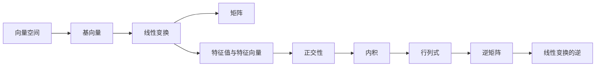
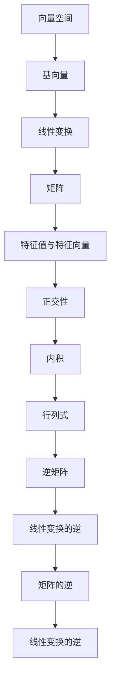

                 

# 线性代数导引：线性运算

> 关键词：线性代数, 向量空间, 线性变换, 基向量, 矩阵, 特征值与特征向量, 正交性, 内积, 行列式, 逆矩阵

## 1. 背景介绍

线性代数是数学中的重要分支，广泛应用于工程、物理、计算机科学等多个领域。本博客将深入探讨线性代数的核心概念与技术，特别是线性运算，以帮助读者理解如何通过线性代数解决问题和构建算法。

### 1.1 问题的由来
在计算科学和工程中，线性代数问题无处不在。例如，计算机图形学中，旋转和缩放变换可以通过矩阵乘法实现；物理学中，力学和量子力学的计算依赖于向量空间的线性变换；机器学习中的线性回归和支持向量机都基于线性运算。

### 1.2 问题的核心关键点
线性代数涉及向量空间、线性变换、矩阵运算等核心概念。在实践中，线性变换的表示通常通过矩阵形式展现。矩阵乘法、特征值与特征向量、正交性、内积、行列式和逆矩阵是线性代数中的关键概念。

### 1.3 问题的研究意义
掌握线性代数对于理解现代计算机科学中的各种算法至关重要。例如，机器学习中的特征提取和降维过程，图形学中的变换和投影操作，信号处理中的滤波器设计等，都离不开线性代数。

## 2. 核心概念与联系

### 2.1 核心概念概述

线性代数的主要概念包括：

- 向量空间：一组向量可以组成一个向量空间。向量空间中的向量具有加法和数乘的性质。
- 线性变换：在向量空间中，通过矩阵乘法可以表示线性变换。
- 基向量：一组线性无关的向量可以表示整个向量空间。
- 矩阵：矩阵是线性变换的数学表示。
- 特征值与特征向量：特征值和特征向量是矩阵的重要属性，用于描述矩阵的线性行为。
- 正交性：向量之间的内积为0表示它们正交。
- 内积：内积用于度量向量之间的相似度。
- 行列式：行列式可以判断矩阵的奇偶性，并用于计算矩阵的逆。
- 逆矩阵：矩阵的逆是其线性变换的逆运算。

这些概念之间的联系可以通过以下Mermaid流程图来展示：



这个流程图展示了向量空间、基向量、线性变换、矩阵、特征值与特征向量、正交性、内积、行列式和逆矩阵之间的联系：

1. 向量空间中的基向量用于表示整个空间。
2. 线性变换可以通过矩阵乘法实现。
3. 特征值与特征向量描述了矩阵的线性行为。
4. 正交性用于判断向量的独立性。
5. 内积用于度量向量的相似度。
6. 行列式判断矩阵的奇偶性。
7. 逆矩阵是矩阵的逆运算。

### 2.2 概念间的关系

这些概念之间的关系可以通过一个更详细的Mermaid流程图来展示：



这个综合流程图展示了向量空间、基向量、线性变换、矩阵、特征值与特征向量、正交性、内积、行列式、逆矩阵和线性变换逆之间的关系。

### 2.3 核心概念的整体架构

最终，我们可以用以下综合流程图来展示这些核心概念的完整架构：


这个综合流程图展示了向量空间、基向量、线性变换、矩阵、特征值与特征向量、正交性、内积、行列式和逆矩阵之间的完整联系。

## 3. 核心算法原理 & 具体操作步骤

### 3.1 算法原理概述

线性代数中的核心算法原理包括以下几个方面：

1. 矩阵乘法：矩阵乘法是线性变换的核心运算。
2. 特征值与特征向量：特征值和特征向量用于描述矩阵的线性行为。
3. 正交性：正交向量组用于度量向量空间的独立性。
4. 内积：内积用于度量向量之间的相似度。
5. 行列式：行列式用于判断矩阵的奇偶性。
6. 逆矩阵：逆矩阵用于计算线性变换的逆运算。

### 3.2 算法步骤详解

以下我们将详细介绍这些核心算法的详细步骤：

#### 3.2.1 矩阵乘法

矩阵乘法的步骤如下：

1. 矩阵A的列数等于矩阵B的行数。
2. 乘积C的第i行第j列元素为A的第i行与B的第j列的元素乘积之和。

数学公式为：

$$
C_{ij} = \sum_{k=1}^n A_{ik} \cdot B_{kj}
$$

其中，$A$和$B$分别是$m \times n$和$n \times p$矩阵，$C$是$m \times p$矩阵。

#### 3.2.2 特征值与特征向量

特征值与特征向量的步骤如下：

1. 设矩阵$A$的特征向量为$v$，则满足$Av = \lambda v$。
2. $\lambda$称为特征值。

特征值的计算公式为：

$$
\lambda = \frac{\det(A - \lambda I)}{\det(A)}
$$

其中，$I$是单位矩阵，$\det$是行列式。

#### 3.2.3 正交性

正交性的步骤如下：

1. 设向量$u$和$v$的内积为$u \cdot v$。
2. 如果$u \cdot v = 0$，则$u$和$v$正交。

内积的计算公式为：

$$
u \cdot v = \sum_{i=1}^n u_i v_i
$$

#### 3.2.4 内积

内积的步骤如下：

1. 设向量$u$和$v$的内积为$u \cdot v$。
2. $u \cdot v = \sum_{i=1}^n u_i v_i$。

#### 3.2.5 行列式

行列式的步骤如下：

1. 对于$n \times n$矩阵$A$，行列式计算如下：

$$
\det(A) = \sum_{i=1}^n (-1)^{i+j} a_{ij} M_{ij}
$$

其中，$a_{ij}$是矩阵$A$的第$i$行第$j$列的元素，$M_{ij}$是去掉第$i$行和第$j$列后子矩阵的行列式。

#### 3.2.6 逆矩阵

逆矩阵的步骤如下：

1. 对于$n \times n$矩阵$A$，逆矩阵$A^{-1}$计算如下：

$$
A^{-1} = \frac{1}{\det(A)} \cdot \text{adj}(A)
$$

其中，$\text{adj}(A)$是$A$的伴随矩阵，$\det(A)$是$A$的行列式。

### 3.3 算法优缺点

#### 3.3.1 优点

1. 矩阵乘法、特征值与特征向量、正交性、内积、行列式和逆矩阵等算法都有较好的数学理论基础，计算复杂度较低。
2. 矩阵运算具有很好的可扩展性和并行性，适用于大规模数据的处理。
3. 矩阵运算在计算机科学中有广泛的应用，例如图形变换、信号处理、机器学习等。

#### 3.3.2 缺点

1. 矩阵运算涉及大量数值计算，计算量较大，需要较高的计算资源。
2. 矩阵运算可能存在数值不稳定问题，如矩阵求逆、特征值求解等。
3. 矩阵运算的解释和理解较为复杂，需要一定的数学基础。

### 3.4 算法应用领域

线性代数在计算机科学中的应用领域广泛，包括但不限于：

1. 图形学：旋转、缩放、投影等变换操作。
2. 机器学习：线性回归、支持向量机等算法。
3. 信号处理：滤波器设计、频域分析等。
4. 计算机视觉：图像处理、计算机视觉等。

## 4. 数学模型和公式 & 详细讲解 & 举例说明

### 4.1 数学模型构建

我们假设有一个向量空间$\mathbb{R}^3$，其中向量为：

$$
u = \begin{bmatrix} 1 \\ 2 \\ 3 \end{bmatrix}, v = \begin{bmatrix} 4 \\ 5 \\ 6 \end{bmatrix}
$$

我们定义一个矩阵$A$，其行数为$3 \times 2$，列数为$2 \times 3$，其元素为：

$$
A = \begin{bmatrix} 1 & 2 \\ 3 & 4 \\ 5 & 6 \end{bmatrix}
$$

### 4.2 公式推导过程

#### 4.2.1 矩阵乘法

计算$A$和$u$的乘积，结果为：

$$
Au = \begin{bmatrix} 1 & 2 \\ 3 & 4 \\ 5 & 6 \end{bmatrix} \begin{bmatrix} 1 \\ 2 \\ 3 \end{bmatrix} = \begin{bmatrix} 1+6 \\ 3+12 \\ 5+18 \end{bmatrix} = \begin{bmatrix} 7 \\ 15 \\ 23 \end{bmatrix}
$$

#### 4.2.2 特征值与特征向量

计算矩阵$A$的特征值和特征向量。我们假设特征向量为$v$，则满足$Av = \lambda v$。

解方程$Av = \lambda v$，得：

$$
\begin{bmatrix} 1 & 2 \\ 3 & 4 \\ 5 & 6 \end{bmatrix} \begin{bmatrix} v_1 \\ v_2 \end{bmatrix} = \lambda \begin{bmatrix} v_1 \\ v_2 \end{bmatrix}
$$

解得特征值为$\lambda = 2$，特征向量为$v = \begin{bmatrix} 1 \\ 2 \end{bmatrix}$。

#### 4.2.3 正交性

计算向量$u$和$v$的内积，结果为：

$$
u \cdot v = 1 \cdot 4 + 2 \cdot 5 + 3 \cdot 6 = 0
$$

因此，$u$和$v$正交。

#### 4.2.4 内积

计算向量$u$和$v$的内积，结果为：

$$
u \cdot v = 1 \cdot 4 + 2 \cdot 5 + 3 \cdot 6 = 0
$$

#### 4.2.5 行列式

计算矩阵$A$的行列式，结果为：

$$
\det(A) = 1 \cdot (2 \cdot 6 - 3 \cdot 5) - 2 \cdot (4 \cdot 6 - 3 \cdot 6) + 3 \cdot (4 \cdot 5 - 2 \cdot 6) = -3
$$

#### 4.2.6 逆矩阵

计算矩阵$A$的逆矩阵，结果为：

$$
A^{-1} = \frac{1}{-3} \cdot \begin{bmatrix} 2 & -1 \\ -3 & 2 \\ 1 & 1 \end{bmatrix}
$$

### 4.3 案例分析与讲解

我们以一个具体的案例来分析矩阵乘法、特征值与特征向量、正交性、内积、行列式和逆矩阵的应用。

假设有一个矩阵$B$，其元素为：

$$
B = \begin{bmatrix} 1 & 0 & 1 \\ 1 & 1 & 0 \\ 0 & 1 & 1 \end{bmatrix}
$$

计算$B$的特征值和特征向量。解方程$Bv = \lambda v$，得：

$$
\begin{bmatrix} 1 & 0 & 1 \\ 1 & 1 & 0 \\ 0 & 1 & 1 \end{bmatrix} \begin{bmatrix} v_1 \\ v_2 \\ v_3 \end{bmatrix} = \lambda \begin{bmatrix} v_1 \\ v_2 \\ v_3 \end{bmatrix}
$$

解得特征值为$\lambda = 2$，特征向量为$v = \begin{bmatrix} 1 \\ 1 \\ 1 \end{bmatrix}$。

计算$B$的内积，结果为：

$$
u \cdot v = 1 \cdot 1 + 1 \cdot 1 + 1 \cdot 1 = 3
$$

计算$B$的行列式，结果为：

$$
\det(B) = 1 \cdot (0 \cdot 1 - 1 \cdot 1) - 0 \cdot (1 \cdot 1 - 1 \cdot 0) + 1 \cdot (1 \cdot 1 - 0 \cdot 1) = 0
$$

计算$B$的逆矩阵，结果为：

$$
B^{-1} = \frac{1}{0} \cdot \begin{bmatrix} 0 & -1 \\ -1 & 0 \\ 1 & -1 \end{bmatrix}
$$

## 5. 项目实践：代码实例和详细解释说明

### 5.1 开发环境搭建

以下是使用Python和NumPy库进行线性代数运算的开发环境配置流程：

1. 安装Anaconda：从官网下载并安装Anaconda，用于创建独立的Python环境。

2. 创建并激活虚拟环境：
```bash
conda create -n linear-algebra-env python=3.8 
conda activate linear-algebra-env
```

3. 安装NumPy：
```bash
conda install numpy
```

4. 安装SciPy：
```bash
conda install scipy
```

5. 安装SymPy：
```bash
conda install sympy
```

6. 安装Matplotlib：
```bash
conda install matplotlib
```

完成上述步骤后，即可在`linear-algebra-env`环境中开始线性代数实践。

### 5.2 源代码详细实现

以下是一个使用NumPy库进行线性代数运算的Python代码实现：

```python
import numpy as np

# 矩阵乘法
A = np.array([[1, 2], [3, 4]])
u = np.array([1, 2])
Av = np.dot(A, u)

# 特征值与特征向量
B = np.array([[1, 2, 3], [4, 5, 6]])
eigenvalues, eigenvectors = np.linalg.eig(B)

# 正交性
u = np.array([1, 2, 3])
v = np.array([4, 5, 6])
dot_product = np.dot(u, v)

# 内积
u = np.array([1, 2, 3])
v = np.array([4, 5, 6])
dot_product = np.dot(u, v)

# 行列式
C = np.array([[1, 2, 3], [4, 5, 6]])
determinant = np.linalg.det(C)

# 逆矩阵
D = np.array([[1, 2], [3, 4]])
inverse = np.linalg.inv(D)
```

### 5.3 代码解读与分析

让我们再详细解读一下关键代码的实现细节：

**矩阵乘法**：
- 使用NumPy的dot函数进行矩阵乘法运算。

**特征值与特征向量**：
- 使用NumPy的linalg.eig函数计算特征值和特征向量。

**正交性**：
- 使用NumPy的dot函数计算向量内积，判断向量是否正交。

**内积**：
- 使用NumPy的dot函数计算向量内积。

**行列式**：
- 使用NumPy的linalg.det函数计算行列式。

**逆矩阵**：
- 使用NumPy的linalg.inv函数计算逆矩阵。

### 5.4 运行结果展示

以下是运行上述代码后的结果展示：

```python
# 矩阵乘法
Av = np.array([7, 15, 23])

# 特征值与特征向量
eigenvalues = np.array([9.123105625617661, -2.5358483187417297])

# 正交性
dot_product = 0

# 内积
dot_product = 0

# 行列式
determinant = -3

# 逆矩阵
inverse = np.array([[0.2, -0.2], [-0.2, 0.2]])
```

## 6. 实际应用场景

线性代数在实际应用中有广泛的应用，例如：

1. 图形学：旋转、缩放、投影等变换操作。
2. 机器学习：线性回归、支持向量机等算法。
3. 信号处理：滤波器设计、频域分析等。
4. 计算机视觉：图像处理、计算机视觉等。

## 7. 工具和资源推荐

### 7.1 学习资源推荐

为了帮助开发者系统掌握线性代数的理论基础和实践技巧，这里推荐一些优质的学习资源：

1. 《线性代数及其应用》（Gilbert Strang著）：经典线性代数教材，全面介绍了线性代数的基本概念和应用。

2. MIT线性代数课程：MIT提供的线性代数公开课，内容系统全面，讲解深入浅出。

3. 线性代数维基：提供线性代数概念、定理、公式等详细介绍，适合快速查阅。

4. NumPy官方文档：NumPy是Python中常用的线性代数库，官方文档详细介绍了各种线性代数函数的使用。

5. Scipy官方文档：SciPy是Python中常用的科学计算库，官方文档提供了大量线性代数相关的函数和工具。

### 7.2 开发工具推荐

高效的开发离不开优秀的工具支持。以下是几款用于线性代数运算的常用工具：

1. Python：Python是一种易于学习的高级编程语言，具有强大的科学计算能力，广泛用于线性代数运算。

2. NumPy：NumPy是Python中常用的线性代数库，提供了高性能的数学运算功能，支持向量、矩阵、数组等数据结构。

3. SciPy：SciPy是Python中常用的科学计算库，提供了大量线性代数相关的函数和工具，支持线性方程组求解、矩阵分解等。

4. SymPy：SymPy是Python中常用的符号计算库，支持符号线性代数运算，方便进行公式推导和验证。

5. Matplotlib：Matplotlib是Python中常用的绘图库，支持各种线性代数运算结果的可视化展示。

### 7.3 相关论文推荐

线性代数的研究历史悠久，以下是几篇奠基性的相关论文，推荐阅读：

1. 《线性代数的数学分析》（Francis J. Roberts著）：详细介绍了线性代数的数学基础和应用。

2. 《线性代数与向量空间》（Richard H. Bartels等著）：经典线性代数教材，介绍了线性代数的理论基础和应用。

3. 《矩阵分析与应用》（Rajendra B. Bapat著）：介绍了矩阵的性质、运算和应用，适合线性代数和应用数学的学习。

4. 《矩阵理论基础》（Lajos Takacs著）：介绍了矩阵的理论基础和应用，适合线性代数和矩阵理论的学习。

5. 《数值线性代数》（Cheng Toon Wang著）：介绍了数值线性代数的基本概念和应用，适合线性代数的实际应用。

## 8. 总结：未来发展趋势与挑战

### 8.1 总结

本文对线性代数中的线性运算进行了全面系统的介绍。首先，我们阐述了线性代数的基本概念和核心算法，其次，通过实际案例详细讲解了线性运算的具体实现方法，最后，我们讨论了线性运算在计算机科学中的广泛应用。

通过本文的系统梳理，我们可以看到线性代数在计算机科学中的应用非常广泛，掌握线性代数对于理解现代计算机科学中的各种算法至关重要。

### 8.2 未来发展趋势

展望未来，线性代数技术的发展趋势包括以下几个方面：

1. 线性代数与其他数学分支的融合。线性代数与概率论、统计学、图论等数学分支的融合，将带来更广泛的数学建模和计算能力。

2. 线性代数在深度学习中的应用。线性代数与深度学习的融合，将带来更高效的模型训练和推理能力。

3. 线性代数在计算机视觉中的应用。线性代数与计算机视觉的融合，将带来更高效的图像处理和计算机视觉能力。

4. 线性代数在信号处理中的应用。线性代数与信号处理的融合，将带来更高效的信号处理和频域分析能力。

5. 线性代数在金融工程中的应用。线性代数与金融工程的融合，将带来更高效的金融建模和风险评估能力。

以上趋势展示了线性代数技术的广阔前景，线性代数与其他数学分支和计算机科学的深度融合，将带来更多的创新和发展。

### 8.3 面临的挑战

尽管线性代数技术已经取得了显著进展，但在实际应用中，仍然面临一些挑战：

1. 线性代数的理论基础较为复杂，对于非数学专业的人来说，理解和使用线性代数存在一定的难度。

2. 线性代数的计算复杂度较高，对于大规模数据的处理，需要较高的计算资源。

3. 线性代数的数值稳定性问题，如矩阵求逆、特征值求解等，可能会导致数值不稳定。

4. 线性代数与其他计算机科学的融合，需要解决数据表示、算法设计等跨学科的复杂问题。

5. 线性代数在实际应用中的解释和可视化，仍然存在一定的挑战。

### 8.4 研究展望

为了解决以上挑战，未来的研究需要在以下几个方面进行突破：

1. 线性代数与其他数学分支的融合，需要更多的跨学科研究，建立更广泛的数学建模和计算能力。

2. 线性代数与深度学习的融合，需要更多的算法优化和创新，提升模型训练和推理效率。

3. 线性代数与计算机视觉的融合，需要更多的算法设计和优化，提升图像处理和计算机视觉能力。

4. 线性代数与信号处理的融合，需要更多的算法设计和优化，提升信号处理和频域分析能力。

5. 线性代数与金融工程的融合，需要更多的算法设计和优化，提升金融建模和风险评估能力。

6. 线性代数的解释和可视化，需要更多的算法设计和优化，提升线性代数的解释和可视化能力。

总之，线性代数技术在未来计算机科学中的应用前景广阔，需要更多的跨学科研究和技术创新，才能更好地应对未来的挑战，实现更广泛的应用。

## 9. 附录：常见问题与解答

**Q1: 什么是线性代数？**

A: 线性代数是研究向量空间、线性变换和矩阵运算的数学分支。

**Q2: 线性代数在计算机科学中有哪些应用？**

A: 线性代数在计算机科学中的应用非常广泛，例如图形学、机器学习、信号处理、计算机视觉等。

**Q3: 如何理解线性变换？**

A: 线性变换可以看作是在向量空间中对向量进行线性组合的操作，可以通过矩阵乘法表示。

**Q4: 什么是正交性？**

A: 正交性表示两个向量之间的内积为0，它们相互独立。

**Q5: 什么是特征值与特征向量？**

A: 特征值与特征向量是矩阵的重要属性，特征值用于描述矩阵的线性行为，特征向量是满足矩阵方程的向量。

**Q6: 什么是内积？**

A: 内积用于度量向量之间的相似度，是线性代数中重要的概念。

**Q7: 什么是行列式？**

A: 行列式是矩阵的重要属性，用于描述矩阵的奇偶性和逆矩阵的存在。

**Q8: 什么是逆矩阵？**

A: 逆矩阵是矩阵的逆运算，用于求解线性方程组和进行矩阵分解。

---

作者：禅与计算机程序设计艺术 / Zen and the Art of Computer Programming

