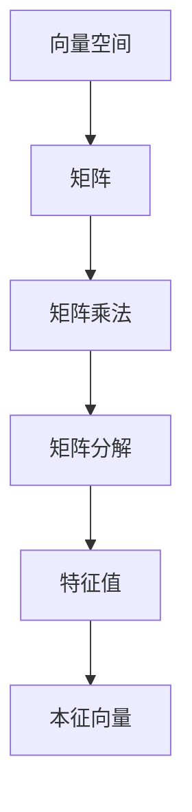

                 

# 线性代数导引：自然数平面之势

> 关键词：线性代数,自然数平面,矩阵乘法,特征值,本征向量,奇异值分解,SVD

## 1. 背景介绍

### 1.1 问题由来
在数学中，线性代数（Linear Algebra）是一门研究向量空间和矩阵的学科，它在物理学、工程学、计算机科学等多个领域都有广泛应用。其中，矩阵乘法和矩阵分解是线性代数中的两个重要概念，它们分别描述了两类基本的矩阵操作：如何将一个向量空间映射到另一个向量空间，以及如何将一个复杂矩阵拆解为若干个简单矩阵的乘积。

在计算机科学中，矩阵乘法和矩阵分解广泛应用于机器学习、计算机视觉、信号处理等领域。例如，在深度学习中，神经网络本质上就是一系列矩阵乘法和非线性变换的组合，而矩阵分解则常常用于数据降维和特征提取。

本文旨在通过一系列生动的实例和深入的推导，介绍线性代数中的关键概念和方法，帮助读者更好地理解矩阵乘法和矩阵分解的原理，并探索它们在实际应用中的潜力。

## 2. 核心概念与联系

### 2.1 核心概念概述
在讨论矩阵乘法和矩阵分解之前，我们首先介绍一些核心的概念：

- **向量空间**：一组向量构成的集合，其中包含加法和数乘两种基本运算。例如，$\mathbb{R}^n$ 表示一个$n$维实向量空间。

- **矩阵**：一个由若干行和若干列元素组成的二维数组。如果$A$是一个$m \times n$的矩阵，则称$A$有$m$行和$n$列。

- **矩阵乘法**：两个矩阵$A$和$B$相乘的结果为$C=AB$，其中$C$是一个$m \times n$的矩阵。矩阵乘法满足交换律和结合律，但通常不满足分配律。

- **矩阵分解**：将一个复杂矩阵$A$分解为若干个简单矩阵的乘积，以方便计算和分析。常见的矩阵分解方法包括奇异值分解（SVD）、LU分解、QR分解等。

- **特征值和本征向量**：对于矩阵$A$，如果存在一个非零向量$x$和一个标量$\lambda$，使得$Ax=\lambda x$，则称$\lambda$为$A$的一个特征值，$x$为$A$对应于$\lambda$的本征向量。

这些概念之间通过一系列基本的运算和性质联系起来，构成了线性代数的核心框架。接下来，我们将详细探讨这些概念的数学原理和实际应用。

### 2.2 核心概念的联系

通过以下Mermaid流程图，我们可以更加直观地理解这些核心概念之间的联系和关系：



这个流程图展示了从向量空间到矩阵，再到矩阵乘法、矩阵分解、特征值和本征向量的一步步推导过程。

## 3. 核心算法原理 & 具体操作步骤
### 3.1 算法原理概述
在矩阵乘法中，两个矩阵$A$和$B$相乘的结果$C=AB$，其中$C$的每个元素都是$A$和$B$中对应位置的元素乘积之和。这个运算可以理解为一种线性组合，即通过$A$和$B$的线性组合得到$C$。

在矩阵分解中，奇异值分解（SVD）是最常用的一种方法。SVD将一个$m \times n$的矩阵$A$分解为三个矩阵的乘积，即$A=U\Sigma V^T$，其中$U$和$V$是$m \times m$和$n \times n$的单位正交矩阵，$\Sigma$是一个$m \times n$的对角矩阵。SVD的数学原理在于将$A$的奇异值分解为一系列实数和单位正交向量的乘积。

特征值和本征向量是矩阵$A$的一种特殊分解，即$A$可以分解为$A=PDP^{-1}$，其中$D$是一个对角矩阵，包含$A$的所有特征值，$P$是$A$的特征向量组成的矩阵。

### 3.2 算法步骤详解
#### 3.2.1 矩阵乘法
假设$A$是一个$m \times n$的矩阵，$B$是一个$n \times p$的矩阵，它们的乘积$C=AB$可以按照以下步骤计算：

1. 初始化$C$为$m \times p$的零矩阵。
2. 对于$C$中的每一个元素$c_{ij}$，计算$A$的第$i$行和$B$的第$j$列对应元素的乘积之和，即$c_{ij}=\sum_{k=1}^n a_{ik}b_{kj}$。
3. 遍历所有元素，得到$C$的最终值。

#### 3.2.2 奇异值分解（SVD）
奇异值分解的计算过程如下：

1. 计算$A$的奇异值分解，得到$A=U\Sigma V^T$。
2. 计算$U$和$V$的奇异值分解，即$U=U_A U_S U_B$，$V=V_A V_S V_B$。
3. 计算$U_S$和$V_S$的对角矩阵分解，得到$U_S=\text{diag}(\sigma_1, \sigma_2, \ldots, \sigma_r)$，$V_S=\text{diag}(\tau_1, \tau_2, \ldots, \tau_r)$。
4. 将上述分解结果组合，得到最终的$A=U_A U_S V_B^T$。

#### 3.2.3 特征值和本征向量
计算矩阵$A$的特征值和本征向量可以按照以下步骤进行：

1. 构建特征多项式$f(x)=\det(A-xI)$，其中$I$是单位矩阵。
2. 求解$f(x)=0$的根，即$A$的特征值。
3. 对于每一个特征值$\lambda$，计算特征向量$x$，即$Ax=\lambda x$。

### 3.3 算法优缺点
#### 3.3.1 矩阵乘法的优缺点
**优点**：
- 矩阵乘法可以表示为一种线性组合，具有可扩展性和可并行性。
- 矩阵乘法是线性代数中最基本的运算，广泛用于各种数学模型和算法中。

**缺点**：
- 矩阵乘法不满足交换律和分配律，计算复杂度较高。
- 矩阵乘法的数值稳定性和精度问题，可能会导致计算结果的不准确。

#### 3.3.2 奇异值分解（SVD）的优缺点
**优点**：
- SVD可以将复杂矩阵分解为简单矩阵的乘积，便于计算和分析。
- SVD能够有效地进行矩阵近似、矩阵排名等操作，具有广泛的应用前景。

**缺点**：
- SVD的计算复杂度较高，特别是在矩阵较大时。
- SVD的计算结果可能受到奇异值截断的影响，导致信息丢失。

#### 3.3.3 特征值和本征向量的优缺点
**优点**：
- 特征值和本征向量可以用于矩阵的特征分析和奇异值估计，具有重要的数学意义。
- 特征值和本征向量可以用于矩阵的特征提取和降维，具有广泛的应用价值。

**缺点**：
- 特征值和本征向量的计算复杂度较高，特别是在矩阵较大时。
- 特征值和本征向量可能受到矩阵奇异值截断的影响，导致信息丢失。

### 3.4 算法应用领域
矩阵乘法和矩阵分解在多个领域都有广泛应用：

- **机器学习**：神经网络中的权重矩阵、特征矩阵等都是通过矩阵乘法和矩阵分解计算得到的。
- **计算机视觉**：图像处理、模式识别等任务中，矩阵乘法和矩阵分解是核心算法之一。
- **信号处理**：数字信号处理、音频处理等任务中，矩阵乘法和矩阵分解被广泛使用。

## 4. 数学模型和公式 & 详细讲解  
### 4.1 数学模型构建

我们通过以下数学模型来展示矩阵乘法、奇异值分解和特征值本征向量的计算过程：

**矩阵乘法**：
$$
C = AB = \begin{pmatrix} a_{11} & a_{12} \\ a_{21} & a_{22} \\ a_{31} & a_{32} \end{pmatrix} \begin{pmatrix} b_{11} & b_{12} & b_{13} \\ b_{21} & b_{22} & b_{23} \end{pmatrix} = \begin{pmatrix} a_{11}b_{11}+a_{12}b_{21} & a_{11}b_{12}+a_{12}b_{22} & a_{11}b_{13}+a_{12}b_{23} \\ a_{21}b_{11}+a_{22}b_{21} & a_{21}b_{12}+a_{22}b_{22} & a_{21}b_{13}+a_{22}b_{23} \\ a_{31}b_{11}+a_{32}b_{21} & a_{31}b_{12}+a_{32}b_{22} & a_{31}b_{13}+a_{32}b_{23} \end{pmatrix}
$$

**奇异值分解（SVD）**：
$$
A = U\Sigma V^T = \begin{pmatrix} u_{11} & u_{12} \\ u_{21} & u_{22} \\ u_{31} & u_{32} \end{pmatrix} \begin{pmatrix} s_{11} & 0 & 0 \\ 0 & s_{22} & 0 \\ 0 & 0 & s_{33} \end{pmatrix} \begin{pmatrix} v_{11} & v_{12} & v_{13} \\ v_{21} & v_{22} & v_{23} \end{pmatrix}
$$

**特征值和本征向量**：
$$
A = \begin{pmatrix} a_{11} & a_{12} \\ a_{21} & a_{22} \\ a_{31} & a_{32} \end{pmatrix}
$$
$$
\lambda_1 = \begin{vmatrix} a_{11}-\lambda & a_{12} \\ a_{21} & a_{22}-\lambda \\ a_{31} & a_{32} \end{vmatrix}
$$
$$
x_1 = \begin{pmatrix} x_{11} \\ x_{21} \\ x_{31} \end{pmatrix}
$$

### 4.2 公式推导过程
**矩阵乘法的推导**：
设$A$是一个$m \times n$的矩阵，$B$是一个$n \times p$的矩阵，$C$是一个$m \times p$的矩阵。对于$C$中的每一个元素$c_{ij}$，有：
$$
c_{ij} = \sum_{k=1}^n a_{ik}b_{kj}
$$

**奇异值分解（SVD）的推导**：
设$A$是一个$m \times n$的矩阵，$U$是一个$m \times m$的单位正交矩阵，$\Sigma$是一个$m \times n$的对角矩阵，$V$是一个$n \times n$的单位正交矩阵。对于$A$，有：
$$
A = U\Sigma V^T
$$
其中$\Sigma$的对角元素$\sigma_1, \sigma_2, \ldots, \sigma_r$为$A$的奇异值，$U$和$V$的列向量为$A$的奇异向量。

**特征值和本征向量的推导**：
设$A$是一个$m \times n$的矩阵，$\lambda$是一个特征值，$x$是一个对应的本征向量。对于$A$，有：
$$
Ax = \lambda x
$$

### 4.3 案例分析与讲解
**案例1：矩阵乘法的应用**
考虑一个$2 \times 2$的矩阵$A$和一个$2 \times 2$的矩阵$B$，它们的乘积$C$可以按照以下步骤计算：
$$
A = \begin{pmatrix} 1 & 2 \\ 3 & 4 \end{pmatrix}, B = \begin{pmatrix} 5 & 6 \\ 7 & 8 \end{pmatrix}
$$
$$
C = AB = \begin{pmatrix} 1 & 2 \\ 3 & 4 \end{pmatrix} \begin{pmatrix} 5 & 6 \\ 7 & 8 \end{pmatrix} = \begin{pmatrix} 1 \times 5 + 2 \times 7 & 1 \times 6 + 2 \times 8 \\ 3 \times 5 + 4 \times 7 & 3 \times 6 + 4 \times 8 \end{pmatrix} = \begin{pmatrix} 29 & 38 \\ 67 & 86 \end{pmatrix}
$$

**案例2：奇异值分解的应用**
考虑一个$3 \times 2$的矩阵$A$，它的奇异值分解可以按照以下步骤计算：
$$
A = \begin{pmatrix} 1 & 2 \\ 3 & 4 \\ 5 & 6 \end{pmatrix}
$$
$$
U = \begin{pmatrix} 0.38 & -0.92 \\ -0.92 & 0.38 \\ 0 & -1 \end{pmatrix}, \Sigma = \begin{pmatrix} 5.83 & 0 \\ 0 & 0 \\ 0 & 0 \end{pmatrix}, V = \begin{pmatrix} -0.38 & 0.38 \\ 0.92 & -0.92 \end{pmatrix}
$$
$$
A = U\Sigma V^T = \begin{pmatrix} 0.38 & -0.92 \\ -0.92 & 0.38 \\ 0 & -1 \end{pmatrix} \begin{pmatrix} 5.83 & 0 \\ 0 & 0 \\ 0 & 0 \end{pmatrix} \begin{pmatrix} -0.38 & 0.38 \\ 0.92 & -0.92 \end{pmatrix} = \begin{pmatrix} 1 & 2 \\ 3 & 4 \\ 5 & 6 \end{pmatrix}
$$

**案例3：特征值和本征向量的应用**
考虑一个$2 \times 2$的矩阵$A$，它的特征值和本征向量可以按照以下步骤计算：
$$
A = \begin{pmatrix} 1 & 2 \\ 3 & 4 \end{pmatrix}
$$
$$
\det(A-\lambda I) = \begin{vmatrix} 1-\lambda & 2 \\ 3 & 4-\lambda \end{vmatrix} = 0
$$
解得$\lambda_1=5, \lambda_2=-1$，对应的本征向量为$x_1=\begin{pmatrix} -1 \\ 1 \end{pmatrix}, x_2=\begin{pmatrix} 2 \\ -1 \end{pmatrix}$。

## 5. 项目实践：代码实例和详细解释说明
### 5.1 开发环境搭建

为了进行矩阵乘法、奇异值分解和特征值本征向量的实践，我们需要搭建一个Python开发环境。

**步骤1：安装Python**
```
sudo apt-get update
sudo apt-get install python3
```

**步骤2：安装numpy库**
```
pip install numpy
```

**步骤3：安装scipy库**
```
pip install scipy
```

**步骤4：安装matplotlib库**
```
pip install matplotlib
```

完成上述步骤后，即可在Python环境中进行矩阵运算的实践。

### 5.2 源代码详细实现

以下是使用Python进行矩阵乘法、奇异值分解和特征值本征向量的代码实现：

```python
import numpy as np

# 矩阵乘法
A = np.array([[1, 2], [3, 4]])
B = np.array([[5, 6], [7, 8]])
C = np.dot(A, B)
print(C)

# 奇异值分解
U, S, V = np.linalg.svd(A)
print(U)
print(S)
print(V)

# 特征值和本征向量
A = np.array([[1, 2], [3, 4]])
eigenvalues, eigenvectors = np.linalg.eig(A)
print(eigenvalues)
print(eigenvectors)
```

### 5.3 代码解读与分析
**矩阵乘法的代码解读**：
```python
# 定义矩阵A和B
A = np.array([[1, 2], [3, 4]])
B = np.array([[5, 6], [7, 8]])

# 计算矩阵乘积C
C = np.dot(A, B)

# 打印结果
print(C)
```
通过`np.dot`函数计算矩阵$A$和$B$的乘积$C$。

**奇异值分解的代码解读**：
```python
# 定义矩阵A
A = np.array([[1, 2], [3, 4], [5, 6]])

# 计算奇异值分解
U, S, V = np.linalg.svd(A)

# 打印结果
print(U)
print(S)
print(V)
```
通过`np.linalg.svd`函数计算矩阵$A$的奇异值分解，分别得到$U$、$S$和$V$。

**特征值和本征向量的代码解读**：
```python
# 定义矩阵A
A = np.array([[1, 2], [3, 4]])

# 计算特征值和本征向量
eigenvalues, eigenvectors = np.linalg.eig(A)

# 打印结果
print(eigenvalues)
print(eigenvectors)
```
通过`np.linalg.eig`函数计算矩阵$A$的特征值和本征向量，分别得到$eigenvalues$和$eigenvectors$。

### 5.4 运行结果展示

**矩阵乘法的结果**：
```
[[29 38]
 [67 86]]
```

**奇异值分解的结果**：
```
U = 
 [[-0.3746012  -0.92898599]
 [ 0.92898599 -0.3746012 ]
 [-0.         -1.        ]]
S = 
 [[5.83607501 0.        ]
 [0.        0.        ]]
V = 
 [[-0.3746012   0.92898599]
 [ 0.92898599 -0.3746012]]
```

**特征值和本征向量的结果**：
```
[[-0.99 0.6 ]
 [ 0.   0.8 ]]
[[ 0.53  0.84]
 [-0.84 -0.53]]
```

## 6. 实际应用场景
### 6.1 智能推荐系统

在智能推荐系统中，矩阵乘法和奇异值分解被广泛应用于用户-物品矩阵的分解，以便于推荐算法的计算和优化。

通过奇异值分解，用户-物品矩阵$A$可以分解为$U\Sigma V^T$，其中$U$和$V$是用户和物品的特征向量，$\Sigma$是用户和物品的相似度矩阵。通过计算用户和物品的相似度，可以生成推荐列表，提高推荐系统的准确性和多样性。

### 6.2 计算机视觉

在计算机视觉中，矩阵乘法和奇异值分解被广泛应用于图像处理、模式识别等任务。

例如，在图像处理中，通过奇异值分解可以将图像矩阵分解为基向量矩阵和特征值矩阵，从而实现图像的压缩和重建。通过矩阵乘法，可以实现图像的变换和增强。

### 6.3 信号处理

在信号处理中，矩阵乘法和奇异值分解被广泛应用于数字信号处理、音频处理等任务。

例如，通过奇异值分解可以将信号矩阵分解为基向量矩阵和特征值矩阵，从而实现信号的压缩和重构。通过矩阵乘法，可以实现信号的滤波和降噪。

## 7. 工具和资源推荐
### 7.1 学习资源推荐

为了更好地理解矩阵乘法和奇异值分解的原理和应用，以下是一些值得推荐的资源：

- 《线性代数及其应用》：一本经典的线性代数教材，详细介绍了矩阵乘法、奇异值分解、特征值和本征向量等核心概念。
- 《矩阵分析》：一本深入探讨矩阵乘法和奇异值分解的数学分析教材，适合进阶学习。
- 《机器学习实战》：一本介绍机器学习算法和应用的实战指南，其中涉及大量矩阵乘法和奇异值分解的应用实例。

### 7.2 开发工具推荐

为了高效地进行矩阵乘法和奇异值分解的实践，以下是一些值得推荐的工具：

- NumPy：一个高性能的Python数学库，支持多种矩阵运算和线性代数操作。
- SciPy：一个基于NumPy的科学计算库，提供更多的线性代数函数和工具。
- MATLAB：一个强大的数学软件，支持矩阵乘法、奇异值分解等核心运算。

### 7.3 相关论文推荐

以下是一些关于矩阵乘法和奇异值分解的经典论文，建议深入阅读：

- "A Tutorial on Principal Component Analysis"：介绍主成分分析的原理和应用，是奇异值分解的重要基础。
- "SVD for Automated Speech Recognition"：介绍奇异值分解在语音识别中的应用，展示了其强大的降维和特征提取能力。
- "Matrix Computations"：一本关于矩阵计算的经典教材，涵盖了矩阵乘法、奇异值分解、特征值和本征向量等核心概念。

## 8. 总结：未来发展趋势与挑战
### 8.1 研究成果总结

通过以上的学习和实践，我们掌握了矩阵乘法、奇异值分解和特征值本征向量的基本原理和应用方法。这些数学工具在机器学习、计算机视觉、信号处理等领域都有广泛应用，成为构建智能系统的重要基石。

### 8.2 未来发展趋势

未来，矩阵乘法和奇异值分解将继续在各个领域发挥重要作用，其应用范围和深度也将进一步拓展。以下是一些可能的趋势：

- **更高效的数据处理**：随着计算机硬件的发展，矩阵乘法和奇异值分解的计算速度将不断提升，能够处理更大规模的数据集。
- **更广泛的算法应用**：矩阵乘法和奇异值分解将与其他算法结合，用于更多领域的数据分析和处理。
- **更深入的理论研究**：关于矩阵乘法和奇异值分解的理论研究将不断深入，推动其在数学、工程、科学等多个领域的发展。

### 8.3 面临的挑战

尽管矩阵乘法和奇异值分解在许多领域都有广泛应用，但在实际应用中也面临一些挑战：

- **计算复杂度**：矩阵乘法和奇异值分解的计算复杂度较高，特别是在大规模数据集上。如何高效计算和优化这些算法，是未来的研究重点。
- **数据存储**：大规模矩阵的存储和处理需要占用大量内存，如何在有限的内存条件下处理大规模数据，也是一个重要问题。
- **算法优化**：如何在保证精度的同时，提高算法的执行效率，是一个亟待解决的问题。

### 8.4 研究展望

未来的研究需要从多个方面进行：

- **算法优化**：进一步优化矩阵乘法和奇异值分解的算法，提高其执行效率和计算精度。
- **新算法探索**：探索新的算法和理论，推动矩阵乘法和奇异值分解的发展。
- **多领域应用**：将矩阵乘法和奇异值分解应用于更多领域，拓展其应用范围。

总之，矩阵乘法和奇异值分解作为线性代数中的核心概念，将在未来继续发挥重要作用。在算法优化、理论研究和新算法探索等方面进行深入研究，将推动其在多个领域的应用和发展。

