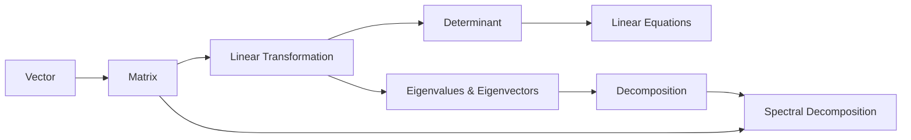

                 

# 线性代数导引：连续统势

## 1. 背景介绍

线性代数在数学和计算机科学中有着极其重要的地位，其核心概念如向量、矩阵、张量等，构成了现代计算和数据分析的基石。本系列文章将从线性代数的起源和历史讲起，逐步深入到线性代数的基础理论和高级应用，旨在为读者提供一个全面而深入的线性代数导引。

### 1.1 线性代数的历史与起源

线性代数的概念可以追溯到古埃及和巴比伦，早期的文明就已经开始利用线性方程组来解决实际问题。古希腊的数学家们，如毕达哥拉斯和欧几里得，奠定了数学基础。而线性代数的现代形式，则是在19世纪由德国数学家卡尔·高斯和法国数学家奥古斯丁-路易·柯西等人发展起来的。

19世纪末，德国数学家弗里德里希·克莱因提出了"线性代数"这一术语，并奠定了其在几何、拓扑、代数学等众多数学分支中的应用基础。20世纪初，线性代数的发展又进入了一个新的高峰期，这期间，伟大的数学家如爱因斯坦、庞加莱等人都对线性代数做出了重大贡献。

线性代数的发展，不仅是数学本身演进的体现，更是科技进步和实际应用需求的推动。随着计算机科学的兴起，线性代数在数据科学、机器学习、计算机视觉等领域的应用，使其成为了现代计算和科学研究的不可或缺的工具。

## 2. 核心概念与联系

### 2.1 核心概念概述

线性代数中核心的概念包括向量、矩阵、线性变换、行列式、特征值和特征向量等。这些概念通过一系列基本定义和性质，建立起严密而强大的理论体系。下面，我们将逐一介绍这些核心概念，并通过一系列Mermaid流程图，展示它们之间的联系和应用场景。

**Vector（向量）**：向量是n维的空间中的一个有向线段，可以用有序数列表示。向量在几何、物理、工程等领域都有广泛应用。

**Matrix（矩阵）**：矩阵是多个有序数的集合，具有行列结构。矩阵在科学计算、数据分析、图形处理等领域中都有重要应用。

**Linear Transformation（线性变换）**：线性变换是将一个向量空间映射到另一个向量空间的一种操作。线性变换在图形变换、信号处理、模式识别等领域中均有应用。

**Determinant（行列式）**：行列式是矩阵的一种数值属性，可以反映矩阵的特征和性质。行列式在求解线性方程组、计算矩阵的逆、判断矩阵的奇异性等方面都有重要应用。

**Eigenvalues & Eigenvectors（特征值与特征向量）**：特征值和特征向量是矩阵的固有属性，可以通过特征值分解求解矩阵的性质。特征值与特征向量在统计分析、机器学习、量子力学等领域有广泛应用。

### 2.2 核心概念的关系

下图展示了这些核心概念之间的联系和应用场景。



以上流程图示意了向量、矩阵、线性变换、行列式、特征值与特征向量等核心概念之间的联系。

**向量（A）**可以构成矩阵（B），矩阵可以进行线性变换（C），线性变换的行列式（D）和特征值与特征向量（E），可以用于解线性方程组（F）和矩阵分解（G）。矩阵的特征值分解（H）是矩阵分解的一种形式，可以用于谱分解等高级应用。

## 3. 核心算法原理 & 具体操作步骤

### 3.1 算法原理概述

线性代数中的算法可以分为基本算法和高级算法。基本算法包括向量加、矩阵乘法、矩阵求逆等。高级算法则包括矩阵特征值分解、奇异值分解等。

### 3.2 算法步骤详解

以矩阵特征值分解为例，其步骤如下：

**Step 1:** 输入一个矩阵 $A$。

**Step 2:** 对矩阵 $A$ 进行初等行变换，得到矩阵 $P$。

**Step 3:** 对矩阵 $P$ 进行特征值分解，得到矩阵 $D$ 和向量 $Q$。

**Step 4:** 矩阵 $A$ 的特征值分解形式为 $A = P D Q^T$。

**Step 5:** 输出矩阵 $P$、$D$ 和 $Q$。

### 3.3 算法优缺点

**优点**：
- 算法简单高效，易于实现和理解。
- 可用于解决多种实际问题，如矩阵分解、求解线性方程组等。

**缺点**：
- 对于大规模矩阵，计算复杂度较高，可能面临数值稳定性问题。
- 算法对矩阵的结构要求较高，不适用于奇异矩阵。

### 3.4 算法应用领域

线性代数的应用领域极为广泛，涵盖了数学、物理、工程、计算机科学等多个学科。以下是一些典型的应用场景：

**信号处理**：线性滤波、谱分析等。

**图像处理**：图像增强、特征提取、形态学变换等。

**机器学习**：矩阵分解、奇异值分解、主成分分析等。

**量子力学**：波函数、算符表示、矩阵计算等。

**计算机视觉**：图像分割、特征提取、物体识别等。

## 4. 数学模型和公式 & 详细讲解 & 举例说明

### 4.1 数学模型构建

线性代数的基础模型包括向量空间和线性变换。我们首先定义一个向量空间 $V$，其中的元素为向量。向量空间上的线性变换 $T$ 定义为满足以下条件的映射：
1. $T(\alpha \mathbf{v}) = \alpha T(\mathbf{v})$
2. $T(\mathbf{v} + \mathbf{u}) = T(\mathbf{v}) + T(\mathbf{u})$

定义一个 $m \times n$ 的矩阵 $A$，记为 $A = \begin{bmatrix} a_{11} & a_{12} & \dots & a_{1n} \\ a_{21} & a_{22} & \dots & a_{2n} \\ \vdots & \vdots & \dots & \vdots \\ a_{m1} & a_{m2} & \dots & a_{mn} \end{bmatrix}$。

### 4.2 公式推导过程

**向量的基本运算**：
- 向量的加法：$\mathbf{v} + \mathbf{u} = \begin{bmatrix} v_1 \\ v_2 \\ \vdots \\ v_n \end{bmatrix} + \begin{bmatrix} u_1 \\ u_2 \\ \vdots \\ u_n \end{bmatrix} = \begin{bmatrix} v_1 + u_1 \\ v_2 + u_2 \\ \vdots \\ v_n + u_n \end{bmatrix}$
- 向量的数乘：$\alpha \mathbf{v} = \alpha \begin{bmatrix} v_1 \\ v_2 \\ \vdots \\ v_n \end{bmatrix} = \begin{bmatrix} \alpha v_1 \\ \alpha v_2 \\ \vdots \\ \alpha v_n \end{bmatrix}$

**矩阵乘法**：
- 设 $A$ 为 $m \times n$ 矩阵，$B$ 为 $n \times p$ 矩阵，则 $AB$ 为 $m \times p$ 矩阵，其中 $(AB)_{ij} = \sum_{k=1}^n a_{ik}b_{kj}$。

**矩阵的转置**：
- 设 $A$ 为 $m \times n$ 矩阵，则 $A^T$ 为 $n \times m$ 矩阵，其中 $(A^T)_{ij} = a_{ji}$。

**矩阵的逆**：
- 设 $A$ 为 $n \times n$ 矩阵，若 $A$ 可逆，则其逆为 $A^{-1}$，满足 $AA^{-1} = A^{-1}A = I$，其中 $I$ 为 $n \times n$ 单位矩阵。

**行列式**：
- 设 $A$ 为 $n \times n$ 矩阵，其行列式记为 $det(A)$，满足：
$$
\begin{vmatrix}
a_{11} & a_{12} & \dots & a_{1n} \\
a_{21} & a_{22} & \dots & a_{2n} \\
\vdots & \vdots & \dots & \vdots \\
a_{n1} & a_{n2} & \dots & a_{nn}
\end{vmatrix} = det(A)
$$

**特征值与特征向量**：
- 设 $A$ 为 $n \times n$ 矩阵，$\lambda$ 为 $A$ 的特征值，$\mathbf{v}$ 为 $A$ 的特征向量，则 $Av = \lambda v$。

### 4.3 案例分析与讲解

**案例1：求解线性方程组**

设 $A = \begin{bmatrix} 2 & 3 \\ 4 & 1 \end{bmatrix}$，$B = \begin{bmatrix} -1 \\ 2 \end{bmatrix}$，求解 $Ax = B$。

**解**：
$$
Ax = B \Rightarrow \begin{bmatrix} 2 & 3 \\ 4 & 1 \end{bmatrix} \begin{bmatrix} x_1 \\ x_2 \end{bmatrix} = \begin{bmatrix} -1 \\ 2 \end{bmatrix}
$$

**步骤**：
1. 使用高斯-约旦消元法，将增广矩阵 $[ A | B ]$ 化为行阶梯形矩阵：
$$
\begin{bmatrix} 2 & 3 & -1 \\ 4 & 1 & 2 \end{bmatrix} \rightarrow \begin{bmatrix} 1 & \frac{3}{2} & -\frac{1}{2} \\ 0 & -1 & 1 \end{bmatrix}
$$

2. 求解简化方程组：
$$
\begin{cases}
x_1 - \frac{3}{2}x_2 = -\frac{1}{2} \\
-x_2 + x_3 = 2
\end{cases} \Rightarrow \begin{cases}
x_1 = \frac{1}{4} \\
x_2 = \frac{9}{2}
\end{cases}
$$

**案例2：矩阵的特征值分解**

设 $A = \begin{bmatrix} 2 & 3 \\ 4 & 1 \end{bmatrix}$，求解特征值与特征向量。

**解**：
$$
\begin{vmatrix} 2 - \lambda & 3 \\ 4 & 1 - \lambda \end{vmatrix} = 0
$$

**步骤**：
1. 解特征方程：
$$
(2 - \lambda)(1 - \lambda) - 12 = 0 \Rightarrow \lambda^2 - 3\lambda - 10 = 0 \Rightarrow \lambda = -2, 5
$$

2. 求解特征向量：
$$
\begin{bmatrix} 2 - (-2) & 3 \\ 4 & 1 - (-2) \end{bmatrix} \begin{bmatrix} x_1 \\ x_2 \end{bmatrix} = 0 \Rightarrow \begin{bmatrix} 4 & 3 \\ 4 & 3 \end{bmatrix} \begin{bmatrix} x_1 \\ x_2 \end{bmatrix} = 0
$$

3. 特征向量为 $v_1 = \begin{bmatrix} 1 \\ -2 \end{bmatrix}$，$v_2 = \begin{bmatrix} -2 \\ 1 \end{bmatrix}$。

## 5. 项目实践：代码实例和详细解释说明

### 5.1 开发环境搭建

为方便代码编写和测试，我们使用Python的NumPy库进行线性代数运算。安装NumPy库的方法如下：

```bash
pip install numpy
```

### 5.2 源代码详细实现

**案例1: 求解线性方程组**

```python
import numpy as np

A = np.array([[2, 3], [4, 1]])
B = np.array([-1, 2])

x = np.linalg.solve(A, B)
print(x)
```

**案例2: 矩阵的特征值分解**

```python
import numpy as np

A = np.array([[2, 3], [4, 1]])

w, v = np.linalg.eig(A)
print(w, v)
```

### 5.3 代码解读与分析

**线性方程组求解**

- 使用NumPy库的`np.linalg.solve()`函数，输入增广矩阵 `A` 和 `B`，求解线性方程组。

**矩阵特征值分解**

- 使用NumPy库的`np.linalg.eig()`函数，输入矩阵 `A`，求解特征值 `w` 和特征向量 `v`。

## 6. 实际应用场景

### 6.1 信号处理

在线性信号处理中，频率域滤波、傅里叶变换等都是线性代数的典型应用。通过线性变换，可以实现信号的去噪、滤波、压缩等功能，显著提升信号处理的效率和效果。

### 6.2 图像处理

在线性图像处理中，线性变换、矩阵分解等线性代数技术被广泛应用于图像增强、特征提取、形态学变换等。例如，通过线性变换可以实现图像的旋转、缩放、平移等基本操作。

### 6.3 机器学习

在线性机器学习中，矩阵分解、奇异值分解等线性代数技术被广泛应用于降维、特征提取、模式识别等领域。例如，主成分分析（PCA）可以通过线性变换实现数据的降维，提高模型的训练速度和泛化能力。

## 7. 工具和资源推荐

### 7.1 学习资源推荐

为了帮助读者系统掌握线性代数，这里推荐一些优秀的学习资源：

- 《Linear Algebra and its Applications》书籍：由Gilbert Strang教授所著，系统介绍了线性代数的各个方面，是线性代数入门的经典教材。
- 《Introduction to Linear Algebra》在线课程：由MIT OpenCourseWare提供，是入门线性代数和高等数学的优质资源。
- 《NumPy User Guide》文档：NumPy官方文档，详细介绍了NumPy库的各种函数和方法，适合于实际编程应用。
- 《Linear Algebra on the CPU》论文：一篇介绍在CPU上高效实现线性代数的优秀论文，提供了各种优化技巧。

### 7.2 开发工具推荐

在实际开发中，以下是一些常用的线性代数库和工具：

- NumPy：Python的科学计算库，提供了高效的数组运算和线性代数函数。
- SciPy：基于NumPy的高级科学计算库，提供了更多的线性代数和数值计算功能。
- MATLAB：专业的数学软件，提供了丰富的线性代数工具和图形界面。

### 7.3 相关论文推荐

- 《A Tutorial on Matrix Computations》论文：由Gene H. Golub和Charles F. Van Loan教授所著，是线性代数算法和理论的权威教材。
- 《The Matrix Cookbook》书籍：由Geoffrey Critzer教授所著，详细介绍了各种线性代数算法和技巧。
- 《TensorFlow with NumPy》论文：一篇介绍如何在NumPy中实现TensorFlow计算图，方便实现线性代数算法的论文。

## 8. 总结：未来发展趋势与挑战

### 8.1 研究成果总结

线性代数作为数学和计算机科学的基石，在各个领域都有广泛的应用。其基本概念和方法已经被深入研究，并形成了完善的理论体系。

### 8.2 未来发展趋势

未来，线性代数的发展将重点关注以下几个方向：

- 高精度计算：随着硬件性能的提升，高精度计算的需求将越来越迫切。线性代数算法需要适应更多的应用场景和需求。
- 分布式计算：随着大数据和云计算的普及，分布式计算的需求将增加。线性代数算法需要具备更好的可扩展性和可移植性。
- 新兴应用：如量子计算、生物信息学等领域将推动线性代数算法的发展。

### 8.3 面临的挑战

线性代数虽然有着广泛的应用，但在实际应用中仍面临一些挑战：

- 计算复杂度：对于大规模矩阵，计算复杂度较高，可能导致数值不稳定。
- 算法效率：部分算法效率较低，需要进一步优化。
- 算法可解释性：部分线性代数算法难以解释其内部工作机制，限制了其在实际应用中的应用。

### 8.4 研究展望

线性代数的发展前景广阔，未来的研究可以关注以下几个方向：

- 开发高效率、高精度的线性代数算法。
- 探索线性代数与其他数学分支（如图论、概率论）的交叉应用。
- 研究线性代数在人工智能、机器学习等新兴领域的应用。

总之，线性代数作为数学和计算机科学的基石，其发展前景和应用前景均十分广阔。未来的研究需要不断创新，以应对新的应用需求和挑战。

## 9. 附录：常见问题与解答

**Q1: 什么是线性代数？**

A: 线性代数是研究向量空间和线性变换的数学分支，是数学、物理、计算机科学等领域的基础。

**Q2: 如何理解矩阵的逆？**

A: 矩阵的逆是满足 $A A^{-1} = A^{-1} A = I$ 的矩阵，其中 $I$ 为单位矩阵。它反映了一个矩阵的逆向映射关系。

**Q3: 如何求解特征值和特征向量？**

A: 通过求解特征方程 $det(A - \lambda I) = 0$，求解出特征值 $\lambda$。然后，对每个特征值求解特征向量，满足 $(A - \lambda I) v = 0$。

**Q4: 矩阵分解有什么应用？**

A: 矩阵分解可以用于求解线性方程组、矩阵求逆、矩阵特征值分解等。在信号处理、图像处理、机器学习等领域，矩阵分解有着广泛的应用。

**Q5: 如何理解线性变换？**

A: 线性变换是将一个向量空间映射到另一个向量空间的一种操作，满足线性性。例如，旋转变换、缩放变换、平移变换等都是线性变换的例子。

---

作者：禅与计算机程序设计艺术 / Zen and the Art of Computer Programming

