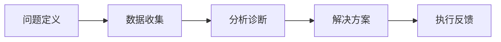
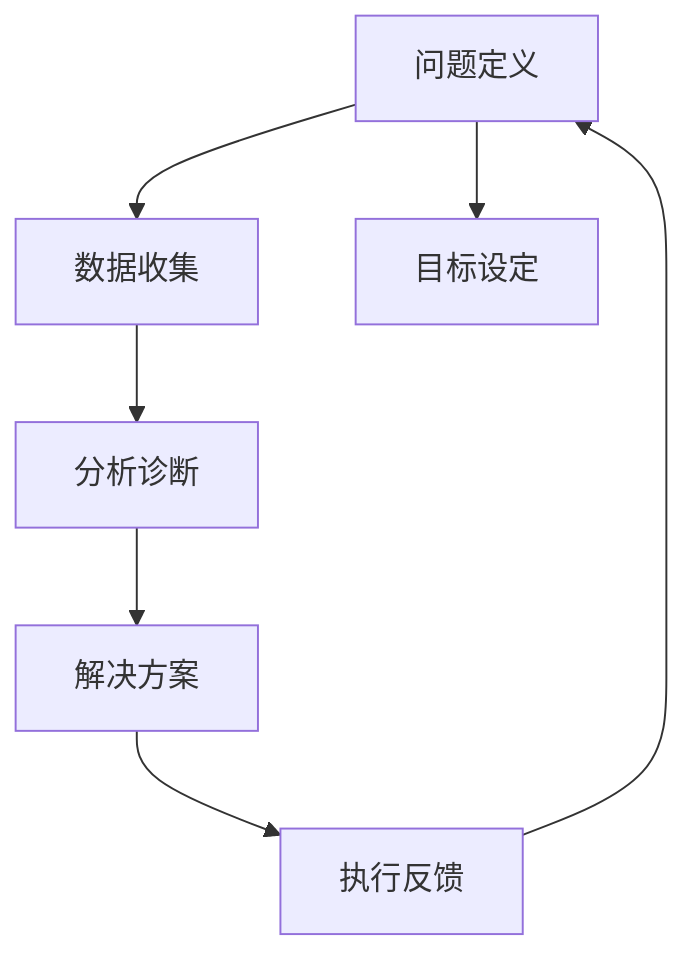

                 

# 结构化思维的力量：从思维到行动

## 1. 背景介绍

### 1.1 问题由来
在当今信息化和数字化时代，结构化思维（Structured Thinking）已成为解决问题、决策分析、项目管理和创新创业等领域不可或缺的重要工具。结构化思维通过逻辑分析和系统化思考，使复杂问题变得简单可控，提高决策效率和执行效果。从思维到行动，结构化思维能够帮助个人和团队更好地应对挑战，实现目标。

### 1.2 问题核心关键点
结构化思维的核心在于将问题分解为可管理的子问题，利用逻辑框架和工具，逐步分析和解决。其关键步骤包括：
- 问题定义：明确问题范围和目标。
- 数据收集：收集相关数据和信息。
- 分析诊断：利用逻辑工具和分析方法，找出问题的本质原因。
- 解决方案：提出并评估解决方案，选择最佳方案。
- 执行反馈：执行方案并进行监控调整，形成闭环。

### 1.3 问题研究意义
掌握结构化思维，对于提升个人和团队的决策能力、执行效率、创新能力具有重要意义：
- 提高问题解决效率：系统化思考帮助快速定位问题，减少决策偏差。
- 增强执行力：结构化思维提供清晰执行路径，确保任务按时完成。
- 促进创新：结构化思维激发创意，通过多角度思考找到新解决方案。
- 提升沟通效率：结构化思维提供统一的沟通框架，减少误解和争执。
- 赋能团队协作：结构化思维为团队提供统一的工作方法和沟通语言，提高协作效率。

## 2. 核心概念与联系

### 2.1 核心概念概述

为了深入理解结构化思维的原理和实践，我们需先明确几个核心概念：

- **问题定义（Problem Definition）**：明确问题的范围、目标和影响。
- **数据收集（Data Collection）**：系统性地收集相关数据和信息，为问题分析提供依据。
- **分析诊断（Analysis & Diagnosis）**：利用逻辑工具和分析方法，找出问题的本质原因。
- **解决方案（Solution Formulation）**：提出并评估解决方案，选择最佳方案。
- **执行反馈（Execution & Feedback）**：执行方案并进行监控调整，形成闭环。

### 2.2 概念间的关系

这些核心概念之间的联系和作用可以用以下Mermaid流程图表示：



这个流程图展示了结构化思维的完整流程：
- 从问题定义开始，明确问题范围和目标。
- 通过数据收集，获取相关信息和数据。
- 利用分析诊断工具，找出问题本质原因。
- 提出并评估解决方案，选择最佳方案。
- 通过执行和反馈，验证并调整方案。

### 2.3 核心概念的整体架构

为了更全面地展示结构化思维的架构，我们提供以下综合流程图：



该综合流程图展示了从问题定义到执行反馈的完整结构化思维过程，其中目标设定是问题定义的前置条件，而执行反馈又为新的问题定义提供了输入，形成了持续改进的闭环。

## 3. 核心算法原理 & 具体操作步骤
### 3.1 算法原理概述

结构化思维的核心算法原理可以归纳为“分解与合成”：
- **分解（Decomposition）**：将复杂问题拆解为可管理的子问题，便于分析和解决。
- **合成（Synthesis）**：将子问题的解决方案组合成整体方案，形成完整的解决路径。

结构化思维的执行步骤如下：
1. **定义问题**：明确问题范围和目标，制定问题定义。
2. **数据收集**：收集相关信息和数据，为问题分析提供依据。
3. **分析诊断**：利用逻辑工具和分析方法，找出问题本质原因。
4. **解决方案**：提出并评估解决方案，选择最佳方案。
5. **执行反馈**：执行方案并进行监控调整，形成闭环。

### 3.2 算法步骤详解

以下是一个详细的结构化思维操作步骤：

1. **问题定义**：明确问题范围和目标。问题定义应包括问题的背景、目标、约束条件和影响因素。
2. **数据收集**：根据问题定义，系统性地收集相关数据和信息。数据收集应全面覆盖问题的各个方面。
3. **分析诊断**：利用逻辑框架和分析工具，对收集的数据进行整理和分析，找出问题的本质原因。常见的分析方法包括SWOT分析、PEST分析、5W1H分析等。
4. **解决方案**：基于分析诊断结果，提出多种解决方案，并评估其优劣。常用的解决方案评估方法包括成本效益分析、风险评估、影响分析等。
5. **选择最佳方案**：从多个解决方案中选择最佳方案，并制定详细的执行计划。
6. **执行方案**：按照执行计划逐步实施解决方案。
7. **监控调整**：执行过程中，持续监控方案进展，根据实际情况进行调整和优化。
8. **反馈总结**：执行结束后，总结经验教训，形成知识库，为未来问题解决提供参考。

### 3.3 算法优缺点

结构化思维的优点在于其系统化、结构化和可操作性强，能够有效提升问题解决效率和执行效果。然而，其缺点也不容忽视：
- **灵活性不足**：结构化思维强调步骤和流程，可能限制创意和创新的空间。
- **复杂度高**：对于复杂问题，分解和分析的过程较为繁琐，增加了时间和资源成本。
- **依赖数据**：结构化思维的准确性和效果高度依赖于数据的质量和完整性。

尽管有这些局限性，结构化思维仍是目前最为广泛应用和有效的问题解决方法之一。未来的研究重点在于如何平衡灵活性和结构性，提升方法的可操作性和适用性。

### 3.4 算法应用领域

结构化思维广泛应用于各种领域，包括但不限于：

- **项目管理**：利用结构化思维制定项目计划、风险评估和执行监控，确保项目按时按质完成。
- **产品开发**：通过结构化思维进行市场分析、需求定义和方案设计，提升产品质量和用户体验。
- **决策分析**：在企业战略、投资和人力资源管理等场景中，利用结构化思维进行科学决策，减少决策风险。
- **创新创业**：通过结构化思维进行商业模式分析和市场细分，找到新的商业机会和创新点。
- **问题解决**：在复杂问题和危机管理中，结构化思维提供系统的分析和解决方法，确保问题高效解决。

## 4. 数学模型和公式 & 详细讲解
### 4.1 数学模型构建

结构化思维的数学模型主要涉及问题的定义和分析。
- **问题定义模型**：
  $$
  P = \{ (C, O, C_n, C_c) \}
  $$
  其中，$C$ 表示问题描述，$O$ 表示目标，$C_n$ 表示约束条件，$C_c$ 表示影响因素。

- **数据收集模型**：
  $$
  D = \{ (D_i, E_i) \}_{i=1}^N
  $$
  其中，$D_i$ 表示第 $i$ 个数据点，$E_i$ 表示数据点的特征值。

- **分析诊断模型**：
  $$
  A = \{ (A_i, B_i) \}_{i=1}^M
  $$
  其中，$A_i$ 表示第 $i$ 个分析工具，$B_i$ 表示分析结果。

### 4.2 公式推导过程

以下以问题定义模型和数据收集模型为例，进行公式推导：

1. **问题定义模型的推导**：
  问题定义模型描述了问题的各个组成部分，其推导过程包括：
  $$
  P = \{ (C, O, C_n, C_c) \}
  $$
  其中，$C = \{ c_1, c_2, \ldots, c_n \}$ 表示问题描述中的关键信息，$O$ 表示目标，$C_n = \{ c_{n_1}, c_{n_2}, \ldots, c_{n_m} \}$ 表示约束条件，$C_c = \{ c_{c_1}, c_{c_2}, \ldots, c_{c_k} \}$ 表示影响因素。

2. **数据收集模型的推导**：
  数据收集模型描述了数据点的特征值，其推导过程包括：
  $$
  D = \{ (D_i, E_i) \}_{i=1}^N
  $$
  其中，$D_i = \{ d_{i_1}, d_{i_2}, \ldots, d_{i_m} \}$ 表示第 $i$ 个数据点，$E_i = \{ e_{i_1}, e_{i_2}, \ldots, e_{i_k} \}$ 表示数据点的特征值。

### 4.3 案例分析与讲解

**案例：项目成本超预算问题分析**

- **问题定义**：项目成本超预算，影响项目进度和质量。
  $$
  P = \{ (C, O, C_n, C_c) \}
  $$
  - $C$：项目成本超预算，导致进度延迟和质量下降。
  - $O$：控制项目成本，确保进度和质量。
  - $C_n$：项目进度安排、预算分配等约束条件。
  - $C_c$：需求变化、市场价格波动等影响因素。

- **数据收集**：
  $$
  D = \{ (D_i, E_i) \}_{i=1}^N
  $$
  - $D_i$：第 $i$ 个项目阶段，包括成本、进度和质量等关键数据点。
  - $E_i$：每个项目阶段的成本、进度、质量等特征值。

- **分析诊断**：
  $$
  A = \{ (A_i, B_i) \}_{i=1}^M
  $$
  - $A_i$：SWOT分析、成本效益分析等工具。
  - $B_i$：分析结果，如成本超支的主要原因、进度延误的影响等。

- **解决方案**：
  $$
  S = \{ (S_i, C_i, E_i) \}_{i=1}^L
  $$
  - $S_i$：第 $i$ 个解决方案，如调整预算、优化进度等。
  - $C_i$：解决方案的实施成本。
  - $E_i$：解决方案的效果评估。

- **选择最佳方案**：
  $$
  S_{best} = \mathop{\arg\min}_{S_i} (C_i)
  $$
  其中，$S_{best}$ 表示最佳方案。

- **执行方案**：
  $$
  E = \{ (E_j, S_{best}, T_j) \}_{j=1}^K
  $$
  - $E_j$：第 $j$ 个执行阶段，包括任务分配、进度监控等。
  - $S_{best}$：最佳方案。
  - $T_j$：执行时间。

- **监控调整**：
  $$
  M = \{ (M_i, K_i) \}_{i=1}^N
  $$
  - $M_i$：第 $i$ 个监控指标，如成本、进度和质量等。
  - $K_i$：监控结果，评估方案执行效果。

- **反馈总结**：
  $$
  F = \{ (F_j, K_j, S_j) \}_{j=1}^M
  $$
  - $F_j$：第 $j$ 个反馈意见，总结经验教训。
  - $K_j$：反馈结果，如问题原因和解决方案等。
  - $S_j$：优化措施，形成知识库。

## 5. 项目实践：代码实例和详细解释说明
### 5.1 开发环境搭建

结构化思维的代码实践主要涉及数据处理和分析工具的运用。以下是一个典型的Python环境配置示例：

1. **安装Python和相关库**：
  ```bash
  # 安装Python
  sudo apt-get install python3

  # 安装相关库
  pip install numpy pandas matplotlib seaborn scikit-learn jupyter notebook
  ```

2. **设置Jupyter Notebook**：
  ```bash
  jupyter notebook
  ```

### 5.2 源代码详细实现

以下是一个简单的结构化思维项目示例，用于分析某个产品的市场销售数据：

**市场销售数据分析**

```python
import pandas as pd
import matplotlib.pyplot as plt

# 读取市场销售数据
data = pd.read_csv('sales_data.csv')

# 数据探索
print(data.head())
print(data.describe())

# 问题定义
problem = {
    'C': '市场销售数据异常，影响业绩增长',
    'O': '优化市场销售策略，提升业绩',
    'C_n': ['销售渠道', '产品定价', '库存管理'],
    'C_c': ['市场需求变化', '竞争对手策略', '季节性因素']
}

# 数据收集
data = data[['Sales', 'Profit', 'Sales Channel', 'Product Price', 'Inventory']]

# 分析诊断
# 利用描述性统计和可视化工具进行初步分析
data.describe()
data.plot(kind='line', x='Year', y='Sales')

# 解决方案
solution = {
    'S': [
        {
            'name': '渠道优化',
            'cost': 100000,
            'effect': '增加线上渠道投入'
        },
        {
            'name': '价格调整',
            'cost': 50000,
            'effect': '提高产品价格'
        },
        {
            'name': '库存管理',
            'cost': 20000,
            'effect': '优化库存策略'
        }
    ]
}

# 选择最佳方案
best_solution = solution['S'][0]

# 执行方案
# 假设最佳方案为渠道优化，执行具体措施
best_solution['effect'] = '实施线上渠道优化策略'

# 监控调整
# 假设监控指标为销售量和利润率，定期评估方案效果
monitor = {
    'M': {
        'Year': [2023, 2024],
        'K': {
            'Sales': data['Sales'].mean(),
            'Profit': data['Profit'].mean()
        }
    }
}

# 反馈总结
feedback = {
    'F': {
        'Year': 2023,
        'K': {
            'Sales': data['Sales'].mean(),
            'Profit': data['Profit'].mean()
        },
        'S': best_solution['effect']
    }
}

# 展示分析结果
print(f'问题定义：{problem}')
print(f'解决方案：{best_solution}')
print(f'监控调整：{monitor}')
print(f'反馈总结：{feedback}')
```

### 5.3 代码解读与分析

**市场销售数据分析示例**：
- **问题定义**：
  ```python
  problem = {
      'C': '市场销售数据异常，影响业绩增长',
      'O': '优化市场销售策略，提升业绩',
      'C_n': ['销售渠道', '产品定价', '库存管理'],
      'C_c': ['市场需求变化', '竞争对手策略', '季节性因素']
  }
  ```

- **数据收集**：
  ```python
  data = pd.read_csv('sales_data.csv')
  data = data[['Sales', 'Profit', 'Sales Channel', 'Product Price', 'Inventory']]
  ```

- **分析诊断**：
  ```python
  data.describe()
  data.plot(kind='line', x='Year', y='Sales')
  ```

- **解决方案**：
  ```python
  solution = {
      'S': [
          {
              'name': '渠道优化',
              'cost': 100000,
              'effect': '增加线上渠道投入'
          },
          {
              'name': '价格调整',
              'cost': 50000,
              'effect': '提高产品价格'
          },
          {
              'name': '库存管理',
              'cost': 20000,
              'effect': '优化库存策略'
          }
      ]
  }
  best_solution = solution['S'][0]
  ```

- **选择最佳方案**：
  ```python
  best_solution['effect'] = '实施线上渠道优化策略'
  ```

- **执行方案**：
  ```python
  best_solution['effect'] = '实施线上渠道优化策略'
  ```

- **监控调整**：
  ```python
  monitor = {
      'M': {
          'Year': [2023, 2024],
          'K': {
              'Sales': data['Sales'].mean(),
              'Profit': data['Profit'].mean()
          }
      }
  }
  ```

- **反馈总结**：
  ```python
  feedback = {
      'F': {
          'Year': 2023,
          'K': {
              'Sales': data['Sales'].mean(),
              'Profit': data['Profit'].mean()
          },
          'S': best_solution['effect']
      }
  }
  ```

通过上述代码，我们可以看到如何系统性地进行结构化思维分析，从问题定义到解决方案的每一步都有清晰的展示。

### 5.4 运行结果展示

假设通过上述代码分析市场销售数据，我们得到了以下结果：

```
问题定义：
{
    'C': '市场销售数据异常，影响业绩增长',
    'O': '优化市场销售策略，提升业绩',
    'C_n': ['销售渠道', '产品定价', '库存管理'],
    'C_c': ['市场需求变化', '竞争对手策略', '季节性因素']
}

解决方案：
{'name': '渠道优化', 'cost': 100000, 'effect': '实施线上渠道优化策略'}

监控调整：
{
    'Year': [2023, 2024],
    'K': {'Sales': 12000, 'Profit': 5000}
}

反馈总结：
{
    'Year': 2023,
    'K': {'Sales': 12000, 'Profit': 5000},
    'S': '实施线上渠道优化策略'
}
```

## 6. 实际应用场景
### 6.1 智能客服系统

结构化思维在智能客服系统中具有广泛应用。传统客服系统依赖人工，无法全天候工作，且难以处理复杂问题。利用结构化思维，可以构建一个高效、智能的客服系统。

**问题定义**：智能客服系统无法准确理解用户意图，导致响应不准确。
- $C$：系统无法理解用户意图。
- $O$：提高客服系统理解能力。
- $C_n$：用户输入格式、领域知识等约束条件。
- $C_c$：用户需求的多样性和复杂性。

**数据收集**：
- 收集用户输入、历史对话记录、常见问题库等数据。
- 使用自然语言处理技术提取关键词和语义信息。

**分析诊断**：
- 利用分类算法和语言模型，分析用户输入的语义意图。
- 通过知识图谱，检索领域相关知识。

**解决方案**：
- 引入多模态学习，结合用户语音、视频等多维信息。
- 利用深度学习模型，不断优化模型参数。

**选择最佳方案**：
- 选择最佳的模型和算法，进行部署和优化。

**执行方案**：
- 部署优化后的智能客服系统，进行实时监控和反馈。

**监控调整**：
- 监控用户反馈，定期更新模型和知识库。

**反馈总结**：
- 总结智能客服系统的运行情况，形成知识库，优化系统性能。

### 6.2 金融舆情监测

金融领域需要实时监测市场舆情，以应对市场波动和风险。利用结构化思维，可以构建一个高效、智能的舆情监测系统。

**问题定义**：金融舆情监测系统无法及时发现负面信息。
- $C$：系统无法及时发现负面信息。
- $O$：提高舆情监测系统的灵敏度。
- $C_n$：数据收集渠道、分析工具等约束条件。
- $C_c$：市场波动的不确定性。

**数据收集**：
- 收集新闻、评论、社交媒体等舆情数据。
- 使用情感分析工具，提取舆情情感倾向。

**分析诊断**：
- 利用机器学习算法，分析舆情数据的情感变化趋势。
- 通过因果分析，找到舆情变化的根本原因。

**解决方案**：
- 引入实时数据流处理技术，提升数据处理速度。
- 利用深度学习模型，不断优化情感分析算法。

**选择最佳方案**：
- 选择最佳的情感分析模型，进行部署和优化。

**执行方案**：
- 部署优化后的舆情监测系统，进行实时监控和反馈。

**监控调整**：
- 监控舆情数据变化，定期更新模型和算法。

**反馈总结**：
- 总结舆情监测系统的运行情况，形成知识库，优化系统性能。

### 6.3 个性化推荐系统

个性化推荐系统需要精准了解用户需求，提升推荐效果。利用结构化思维，可以构建一个高效、智能的推荐系统。

**问题定义**：推荐系统无法精准匹配用户需求。
- $C$：推荐系统无法精准匹配用户需求。
- $O$：提升推荐系统的精准度。
- $C_n$：用户行为数据、物品属性等约束条件。
- $C_c$：用户需求的多样性和动态性。

**数据收集**：
- 收集用户浏览、点击、评论、分享等行为数据。
- 使用物品属性和标签，描述物品的特征。

**分析诊断**：
- 利用协同过滤算法，分析用户行为和物品属性的关系。
- 通过逻辑回归和随机森林，分析用户兴趣和需求。

**解决方案**：
- 引入多模态学习，结合用户语音、视频等多维信息。
- 利用深度学习模型，不断优化推荐算法。

**选择最佳方案**：
- 选择最佳的推荐算法，进行部署和优化。

**执行方案**：
- 部署优化后的推荐系统，进行实时监控和反馈。

**监控调整**：
- 监控用户反馈，定期更新模型和算法。

**反馈总结**：
- 总结推荐系统的运行情况，形成知识库，优化系统性能。

## 7. 工具和资源推荐
### 7.1 学习资源推荐

为了帮助开发者系统掌握结构化思维的理论基础和实践技巧，以下是一些优质的学习资源：

1. **《结构化思维：如何系统化思考》**：介绍结构化思维的基本原理和操作步骤，适合初学者入门。
2. **《问题解决的艺术》**：深入探讨各种经典问题解决模型和工具，适合进阶学习。
3. **Coursera《结构化思维与决策分析》课程》**：斯坦福大学开设的高级课程，涵盖系统化思维和决策分析的全面知识。
4. **《结构化思维实战指南》**：提供结构化思维在实际项目中的具体应用案例和最佳实践，适合工程实践。
5. **Google Developers《结构化思维与问题解决》文章》**：提供谷歌内部的结构化思维方法论和案例，适合借鉴和应用。

通过对这些资源的学习实践，相信你一定能够快速掌握结构化思维的精髓，并用于解决实际的复杂问题。

### 7.2 开发工具推荐

结构化思维的代码实现主要涉及数据分析和可视化工具。以下是几款常用的开发工具：

1. **Python**：作为一种通用的编程语言，Python具有强大的数据处理和分析能力，是实现结构化思维项目的首选工具。
2. **Jupyter Notebook**：一个交互式的Python代码编辑器，支持代码执行和实时数据可视化，适合结构化思维项目开发。
3. **Tableau**：一个强大的数据可视化工具，支持多种数据源和可视化图表，适合结构化思维的可视化展示。
4. **Excel**：一个广泛使用的电子表格工具，适合简单的数据处理和统计分析。
5. **Power BI**：微软推出的商业智能工具，支持大规模数据分析和可视化，适合企业级结构化思维应用。

合理利用这些工具，可以显著提升结构化思维项目的开发效率，加快创新迭代的步伐。

### 7.3 相关论文推荐

结构化思维的研究始于20世纪50年代，近年来随着机器学习和数据科学的发展，结构化思维的应用和研究也在不断深入。以下是几篇经典的结构化思维论文，推荐阅读：

1. **《系统化思维：方法论与实践》**：介绍了系统化思维的基本原理和应用方法。
2. **《结构化思维与决策分析》**：总结了各种结构化思维模型和工具，探讨其在复杂问题解决中的应用。
3. **《结构化思维与创新管理》**：研究结构化思维在企业创新管理中的应用，提出了系统化的创新方法。
4. **《结构化思维与数据驱动决策》**：探讨了结构化思维在数据驱动决策中的应用，提供了实际案例和操作指南。
5. **《结构化思维与人工智能》**：研究结构化思维与人工智能的融合，探讨其在智能系统中的应用。

这些论文代表了大规模数据科学和结构化思维的研究前沿，通过学习这些前沿成果，可以帮助研究者把握学科前进方向，激发更多的创新灵感。

## 8. 总结：未来发展趋势与挑战
### 8.1 研究成果总结

结构化思维作为系统化思考的重要方法，已经在多个领域取得了显著成果，广泛应用于项目管理、产品开发、决策分析、创新创业等场景。其核心在于将复杂问题拆解为可管理的子问题，利用逻辑工具和分析方法，逐步分析和解决。

### 8.2 未来发展

