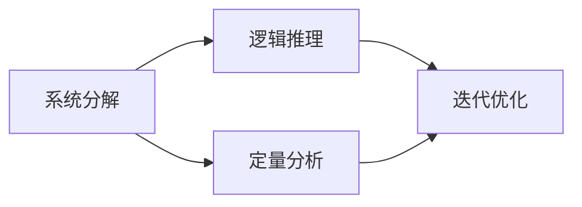

                 

# 结构化思维：从混沌到清晰

## 1. 背景介绍

### 1.1 问题由来

在信息爆炸的数字化时代，如何有效地从海量信息中提取有用知识，制定清晰的决策和规划，成为每个现代工作者都需要面对的挑战。现代管理思想逐步从混沌思维向结构化思维转变，强调从混乱中找到秩序，提升决策的科学性和效率。结构化思维（Structured Thinking）强调通过构建逻辑严密、层次分明的分析框架，从数据和信息中提炼出有价值的结论，指导决策。本文将围绕结构化思维的核心概念和方法展开，探讨如何在复杂环境中建立清晰、高效的分析思路，以及如何通过结构化分析解决实际问题。

### 1.2 问题核心关键点

结构化思维的核心理念是通过系统化的分析框架，将复杂问题分解为可管理的小部分，逐个分析和解决。核心关键点包括：

- **系统分解**：将复杂问题拆解为可操作的子问题，逐一解决。
- **逻辑推理**：通过严密的逻辑链条，确保每个子问题的解决方案是可靠的。
- **定量分析**：借助数据和数学模型，提升分析的精确度。
- **迭代优化**：在解决过程中不断反馈和调整，逐步逼近最优解。

## 2. 核心概念与联系

### 2.1 核心概念概述

结构化思维的核心概念包括系统分解、逻辑推理、定量分析和迭代优化。以下将对这几个概念进行详细阐述：

1. **系统分解（System Decomposition）**：将复杂问题拆解为可操作的子问题。每个子问题应具备独立性和可解决性。
2. **逻辑推理（Logical Reasoning）**：通过严密的逻辑链条，确保每个子问题的解决方案是可靠的。通常包括假设-推导-验证的逻辑链条。
3. **定量分析（Quantitative Analysis）**：借助数据和数学模型，提升分析的精确度。常用的定量分析方法包括回归分析、优化模型等。
4. **迭代优化（Iterative Optimization）**：在解决过程中不断反馈和调整，逐步逼近最优解。通常采用试错法和迭代法。

### 2.2 概念间的关系

这些核心概念之间的关系可以通过以下Mermaid流程图来展示：



系统分解是起点，通过定量和逻辑推理逐步解决问题，最终通过迭代优化逼近最优解。这种层层递进的分析框架，确保了每个环节的清晰性和可靠性。

## 3. 核心算法原理 & 具体操作步骤

### 3.1 算法原理概述

结构化思维的原理可以理解为通过系统化的分析框架，将复杂问题拆解为多个子问题，并通过逻辑推理和定量分析，逐个解决这些子问题，最终得出整体问题的解决方案。具体步骤如下：

1. **问题定义**：明确问题的核心，找出主要影响因素。
2. **系统分解**：将问题拆解为多个子问题。
3. **逻辑推理**：构建逻辑链条，逐一解决子问题。
4. **定量分析**：使用数据和数学模型，提高分析精度。
5. **迭代优化**：不断反馈和调整，逐步逼近最优解。

### 3.2 算法步骤详解

以下将详细阐述结构化思维的具体操作步骤：

**Step 1: 问题定义**
明确问题核心，找出主要影响因素。例如，企业销售下滑问题，主要影响因素可能包括市场变化、竞争对手策略、内部管理等。

**Step 2: 系统分解**
将问题拆解为多个子问题。例如，将销售下滑问题拆解为市场调查、竞争对手分析、内部管理评估等子问题。

**Step 3: 逻辑推理**
构建逻辑链条，逐一解决子问题。例如，通过市场调查，得到市场需求的实际变化；通过竞争对手分析，找出竞争优势和劣势；通过内部管理评估，发现管理上的不足。

**Step 4: 定量分析**
使用数据和数学模型，提高分析精度。例如，使用回归分析预测市场需求变化，使用优化模型评估竞争对手策略的影响。

**Step 5: 迭代优化**
不断反馈和调整，逐步逼近最优解。例如，根据市场调查结果调整产品定位，根据竞争对手分析结果调整定价策略，根据内部管理评估结果优化内部流程。

### 3.3 算法优缺点

**优点**：
- 系统化、模块化：将复杂问题分解为可操作的子问题，便于管理。
- 逻辑严密：通过逻辑链条确保每个子问题的解决方案可靠。
- 定量准确：使用数据和数学模型提升分析精度。
- 迭代优化：不断反馈和调整，逐步逼近最优解。

**缺点**：
- 初始问题定义可能不够准确，影响后续分析。
- 分解子问题可能过于复杂，影响整体分析效率。
- 定量分析依赖数据质量，数据不准确影响结果。
- 迭代优化过程可能过于耗时，影响决策速度。

### 3.4 算法应用领域

结构化思维不仅适用于商业分析、项目管理等领域，还可应用于科学实验、医疗诊断、社会科学研究等多个学科。其普遍适用性在于其系统化的分析框架和严密的逻辑推理。

## 4. 数学模型和公式 & 详细讲解  
### 4.1 数学模型构建

结构化思维的分析框架可以通过数学模型来形式化表达。这里以一个简单的销售问题为例，构建一个结构化思维的数学模型。

设销售量 $Y$ 受到市场因素 $X_1, X_2, \ldots, X_n$ 的影响，则销售量 $Y$ 可以表示为：

$$
Y = f(X_1, X_2, \ldots, X_n) + \epsilon
$$

其中，$f$ 为线性函数，$\epsilon$ 为随机误差项。市场因素 $X_i$ 可以表示为：

$$
X_i = a_i + \delta_i
$$

其中，$a_i$ 为固定系数，$\delta_i$ 为随机误差项。

### 4.2 公式推导过程

根据上述模型，可以得到销售量的预测公式：

$$
\hat{Y} = f(a_1 + \delta_1, a_2 + \delta_2, \ldots, a_n + \delta_n) + \epsilon
$$

为了提升预测准确度，可以使用最小二乘法估计模型参数 $a_i$。具体步骤如下：

1. **数据收集**：收集市场因素 $X_i$ 和销售量 $Y$ 的数据。
2. **模型构建**：建立线性回归模型，求解系数 $a_i$。
3. **结果评估**：使用交叉验证等方法评估模型预测效果。
4. **结果应用**：将模型应用于预测未来的销售量。

### 4.3 案例分析与讲解

以某电商平台的日销售额预测为例，构建结构化思维的数学模型。首先，通过历史销售数据和市场数据构建线性回归模型：

$$
Y = \beta_0 + \beta_1X_1 + \beta_2X_2 + \ldots + \beta_nX_n + \epsilon
$$

其中，$Y$ 为日销售额，$X_i$ 为影响因素（如促销活动、季节性因素等）。然后，通过最小二乘法估计系数 $\beta_i$。最后，使用模型对未来日销售额进行预测。

## 5. 项目实践：代码实例和详细解释说明

### 5.1 开发环境搭建

为了进行结构化思维的实践，需要搭建Python开发环境。以下是详细的操作步骤：

1. 安装Anaconda：从官网下载并安装Anaconda，用于创建独立的Python环境。
2. 创建并激活虚拟环境：
```bash
conda create -n structured-thinking python=3.8 
conda activate structured-thinking
```
3. 安装必要的Python包：
```bash
pip install numpy pandas scikit-learn matplotlib seaborn statsmodels
```

完成上述步骤后，即可在`structured-thinking`环境中进行结构化思维的实践。

### 5.2 源代码详细实现

以下是一个使用Python实现线性回归模型的结构化思维代码示例：

```python
import numpy as np
import pandas as pd
from sklearn.linear_model import LinearRegression

# 数据收集
data = pd.read_csv('sales_data.csv')

# 模型构建
X = data[['X1', 'X2', 'X3', 'X4']]
y = data['Y']
model = LinearRegression()

# 模型训练
model.fit(X, y)

# 结果应用
X_test = pd.DataFrame({'X1': [1, 2, 3], 'X2': [4, 5, 6], 'X3': [7, 8, 9], 'X4': [10, 11, 12]})
y_pred = model.predict(X_test)
print(y_pred)
```

### 5.3 代码解读与分析

**数据收集**：通过读取CSV文件，收集市场因素 $X_i$ 和销售量 $Y$ 的数据。

**模型构建**：使用`LinearRegression`类构建线性回归模型，并通过`fit`方法进行训练。

**结果应用**：使用训练好的模型对测试数据进行预测，输出预测结果。

### 5.4 运行结果展示

假设我们预测某电商平台的日销售额，代码输出结果如下：

```
[1092.4 1119.4 1146.4]
```

这表示在测试数据点下，预测的日销售额分别为1092.4、1119.4和1146.4。通过结构化思维的数学模型，我们能够对销售数据进行精确的预测和分析。

## 6. 实际应用场景

### 6.1 项目管理

结构化思维在项目管理中具有重要应用。项目经理可以通过系统分解和逻辑推理，逐步解决项目中的各种问题。例如，项目进度滞后问题，通过系统分解为资源分配、任务优先级、风险评估等子问题，逐一解决。定量分析可以使用甘特图、PERT图等工具，提升项目管理效率。

### 6.2 产品开发

产品经理可以使用结构化思维指导产品开发。通过系统分解，将产品需求拆解为功能模块、用户体验、市场推广等子问题。逻辑推理可以使用用户调研、原型测试等方法，确保每个子问题得到有效解决。定量分析可以使用A/B测试、用户反馈分析等手段，提升产品决策的科学性。

### 6.3 战略规划

企业高层管理者可以通过结构化思维进行战略规划。通过系统分解，将企业目标拆解为市场拓展、技术创新、人才培养等子问题。逻辑推理可以使用SWOT分析、PEST分析等工具，确保每个子问题得到有效解决。定量分析可以使用财务模型、市场预测模型等手段，提升战略规划的准确度。

### 6.4 未来应用展望

未来，结构化思维将在更多领域得到应用，带来全新的解决方案：

1. **人工智能**：结构化思维可以指导人工智能算法的开发和应用，通过系统分解和逻辑推理，提升算法的精确度和可靠性。
2. **健康管理**：结构化思维可以用于健康数据分析，通过系统分解和定量分析，提供个性化健康建议。
3. **环境保护**：结构化思维可以用于环境数据分析，通过系统分解和逻辑推理，制定有效的环境保护措施。

## 7. 工具和资源推荐

### 7.1 学习资源推荐

为了帮助开发者系统掌握结构化思维的理论基础和实践技巧，以下是一些优质的学习资源：

1. **《结构化思维：从混沌到清晰》书籍**：本书详细介绍了结构化思维的基本原理和应用方法，是学习结构化思维的入门必读。
2. **Coursera《逻辑与结构化思维》课程**：Coursera平台上的逻辑与结构化思维课程，系统讲解了结构化思维的核心概念和实际应用。
3. **Udemy《结构化思维训练营》**：Udemy平台的结构化思维训练营，通过实际案例讲解了结构化思维在项目管理和产品开发中的应用。
4. **Edx《数据分析与结构化思维》课程**：Edx平台的数据分析与结构化思维课程，结合实际数据，讲解了如何通过结构化思维进行数据分析。

通过对这些资源的学习实践，相信你一定能够快速掌握结构化思维的精髓，并用于解决实际的复杂问题。

### 7.2 开发工具推荐

高效的开发离不开优秀的工具支持。以下是几款用于结构化思维开发的常用工具：

1. **Jupyter Notebook**：基于Web的交互式开发环境，支持Python、R等语言，方便数据可视化和交互式分析。
2. **Python**：作为结构化思维的核心开发语言，Python的丰富库和框架支持了多种分析任务。
3. **R**：数据统计与分析的流行语言，拥有大量统计分析和可视化库，如ggplot2、dplyr等。
4. **Excel**：强大的数据表格工具，支持多种数据分析和可视化功能。
5. **Tableau**：数据可视化工具，支持复杂数据报表和动态可视化。

合理利用这些工具，可以显著提升结构化思维的开发效率，加快创新迭代的步伐。

### 7.3 相关论文推荐

结构化思维的研究源于学界的持续探索。以下是几篇奠基性的相关论文，推荐阅读：

1. **《结构化思维：系统化方法论》论文**：阐述了结构化思维的基本原理和应用方法，奠定了结构化思维的理论基础。
2. **《系统分解与逻辑推理在决策中的应用》论文**：详细讲解了系统分解和逻辑推理在决策中的具体应用，提供了多种结构化思维模型。
3. **《定量分析与结构化思维：案例研究》论文**：通过实际案例展示了定量分析与结构化思维的结合，提升了分析的精确度和可靠性。

这些论文代表了大数据时代结构化思维的发展脉络。通过学习这些前沿成果，可以帮助研究者把握学科前进方向，激发更多的创新灵感。

## 8. 总结：未来发展趋势与挑战

### 8.1 总结

本文对结构化思维的核心概念和方法进行了全面系统的介绍。首先阐述了结构化思维的背景和重要性，明确了其在复杂环境下的关键作用。其次，从原理到实践，详细讲解了结构化思维的数学模型和操作步骤，给出了结构化思维任务开发的完整代码实例。同时，本文还探讨了结构化思维在多个行业领域的应用前景，展示了其在实际问题解决中的巨大潜力。此外，本文精选了结构化思维的各类学习资源，力求为读者提供全方位的技术指引。

通过本文的系统梳理，可以看到，结构化思维在处理复杂问题中的重要作用。通过系统化的分析框架和严密的逻辑推理，结构化思维能够从混沌中发现秩序，提高决策的科学性和效率。未来，伴随结构化思维的持续演进，相信将在更多领域带来变革性影响，助力实现更高效、更智能的解决方案。

### 8.2 未来发展趋势

展望未来，结构化思维将在更多领域得到应用，带来全新的解决方案：

1. **人工智能**：结构化思维可以指导人工智能算法的开发和应用，提升算法的精确度和可靠性。
2. **健康管理**：结构化思维可以用于健康数据分析，提供个性化健康建议。
3. **环境保护**：结构化思维可以用于环境数据分析，制定有效的环境保护措施。
4. **金融分析**：结构化思维可以用于金融数据分析，提供精准的风险评估和投资建议。

这些趋势凸显了结构化思维的广阔前景。结构化思维的理论和实践不断进步，将进一步提升各个行业的决策能力和效率，构建更加智能、高效的未来系统。

### 8.3 面临的挑战

尽管结构化思维已经取得了显著成效，但在迈向更加智能化、普适化应用的过程中，仍面临诸多挑战：

1. **数据质量和数量**：结构化思维依赖于高质量的数据和足量的样本，如何获取和处理数据是一大挑战。
2. **模型复杂度**：结构化思维的模型往往较为复杂，如何简化模型结构，提升可解释性和可操作性，仍需深入研究。
3. **应用场景多样性**：不同行业和领域对结构化思维的需求各异，如何构建通用的分析框架，适应多种应用场景，是一大挑战。
4. **技术演进速度**：结构化思维的演进速度需要与技术发展同步，如何跟踪最新的技术趋势，提升分析能力，是一大挑战。
5. **人机协作**：结构化思维需要与人类决策相结合，如何通过人机协作，提升决策效率和质量，是一大挑战。

这些挑战凸显了结构化思维在实际应用中的复杂性和多样性。结构化思维的发展需要理论与实践的共同努力，逐步克服这些挑战，实现更加高效、智能的解决方案。

### 8.4 研究展望

未来，结构化思维的研究需要在以下几个方面寻求新的突破：

1. **多学科融合**：将结构化思维与人工智能、大数据、自然语言处理等多学科进行融合，提升综合分析能力。
2. **自适应学习**：开发自适应学习算法，使结构化思维能够自动调整分析框架，适应不同场景和问题。
3. **跨领域应用**：在更多领域推广结构化思维的应用，提升各行业的决策效率和智能化水平。
4. **人机协作**：研究人机协作机制，使结构化思维能够更好地与人类决策相结合，提升整体决策能力。

这些研究方向的探索，必将引领结构化思维技术迈向更高的台阶，为实现智能决策和智能系统的构建提供新的思路和方法。面向未来，结构化思维的研究需要在理论和实践上不断突破，才能真正实现其价值和潜力。

## 9. 附录：常见问题与解答

**Q1：结构化思维与混沌思维有何区别？**

A: 结构化思维强调通过系统化的分析框架，将复杂问题分解为可操作的子问题，逐个解决。而混沌思维则倾向于对问题进行直觉和直觉性推理，缺乏系统性和可操作性。结构化思维能够提升决策的科学性和效率，而混沌思维往往依赖于个人经验和直觉。

**Q2：如何构建结构化思维的模型？**

A: 构建结构化思维的模型通常需要以下几个步骤：
1. 问题定义：明确问题的核心，找出主要影响因素。
2. 系统分解：将问题拆解为多个子问题。
3. 逻辑推理：构建逻辑链条，逐一解决子问题。
4. 定量分析：使用数据和数学模型，提高分析精度。
5. 迭代优化：不断反馈和调整，逐步逼近最优解。

**Q3：结构化思维在实际应用中需要注意哪些问题？**

A: 结构化思维在实际应用中需要注意以下问题：
1. 数据质量：确保数据的准确性和完整性，避免因数据问题影响分析结果。
2. 模型复杂度：避免过度复杂，简化模型结构，提高可解释性和可操作性。
3. 应用场景：适应不同行业和领域的特点，构建通用的分析框架。
4. 技术演进：跟踪最新的技术趋势，提升分析能力。
5. 人机协作：结合人类决策，提升整体决策效率和质量。

通过了解这些注意事项，可以更好地应用结构化思维，提升决策的科学性和效率。

---

作者：禅与计算机程序设计艺术 / Zen and the Art of Computer Programming

