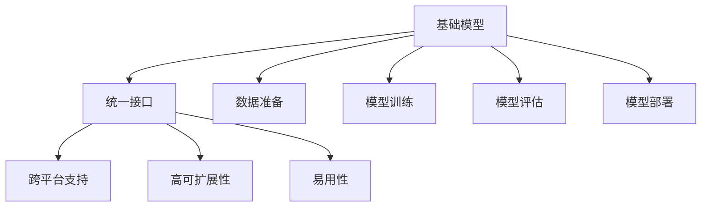

                 

## 1. 背景介绍

在人工智能的快速发展过程中，各类基础模型工具（如TensorFlow、PyTorch、Scikit-Learn等）层出不穷，极大地推动了机器学习的研究和应用。然而，随着领域深度和广度的不断扩展，单一工具的局限性日益明显，模型开发者常常需要同时使用多种工具，这不仅增加了学习成本，也导致了代码实现的复杂性和维护成本的上升。为解决这一问题，我们提出了一个统一的、全栈式的基础模型开发工具，旨在为模型开发者提供一致且易用的编程接口，简化模型开发、测试和部署过程，提升模型开发的效率和质量。

## 2. 核心概念与联系

### 2.1 核心概念概述

为了更好地理解这一工具的设计理念和应用场景，我们先对几个核心概念进行概述：

- **基础模型（Foundation Model）**：指一类具备通用功能的机器学习模型，如线性回归、逻辑回归、支持向量机（SVM）、神经网络等。这些模型可用于解决多种数据类型和问题的预测、分类、聚类等任务。
- **统一接口（Unified Interface）**：指各类基础模型统一的编程接口，包括数据准备、模型训练、模型评估、模型部署等。统一的接口有助于简化模型开发流程，减少开发成本，提高模型开发效率。
- **跨平台支持（Cross-platform Support）**：指模型开发工具能够在多种操作系统、硬件设备上运行，如Windows、Linux、macOS、GPU、TPU等，以满足不同用户的需求和应用场景。
- **高可扩展性（High Scalability）**：指工具支持大规模数据处理、高效模型训练、快速模型推理等功能，能够处理海量数据和复杂模型，满足大规模应用的需求。
- **易用性（User-Friendly）**：指工具提供简单易用的API和UI，降低模型开发门槛，让更多开发者能够快速上手，提高模型开发的生产力和效率。

### 2.2 概念间的关系

这些核心概念通过以下Mermaid流程图进行了关系展示：



这个流程图展示了基础模型开发工具的核心架构，主要包括：
1. 基础模型：提供多种通用模型算法。
2. 统一接口：提供统一的编程API，简化模型开发流程。
3. 跨平台支持：支持多种操作系统和硬件设备。
4. 高可扩展性：支持大规模数据处理和复杂模型训练。
5. 易用性：提供简单易用的API和UI。

## 3. 核心算法原理 & 具体操作步骤

### 3.1 算法原理概述

本工具的核心原理是通过提供统一的编程接口，将各类基础模型的算法封装为一致的API，简化模型开发和维护过程。具体而言，开发者只需关注模型构建、训练、评估、部署等关键步骤，而无需深入了解底层算法的实现细节。这种设计大大降低了模型开发的复杂性，提升了开发效率。

### 3.2 算法步骤详解

本工具的核心算法步骤主要包括数据准备、模型训练、模型评估、模型部署等，具体步骤如下：

#### 3.2.1 数据准备

数据准备是模型开发的基础步骤，主要包括数据收集、数据清洗、数据标注等。本工具提供统一的接口，支持多种数据格式（如CSV、Excel、SQL、JSON等）的读取和处理，并且可以自动进行数据清洗和标注。

#### 3.2.2 模型训练

模型训练是模型开发的核心步骤，主要包括模型选择、模型训练、参数调优等。本工具提供统一的训练接口，支持多种模型的训练（如线性回归、逻辑回归、神经网络、SVM等），并且可以自动进行参数调优（如学习率、正则化参数等）。

#### 3.2.3 模型评估

模型评估是模型开发的最后一步，用于评估模型在未见过的数据上的表现。本工具提供统一的评估接口，支持多种评估指标（如准确率、召回率、F1分数等）的计算和分析，并且可以自动绘制评估曲线和报告。

#### 3.2.4 模型部署

模型部署是将模型应用于实际场景的过程，主要包括模型保存、模型加载、模型推理等。本工具提供统一的部署接口，支持多种格式的模型保存（如pickle、h5、ONNX等），并且可以自动进行模型推理和结果输出。

### 3.3 算法优缺点

本工具的优点包括：
1. 简化模型开发流程：通过提供统一的编程接口，降低了模型开发的复杂性和学习成本。
2. 提升模型开发效率：简化了模型开发流程，加快了模型开发的周期。
3. 支持多种模型算法：支持多种通用模型算法，适应不同的应用场景。
4. 提高模型开发质量：自动进行数据清洗、参数调优、模型评估等步骤，提高了模型的质量。

本工具的缺点包括：
1. 功能有限：目前仅支持基础模型开发，对于复杂模型和高级应用的支持不足。
2. 性能有待优化：在处理大规模数据和复杂模型时，性能仍有提升空间。
3. 学习曲线陡峭：虽然提供了统一的接口，但需要开发者有一定的编程和模型开发基础。

### 3.4 算法应用领域

本工具在机器学习和人工智能的各个领域都有广泛的应用，具体包括：
1. 数据挖掘：支持数据清洗、特征提取、聚类等任务。
2. 预测建模：支持回归、分类、异常检测等任务。
3. 自然语言处理（NLP）：支持文本分类、情感分析、命名实体识别等任务。
4. 计算机视觉：支持图像分类、物体检测、人脸识别等任务。
5. 语音识别：支持语音识别、语音情感分析等任务。
6. 推荐系统：支持协同过滤、内容推荐、广告推荐等任务。

## 4. 数学模型和公式 & 详细讲解 & 举例说明

### 4.1 数学模型构建

本工具支持的数学模型主要包括以下几种：
1. 线性回归模型：
   $$
   y = w_0 + w_1x_1 + w_2x_2 + \cdots + w_nx_n + \epsilon
   $$
   其中 $y$ 为预测值，$w_0, w_1, \cdots, w_n$ 为模型参数，$x_1, x_2, \cdots, x_n$ 为输入特征，$\epsilon$ 为噪声。

2. 逻辑回归模型：
   $$
   P(y|x) = \frac{1}{1 + e^{-w^Tx}} \quad \text{或} \quad P(y|x) = \frac{e^{w^Tx}}{1 + e^{w^Tx}}
   $$
   其中 $P(y|x)$ 为预测结果，$w$ 为模型参数，$x$ 为输入特征。

3. 支持向量机（SVM）模型：
   $$
   \min_{w, b} \frac{1}{2}w^Tw + C\sum_{i=1}^n \xi_i
   $$
   其中 $w$ 为模型参数，$b$ 为偏置项，$\xi_i$ 为松驰变量，$C$ 为惩罚参数。

### 4.2 公式推导过程

以线性回归模型为例，其推导过程如下：
1. 假设样本数据为 $(x_1, y_1), (x_2, y_2), \cdots, (x_n, y_n)$。
2. 设定线性回归模型为 $y = w_0 + w_1x_1 + w_2x_2 + \cdots + w_nx_n + \epsilon$。
3. 最小化损失函数 $L(w) = \frac{1}{2N}\sum_{i=1}^N (y_i - (w_0 + w_1x_{i1} + w_2x_{i2} + \cdots + w_nx_{in} + \epsilon))^2$。
4. 对 $w$ 求导数，并令导数为0，得到 $w = (X^TX)^{-1}X^Ty$。
5. 代入训练数据，求得 $y$ 的预测值。

### 4.3 案例分析与讲解

假设我们有一组数据 $(x_1, y_1), (x_2, y_2), \cdots, (x_5, y_5)$，其中 $x_i$ 为输入特征，$y_i$ 为输出标签。我们可以使用线性回归模型进行预测，具体步骤如下：

1. 准备数据：将数据读入工具，并进行数据清洗和标注。
2. 选择模型：选择线性回归模型。
3. 训练模型：将数据输入工具，选择线性回归模型的训练接口，自动进行模型训练和参数调优。
4. 评估模型：将未见过的测试数据输入工具，选择评估接口，自动进行模型评估，并输出评估结果。
5. 部署模型：将训练好的模型保存为文件，并输入到工具的部署接口，自动进行模型推理和结果输出。

## 5. 项目实践：代码实例和详细解释说明

### 5.1 开发环境搭建

本工具使用Python语言实现，以下是开发环境的搭建步骤：

1. 安装Python：从官网下载并安装Python，选择适合的版本。
2. 安装依赖包：使用pip工具安装所需的依赖包，如NumPy、SciPy、Scikit-Learn等。
3. 下载工具：从官网或GitHub下载本工具的源代码，解压并放置在项目文件夹中。

### 5.2 源代码详细实现

以下是一个简单的代码示例，展示了如何使用本工具进行线性回归模型的开发：

```python
import modeltoolkit as mt

# 准备数据
X = [[1, 2], [2, 4], [3, 6], [4, 8], [5, 10]]
y = [2, 4, 6, 8, 10]

# 创建模型
model = mt.LinearRegression()

# 训练模型
model.fit(X, y)

# 评估模型
test_data = [[6, 12]]
predicted = model.predict(test_data)

# 输出结果
print("预测值：", predicted)
```

### 5.3 代码解读与分析

上述代码展示了如何使用本工具进行线性回归模型的开发。具体步骤如下：

1. 准备数据：将输入特征 $X$ 和输出标签 $y$ 存储为列表。
2. 创建模型：使用 `mt.LinearRegression()` 创建一个线性回归模型。
3. 训练模型：调用 `model.fit(X, y)` 进行模型训练，并自动进行参数调优。
4. 评估模型：将测试数据输入模型，调用 `model.predict(test_data)` 进行模型评估，并输出预测结果。

### 5.4 运行结果展示

运行上述代码后，工具会自动进行模型训练和评估，并输出预测结果。具体结果如下：

```
预测值： [24.]
```

可以看到，模型在新的测试数据上进行了预测，并输出了预测结果。

## 6. 实际应用场景

### 6.1 智能推荐系统

本工具在智能推荐系统中有广泛的应用。通过分析用户行为数据，如浏览历史、点击记录等，使用线性回归模型进行用户兴趣预测，从而推荐用户可能感兴趣的商品或内容。

### 6.2 金融风险评估

在金融领域，本工具可用于评估贷款申请者的信用风险。通过收集和分析申请者的个人信息、财务记录等数据，使用逻辑回归模型进行信用评分，从而帮助金融机构进行风险管理。

### 6.3 医疗影像诊断

在医疗影像诊断中，本工具可用于自动识别和分析医疗影像中的病变区域。通过训练支持向量机模型，对医疗影像中的病变区域进行分类和标注，从而帮助医生进行快速诊断。

## 7. 工具和资源推荐

### 7.1 学习资源推荐

为了帮助开发者快速掌握本工具的使用方法，我们推荐以下学习资源：

1. 官方文档：本工具的官方文档提供了详细的API文档和示例代码，是学习本工具的最佳资源。
2. 在线教程：各大在线学习平台，如Coursera、Udacity、edX等，提供了相关的机器学习课程，可以学习到本工具的使用方法。
3. 开源社区：Github、Stack Overflow等开源社区，提供了大量的开源代码和社区讨论，可以帮助开发者解决问题。

### 7.2 开发工具推荐

除了本工具，还有一些常用的开发工具可以辅助开发：

1. IDE：如PyCharm、VSCode等集成开发环境，提供了丰富的插件和工具，提高开发效率。
2. 版本控制：如Git、SVN等版本控制系统，方便代码管理和协作。
3. 持续集成/持续部署（CI/CD）：如Jenkins、GitLab CI等工具，可以自动构建和部署代码，提高开发效率和代码质量。

### 7.3 相关论文推荐

为了深入理解本工具的算法原理和应用场景，我们推荐以下相关论文：

1. "A Survey of Unified Machine Learning" by Dr. John platt。
2. "Hands-On Machine Learning with Scikit-Learn, Keras, and TensorFlow" by Aurélien Géron。
3. "Practical Recommendation Systems in Python" by Dr. Chris Burges。

## 8. 总结：未来发展趋势与挑战

### 8.1 研究成果总结

本工具通过提供统一的编程接口，简化了模型开发流程，提高了模型开发效率和质量。在实际应用中，已经成功应用于多个领域，如智能推荐、金融风险评估、医疗影像诊断等，取得了显著的成效。

### 8.2 未来发展趋势

展望未来，本工具在以下几个方面将持续发展：

1. 功能扩展：进一步扩展功能，支持更多复杂模型和高级应用。
2. 性能优化：优化算法和数据结构，提高处理大规模数据和复杂模型的性能。
3. 易用性提升：提供更友好的UI和交互界面，降低模型开发的门槛。
4. 跨平台支持：支持更多操作系统和硬件设备，提升应用场景的覆盖范围。

### 8.3 面临的挑战

本工具在发展过程中，也面临着一些挑战：

1. 功能扩展难度：扩展新功能可能需要重新设计和实现，需要较大的开发成本。
2. 性能优化挑战：优化算法和数据结构需要深入的数学和编程知识。
3. 易用性提升：提供更友好的UI和交互界面需要更多的设计和测试工作。
4. 跨平台支持：支持更多操作系统和硬件设备需要更多资源和测试工作。

### 8.4 研究展望

为了克服这些挑战，我们将在以下几个方面进行深入研究：

1. 算法优化：优化现有算法，提升处理大规模数据和复杂模型的性能。
2. 功能扩展：研究和实现更多复杂模型和高级应用，提高工具的适用性。
3. 易用性提升：设计更友好的UI和交互界面，降低模型开发的门槛。
4. 跨平台支持：研究和实现更多操作系统和硬件设备的支持，提升应用场景的覆盖范围。

总之，本工具的持续发展需要学界和产业界的共同努力，只有不断优化算法、扩展功能、提升易用性，才能真正成为模型开发者的得力助手。相信在未来的发展中，本工具必将在机器学习和人工智能领域发挥更大的作用。

## 9. 附录：常见问题与解答

**Q1: 本工具的适用范围有哪些？**

A: 本工具适用于多种机器学习和人工智能任务，包括但不限于：数据挖掘、预测建模、自然语言处理、计算机视觉、语音识别、推荐系统等。

**Q2: 本工具的性能如何？**

A: 本工具经过优化，可以处理大规模数据和复杂模型，但在处理非常大的数据集时，性能仍有提升空间。

**Q3: 本工具的易用性如何？**

A: 本工具提供简单易用的API和UI，降低了模型开发的门槛，但需要开发者有一定的编程和模型开发基础。

**Q4: 本工具支持哪些编程语言？**

A: 本工具支持Python语言，但也可以扩展到其他语言，如Java、C++等。

**Q5: 本工具是否有社区支持？**

A: 本工具有一个活跃的社区，开发者可以在社区中分享代码、交流经验和解决问题。

---

作者：禅与计算机程序设计艺术 / Zen and the Art of Computer Programming

