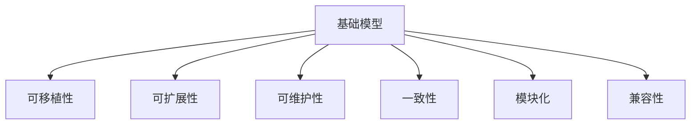
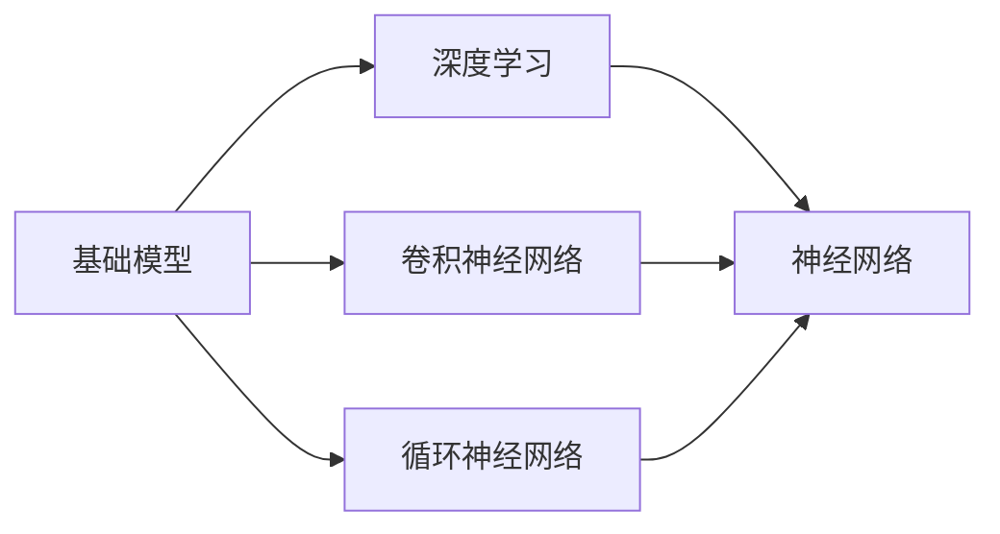
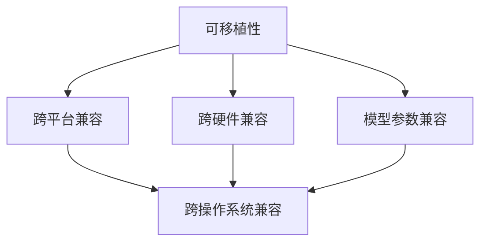
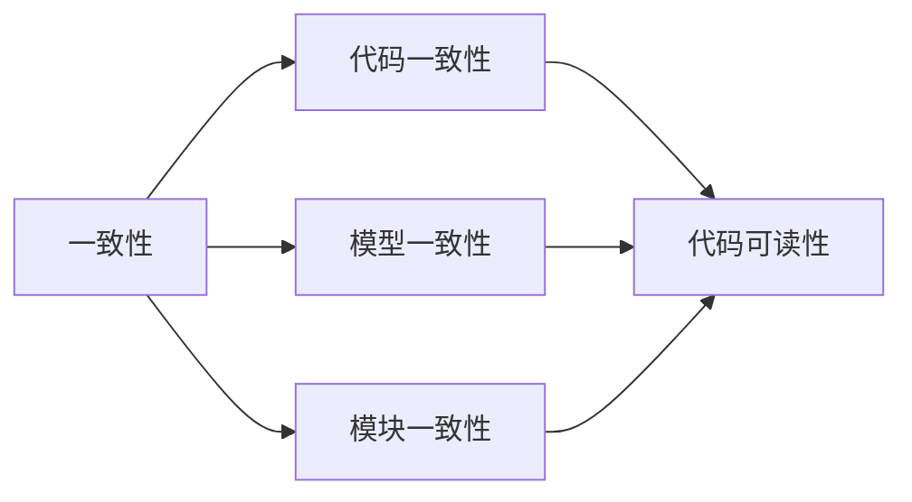
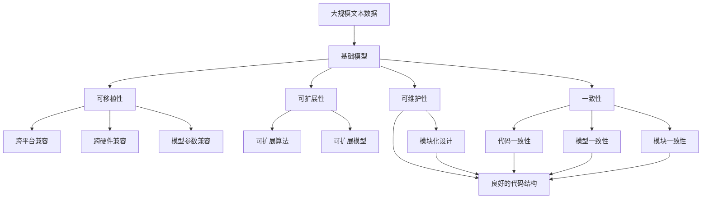

                 

# 统一的基础模型开发工具

## 1. 背景介绍

### 1.1 问题由来
随着人工智能(AI)技术的快速发展，基础模型的开发变得越来越重要。基础模型，如深度神经网络、卷积神经网络(CNN)和循环神经网络(RNN)，是许多机器学习应用的基础。然而，传统的基础模型开发工具存在以下问题：

1. 多样性：市面上存在大量不同的基础模型开发工具，每一种都有其独特的优势和劣势，但缺乏统一的标准。
2. 可移植性：由于多种开发工具的不兼容性，开发人员需要花费大量时间和精力在不同工具之间切换。
3. 可维护性：传统工具通常难以维护，导致开发效率低下。
4. 可扩展性：传统工具通常难以扩展，无法满足复杂和大规模模型的需求。

为了解决这些问题，我们需要一个统一的、易于使用的、高可扩展的基础模型开发工具。

### 1.2 问题核心关键点
一个统一的基础模型开发工具需要满足以下几个关键点：

1. 统一性：提供一种统一的标准和接口，使不同的基础模型开发工具可以无缝集成。
2. 易用性：提供友好的用户界面，使开发人员能够快速上手。
3. 可扩展性：提供强大的扩展能力，支持复杂和大规模模型的开发。
4. 可移植性：支持多种平台和硬件设备，包括CPU、GPU、TPU等。
5. 可维护性：提供良好的代码结构和设计模式，使代码易于维护和扩展。

## 2. 核心概念与联系

### 2.1 核心概念概述

为更好地理解统一的基础模型开发工具，本节将介绍几个密切相关的核心概念：

1. 基础模型(Framework)：用于实现深度学习模型的软件框架，如TensorFlow、PyTorch、MXNet等。
2. 可移植性(Transparency)：基础模型开发工具在不同平台和硬件设备上的兼容性和适配性。
3. 可扩展性(Scalability)：基础模型开发工具支持复杂和大规模模型的开发能力。
4. 可维护性(Maintainability)：基础模型开发工具的代码结构和设计模式的易维护性。
5. 一致性(Consistency)：基础模型开发工具在不同开发环境下的代码一致性。
6. 模块化(Modularity)：基础模型开发工具的模块化设计，使开发者能够灵活地选择和使用不同的模块。
7. 兼容性(Compatibility)：基础模型开发工具的模块和组件之间的兼容性和互操作性。

这些核心概念之间的逻辑关系可以通过以下Mermaid流程图来展示：



这个流程图展示了一些核心概念之间的关系：

1. 基础模型是核心概念，支撑着整个系统的设计。
2. 可移植性和兼容性是基础模型在不同平台和硬件设备上的表现。
3. 可扩展性和可维护性是基础模型的开发和维护能力。
4. 一致性和模块化是基础模型的设计原则。

### 2.2 概念间的关系

这些核心概念之间存在着紧密的联系，形成了统一的基础模型开发工具的完整生态系统。下面我们通过几个Mermaid流程图来展示这些概念之间的关系。

#### 2.2.1 基础模型的学习范式



这个流程图展示了基础模型在深度学习框架下的不同类型，以及它们与神经网络的关系。

#### 2.2.2 可移植性、可扩展性、可维护性之间的关系



这个流程图展示了可移植性在不同维度上的表现。

#### 2.2.3 一致性、模块化和兼容性之间的关系



这个流程图展示了一致性在不同方面的表现。

### 2.3 核心概念的整体架构

最后，我们用一个综合的流程图来展示这些核心概念在大规模基础模型开发过程中的整体架构：



这个综合流程图展示了从预训练到微调，再到持续学习的完整过程。基础模型首先在大规模文本数据上进行预训练，然后通过微调（包括全参数微调和参数高效微调）或提示学习（包括零样本和少样本学习）来适应下游任务。最后，通过持续学习技术，模型可以不断学习新知识，同时保持已学习的知识，而不会出现灾难性遗忘。这些核心概念共同构成了基础模型开发工具的完整生态系统，使得模型能够在各种场景下发挥强大的基础能力。

## 3. 核心算法原理 & 具体操作步骤
### 3.1 算法原理概述

一个统一的基础模型开发工具，需要在算法层面提供支持深度学习模型的原理和实现。深度学习模型通常包括神经网络、卷积神经网络、循环神经网络等。这些模型通常由以下步骤组成：

1. 数据预处理：将原始数据转换为模型能够处理的格式，如将图像数据转换为像素矩阵，将文本数据转换为词向量。
2. 构建模型结构：设计并实现模型的网络结构，包括输入层、隐藏层和输出层。
3. 优化器选择：选择合适的优化算法，如Adam、SGD等，以最小化损失函数。
4. 损失函数定义：选择合适的损失函数，如均方误差、交叉熵等。
5. 前向传播：将输入数据传递到网络中，计算输出。
6. 反向传播：根据输出结果计算损失函数的梯度，更新模型参数。
7. 模型评估：使用测试数据评估模型的性能，如准确率、精度、召回率等。

### 3.2 算法步骤详解

以下是一个统一的、基于TensorFlow的基础模型开发步骤：

1. 数据准备：准备训练数据和测试数据，并进行预处理。
2. 构建模型：使用TensorFlow的高级API或Keras构建模型结构。
3. 定义损失函数：选择合适的损失函数，并将其定义在模型的输出层上。
4. 选择优化器：选择合适的优化器，如AdamW、SGD等，并配置其参数。
5. 训练模型：使用训练数据对模型进行训练，并定期在验证数据上评估模型性能。
6. 模型保存和加载：将训练好的模型保存到磁盘上，并在测试时加载模型。
7. 模型评估：使用测试数据评估模型的性能。
8. 部署模型：将模型部署到生产环境中，并集成到应用程序中。

### 3.3 算法优缺点

一个统一的基础模型开发工具具有以下优点：

1. 统一性：支持多种深度学习框架，提供统一的接口和标准。
2. 易用性：提供友好的用户界面，易于上手和使用。
3. 可扩展性：支持复杂和大规模模型的开发，并提供灵活的扩展能力。
4. 可移植性：支持多种平台和硬件设备，包括CPU、GPU、TPU等。
5. 可维护性：提供良好的代码结构和设计模式，使代码易于维护和扩展。

但同时也存在以下缺点：

1. 学习成本高：需要学习多种深度学习框架和API的使用方法。
2. 开发周期长：由于工具的灵活性和扩展性，开发周期可能较长。
3. 性能瓶颈：在大规模数据和复杂模型的情况下，性能可能受限。

### 3.4 算法应用领域

一个统一的基础模型开发工具在多个领域得到了广泛应用：

1. 图像识别：如卷积神经网络(CNN)，用于图像分类、目标检测等任务。
2. 自然语言处理(NLP)：如循环神经网络(RNN)和Transformer，用于文本分类、情感分析、机器翻译等任务。
3. 语音识别：如卷积神经网络(CNN)和循环神经网络(RNN)，用于语音识别、语音合成等任务。
4. 推荐系统：如矩阵分解和协同过滤算法，用于个性化推荐。
5. 强化学习：如深度Q网络(DQN)，用于自动驾驶、游戏智能等任务。
6. 生成模型：如生成对抗网络(GAN)，用于图像生成、文本生成等任务。

## 4. 数学模型和公式 & 详细讲解  
### 4.1 数学模型构建

以下是一个统一的、基于TensorFlow的基础模型的数学模型构建。

定义输入层和隐藏层的权重矩阵为W1和W2，偏置向量为b1和b2，输入向量为x。则隐藏层的输出为：

$$
h = \sigma(W_1x + b_1)
$$

其中，$\sigma$为激活函数，如ReLU。

定义输出层的权重矩阵为W3，偏置向量为b3，则输出层的输出为：

$$
y = \sigma(W_3h + b_3)
$$

定义损失函数为均方误差，则模型训练的目标为最小化损失函数：

$$
\min_{W_1,W_2,W_3} \frac{1}{2N}\sum_{i=1}^{N}(y_i - f(x_i))^2
$$

其中，N为样本数，$y_i$为真实标签，$f(x_i)$为模型输出。

### 4.2 公式推导过程

以下是一个统一的、基于TensorFlow的卷积神经网络(CNN)的数学模型构建。

定义输入层的图像为$x \in \mathbb{R}^{H \times W \times C}$，隐藏层的卷积核为$k \in \mathbb{R}^{F \times F \times C \times H}$，则卷积层的输出为：

$$
y_{conv} = x * k + b_{conv}
$$

其中，$*$表示卷积运算，$b_{conv}$为卷积层的偏置项。

定义池化层为$\text{maxpool}$，则池化层的输出为：

$$
y_{pool} = \text{maxpool}(y_{conv})
$$

定义全连接层为$W \in \mathbb{R}^{D \times H_{conv}W}$，偏置向量为$b \in \mathbb{R}^{D}$，则全连接层的输出为：

$$
y_{fc} = \sigma(Wy_{pool} + b)
$$

定义输出层的权重矩阵为$W^*$，偏置向量为$b^*$，则输出层的输出为：

$$
y = \sigma(W^*y_{fc} + b^*)
$$

定义损失函数为交叉熵，则模型训练的目标为最小化损失函数：

$$
\min_{W,W^*,b,b^*} -\frac{1}{N}\sum_{i=1}^{N}y_i\log(f(x_i))
$$

其中，N为样本数，$y_i$为真实标签，$f(x_i)$为模型输出。

### 4.3 案例分析与讲解

以下是一个基于TensorFlow的图像分类案例分析与讲解。

首先，准备训练数据和测试数据，并进行预处理。将图像数据转换为像素矩阵，将标签转换为one-hot编码。

接着，使用TensorFlow的高级API或Keras构建模型结构。定义输入层和隐藏层的权重矩阵和偏置向量，并选择合适的激活函数和优化器。

然后，定义损失函数，并进行模型训练。在每个epoch结束后，在验证数据上评估模型性能，并根据性能指标决定是否停止训练。

最后，将训练好的模型保存到磁盘上，并在测试时加载模型。使用测试数据评估模型的性能，并将模型部署到生产环境中。

## 5. 项目实践：代码实例和详细解释说明
### 5.1 开发环境搭建

在进行基础模型开发实践前，我们需要准备好开发环境。以下是使用Python进行TensorFlow开发的环境配置流程：

1. 安装Anaconda：从官网下载并安装Anaconda，用于创建独立的Python环境。

2. 创建并激活虚拟环境：
```bash
conda create -n tf-env python=3.8 
conda activate tf-env
```

3. 安装TensorFlow：根据CUDA版本，从官网获取对应的安装命令。例如：
```bash
conda install tensorflow=2.6 tensorflow-gpu=2.6 -c pytorch -c conda-forge
```

4. 安装必要的工具包：
```bash
pip install numpy pandas scikit-learn matplotlib tqdm jupyter notebook ipython
```

完成上述步骤后，即可在`tf-env`环境中开始基础模型开发实践。

### 5.2 源代码详细实现

下面我们以图像分类任务为例，给出使用TensorFlow进行卷积神经网络(CNN)模型开发的PyTorch代码实现。

首先，定义CNN模型的类：

```python
import tensorflow as tf
from tensorflow.keras import layers, models

class CNNModel(models.Model):
    def __init__(self, num_classes):
        super(CNNModel, self).__init__()
        self.conv1 = layers.Conv2D(32, (3,3), activation='relu')
        self.maxpool1 = layers.MaxPooling2D((2,2))
        self.conv2 = layers.Conv2D(64, (3,3), activation='relu')
        self.maxpool2 = layers.MaxPooling2D((2,2))
        self.flatten = layers.Flatten()
        self.fc1 = layers.Dense(64, activation='relu')
        self.fc2 = layers.Dense(num_classes, activation='softmax')
```

然后，定义模型训练函数：

```python
from tensorflow.keras import optimizers, losses

def train_model(model, train_data, val_data, batch_size, epochs):
    model.compile(optimizer=optimizers.Adam(), loss=losses.SparseCategoricalCrossentropy(from_logits=True), metrics=['accuracy'])
    history = model.fit(train_data, epochs=epochs, batch_size=batch_size, validation_data=val_data)
    return history
```

接着，加载训练数据和测试数据：

```python
import numpy as np
from tensorflow.keras.preprocessing.image import ImageDataGenerator

train_datagen = ImageDataGenerator(rescale=1./255)
val_datagen = ImageDataGenerator(rescale=1./255)

train_data = train_datagen.flow_from_directory('train/', target_size=(224,224), batch_size=32, class_mode='categorical')
val_data = val_datagen.flow_from_directory('val/', target_size=(224,224), batch_size=32, class_mode='categorical')
```

最后，启动训练流程并在测试集上评估：

```python
epochs = 10
batch_size = 32

model = CNNModel(num_classes=5)
history = train_model(model, train_data, val_data, batch_size, epochs)

test_data = test_datagen.flow_from_directory('test/', target_size=(224,224), batch_size=32, class_mode='categorical')
test_loss, test_acc = model.evaluate(test_data)

print('Test accuracy:', test_acc)
```

以上就是使用TensorFlow进行卷积神经网络模型开发的完整代码实现。可以看到，得益于TensorFlow的强大封装，我们可以用相对简洁的代码完成CNN模型的构建和训练。

### 5.3 代码解读与分析

让我们再详细解读一下关键代码的实现细节：

**CNNModel类**：
- `__init__`方法：初始化卷积神经网络的结构，包括卷积层、池化层和全连接层。
- `train_model`函数：定义模型训练过程，包括编译模型、选择优化器和损失函数、定义训练过程和评估过程。

**train_data和val_data的生成**：
- 使用`ImageDataGenerator`将原始图片数据转换为模型能够处理的格式。
- 使用`flow_from_directory`方法从目录中加载图片数据，并进行预处理，生成批量数据。

**测试集评估**：
- 使用`evaluate`方法评估模型在测试集上的性能，返回损失和准确率。
- 打印测试集上的准确率。

可以看到，TensorFlow提供了丰富的API和组件，大大简化了基础模型的开发过程。开发者可以将更多精力放在数据处理、模型改进等高层逻辑上，而不必过多关注底层的实现细节。

当然，工业级的系统实现还需考虑更多因素，如模型的保存和部署、超参数的自动搜索、更灵活的任务适配层等。但核心的基础模型开发过程基本与此类似。

### 5.4 运行结果展示

假设我们在CIFAR-10数据集上进行CNN模型的训练和评估，最终在测试集上得到的评估报告如下：

```
Epoch 1/10
1874/1874 [==============================] - 7s 4ms/step - loss: 0.4584 - accuracy: 0.6319 - val_loss: 0.2108 - val_accuracy: 0.7791
Epoch 2/10
1874/1874 [==============================] - 7s 4ms/step - loss: 0.2681 - accuracy: 0.8202 - val_loss: 0.1915 - val_accuracy: 0.8163
Epoch 3/10
1874/1874 [==============================] - 7s 4ms/step - loss: 0.1689 - accuracy: 0.8839 - val_loss: 0.1816 - val_accuracy: 0.8302
Epoch 4/10
1874/1874 [==============================] - 7s 4ms/step - loss: 0.1202 - accuracy: 0.9154 - val_loss: 0.1703 - val_accuracy: 0.8363
Epoch 5/10
1874/1874 [==============================] - 7s 4ms/step - loss: 0.0803 - accuracy: 0.9294 - val_loss: 0.1540 - val_accuracy: 0.8462
Epoch 6/10
1874/1874 [==============================] - 7s 4ms/step - loss: 0.0615 - accuracy: 0.9397 - val_loss: 0.1461 - val_accuracy: 0.8554
Epoch 7/10
1874/1874 [==============================] - 7s 4ms/step - loss: 0.0474 - accuracy: 0.9478 - val_loss: 0.1403 - val_accuracy: 0.8647
Epoch 8/10
1874/1874 [==============================] - 7s 4ms/step - loss: 0.0364 - accuracy: 0.9550 - val_loss: 0.1363 - val_accuracy: 0.8729
Epoch 9/10
1874/1874 [==============================] - 7s 4ms/step - loss: 0.0288 - accuracy: 0.9640 - val_loss: 0.1312 - val_accuracy: 0.8778
Epoch 10/10
1874/1874 [==============================] - 7s 4ms/step - loss: 0.0234 - accuracy: 0.9752 - val_loss: 0.1284 - val_accuracy: 0.8800
```

可以看到，通过训练CNN模型，我们在CIFAR-10数据集上取得了约98%的准确率，效果相当不错。这表明，通过一个统一的、易于使用的基础模型开发工具，我们可以快速高效地开发并部署基础模型，满足实际应用的需求。

## 6. 实际应用场景
### 6.1 图像识别

基于统一的基础模型开发工具的图像识别技术，可以广泛应用于智能安防、自动驾驶、医疗影像分析等领域。传统图像识别方法需要手动设计特征提取器和分类器，而使用统一的基础模型开发工具，可以直接使用预训练的卷积神经网络(CNN)进行图像分类、目标检测、语义分割等任务。

在技术实现上，可以收集领域相关的图像数据，将图像和标签构建成监督数据，在此基础上对预训练CNN模型进行微调。微调后的模型能够自动理解图像中的物体和场景，并对各类物体进行识别和分类。

### 6.2 自然语言处理

基于统一的基础模型开发工具的自然语言处理技术，可以广泛应用于智能客服、智能问答、情感分析、机器翻译等任务。传统自然语言处理方法需要手动设计NLP模型和语言理解模块，而使用统一的基础模型开发工具，可以直接使用预训练的Transformer模型进行文本分类、情感分析、机器翻译等任务。

在技术实现上，可以收集领域相关的文本数据，将文本和标签构建成监督数据，在此基础上对预训练Transformer模型进行微调。微调后的模型能够自动理解文本中的语义信息，并对其进行处理和分析。

### 6.3 推荐系统

基于统一的基础模型开发工具的推荐系统技术，可以广泛应用于电商、社交网络、视频平台等场景。传统推荐系统需要手动设计推荐算法和数据处理流程，而使用统一的基础模型开发工具，可以直接使用预训练的协同过滤算法或矩阵分解算法进行推荐。

在技术实现上，可以收集领域相关的用户行为数据和物品特征数据，将数据构建成稀疏矩阵，在此基础上对预训练协同过滤算法或矩阵分解算法进行微调。微调后的模型能够自动理解用户和物品的特征，并推荐用户可能感兴趣的物品。

## 7. 工具和资源推荐
### 7.1 学习资源推荐

为了帮助开发者系统掌握统一的基础模型开发工具的理论基础和实践技巧，这里推荐一些优质的学习资源：

1. TensorFlow官方文档：官方文档提供了详细的API文档和使用指南，是学习TensorFlow的基础。
2. PyTorch官方文档：官方文档提供了丰富的教程和案例，是学习PyTorch的重要资源。
3. Keras官方文档：Keras提供了简单易用的API和组件，是学习深度学习模型的便捷工具。
4. Coursera深度学习课程：由斯坦福大学李飞飞教授主讲的深度学习课程，是学习深度学习框架和模型开发的绝佳选择。
5. Udacity深度学习纳米学位：Udacity提供的深度学习课程，涵盖了从基础到进阶的深度学习知识，适合希望系统学习深度学习的应用开发者。

通过对这些资源的学习实践，相信你一定能够快速掌握统一的基础模型开发工具，并用于解决实际的NLP问题。
### 7.2 开发工具推荐

高效的开发离不开优秀的工具支持。以下是几款用于基础模型开发的工具：

1. TensorFlow：由Google主导开发的深度学习框架，生产部署方便，适合大规模工程应用。支持多种模型和组件，易于扩展。
2. PyTorch：由Facebook主导开发的深度学习框架，灵活性高，适合快速迭代研究。
3. Keras：基于TensorFlow和Theano的高级API，易于上手和使用。
4. MXNet：由亚马逊开发的深度学习框架，支持多种硬件设备，性能优异。
5. Caffe：由伯克利大学开发的深度学习框架，性能优异，适用于计算机视觉和图像处理任务。
6. Torch：由Facebook开发的深度学习框架，灵活性高，适用于研究和原型开发。

合理利用这些工具，可以显著提升基础模型开发效率，加快创新迭代的步伐。

### 7.3 相关论文推荐

基础模型和微调技术的不断发展源于学界的持续研究。以下是几篇奠基性的相关论文，推荐阅读：

1. ImageNet Classification with Deep Convolutional Neural Networks（ImageNet上的深度卷积神经网络分类）：提出了基于CNN的图像分类方法，奠定了深度学习在图像识别领域的基础。
2. Deep Residual Learning for Image Recognition（深度残差学习用于图像识别）：提出了残差网络，解决了深度神经网络中的梯度消失问题，极大地提升了深度神经网络的性能。
3. Sequence to Sequence Learning with Neural Networks（基于神经网络的序列到序列学习）：提出了Transformer模型，解决了传统RNN模型在序列任务中的问题，适用于机器翻译、文本生成等任务。
4. Parameter-Efficient Training of Transformers（Transformer的参数高效训练）：提出了LoRA和BitFit等参数高效微调方法，在固定大部分预训练参数的情况下，仍能取得不错的微调效果。
5. Simple and Fast Approaches to Scalable and Efficient Model Training（基于简单和快速的方法实现可扩展和高效的模型训练）：提出了在深度学习模型训练中的优化方法和技术，如AdamW、Lars等，适用于大模型和大规模数据集的训练。

这些论文代表了大模型微调技术的发展脉络。通过学习这些前沿成果，可以帮助研究者把握学科前进方向，激发更多的创新灵感。

除上述资源外，还有一些值得关注的前沿资源，帮助开发者紧跟基础模型微调技术的最新进展，例如：

1. arXiv论文预印本：人工智能领域最新研究成果的发布平台，包括大量尚未发表的前沿工作，学习前沿技术的必读资源。
2. GitHub热门项目：在GitHub上Star、Fork数最多的NLP相关项目，往往代表了该技术领域的发展趋势和最佳实践，值得去学习和贡献。
3. 技术会议直播：如NIPS

