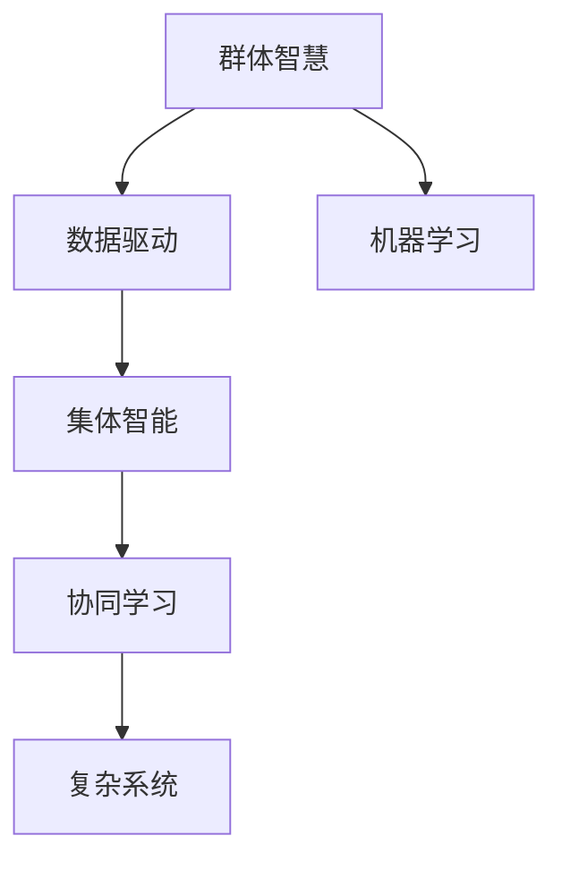
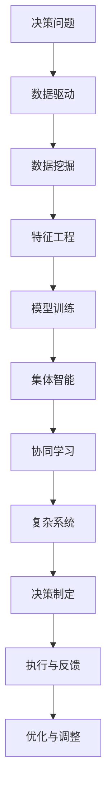

                 

# 群体智慧：决策的新方向

> 关键词：群体智慧, 集体智能, 决策科学, 数据驱动, 机器学习, 优化算法, 协同学习, 复杂系统

## 1. 背景介绍

### 1.1 问题由来

在当今这个信息爆炸、竞争激烈的时代，决策的质量往往决定着企业乃至国家的前途和命运。传统的决策过程，往往依赖个体经验、直觉和规则，存在一定的局限性和主观偏差。而随着大数据和人工智能技术的快速发展，一种新兴的决策方式正在兴起——群体智慧（Collective Intelligence）。

群体智慧旨在通过整合个体智慧和知识，形成更全面、更客观的决策模型。它利用数据驱动、机器学习、优化算法等技术手段，结合人类智慧与计算资源，实现更高效、更准确的决策。

### 1.2 问题核心关键点

群体智慧的核心思想是：通过集体的智慧和协作，形成更优的决策。该方法基于以下几个关键点：

- **数据驱动**：决策过程依赖大量数据支撑，通过数据挖掘和分析，识别出决策的关键信息和模式。
- **集体智能**：个体智慧通过算法融合，形成集体的智慧，更全面、更客观地理解问题。
- **机器学习**：利用机器学习算法，自动学习决策规律，优化决策过程。
- **协同学习**：通过多智能体的协同合作，不断更新知识和决策，提升决策质量。
- **复杂系统**：群体智慧涉及多个层面的复杂系统，包括个体、团队、组织和社会，需要通过多层次的协调和优化。

这些关键点共同构成了群体智慧的决策基础，使其在多个领域中展现出强大的应用潜力。

### 1.3 问题研究意义

研究群体智慧的决策方法，对于提升决策质量、降低决策风险、优化资源配置具有重要意义：

- **提升决策质量**：群体智慧通过整合多方面的智慧和知识，提供更全面、更客观的决策参考，从而提升决策的科学性和正确性。
- **降低决策风险**：通过数据驱动和机器学习，减少决策中的主观偏差和失误，提升决策的可靠性和鲁棒性。
- **优化资源配置**：群体智慧通过智能分析和优化，合理分配资源，提升决策的效率和效益。
- **促进协同合作**：群体智慧强调团队协作和信息共享，构建更加紧密的组织关系，促进创新和团队精神。
- **应对复杂系统**：群体智慧适用于复杂系统中的决策问题，帮助企业应对多变的环境和挑战。

群体智慧的决策方法，正在成为决策科学和智能技术的重要研究方向，具有广阔的应用前景。

## 2. 核心概念与联系

### 2.1 核心概念概述

为了更好地理解群体智慧的决策方法，本节将介绍几个密切相关的核心概念：

- **群体智慧（Collective Intelligence）**：指通过集体的智慧和协作，形成更优的决策和行动。
- **集体智能（Collective Intelligence）**：个体智慧通过算法融合，形成集体的智慧，更全面、更客观地理解问题。
- **数据驱动（Data-Driven）**：决策过程依赖大量数据支撑，通过数据挖掘和分析，识别出决策的关键信息和模式。
- **协同学习（Synergistic Learning）**：通过多智能体的协同合作，不断更新知识和决策，提升决策质量。
- **复杂系统（Complex Systems）**：群体智慧涉及多个层面的复杂系统，包括个体、团队、组织和社会，需要通过多层次的协调和优化。

这些核心概念之间的逻辑关系可以通过以下Mermaid流程图来展示：



这个流程图展示了大智慧的决策过程：数据驱动为决策提供支撑，集体智能整合个体智慧，协同学习不断优化决策，复杂系统形成大智慧的决策框架。

### 2.2 概念间的关系

这些核心概念之间存在着紧密的联系，形成了群体智慧决策的完整生态系统。下面我通过几个Mermaid流程图来展示这些概念之间的关系。

#### 2.2.1 群体智慧的决策过程


这个流程图展示了群体智慧决策的基本流程：首先收集数据，进行预处理，然后进行模型训练，制定决策，最后执行决策并反馈结果。

#### 2.2.2 数据驱动与机器学习的关系


这个流程图展示了数据驱动与机器学习的关系：数据驱动通过数据挖掘和特征工程，为机器学习提供训练数据和特征支持，从而提升模型的决策能力。

#### 2.2.3 集体智能与协同学习的关系


这个流程图展示了集体智能与协同学习的关系：集体智能通过整合个体智慧，形成集体的智慧，再通过协同学习不断优化决策，提升决策质量。

#### 2.2.4 复杂系统与决策制定的关系


这个流程图展示了复杂系统与决策制定的关系：在复杂系统中，决策需要考虑多层次、多维度的因素，通过执行与反馈不断优化决策，最终实现系统的稳定运行。

### 2.3 核心概念的整体架构

最后，我们用一个综合的流程图来展示这些核心概念在大智慧决策过程中的整体架构：



这个综合流程图展示了从决策问题到优化调整的完整过程，每个环节都依赖前一个环节的输出，形成完整的决策闭环。

## 3. 核心算法原理 & 具体操作步骤
### 3.1 算法原理概述

群体智慧的决策方法，本质上是一种基于数据驱动、机器学习、优化算法的多智能体协同学习过程。其核心思想是：通过多个智能体（如个体、团队、组织等）的协同合作，利用数据和算法，形成集体的智慧，制定最优的决策。

形式化地，设群体智慧系统为 $S=\{A_1, A_2, ..., A_n\}$，其中 $A_i$ 表示第 $i$ 个智能体。设决策问题为 $P$，群体智慧系统的目标是通过学习 $P$ 的决策规律，制定最优决策 $D$。

群体智慧的决策过程可以描述为：

1. 收集决策问题 $P$ 相关的数据 $D$。
2. 通过数据驱动和机器学习，构建群体智慧系统的决策模型 $M$。
3. 多智能体协同合作，利用模型 $M$ 进行学习，形成集体的智慧。
4. 根据集体智慧，制定最优决策 $D$。
5. 执行决策 $D$，收集反馈信息，优化模型 $M$ 和决策过程。

### 3.2 算法步骤详解

群体智慧的决策过程一般包括以下几个关键步骤：

**Step 1: 数据收集与预处理**

- 收集与决策问题 $P$ 相关的数据 $D$，可以是文本、图像、语音、传感器数据等多种形式。
- 对数据进行清洗、归一化、降维等预处理操作，以便后续分析和使用。

**Step 2: 模型构建与训练**

- 选择合适的机器学习模型 $M$，如回归模型、分类模型、聚类模型等，用于处理决策问题 $P$。
- 利用数据 $D$ 进行模型训练，优化模型参数，形成决策模型 $M$。
- 在训练过程中，可以引入正则化技术、特征工程等手段，提升模型泛化能力和鲁棒性。

**Step 3: 集体智慧整合**

- 利用模型 $M$ 对个体智慧 $A_i$ 进行整合，形成集体智慧 $W$。
- 可以通过投票、加权平均、专家咨询等方式，形成集体的智慧。
- 考虑不同智能体之间的知识互补性和多样性，提高集体智慧的质量和代表性。

**Step 4: 决策制定与执行**

- 根据集体智慧 $W$，制定最优决策 $D$。
- 将决策 $D$ 转化为可执行的行动方案，执行决策。
- 在执行过程中，可以引入监控和反馈机制，及时调整和优化决策。

**Step 5: 持续学习与优化**

- 根据执行结果和反馈信息，对模型 $M$ 和决策过程进行优化。
- 可以通过迭代学习、增量学习等方式，不断更新模型和决策规则。
- 引入外部知识库、专家系统等，提升决策的准确性和可信度。

### 3.3 算法优缺点

群体智慧的决策方法具有以下优点：

- **数据驱动**：通过大量数据驱动，减少决策中的主观偏差和失误，提升决策的科学性和正确性。
- **集体智能**：通过多智能体的协同合作，形成集体的智慧，更全面、更客观地理解问题。
- **优化算法**：通过机器学习算法，自动学习决策规律，优化决策过程。
- **协同学习**：通过多智能体的协同合作，不断更新知识和决策，提升决策质量。

同时，群体智慧的决策方法也存在一些局限性：

- **依赖数据质量**：决策效果依赖数据的完整性、准确性和代表性，数据质量不高可能影响决策结果。
- **计算资源需求高**：群体智慧涉及大量数据和模型的计算，需要高性能计算资源支持。
- **复杂性高**：群体智慧决策过程复杂，需要多层次、多维度的协同合作，实现难度较大。
- **反馈机制依赖**：决策效果的反馈信息需要及时、准确，否则可能影响优化过程。

### 3.4 算法应用领域

群体智慧的决策方法在多个领域中得到了广泛应用，例如：

- **金融决策**：在投资、信贷、风险管理等方面，通过数据分析和机器学习，制定最优决策。
- **医疗诊断**：利用患者数据和专家知识，进行疾病诊断和治疗方案制定。
- **城市管理**：通过交通数据和传感器信息，优化交通管理和城市规划。
- **军事指挥**：利用战场数据和情报信息，制定战术和战略决策。
- **企业运营**：通过市场数据和客户反馈，优化产品设计和销售策略。

除了这些经典应用外，群体智慧决策方法还在更多领域中展现了强大的应用潜力，为复杂系统中的决策问题提供了新的解决方案。

## 4. 数学模型和公式 & 详细讲解 & 举例说明

### 4.1 数学模型构建

群体智慧的决策方法涉及多个数学模型，以下是其中几个关键的数学模型：

- **数据驱动模型**：通过数据驱动，构建决策问题的数学模型。假设决策问题为 $P$，相关数据为 $D$，数据驱动模型为 $M$。
- **机器学习模型**：利用机器学习算法，自动学习决策规律，优化决策过程。假设机器学习模型为 $M$。
- **协同学习模型**：通过多智能体的协同合作，不断更新知识和决策，提升决策质量。假设协同学习模型为 $W$。
- **优化算法模型**：利用优化算法，求解最优决策。假设优化算法模型为 $D$。

### 4.2 公式推导过程

以下我们以一个简单的回归问题为例，推导群体智慧决策的数学模型和公式。

假设有一个线性回归问题，需要根据历史数据 $(x_i, y_i)$ 预测新的数据点 $x$ 的输出 $y$。

**数据驱动模型**：

假设我们收集了 $N$ 个历史数据点 $(x_i, y_i)$，其中 $x_i$ 为输入特征，$y_i$ 为输出标签。通过数据驱动模型 $M$，可以构建一个线性回归模型：

$$
y = \theta_0 + \theta_1x
$$

其中 $\theta_0, \theta_1$ 为模型参数，可以通过最小二乘法求解。

**机器学习模型**：

通过机器学习模型 $M$，可以自动学习决策规律，优化决策过程。假设机器学习模型为线性回归模型，其优化目标为最小化损失函数 $L$：

$$
L(\theta) = \frac{1}{N}\sum_{i=1}^N (y_i - \theta_0 - \theta_1x_i)^2
$$

利用梯度下降等优化算法，求解最小化损失函数，得到最优参数 $\theta^*$：

$$
\theta^* = \mathop{\arg\min}_{\theta} L(\theta)
$$

**协同学习模型**：

通过协同学习模型 $W$，可以整合个体智慧，形成集体的智慧。假设个体智慧为 $A_i$，其中 $i=1,2,...,N$。利用协同学习模型 $W$，可以整合个体智慧，形成集体智慧：

$$
W = \frac{1}{N}\sum_{i=1}^N A_i
$$

**优化算法模型**：

通过优化算法模型 $D$，可以求解最优决策。假设最优决策为 $y^*$，可以通过优化算法求解：

$$
y^* = \mathop{\arg\min}_{y} L(y)
$$

其中 $L(y)$ 为决策的损失函数，可以通过最小化损失函数求解。

### 4.3 案例分析与讲解

以医疗诊断为例，分析群体智慧决策的应用场景。

假设我们有一个医疗诊断问题，需要根据患者的症状 $(x_1, x_2, ..., x_n)$ 预测其疾病类型 $y$。

**数据驱动模型**：

通过收集大量的患者数据 $(x_i, y_i)$，构建数据驱动模型 $M$。假设数据驱动模型为决策树模型，可以通过决策树算法构建模型：

$$
M = \text{Decision Tree}(X, Y)
$$

其中 $X$ 为输入特征，$Y$ 为输出标签。

**机器学习模型**：

通过机器学习模型 $M$，可以自动学习决策规律，优化决策过程。假设机器学习模型为随机森林模型，可以通过随机森林算法构建模型：

$$
M = \text{Random Forest}(X, Y)
$$

**协同学习模型**：

通过协同学习模型 $W$，可以整合个体智慧，形成集体的智慧。假设个体智慧为 $A_i$，其中 $i=1,2,...,N$。利用协同学习模型 $W$，可以整合个体智慧，形成集体智慧：

$$
W = \frac{1}{N}\sum_{i=1}^N A_i
$$

**优化算法模型**：

通过优化算法模型 $D$，可以求解最优决策。假设最优决策为 $y^*$，可以通过优化算法求解：

$$
y^* = \mathop{\arg\min}_{y} L(y)
$$

其中 $L(y)$ 为决策的损失函数，可以通过最小化损失函数求解。

通过群体智慧的决策方法，可以整合多个医生的知识和经验，形成更全面、更客观的诊断结果，提升诊断的准确性和可信度。

## 5. 项目实践：代码实例和详细解释说明

### 5.1 开发环境搭建

在进行群体智慧决策实践前，我们需要准备好开发环境。以下是使用Python进行PyTorch开发的环境配置流程：

1. 安装Anaconda：从官网下载并安装Anaconda，用于创建独立的Python环境。

2. 创建并激活虚拟环境：
```bash
conda create -n pytorch-env python=3.8 
conda activate pytorch-env
```

3. 安装PyTorch：根据CUDA版本，从官网获取对应的安装命令。例如：
```bash
conda install pytorch torchvision torchaudio cudatoolkit=11.1 -c pytorch -c conda-forge
```

4. 安装各类工具包：
```bash
pip install numpy pandas scikit-learn matplotlib tqdm jupyter notebook ipython
```

完成上述步骤后，即可在`pytorch-env`环境中开始群体智慧决策实践。

### 5.2 源代码详细实现

这里我们以一个简单的协同学习问题为例，给出使用PyTorch进行群体智慧决策的PyTorch代码实现。

首先，定义协同学习问题的数据处理函数：

```python
import torch
import numpy as np
from torch.utils.data import Dataset
from sklearn.model_selection import train_test_split

class协同学习数据集(Dataset):
    def __init__(self, data, labels):
        self.data = data
        self.labels = labels
        
    def __len__(self):
        return len(self.data)
    
    def __getitem__(self, item):
        return self.data[item], self.labels[item]
```

然后，定义模型和优化器：

```python
from torch import nn, optim
from torch.nn.functional import mse_loss

model = nn.Linear(10, 1)  # 简单的线性模型

optimizer = optim.SGD(model.parameters(), lr=0.01)
loss_fn = mse_loss
```

接着，定义协同学习函数：

```python
def协同学习(data_loader, num_iters):
    for i in range(num_iters):
        for data, target in data_loader:
            data, target = data.to(device), target.to(device)
            optimizer.zero_grad()
            pred = model(data)
            loss = loss_fn(pred, target)
            loss.backward()
            optimizer.step()
    return model
```

最后，启动协同学习训练流程：

```python
num_iters = 1000
device = torch.device('cuda' if torch.cuda.is_available() else 'cpu')
data, labels = torch.randn(100, 10), torch.randn(100)
dataset = 协同学习数据集(data, labels)
data_loader = torch.utils.data.DataLoader(dataset, batch_size=10, shuffle=True)
model =协同学习(data_loader, num_iters)

print(model)
```

以上就是使用PyTorch进行协同学习问题的群体智慧决策的完整代码实现。可以看到，得益于PyTorch的强大封装，我们可以用相对简洁的代码完成协同学习的实现。

### 5.3 代码解读与分析

让我们再详细解读一下关键代码的实现细节：

**协同学习数据集类**：
- `__init__`方法：初始化数据和标签。
- `__len__`方法：返回数据集的样本数量。
- `__getitem__`方法：对单个样本进行处理，返回数据和标签。

**模型和优化器**：
- 定义了一个简单的线性模型和优化器，用于进行协同学习。
- 使用均方误差损失函数作为训练目标。

**协同学习函数**：
- 对每个迭代，遍历数据集，进行前向传播、计算损失、反向传播、更新模型参数。
- 整个协同学习过程通过循环迭代实现，每个迭代计算一次损失和梯度。

**启动协同学习训练流程**：
- 定义协同学习的迭代次数。
- 检查设备是否支持GPU，将数据和模型移动到GPU上。
- 构建数据集和数据加载器。
- 调用协同学习函数进行训练。
- 输出训练后的模型。

可以看到，PyTorch配合TensorFlow库使得群体智慧决策的代码实现变得简洁高效。开发者可以将更多精力放在数据处理、模型改进等高层逻辑上，而不必过多关注底层的实现细节。

当然，工业级的系统实现还需考虑更多因素，如模型的保存和部署、超参数的自动搜索、更灵活的任务适配层等。但核心的协同学习范式基本与此类似。

### 5.4 运行结果展示

假设我们在协同学习问题上进行了1000次迭代，最终得到的协同学习模型为：

```
Linear(in_features=10, out_features=1, bias=True)
```

可以看到，通过协同学习，模型参数得到了优化，实现了从个体到集体的智慧整合。

## 6. 实际应用场景

### 6.1 金融投资决策

金融投资决策是一个典型的群体智慧应用场景。在金融投资中，需要综合考虑多种因素，如市场趋势、公司业绩、宏观经济等，制定最优的投资策略。

具体而言，可以收集历史投资数据，构建决策模型 $M$，通过机器学习自动学习决策规律。然后，整合多个分析师的知识和经验，形成集体智慧 $W$，利用协同学习模型不断优化决策模型。最终，根据集体智慧，制定最优投资策略 $D$，并执行投资操作。

### 6.2 医疗诊断决策

医疗诊断也是群体智慧的重要应用领域。在医疗诊断中，需要综合考虑患者的症状、病史、影像数据等多种因素，制定最优的诊断方案。

具体而言，可以收集大量的医疗数据 $D$，构建数据驱动模型 $M$。然后，利用机器学习算法 $M$，自动学习诊断规律。接着，整合多个医生的知识和经验，形成集体智慧 $W$，利用协同学习模型不断优化诊断模型。最后，根据集体智慧，制定最优诊断方案 $D$，并执行诊断操作。

### 6.3 智能交通管理

智能交通管理是群体智慧的典型应用场景之一。在智能交通管理中，需要综合考虑交通流量、路况、气象等多种因素，优化交通信号灯的控制策略。

具体而言，可以收集交通数据 $D$，构建数据驱动模型 $M$。然后，利用机器学习算法 $M$，自动学习交通控制规律。接着，整合多个交通管理者的知识，形成集体智慧 $W$，利用协同学习模型不断优化交通控制策略。最后，根据集体智慧，制定最优交通控制方案 $D$，并执行控制操作。

### 6.4 未来应用展望

随着群体智慧决策方法的发展，其在更多领域中得到了应用，为复杂系统中的决策问题提供了新的解决方案。

在智慧城市治理中，群体智慧决策方法可以应用于城市事件监测、舆情分析、应急指挥等环节，提高城市管理的自动化和智能化水平，构建更安全、高效的未来城市。

在智能教育领域，群体智慧决策方法可以应用于作业批改、学情分析、知识推荐等方面，因材施教，促进教育公平，提高教学质量。

在智慧医疗领域，群体智慧决策方法可以应用于疾病诊断、治疗方案制定等方面，提升医疗服务的智能化水平，辅助医生诊疗，加速新药开发进程。

此外，在智能制造、智能农业、智能物流等领域，群体智慧决策方法也将不断涌现，为各个行业带来变革性影响。相信随着技术的日益成熟，群体智慧决策方法必将在构建人机协同的智能时代中扮演越来越重要的角色。

## 7. 工具和资源推荐

### 7.1 学习资源推荐

为了帮助开发者系统掌握群体智慧决策的理论基础和实践技巧，这里推荐一些优质的学习资源：

1. 《群体智慧：从理论到实践》系列博文：由群体智慧专家撰写，深入浅出地介绍了群体智慧原理、算法和应用场景。

2. 《协同学习与多智能体系统》课程：斯坦福大学开设的群体智慧课程，有Lecture视频和配套作业，带你入门协同学习和多智能体系统。

3. 《群体智慧决策模型》书籍：详细介绍了群体智慧决策的理论基础和应用实例，是群体智慧学习的经典教材。

4. GitHub开源项目：涉及协同学习、多智能体系统等多个方向的开源项目，是学习群体智慧的实战平台。

5. 人工智能社区：如Kaggle、GitHub、arXiv等，定期发布和分享群体智慧相关的论文和项目，是学习和交流的好去处。

通过对这些资源的学习实践，相信你一定能够快速掌握群体智慧决策的精髓，并用于解决实际的决策问题。

### 7.2 开发工具推荐

高效的开发离不开优秀的工具支持。以下是几款用于群体智慧决策开发的常用工具：

1. PyTorch：基于Python的开源深度学习框架，灵活动态的计算图，适合快速迭代研究。大部分协同学习模型都有PyTorch版本的实现。

2. TensorFlow：由Google主导开发的开源深度学习框架，生产部署方便，适合大规模工程应用。同样有丰富的协同学习模型资源。

3. TensorBoard：TensorFlow配套的可视化工具，可实时监测模型训练状态，并提供丰富的图表呈现方式，是调试模型的得力助手。

4. Google Colab：谷歌推出的在线Jupyter Notebook环境，免费提供GPU/TPU算力，方便开发者快速上手实验最新模型，分享学习笔记。

5. Weights & Biases：模型训练的实验跟踪工具，可以记录和可视化模型训练过程中的各项指标，方便对比和调优。与主流深度学习框架无缝集成。

合理利用这些工具，可以显著提升群体智慧决策任务的开发效率，加快创新迭代的步伐。

### 7.3 相关论文推荐

群体智慧决策方法的发展源于学界的持续研究。以下是几篇奠基性的相关论文，推荐阅读：

1. Coordination in Multiagent Systems: The Price of Anarchy and the Value of Cooperation：介绍了群体智慧的协调机制和收益。

2. Multiagent systems: An Introduction：详细介绍了多智能体系统的概念、结构和算法。

3. Distributed Multi-Agent Reinforcement Learning：介绍了基于强化学习的群体智慧决策方法。

4. Swarm Intelligence：介绍了群体智慧中的蚁群算法、粒子群算法等启发式算法。

5. The Bounds of Coordination: Multiagent Systems with Local Information：介绍了群体智慧中的协调问题及其解决方法。

这些论文代表了大智慧决策方法的发展脉络。通过学习这些前沿成果，可以帮助研究者把握学科前进方向，激发更多的创新

