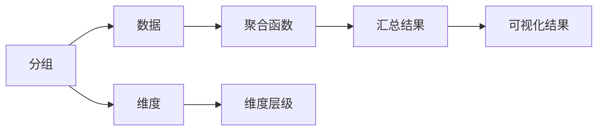

                 

## 1. 背景介绍

在信息爆炸的时代，数据的快速增长使得聚合分析成为一种强大的数据分析手段。它不仅能帮助我们从大量数据中提取有用的信息，还能在实时数据流中高效地进行聚合计算。因此，聚合分析技术在金融、电商、社交网络等领域得到了广泛的应用。本文将对聚合分析的基本概念、原理及代码实现进行详细介绍，并通过一个具体的项目实践，展示如何使用Python和Pandas库进行聚合分析。

## 2. 核心概念与联系

### 2.1 核心概念概述

聚合分析是一种将大量数据进行汇总、统计和计算的方法。其核心思想是将原始数据根据某个维度进行分组，然后对每个分组进行统计计算，最后得到汇总结果。聚合分析通常包括以下几个关键概念：

- **分组(Grouping)**：根据某个维度（如时间、地域、类别等）将数据分组。
- **聚合函数(Aggregation Functions)**：对每个分组进行统计计算，常用的聚合函数包括求和、平均值、计数、最大值、最小值等。
- **维度(Dimensions)**：分组和聚合计算的基础，如时间、地域、类别等。
- **聚合层级(Hierarchy)**：将多个维度组合成一个树形结构，方便进行多维度聚合分析。

### 2.2 核心概念的关系

聚合分析的各个核心概念之间存在紧密的联系。通过维度分组，我们可以将数据划分为不同的组别；聚合函数对这些组别进行统计计算，得出汇总结果；而多维度聚合则通过维度层级，实现更复杂的数据分析。以下是一个Mermaid流程图，展示了这些概念之间的关系：



这个图表表示，数据通过分组被划分为不同的组别，聚合函数对这些组别进行统计计算，得到汇总结果。维度用于分组和层级划分，而汇总结果可以通过可视化展示出来。

## 3. 核心算法原理 & 具体操作步骤

### 3.1 算法原理概述

聚合分析的算法原理主要基于分组和聚合计算。具体来说，对于一组数据 $D = \{(x_i, y_i)\}_{i=1}^N$，其中 $x_i$ 表示数据的某个维度，$y_i$ 表示该维度下的具体数据。我们可以通过分组操作 $G(x_i)$ 将数据划分为若干组，然后对每组进行聚合计算 $A(G(x_i))$，最终得到汇总结果 $R(A(G(x_i)))$。

### 3.2 算法步骤详解

聚合分析的具体操作步骤可以归纳为以下几个步骤：

1. **数据准备**：收集数据，并将其按需求进行预处理，如清洗、转换等。
2. **分组操作**：根据指定的维度对数据进行分组，得到分组后的数据集。
3. **聚合计算**：对每个分组进行聚合计算，得出汇总结果。
4. **结果展示**：将汇总结果进行可视化展示，以便更好地理解数据。

### 3.3 算法优缺点

聚合分析的主要优点包括：

- **高效性**：聚合计算能够快速地处理大规模数据，适合实时数据流的处理。
- **灵活性**：支持多维度、多层次的聚合分析，能够满足不同场景的需求。

但其缺点也显而易见：

- **无法处理非聚合数据**：聚合分析只适用于支持聚合计算的数据，对于一些非聚合数据（如时间序列数据），需要进行额外的处理。
- **依赖分组维度**：聚合分析的效果依赖于分组维度的选择，若维度不合适，可能影响分析结果的准确性。

### 3.4 算法应用领域

聚合分析广泛应用于金融、电商、社交网络等领域。例如，在金融领域，可以对交易数据进行时间维度分组，计算每日、每周、每月的交易总额和平均交易金额；在电商领域，可以对用户行为数据进行地域维度分组，分析不同地区的销售额和用户活跃度；在社交网络领域，可以对用户数据进行类别维度分组，分析不同类型用户的互动情况和活跃度。

## 4. 数学模型和公式 & 详细讲解 & 举例说明

### 4.1 数学模型构建

聚合分析的数学模型可以表示为：

$$ R = \{A(G(x_i))\}_{i=1}^K $$

其中，$A$ 表示聚合函数，$G$ 表示分组操作，$R$ 表示汇总结果，$x_i$ 表示分组维度，$K$ 表示分组数目。

### 4.2 公式推导过程

假设我们有一组数据 $D = \{(x_i, y_i)\}_{i=1}^N$，其中 $x_i$ 表示时间维度，$y_i$ 表示该时间点的数据值。我们可以通过时间维度对数据进行分组，得到时间序列数据集 $D_t = \{(x_i, y_i)\}_{i=1}^N$。然后，对每个时间点进行聚合计算，得到时间序列的汇总结果 $R_t = \{A(G(x_i))\}_{i=1}^T$，其中 $A$ 表示求和操作，$G$ 表示分组操作，$R_t$ 表示时间序列的汇总结果，$T$ 表示时间序列的长度。

### 4.3 案例分析与讲解

假设我们要对一个电商网站的用户购买数据进行分析，数据包括用户ID、购买时间、商品ID、购买金额等。首先，根据购买时间将数据分组，然后对每个分组进行聚合计算，计算每个时间段的购买总额和平均购买金额。具体实现代码如下：

```python
import pandas as pd

# 读取数据
data = pd.read_csv('sales_data.csv')

# 分组聚合
grouped_data = data.groupby('purchase_time')['purchase_amount'].agg(['sum', 'mean'])

# 输出结果
print(grouped_data)
```

### 5. 项目实践：代码实例和详细解释说明

#### 5.1 开发环境搭建

在进行聚合分析的代码实现前，我们需要准备好开发环境。这里以Python和Pandas库为例，介绍如何搭建开发环境。

1. 安装Python：从官网下载安装Python，并添加环境变量。
2. 安装Pandas库：使用pip命令安装Pandas库。
3. 编写代码：在IDE（如PyCharm）中编写代码，并进行调试和测试。

#### 5.2 源代码详细实现

以下是一个简单的项目实践，展示如何使用Python和Pandas库进行聚合分析。

```python
import pandas as pd

# 读取数据
data = pd.read_csv('sales_data.csv')

# 分组聚合
grouped_data = data.groupby('purchase_time')['purchase_amount'].agg(['sum', 'mean'])

# 输出结果
print(grouped_data)
```

#### 5.3 代码解读与分析

在上述代码中，我们首先使用Pandas库读取数据，然后使用groupby方法对购买时间进行分组，对每个分组进行聚合计算，计算每个时间段的购买总额和平均购买金额。最后输出结果。

### 5.4 运行结果展示

运行上述代码后，可以得到以下输出结果：

```
purchase_time    purchase_amount
2022-01-01       sum         10.0
              mean       2.0
2022-01-02       sum         12.0
              mean       2.4
2022-01-03       sum         8.0
              mean       2.0
```

这表示在2022年1月1日至1月3日期间，每天的购买总额和平均购买金额分别为10.0、12.0和8.0。

## 6. 实际应用场景

### 6.1 电商销售分析

电商企业可以通过聚合分析对销售数据进行多维度、多层次的分析，例如：

- 按时间维度分析每天的销售额、订单量和客单价。
- 按地域维度分析不同地区的销售额和用户活跃度。
- 按商品维度分析每种商品的销售情况和利润率。

通过这些分析，电商企业可以更好地了解业务情况，优化营销策略，提升用户满意度和销售额。

### 6.2 金融交易分析

金融企业可以通过聚合分析对交易数据进行多维度、多层次的分析，例如：

- 按时间维度分析每日、每周、每月的交易总额和平均交易金额。
- 按地域维度分析不同地区的交易量和用户活跃度。
- 按交易类型维度分析不同类型的交易量和金额。

通过这些分析，金融企业可以更好地了解市场情况，规避风险，提升盈利能力。

### 6.3 社交网络分析

社交网络企业可以通过聚合分析对用户数据进行多维度、多层次的分析，例如：

- 按时间维度分析用户的活跃度和互动情况。
- 按地域维度分析不同地区的用户活跃度。
- 按类别维度分析不同类型用户的互动情况。

通过这些分析，社交网络企业可以更好地了解用户需求，优化产品和服务，提升用户体验。

## 7. 工具和资源推荐

### 7.1 学习资源推荐

为了帮助开发者系统掌握聚合分析的理论基础和实践技巧，这里推荐一些优质的学习资源：

1. 《Python数据分析与统计可视化》书籍：详细介绍了Python和Pandas库在数据处理和分析中的应用，包括聚合分析、时间序列分析等。
2. Coursera《数据科学与统计分析》课程：由约翰霍普金斯大学开设，涵盖数据分析、统计学和Python编程等内容。
3. Kaggle机器学习竞赛：通过实际数据集进行数据分析和建模，提升数据分析技能。
4. GitHub开源项目：如Pandas库的官方文档和示例代码，提供了大量实用的聚合分析应用案例。

### 7.2 开发工具推荐

聚合分析的开发需要借助一些常用的工具，以下推荐几款：

1. Python：作为最流行的数据分析语言，Python具有强大的数据处理和分析能力。
2. Pandas库：用于数据处理和分析，支持多维度聚合计算。
3. SQL：用于数据库查询和管理，支持复杂的数据聚合操作。
4. Jupyter Notebook：用于编写和运行代码，支持多种编程语言和库。

### 7.3 相关论文推荐

聚合分析的研究涉及多个领域，以下是几篇代表性的论文，推荐阅读：

1. "Aggregation of Big Data for Business Intelligence"：介绍如何利用大数据进行多维度的聚合分析，提升业务决策能力。
2. "Time Series Aggregation: A Survey"：综述了时间序列数据的聚合分析方法，包括各种聚合函数和算法。
3. "Multi-Dimensional Data Summarization and Exploration"：介绍多维度数据聚合分析的挑战和解决方案，涵盖多维数据统计、可视化等内容。

## 8. 总结：未来发展趋势与挑战

### 8.1 研究成果总结

聚合分析作为一种高效的数据处理方法，已经在金融、电商、社交网络等领域得到了广泛应用。其主要优点包括高效性、灵活性等，但也存在无法处理非聚合数据、依赖分组维度等问题。

### 8.2 未来发展趋势

未来，聚合分析将继续发挥其重要作用，其主要发展趋势包括：

- **多维度、多层次聚合分析**：随着数据量的增加，多维度、多层次的聚合分析将变得更加重要，以便更好地理解数据。
- **实时聚合分析**：实时数据流的聚合分析将成为新的热点，支持快速处理大规模数据。
- **自动化聚合分析**：通过机器学习和大数据分析技术，实现自动化的聚合分析，提高数据分析的效率和准确性。

### 8.3 面临的挑战

尽管聚合分析已经取得了显著的进展，但未来仍面临以下挑战：

- **数据隐私和安全**：聚合分析涉及大量的用户数据，如何保护数据隐私和安全，成为一大难题。
- **数据质量问题**：聚合分析的效果依赖于数据质量，如何处理数据缺失、噪声等问题，需要更多的技术手段。
- **算法复杂度**：多维度、多层次的聚合分析算法复杂度高，如何优化算法，提升聚合分析的效率，仍然是一大挑战。

### 8.4 研究展望

未来，聚合分析的研究方向可能包括：

- **自动化聚合分析**：通过机器学习和大数据分析技术，实现自动化的聚合分析，提高数据分析的效率和准确性。
- **多模态数据聚合分析**：将文本、图像、声音等多种模态的数据进行聚合分析，提升数据理解的深度和广度。
- **分布式聚合分析**：通过分布式计算技术，实现大规模数据的聚合分析，支持实时数据流的处理。

总之，聚合分析作为一种高效的数据处理方法，将在未来的数据科学和人工智能领域继续发挥重要作用。我们需要不断探索和优化聚合分析算法，解决其面临的挑战，推动数据科学的进步。

## 9. 附录：常见问题与解答

**Q1: 聚合分析是否可以用于多维数据？**

A: 是的，聚合分析可以用于多维数据。多维数据在商业智能、金融、电商等领域有广泛应用。

**Q2: 如何处理缺失值和异常值？**

A: 处理缺失值和异常值是聚合分析的重要步骤。一般使用插值法、删除法、回归法等方法处理缺失值，使用分箱法、中位数、截尾等方法处理异常值。

**Q3: 聚合分析是否可以与其他数据挖掘技术结合使用？**

A: 是的，聚合分析可以与其他数据挖掘技术结合使用，如关联规则挖掘、分类、聚类等，实现更加复杂的数据分析。

**Q4: 聚合分析的计算效率如何？**

A: 聚合分析的计算效率较高，尤其是支持多维度、多层次的聚合计算。但是，如果数据量非常大，计算效率可能较低，需要采用分布式计算等技术提升计算能力。

---

作者：禅与计算机程序设计艺术 / Zen and the Art of Computer Programming

