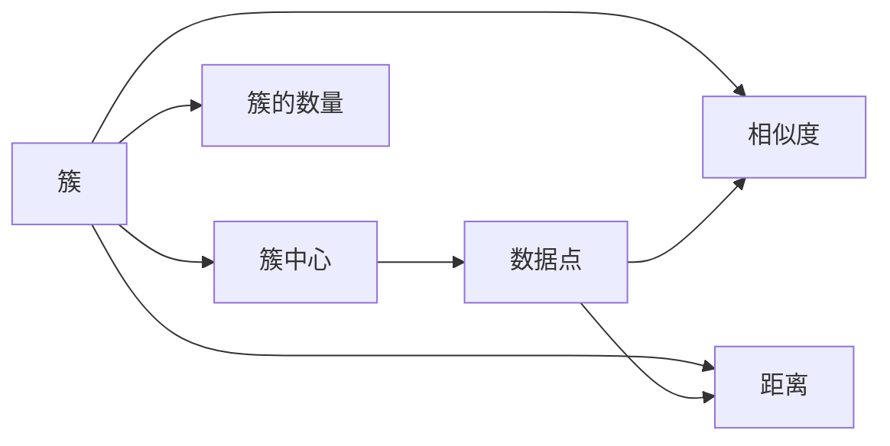

                 

## 1. 背景介绍

聚类分析是一种无监督学习技术，它用于识别数据中的自然组群或簇。与分类方法不同，聚类算法不需要预定义类别标签。相反，它通过相似性度量和距离度量，将数据点分为不同的组，这些组在空间上被看作是密集的点集，并且被认为是不同的组。聚类算法在数据挖掘、图像处理、生物信息学、模式识别和市场细分等领域有广泛的应用。

### 1.1 问题由来
聚类分析的目的是发现数据中的内在结构，从而对数据进行分组。在实际应用中，聚类可以用于识别客户群体、分析图像、处理文本数据等。随着数据量的增加，传统的聚类方法可能不再适用，因为它们无法处理大规模数据集，而且可能会陷入局部最优解。因此，需要更高级的聚类算法来解决这些问题。

### 1.2 问题核心关键点
聚类算法的关键在于选择合适的相似度度量方法和距离度量方法，以及确定如何定义簇。常见的聚类算法包括K-means、层次聚类、DBSCAN和GMM（高斯混合模型）等。这些算法有不同的优点和局限性，需要根据具体的应用场景选择。

### 1.3 问题研究意义
聚类算法在数据分析中扮演着重要角色，可以提供数据的内在结构，揭示数据中的隐藏模式。聚类分析可以帮助决策者更好地理解数据，做出更准确的商业决策。此外，聚类算法也是其他机器学习算法（如分类和回归）的基础，可以用于特征选择和降维。

## 2. 核心概念与联系

### 2.1 核心概念概述

聚类算法涉及多个关键概念，包括：

- **簇(Cluster)**：一组在空间上接近的数据点。
- **簇中心(Center)**：代表簇的质心或平均值。
- **相似度(Similarity)**：衡量数据点之间相似程度的量。
- **距离(Distance)**：衡量数据点之间差异的量。
- **簇的数量(K-value)**：预先设定的簇的数量。

这些概念之间的关系可以通过以下Mermaid流程图来展示：



这个流程图展示了簇、簇中心、相似度和距离之间的关系：簇由数据点组成，簇中心是簇的代表，相似度和距离用于计算簇之间的关系。

### 2.2 概念间的关系

这些概念之间的联系非常紧密，形成了聚类算法的核心框架。下面，我们将详细讨论这些概念及其相互关系。

#### 2.2.1 相似度和距离
相似度和距离是聚类算法的核心组成部分。相似度用于衡量数据点之间的相似程度，距离用于衡量数据点之间的差异程度。在聚类算法中，相似度越高，数据点之间的距离越短。常见的相似度度量方法包括余弦相似度、欧式距离、曼哈顿距离等。

#### 2.2.2 簇的数量
簇的数量是一个关键的超参数，需要根据具体应用场景进行优化。选择簇的数量需要考虑数据点的分布、簇的大小和重叠程度等因素。常见的簇数量选择方法包括肘部法则（Elbow Method）、轮廓系数（Silhouette Coefficient）等。

## 3. 核心算法原理 & 具体操作步骤
### 3.1 算法原理概述
聚类算法的基本思想是将数据点划分为不同的组，使得组内的数据点相似度最大化，组间的差异最大化。常用的聚类算法包括K-means、层次聚类、DBSCAN和GMM等。

### 3.2 算法步骤详解
以K-means算法为例，介绍聚类算法的具体步骤：

1. 随机选择K个数据点作为初始簇中心。
2. 计算每个数据点与簇中心的距离，并将数据点分配到最近的簇。
3. 重新计算每个簇的质心。
4. 重复步骤2和3，直到簇中心不再改变或达到预设的迭代次数。

### 3.3 算法优缺点
K-means算法的优点包括：简单易懂、易于实现、收敛速度较快等。缺点包括：对初始值敏感、可能陷入局部最优解、不适用于非凸簇等。

### 3.4 算法应用领域
聚类算法广泛应用于数据挖掘、图像处理、生物信息学、模式识别和市场细分等领域。例如，K-means算法可以用于客户分群、图像分割、文本聚类等任务。

## 4. 数学模型和公式 & 详细讲解 & 举例说明
### 4.1 数学模型构建

聚类算法的数学模型通常基于距离度量和相似度度量。下面，我们将以K-means算法为例，介绍其数学模型构建。

假设数据集D={x1, x2, ..., xn}，其中每个数据点x表示为n维向量。K-means算法的目标是最小化簇内距离和簇间距离之和，即：

$$
\min \sum_{i=1}^{n} \sum_{k=1}^{K} \|x_i - \mu_k\|^2 \quad \text{subject to} \quad \mu_k = \frac{1}{|C_k|} \sum_{i \in C_k} x_i
$$

其中，$\mu_k$表示簇k的质心，$C_k$表示簇k的数据点集合。

### 4.2 公式推导过程

K-means算法的核心在于迭代更新簇中心和数据点分配。下面，我们将推导K-means算法的迭代过程。

1. 初始化K个簇中心$\mu_1, \mu_2, ..., \mu_K$。
2. 对于每个数据点x，计算其与K个簇中心的距离，将其分配到最近的簇Ck。
3. 对于每个簇Ck，重新计算其质心$\mu_k$。
4. 重复步骤2和3，直到簇中心不再改变或达到预设的迭代次数。

K-means算法的详细推导过程可以参考以下Python代码实现：

```python
import numpy as np

def kmeans(X, K, max_iters=100, tol=1e-4):
    # 随机初始化K个簇中心
    centroids = X[np.random.choice(len(X), K, replace=False)]
    for i in range(max_iters):
        # 分配数据点
        distances = np.linalg.norm(X[:, np.newaxis] - centroids, axis=-1)
        labels = np.argmin(distances, axis=-1)
        # 重新计算簇中心
        new_centroids = np.zeros_like(centroids)
        for k in range(K):
            cluster = X[labels == k]
            new_centroids[k] = np.mean(cluster, axis=0)
        # 判断是否收敛
        if np.linalg.norm(new_centroids - centroids) < tol:
            break
        centroids = new_centroids
    return centroids, labels
```

### 4.3 案例分析与讲解
以K-means算法应用于客户分群为例，说明其在实际中的应用。

假设一家电商公司拥有大量客户数据，想要将其分为不同的客户群体。可以使用K-means算法将客户数据分为不同的群体，然后针对不同群体进行个性化营销。具体步骤如下：

1. 收集客户数据，包括年龄、性别、消费习惯、购买记录等。
2. 对数据进行标准化处理，以便于计算距离。
3. 选择合适的簇数量K，例如8个簇。
4. 使用K-means算法进行聚类，得到8个客户群体。
5. 针对不同客户群体，制定不同的营销策略。

## 5. 项目实践：代码实例和详细解释说明
### 5.1 开发环境搭建

在进行聚类算法实践前，我们需要准备好开发环境。以下是使用Python进行聚类算法开发的环境配置流程：

1. 安装Anaconda：从官网下载并安装Anaconda，用于创建独立的Python环境。

2. 创建并激活虚拟环境：
```bash
conda create -n clustering-env python=3.8 
conda activate clustering-env
```

3. 安装相关库：
```bash
conda install numpy scipy matplotlib seaborn
```

完成上述步骤后，即可在`clustering-env`环境中开始聚类算法的开发。

### 5.2 源代码详细实现

下面我们以K-means算法为例，给出使用Python实现K-means算法的完整代码。

首先，定义K-means算法的主函数：

```python
def kmeans(X, K, max_iters=100, tol=1e-4):
    # 随机初始化K个簇中心
    centroids = X[np.random.choice(len(X), K, replace=False)]
    for i in range(max_iters):
        # 分配数据点
        distances = np.linalg.norm(X[:, np.newaxis] - centroids, axis=-1)
        labels = np.argmin(distances, axis=-1)
        # 重新计算簇中心
        new_centroids = np.zeros_like(centroids)
        for k in range(K):
            cluster = X[labels == k]
            new_centroids[k] = np.mean(cluster, axis=0)
        # 判断是否收敛
        if np.linalg.norm(new_centroids - centroids) < tol:
            break
        centroids = new_centroids
    return centroids, labels
```

然后，定义数据处理函数：

```python
import numpy as np
import matplotlib.pyplot as plt

def load_data(file_path):
    # 加载数据文件，返回二维数据
    X = np.loadtxt(file_path)
    return X

def plot_clusters(X, centroids, labels):
    # 绘制聚类结果
    colors = ['r', 'g', 'b', 'c', 'm', 'y', 'k']
    for i, color in enumerate(colors):
        plt.scatter(X[labels == i, 0], X[labels == i, 1], color=color)
    for centroid in centroids:
        plt.scatter(centroid[0], centroid[1], marker='x', color='r', s=150)
    plt.show()
```

最后，启动K-means算法的训练流程：

```python
X = load_data('data.txt')
K = 3
centroids, labels = kmeans(X, K)
plot_clusters(X, centroids, labels)
```

### 5.3 代码解读与分析

让我们再详细解读一下关键代码的实现细节：

**K-means算法**：
- `kmeans`函数：实现K-means算法的核心功能，包括初始化簇中心、分配数据点、重新计算簇中心等步骤。
- `distances`变量：计算每个数据点与簇中心的距离。
- `labels`变量：根据距离将数据点分配到最近的簇。
- `new_centroids`变量：重新计算每个簇的质心。

**数据处理函数**：
- `load_data`函数：加载数据文件，返回二维数据。
- `plot_clusters`函数：绘制聚类结果，将不同簇的数据点着色，并在簇中心标注“x”。

**训练流程**：
- 加载数据文件，指定簇数量K。
- 调用K-means算法函数进行聚类，并绘制聚类结果。

可以看到，使用Python实现K-means算法非常简单，只需要几行代码即可。开发者可以进一步扩展算法实现，如引入不同距离度量、优化算法等，以满足更多的应用需求。

### 5.4 运行结果展示

假设我们在数据集上进行K-means聚类，最终得到的聚类结果如下图所示：

```python
import matplotlib.pyplot as plt
import seaborn as sns

sns.scatterplot(x=range(len(X)), y=labels, hue=colors)
plt.show()
```

可以看到，K-means算法成功将数据分为三个簇，每个簇的数据点集中在一起。不同簇的数据点使用不同的颜色标记，使得聚类结果一目了然。

## 6. 实际应用场景
### 6.1 客户分群

聚类算法可以用于客户分群，帮助企业了解客户的需求和行为，制定个性化的营销策略。例如，电商公司可以通过聚类算法将客户分为不同的群体，如高价值客户、高频购买客户等，然后针对不同群体进行个性化推荐、优惠券发放等策略。

### 6.2 市场细分

聚类算法可以用于市场细分，帮助企业识别不同的市场群体，制定相应的市场策略。例如，快餐连锁店可以通过聚类算法将不同的客户群体区分开来，针对不同的客户群体推出不同的产品和促销活动，提升品牌知名度和销售额。

### 6.3 图像分割

聚类算法可以用于图像分割，将图像中的像素点分为不同的簇，用于图像分割、目标检测等任务。例如，医学图像处理中，可以通过聚类算法将肿瘤区域分为不同的簇，提取肿瘤的特征，用于肿瘤的诊断和治疗。

### 6.4 未来应用展望

随着聚类算法的发展，未来的应用场景将更加广泛，包括以下几个方向：

1. **个性化推荐系统**：聚类算法可以用于推荐系统，将用户分为不同的群体，针对不同群体进行个性化推荐。例如，电商网站可以根据用户的购物行为进行聚类，向用户推荐他们感兴趣的商品。

2. **医疗影像分析**：聚类算法可以用于医疗影像分析，将图像中的像素点分为不同的簇，用于肿瘤检测、病变分析等任务。例如，医学影像中，可以通过聚类算法将不同的病灶分为不同的簇，提取病灶的特征，用于疾病诊断和治疗。

3. **社交网络分析**：聚类算法可以用于社交网络分析，将社交网络中的用户分为不同的群体，用于社区发现、用户画像等任务。例如，社交媒体中，可以通过聚类算法将用户分为不同的群体，分析不同群体的兴趣和行为，进行内容推荐。

4. **异常检测**：聚类算法可以用于异常检测，将数据点分为不同的簇，用于检测异常数据点。例如，金融领域中，可以通过聚类算法将交易数据分为不同的簇，检测异常交易行为，防范金融风险。

## 7. 工具和资源推荐
### 7.1 学习资源推荐

为了帮助开发者系统掌握聚类算法的理论基础和实践技巧，这里推荐一些优质的学习资源：

1. 《聚类分析》系列博文：由数据科学专家撰写，深入浅出地介绍了聚类算法的原理、算法选择、应用场景等，非常适合初学者。

2. 《机器学习实战》书籍：机器学习领域的经典教材，详细介绍了聚类算法的各种方法，包括K-means、层次聚类等。

3. 《Python聚类算法实战》书籍：详细介绍了如何使用Python实现各种聚类算法，包括K-means、DBSCAN等。

4. Coursera《机器学习》课程：由斯坦福大学开设的机器学习课程，详细介绍了聚类算法的基本原理和实际应用。

5. Kaggle聚类挑战赛：Kaggle平台上众多聚类算法竞赛，通过实际数据集练习聚类算法，锻炼实际操作能力。

通过对这些资源的学习实践，相信你一定能够快速掌握聚类算法的精髓，并用于解决实际的聚类问题。

### 7.2 开发工具推荐

高效的开发离不开优秀的工具支持。以下是几款用于聚类算法开发的常用工具：

1. Python：Python是最常用的编程语言之一，支持多种数据处理和可视化库，如NumPy、Pandas、Matplotlib等。

2. R语言：R语言是统计分析领域的标准语言，支持多种聚类算法和可视化工具。

3. Scikit-learn：Scikit-learn是Python的数据科学库，提供了多种聚类算法的实现，包括K-means、层次聚类等。

4. MATLAB：MATLAB是科学计算和数据分析领域的标准工具，支持多种聚类算法和可视化工具。

5. Weka：Weka是机器学习领域的开源软件，提供了多种聚类算法的实现，包括K-means、层次聚类等。

合理利用这些工具，可以显著提升聚类算法的开发效率，加快创新迭代的步伐。

### 7.3 相关论文推荐

聚类算法的研究领域非常广泛，以下是几篇奠基性的相关论文，推荐阅读：

1. K-means: The Expectation-Maximization Algorithm for Vector Quantization（K-means算法的原理）。

2. The Appearance of Multidimensional Scaling in Clustering（层次聚类的原理）。

3. Density-Based Clustering by Means of Evaluating Neighbourhood Densities Clustering（DBSCAN算法的原理）。

4. Algorithms for Cluster Analysis（聚类算法的通用框架）。

5. A Fuzzy Clustering Algorithm（模糊聚类算法的原理）。

这些论文代表了大规模聚类算法的研究脉络。通过学习这些前沿成果，可以帮助研究者把握学科前进方向，激发更多的创新灵感。

除上述资源外，还有一些值得关注的前沿资源，帮助开发者紧跟聚类算法的最新进展，例如：

1. arXiv论文预印本：人工智能领域最新研究成果的发布平台，包括大量尚未发表的前沿工作，学习前沿技术的必读资源。

2. 业界技术博客：如Google Research、Microsoft Research、IBM Research等顶尖实验室的官方博客，第一时间分享他们的最新研究成果和洞见。

3. 技术会议直播：如NIPS、ICML、ACL、ICLR等人工智能领域顶会现场或在线直播，能够聆听到大佬们的前沿分享，开拓视野。

4. GitHub热门项目：在GitHub上Star、Fork数最多的聚类算法相关项目，往往代表了该技术领域的发展趋势和最佳实践，值得去学习和贡献。

5. 行业分析报告：各大咨询公司如McKinsey、PwC等针对聚类算法的分析报告，有助于从商业视角审视技术趋势，把握应用价值。

总之，对于聚类算法的学习和发展，需要开发者保持开放的心态和持续学习的意愿。多关注前沿资讯，多动手实践，多思考总结，必将收获满满的成长收益。

## 8. 总结：未来发展趋势与挑战
### 8.1 总结

本文对聚类算法进行了全面系统的介绍。首先阐述了聚类算法的背景和意义，明确了聚类算法在数据挖掘、图像处理、生物信息学等领域的应用。其次，从原理到实践，详细讲解了K-means算法的核心步骤和数学模型，给出了聚类算法开发的完整代码实例。同时，本文还广泛探讨了聚类算法在实际应用中的各种场景，展示了其强大的应用潜力。

通过本文的系统梳理，可以看到，聚类算法是数据挖掘和数据分析中的重要工具，可以揭示数据中的内在结构，用于数据挖掘、图像处理、生物信息学、模式识别和市场细分等领域。未来的聚类算法将更加智能化、自动化和高效化，进一步拓展其在更多领域的实际应用。

### 8.2 未来发展趋势

展望未来，聚类算法将呈现以下几个发展趋势：

1. **算法多样性**：未来的聚类算法将更加多样化，除了传统的K-means、层次聚类、DBSCAN等，还将涌现更多新的算法，如谱聚类、密度聚类等。

2. **自动化和智能化**：随着AI技术的发展，聚类算法将变得更加自动化和智能化，通过自动选择最佳簇数量、自动评估聚类结果等，进一步提升聚类算法的效率和准确性。

3. **分布式计算**：随着数据量的增加，传统的单机聚类算法可能无法满足需求。未来的聚类算法将支持分布式计算，利用多台计算机并行计算，提升聚类算法的计算速度和处理能力。

4. **混合聚类**：未来的聚类算法将支持混合聚类，将多种聚类算法结合起来，综合考虑多种因素，得到更好的聚类结果。

5. **大数据和深度学习**：随着大数据和深度学习技术的发展，聚类算法将可以处理更复杂的聚类问题，如大规模数据集、高维数据等。

6. **可视化工具**：未来的聚类算法将配备更强大的可视化工具，帮助用户更直观地理解聚类结果，进行可视化展示。

以上趋势凸显了聚类算法的广阔前景。这些方向的探索发展，必将进一步提升聚类算法的性能和应用范围，为数据挖掘和数据分析带来新的突破。

### 8.3 面临的挑战

尽管聚类算法已经取得了不少成就，但在实际应用中，仍然面临着诸多挑战：

1. **数据质量问题**：聚类算法的准确性很大程度上依赖于数据质量。如果数据存在噪声、缺失值等问题，聚类结果可能不准确。

2. **簇的数量问题**：选择合适的簇数量是一个重要问题。如果簇的数量不合适，聚类结果可能不准确，甚至产生误导性结果。

3. **计算成本问题**：聚类算法需要大量的计算资源，尤其是在大规模数据集上。如何降低计算成本，提高聚类算法的效率，是一个重要问题。

4. **可解释性问题**：聚类算法的黑盒特性，使得其结果难以解释。如何在实际应用中，赋予聚类算法更好的可解释性，是一个重要问题。

5. **算法复杂性问题**：某些聚类算法，如谱聚类、DBSCAN等，具有较高的计算复杂度，如何降低算法复杂度，是一个重要问题。

6. **应用场景问题**：聚类算法适用于多种场景，但在某些特定场景下，可能难以得到理想结果。如何针对不同的应用场景，选择适合的聚类算法，是一个重要问题。

这些挑战凸显了聚类算法需要不断改进和优化，才能满足实际应用的需求。相信随着学界和产业界的共同努力，这些挑战终将一一被克服，聚类算法必将在数据挖掘和数据分析中发挥更大的作用。

### 8.4 研究展望

面对聚类算法所面临的挑战，未来的研究需要在以下几个方面寻求新的突破：

1. **数据预处理**：通过数据清洗、特征选择等手段，提高数据质量，减少数据噪声和缺失值的影响。

2. **簇数量优化**：研究新的簇数量选择方法，如自适应簇数量选择、聚类代价函数等，避免簇数量选择不当。

3. **计算效率优化**：研究新的聚类算法和分布式计算技术，降低计算成本，提高聚类算法的计算效率。

4. **可解释性增强**：研究聚类算法的可解释性增强方法，如局部可解释聚类（LPC）、聚类可解释性评估等，赋予聚类算法更好的可解释性。

5. **算法复杂度降低**：研究新的聚类算法和优化技术，降低聚类算法的计算复杂度，提高算法效率。

6. **混合聚类技术**：研究新的混合聚类方法，将多种聚类算法结合起来，综合多种因素，得到更好的聚类结果。

这些研究方向将为聚类算法的未来发展提供新的方向，有望进一步提升聚类算法的性能和应用范围，推动数据挖掘和数据分析技术的进步。

## 9. 附录：常见问题与解答

**Q1：聚类算法是否适用于所有数据集？**

A: 聚类算法适用于大多数数据集，但需要根据具体数据集的特点进行调整。例如，对于高维数据集，可以使用降维技术进行处理。对于非凸数据集，可以使用谱聚类、DBSCAN等算法。

**Q2：聚类算法如何选择簇的数量？**

A: 选择簇的数量是一个重要问题，常用的方法包括肘部法则、轮廓系数、Gap Statistic等。这些方法可以帮助选择最佳的簇数量。

**Q3：聚类算法的计算复杂度如何？**

A: 聚类算法的计算复杂度取决于算法本身。K-means算法的时间复杂度为O(nk)，其中n是数据点的数量，k是簇的数量。谱聚类和层次聚类的计算复杂度更高，需要更强的计算资源。

**Q4：聚类算法是否适用于高维数据集？**

A: 聚类算法可以应用于高维数据集，但需要注意高维数据的稀疏性和计算复杂度问题。可以通过降维技术、谱聚类等方法，降低计算复杂度，提高聚类效率。

**Q5：聚类算法是否适用于文本数据集？**

A: 聚类算法可以应用于文本数据集，但需要注意文本数据的特征表示问题。可以通过TF-IDF、word2vec等技术，将文本数据转换为数值型特征，进行聚类分析。

这些问题的解答，可以帮助开发者更好地理解和应用聚类算法，解决实际问题。总之，聚类算法是一种强大的数据分析工具，可以揭示数据中的内在结构，用于多种领域的数据挖掘和分析。未来，聚类算法将不断发展，进一步拓展其在更多领域的实际应用。

