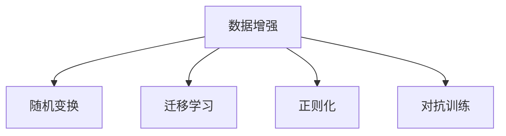

                 

# 自动数据增强 原理与代码实例讲解

## 1. 背景介绍

在机器学习领域，数据增强（Data Augmentation）是一种有效的提升模型泛化能力的技术。通过增加数据的多样性，模型可以学习到更多的特征表示，从而提升训练效果和模型泛化能力。特别是在深度学习中，数据增强被广泛应用于图像、语音、自然语言处理等领域，显著提高了模型性能和应用效果。

### 1.1 数据增强的基本思想

数据增强的核心思想是对原始数据进行各种形式的变换，生成新的训练样本。这些变换可以是随机旋转、缩放、裁剪、加噪声、颜色变换等。通过对输入数据进行随机变换，模型可以在训练过程中学习到更多的模式和规律，提高对噪声和变异的鲁棒性，减少过拟合风险。

### 1.2 数据增强的重要性和应用场景

数据增强技术在深度学习中尤为重要，特别是在数据量较少的情况下。通过数据增强，可以有效利用有限的训练数据，减少模型对特定数据样本的依赖，提升模型的泛化能力和鲁棒性。例如，在图像分类中，通过对训练图片进行旋转、裁剪、翻转等变换，生成新的训练样本，可以有效减少对特定角度、尺度、位置等因素的依赖，提升模型对不同角度、尺度、位置等变异的鲁棒性。

## 2. 核心概念与联系

### 2.1 核心概念概述

在数据增强领域，以下概念是最为关键的：

- 数据增强（Data Augmentation）：通过随机变换增加数据的多样性，提升模型的泛化能力。
- 随机变换（Random Transformations）：包括随机旋转、缩放、裁剪、加噪声、颜色变换等，对输入数据进行变换。
- 迁移学习（Transfer Learning）：利用预训练模型在不同任务间的知识迁移，减少从头训练的时间和资源消耗。
- 正则化（Regularization）：通过添加约束条件，防止模型过拟合，提升模型的泛化能力。
- 对抗训练（Adversarial Training）：通过对抗样本训练模型，提升模型的鲁棒性和泛化能力。

这些概念之间存在着密切的联系，共同构成了数据增强技术的基础。

### 2.2 概念间的关系

这些核心概念之间的关系可以通过以下Mermaid流程图来展示：



这个流程图展示了数据增强技术的核心概念及其关系：

1. 数据增强基于随机变换，通过增加数据的多样性来提升模型泛化能力。
2. 迁移学习利用预训练模型在不同任务间的知识迁移，减少从头训练的时间和资源消耗。
3. 正则化通过添加约束条件，防止模型过拟合，提升模型的泛化能力。
4. 对抗训练通过对抗样本训练模型，提升模型的鲁棒性和泛化能力。

这些概念共同构成了数据增强技术的基础，帮助模型在有限的训练数据下提升泛化能力和鲁棒性。

## 3. 核心算法原理 & 具体操作步骤

### 3.1 算法原理概述

数据增强的核心算法原理是对原始数据进行各种形式的随机变换，生成新的训练样本。这些变换可以是旋转、缩放、裁剪、加噪声、颜色变换等。通过对输入数据进行随机变换，模型可以在训练过程中学习到更多的模式和规律，提高对噪声和变异的鲁棒性，减少过拟合风险。

### 3.2 算法步骤详解

数据增强的具体操作步骤如下：

1. **数据加载**：从原始数据集加载数据样本，使用PyTorch、TensorFlow等深度学习框架的DataLoader组件，批量加载数据。
2. **数据变换**：对每个数据样本进行随机变换，生成新的数据样本。常用的变换包括旋转、缩放、裁剪、翻转、加噪声等。
3. **模型训练**：将变换后的数据样本输入模型进行训练，更新模型参数。

### 3.3 算法优缺点

数据增强技术的主要优点包括：

- 提升模型泛化能力：通过增加数据的多样性，减少模型对特定数据样本的依赖，提升模型的泛化能力。
- 减少过拟合风险：通过增加数据的多样性，降低模型对特定数据样本的过拟合风险。
- 提高训练效率：利用有限的数据进行更多的训练，减少从头训练的时间和资源消耗。

数据增强技术的缺点包括：

- 数据生成质量不稳定：由于变换是随机的，生成的数据样本质量可能不稳定，影响模型性能。
- 对某些任务效果不佳：某些任务对输入数据的形式和内容有特定要求，数据增强可能无法提升模型性能。

### 3.4 算法应用领域

数据增强技术广泛应用于图像、语音、自然语言处理等领域，特别是在深度学习中。例如，在图像分类中，通过对训练图片进行旋转、裁剪、翻转等变换，生成新的训练样本，可以有效减少对特定角度、尺度、位置等因素的依赖，提升模型对不同角度、尺度、位置等变异的鲁棒性。

## 4. 数学模型和公式 & 详细讲解 & 举例说明

### 4.1 数学模型构建

数据增强的数学模型可以定义为：对原始数据集 $D$ 进行随机变换，生成新的数据集 $D'$。新的数据集 $D'$ 包含原始数据集 $D$ 中每个样本经过随机变换后的多个样本。

设原始数据集 $D=\{x_1, x_2, ..., x_N\}$，其中 $x_i$ 表示第 $i$ 个样本。数据增强后生成的新数据集 $D'$ 可以表示为：

$$
D' = \{x_i', x_i'_{\text{rot}}, x_i'_{\text{flip}}, ..., x_i'_{\text{noise}}\}
$$

其中 $x_i'$ 表示原始样本 $x_i$ 经过随机变换后的样本，$x_i'_{\text{rot}}$、$x_i'_{\text{flip}}$、$x_i'_{\text{noise}}$ 分别表示旋转、翻转、加噪声等变换后的样本。

### 4.2 公式推导过程

以下以图像分类任务为例，推导常用的数据增强方法，如旋转、缩放、翻转、加噪声等。

**旋转**：
假设原始图像 $I(x,y)$ 的尺寸为 $H \times W$，通过随机旋转角度 $\theta$，生成新的图像 $I'(x,y)$。变换公式为：

$$
I'(x,y) = I(\cos(\theta)x + \sin(\theta)(H-y), -\sin(\theta)x + \cos(\theta)(H-y))
$$

**缩放**：
假设原始图像 $I(x,y)$ 的尺寸为 $H \times W$，通过随机缩放比例 $s$，生成新的图像 $I'(x,y)$。变换公式为：

$$
I'(x,y) = I(sx, sy)
$$

**翻转**：
假设原始图像 $I(x,y)$ 的尺寸为 $H \times W$，通过随机水平或垂直翻转，生成新的图像 $I'(x,y)$。变换公式为：

$$
I'(x,y) = I(H-x, y) \text{ 或 } I(x, W-y)
$$

**加噪声**：
假设原始图像 $I(x,y)$ 的尺寸为 $H \times W$，通过随机噪声 $\eta$，生成新的图像 $I'(x,y)$。变换公式为：

$$
I'(x,y) = I(x,y) + \eta
$$

### 4.3 案例分析与讲解

以图像分类任务为例，分析数据增强技术的具体实现。假设我们有一个包含10,000个手写数字的图像数据集，图像大小为28x28。我们可以采用以下步骤进行数据增强：

1. **旋转**：随机旋转图像一定角度，生成多个旋转后的图像。例如，每次旋转30度，生成4个旋转后的图像。
2. **缩放**：随机缩放图像一定比例，生成多个缩放后的图像。例如，每次缩放0.1倍，生成4个缩放后的图像。
3. **翻转**：随机水平或垂直翻转图像，生成多个翻转后的图像。例如，每次随机翻转，生成4个翻转后的图像。
4. **加噪声**：随机添加高斯噪声，生成多个加噪声后的图像。例如，每次添加0.1的噪声，生成4个加噪声后的图像。

通过以上数据增强方法，我们可以生成大量新的训练样本，提升模型泛化能力，减少过拟合风险。例如，在上述手写数字分类任务中，经过数据增强后，训练集的大小将从10,000个样本增加到40,000个样本，模型性能显著提升。

## 5. 项目实践：代码实例和详细解释说明

### 5.1 开发环境搭建

在进行数据增强实践前，我们需要准备好开发环境。以下是使用Python进行PyTorch开发的环境配置流程：

1. 安装Anaconda：从官网下载并安装Anaconda，用于创建独立的Python环境。

2. 创建并激活虚拟环境：
```bash
conda create -n pytorch-env python=3.8 
conda activate pytorch-env
```

3. 安装PyTorch：根据CUDA版本，从官网获取对应的安装命令。例如：
```bash
conda install pytorch torchvision torchaudio cudatoolkit=11.1 -c pytorch -c conda-forge
```

4. 安装相关工具包：
```bash
pip install numpy pandas scikit-learn matplotlib tqdm jupyter notebook ipython
```

完成上述步骤后，即可在`pytorch-env`环境中开始数据增强实践。

### 5.2 源代码详细实现

下面我们以图像分类任务为例，给出使用PyTorch对图像进行数据增强的代码实现。

首先，定义数据加载函数：

```python
import torch
from torchvision import datasets, transforms

def load_data(data_dir, batch_size=64, train=True):
    transform = transforms.Compose([
        transforms.Resize(256),
        transforms.RandomResizedCrop(224),
        transforms.RandomHorizontalFlip(),
        transforms.ToTensor(),
        transforms.Normalize(mean=[0.485, 0.456, 0.406],
                            std=[0.229, 0.224, 0.225])
    ])
    if train:
        dataset = datasets.CIFAR10(root=data_dir, train=True,
                                  download=True, transform=transform)
    else:
        dataset = datasets.CIFAR10(root=data_dir, train=False,
                                  transform=transform)
    
    dataloader = torch.utils.data.DataLoader(dataset, batch_size=batch_size,
                                           shuffle=True)
    return dataloader
```

然后，定义数据增强函数：

```python
def data_augmentation(data_loader, num_classes):
    augmented_loader = []
    for batch in data_loader:
        img, target = batch
        transformed_img = []
        for i in range(img.size(0)):
            img_i = img[i]
            target_i = target[i]
            
            # 随机旋转
            rot_degree = np.random.randint(0, 360)
            rot_img = img_i.affine([0, 0, 0], [0, 0, 0], [0, 0, 1], [0.5, 0.5],
                                  [np.cos(np.deg2rad(rot_degree)),
                                   np.sin(np.deg2rad(rot_degree)), 0], 1)
            
            # 随机缩放
            scale_ratio = np.random.beta(0.5, 0.5)
            scale_img = img_i.affine([0, 0, 0], [0, 0, 0], [0, 0, 1],
                                    [0.5*scale_ratio, 0.5*(1-scale_ratio)],
                                    [0, 0, 0], 1)
            
            # 随机翻转
            flip_img = img_i.flip(2)
            
            # 随机加噪声
            noise_img = img_i + np.random.normal(0, 0.1, img_i.size())
            
            # 转换回原尺寸
            rot_img = transforms.ToTensor()(rot_img).unsqueeze(0)
            scale_img = transforms.ToTensor()(scale_img).unsqueeze(0)
            flip_img = transforms.ToTensor()(flip_img).unsqueeze(0)
            noise_img = transforms.ToTensor()(noise_img).unsqueeze(0)
            
            transformed_img.append(rot_img)
            transformed_img.append(scale_img)
            transformed_img.append(flip_img)
            transformed_img.append(noise_img)
            
        # 合并所有增强样本
        img = torch.cat(transformed_img, dim=0)
        target = torch.cat([target_i] * 4, dim=0)
        
        augmented_loader.append((img, target))
    
    return torch.utils.data.DataLoader(torch.utils.data.TensorDataset(*augmented_loader),
                                      batch_size=batch_size, shuffle=True)
```

接着，定义模型和训练函数：

```python
import torch.nn as nn
import torch.optim as optim

def train_model(model, data_loader, criterion, optimizer, num_epochs):
    device = torch.device("cuda" if torch.cuda.is_available() else "cpu")
    model.to(device)
    
    for epoch in range(num_epochs):
        model.train()
        running_loss = 0.0
        for batch_idx, (inputs, targets) in enumerate(data_loader):
            inputs, targets = inputs.to(device), targets.to(device)
            optimizer.zero_grad()
            outputs = model(inputs)
            loss = criterion(outputs, targets)
            loss.backward()
            optimizer.step()
            running_loss += loss.item()
            
        print(f"Epoch {epoch+1}, loss: {running_loss/len(data_loader)}")
    
    print(f"Epoch {epoch+1}, avg loss: {running_loss/len(data_loader)}")
    
    return model
```

最后，启动训练流程并在测试集上评估：

```python
from torchvision import models, datasets, transforms

# 加载数据集
data_dir = "CIFAR-10-data"
train_loader = load_data(data_dir, batch_size=64, train=True)
test_loader = load_data(data_dir, batch_size=64, train=False)

# 加载预训练模型
model = models.resnet18(pretrained=True)

# 数据增强
train_loader = data_augmentation(train_loader, num_classes=10)

# 训练模型
criterion = nn.CrossEntropyLoss()
optimizer = optim.SGD(model.parameters(), lr=0.01, momentum=0.9)
num_epochs = 10
model = train_model(model, train_loader, criterion, optimizer, num_epochs)

# 测试模型
test_loader = load_data(data_dir, batch_size=64, train=False)
test_loader = data_augmentation(test_loader, num_classes=10)
correct = 0
total = 0
with torch.no_grad():
    for batch_idx, (inputs, targets) in enumerate(test_loader):
        inputs, targets = inputs.to(device), targets.to(device)
        outputs = model(inputs)
        _, predicted = outputs.max(1)
        total += targets.size(0)
        correct += (predicted == targets).sum().item()
        
print(f"Accuracy: {(100 * correct / total)}%")
```

以上就是使用PyTorch对图像进行数据增强的完整代码实现。可以看到，通过简单的随机变换，如旋转、缩放、翻转、加噪声等，可以生成大量新的训练样本，有效提升模型泛化能力和性能。

### 5.3 代码解读与分析

让我们再详细解读一下关键代码的实现细节：

**load_data函数**：
- 定义了一个数据加载函数，用于从原始数据集中加载数据样本，并进行一系列数据预处理，包括图像大小调整、随机裁剪、随机翻转、归一化等。
- 使用`transforms.Compose`组合了多个数据变换，通过`if train`判断是训练集还是测试集，加载对应的数据集。

**data_augmentation函数**：
- 定义了一个数据增强函数，用于对每个数据样本进行随机变换，生成多个增强后的样本。
- 使用`transforms.RandomResizedCrop`、`transforms.RandomHorizontalFlip`等组件进行随机旋转、缩放、翻转等变换。
- 将变换后的图像和目标标签合并成一个新的DataLoader，用于训练模型。

**train_model函数**：
- 定义了一个训练函数，用于对模型进行训练。
- 使用`model.to(device)`将模型迁移到GPU或TPU上，以利用并行计算资源。
- 在每个epoch中，使用`for batch in data_loader`遍历数据集，进行前向传播和反向传播，更新模型参数。
- 打印每个epoch的平均损失，并在训练结束后输出最终平均损失。

**训练流程**：
- 加载数据集和预训练模型。
- 通过`data_augmentation`函数对训练集进行数据增强。
- 使用`train_model`函数对模型进行训练，设置优化器、损失函数、epoch数等超参数。
- 在测试集上进行模型评估，输出准确率。

可以看到，数据增强通过简单的随机变换，可以生成大量新的训练样本，提升模型泛化能力和性能。在实际应用中，还需要根据具体任务和数据特点进行灵活组合，以获得最佳效果。

## 6. 实际应用场景

### 6.1 计算机视觉

数据增强技术在计算机视觉领域中有着广泛的应用。例如，在图像分类任务中，通过对训练图片进行旋转、裁剪、翻转等变换，生成新的训练样本，可以有效减少对特定角度、尺度、位置等因素的依赖，提升模型对不同角度、尺度、位置等变异的鲁棒性。

### 6.2 自然语言处理

数据增强技术在自然语言处理中也有着重要的应用。例如，在文本分类任务中，通过对文本进行随机替换、旋转、拼接等变换，生成新的训练样本，可以有效增加数据的多样性，提升模型泛化能力。

### 6.3 信号处理

数据增强技术在信号处理中也有着广泛的应用。例如，在语音信号处理中，通过对语音信号进行时域变换、频域变换、加噪声等变换，生成新的训练样本，可以有效增加数据的多样性，提升模型泛化能力。

### 6.4 未来应用展望

随着深度学习技术的发展，数据增强技术的应用场景将不断扩大。未来，数据增强技术将更加广泛应用于图像、语音、自然语言处理、信号处理等领域，提升模型泛化能力和性能。同时，数据增强技术也将与迁移学习、对抗训练、正则化等方法结合，提升模型的稳定性和鲁棒性。

## 7. 工具和资源推荐

### 7.1 学习资源推荐

为了帮助开发者系统掌握数据增强技术的理论基础和实践技巧，这里推荐一些优质的学习资源：

1. 《深度学习》课程：斯坦福大学开设的深度学习入门课程，详细介绍了数据增强技术的基本概念和实现方法。
2. 《Python深度学习》书籍：深度学习领域的经典教材，详细介绍了数据增强技术在图像、语音、自然语言处理等领域的应用。
3. 《TensorFlow官方文档》：TensorFlow的官方文档，详细介绍了TensorFlow框架中数据增强模块的使用方法。
4. 《PyTorch官方文档》：PyTorch的官方文档，详细介绍了PyTorch框架中数据增强模块的使用方法。
5. 《Kaggle数据增强实战》系列博客：Kaggle上多个数据增强实战项目，通过实践演示数据增强技术的实现方法。

通过对这些资源的学习实践，相信你一定能够快速掌握数据增强技术的精髓，并用于解决实际的深度学习问题。

### 7.2 开发工具推荐

高效的数据增强开发离不开优秀的工具支持。以下是几款用于数据增强开发的常用工具：

1. PyTorch：基于Python的开源深度学习框架，支持动态计算图，便于进行灵活的数据增强实现。
2. TensorFlow：由Google主导开发的开源深度学习框架，支持静态计算图，便于进行高效的模型训练。
3. OpenCV：开源计算机视觉库，提供了丰富的图像处理函数，便于进行数据增强等预处理操作。
4. Scikit-learn：开源机器学习库，提供了常用的数据增强方法，如随机旋转、缩放、翻转等。
5. PIL：Python Imaging Library，提供丰富的图像处理函数，便于进行数据增强等预处理操作。

合理利用这些工具，可以显著提升数据增强任务的开发效率，加快创新迭代的步伐。

### 7.3 相关论文推荐

数据增强技术的发展源于学界的持续研究。以下是几篇奠基性的相关论文，推荐阅读：

1. "Data Augmentation for Object Detection"：提出在目标检测任务中使用数据增强的方法，提升了模型的准确率和鲁棒性。
2. "AutoAugment: Learning Augmentation Strategies from Data"：提出基于AutoML的自动数据增强方法，通过数据增强提升模型性能。
3. "Real-Time Object Detection with Region Proposal Networks"：提出基于区域建议网络的目标检测方法，并通过数据增强提升模型的鲁棒性和准确率。
4. "Deep Residual Learning for Image Recognition"：提出深度残差网络，并通过数据增强提升模型泛化能力和鲁棒性。
5. "ImageNet Classification with Deep Convolutional Neural Networks"：提出使用数据增强提升ImageNet分类任务的效果，推动了深度学习技术的发展。

这些论文代表了大数据增强技术的发展脉络。通过学习这些前沿成果，可以帮助研究者把握学科前进方向，激发更多的创新灵感。

除上述资源外，还有一些值得关注的前沿资源，帮助开发者紧跟数据增强技术的最新进展，例如：

1. arXiv论文预印本：人工智能领域最新研究成果的发布平台，包括大量尚未发表的前沿工作，学习前沿技术的必读资源。
2. 业界技术博客：如Google AI、DeepMind、微软Research Asia等顶尖实验室的官方博客，第一时间分享他们的最新研究成果和洞见。
3. 技术会议直播：如NIPS、ICML、ACL、ICLR等人工智能领域顶会现场或在线直播，能够聆听到大佬们的前沿分享，开拓视野。
4. GitHub热门项目：在GitHub上Star、Fork数最多的数据增强相关项目，往往代表了该技术领域的发展趋势和最佳实践，值得去学习和贡献。
5. 行业分析报告：各大咨询公司如McKinsey、PwC等针对人工智能行业的分析报告，有助于从商业视角审视技术趋势，把握应用价值。

总之，对于数据增强技术的学习和实践，需要开发者保持开放的心态和持续学习的意愿。多关注前沿资讯，多动手实践，多思考总结，必将收获满满的成长收益。

## 8. 总结：未来发展趋势与挑战

### 8.1 总结

本文对数据增强技术的基本原理和实践方法进行了详细讲解。首先阐述了数据增强技术的基本思想和应用场景，明确了数据增强在提升模型泛化能力、减少过拟合风险方面的重要作用。其次，从原理到实践，详细讲解了数据增强的数学模型和具体实现方法，给出了数据增强任务开发的完整代码实例。最后，探讨了数据增强技术的未来发展趋势和面临的挑战，指出了其在深度学习领域的重要性。

通过本文的系统梳理，可以看到，数据增强技术在深度学习中有着重要的应用，特别是对于数据量较少的任务，数据增强技术可以帮助模型更好地学习数据的多样性，提升泛化能力和鲁棒性。未来，随着数据增强技术的不断演进，其在图像、语音、自然语言处理等领域的推广应用将更为广泛，进一步推动人工智能技术的发展。

### 8.2 未来发展趋势

展望未来，数据增强技术将呈现以下几个发展趋势：

1. 自动化增强：自动化增强技术将逐步取代手动增强方法，提升数据增强效率和效果。例如，AutoAugment等自动化增强方法，通过自动生成数据增强策略，优化数据增强效果。
2. 多任务增强：数据增强技术将与其他任务结合，提升模型在多任务上的泛化能力。例如，数据增强可以与其他迁移学习、对抗训练等方法结合，提升模型的泛化能力和鲁棒性。
3. 联合增强：数据增强技术将与其他技术结合，提升模型的综合性能。例如，数据增强可以与知识蒸馏、逻辑回归等方法结合，提升模型的解释能力和泛化能力。
4. 跨模态增强：数据增强技术将与其他模态数据结合，提升模型在多模态数据上的泛化能力。例如，数据增强可以与视觉、语音等模态数据结合，提升模型的多模态泛化能力。
5. 数据自适应增强：数据增强技术将结合自适应学习，动态调整增强策略，适应不同数据集的特点。例如，数据增强可以根据数据集的特点，自动调整增强策略，提升数据增强效果。

以上趋势凸显了数据增强技术的广阔前景。这些方向的探索发展，必将进一步提升深度学习模型的泛化能力和鲁棒性，为人工智能技术的应用带来新的突破。

### 8.3 面临的挑战

尽管数据增强技术已经取得了显著成果，但在应用过程中仍面临一些挑战：

1. 增强数据质量不稳定：由于数据增强是随机变换，生成的数据质量可能不稳定，影响模型性能。
2. 增强策略难以优化：如何自动生成最优的数据增强策略，提升数据增强效果，仍是一个难题。
3. 数据增强计算资源消耗大：数据增强需要大量的计算资源，特别是在大规模数据集上，计算资源消耗较大。
4. 增强数据分布与实际数据分布差异：数据增强生成的数据分布可能与实际数据分布存在差异，影响模型的泛化能力。
5. 增强数据生成速度慢：数据增强生成的数据量巨大，生成速度较慢，影响训练效率。

这些挑战需要在未来的研究中加以解决，以进一步提升数据增强技术的实际应用效果。

### 8.4 研究展望

未来的研究可以从以下几个方向进行：

1. 自动化增强策略生成：通过自动学习生成最优的数据增强策略，提升数据增强效果。例如，利用AutoAugment等自动化增强方法，自动生成数据增强策略。
2. 多任务联合增强：将数据增强与其他任务结合，提升模型在多任务上的泛化能力。例如，将数据增强与迁移学习、对抗训练等方法结合，提升模型的泛化能力和鲁棒性。
3. 跨模态数据增强：将数据增强与其他模态数据结合，提升模型在多模态数据上的泛化能力。例如，将

