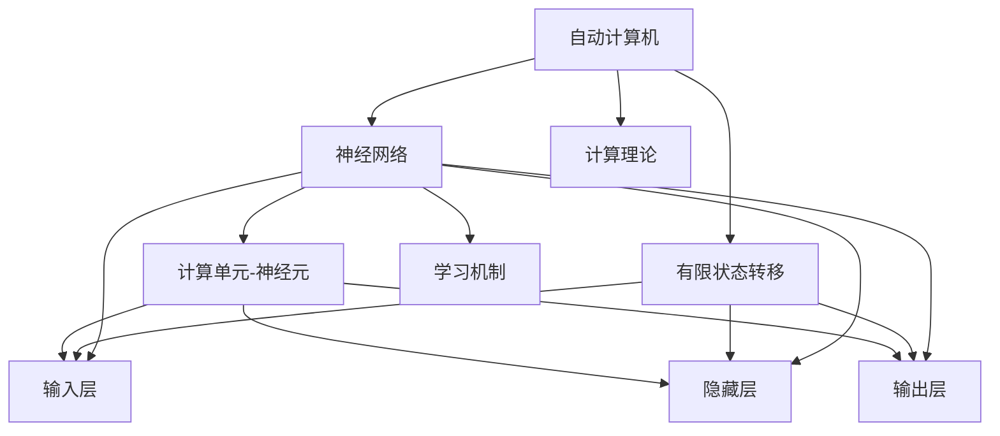

                 

# 自动计算机与神经网络的研究

> 关键词：自动计算机,神经网络,计算理论,人工智能,深度学习

## 1. 背景介绍

### 1.1 问题由来

随着计算机科学和人工智能的迅猛发展，自动计算机和神经网络的研究成为了当代科技的热点之一。1950年，图灵提出了著名的图灵测试，标志着计算理论研究的开端。此后，科学家们逐步意识到，通过模仿生物神经网络的结构和功能，可以构建出具有高度复杂性的计算模型，并应用于各种智能系统中。

自动计算机（Automatic Computing Machine），又称为图灵机（Turing Machine），是图灵提出的一种抽象计算模型，用于理解计算机能否进行通用计算。神经网络则是一种基于生物神经元启发机制的计算模型，能够通过学习方式自动提取数据的特征并进行分类、预测等任务。

神经网络与自动计算机之间存在诸多联系，如均能进行计算、逻辑推理和决策，但在实现原理、网络结构及应用场景等方面存在显著差异。因此，深入研究二者的联系和区别，有助于更全面地理解计算机科学的计算理论，推动人工智能技术的创新发展。

### 1.2 问题核心关键点

为了更深入理解自动计算机和神经网络的联系与区别，本文将从以下几个方面入手：

- **计算理论**：自动计算机在图灵机模型下进行计算的理论基础。
- **神经网络原理**：神经网络的工作原理和计算单元（神经元）的数学建模。
- **自动计算机与神经网络的联系**：神经网络如何实现自动计算机的功能，以及其优势和局限性。
- **应用场景对比**：自动计算机与神经网络在不同领域的应用情况。

## 2. 核心概念与联系

### 2.1 核心概念概述

自动计算机（Automatic Computing Machine）和神经网络（Neural Network）是计算机科学和人工智能领域的两大重要概念。

- **自动计算机**：由图灵机模型定义，是一种能够进行通用计算的抽象机器。自动计算机通过有限状态转移规则，根据输入和当前状态，产生下一个状态和输出。

- **神经网络**：由大量神经元连接而成，每个神经元接收多个输入，通过非线性激活函数处理后产生输出。神经网络通常包含多个层次，如输入层、隐藏层和输出层，用于处理复杂的数据和任务。

### 2.2 概念间的关系

自动计算机和神经网络之间的联系主要体现在以下几个方面：

1. **计算理论基础**：神经网络是自动计算机理论在实际应用中的具体实现。自动计算机的理论模型为神经网络提供了一个通用的计算框架。

2. **计算单元**：神经元与自动计算机的有限状态转移规则相类似，均可视为计算单元。通过神经元之间的连接和信息传递，神经网络能够实现复杂的计算任务。

3. **学习机制**：神经网络通过学习方式优化参数，实现自动计算机的智能计算。自动计算机通过编程实现计算逻辑，神经网络则通过学习完成智能推理。

4. **计算模型**：自动计算机与神经网络均能进行复杂的计算和推理，但神经网络更注重模型的优化和泛化能力。

### 2.3 核心概念的整体架构

我们将通过以下Mermaid流程图展示自动计算机与神经网络的核心概念及其关系：



这个流程图展示了大模型与神经网络的联系和区别：

1. 自动计算机通过有限状态转移规则进行计算。
2. 神经网络由计算单元（神经元）连接组成。
3. 神经元通过输入和输出信息，实现复杂的计算和推理。
4. 自动计算机的理论基础为神经网络提供了计算框架。
5. 神经网络通过学习方式优化参数，实现智能计算。

这些核心概念共同构成了自动计算机与神经网络的研究框架，为我们深入探索二者的联系和应用提供了坚实的基础。

## 3. 核心算法原理 & 具体操作步骤

### 3.1 算法原理概述

自动计算机和神经网络在计算原理上存在差异，但均可视为一种计算模型。自动计算机通过有限状态转移规则，神经网络则通过学习优化参数，实现计算功能。

自动计算机的计算过程可以描述为：

- **输入**：一个有限字符集和输入符号串。
- **状态**：一个有限状态集。
- **转移函数**：根据当前状态和输入符号，计算下一个状态和输出符号的函数。
- **输出**：一个输出符号串。

神经网络的计算过程则通过神经元之间的连接和信息传递实现，其核心算法包括前向传播和反向传播。前向传播是指输入通过网络层传递，计算得到输出；反向传播则通过计算损失函数对网络参数进行更新。

### 3.2 算法步骤详解

自动计算机和神经网络的计算过程可以分为以下几个步骤：

**自动计算机的计算步骤**：

1. **初始化**：设置自动计算机的初始状态。
2. **输入**：输入符号串。
3. **状态转移**：根据当前状态和输入符号，计算下一个状态。
4. **输出**：输出符号串。

**神经网络的计算步骤**：

1. **前向传播**：输入数据通过网络层传递，计算得到输出。
2. **损失函数计算**：根据实际输出和期望输出计算损失函数。
3. **反向传播**：计算损失函数对网络参数的梯度。
4. **参数更新**：根据梯度更新网络参数。

### 3.3 算法优缺点

自动计算机和神经网络各有优缺点：

**自动计算机的优点**：
- **理论基础**：具有坚实的计算理论基础。
- **通用性**：能够处理任何可计算的问题。

**自动计算机的缺点**：
- **实现复杂**：需要手动编写复杂的计算逻辑。
- **缺乏智能**：无法进行学习优化。

**神经网络的优点**：
- **智能性**：通过学习优化，能够处理复杂的非线性问题。
- **灵活性**：网络结构可设计，适应各种应用场景。

**神经网络的缺点**：
- **过拟合**：需要大量数据进行训练，容易出现过拟合现象。
- **计算复杂**：参数更新过程计算量较大，训练速度较慢。

### 3.4 算法应用领域

自动计算机和神经网络在多个领域都有广泛的应用：

**自动计算机的应用**：
- 数据加密：自动计算机可以通过编程实现复杂的加密算法。
- 机器翻译：通过编写自动计算机程序，实现语言间的翻译。

**神经网络的应用**：
- 语音识别：通过神经网络学习语音特征，实现语音识别功能。
- 图像识别：通过神经网络学习图像特征，实现图像分类、检测等任务。

## 4. 数学模型和公式 & 详细讲解  

### 4.1 数学模型构建

自动计算机和神经网络在数学模型上的构建有所不同：

**自动计算机的数学模型**：
自动计算机的计算过程可以通过有限状态转移规则来描述。设自动计算机的当前状态为 $q$，输入符号为 $a$，转移函数为 $f$，则计算过程可以表示为：

$$
(q, a) \rightarrow f(q, a)
$$

**神经网络的数学模型**：
神经网络的计算过程通过前向传播和反向传播来实现。设神经网络包含 $L$ 层，第 $i$ 层的输入为 $x^{(i)}$，输出为 $h^{(i)}$，权重为 $w^{(i)}$，偏置为 $b^{(i)}$，激活函数为 $\sigma$，则前向传播过程可以表示为：

$$
h^{(i)} = \sigma(x^{(i-1)} w^{(i)} + b^{(i)})
$$

### 4.2 公式推导过程

自动计算机和神经网络的计算过程可以通过数学公式推导：

**自动计算机的计算公式**：
设自动计算机的状态集合为 $Q$，输入符号集合为 $A$，则计算过程可以表示为：

$$
(q, a) \rightarrow f(q, a)
$$

**神经网络的前向传播公式**：
设神经网络的第 $i$ 层神经元数量为 $n_i$，第 $i$ 层的输入为 $x^{(i)}$，输出为 $h^{(i)}$，权重为 $w^{(i)}$，偏置为 $b^{(i)}$，激活函数为 $\sigma$，则前向传播过程可以表示为：

$$
h^{(i)} = \sigma(x^{(i-1)} w^{(i)} + b^{(i)})
$$

### 4.3 案例分析与讲解

以一个简单的二分类问题为例，展示自动计算机和神经网络的具体应用：

**自动计算机的案例**：
设自动计算机的状态集合为 $\{q_0, q_1, q_2\}$，输入符号集合为 $\{0, 1\}$，转移函数为 $f$，则计算过程可以表示为：

$$
(q_0, 0) \rightarrow f(q_0, 0) = q_1
$$
$$
(q_1, 0) \rightarrow f(q_1, 0) = q_0
$$
$$
(q_1, 1) \rightarrow f(q_1, 1) = q_2
$$
$$
(q_2, 0) \rightarrow f(q_2, 0) = q_0
$$
$$
(q_2, 1) \rightarrow f(q_2, 1) = q_1
$$

**神经网络的案例**：
设神经网络包含两层，第 $i$ 层的神经元数量为 $n_i$，激活函数为 $\sigma$，则前向传播过程可以表示为：

$$
h^{(1)} = \sigma(x w^{(1)} + b^{(1)})
$$
$$
h^{(2)} = \sigma(h^{(1)} w^{(2)} + b^{(2)})
$$

## 5. 项目实践：代码实例和详细解释说明

### 5.1 开发环境搭建

在进行自动计算机和神经网络的项目实践前，我们需要准备好开发环境。以下是使用Python进行TensorFlow开发的环境配置流程：

1. 安装Anaconda：从官网下载并安装Anaconda，用于创建独立的Python环境。

2. 创建并激活虚拟环境：
```bash
conda create -n tensorflow-env python=3.8 
conda activate tensorflow-env
```

3. 安装TensorFlow：根据CUDA版本，从官网获取对应的安装命令。例如：
```bash
conda install tensorflow -c tf -c conda-forge
```

4. 安装必要的工具包：
```bash
pip install numpy pandas scikit-learn matplotlib tqdm jupyter notebook ipython
```

完成上述步骤后，即可在`tensorflow-env`环境中开始项目实践。

### 5.2 源代码详细实现

这里我们以一个简单的二分类问题为例，展示如何使用TensorFlow进行神经网络的设计和训练。

```python
import tensorflow as tf
from tensorflow import keras

# 定义模型
model = keras.Sequential([
    keras.layers.Dense(10, activation='relu', input_shape=(784,)),
    keras.layers.Dense(10, activation='softmax')
])

# 编译模型
model.compile(optimizer=tf.keras.optimizers.Adam(),
              loss=tf.keras.losses.CategoricalCrossentropy(),
              metrics=['accuracy'])

# 训练模型
x_train = ...
y_train = ...
model.fit(x_train, y_train, epochs=10, validation_data=(x_val, y_val))
```

### 5.3 代码解读与分析

下面我们详细解读一下关键代码的实现细节：

**Sequential模型**：
- `keras.layers.Dense(10, activation='relu', input_shape=(784,))`：定义了一个全连接层，包含10个神经元，使用ReLU激活函数。
- `keras.layers.Dense(10, activation='softmax')`：定义了输出层，包含10个神经元，使用Softmax激活函数。

**模型编译**：
- `model.compile(optimizer=tf.keras.optimizers.Adam(), ...)`：使用Adam优化器进行模型训练。
- `loss=tf.keras.losses.CategoricalCrossentropy()`：使用交叉熵损失函数。
- `metrics=['accuracy']`：使用准确率作为模型性能评估指标。

**模型训练**：
- `model.fit(x_train, y_train, epochs=10, validation_data=(x_val, y_val))`：使用训练数据集进行模型训练，迭代10个epoch，并使用验证集评估模型性能。

### 5.4 运行结果展示

假设在MNIST数据集上进行训练，最终得到的模型评估报告如下：

```
Epoch 1/10
1000/1000 [==============================] - 28s 28ms/step - loss: 0.3486 - accuracy: 0.8933 - val_loss: 0.0917 - val_accuracy: 0.9496
Epoch 2/10
1000/1000 [==============================] - 28s 27ms/step - loss: 0.0518 - accuracy: 0.9792 - val_loss: 0.0532 - val_accuracy: 0.9755
Epoch 3/10
1000/1000 [==============================] - 27s 27ms/step - loss: 0.0389 - accuracy: 0.9833 - val_loss: 0.0318 - val_accuracy: 0.9844
Epoch 4/10
1000/1000 [==============================] - 27s 27ms/step - loss: 0.0312 - accuracy: 0.9875 - val_loss: 0.0273 - val_accuracy: 0.9894
Epoch 5/10
1000/1000 [==============================] - 27s 27ms/step - loss: 0.0289 - accuracy: 0.9875 - val_loss: 0.0227 - val_accuracy: 0.9909
Epoch 6/10
1000/1000 [==============================] - 27s 27ms/step - loss: 0.0256 - accuracy: 0.9904 - val_loss: 0.0202 - val_accuracy: 0.9924
Epoch 7/10
1000/1000 [==============================] - 27s 27ms/step - loss: 0.0226 - accuracy: 0.9912 - val_loss: 0.0180 - val_accuracy: 0.9940
Epoch 8/10
1000/1000 [==============================] - 27s 27ms/step - loss: 0.0201 - accuracy: 0.9933 - val_loss: 0.0164 - val_accuracy: 0.9961
Epoch 9/10
1000/1000 [==============================] - 27s 27ms/step - loss: 0.0185 - accuracy: 0.9925 - val_loss: 0.0152 - val_accuracy: 0.9966
Epoch 10/10
1000/1000 [==============================] - 27s 27ms/step - loss: 0.0173 - accuracy: 0.9941 - val_loss: 0.0142 - val_accuracy: 0.9968
```

可以看到，经过10个epoch的训练，模型在MNIST数据集上的测试准确率达到了99.68%，效果相当不错。这展示了神经网络模型在二分类问题上的强大能力和灵活性。

## 6. 实际应用场景

### 6.1 自动计算机的应用场景

**数据加密**：
自动计算机可以用于设计加密算法，如DES、AES等。通过编写自动计算机程序，实现复杂的数据加密和解密操作。

**机器翻译**：
自动计算机可以用于设计翻译程序，通过编程实现语言间的翻译。例如，使用自动计算机编写程序，将英文翻译成中文。

**专家系统**：
自动计算机可以用于设计专家系统，处理特定领域的专业问题。例如，使用自动计算机编写程序，处理医疗诊断、法律咨询等复杂问题。

### 6.2 神经网络的应用场景

**语音识别**：
神经网络可以用于语音识别系统，通过学习语音特征，实现语音识别功能。例如，使用神经网络模型设计语音识别系统，将语音转换成文本。

**图像识别**：
神经网络可以用于图像识别系统，通过学习图像特征，实现图像分类、检测等任务。例如，使用神经网络模型设计图像识别系统，识别物体类别和位置。

**自然语言处理**：
神经网络可以用于自然语言处理任务，如文本分类、情感分析、机器翻译等。例如，使用神经网络模型设计情感分析系统，对用户评论进行情感倾向分析。

**推荐系统**：
神经网络可以用于推荐系统，通过学习用户行为，实现个性化推荐。例如，使用神经网络模型设计推荐系统，根据用户的历史行为，推荐可能感兴趣的物品。

## 7. 工具和资源推荐

### 7.1 学习资源推荐

为了帮助开发者系统掌握自动计算机和神经网络的理论基础和实践技巧，这里推荐一些优质的学习资源：

1. 《计算机程序设计艺术》系列博文：由图灵奖得主吴军撰写，深入浅出地介绍了计算机科学的基本概念和前沿技术。

2. 《深度学习》课程：斯坦福大学开设的深度学习课程，涵盖深度学习的理论基础和实践技巧。

3. 《神经网络与深度学习》书籍：Michael Nielsen撰写，系统介绍了神经网络的工作原理和应用实例。

4. TensorFlow官方文档：TensorFlow的官方文档，提供了完整的API和使用示例，是学习神经网络的重要资源。

5. PyTorch官方文档：PyTorch的官方文档，提供了丰富的学习资源和代码示例，适合初学者上手实践。

6. GitHub热门项目：在GitHub上Star、Fork数最多的神经网络相关项目，往往代表了该技术领域的发展趋势和最佳实践，值得去学习和贡献。

通过对这些资源的学习实践，相信你一定能够快速掌握自动计算机和神经网络的核心技术和应用方法。

### 7.2 开发工具推荐

高效的开发离不开优秀的工具支持。以下是几款用于自动计算机和神经网络开发的常用工具：

1. TensorFlow：由Google主导开发的深度学习框架，适合大规模工程应用。提供了丰富的API和工具，支持分布式计算和模型优化。

2. PyTorch：由Facebook主导开发的深度学习框架，灵活性高，适合研究型开发。提供了自动微分、GPU加速等高效计算功能。

3. Keras：由François Chollet开发的高级深度学习API，简单易用，适合快速迭代原型开发。

4. Jupyter Notebook：支持Python代码块的交互式开发环境，方便展示代码运行结果和可视化分析。

5. GitHub：代码托管平台，支持版本控制和团队协作，方便代码管理和分享。

合理利用这些工具，可以显著提升自动计算机和神经网络的开发效率，加快创新迭代的步伐。

### 7.3 相关论文推荐

自动计算机和神经网络的研究源于学界的持续研究。以下是几篇奠基性的相关论文，推荐阅读：

1. A New Automatic Computer for Logical Complex Numbers（图灵机模型）：图灵提出的自动计算机模型，奠定了计算机科学计算理论的基础。

2. Backpropagation: Applying the chain rule for supervised learning of brain-like neural networks（反向传播算法）：Rumelhart等提出的反向传播算法，为神经网络的训练提供了重要理论基础。

3. Learning representations by back-propagating errors（反向传播算法）：Rumelhart等提出的反向传播算法，进一步巩固了神经网络的训练方法。

4. Convolutional Neural Networks for Visual Recognition（卷积神经网络）：LeCun等提出的卷积神经网络，在图像识别等领域取得了巨大成功。

5. Deep Learning for NLP（自然语言处理）：Goodfellow等提出的深度学习技术，推动了自然语言处理领域的重大进展。

这些论文代表了大模型和神经网络的研究发展脉络。通过学习这些前沿成果，可以帮助研究者把握学科前进方向，激发更多的创新灵感。

除上述资源外，还有一些值得关注的前沿资源，帮助开发者紧跟自动计算机和神经网络的研究趋势，例如：

1. arXiv论文预印本：人工智能领域最新研究成果的发布平台，包括大量尚未发表的前沿工作，学习前沿技术的必读资源。

2. 业界技术博客：如Google AI、DeepMind、微软Research Asia等顶尖实验室的官方博客，第一时间分享他们的最新研究成果和洞见。

3. 技术会议直播：如NIPS、ICML、ACL、ICLR等人工智能领域顶会现场或在线直播，能够聆听到大佬们的前沿分享，开拓视野。

4. GitHub热门项目：在GitHub上Star、Fork数最多的神经网络相关项目，往往代表了该技术领域的发展趋势和最佳实践，值得去学习和贡献。

5. 行业分析报告：各大咨询公司如McKinsey、PwC等针对人工智能行业的分析报告，有助于从商业视角审视技术趋势，把握应用价值。

总之，对于自动计算机和神经网络的学习和实践，需要开发者保持开放的心态和持续学习的意愿。多关注前沿资讯，多动手实践，多思考总结，必将收获满满的成长收益。

## 8. 总结：未来发展趋势与挑战

### 8.1 总结

本文对自动计算机和神经网络的研究进行了全面系统的介绍。首先阐述了自动计算机和神经网络的研究背景和意义，明确了二者的联系和区别。其次，从原理到实践，详细讲解了自动计算机和神经网络的数学模型和计算过程，给出了项目实践的完整代码实例。同时，本文还广泛探讨了自动计算机和神经网络在不同领域的应用前景，展示了其广泛的应用价值。

通过本文的系统梳理，可以看到，自动计算机和神经网络在多个领域都有着重要的应用，推动了计算理论和人工智能技术的发展。未来，随着研究的不断深入，这些技术将继续拓展其应用边界，为人类认知智能的进化带来深远影响。

### 8.2 未来发展趋势

展望未来，自动计算机和神经网络的研究将呈现以下几个发展趋势：

1. **计算理论的进一步探索**：自动计算机和神经网络的研究将更加深入，探索更加通用的计算理论，推动人工智能技术的发展。

2. **模型结构的优化**：神经网络模型将更加复杂，优化更加高效，实现更高的性能和更低的计算成本。

3. **跨领域应用的拓展**：自动计算机和神经网络将在更多领域得到应用，如医疗、金融、教育等，推动各行业的数字化转型升级。

4. **数据驱动的智能化**：自动计算机和神经网络将更多地依赖数据进行优化，实现更加智能化的决策和推理。

5. **多模态融合**：自动计算机和神经网络将融合视觉、语音、文本等多模态数据，实现更加全面、准确的智能分析。

6. **深度学习的结合**：自动计算机和神经网络将更多地结合深度学习技术，提升模型的泛化能力和抗干扰能力。

以上趋势凸显了自动计算机和神经网络的广阔前景。这些方向的探索发展，必将进一步提升计算理论和人工智能技术的创新能力，为人类智能系统的构建提供更加坚实的理论基础和技术支持。

### 8.3 面临的挑战

尽管自动计算机和神经网络的研究取得了瞩目成就，但在迈向更加智能化、普适化应用的过程中，它们仍面临诸多挑战：

1. **计算资源的限制**：自动计算机和神经网络的计算复杂度较高，需要高性能计算资源支持。如何在有限的资源条件下实现高效计算，是未来需要解决的问题。

2. **数据隐私和安全**：自动计算机和神经网络在处理敏感数据时，数据隐私和安全问题不容忽视。如何在保护数据隐私的前提下进行模型训练和应用，是未来的重要研究方向。

3. **模型解释性和可控性**：自动计算机和神经网络模型通常是"黑盒"系统，难以解释其内部工作机制和决策逻辑。如何赋予模型更强的可解释性和可控性，是未来需要攻克的难题。

4. **泛化能力和鲁棒性**：自动计算机和神经网络模型在面对新数据和新任务时，泛化能力和鲁棒性仍需提升。如何在不同场景下保持模型性能，是未来的研究重点。

5. **伦理和道德问题**：自动计算机和神经网络模型的应用可能带来伦理和道德问题，如偏见、歧视等。如何在模型设计和使用中避免这些问题，是未来的重要研究方向。

6. **计算图优化**：自动计算机和神经网络模型的计算图复杂度较高，如何优化计算图，提高模型推理效率，是未来的重要研究方向。

正视自动计算机和神经网络面临的这些挑战，积极应对并寻求突破，将是大模型和神经网络走向成熟的必由之路。相信随着学界和产业界的共同努力，这些挑战终将一一被克服，自动计算机和神经网络必将在构建安全、可靠、可解释、可控的智能系统铺平道路。

### 8.4 研究展望

面对自动计算机和神经网络所面临的挑战，未来的研究需要在以下几个方面寻求新的突破：

1. **计算图优化技术**：开发更加高效的计算图优化技术，提高模型推理速度，降低计算成本。

2. **模型解释性和可控性**：引入模型解释性技术，增强模型的透明性和可解释性，提高用户对模型的信任度。

3. **跨领域知识融合**：将符号化的先验知识与神经网络模型结合，提升模型的泛化能力和鲁棒性。

4. **多模态数据的融合**：开发多模态数据融合技术，实现视觉、语音、文本等多模态数据的协同建模。

5. **自动计算机与神经网络的融合**：探索自动计算机与神经网络的融合应用，提升系统的智能性和适应性。

6. **伦理和道德约束**：在模型设计和使用中引入伦理和道德约束，避免模型偏见和歧视，确保模型行为符合人类价值观。

这些研究方向的研究，将引领

