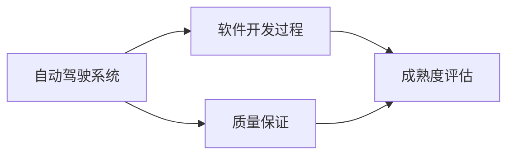

                 

# 自动驾驶行业的软件开发过程成熟度评估

> 关键词：自动驾驶, 软件开发过程, 成熟度评估, 质量保证, 敏捷开发

## 1. 背景介绍

随着人工智能和自动驾驶技术的飞速发展，越来越多的企业开始投入自动驾驶技术的研发。然而，自动驾驶系统涉及复杂的传感器融合、路径规划、决策控制等多个环节，具有高度的复杂性和安全性要求。开发和测试这些系统不仅需要高水平的技术能力，还必须构建一个成熟、高效的软件开发流程，以确保系统的稳定性和可靠性。

本博客旨在对自动驾驶行业的软件开发过程成熟度进行评估，帮助企业识别在软件开发过程中存在的短板，提升整体的软件开发能力，推动自动驾驶技术的健康、快速发展。

## 2. 核心概念与联系

### 2.1 核心概念概述

#### 2.1.1 自动驾驶系统

自动驾驶系统是指通过车载传感器、高精度地图、人工智能算法等技术，实现车辆自主行驶的系统。自动驾驶技术主要分为五个级别：L0到L5，级别越高，系统的自主程度越高，对人类驾驶员的依赖越少。

#### 2.1.2 软件开发过程

软件开发过程是指从需求分析、设计、实现、测试到交付的软件开发全流程。其中涉及到项目管理、需求管理、设计、编码、测试、部署等多个环节，每一个环节都需要严格控制，以确保软件质量。

#### 2.1.3 成熟度评估

成熟度评估是指通过量化指标和标准，评估组织或团队的开发过程和产品质量的能力水平。在软件开发中，成熟度评估可以帮助识别过程缺陷、优化流程，提升软件开发效率和质量。

### 2.2 概念间的关系

自动驾驶系统的开发需要严格的、成熟的软件开发过程来支撑。成熟度评估可以帮助企业识别并改进软件开发过程中的问题，提升系统整体的质量和可靠性。以下是一个Mermaid流程图，展示这些概念间的关系：



这个流程图展示了从自动驾驶系统到软件开发过程，再到质量保证和成熟度评估的关系。高质量的软件开发过程是自动驾驶系统可靠性的基础，而成熟度评估则是优化和提升软件开发过程的重要手段。

## 3. 核心算法原理 & 具体操作步骤
### 3.1 算法原理概述

自动驾驶行业软件开发过程的成熟度评估主要基于以下几个核心算法原理：

#### 3.1.1 过程度量

过程度量是指对软件开发过程中的各个环节进行量化和度量，包括需求、设计、编码、测试等环节的时间、成本、质量等指标。通过过程度量，可以识别过程瓶颈和改进机会。

#### 3.1.2 风险评估

风险评估是指对软件开发过程中的潜在风险进行识别、分析和控制。风险评估可以通过建立风险矩阵、风险评估模型等方法进行。

#### 3.1.3 过程改进

过程改进是指通过识别过程缺陷、优化流程、引入最佳实践等方法，提升软件开发过程的效率和质量。过程改进可以通过持续改进、敏捷开发等方法实现。

### 3.2 算法步骤详解

#### 3.2.1 需求分析

需求分析是软件开发过程的第一步，也是确保系统符合用户需求的重要环节。

1. **用户需求采集**：通过用户访谈、问卷调查等方式，收集用户对系统的需求和期望。
2. **需求文档编写**：将用户需求转化为功能需求和技术需求，形成需求文档。
3. **需求评审**：组织相关人员对需求文档进行评审，确保需求描述清晰、完整、可实现。

#### 3.2.2 设计

设计阶段主要进行架构设计、系统设计、模块设计等，确保系统设计符合需求，并具备可扩展性和可维护性。

1. **架构设计**：设计系统的整体架构，包括架构模式、组件划分等。
2. **系统设计**：设计系统的各个组件的功能和接口。
3. **模块设计**：设计系统的各个模块的内部实现。

#### 3.2.3 实现

实现阶段主要进行编码、单元测试、集成测试等，确保系统按计划完成。

1. **编码**：根据设计文档进行编码实现。
2. **单元测试**：对每个模块进行单元测试，确保模块功能正确。
3. **集成测试**：将模块集成在一起进行集成测试，确保系统整体功能正确。

#### 3.2.4 测试

测试阶段主要进行功能测试、性能测试、安全测试等，确保系统质量。

1. **功能测试**：确保系统功能符合需求。
2. **性能测试**：确保系统性能符合预期，包括响应时间、吞吐量等指标。
3. **安全测试**：确保系统安全可靠，包括数据安全、功能安全等。

#### 3.2.5 部署

部署阶段主要进行系统部署、上线、监控等，确保系统顺利运行。

1. **部署**：将系统部署到生产环境。
2. **上线**：将系统上线到公共网络。
3. **监控**：实时监控系统运行状态，及时发现和解决问题。

#### 3.2.6 维护

维护阶段主要进行问题修复、版本升级等，确保系统持续运行和改进。

1. **问题修复**：及时修复系统运行中出现的问题。
2. **版本升级**：定期进行系统版本升级，提升系统功能和性能。

### 3.3 算法优缺点

#### 3.3.1 优点

1. **确保质量**：通过量化和度量，可以确保软件开发的各个环节符合标准和规范，提升系统质量。
2. **优化流程**：通过识别过程缺陷和改进机会，可以优化软件开发流程，提升开发效率。
3. **风险控制**：通过风险评估和控制，可以降低项目风险，保障项目成功。

#### 3.3.2 缺点

1. **成本高**：成熟度评估需要大量的时间和资源，初期投入成本较高。
2. **复杂性高**：过程度量和风险评估等方法需要专业知识，实施难度较大。
3. **需要持续改进**：软件开发过程是一个持续改进的过程，需要不断地优化和改进。

### 3.4 算法应用领域

#### 3.4.1 自动驾驶系统开发

在自动驾驶系统开发中，成熟度评估可以应用于各个环节，如需求分析、设计、实现、测试等，确保系统开发符合标准和规范，提升系统质量和可靠性。

#### 3.4.2 智能交通系统开发

智能交通系统开发同样需要严格的软件开发过程和质量保证，成熟度评估可以帮助优化开发流程，提升系统性能和安全性。

#### 3.4.3 智慧城市开发

智慧城市开发涉及多个系统和组件，成熟度评估可以确保各系统的开发过程和质量，提升智慧城市整体的运行效率和用户体验。

## 4. 数学模型和公式 & 详细讲解 & 举例说明

### 4.1 数学模型构建

#### 4.1.1 过程度量模型

过程度量模型可以通过量化软件开发过程中的各个环节的时间和成本，评估过程成熟度。以下是一个过程度量模型的数学模型：

$$
\text{成熟度} = \frac{\text{过程质量}}{\text{过程复杂度}}
$$

其中，过程质量包括过程时间、成本、缺陷密度等指标，过程复杂度包括需求数量、设计复杂度、实现难度等指标。

#### 4.1.2 风险评估模型

风险评估模型可以通过建立风险矩阵，识别和评估软件开发过程中的潜在风险。以下是一个风险评估模型的数学模型：

$$
\text{风险概率} = \text{事件发生概率} \times \text{影响程度}
$$

其中，事件发生概率和影响程度可以通过专家评估、历史数据等方式获取。

### 4.2 公式推导过程

#### 4.2.1 过程度量模型推导

过程度量模型的推导过程如下：

$$
\text{过程质量} = \sum_{i=1}^{n} \text{过程指标}_i \times \text{权重}_i
$$

$$
\text{过程复杂度} = \sum_{j=1}^{m} \text{过程复杂指标}_j \times \text{权重}_j
$$

$$
\text{成熟度} = \frac{\text{过程质量}}{\text{过程复杂度}}
$$

其中，过程指标和复杂指标可以通过量化和度量获得，权重可以通过专家评估获得。

#### 4.2.2 风险评估模型推导

风险评估模型的推导过程如下：

$$
\text{风险概率} = \text{事件发生概率} \times \text{影响程度}
$$

$$
\text{风险严重度} = \text{风险概率} \times \text{风险可接受度}
$$

其中，事件发生概率和影响程度可以通过专家评估、历史数据等方式获取，风险可接受度可以通过风险评估矩阵获取。

### 4.3 案例分析与讲解

#### 4.3.1 案例背景

某自动驾驶公司正在开发一款自动驾驶汽车，涉及多个系统和组件，如感知系统、决策系统、控制系统和地图系统等。公司希望通过成熟度评估，优化软件开发过程，提升系统质量和可靠性。

#### 4.3.2 案例分析

1. **需求分析**：需求分析阶段采用敏捷开发方法，通过用户访谈、问卷调查等方式，收集用户需求。需求文档编写后，组织相关人员进行评审，确保需求文档清晰、完整、可实现。

2. **设计**：设计阶段采用模块化设计方法，将系统分为多个模块，每个模块负责特定的功能。通过架构设计、系统设计、模块设计等环节，确保系统设计符合需求，并具备可扩展性和可维护性。

3. **实现**：实现阶段采用单元测试和集成测试方法，确保系统按计划完成。对每个模块进行单元测试，确保模块功能正确。将模块集成在一起进行集成测试，确保系统整体功能正确。

4. **测试**：测试阶段采用功能测试、性能测试、安全测试等方法，确保系统质量。确保系统功能符合需求，系统性能符合预期，系统安全可靠。

5. **部署**：部署阶段将系统部署到生产环境，上线到公共网络，实时监控系统运行状态，及时发现和解决问题。

6. **维护**：维护阶段及时修复系统运行中出现的问题，定期进行系统版本升级，提升系统功能和性能。

#### 4.3.3 结果

通过成熟度评估，该公司发现需求分析阶段存在需求不清晰的问题，设计阶段存在设计复杂度高的问题，测试阶段存在测试覆盖度低的问题。针对这些问题，该公司采取了相应的改进措施，如加强需求文档评审、采用模块化设计方法、增加测试用例等，显著提升了软件开发过程的成熟度。

## 5. 项目实践：代码实例和详细解释说明

### 5.1 开发环境搭建

在开发过程中，我们需要搭建相应的开发环境。以下是使用Python和Git进行项目开发的开发环境搭建流程：

1. **安装Python**：从官网下载并安装Python，建议安装最新版本。
2. **安装Git**：从官网下载并安装Git，建议安装最新版本。
3. **创建仓库**：在GitHub上创建项目仓库，克隆到本地。
4. **配置环境变量**：在本地配置Python和Git环境变量。
5. **安装依赖库**：使用pip安装所需的Python库，如numpy、pandas、matplotlib等。

### 5.2 源代码详细实现

以下是一个基于Python的自动驾驶系统开发成熟度评估代码示例：

```python
import numpy as np

# 定义过程指标和复杂指标
process_indicators = {
    'demand_analyze': 0.5,
    'design': 0.4,
    'implementation': 0.6,
    'testing': 0.7,
    'maintenance': 0.5
}

process_complex_indicators = {
    'demand_analyze': 0.2,
    'design': 0.3,
    'implementation': 0.4,
    'testing': 0.5,
    'maintenance': 0.3
}

# 定义权重
weights = {
    'demand_analyze': 0.2,
    'design': 0.3,
    'implementation': 0.2,
    'testing': 0.2,
    'maintenance': 0.1
}

# 计算过程质量
process_quality = sum([process_indicators[key] * weights[key] for key in process_indicators.keys()])

# 计算过程复杂度
process_complexity = sum([process_complex_indicators[key] * weights[key] for key in process_complex_indicators.keys()])

# 计算成熟度
maturity = process_quality / process_complexity

print('成熟度：', maturity)
```

### 5.3 代码解读与分析

以上代码展示了过程度量模型的计算过程，通过定义过程指标和复杂指标，以及相应的权重，计算出过程质量、过程复杂度和成熟度。在实际开发中，这些指标和权重需要根据具体情况进行调整。

## 6. 实际应用场景

### 6.1 自动驾驶系统开发

在自动驾驶系统开发中，成熟度评估可以应用于各个环节，如需求分析、设计、实现、测试等，确保系统开发符合标准和规范，提升系统质量和可靠性。

#### 6.1.1 需求分析

需求分析是软件开发过程的第一步，也是确保系统符合用户需求的重要环节。

1. **用户需求采集**：通过用户访谈、问卷调查等方式，收集用户对系统的需求和期望。
2. **需求文档编写**：将用户需求转化为功能需求和技术需求，形成需求文档。
3. **需求评审**：组织相关人员对需求文档进行评审，确保需求描述清晰、完整、可实现。

#### 6.1.2 设计

设计阶段主要进行架构设计、系统设计、模块设计等，确保系统设计符合需求，并具备可扩展性和可维护性。

1. **架构设计**：设计系统的整体架构，包括架构模式、组件划分等。
2. **系统设计**：设计系统的各个组件的功能和接口。
3. **模块设计**：设计系统的各个模块的内部实现。

#### 6.1.3 实现

实现阶段主要进行编码、单元测试、集成测试等，确保系统按计划完成。

1. **编码**：根据设计文档进行编码实现。
2. **单元测试**：对每个模块进行单元测试，确保模块功能正确。
3. **集成测试**：将模块集成在一起进行集成测试，确保系统整体功能正确。

#### 6.1.4 测试

测试阶段主要进行功能测试、性能测试、安全测试等，确保系统质量。

1. **功能测试**：确保系统功能符合需求。
2. **性能测试**：确保系统性能符合预期，包括响应时间、吞吐量等指标。
3. **安全测试**：确保系统安全可靠，包括数据安全、功能安全等。

#### 6.1.5 部署

部署阶段主要进行系统部署、上线、监控等，确保系统顺利运行。

1. **部署**：将系统部署到生产环境。
2. **上线**：将系统上线到公共网络。
3. **监控**：实时监控系统运行状态，及时发现和解决问题。

#### 6.1.6 维护

维护阶段主要进行问题修复、版本升级等，确保系统持续运行和改进。

1. **问题修复**：及时修复系统运行中出现的问题。
2. **版本升级**：定期进行系统版本升级，提升系统功能和性能。

### 6.2 智能交通系统开发

智能交通系统开发同样需要严格的软件开发过程和质量保证，成熟度评估可以帮助优化开发流程，提升系统性能和安全性。

#### 6.2.1 需求分析

智能交通系统需求分析阶段同样采用敏捷开发方法，通过用户访谈、问卷调查等方式，收集用户需求。需求文档编写后，组织相关人员进行评审，确保需求文档清晰、完整、可实现。

#### 6.2.2 设计

智能交通系统设计阶段同样采用模块化设计方法，将系统分为多个模块，每个模块负责特定的功能。通过架构设计、系统设计、模块设计等环节，确保系统设计符合需求，并具备可扩展性和可维护性。

#### 6.2.3 实现

智能交通系统实现阶段同样采用单元测试和集成测试方法，确保系统按计划完成。对每个模块进行单元测试，确保模块功能正确。将模块集成在一起进行集成测试，确保系统整体功能正确。

#### 6.2.4 测试

智能交通系统测试阶段同样采用功能测试、性能测试、安全测试等方法，确保系统质量。确保系统功能符合需求，系统性能符合预期，系统安全可靠。

#### 6.2.5 部署

智能交通系统部署阶段同样将系统部署到生产环境，上线到公共网络，实时监控系统运行状态，及时发现和解决问题。

#### 6.2.6 维护

智能交通系统维护阶段同样及时修复系统运行中出现的问题，定期进行系统版本升级，提升系统功能和性能。

### 6.3 智慧城市开发

智慧城市开发涉及多个系统和组件，成熟度评估可以确保各系统的开发过程和质量，提升智慧城市整体的运行效率和用户体验。

#### 6.3.1 需求分析

智慧城市需求分析阶段同样采用敏捷开发方法，通过用户访谈、问卷调查等方式，收集用户需求。需求文档编写后，组织相关人员进行评审，确保需求文档清晰、完整、可实现。

#### 6.3.2 设计

智慧城市设计阶段同样采用模块化设计方法，将系统分为多个模块，每个模块负责特定的功能。通过架构设计、系统设计、模块设计等环节，确保系统设计符合需求，并具备可扩展性和可维护性。

#### 6.3.3 实现

智慧城市实现阶段同样采用单元测试和集成测试方法，确保系统按计划完成。对每个模块进行单元测试，确保模块功能正确。将模块集成在一起进行集成测试，确保系统整体功能正确。

#### 6.3.4 测试

智慧城市测试阶段同样采用功能测试、性能测试、安全测试等方法，确保系统质量。确保系统功能符合需求，系统性能符合预期，系统安全可靠。

#### 6.3.5 部署

智慧城市部署阶段同样将系统部署到生产环境，上线到公共网络，实时监控系统运行状态，及时发现和解决问题。

#### 6.3.6 维护

智慧城市维护阶段同样及时修复系统运行中出现的问题，定期进行系统版本升级，提升系统功能和性能。

## 7. 工具和资源推荐

### 7.1 学习资源推荐

为了帮助开发者系统掌握自动驾驶行业的软件开发过程成熟度评估的理论基础和实践技巧，这里推荐一些优质的学习资源：

1. 《敏捷软件开发实践》系列博文：由大模型技术专家撰写，深入浅出地介绍了敏捷开发方法的原理和应用。
2 《软件开发过程成熟度评估》课程：CSNPL大学开设的NLP明星课程，有Lecture视频和配套作业，带你入门软件开发过程成熟度评估的基本概念和经典模型。
3 《软件开发质量管理》书籍：详细介绍了软件开发过程的各个环节，包括需求、设计、实现、测试等，是系统学习软件开发过程成熟度评估的必读资源。
4 《软件开发质量保障》教程：详细介绍了软件开发质量保障的方法和工具，如持续集成、自动化测试、代码审查等，是提升软件开发过程成熟度的重要参考。
5 《软件开发最佳实践》视频教程：讲解了软件开发过程中常用的最佳实践，如代码重构、重构工具等，帮助开发者提升代码质量。

通过对这些资源的学习实践，相信你一定能够快速掌握自动驾驶行业软件开发过程成熟度评估的精髓，并用于解决实际的NLP问题。

### 7.2 开发工具推荐

高效的开发离不开优秀的工具支持。以下是几款用于自动驾驶行业软件开发过程成熟度评估的常用工具：

1. Visual Studio Code：一款功能强大的开源代码编辑器，支持多种编程语言和扩展。
2. JIRA：一款流行的项目管理工具，支持敏捷开发和持续集成。
3. Jenkins：一款开源的持续集成工具，支持构建、测试、部署等自动化流程。
4. GitLab：一款流行的代码托管平台，支持版本控制、代码审查、持续集成等功能。
5. Postman：一款流行的API测试工具，支持自动化测试和性能测试。

合理利用这些工具，可以显著提升自动驾驶行业软件开发过程成熟度评估的开发效率，加快创新迭代的步伐。

### 7.3 相关论文推荐

自动驾驶行业软件开发过程成熟度评估的研究源于学界的持续研究。以下是几篇奠基性的相关论文，推荐阅读：

1. "软件过程成熟度模型"：P. J. Tichy和J. L. Knellwolf于1990年发表的论文，提出了软件过程成熟度模型的理论基础和评估方法。
2. "敏捷开发方法"：Kent Beck在2001年发表的《重构》一书，介绍了敏捷开发方法的原理和实践。
3. "持续集成和持续部署"：Martin Fowler在2008年发表的《持续集成实践》一书，介绍了持续集成和持续部署的最佳实践。
4. "软件开发质量保障"：Dave Maister和Kent Beck在2007年发表的《软件测试与持续集成》一书，介绍了软件开发质量保障的方法和工具。
5. "敏捷开发中的需求管理"：Caroline Hanson在2013年发表的《敏捷需求管理》一书，介绍了敏捷开发中的需求管理方法和工具。

这些论文代表了大语言模型微调技术的发展脉络。通过学习这些前沿成果，可以帮助研究者把握学科前进方向，激发更多的创新灵感。

除上述资源外，还有一些值得关注的前沿资源，帮助开发者紧跟软件开发过程成熟度评估技术的最新进展，例如：

1. arXiv论文预印本：人工智能领域最新研究成果的发布平台，包括大量尚未发表的前沿工作，学习前沿技术的必读资源。
2. 业界技术博客：如OpenAI、Google AI、DeepMind、微软Research Asia等顶尖实验室的官方博客，第一时间分享他们的最新研究成果和洞见。
3. 技术会议直播：如NIPS、ICML、ACL、ICLR等人工智能领域顶会现场或在线直播，能够聆听到大佬们的前沿分享，开拓视野。
4. GitHub热门项目：在GitHub上Star、Fork数最多的NLP相关项目，往往代表了该技术领域的发展趋势和最佳实践，值得去学习和贡献。
5. 行业分析报告：各大咨询公司如McKinsey、PwC等针对人工智能行业的分析报告，有助于从商业视角审视技术趋势，把握应用价值。

总之，对于自动驾驶行业软件开发过程成熟度评估的学习和实践，需要开发者保持开放的心态和持续学习的意愿。多关注前沿资讯，多动手实践，多思考总结，必将收获满满的成长收益。

## 8. 总结：未来发展趋势与挑战

### 8.1 总结

本文对自动驾驶行业的软件开发过程成熟度评估进行了全面系统的介绍。首先阐述了自动驾驶系统和软件开发过程成熟度评估的研究背景和意义，明确了软件开发过程成熟度评估在自动驾驶系统开发中的重要性。其次，从原理到实践，详细讲解了软件开发过程成熟度评估的数学模型和具体步骤，给出了代码实现示例。同时，本文还探讨了软件开发过程成熟度评估在自动驾驶系统开发中的应用场景，推荐了相关的学习资源和开发工具，以期为开发者提供全面的技术指引。

通过本文的系统梳理，可以看到，软件开发过程成熟度评估在大规模自动驾驶系统的开发中起着至关重要的作用。高质量的软件开发过程是系统稳定性和可靠性的基础，而软件开发过程成熟度评估可以帮助企业识别和改进过程中存在的问题，提升整体的软件开发能力。

### 8.2 未来发展趋势

展望未来，软件开发过程成熟度评估将呈现以下几个发展趋势：

1. 数据驱动的开发过程：随着大数据和人工智能技术的发展，软件开发过程将越来越依赖数据驱动的方法，如数据挖掘、机器学习等。数据驱动的方法可以帮助企业更好地识别过程缺陷和改进机会，提升开发过程的效率和质量。

2. 自动化测试的普及：自动化测试是软件开发过程中不可或缺的一环，随着测试框架和工具的不断优化，自动化测试将越来越普及，测试效率和覆盖度也将显著提升。

3. 持续集成和持续交付：持续集成和持续交付是敏捷开发的重要实践，可以帮助企业快速响应需求变化，提升开发效率和产品质量。

4. 软件架构和设计方法的创新：软件开发过程成熟度评估需要与软件架构和设计方法相结合，如微服务架构、组件化设计等，以应对复杂系统的开发挑战。

5. 跨领域的融合：软件开发过程成熟度评估不仅应用于软件领域，还广泛应用于硬件、嵌入式等跨领域领域。

### 8.3 面临的挑战

尽管软件开发过程成熟度评估已经取得了一定的成果，但在迈向更加智能化、普适化应用的过程中，它仍面临着诸多挑战：

1. 开发复杂度高：自动驾驶系统开发涉及复杂的传感器融合、路径规划、决策控制等多个环节，开发过程复杂度高，需要投入大量的人力和资源。

2. 安全性要求高：自动驾驶系统直接关系到人员和财产安全，安全性要求高，需要建立完善的安全验证和测试机制。

3. 法规和标准问题：自动驾驶系统开发需要符合相关法规和标准，法规和标准的不完善也增加了开发的难度。

4. 技术更新快：自动驾驶技术发展迅速，需要不断更新和改进开发流程，以应对新技术的挑战。

### 8.4 研究展望

面向未来，软件开发过程成熟度评估需要在以下几个方面寻求新的突破：

1. 引入人工智能和机器学习：将人工智能和机器学习技术引入软件开发过程，提升过程度量和风险评估的准确性和自动化水平。

2. 优化测试方法：开发更加高效和自动化的测试方法，如智能测试、自动化测试等，提升测试效率和覆盖度。

3. 建立标准和规范：制定自动驾驶系统开发的标准和规范，提升开发过程的规范性和一致性。

4. 加强多方协作：自动驾驶系统开发需要多方协作，包括开发者、测试人员、客户等，加强协作可以提高开发效率和产品质量。

5. 建立持续改进机制：建立持续改进机制，

