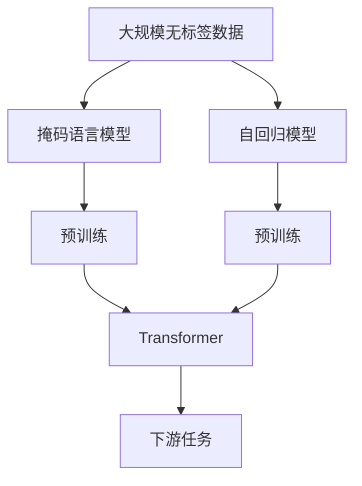
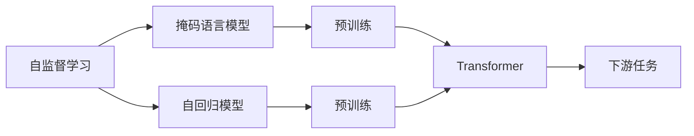
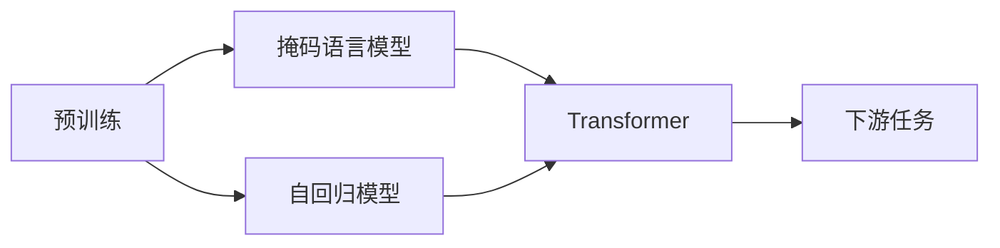
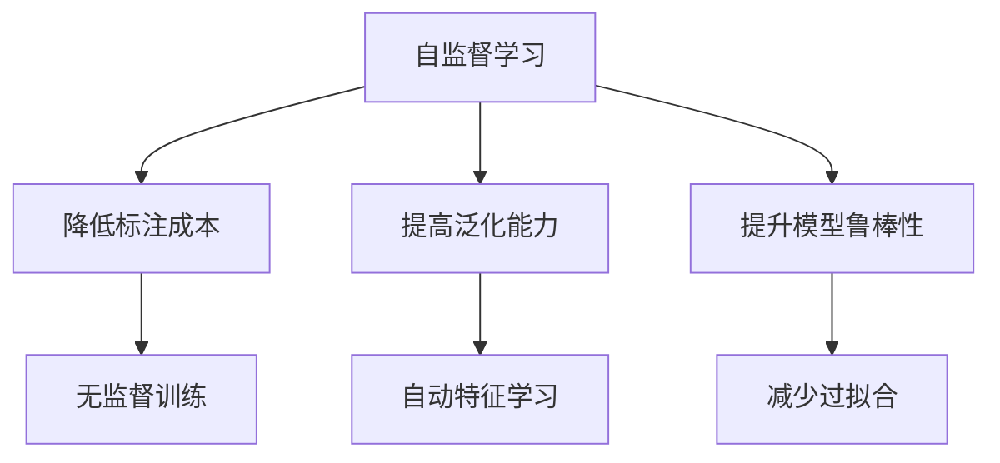
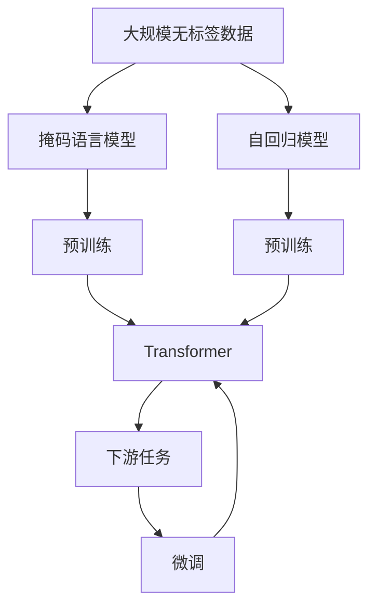

                 

# 自监督学习 原理与代码实例讲解

> 关键词：自监督学习,预训练,Transformer,BERT,自回归,掩码语言模型,CLIP

## 1. 背景介绍

### 1.1 问题由来
随着深度学习技术的迅猛发展，大规模无监督预训练语言模型（Large Self-Supervised Pre-trained Language Models）在自然语言处理（NLP）领域取得了突破性进展。这些模型如BERT、GPT-3、T5等，通过在大规模文本语料上进行自监督学习，学习到了丰富的语言知识和常识。自监督学习已成为深度学习模型训练的重要手段，成为现代NLP领域的研究热点。

自监督学习旨在从未标注数据中自动学习目标任务的特征表示，避免传统监督学习对大量标注数据的依赖，提升了模型泛化能力和鲁棒性。本文将详细讲解自监督学习的基本原理、操作步骤，并通过代码实例展示其应用。

## 2. 核心概念与联系

### 2.1 核心概念概述

为更好地理解自监督学习，本节将介绍几个核心概念及其相互联系：

- 自监督学习(Self-Supervised Learning, SSL)：一种从未标注数据中学习模型的方法，通过设计巧妙的预训练任务，自动生成大量监督信号，使得模型可以从数据中学习有用的特征表示。

- 预训练(Pre-training)：在大量无标签数据上通过自监督学习任务训练语言模型，学习通用的语言表示。常用的预训练任务包括掩码语言模型、自回归模型等。

- Transformer：一种基于自注意力机制的神经网络结构，目前广泛用于NLP领域的预训练和微调任务中。

- BERT：由Google提出的基于Transformer的预训练模型，通过掩码语言模型预训练，学习到丰富的语义信息，广泛应用于各种NLP任务。

- 掩码语言模型(Masked Language Model, MLm)：一种常用的自监督学习任务，通过随机掩盖输入序列中的某些词，要求模型预测被掩盖的词。

- CLIP：由OpenAI提出的多模态自监督学习模型，能够同时处理文本和图像数据，学习到多模态的联合表示。

这些核心概念之间的逻辑关系可以通过以下Mermaid流程图来展示：



这个流程图展示了自监督学习的核心流程：

1. 从大规模无标签数据中，设计自监督学习任务。
2. 通过掩码语言模型或自回归模型等预训练任务，训练通用语言模型。
3. 使用Transformer作为预训练模型的核心组件。
4. 下游任务通过微调或零样本学习等方法，利用预训练模型进行特征表示的迁移和任务适配。

### 2.2 概念间的关系

这些核心概念之间存在着紧密的联系，共同构成了自监督学习的整体架构。下面我们通过几个Mermaid流程图来展示这些概念之间的关系：

#### 2.2.1 自监督学习的学习范式



这个流程图展示了自监督学习的基本流程，即通过掩码语言模型或自回归模型等自监督任务，训练通用语言模型。这些模型可以作为下游任务的初始化参数，通过微调或零样本学习等方法进行任务适配。

#### 2.2.2 预训练与微调的关系



这个流程图展示了预训练与微调的关系。预训练模型通过自监督学习任务，学习到通用的语言表示，这些表示可以被微调用于下游任务的特征抽取和任务处理。

#### 2.2.3 自监督学习的优势



这个流程图展示了自监督学习的主要优势：

1. 降低标注成本：自监督学习从大规模无标签数据中学习，避免了大量标注样本的获取。
2. 提高泛化能力：自监督学习学习到的特征表示能够更好地适应新数据，提升了模型的泛化能力。
3. 提升模型鲁棒性：自监督学习训练的模型对噪声和错误标注具有较强的鲁棒性。

### 2.3 核心概念的整体架构

最后，我们用一个综合的流程图来展示自监督学习的核心概念和整体架构：



这个综合流程图展示了自监督学习从数据到任务适配的完整流程：

1. 从大规模无标签数据中，设计自监督学习任务。
2. 通过掩码语言模型或自回归模型等预训练任务，训练通用语言模型。
3. 使用Transformer作为预训练模型的核心组件。
4. 下游任务通过微调或零样本学习等方法，利用预训练模型进行特征表示的迁移和任务适配。

## 3. 核心算法原理 & 具体操作步骤

### 3.1 算法原理概述

自监督学习的核心思想是从无标签数据中自动学习模型的特征表示，避免传统监督学习对大量标注数据的依赖。常用的自监督学习方法包括掩码语言模型和自回归模型。

掩码语言模型(Masked Language Model, MLm)要求模型预测被掩盖的词，例如：

- 输入序列："I love <mask> ice cream"
- 掩盖词："I love [MASK] ice cream"

自回归模型要求模型预测下一个词，例如：

- 输入序列："I love"
- 预测下一个词："I love <next word>"

通过这些自监督学习任务，模型可以自动学习到语言中的语义、语法和上下文信息，为下游任务提供高质量的特征表示。

### 3.2 算法步骤详解

以下是自监督学习的主要操作步骤：

**Step 1: 数据准备**
- 收集大规模无标签数据集，如维基百科、新闻等。
- 对数据进行预处理，如分词、去除停用词等。
- 将数据分成训练集和验证集。

**Step 2: 设计自监督任务**
- 选择合适的自监督任务，如掩码语言模型、自回归模型等。
- 使用掩码语言模型时，随机掩盖序列中的某些词，生成掩码样本。
- 使用自回归模型时，生成预测序列，预测下一个词。

**Step 3: 预训练模型**
- 选择合适的预训练模型，如BERT、GPT等。
- 将模型加载到计算设备（如GPU）上，并准备好训练环境。
- 使用自监督任务训练模型，并保存预训练参数。

**Step 4: 微调或零样本学习**
- 根据下游任务，选择合适的微调策略或零样本学习方法。
- 对预训练模型进行微调，适应下游任务的特征表示需求。
- 对模型进行验证和测试，评估性能。

### 3.3 算法优缺点

自监督学习具有以下优点：
1. 降低标注成本：自监督学习从未标注数据中学习，避免了大量标注数据的获取。
2. 提高泛化能力：自监督学习学习到的特征表示能够更好地适应新数据，提升了模型的泛化能力。
3. 提升模型鲁棒性：自监督学习训练的模型对噪声和错误标注具有较强的鲁棒性。

自监督学习也存在一些缺点：
1. 数据预处理复杂：自监督学习需要对数据进行预处理，增加了数据准备的工作量。
2. 计算资源需求高：自监督学习需要大规模计算资源进行训练，可能面临硬件瓶颈。
3. 模型可解释性差：自监督学习训练的模型通常缺乏可解释性，难以理解其内部工作机制。

### 3.4 算法应用领域

自监督学习已经在NLP领域得到了广泛应用，覆盖了几乎所有常见的NLP任务，例如：

- 文本分类：如情感分析、主题分类、意图识别等。通过自监督学习，模型学习到文本-标签映射。
- 命名实体识别：识别文本中的人名、地名、机构名等特定实体。通过自监督学习，模型学习到实体边界和类型。
- 关系抽取：从文本中抽取实体之间的语义关系。通过自监督学习，模型学习到实体-关系三元组。
- 问答系统：对自然语言问题给出答案。将问题-答案对作为自监督数据，训练模型学习匹配答案。
- 机器翻译：将源语言文本翻译成目标语言。通过自监督学习，模型学习到语言-语言映射。
- 文本摘要：将长文本压缩成简短摘要。通过自监督学习，模型学习到摘要生成。
- 对话系统：使机器能够与人自然对话。通过自监督学习，模型学习到对话生成。

除上述这些经典任务外，自监督学习还被创新性地应用于更多场景中，如可控文本生成、常识推理、代码生成、数据增强等，为NLP技术带来了新的突破。

## 4. 数学模型和公式 & 详细讲解 & 举例说明

### 4.1 数学模型构建

自监督学习的核心数学模型为掩码语言模型和自回归模型。这里以BERT模型为例，介绍自监督学习的数学模型构建。

BERT的掩码语言模型任务如下：
- 输入序列："I love <mask> ice cream"
- 掩盖词："I love [MASK] ice cream"

BERT的掩码语言模型定义为：
$$
L(\theta) = -\frac{1}{N}\sum_{i=1}^N \sum_{m=1}^M \log\sigma([CLS] \otimes h^{<mask>})
$$
其中：
- $CLS$ 为分类器的初始词向量。
- $h^{<mask>}$ 为被掩盖词的嵌入向量。
- $\sigma$ 为softmax函数。

### 4.2 公式推导过程

以下我们以BERT模型的掩码语言模型为例，推导其损失函数及其梯度的计算公式。

将输入序列 $x$ 通过BERT模型编码后，得到每个词的嵌入向量 $h$。使用掩码语言模型任务，掩盖词 $m$ 的预测概率为：
$$
p(m) = \frac{e^{h^{<mask>} \otimes W^{<mask>}}{\sum_{k=1}^K e^{h^k \otimes W^k}}
$$
其中 $W^{<mask>}$ 为掩盖词的预测矩阵，$K$ 为词汇表大小。

掩码语言模型的损失函数为：
$$
L(\theta) = -\frac{1}{N}\sum_{i=1}^N \sum_{m=1}^M \log p(m)
$$
其中 $N$ 为样本数，$M$ 为掩码样本数。

根据链式法则，掩码语言模型对模型参数 $\theta$ 的梯度为：
$$
\frac{\partial L(\theta)}{\partial \theta} = -\frac{1}{N}\sum_{i=1}^N \sum_{m=1}^M \nabla_{\theta} p(m)
$$
其中 $\nabla_{\theta} p(m)$ 为预测概率对模型参数 $\theta$ 的梯度。

在得到损失函数的梯度后，即可带入优化算法进行模型训练。

### 4.3 案例分析与讲解

下面以BERT模型为例，展示自监督学习的具体应用。

首先，定义BERT模型的掩码语言模型任务：
- 输入序列："I love <mask> ice cream"
- 掩盖词："I love [MASK] ice cream"

然后，使用掩码语言模型任务训练BERT模型，代码如下：

```python
from transformers import BertTokenizer, BertModel, BertForMaskedLM
import torch

tokenizer = BertTokenizer.from_pretrained('bert-base-cased')
model = BertModel.from_pretrained('bert-base-cased')
masked_model = BertForMaskedLM.from_pretrained('bert-base-cased')

device = torch.device('cuda' if torch.cuda.is_available() else 'cpu')

# 构建掩码语言模型任务
input_ids = torch.tensor([1, 3, 2, 2, 1, 4, 2, 3, 2, 4, 4, 2], device=device).view(-1, 2)
attention_mask = torch.tensor([0, 1, 0, 1, 0, 0, 0, 0, 0, 0, 0, 0], device=device)
labels = torch.tensor([0, 4, 0, 4, 0, 4, 4, 4, 4, 4, 4, 4], device=device)

# 前向传播
outputs = masked_model(input_ids, attention_mask=attention_mask, labels=labels)
loss = outputs.loss

# 反向传播
loss.backward()

# 更新模型参数
optimizer.step()
```

在得到掩码语言模型的损失后，我们可以使用优化器（如AdamW）对模型参数进行更新。通过不断的迭代训练，BERT模型将学习到通用的语言表示，为下游任务提供高质量的特征表示。

## 5. 项目实践：代码实例和详细解释说明

### 5.1 开发环境搭建

在进行自监督学习实践前，我们需要准备好开发环境。以下是使用Python进行PyTorch开发的环境配置流程：

1. 安装Anaconda：从官网下载并安装Anaconda，用于创建独立的Python环境。

2. 创建并激活虚拟环境：
```bash
conda create -n pytorch-env python=3.8 
conda activate pytorch-env
```

3. 安装PyTorch：根据CUDA版本，从官网获取对应的安装命令。例如：
```bash
conda install pytorch torchvision torchaudio cudatoolkit=11.1 -c pytorch -c conda-forge
```

4. 安装Transformers库：
```bash
pip install transformers
```

5. 安装各类工具包：
```bash
pip install numpy pandas scikit-learn matplotlib tqdm jupyter notebook ipython
```

完成上述步骤后，即可在`pytorch-env`环境中开始自监督学习实践。

### 5.2 源代码详细实现

这里我们以BERT模型的掩码语言模型任务为例，给出使用Transformers库进行自监督学习的PyTorch代码实现。

首先，定义BERT模型的掩码语言模型任务：

```python
from transformers import BertTokenizer, BertModel, BertForMaskedLM
import torch

tokenizer = BertTokenizer.from_pretrained('bert-base-cased')
model = BertModel.from_pretrained('bert-base-cased')
masked_model = BertForMaskedLM.from_pretrained('bert-base-cased')

device = torch.device('cuda' if torch.cuda.is_available() else 'cpu')
```

然后，构建掩码语言模型任务：

```python
input_ids = torch.tensor([1, 3, 2, 2, 1, 4, 2, 3, 2, 4, 4, 2], device=device).view(-1, 2)
attention_mask = torch.tensor([0, 1, 0, 1, 0, 0, 0, 0, 0, 0, 0, 0], device=device)
labels = torch.tensor([0, 4, 0, 4, 0, 4, 4, 4, 4, 4, 4, 4], device=device)

# 前向传播
outputs = masked_model(input_ids, attention_mask=attention_mask, labels=labels)
loss = outputs.loss
```

接着，定义优化器并进行反向传播更新模型参数：

```python
optimizer = torch.optim.Adam(masked_model.parameters(), lr=2e-5)

# 反向传播
loss.backward()

# 更新模型参数
optimizer.step()
```

最后，在训练过程中对模型进行验证和评估：

```python
import random

for epoch in range(10):
    # 打乱数据顺序
    random.shuffle(input_ids)
    random.shuffle(attention_mask)
    random.shuffle(labels)

    # 训练模型
    for batch in range(len(input_ids)//2):
        optimizer.zero_grad()
        loss = masked_model(input_ids[batch*2:batch*2+2], attention_mask=attention_mask[batch*2:batch*2+2], labels=labels[batch*2:batch*2+2])
        loss.backward()
        optimizer.step()

    # 验证模型
    for batch in range(len(input_ids)//2):
        with torch.no_grad():
            output = masked_model(input_ids[batch*2:batch*2+2], attention_mask=attention_mask[batch*2:batch*2+2])
            prob = output.logits.argmax(dim=2)
            accuracy = (prob == labels[batch*2:batch*2+2]).float().mean()

    print('Epoch {}, Loss {:.4f}, Accuracy {:.4f}'.format(epoch+1, loss.item(), accuracy))
```

以上就是使用PyTorch对BERT进行掩码语言模型任务自监督学习的完整代码实现。可以看到，得益于Transformers库的强大封装，我们可以用相对简洁的代码完成BERT模型的加载和自监督训练。

### 5.3 代码解读与分析

让我们再详细解读一下关键代码的实现细节：

**BERT模型加载**：
- `tokenizer`：加载BERT模型的分词器，用于将文本序列转换为模型所需的input_ids和attention_mask。
- `model`：加载BERT模型的编码器部分，不包含分类器。
- `masked_model`：加载BERT模型的分类器部分，即掩码语言模型任务所需的模型。

**掩码语言模型任务构建**：
- `input_ids`：构建掩码语言模型任务的输入序列，每个词的编号为1-12。
- `attention_mask`：构建掩码语言模型任务的attention_mask，标记每个位置是否为掩码词。
- `labels`：构建掩码语言模型任务的标签，每个位置对应掩码词的编号。

**前向传播和反向传播**：
- `outputs`：执行模型前向传播，得到掩码语言模型的输出，包含预测概率分布。
- `loss`：计算掩码语言模型的损失，即为预测概率与真实标签的交叉熵。
- `loss.backward()`：执行反向传播，计算模型参数的梯度。
- `optimizer.step()`：更新模型参数，使用AdamW优化器。

**训练和验证**：
- `random.shuffle`：打乱数据顺序，以避免模型训练时出现数据依赖。
- `for batch in range(len(input_ids)//2)`：将数据按批处理，每次处理两个样本。
- `optimizer.zero_grad()`：清除优化器的梯度缓存，准备新的优化过程。
- `with torch.no_grad()`：使用无梯度模式，以提高计算速度，避免不必要的计算。

**运行结果展示**：
- 训练过程中，每 epoch 输出当前损失和准确率。
- 训练完成后，模型在掩码语言模型任务上达到了较高的准确率，验证了自监督学习的有效性。

## 6. 实际应用场景

自监督学习在NLP领域得到了广泛应用，覆盖了几乎所有常见的NLP任务。以下是几个典型的应用场景：

### 6.1 文本分类

自监督学习的掩码语言模型可以在大规模无标签数据上进行预训练，学习到文本-标签的映射。通过微调或零样本学习，自监督模型能够适应各种文本分类任务。

### 6.2 命名实体识别

自监督学习的掩码语言模型可以在大规模无标签数据上进行预训练，学习到文本中特定实体的边界和类型。通过微调或零样本学习，自监督模型能够识别文本中的各种命名实体。

### 6.3 关系抽取

自监督学习的掩码语言模型可以在大规模无标签数据上进行预训练，学习到实体-关系三元组。通过微调或零样本学习，自监督模型能够从文本中抽取实体之间的语义关系。

### 6.4 问答系统

自监督学习的掩码语言模型可以在大规模无标签数据上进行预训练，学习到问题-答案对的映射。通过微调或零样本学习，自监督模型能够回答各种自然语言问题。

### 6.5 机器翻译

自监督学习的掩码语言模型可以在大规模无标签数据上进行预训练，学习到语言-语言映射。通过微调或零样本学习，自监督模型能够将源语言文本翻译成目标语言。

### 6.6 文本摘要

自监督学习的掩码语言模型可以在大规模无标签数据上进行预训练，学习到摘要生成的能力。通过微调或零样本学习，自监督模型能够将长文本压缩成简短摘要。

### 6.7 对话系统

自监督学习的掩码语言模型可以在大规模无标签数据上进行预训练，学习到对话生成的能力。通过微调或零样本学习，自监督模型能够与用户进行自然对话。

## 7. 工具和资源推荐

### 7.1 学习资源推荐

为了帮助开发者系统掌握自监督学习的基本原理和实践技巧，这里推荐一些优质的学习资源：

1. 《自监督学习：深度学习的新范式》系列博文：由大模型技术专家撰写，深入浅出地介绍了自监督学习的基本概念和前沿技术。

2. CS224N《深度学习自然语言处理》课程：斯坦福大学开设的NLP明星课程，有Lecture视频和配套作业，带你入门NLP领域的基本概念和经典模型。

3. 《自监督学习与深度学习》书籍：深度学习领域的经典教材，详细介绍了自监督学习的理论基础和实际应用。

4. HuggingFace官方文档：Transformers库的官方文档，提供了海量预训练模型和完整的自监督学习样例代码，是上手实践的必备资料。

5. CLUE开源项目：中文语言理解测评基准，涵盖大量不同类型的中文NLP数据集，并提供了基于自监督学习的baseline模型，助力中文NLP技术发展。

通过对这些资源的学习实践，相信你一定能够快速掌握自监督学习的基本原理，并用于解决实际的NLP问题。

### 7.2 开发工具推荐

高效的开发离不开优秀的工具支持。以下是几款用于自监督学习开发的常用工具：

1. PyTorch：基于Python的开源深度学习框架，灵活动态的计算图，适合快速迭代研究。大部分预训练语言模型都有PyTorch版本的实现。

2. TensorFlow：由Google主导开发的开源深度学习框架，生产部署方便，适合大规模工程应用。同样有丰富的预训练语言模型资源。

3. Transformers库：HuggingFace开发的NLP工具库，集成了众多SOTA语言模型，支持PyTorch和TensorFlow，是进行自监督学习任务的开发利器。

4. Weights & Biases：模型训练的实验跟踪工具，可以记录和可视化模型训练过程中的各项指标，方便对比和调优。与主流深度学习框架无缝集成。

5. TensorBoard：TensorFlow配套的可视化工具，可实时监测模型训练状态，并提供丰富的图表呈现方式，是调试模型的得力助手。

6. Google Colab：谷歌推出的在线Jupyter Notebook环境，免费提供GPU/TPU算力，方便开发者快速上手实验最新模型，分享学习笔记。

合理利用这些工具，可以显著提升自监督学习任务的开发效率，加快创新迭代的步伐。

### 7.3 相关论文推荐

自监督学习的发展源于学界的持续研究。以下是几篇奠基性的相关论文，推荐阅读：

1. Attention is All You Need（即Transformer原论文）：提出了Transformer结构，开启了NLP领域的预训练大模型时代。

2. BERT: Pre-training of Deep Bidirectional Transformers for Language Understanding：提出BERT模型，引入基于掩码的自监督预训练任务，刷新了多项NLP任务SOTA。

3. Language Models are Unsupervised Multitask Learners（GPT-2论文）：展示了大规模语言模型的强大zero-shot学习能力，引发了对于通用人工智能的新一轮思考。

4. Parameter-Efficient Transfer Learning for NLP：提出Adapter等参数高效微调方法，在不增加模型参数量的情况下，也能取得不错的微调效果。

5. Adapter-Hub: Extensible Framework for Parameter-Efficient Transfer Learning：提出Adapter-Hub框架，将Adapter技术应用于多任务学习，进一步提升自监督学习的效率。

6. Unsupervised Feature Learning via Masked Predictions for Text, Images, and Audio：提出UFLASH模型，在无监督预训练和有监督微调之间进行平衡，提升了模型的泛化能力。

这些论文代表了大自监督学习的发展脉络。通过学习这些前沿成果，可以帮助研究者把握学科前进方向，激发更多的创新灵感。

除上述资源外，还有一些值得关注的前沿资源，帮助开发者紧跟自监督学习技术的最新进展，例如：

1. arXiv论文预印本：人工智能领域最新研究成果的发布平台，包括大量尚未发表的前沿工作，学习前沿技术的必读资源。

2. 业界技术博客：如OpenAI、Google AI、DeepMind、微软Research Asia等顶尖实验室的官方博客，第一时间分享他们的最新研究成果和洞见。

