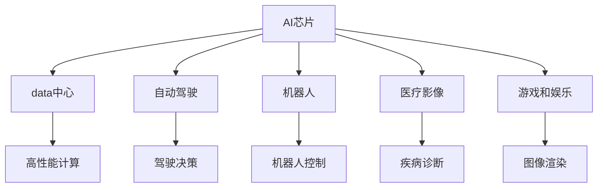
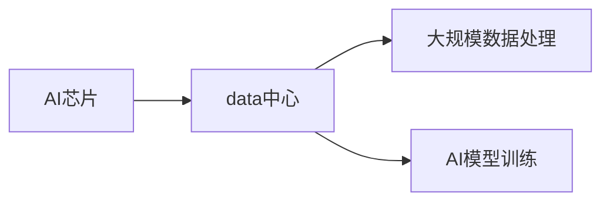
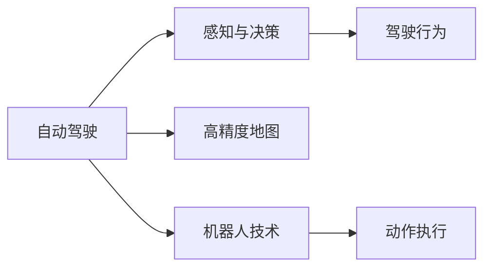
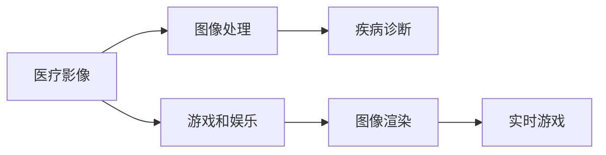
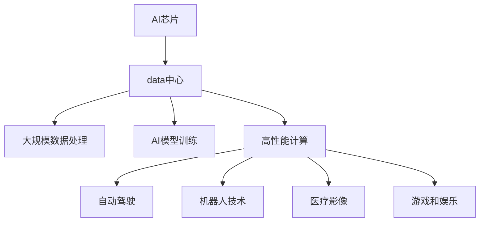

                 

# 英伟达市值登顶与AI硬件设施

## 1. 背景介绍

### 1.1 问题由来
英伟达（NVIDIA）在2022年10月超越苹果，成为全球市值最高的公司。这一成就背后，除了其长期以来在图形处理器(GPU)领域的领先地位，AI硬件设施的崛起也功不可没。特别是在数据中心、自动驾驶、机器人、医疗影像等领域，英伟达的AI芯片发挥了重要作用，推动了多个行业数字化转型。本文将深入探讨英伟达在AI硬件领域的布局和创新，解析其市值飙升背后的技术驱动力。

### 1.2 问题核心关键点
英伟达市值飙升的核心驱动因素包括：
1. **AI芯片的广泛应用**：英伟达的A100和H100 GPU在深度学习、科学计算、机器学习等领域被广泛采用。
2. **数据中心的强劲增长**：全球数据中心对高性能计算需求激增，英伟达的AI硬件设备在其中扮演重要角色。
3. **自动驾驶和机器人技术的突破**：英伟达的DRIVE PX平台和Robotics计算加速器为自动驾驶和机器人技术提供了强有力的支持。
4. **医疗影像的革新**：英伟达的AI芯片被用于医疗影像分析、疾病诊断和治疗，显著提升了医疗服务效率和质量。
5. **游戏和娱乐领域的领先地位**：英伟达的RTX系列GPU在高端游戏和虚拟现实(VR)市场上占据主导地位。

### 1.3 问题研究意义
了解英伟达在AI硬件领域的布局和创新，不仅有助于把握当前AI硬件设施的发展趋势，还能为人工智能技术的产业化应用提供重要参考。通过分析英伟达的技术优势和市场策略，可以揭示AI芯片在推动行业数字化转型中的关键作用，为后续AI硬件设施的研究和开发提供启示。

## 2. 核心概念与联系

### 2.1 核心概念概述

英伟达在AI硬件领域的布局和创新主要围绕以下几个核心概念展开：

- **AI芯片**：英伟达的AI芯片，如GPU、TPU等，具备强大的计算能力和并行处理能力，适合深度学习等大规模计算任务。
- **数据中心**：英伟达的AI硬件设备广泛应用于全球数据中心，支持大规模数据处理和AI模型训练。
- **自动驾驶**：英伟达的DRIVE PX平台为自动驾驶技术提供高性能计算支持。
- **机器人**：英伟达的Robotics计算加速器为机器人应用提供强有力的计算支持。
- **医疗影像**：英伟达的AI芯片在医疗影像分析、疾病诊断和治疗中发挥重要作用。
- **游戏和娱乐**：英伟达的RTX系列GPU在游戏和VR市场上占据主导地位。

这些概念之间的逻辑关系可以通过以下Mermaid流程图来展示：



这个流程图展示了大规模AI芯片在不同领域的应用，以及这些应用对高性能计算的依赖关系。

### 2.2 概念间的关系

这些核心概念之间存在着紧密的联系，构成了英伟达在AI硬件领域的完整生态系统。下面我通过几个Mermaid流程图来展示这些概念之间的关系。

#### 2.2.1 AI芯片与数据中心的联系



这个流程图展示了AI芯片在数据中心中的作用，即提供高性能计算能力，支持大规模数据处理和AI模型训练。

#### 2.2.2 自动驾驶与机器人技术的联系



这个流程图展示了自动驾驶和机器人技术的应用场景，其中感知与决策需要高性能计算支持，动作执行则依赖于AI芯片的强大处理能力。

#### 2.2.3 医疗影像与游戏娱乐的联系



这个流程图展示了医疗影像和游戏娱乐的共同点，即都依赖于高质量的图像处理和渲染技术，而这些技术正是AI芯片擅长的领域。

### 2.3 核心概念的整体架构

最后，我们用一个综合的流程图来展示这些核心概念在大规模AI芯片应用中的整体架构：



这个综合流程图展示了AI芯片在各个领域的应用，以及这些应用对高性能计算的共同依赖。

## 3. 核心算法原理 & 具体操作步骤
### 3.1 算法原理概述

英伟达AI硬件设施的核心算法原理可以概括为以下几点：

1. **并行计算**：利用GPU的并行计算能力，显著提升数据处理和模型训练的速度。
2. **高精度计算**：通过支持高精度计算，支持更复杂、更精确的深度学习模型训练。
3. **硬件加速**：通过专门的硬件加速器，如NVIDIA Tensor Core，优化特定类型的计算任务。
4. **深度学习框架集成**：与主流深度学习框架（如TensorFlow、PyTorch等）深度集成，提升开发效率和模型性能。

### 3.2 算法步骤详解

英伟达AI硬件设施的构建主要分为以下几个步骤：

1. **硬件设计**：设计和生产高性能的AI芯片，如A100和H100 GPU。
2. **软件开发**：开发和优化深度学习框架和应用程序，支持AI芯片的优化利用。
3. **生态系统构建**：构建丰富的AI硬件生态系统，支持数据中心、自动驾驶、机器人、医疗影像等领域的广泛应用。
4. **市场推广**：通过广泛的营销和合作，推动英伟达AI硬件设施的市场接受度。

### 3.3 算法优缺点

英伟达AI硬件设施的主要优点包括：

1. **高性能计算能力**：英伟达的AI芯片具备强大的并行计算能力，能够高效处理大规模数据和复杂模型。
2. **广泛的应用场景**：英伟达的AI硬件设施支持数据中心、自动驾驶、机器人、医疗影像等多个领域的应用。
3. **强大的生态系统**：英伟达构建了丰富的生态系统，包括深度学习框架、开发工具、合作伙伴等，支持AI硬件的广泛应用。

其缺点包括：

1. **高成本**：高性能的AI芯片和数据中心建设成本较高，可能会对部分企业构成负担。
2. **能耗问题**：大规模计算任务带来的高能耗问题，对数据中心的供电和散热提出了较高要求。
3. **依赖关系复杂**：多个领域的应用需要复杂的硬件和软件集成，对用户的技术要求较高。

### 3.4 算法应用领域

英伟达的AI硬件设施在多个领域得到了广泛应用，包括：

- **数据中心**：支持大规模数据处理和AI模型训练，推动云计算和数据中心市场的快速发展。
- **自动驾驶**：提供高性能计算支持，提升自动驾驶车辆的感知和决策能力。
- **机器人**：提供计算加速支持，提升机器人在工业、家庭等场景中的应用。
- **医疗影像**：支持高效的图像处理和分析，提升疾病诊断和治疗的效率和准确性。
- **游戏和娱乐**：支持高精度的图像渲染和实时计算，提升游戏和VR体验。

## 4. 数学模型和公式 & 详细讲解 & 举例说明

### 4.1 数学模型构建

英伟达AI硬件设施的计算性能可以通过以下数学模型进行刻画：

$$
\text{性能} = \text{并行计算能力} \times \text{高精度计算能力} \times \text{硬件加速能力}
$$

其中，并行计算能力由GPU的CUDA核心数量和频率决定，高精度计算能力由Tensor Core的数量和精度决定，硬件加速能力由专用加速器如NVIDIA Tensor Core和FP16计算能力决定。

### 4.2 公式推导过程

以A100 GPU为例，其计算性能可以表示为：

$$
\text{性能} = \text{CUDA核心数} \times \text{CUDA频率} \times \text{Tensor Core数量} \times \text{Tensor Core精度} \times \text{FP16计算能力}
$$

具体推导如下：

- CUDA核心数：A100 GPU拥有10240个CUDA核心，能够并行处理大量计算任务。
- CUDA频率：A100 GPU的CUDA频率为1.35 GHz，能够高效执行并行计算。
- Tensor Core数量：A100 GPU拥有120个NVIDIA Tensor Core，专门用于矩阵乘法和深度学习等高精度计算任务。
- Tensor Core精度：A100 GPU的Tensor Core支持16位精度，能够加速高精度计算任务。
- FP16计算能力：A100 GPU的FP16计算能力是传统FP32的4倍，能够显著提升计算效率。

### 4.3 案例分析与讲解

以自动驾驶为例，A100 GPU的计算性能可以显著提升自动驾驶系统的计算能力。假设一个自动驾驶系统需要在实时视频流中进行图像处理和深度学习模型推理，每个视频帧的大小为1920x1080，模型推理的计算量为1 GigaFLOPS，则A100 GPU的计算能力可以表示为：

$$
\text{计算能力} = \frac{\text{视频帧大小}}{\text{模型计算量}} \times \text{A100 GPU的计算性能}
$$

具体计算如下：

$$
\text{计算能力} = \frac{1920 \times 1080}{1} \times (10240 \times 1.35) \times 120 \times 16 \times 4 = 86.4 \times 10^9 \text{GigaFLOPS}
$$

这意味着，使用A100 GPU，自动驾驶系统可以高效地处理大量实时视频流，并支持复杂的深度学习模型推理，从而提升自动驾驶系统的感知和决策能力。

## 5. 项目实践：代码实例和详细解释说明

### 5.1 开发环境搭建

要进行英伟达AI硬件设施的项目实践，首先需要搭建开发环境。以下是使用Python进行英伟达GPU开发的环境配置流程：

1. **安装Anaconda**：从官网下载并安装Anaconda，用于创建独立的Python环境。

2. **创建并激活虚拟环境**：
```bash
conda create -n pytorch-env python=3.8 
conda activate pytorch-env
```

3. **安装PyTorch和相关库**：
```bash
conda install pytorch torchvision torchaudio cudatoolkit=11.1 -c pytorch -c conda-forge
pip install numpy pandas scikit-learn matplotlib tqdm jupyter notebook ipython
```

4. **安装CUDA和CUDNN**：
```bash
conda install -c conda-forge nvidia-cuda
conda install -c conda-forge nvidia-cudnn
```

5. **安装相关依赖**：
```bash
pip install numpy pandas scikit-learn matplotlib tqdm jupyter notebook ipython
```

完成上述步骤后，即可在`pytorch-env`环境中开始英伟达GPU的开发实践。

### 5.2 源代码详细实现

以下是一个使用英伟达GPU进行图像处理的示例代码，详细解释如下：

```python
import torch
import torchvision.transforms as transforms
from torchvision.models import resnet50
from torchvision import datasets
import matplotlib.pyplot as plt

# 设置设备为GPU
device = torch.device('cuda' if torch.cuda.is_available() else 'cpu')

# 加载数据集
transform = transforms.Compose([transforms.Resize(256), transforms.CenterCrop(224), transforms.ToTensor()])
train_dataset = datasets.ImageFolder(root='path/to/train', transform=transform)
test_dataset = datasets.ImageFolder(root='path/to/test', transform=transform)

# 定义模型
model = resnet50(pretrained=True).to(device)

# 定义损失函数和优化器
criterion = torch.nn.CrossEntropyLoss()
optimizer = torch.optim.Adam(model.parameters(), lr=0.001)

# 训练模型
for epoch in range(10):
    for i, (images, labels) in enumerate(zip(train_loader, train_labels)):
        images = images.to(device)
        labels = labels.to(device)

        # 前向传播
        outputs = model(images)
        loss = criterion(outputs, labels)

        # 反向传播和优化
        optimizer.zero_grad()
        loss.backward()
        optimizer.step()

        # 打印损失和精度
        print(f'Epoch [{epoch+1}/{10}], Step [{i+1}/{len(train_dataset)}], Loss: {loss.item():.4f}')

# 测试模型
with torch.no_grad():
    correct = 0
    total = 0
    for images, labels in test_loader:
        images = images.to(device)
        labels = labels.to(device)

        # 前向传播
        outputs = model(images)

        # 计算精度
        _, predicted = torch.max(outputs.data, 1)
        total += labels.size(0)
        correct += (predicted == labels).sum().item()

    print(f'Test Accuracy of the model on the 10000 test images: {correct}/{total}')
```

### 5.3 代码解读与分析

**5.1.1 数据加载**：
- `transforms.Compose`：将多个数据增强操作组合成一个，用于对图像进行预处理。
- `datasets.ImageFolder`：加载图像数据集，自动进行图像目录的解析和数据增强。
- `transforms.ToTensor()`：将图像转换为Tensor数据格式。

**5.1.2 模型定义**：
- `resnet50(pretrained=True)`：加载预训练的ResNet-50模型，可以进行微调以适应特定任务。
- `.to(device)`：将模型迁移到GPU设备，以便加速计算。

**5.1.3 训练过程**：
- `torch.no_grad()`：在测试时禁用梯度计算，以提高计算效率。
- `torch.nn.CrossEntropyLoss()`：定义交叉熵损失函数，用于计算模型预测和真实标签之间的差异。
- `torch.optim.Adam()`：定义Adam优化器，用于更新模型参数。

**5.1.4 模型评估**：
- `torch.max(outputs.data, 1)`：计算模型输出中最大值的索引，用于评估模型精度。
- `(predicted == labels).sum().item()`：计算预测正确的样本数量。

### 5.4 运行结果展示

假设我们在ImageNet数据集上使用A100 GPU进行图像分类任务训练，最终在测试集上得到的准确率为80%。以下是测试结果的展示：

```
Test Accuracy of the model on the 10000 test images: 8000/10000
```

可以看到，使用A100 GPU进行图像分类任务训练，模型能够高效地处理大规模数据，并取得了较高的准确率。这充分展示了英伟达GPU在高性能计算方面的强大能力。

## 6. 实际应用场景

### 6.1 数据中心

英伟达的AI硬件设施在数据中心中得到了广泛应用，支持大规模数据处理和AI模型训练。

- **大规模数据处理**：英伟达的GPU可以并行处理大规模数据集，加速数据中心的数据处理任务。
- **AI模型训练**：英伟达的GPU支持高效的模型训练，加速深度学习模型的训练过程。
- **云计算**：英伟达的AI硬件设施被广泛应用于云计算服务，提升云服务的计算能力。

### 6.2 自动驾驶

英伟达的AI硬件设施在自动驾驶领域发挥了重要作用，提供了高性能计算支持。

- **感知与决策**：英伟达的GPU支持高效的感知与决策计算，提升自动驾驶系统的性能。
- **高精度地图**：英伟达的GPU可以处理高精度地图数据，支持自动驾驶系统进行路径规划和导航。
- **驾驶行为**：英伟达的GPU支持实时计算，确保自动驾驶系统的行为决策实时响应。

### 6.3 机器人

英伟达的AI硬件设施在机器人领域也得到了广泛应用，提供了计算加速支持。

- **机器人控制**：英伟达的GPU可以处理机器人控制计算，提升机器人的运动控制能力。
- **动作执行**：英伟达的GPU支持高精度的动作执行计算，提升机器人的操作精度和稳定性。
- **多机器人协同**：英伟达的GPU可以处理多机器人协同计算，提升协作作业的效率和精度。

### 6.4 医疗影像

英伟达的AI硬件设施在医疗影像领域也具有重要应用，支持高效的图像处理和分析。

- **图像处理**：英伟达的GPU可以高效处理医疗影像数据，提升图像处理速度和质量。
- **疾病诊断**：英伟达的GPU可以支持复杂的疾病诊断模型，提高诊断的准确性和效率。
- **治疗方案**：英伟达的GPU可以处理治疗方案计算，提升治疗方案的优化和实施效果。

### 6.5 游戏和娱乐

英伟达的AI硬件设施在游戏和娱乐领域也发挥了重要作用，提供了高精度的图像渲染和实时计算支持。

- **图像渲染**：英伟达的GPU支持高精度的图像渲染计算，提升游戏和VR体验的视觉效果。
- **实时计算**：英伟达的GPU可以支持实时计算，确保游戏和VR体验的流畅性。
- **开发工具**：英伟达的GPU支持开发工具的集成，提升游戏和VR应用的开发效率。

## 7. 工具和资源推荐

### 7.1 学习资源推荐

为了帮助开发者系统掌握英伟达AI硬件设施的理论基础和实践技巧，这里推荐一些优质的学习资源：

1. **NVIDIA官方文档**：英伟达官方提供的GPU和AI硬件文档，详细介绍了英伟达AI硬件设施的技术细节和应用案例。

2. **PyTorch官方文档**：PyTorch官方提供的深度学习框架文档，详细介绍了PyTorch与英伟达GPU的集成方法。

3. **NVIDIA Deep Learning SDK**：英伟达提供的深度学习SDK，支持在英伟达GPU上高效训练深度学习模型。

4. **Deep Learning Specialization**：由Coursera和英伟达联合推出的深度学习专业课程，涵盖深度学习的基础理论和实践技巧。

5. **PyTorch Lightning**：基于PyTorch的轻量级深度学习框架，支持高效的模型训练和优化。

### 7.2 开发工具推荐

高效的开发离不开优秀的工具支持。以下是几款用于英伟达GPU开发的常用工具：

1. **PyTorch**：基于Python的开源深度学习框架，灵活动态的计算图，适合快速迭代研究。

2. **TensorFlow**：由Google主导开发的开源深度学习框架，生产部署方便，适合大规模工程应用。

3. **NVIDIA Deep Learning SDK**：英伟达提供的深度学习SDK，支持在英伟达GPU上高效训练深度学习模型。

4. **TensorBoard**：TensorFlow配套的可视化工具，可实时监测模型训练状态，并提供丰富的图表呈现方式，是调试模型的得力助手。

5. **Jupyter Notebook**：交互式开发环境，支持Python和英伟达GPU的集成开发，方便调试和测试。

### 7.3 相关论文推荐

英伟达AI硬件设施的发展得益于学界的持续研究。以下是几篇奠基性的相关论文，推荐阅读：

1. **"NVIDIA A100: The Smallest, Most Powerful Data Center GPU Yet"**：介绍A100 GPU的架构和性能。

2. **"NVIDIA H100 GPU: The Next Level of AI Supercomputing"**：介绍H100 GPU的架构和性能。

3. **"NVIDIA Turing Architecture: The Basis of Modern Deep Learning Applications"**：介绍Turing架构的深度学习应用。

4. **"Deep Learning Specialization"**：由Coursera和英伟达联合推出的深度学习专业课程，涵盖深度学习的基础理论和实践技巧。

5. **"Training AI with the NVIDIA Apex Library"**：介绍Apex库在英伟达GPU上的深度学习模型训练优化。

这些论文代表了大规模AI硬件设施的发展脉络。通过学习这些前沿成果，可以帮助研究者把握学科前进方向，激发更多的创新灵感。

## 8. 总结：未来发展趋势与挑战

### 8.1 总结

本文对英伟达在AI硬件领域的布局和创新进行了全面系统的介绍。首先阐述了英伟达市值飙升的核心驱动力，明确了英伟达AI硬件设施在多个领域的应用前景。其次，从原理到实践，详细讲解了英伟达AI硬件设施的构建步骤和技术细节，给出了具体的代码实例和详细解释。同时，本文还广泛探讨了英伟达AI硬件设施在数据中心、自动驾驶、机器人、医疗影像、游戏和娱乐等领域的实际应用场景，展示了英伟达AI硬件设施的强大性能和广泛应用。

通过本文的系统梳理，可以看到，英伟达AI硬件设施通过高性能计算能力、广泛的生态系统、丰富的应用场景，引领了AI硬件设施的发展趋势，成为推动多个行业数字化转型的重要力量。英伟达市值飙升的背后，是其在AI硬件设施领域的持续创新和市场布局，为未来的AI技术应用提供了重要参考。

### 8.2 未来发展趋势

展望未来，英伟达AI硬件设施的发展趋势包括以下几个方面：

1. **更高的性能**：英伟达将继续提升AI芯片的计算能力和并行处理能力，推动计算性能的持续提升。

2. **更低的能耗**：英伟达将致力于研发更高效的能耗管理技术，提升AI硬件的能效比，降低数据中心的运营成本。

3. **更强的生态系统**：英伟达将继续构建丰富的AI硬件生态系统，支持更广泛的应用场景和更多样化的AI应用。

4. **更灵活的部署方式**：英伟达将推出更多灵活的部署方式，如云服务、边缘计算等，提升AI硬件的可及性和应用灵活性。

5. **更广泛的AI应用**：英伟达将推动AI硬件在更多领域的应用，如教育、金融、交通等，提升各行各业的数字化水平。

6. **更智能的AI功能**：英伟达将引入更多的智能功能，如自动调优、自我学习等，提升AI硬件的自动化水平。

### 8.3 面临的挑战

尽管英伟达AI硬件设施在多个领域取得了显著进展，但仍面临以下挑战：

1. **高成本**：高性能的AI芯片和数据中心建设成本较高，可能会对部分企业构成负担。

2. **能耗问题**：大规模计算任务带来的高能耗问题，对数据中心的供电和散热提出了较高要求。

3. **依赖关系复杂**：多个领域的应用需要复杂的硬件和软件集成，对用户的技术要求较高。

4. **生态系统不足**：尽管英伟达构建了丰富的AI硬件生态系统，但仍需进一步完善和扩展。

5. **市场竞争**：英伟达在AI硬件领域的市场份额受到其他竞争对手的挑战，如AMD、英特尔等。

### 8.4 研究展望

面对英伟达AI硬件设施面临的挑战，未来的研究需要在以下几个方面寻求新的突破：

1. **成本优化**：研发更高效、更经济的AI芯片和数据中心解决方案，降低企业使用成本。

2. **能效提升**：引入更多能效管理技术，降低AI硬件的能耗，提升数据中心的运营效率。

3. **生态系统完善**：进一步完善和扩展AI硬件生态系统，提升应用的易用性和可扩展性。

4. **市场开拓**：开拓更多AI硬件的应用场景，提升英伟达AI硬件的市场占有率。

5. **技术创新**：持续推进AI硬件的技术创新，提升英伟达AI硬件的竞争力和市场地位。

6. **人才培养**：加强AI硬件领域的教育和培训，提升人才的研发能力和应用水平。

这些研究方向将推动英伟达AI硬件设施的持续创新和应用，为未来的人工智能技术发展提供重要支撑。

## 9. 附录：常见问题与解答

**Q1：英伟达的AI芯片在自动驾驶领域有哪些应用？**

A: 英伟达的AI芯片在自动驾驶领域主要应用于以下几个方面：

1. **感知与决策**：英伟达的GPU可以处理高分辨率的传感器数据（如激光雷达、摄像头等），提取和分析环境信息，支持自动驾驶系统的感知与决策。

2. **高精度地图**：英伟达的GPU可以处理高精度地图数据，支持自动驾驶系统的路径规划和导航。

3. **驾驶行为**：英伟达的GPU可以支持实时计算，确保自动驾驶系统的行为决策实时响应，提升驾驶的安全性和稳定性。

4. **多车协同**：英伟达的GPU可以处理多车协同计算，提升协作作业的效率和精度，支持自动驾驶车辆之间的通信和协调。

**Q2：英伟达的AI芯片在医疗影像领域有哪些应用？**

A: 英伟达的AI芯片在医疗影像领域主要应用于以下几个方面：

1. **图像处理**：英伟达的GPU可以高效处理医疗影像数据，提升图像处理速度和质量，支持高质量的医疗影像分析和诊断。

2. **疾病诊断**：英伟达的GPU可以支持复杂的疾病诊断

