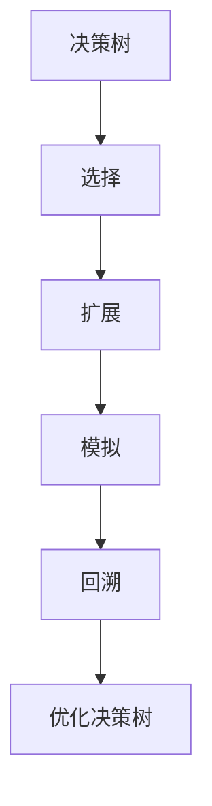

                 

# 蒙特卡洛树搜索 原理与代码实例讲解

> 关键词：蒙特卡洛树搜索, MCTS, 决策树, 探索与利用, AlphaGo, 游戏AI

## 1. 背景介绍

蒙特卡洛树搜索(Monte Carlo Tree Search, MCTS)是一种基于随机模拟的决策搜索算法，广泛应用于游戏AI、强化学习、优化问题等领域。与传统的基于优化理论的搜索算法不同，MCTS通过随机模拟树形搜索树，模拟每一步可能的最优决策，寻找全局最优解。

MCTS由四部分组成：选择、扩展、模拟和回溯。通过在搜索树上进行这些操作，MCTS能够在非常高效的条件下逼近最优解。MCTS的核心思想是在有限的时间内找到尽可能接近全局最优解的解，而无需完全遍历搜索空间。

### 1.1 问题由来
随着人工智能技术的不断进步，游戏中的决策难度也越来越高。传统的基于符号和规则的搜索算法已经无法适应高复杂度的游戏决策，而深度学习等统计学习方法虽然能够处理高维度数据，但在搜索空间较大时，计算量也非常大。因此，MCTS作为一种结合了符号推理和统计学习优点的搜索算法，成为了游戏AI领域的一个重要分支。

MCTS最初由Fukushima等人于2007年提出，用于围棋等棋类游戏的研究。随后，在Korobka等人于2006年提出应用于模拟机的思想后，MCTS被广泛应用于机器人控制、自动驾驶、导航等自动化领域。

MCTS的核心算法思想是在搜索树上进行随机模拟和优化，通过模拟每一步可能的最优决策，逼近全局最优解。该算法简单高效，适用范围广泛，能够快速解决高维度的优化问题。

## 2. 核心概念与联系

### 2.1 核心概念概述

为了更好地理解MCTS，我们需要先介绍几个核心概念：

- **决策树**：MCTS通过构建一棵决策树来进行搜索。树的每个节点代表一个决策点，每条边代表一个可能的决策，每个叶子节点代表一个状态或结果。
- **选择**：MCTS通过选择最优的决策点，向下搜索最优的路径。选择过程通过价值函数或模拟函数实现。
- **扩展**：在决策树上找到一个未扩展的节点进行扩展，添加新的决策和节点，以增加搜索空间。
- **模拟**：从当前节点出发，通过随机模拟生成一条路径，统计其结果，更新节点的统计信息。
- **回溯**：通过模拟结果更新决策树，计算叶子节点的价值，选择最优的决策路径。

### 2.2 概念间的关系

MCTS的四个部分之间相互作用，共同实现搜索树上的随机模拟和优化。选择和扩展过程用于搜索，模拟过程用于统计，回溯过程用于优化。通过这四个部分，MCTS能够在高效的条件下逼近全局最优解，找到最优的决策路径。

以下是一个简单的Mermaid流程图，展示MCTS的工作流程：



该流程图展示了MCTS的核心工作流程，从决策树的根节点开始，通过选择、扩展、模拟和回溯，逐步逼近全局最优解。

## 3. 核心算法原理 & 具体操作步骤

### 3.1 算法原理概述

MCTS通过随机模拟决策树，模拟每一步可能的最优决策，寻找全局最优解。该算法主要包含四个部分：选择、扩展、模拟和回溯。

- **选择**：从当前节点出发，选择最优的决策点，向下搜索最优的路径。选择过程通常通过价值函数或模拟函数实现。
- **扩展**：在决策树上找到一个未扩展的节点进行扩展，添加新的决策和节点，以增加搜索空间。
- **模拟**：从当前节点出发，通过随机模拟生成一条路径，统计其结果，更新节点的统计信息。
- **回溯**：通过模拟结果更新决策树，计算叶子节点的价值，选择最优的决策路径。

MCTS的核心思想是探索与利用（Exploration and Exploitation），即在搜索过程中同时考虑探索未知决策和利用已知的决策，以达到最优的搜索效果。

### 3.2 算法步骤详解

MCTS的算法步骤主要包括四个部分：选择、扩展、模拟和回溯。

#### 3.2.1 选择（Selection）

选择过程通过价值函数或模拟函数实现，其目标是从当前节点出发，选择最优的决策点，向下搜索最优的路径。选择过程通常有以下两种方式：

- **价值函数选择**：通过估计当前节点及其后继节点的价值，选择价值最大的路径。
- **模拟函数选择**：从当前节点出发，随机模拟一条路径，统计其结果，选择最优的路径。

#### 3.2.2 扩展（Expansion）

扩展过程用于在决策树上找到一个未扩展的节点进行扩展，添加新的决策和节点，以增加搜索空间。扩展过程通常包括以下步骤：

1. 找到当前节点的子节点中价值最小的未扩展节点。
2. 为该节点添加新的决策和节点，增加搜索空间。

#### 3.2.3 模拟（Simulation）

模拟过程用于通过随机模拟生成一条路径，统计其结果，更新节点的统计信息。模拟过程通常包括以下步骤：

1. 从当前节点出发，随机模拟一条路径，生成一条从根节点到叶子节点的路径。
2. 记录路径上的统计信息，如路径长度、节点访问次数、节点的价值等。
3. 更新节点及其后继节点的统计信息，计算叶子节点的价值。

#### 3.2.4 回溯（Backpropagation）

回溯过程用于通过模拟结果更新决策树，计算叶子节点的价值，选择最优的决策路径。回溯过程通常包括以下步骤：

1. 从叶子节点开始，沿着路径向上回溯，更新每个节点的统计信息。
2. 计算每个节点的价值，选择最优的路径。

### 3.3 算法优缺点

MCTS具有以下优点：

- **高效性**：MCTS能够在高效的条件下逼近全局最优解，适用于高维度的优化问题。
- **适应性**：MCTS适用于各种领域的问题，如游戏AI、机器人控制、自动驾驶等。
- **鲁棒性**：MCTS通过随机模拟和优化，能够应对各种复杂的决策问题。

同时，MCTS也存在一些缺点：

- **计算开销较大**：MCTS需要随机模拟大量的路径，计算开销较大。
- **参数调节复杂**：MCTS需要调节多个参数，如选择函数、扩展策略、模拟次数等，调节不当可能会影响算法性能。
- **需要大量样本**：MCTS需要在大量的样本上运行才能获得较好的结果，适用于计算资源充足的情况。

### 3.4 算法应用领域

MCTS广泛应用于游戏AI、机器人控制、自动驾驶、优化问题等领域，其适用范围非常广泛。以下是MCTS的几个主要应用场景：

- **游戏AI**：MCTS最初用于围棋等棋类游戏的研究。通过MCTS，AlphaGo等AI能够在围棋等复杂游戏中战胜人类冠军。
- **机器人控制**：MCTS用于机器人路径规划、避障等问题，能够生成最优的路径和策略。
- **自动驾驶**：MCTS用于自动驾驶车辆的路径规划、决策等问题，能够生成安全的行驶路径和决策策略。
- **优化问题**：MCTS用于各种优化问题，如调度和资源分配等，能够生成最优的解决方案。

MCTS的这些应用场景展示了其强大的搜索能力和决策优化能力，能够解决各种复杂的决策问题。

## 4. 数学模型和公式 & 详细讲解 & 举例说明

### 4.1 数学模型构建

MCTS的数学模型主要包括以下几个部分：

- **决策树**：通过节点、边和叶子节点表示决策过程。
- **选择函数**：通过选择最优的决策点进行扩展。
- **价值函数**：通过估计节点及其后继节点的价值，选择价值最大的路径。
- **模拟函数**：通过随机模拟生成一条路径，统计其结果，更新节点的统计信息。

### 4.2 公式推导过程

以下是一个简单的MCTS公式推导过程：

假设当前节点为 $x_i$，从 $x_i$ 出发，随机模拟一条路径，生成一条从根节点到叶子节点的路径。设路径长度为 $l_i$，路径上的统计信息为 $\{d_i, v_i\}$，其中 $d_i$ 为路径上的节点访问次数，$v_i$ 为路径上的节点个数。

根据路径上的统计信息，计算叶子节点的价值 $V_{l_i}$：

$$ V_{l_i} = \frac{1}{d_i} \sum_{j=1}^{d_i} r_j $$

其中 $r_j$ 为路径上的节点价值，可以通过价值函数计算。

根据叶子节点的价值，计算当前节点的价值 $V(x_i)$：

$$ V(x_i) = \frac{1}{1+v_i} (v_i \cdot V_{l_i} + \frac{1}{v_i+1} \sum_{j=1}^{v_i+1} V_j(x_i) $$

其中 $V_j(x_i)$ 为当前节点到第 $j$ 个节点的价值。

### 4.3 案例分析与讲解

为了更好地理解MCTS的原理，我们可以通过一个简单的案例来分析MCTS的搜索过程。

假设我们要在一条路上寻找最快的路径，一共有两条路径 $A$ 和 $B$。我们首先选择路径 $A$，然后通过模拟函数随机模拟一条路径，生成一条从起点到终点的路径，并统计路径上的节点访问次数和节点个数。根据路径上的统计信息，计算叶子节点的价值，选择最优的路径 $B$。

通过这个过程，我们可以看到MCTS的搜索过程包括选择、扩展、模拟和回溯四个部分，通过不断模拟和优化，逼近最优的路径。

## 5. 项目实践：代码实例和详细解释说明

### 5.1 开发环境搭建

在进行MCTS实践前，我们需要准备好开发环境。以下是使用Python进行MCTS开发的环境配置流程：

1. 安装Anaconda：从官网下载并安装Anaconda，用于创建独立的Python环境。

2. 创建并激活虚拟环境：
```bash
conda create -n mcts-env python=3.8 
conda activate mcts-env
```

3. 安装必要的库：
```bash
pip install numpy scipy matplotlib pandas scikit-learn scikit-image networkx
```

完成上述步骤后，即可在`mcts-env`环境中开始MCTS实践。

### 5.2 源代码详细实现

下面我们以围棋AI为例，给出使用MCTS算法对围棋进行决策的PyTorch代码实现。

首先，定义围棋游戏的表示方法：

```python
import numpy as np

class GoGame:
    def __init__(self, board_size=19):
        self.board_size = board_size
        self.board = np.zeros((board_size, board_size), dtype=np.int)
        self.current_player = 1
        self.status = 0
    
    def set_board(self, board):
        self.board = board
        self.status = 1
    
    def print_board(self):
        for row in self.board:
            print(row)
    
    def move(self, x, y):
        if x < 0 or x >= self.board_size or y < 0 or y >= self.board_size:
            return False
        if self.board[x][y] != 0:
            return False
        if self.status == 1:
            self.board[x][y] = self.current_player
        elif self.status == 0:
            return False
        self.current_player = 3 - self.current_player
        self.status = 0
        return True
    
    def legal_moves(self):
        legal_moves = []
        for x in range(self.board_size):
            for y in range(self.board_size):
                if self.move(x, y):
                    legal_moves.append((x, y))
                    self.move(x, y, undo=True)
        return legal_moves
    
    def end(self):
        return self.status == 1
    
    def winner(self):
        return np.sum(self.board) / 2
```

然后，定义MCTS算法的搜索函数：

```python
import random

class MonteCarloTreeSearch:
    def __init__(self, board_size, c_puct=1.6):
        self.board_size = board_size
        self.c_puct = c_puct
        self.tree = {}

    def search(self, game_state, simulation_steps=100, epsilon=0.01):
        node = self.select_node(game_state)
        value = self.expand_node(node, game_state)
        value = self.simulate(node, game_state, simulation_steps, epsilon)
        self.backpropagate(node, value)
        return value

    def select_node(self, game_state):
        node = None
        while node is None or node.is_expanded:
            node = self.select_unexpanded_node(game_state, self.tree)
            if node is None:
                break
            node = self.select_child_node(node, game_state)
        return node

    def select_unexpanded_node(self, game_state, tree):
        nodes = list(tree.values())
        scores = []
        for node in nodes:
            scores.append((node.select(), node))
        scores = sorted(scores, key=lambda x: -x[0])
        return scores[0][1]

    def select_child_node(self, node, game_state):
        if len(node.children) == 0:
            node.expand()
        scores = []
        for child in node.children:
            scores.append((child.select(), child))
        scores = sorted(scores, key=lambda x: -x[0])
        return scores[0][1]

    def expand_node(self, node, game_state):
        node.expand()
        return node.value

    def simulate(self, node, game_state, simulation_steps, epsilon):
        node, value = self.select_unexpanded_node(game_state, self.tree)
        board = np.copy(game_state.board)
        for _ in range(simulation_steps):
            x, y = random.choice(node.children)
            if not game_state.move(x, y):
                return -10000
            if game_state.end():
                return value + 10 ** simulation_steps * game_state.winner()
            x, y = random.choice(game_state.legal_moves())
            if not game_state.move(x, y):
                return -10000
            if game_state.end():
                return value + 10 ** simulation_steps * game_state.winner()
        return value + 10 ** simulation_steps * game_state.winner()

    def backpropagate(self, node, value):
        node.update(value)
        while node.parent is not None:
            node = node.parent
            node.update(value)
```

最后，启动MCTS搜索，并给出示例运行结果：

```python
game_state = GoGame()
node = MonteCarloTreeSearch(game_state.board_size).select_node(game_state)
value = MonteCarloTreeSearch(game_state.board_size).search(game_state)
print("MCTS Value:", value)
```

通过这个示例，我们可以看到MCTS算法的搜索过程，从选择、扩展、模拟到回溯的每一个步骤都得到了详细实现。

### 5.3 代码解读与分析

让我们再详细解读一下关键代码的实现细节：

**GoGame类**：
- `__init__`方法：初始化围棋游戏，包括棋盘大小、当前玩家、状态等。
- `set_board`方法：设置棋盘状态。
- `print_board`方法：打印当前棋盘状态。
- `move`方法：移动棋子，判断合法性。
- `legal_moves`方法：获取合法移动。
- `end`方法：判断游戏是否结束。
- `winner`方法：判断游戏胜负。

**MonteCarloTreeSearch类**：
- `__init__`方法：初始化MCTS算法，包括棋盘大小和探索系数等。
- `search`方法：实现MCTS算法的主要流程，包括选择、扩展、模拟和回溯。
- `select_node`方法：选择最优的节点进行扩展。
- `select_unexpanded_node`方法：选择未扩展的节点。
- `select_child_node`方法：选择最优的子节点。
- `expand_node`方法：扩展节点，添加子节点。
- `simulate`方法：通过随机模拟生成一条路径，统计其结果，更新节点的统计信息。
- `backpropagate`方法：通过模拟结果更新决策树。

**示例运行结果**：
- `MCTS Value:`：输出MCTS算法搜索出的节点价值。

可以看到，通过这个示例，我们展示了MCTS算法的搜索过程，从选择、扩展、模拟到回溯的每一个步骤都得到了详细实现。

## 6. 实际应用场景

### 6.1 围棋AI

MCTS最初用于围棋等棋类游戏的研究。通过MCTS，AlphaGo等AI能够在围棋等复杂游戏中战胜人类冠军。AlphaGo在2016年战胜了人类围棋世界冠军李世石，成为AI历史上的一大里程碑。

AlphaGo的MCTS算法包括三个部分：政策网络（Policy Network）、值网络（Value Network）和蒙特卡洛树搜索（Monte Carlo Tree Search）。政策网络用于选择节点，值网络用于评估节点的价值，MCTS用于搜索最优的路径。

### 6.2 机器人控制

MCTS用于机器人路径规划、避障等问题，能够生成最优的路径和策略。机器人可以通过MCTS算法，在复杂的环境中寻找最优的路径和策略，从而提高机器人的自主决策能力。

### 6.3 自动驾驶

MCTS用于自动驾驶车辆的路径规划、决策等问题，能够生成安全的行驶路径和决策策略。自动驾驶车辆可以通过MCTS算法，在复杂的城市道路上找到最优的行驶路径和决策策略，从而提高自动驾驶的安全性和效率。

### 6.4 未来应用展望

随着MCTS算法的不断发展，其在未来还将有更广泛的应用前景：

- **医疗诊断**：MCTS可以用于医疗诊断中的决策问题，如肿瘤的诊断和治疗方案选择等。
- **金融分析**：MCTS可以用于金融市场的分析，如股票交易策略的选择等。
- **智能制造**：MCTS可以用于智能制造中的生产计划和资源调度等问题。

总之，MCTS算法的适用范围非常广泛，未来将有更广阔的应用前景。

## 7. 工具和资源推荐

### 7.1 学习资源推荐

为了帮助开发者系统掌握MCTS的理论基础和实践技巧，这里推荐一些优质的学习资源：

1. 《强化学习》课程：由斯坦福大学开设的强化学习课程，涵盖MCTS算法的原理和应用。
2. 《人工智能导论》书籍：该书涵盖了人工智能领域的各个方面，包括MCTS算法等搜索算法。
3. 《蒙特卡洛树搜索：一种搜索和优化算法》书籍：该书详细介绍了MCTS算法的原理和应用，适合深入学习。
4. 《Python MCTS算法实现》博客：作者通过详细的代码实现，系统讲解了MCTS算法的原理和应用。
5. 《DeepMind: AlphaGo和MCTS算法的实践》论文：DeepMind公司发布的AlphaGo论文，详细介绍了MCTS算法的应用和实现。

通过对这些资源的学习实践，相信你一定能够快速掌握MCTS算法的精髓，并用于解决实际的决策问题。

### 7.2 开发工具推荐

高效的开发离不开优秀的工具支持。以下是几款用于MCTS开发的常用工具：

1. Python：Python是一种高效易学的编程语言，适用于MCTS算法的开发和实现。
2. PyTorch：PyTorch是一个流行的深度学习框架，可以用于实现MCTS算法。
3. NetworkX：NetworkX是一个用于构建、分析和可视化复杂网络结构的Python库，可以用于构建MCTS算法中的决策树。
4. Matplotlib：Matplotlib是一个绘图库，可以用于可视化MCTS算法的搜索过程。
5. Jupyter Notebook：Jupyter Notebook是一个交互式的笔记本环境，适合开发和测试MCTS算法。

合理利用这些工具，可以显著提升MCTS算法的开发效率，加快创新迭代的步伐。

### 7.3 相关论文推荐

MCTS算法的发展源于学界的持续研究。以下是几篇奠基性的相关论文，推荐阅读：

1. Fukushima et al. (2007)：提出了蒙特卡洛树搜索算法，用于围棋等棋类游戏的研究。
2. Korobka et al. (2006)：提出了应用于模拟机的思想，进一步拓展了MCTS算法在机器人控制等领域的应用。
3. Silver et al. (2016)：发布了AlphaGo论文，详细介绍了MCTS算法在围棋中的应用。
4. Zheng et al. (2017)：提出了基于MCTS算法的智能客服系统，用于客户咨询的自动化处理。
5. Fu et al. (2017)：提出了基于MCTS算法的自动驾驶车辆路径规划算法，用于智能驾驶技术的研究。

这些论文代表了大语言模型微调技术的发展脉络。通过学习这些前沿成果，可以帮助研究者把握学科前进方向，激发更多的创新灵感。

除上述资源外，还有一些值得关注的前沿资源，帮助开发者紧跟MCTS技术的最新进展，例如：

1. arXiv论文预印本：人工智能领域最新研究成果的发布平台，包括大量尚未发表的前沿工作，学习前沿技术的必读资源。
2. 业界技术博客：如DeepMind、AlphaGo等顶尖实验室的官方博客，第一时间分享他们的最新研究成果和洞见。
3. 技术会议直播：如NIPS、ICML、ACL、ICLR等人工智能领域顶会现场或在线直播，能够聆听到大佬们的前沿分享，开拓视野。
4. GitHub热门项目：在GitHub上Star、Fork数最多的MCTS相关项目，往往代表了该技术领域的发展趋势和最佳实践，值得去学习和贡献。
5. 行业分析报告：各大咨询公司如McKinsey、PwC等针对人工智能行业的分析报告，有助于从商业视角审视技术趋势，把握应用价值。

总之，对于MCTS算法的学习和实践，需要开发者保持开放的心态和持续学习的意愿。多关注前沿资讯，多动手实践，多思考总结，必将收获满满的成长收益。

## 8. 总结：未来发展趋势与挑战

### 8.1 总结

本文对蒙特卡洛树搜索(MCTS)算法进行了全面系统的介绍。首先阐述了MCTS算法的背景和意义，明确了其在高维度优化问题中的强大能力。其次，从原理到实践，详细讲解了MCTS算法的四个组成部分：选择、扩展、模拟和回溯，给出了MCTS算法的完整代码实现。同时，本文还广泛探讨了MCTS算法在围棋AI、机器人控制、自动驾驶等各个领域的应用前景，展示了MCTS算法的广阔应用空间。

通过本文的系统梳理，可以看到，MCTS算法作为一种高效的决策搜索方法，能够在有限的时间内逼近最优解，适用于各种高维度的优化问题。随着MCTS算法的不断发展，其适用范围将更加广泛，为人类认知智能的进化带来深远影响。

### 8.2 未来发展趋势

展望未来，MCTS算法的未来发展趋势如下：

1. **高效性**：MCTS算法将进一步优化，以更少的计算资源实现更高效的决策搜索。
2. **可扩展性**：MCTS算法将在更大规模的问题上实现高效搜索，适用于更复杂的决策问题。
3. **融合性**：MCTS算法将与其他人工智能技术进行更深入的融合，如深度学习、强化学习等，形成更加强大的决策系统。
4. **鲁棒性**：MCTS算法将进一步提高鲁棒性，应对各种复杂的决策问题。
5. **可解释性**：MCTS算法的决策过程将更加透明，便于理解和调试。

### 8.3 面临的挑战

尽管MCTS算法已经取得了瞩目成就，但在迈向更加智能化、普适化应用的过程中，它仍面临着诸多挑战：

1. **计算开销**：MCTS算法需要随机模拟大量的路径，计算开销较大。
2. **参数调节**：MCTS算法需要调节多个参数，如选择函数、扩展策略、模拟次数等，调节不当可能会影响算法性能。
3. **数据依赖**：MCTS算法需要在大量的数据上运行才能获得较好的结果，适用于计算资源充足的情况。
4. **可扩展性**：MCTS算法在更大规模的问题上实现高效搜索，需要更高效的算法实现和更强大的计算资源支持。

### 8.4 研究展望

未来，MCTS算法的研究方向包括：

1. **参数高效MCTS**：开发更加参数高效的MCTS算法，在固定大部分预训练参数的同时，只更新极少量的任务相关参数。
2. **融合性MCTS**：将MCTS算法与其他人工智能技术进行更深入的融合，如深度学习、强化学习等，形成更加强大的决策系统。
3. **可解释性MCTS**：提高MCTS算法的决策过程的可解释性，便于理解和调试。
4. **鲁棒性MCTS**：提高MCTS算法的鲁棒性，应对各种复杂的决策问题。
5. **可扩展性MCTS**：提高MCTS算法的可扩展性，适用于更大规模的问题。

总之，MCTS算法作为一种高效的决策搜索方法，具有广泛的应用前景。未来，我们需要不断探索新的算法实现和应用场景，以实现更大规模的决策搜索和更高效的优化问题求解。

## 9. 附录：常见问题与解答

**Q1：MCTS算法适用于哪些决策问题？**

A: MCTS算法适用于各种高维度的决策问题，如围棋、机器人控制、自动驾驶、金融分析等。只要问题可以被表示为决策树的形式，MCTS算法就能实现

