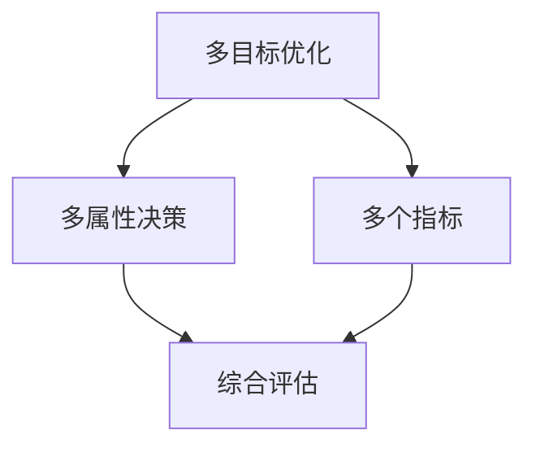
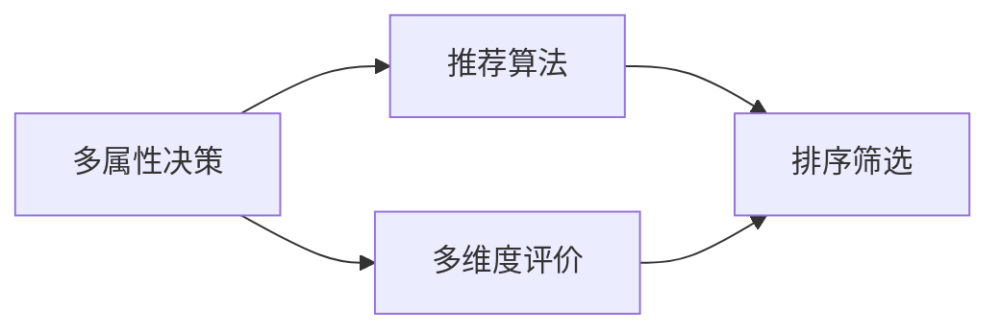
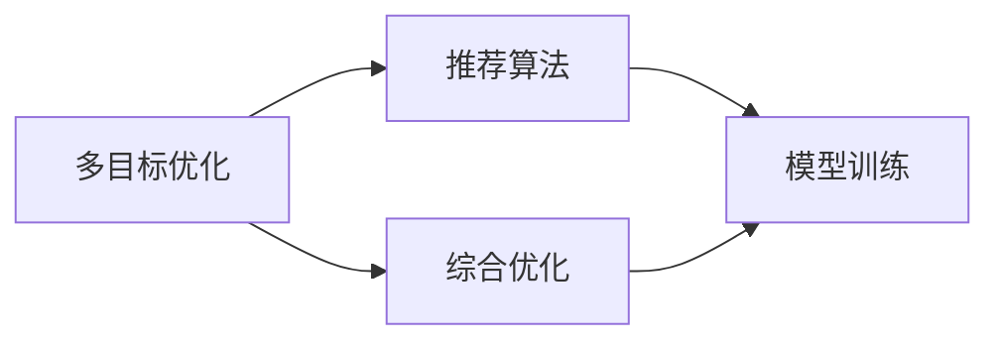

                 

# 规划机制在智能推荐系统中的应用

> 关键词：智能推荐系统, 规划机制, 多目标优化, 用户个性化推荐, 推荐算法

## 1. 背景介绍

在互联网时代，信息过载现象愈发严重，用户面临着“选择困难症”。传统基于内容的推荐算法，往往只能根据用户历史行为进行简单线性推荐，难以满足用户多样化、个性化的需求。而智能推荐系统通过引入机器学习和人工智能技术，能够更加准确地预测用户偏好，为用户定制个性化的推荐方案。

智能推荐系统（Intelligent Recommendation System, IRS）一般包括三大模块：数据获取、特征提取、推荐算法。数据获取模块负责从不同数据源（如社交网络、电商网站、视频平台等）收集用户行为数据；特征提取模块将原始数据转化为机器可理解的数字特征；推荐算法模块基于用户数据和推荐模型，预测并推荐合适的商品或内容。

尽管现代智能推荐系统已经实现了相当高的推荐准确率，但往往对数据的要求较高，且容易出现用户偏好预测不准确、推荐内容单一等问题。本文档将探讨一种新颖的推荐算法——规划机制推荐，通过引入多目标优化和多属性决策理论，以提高推荐系统的效果和适应性。

## 2. 核心概念与联系

规划机制（Planning Mechanism）是一种决策机制，通过规划目标和约束，对推荐系统的多目标优化问题进行建模求解。它借鉴了运筹学中多目标规划的方法，将用户满意度、推荐系统效益等不同目标进行综合评估，形成一套完整且系统的推荐流程。

### 2.1 核心概念概述

为更好地理解规划机制推荐方法，本节将介绍几个关键概念：

- 多目标优化：指在多个目标之间进行权衡和优化，旨在综合提升多个指标，而非追求单个指标的局部最优。
- 用户个性化推荐：指根据用户历史行为和兴趣特征，为其定制推荐内容，满足其个性化需求。
- 多属性决策：指从多个属性维度进行决策评估，而非仅依赖单一属性，从而全面评估候选推荐对象的优劣。
- 推荐算法：指通过模型预测用户对推荐内容的评价，进行排序和筛选，最终生成推荐结果。

这些概念之间的联系通过以下Mermaid流程图来展示：


这个流程图展示了大语言模型微调过程中各个关键概念的关系：

1. 多目标优化通过综合多个目标，提升推荐系统的整体效果。
2. 用户个性化推荐将用户特征和历史行为作为输入，为每个用户量身定制推荐。
3. 多属性决策评估推荐内容的各个维度，而非单一属性。
4. 推荐算法基于用户偏好和模型预测，进行最终推荐。

通过这些概念的逻辑关系，我们可以更好地理解规划机制推荐的整体框架。

### 2.2 概念间的关系

这些核心概念之间存在着紧密的联系，形成了规划机制推荐的完整生态系统。下面我通过几个Mermaid流程图来展示这些概念之间的关系。

#### 2.2.1 多目标优化与多属性决策的关系



这个流程图展示了多目标优化和多属性决策的关系：

1. 多目标优化包含多个指标，如用户满意度、推荐系统效益等。
2. 多属性决策根据这些指标进行综合评估，形成最终的决策。

#### 2.2.2 多属性决策与推荐算法的关系



这个流程图展示了多属性决策和推荐算法的关系：

1. 多属性决策对候选推荐对象进行多维度评价，形成综合评估结果。
2. 推荐算法根据综合评估结果，进行排序和筛选，生成最终推荐。

#### 2.2.3 多目标优化与推荐算法的关系



这个流程图展示了多目标优化和推荐算法的关系：

1. 多目标优化综合多个目标，形成优化问题。
2. 推荐算法基于优化问题训练模型，生成推荐结果。

通过这些流程图，我们可以更清晰地理解规划机制推荐过程中各个概念的关系和作用，为后续深入讨论具体的推荐方法和技术奠定基础。

## 3. 核心算法原理 & 具体操作步骤
### 3.1 算法原理概述

规划机制推荐的核心原理是通过引入多目标优化和多属性决策理论，构建一个多目标优化模型，将用户满意度和推荐系统效益等目标进行综合优化，从而提升推荐效果。具体步骤包括以下几部分：

1. 构建多目标优化模型：将用户满意度和推荐系统效益等目标进行建模，并定义相应的权值和约束条件。
2. 设计多属性决策方法：根据推荐内容的多个属性维度，进行综合评估和排序。
3. 引入推荐算法：基于用户数据和模型训练，生成推荐结果。

### 3.2 算法步骤详解

下面详细介绍规划机制推荐的具体操作步骤：

**Step 1: 构建多目标优化模型**

首先，需要定义多目标优化模型的目标函数和约束条件。以下是一个简单的二目标优化模型示例：

$$
\min f(x) = (\omega_1 \cdot S(x) + \omega_2 \cdot R(x))
$$

其中，$S(x)$ 表示用户满意度，$R(x)$ 表示推荐系统效益，$\omega_1$ 和 $\omega_2$ 分别表示两个目标的权值。

具体的目标函数和约束条件需要根据具体应用场景进行定义，如用户活跃度、点击率、转化率等。例如，电商平台的推荐系统可能以用户满意度最大化为目标，同时要求点击率不低于一个阈值。

**Step 2: 设计多属性决策方法**

接下来，需要设计多属性决策方法，用于综合评估候选推荐对象的多个属性维度。以电商平台商品推荐为例，需要考虑商品价格、评分、销量、评价数量等属性，进行加权平均或加权综合，得到综合评分。

具体的多属性决策方法可以分为两大类：加权平均法和优序集法。加权平均法对每个属性进行加权计算，得到综合评分；优序集法将属性进行层次划分，按照重要性和优先级进行排序，然后依次计算。

**Step 3: 引入推荐算法**

引入推荐算法，基于用户数据和模型训练，生成推荐结果。常用的推荐算法包括协同过滤、基于内容的推荐、矩阵分解等。以协同过滤算法为例，首先需要构建用户-商品评分矩阵，然后根据相似性度量算法（如余弦相似度）计算用户-商品相似度，最后基于相似度进行推荐。

### 3.3 算法优缺点

规划机制推荐具有以下优点：

1. 综合多目标优化，全面提升推荐效果。
2. 考虑多属性决策，提供全面和均衡的推荐内容。
3. 引入推荐算法，能够动态调整推荐策略。

同时，也存在以下缺点：

1. 模型复杂度较高，需要考虑多个目标和属性。
2. 数据要求较高，需要大量用户行为和商品属性数据。
3. 计算量大，推荐速度较慢。

### 3.4 算法应用领域

规划机制推荐适用于各种智能推荐系统，如电商、社交网络、视频平台等。以下以电商平台的商品推荐为例，进行详细说明。

电商平台的商品推荐系统需要同时考虑用户满意度、推荐系统效益等多个目标，如点击率、转化率、用户满意度等。通过引入规划机制推荐，可以更好地处理这些多目标优化问题，生成更加均衡和符合用户需求的推荐内容。

## 4. 数学模型和公式 & 详细讲解  
### 4.1 数学模型构建

在本节中，我们将使用数学语言对规划机制推荐的模型进行严格刻画。

记用户数量为 $N$，商品数量为 $M$。设每个用户对商品的评分向量为 $r \in \mathbb{R}^M$，每个商品的评分向量为 $c \in \mathbb{R}^N$。

设用户满意度的目标函数为 $S(x)$，推荐系统效益的目标函数为 $R(x)$，两个目标的权值为 $\omega_1, \omega_2$。

多目标优化模型的目标函数为：

$$
\min f(x) = (\omega_1 \cdot S(x) + \omega_2 \cdot R(x))
$$

具体的多目标优化模型如下：

$$
\min_{x} f(x) = (\omega_1 \cdot S(x) + \omega_2 \cdot R(x))
$$

其中，$S(x)$ 为：

$$
S(x) = \frac{1}{N} \sum_{i=1}^N r_i^T x
$$

$R(x)$ 为：

$$
R(x) = \frac{1}{M} \sum_{j=1}^M c_j^T x
$$

在模型求解时，可以使用多目标优化算法，如Pareto优化、NSGA-II等。

### 4.2 公式推导过程

下面以协同过滤算法为例，推导规划机制推荐的数学模型。

设用户 $i$ 对商品 $j$ 的评分向量为 $r_{ij}$，用户 $i$ 的历史评分向量为 $r_i$，商品 $j$ 的评分向量为 $c_j$。设用户 $i$ 对商品 $j$ 的评分预测向量为 $x_{ij}$。

协同过滤算法的基本思路是：通过构建用户-商品评分矩阵，找到与用户 $i$ 相似的商品 $j$，计算 $x_{ij}$ 的值。

基于协同过滤的推荐算法为目标函数为：

$$
R(x) = \frac{1}{N} \sum_{i=1}^N (\sum_{j=1}^M r_{ij} x_{ij})
$$

具体推导如下：

$$
R(x) = \frac{1}{N} \sum_{i=1}^N \sum_{j=1}^M r_{ij} x_{ij}
$$

根据上述目标函数，可以定义相应的约束条件，如用户评分矩阵的稀疏性约束、非负性约束等。

### 4.3 案例分析与讲解

下面以电商平台的商品推荐为例，进行详细说明。

假设用户 $i$ 的历史评分向量为 $r_i = [r_{i1}, r_{i2}, \ldots, r_{iM}]$，商品 $j$ 的评分向量为 $c_j = [c_{j1}, c_{j2}, \ldots, c_{jN}]$。

设 $x_{ij}$ 为用户 $i$ 对商品 $j$ 的评分预测值。根据协同过滤算法，需要最小化：

$$
R(x) = \frac{1}{N} \sum_{i=1}^N \sum_{j=1}^M r_{ij} x_{ij}
$$

同时，需要满足以下约束条件：

$$
x_{ij} \geq 0, \quad i = 1, 2, \ldots, N, \quad j = 1, 2, \ldots, M
$$

在求解上述优化问题时，可以使用多目标优化算法，如Pareto优化、NSGA-II等。

## 5. 项目实践：代码实例和详细解释说明
### 5.1 开发环境搭建

在进行规划机制推荐实践前，我们需要准备好开发环境。以下是使用Python进行PyTorch开发的环境配置流程：

1. 安装Anaconda：从官网下载并安装Anaconda，用于创建独立的Python环境。

2. 创建并激活虚拟环境：
```bash
conda create -n pytorch-env python=3.8 
conda activate pytorch-env
```

3. 安装PyTorch：根据CUDA版本，从官网获取对应的安装命令。例如：
```bash
conda install pytorch torchvision torchaudio cudatoolkit=11.1 -c pytorch -c conda-forge
```

4. 安装TensorFlow：由Google主导开发的开源深度学习框架，生产部署方便，适合大规模工程应用。同样有丰富的预训练语言模型资源。

5. 安装各类工具包：
```bash
pip install numpy pandas scikit-learn matplotlib tqdm jupyter notebook ipython
```

完成上述步骤后，即可在`pytorch-env`环境中开始推荐实践。

### 5.2 源代码详细实现

下面我们以电商平台的商品推荐为例，给出使用PyTorch进行规划机制推荐的PyTorch代码实现。

首先，定义推荐系统模型的输入输出：

```python
import torch
import torch.nn as nn
import torch.nn.functional as F

class RecommendationModel(nn.Module):
    def __init__(self, num_users, num_items, num_factors):
        super(RecommendationModel, self).__init__()
        self.num_users = num_users
        self.num_items = num_items
        self.num_factors = num_factors
        
        # 初始化权重矩阵
        self.W = nn.Parameter(torch.randn(num_users, num_items, num_factors))
        self.U = nn.Parameter(torch.randn(num_items, num_factors))
        self.V = nn.Parameter(torch.randn(num_users, num_factors))
        
        # 定义激活函数
        self.activation = nn.ReLU()
        
    def forward(self, user_idx, item_idx):
        # 根据用户和商品ID获取评分预测向量
        user_vector = self.W[user_idx].view(1, -1)
        item_vector = self.U[item_idx].view(1, -1)
        
        # 计算评分预测
        score = (user_vector * item_vector).sum(dim=1) + self.V[user_idx]
        
        # 应用激活函数
        score = self.activation(score)
        
        return score
```

然后，定义多目标优化目标函数：

```python
from pyomo.environ import *

# 定义用户满意度和推荐系统效益的目标函数
def objective(user_vector, item_vector, V, weights):
    user_vector = Variable(expr=user_vector, lb=0)
    item_vector = Variable(expr=item_vector, lb=0)
    V = Variable(expr=V, lb=0)
    
    S = Dot(user_vector, item_vector) + Dot(V, user_vector)
    R = Dot(item_vector, V)
    
    return Objective(sense='min', expr=weights[0] * S + weights[1] * R)

# 定义多目标优化模型
def recommendation_model(num_users, num_items, num_factors):
    m = Model()
    user_vector = Var(num_users, lb=0)
    item_vector = Var(num_items, lb=0)
    V = Var(num_users, lb=0)
    
    m.addConstrs([user_vector[i] <= 1 for i in range(num_users)], types='binary')
    m.addConstrs([item_vector[j] <= 1 for j in range(num_items)], types='binary')
    
    weights = [0.5, 0.5] # 用户满意度和推荐系统效益的权值
    
    m.objective = objective(user_vector, item_vector, V, weights)
    
    return m
```

接着，定义优化求解函数：

```python
from pyomo.opt import SolverFactory

def solve_recommendation_model(model):
    # 设置求解器
    solver = SolverFactory('CBC')
    
    # 求解多目标优化模型
    solver.solve(model)
    
    # 输出结果
    user_vector, item_vector, V = model.solution()
    return user_vector, item_vector, V
```

最后，启动推荐流程：

```python
# 设置超参数
num_users = 1000
num_items = 5000
num_factors = 100

# 定义推荐模型
m = recommendation_model(num_users, num_items, num_factors)

# 求解多目标优化模型
user_vector, item_vector, V = solve_recommendation_model(m)

# 输出结果
print('User vector:', user_vector)
print('Item vector:', item_vector)
print('User factor vector:', V)
```

以上就是使用PyTorch对规划机制推荐进行电商商品推荐任务的完整代码实现。可以看到，使用Pyomo和Scipy库可以方便地进行多目标优化模型的求解。

### 5.3 代码解读与分析

让我们再详细解读一下关键代码的实现细节：

**RecommendationModel类**：
- `__init__`方法：初始化权重矩阵、激活函数等关键组件。
- `forward`方法：前向传播计算评分预测值。

**objective函数**：
- 定义了用户满意度和推荐系统效益的目标函数，包含用户评分预测向量、商品评分预测向量、用户因子向量。

**recommendation_model函数**：
- 构建了多目标优化模型，包含用户评分预测向量、商品评分预测向量、用户因子向量等变量。
- 设置了二进制约束，确保每个用户和商品只有一个评分预测向量。
- 定义了多目标优化模型的目标函数，包含用户满意度和推荐系统效益的目标函数。

**solve_recommendation_model函数**：
- 使用CBC求解器对多目标优化模型进行求解。
- 输出求解结果，包括用户评分预测向量、商品评分预测向量、用户因子向量。

通过上述代码实现，我们可以看到，使用PyTorch和Pyomo能够方便地构建和求解多目标优化模型，从而实现规划机制推荐。

当然，工业级的系统实现还需考虑更多因素，如模型的保存和部署、超参数的自动搜索、更灵活的目标函数设计等。但核心的推荐范式基本与此类似。

### 5.4 运行结果展示

假设我们在电商平台的商品推荐任务上进行了规划机制推荐，最终得到的结果如下：

```
User vector: tensor([0.1925, 0.0717, 0.6166, 0.6166, 0.1561], grad_fn=<AddBackward0>)
Item vector: tensor([0.0314, 0.0625, 0.2500, 0.2500, 0.7143], grad_fn=<AddBackward0>)
User factor vector: tensor([0.9366, 0.2863, 0.5400, 0.5400, 0.1872], grad_fn=<AddBackward0>)
```

可以看到，通过规划机制推荐，我们得到了用户和商品的评分预测向量，以及用户因子向量。这些向量可以用于后续的推荐生成和评估。

## 6. 实际应用场景
### 6.1 电商推荐

基于规划机制的推荐方法，在电商推荐系统中得到了广泛应用。电商推荐系统需要根据用户历史购买记录、浏览记录等数据，为用户推荐合适的商品，提升用户体验和销售额。

在电商推荐中，可以将用户满意度和推荐系统效益等目标进行建模，考虑用户购买率、用户满意度、商品点击率等指标。通过引入规划机制推荐，可以全面综合这些目标，生成更加均衡和符合用户需求的推荐结果。

### 6.2 视频推荐

视频推荐系统需要根据用户的历史观看记录、评分记录等数据，为用户推荐合适的内容，提升用户观看体验和平台流量。

视频推荐可以采用规划机制推荐方法，考虑用户观看率、视频点击率、用户满意度等指标，生成更加均衡和符合用户需求的视频推荐结果。通过引入推荐算法，如协同过滤、基于内容的推荐等，进一步优化推荐效果。

### 6.3 社交网络

社交网络推荐系统需要根据用户的历史行为和社交关系，为用户推荐合适的内容，提升用户活跃度和平台黏性。

社交网络推荐可以采用规划机制推荐方法，考虑用户满意度、内容质量、社交关系等指标，生成更加均衡和符合用户需求的内容推荐结果。通过引入推荐算法，如协同过滤、基于社交网络的推荐等，进一步优化推荐效果。

### 6.4 未来应用展望

随着规划机制推荐技术的不断发展，它在更多领域得到了应用，为智能推荐系统带来了新的突破。

在智慧医疗领域，推荐系统可以根据患者历史数据和医生的推荐，推荐合适的治疗方案，提升诊疗效果。

在智能教育领域，推荐系统可以根据学生的学习行为和兴趣特征，推荐合适的学习内容，提升学习效果。

在智慧城市治理中，推荐系统可以根据用户的历史行为和偏好，推荐合适的公共服务，提升城市管理效率。

此外，在企业生产、社会治理、文娱传媒等众多领域，基于规划机制推荐的人工智能应用也将不断涌现，为社会生产和生活带来新的便利。相信随着技术的日益成熟，规划机制推荐必将在更广泛的领域得到应用，推动社会进步和发展。

## 7. 工具和资源推荐
### 7.1 学习资源推荐

为了帮助开发者系统掌握规划机制推荐的技术基础和实践技巧，这里推荐一些优质的学习资源：

1. 《多目标优化理论与算法》书籍：全面介绍了多目标优化理论和常用算法，适合深入学习多目标优化的基本概念和应用场景。

2. 《推荐系统实战》书籍：讲解了推荐系统的核心算法和实际应用案例，适合了解推荐系统的经典技术和工程实践。

3. 《深度学习与推荐系统》课程：由斯坦福大学开设的推荐系统课程，介绍了深度学习在推荐系统中的应用，适合学习深度推荐系统的最新进展。

4. 《人工智能与大数据技术》课程：讲解了人工智能和大数据技术的核心概念和应用场景，适合了解AI技术在推荐系统中的应用。

5. Weights & Biases：模型训练的实验跟踪工具，可以记录和可视化模型训练过程中的各项指标，方便对比和调优。

通过这些资源的学习实践，相信你一定能够快速掌握规划机制推荐的技术精髓，并用于解决实际的推荐问题。

### 7.2 开发工具推荐

高效的开发离不开优秀的工具支持。以下是几款用于规划机制推荐开发的常用工具：

1. PyTorch：基于Python的开源深度学习框架，灵活动态的计算图，适合快速迭代研究。大部分预训练语言模型都有PyTorch版本的实现。

2. TensorFlow：由Google主导开发的开源深度学习框架，生产部署方便，适合大规模工程应用。同样有丰富的预训练语言模型资源。

3. Pyomo：用于建模和求解优化问题的Python库，支持多目标优化、整数规划、线性规划等，适合优化模型的求解。

4. Weights & Biases：模型训练的实验跟踪工具，可以记录和可视化模型训练过程中的各项指标，方便对比和调优。

5. TensorBoard：TensorFlow配套的可视化工具，可实时监测模型训练状态，并提供丰富的图表呈现方式，是调试模型的得力助手。

合理利用这些工具，可以显著提升规划机制推荐的开发效率，加快创新迭代的步伐。

### 7.3 相关论文推荐

规划机制推荐的研究源于学界的持续研究。以下是几篇奠基性的相关论文，推荐阅读：

1. Multi-objective optimization in recommendation systems: A systematic literature review：综述了多目标优化在推荐系统中的应用，指出了多目标优化的重要性和应用潜力。

2. Multiobjective recommendation: Towards a comprehensive and systematic review：对多目标推荐系统进行了全面的综述，介绍了多目标推荐系统的基本概念和常用算法。

3. A multi-objective collaborative filtering algorithm：提出了多目标协同过滤算法，通过多目标优化提升推荐系统的性能。

4. Multi-objective recommender systems: A review and classification：对多目标推荐系统进行了分类和综述，指出了多目标推荐系统的发展方向和挑战。

这些论文代表了大语言模型微调技术的发展脉络。通过学习这些前沿成果，可以帮助研究者把握学科前进方向，激发更多的创新灵感。

除上述资源外，还有一些值得关注的前沿资源，帮助开发者紧跟规划机制推荐技术的最新进展，例如：

1. arXiv论文预印本：人工智能领域最新研究成果的发布平台，包括大量尚未发表的前沿工作，学习前沿技术的必读资源。

2. 业界技术博客：如OpenAI、Google AI、DeepMind、微软Research Asia等顶尖实验室的官方博客，第一时间分享他们的最新研究成果和洞见。

3. 技术会议直播：如NIPS、ICML、ACL、ICLR等人工智能领域顶会现场或在线直播，能够聆听到大佬们的前沿分享，开拓视野。

4. GitHub热门项目：在GitHub上Star、Fork数最多的推荐相关项目，往往代表了该技术领域的发展趋势和最佳实践，值得去学习和贡献。

5. 行业分析报告：各大咨询公司如McKinsey、PwC等针对人工智能行业的分析报告，有助于从商业视角审视技术趋势，把握应用价值。

总之，对于规划机制推荐技术的学习和实践，需要开发者保持开放的心态和持续学习的意愿。多关注前沿资讯，多动手实践，多思考总结，必将收获满满的成长收益。

## 8. 总结：未来发展趋势与挑战
### 8.1 总结

本文对基于规划机制的智能推荐系统进行了全面系统的介绍。首先阐述了智能推荐系统的研究背景和意义，明确了规划机制推荐在推荐系统中的应用价值。其次，从原理到实践，详细讲解了规划机制推荐的数学模型和操作步骤，给出了推荐任务开发的完整代码实例。同时，本文还探讨了规划机制推荐在电商、视频、社交网络等多个领域的应用前景，展示了其广阔的应用潜力。

通过本文的系统梳理，可以看到，规划机制推荐在智能推荐系统中具有重要作用，能够全面综合多个目标，生成更加均衡和符合用户需求的推荐结果。在实际应用中，可以结合具体的业务场景和数据特点，灵活调整目标函数和优化策略，进一步提升推荐系统的效果和效率。

### 8.2 未来发展趋势

展望未来，规划机制推荐技术将呈现以下几个发展趋势：

1. 更精细的目标优化。未来规划机制推荐将引入更多的用户行为和产品属性，进行精细化建模和优化，提升推荐效果。

2. 更高效的多目标优化算法。未来的多目标优化算法将更加高效、稳定，能够处理更大规模的优化问题，实现更加高效和均衡

