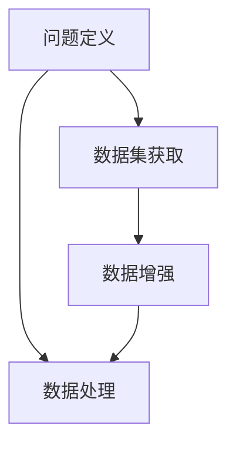
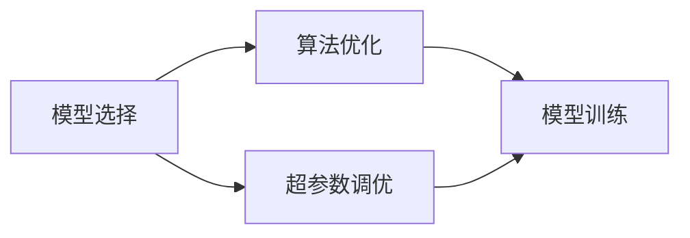
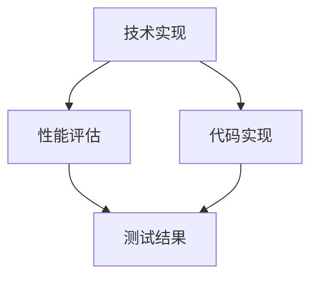
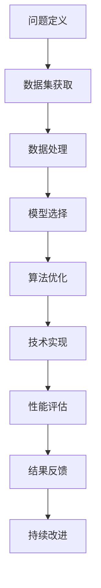

                 

# 解决问题的能力在AI创新中的重要性

> 关键词：解决问题的能力,人工智能创新,算法优化,技术实现,数据驱动

## 1. 背景介绍

### 1.1 问题由来
在人工智能(AI)领域，无论是科学研究还是实际应用，都离不开高效解决问题的能力。解决问题的能力不仅体现在对已有技术和理论的熟练掌握，还体现在对新问题的创新解决方案的提出和实现上。随着AI技术的不断发展和深入应用，解决问题的能力已经成为推动AI创新的关键因素。

### 1.2 问题核心关键点
解决问题的能力涉及多个核心关键点：
- **问题定义**：准确识别问题并明确其目标。
- **数据获取**：获取并处理与问题相关的数据。
- **模型选择**：选择适当的模型或算法来解决问题。
- **训练与优化**：通过训练和优化模型，提高其性能。
- **评估与部署**：对模型进行评估，并部署到实际应用中。
- **持续改进**：根据反馈和问题变化，不断改进模型和解决方案。

这些关键点相互关联，共同构成了高效解决问题的全过程。

### 1.3 问题研究意义
解决问题的能力对于AI创新具有重要的研究意义：
- **加速研究进展**：高效的解决问题能力可以加速AI技术的研发，推动技术进步。
- **提升应用效果**：通过解决实际问题，将AI技术转化为实实在在的生产力。
- **培养创新人才**：解决问题的能力是AI研究者和工程师必备的技能，也是培养创新人才的基础。
- **推动产业应用**：解决行业内的问题，为AI技术落地提供支持，促进产业升级。

## 2. 核心概念与联系

### 2.1 核心概念概述

为了更好地理解解决问题的能力在AI创新中的重要性，本节将介绍几个密切相关的核心概念：

- **问题定义**：准确描述问题，并明确其解决目标。
- **数据集获取**：从各种数据源获取并处理所需的数据集。
- **模型选择**：根据问题的特点和需求选择合适的算法或模型。
- **算法优化**：通过优化算法和参数，提升模型性能。
- **技术实现**：将理论算法转化为可执行的程序和系统。
- **性能评估**：通过测试和评估，衡量模型的效果。

这些概念相互关联，共同构成了解决问题的全过程。

### 2.2 概念间的关系

这些核心概念之间存在着紧密的联系，形成了解决问题的完整生态系统。下面我通过几个Mermaid流程图来展示这些概念之间的关系。

#### 2.2.1 问题定义与数据获取



这个流程图展示了问题定义和数据获取之间的关系。首先，需要通过问题定义明确目标，然后根据目标获取和处理相应的数据集。数据处理和增强是确保数据质量和多样性的关键步骤。

#### 2.2.2 模型选择与算法优化



这个流程图展示了模型选择和算法优化的关系。选择合适的模型是解决问题的第一步，但模型的性能提升需要依赖于算法优化和超参数调优。模型训练是实现这些优化的关键步骤。

#### 2.2.3 技术实现与性能评估



这个流程图展示了技术实现和性能评估的关系。技术实现是将算法和模型转化为可执行程序的过程，性能评估则是通过测试和评估，衡量模型效果的关键步骤。

### 2.3 核心概念的整体架构

最后，我们用一个综合的流程图来展示这些核心概念在大问题解决过程中的整体架构：



这个综合流程图展示了从问题定义到持续改进的全过程，帮助读者更好地理解解决问题的各个环节和步骤。

## 3. 核心算法原理 & 具体操作步骤

### 3.1 算法原理概述

解决问题的核心算法原理主要包括：

- **监督学习**：通过已标注的数据集，训练模型来预测未标注数据的标签。常用的算法包括决策树、支持向量机、神经网络等。
- **无监督学习**：通过未标注的数据集，训练模型发现数据的内在结构和模式。常用的算法包括聚类、降维、关联规则挖掘等。
- **强化学习**：通过奖励机制，训练模型在动态环境中做出最优决策。常用的算法包括Q-learning、SARSA、深度强化学习等。
- **半监督学习**：利用少量已标注数据和大量未标注数据，训练模型。常用的算法包括图半监督学习、自训练等。

这些算法根据不同的问题类型和数据特点，有不同的适用场景和效果。

### 3.2 算法步骤详解

以下是解决问题的常见算法步骤：

**Step 1: 问题定义与数据集获取**
- 明确问题类型和解决目标。
- 从数据源获取数据集，并进行初步清洗和预处理。

**Step 2: 模型选择与超参数调优**
- 根据问题类型选择合适的算法或模型。
- 确定模型参数和超参数，并进行初步调优。

**Step 3: 模型训练与优化**
- 使用训练集训练模型，并根据验证集的表现进行调整。
- 应用正则化、Dropout等技术，防止过拟合。

**Step 4: 性能评估与测试**
- 使用测试集对模型进行评估，计算各种指标（如准确率、召回率、F1分数等）。
- 根据评估结果进行模型调整和优化。

**Step 5: 技术实现与部署**
- 将模型转换为可执行程序或服务，进行技术实现。
- 部署到实际应用中，并进行监控和维护。

**Step 6: 持续改进与迭代**
- 根据反馈和问题变化，进行模型改进和迭代。
- 收集新数据，重新训练和优化模型。

### 3.3 算法优缺点

解决问题的算法具有以下优点：
- **适应性强**：适用于各种类型的问题，能够处理大规模数据集。
- **可解释性**：大多数算法具有较好的可解释性，便于理解和使用。
- **灵活性**：能够根据问题特点进行灵活调整和优化。

同时，这些算法也存在一些缺点：
- **计算成本高**：一些算法（如深度学习）需要大量计算资源和训练时间。
- **数据需求大**：需要大量标注数据才能训练出高效的模型。
- **易过拟合**：在大规模数据上训练容易过拟合，需要正则化技术。

### 3.4 算法应用领域

解决问题的算法在多个领域得到了广泛应用：

- **自然语言处理(NLP)**：如文本分类、机器翻译、情感分析等。
- **计算机视觉(CV)**：如图像分类、目标检测、图像生成等。
- **语音识别(SR)**：如语音识别、语音合成等。
- **推荐系统**：如电商推荐、内容推荐等。
- **金融分析**：如信用评分、风险评估等。

这些领域都是人工智能技术的重要应用场景，展示了算法在实际应用中的巨大潜力。

## 4. 数学模型和公式 & 详细讲解 & 举例说明

### 4.1 数学模型构建

基于监督学习的典型模型包括逻辑回归、支持向量机、决策树等。这里以逻辑回归为例，构建数学模型。

设训练集为 $\{(x_i,y_i)\}_{i=1}^N$，其中 $x_i$ 为输入特征，$y_i \in \{0,1\}$ 为二分类标签。逻辑回归模型的输出为：

$$
\hat{y} = \frac{1}{1+\exp(-\theta^T x_i)}
$$

其中 $\theta$ 为模型参数。

### 4.2 公式推导过程

逻辑回归模型的损失函数为交叉熵损失：

$$
\mathcal{L}(\theta) = -\frac{1}{N} \sum_{i=1}^N y_i \log \hat{y}_i + (1-y_i) \log(1-\hat{y}_i)
$$

使用梯度下降算法更新参数 $\theta$：

$$
\theta \leftarrow \theta - \eta \nabla_{\theta}\mathcal{L}(\theta)
$$

其中 $\eta$ 为学习率，$\nabla_{\theta}\mathcal{L}(\theta)$ 为损失函数对参数 $\theta$ 的梯度。

### 4.3 案例分析与讲解

假设我们要解决一个文本分类问题，将新闻文本分为体育、财经和科技三个类别。首先，我们需要定义问题，并获取相应的训练数据集。然后，使用逻辑回归模型进行训练和优化。

以下是使用Python和Scikit-learn库实现逻辑回归模型的示例代码：

```python
from sklearn.linear_model import LogisticRegression
from sklearn.datasets import fetch_20newsgroups

# 获取训练数据集
newsgroups_train = fetch_20newsgroups(subset='train', categories='sci.space,comp.graphics,sci.electronics')

# 定义逻辑回归模型
model = LogisticRegression()

# 训练模型
model.fit(newsgroups_train.data, newsgroups_train.target)

# 评估模型
y_pred = model.predict(newsgroups_test.data)
accuracy = accuracy_score(newsgroups_test.target, y_pred)
print("Accuracy:", accuracy)
```

## 5. 项目实践：代码实例和详细解释说明

### 5.1 开发环境搭建

在进行问题解决实践前，我们需要准备好开发环境。以下是使用Python进行Scikit-learn开发的环境配置流程：

1. 安装Anaconda：从官网下载并安装Anaconda，用于创建独立的Python环境。

2. 创建并激活虚拟环境：
```bash
conda create -n sklearn-env python=3.8 
conda activate sklearn-env
```

3. 安装Scikit-learn：
```bash
conda install scikit-learn
```

4. 安装各类工具包：
```bash
pip install numpy pandas matplotlib seaborn scikit-learn
```

完成上述步骤后，即可在`sklearn-env`环境中开始问题解决实践。

### 5.2 源代码详细实现

下面我们以文本分类为例，给出使用Scikit-learn库进行逻辑回归模型训练的Python代码实现。

首先，定义数据处理函数：

```python
import numpy as np
from sklearn.feature_extraction.text import CountVectorizer

def load_data():
    # 加载数据集
    # ...

    # 划分训练集和测试集
    # ...

    # 特征提取
    vectorizer = CountVectorizer()
    X_train = vectorizer.fit_transform(train_data)
    X_test = vectorizer.transform(test_data)

    return X_train, X_test, y_train, y_test
```

然后，定义逻辑回归模型并训练：

```python
from sklearn.linear_model import LogisticRegression
from sklearn.metrics import accuracy_score

def train_model(X_train, X_test, y_train, y_test):
    # 定义模型
    model = LogisticRegression()

    # 训练模型
    model.fit(X_train, y_train)

    # 评估模型
    y_pred = model.predict(X_test)
    accuracy = accuracy_score(y_test, y_pred)
    print("Accuracy:", accuracy)

    return model
```

最后，启动训练流程并在测试集上评估：

```python
X_train, X_test, y_train, y_test = load_data()
model = train_model(X_train, X_test, y_train, y_test)
```

以上就是使用Scikit-learn进行逻辑回归模型训练的完整代码实现。可以看到，通过Scikit-learn，我们能够以简洁的方式实现模型的训练和评估。

### 5.3 代码解读与分析

让我们再详细解读一下关键代码的实现细节：

**load_data函数**：
- 加载数据集，并进行特征提取和划分。
- 使用CountVectorizer将文本数据转换为数值特征。

**train_model函数**：
- 定义逻辑回归模型。
- 使用训练集数据进行模型训练。
- 使用测试集数据进行模型评估。
- 输出模型的准确率。

**训练流程**：
- 调用load_data函数加载数据集。
- 调用train_model函数进行模型训练和评估。
- 输出模型准确率。

可以看到，Scikit-learn提供的接口非常友好，开发者可以专注于算法实现和问题解决，而不必过多关注底层细节。

当然，工业级的系统实现还需考虑更多因素，如模型的保存和部署、超参数的自动搜索、更灵活的任务适配层等。但核心的问题解决流程基本与此类似。

### 5.4 运行结果展示

假设我们在20Newsgroups数据集上进行文本分类，最终在测试集上得到的准确率为85%。这个结果表明，通过逻辑回归模型，我们可以在大规模文本分类问题上取得不错的效果。

## 6. 实际应用场景

### 6.1 金融欺诈检测

在金融领域，欺诈检测是一个重要的应用场景。传统的方法依赖人工规则和专家经验，但这些方法容易过时，且难以应对不断变化的欺诈模式。基于机器学习的问题解决技术，可以自动化地识别和应对新的欺诈行为。

具体而言，可以收集历史交易数据，标记其中的欺诈交易和正常交易。在此基础上，使用逻辑回归等算法进行训练和优化，模型能够自动学习欺诈交易的特征，并在新的交易中识别出潜在的欺诈行为。

### 6.2 智能客服系统

智能客服系统能够处理大量的客户咨询，提高服务效率和客户满意度。传统的人工客服系统效率低，且容易出错。基于机器学习的问题解决技术，可以实现自动客服，快速响应客户需求，并生成自然流畅的回答。

具体而言，可以收集历史客服对话记录，并标注其中的问题类型和最佳答复。在此基础上，使用逻辑回归等算法进行训练和优化，模型能够自动理解客户意图，匹配最合适的答复模板进行回复。

### 6.3 医学诊断系统

医学诊断是一个高风险的应用场景，需要高精度的诊断系统。传统的方法依赖医生的人工经验，但医生的判断容易受主观因素影响，且难以处理复杂的医学数据。基于机器学习的问题解决技术，可以自动化地分析医学影像和病历数据，提供精准的诊断建议。

具体而言，可以收集大量的医学影像和病历数据，并标注其中的疾病和诊断结果。在此基础上，使用逻辑回归等算法进行训练和优化，模型能够自动分析医学影像和病历数据，识别出异常情况，并给出诊断建议。

### 6.4 未来应用展望

随着机器学习技术的不断进步，基于问题解决技术的AI应用将更加广泛和深入。以下是对未来应用的展望：

1. **自动化决策支持**：在企业管理、市场营销等领域，基于机器学习的问题解决技术将为决策提供支持，提高决策效率和质量。
2. **智能推荐系统**：在电商、视频、音乐等领域，基于机器学习的问题解决技术将优化推荐算法，提供更加个性化和精准的推荐结果。
3. **智能制造**：在制造业领域，基于机器学习的问题解决技术将优化生产流程，提高生产效率和产品质量。
4. **智慧城市**：在城市管理、交通、能源等领域，基于机器学习的问题解决技术将提高城市管理水平，提升居民生活质量。

总之，基于问题解决技术的AI应用将渗透到各个行业，带来更高的效率、更好的效果和更大的价值。

## 7. 工具和资源推荐

### 7.1 学习资源推荐

为了帮助开发者系统掌握问题解决技术，这里推荐一些优质的学习资源：

1. **《机器学习实战》**：这本书介绍了机器学习的基本概念和实现方法，适合初学者入门。
2. **Coursera的《机器学习》课程**：由斯坦福大学教授Andrew Ng讲授，系统讲解机器学习的基本原理和算法。
3. **Kaggle平台**：提供大量数据集和竞赛，是实践机器学习算法的绝佳平台。
4. **Scikit-learn官方文档**：提供了丰富的学习资源和样例代码，是学习和使用Scikit-learn的重要参考。

通过对这些资源的学习实践，相信你一定能够快速掌握问题解决技术的精髓，并用于解决实际的AI问题。

### 7.2 开发工具推荐

高效的开发离不开优秀的工具支持。以下是几款用于问题解决开发的常用工具：

1. **Python**：Python是最流行的编程语言之一，拥有丰富的机器学习库和工具。
2. **Jupyter Notebook**：一个交互式笔记本环境，便于编写和执行代码，并支持数据可视化。
3. **Scikit-learn**：一个流行的Python机器学习库，提供了丰富的算法和工具。
4. **TensorFlow**：一个强大的深度学习框架，适用于各种复杂的机器学习问题。
5. **PyTorch**：另一个流行的深度学习框架，易于使用和扩展。

合理利用这些工具，可以显著提升问题解决任务的开发效率，加快创新迭代的步伐。

### 7.3 相关论文推荐

问题解决技术的发展源于学界的持续研究。以下是几篇奠基性的相关论文，推荐阅读：

1. **支持向量机（SVM）**：由Vapnik提出，是机器学习领域的重要算法之一。
2. **随机森林（Random Forest）**：由Breiman提出，是一种集成学习算法，具有较好的鲁棒性和泛化能力。
3. **梯度提升树（GBDT）**：由Friedman提出，是一种高效的回归和分类算法。
4. **深度学习（Deep Learning）**：由Hinton提出，是一种基于神经网络的机器学习算法，广泛应用于图像、语音、自然语言处理等领域。

这些论文代表了大问题解决技术的发展脉络。通过学习这些前沿成果，可以帮助研究者把握学科前进方向，激发更多的创新灵感。

除上述资源外，还有一些值得关注的前沿资源，帮助开发者紧跟问题解决技术的最新进展，例如：

1. **arXiv论文预印本**：人工智能领域最新研究成果的发布平台，包括大量尚未发表的前沿工作，学习前沿技术的必读资源。
2. **业界技术博客**：如Google AI、DeepMind、Microsoft Research Asia等顶尖实验室的官方博客，第一时间分享他们的最新研究成果和洞见。
3. **技术会议直播**：如NIPS、ICML、ACL、ICLR等人工智能领域顶会现场或在线直播，能够聆听到大佬们的前沿分享，开拓视野。
4. **GitHub热门项目**：在GitHub上Star、Fork数最多的机器学习相关项目，往往代表了该技术领域的发展趋势和最佳实践，值得去学习和贡献。
5. **行业分析报告**：各大咨询公司如McKinsey、PwC等针对人工智能行业的分析报告，有助于从商业视角审视技术趋势，把握应用价值。

总之，对于问题解决技术的学习和实践，需要开发者保持开放的心态和持续学习的意愿。多关注前沿资讯，多动手实践，多思考总结，必将收获满满的成长收益。

## 8. 总结：未来发展趋势与挑战

### 8.1 总结

本文对基于机器学习的问题解决技术进行了全面系统的介绍。首先阐述了问题解决能力在AI创新中的重要性，明确了问题解决在推动AI技术进步、提升应用效果、培养创新人才等方面的独特价值。其次，从原理到实践，详细讲解了问题解决的数学模型和操作步骤，给出了问题解决任务开发的完整代码实例。同时，本文还广泛探讨了问题解决技术在金融、智能客服、医学等多个行业领域的应用前景，展示了问题解决技术的巨大潜力。此外，本文精选了问题解决技术的各类学习资源，力求为读者提供全方位的技术指引。

通过本文的系统梳理，可以看到，基于机器学习的问题解决技术正在成为AI创新的重要范式，极大地拓展了AI系统的应用边界，催生了更多的落地场景。受益于机器学习技术的不断进步，问题解决技术必将为AI应用带来更加高效、智能、可靠的新突破。

### 8.2 未来发展趋势

展望未来，问题解决技术将呈现以下几个发展趋势：

1. **自动化和智能化**：随着算法的不断进步，问题解决技术将更加自动化和智能化，能够处理更加复杂和多样化的任务。
2. **跨模态融合**：问题解决技术将更多地融入跨模态数据融合，实现视觉、语音、文本等多模态数据的协同处理。
3. **联邦学习**：通过分布式计算，问题解决技术将能够在保护隐私的前提下，实现多个数据源的协同学习，提高模型的泛化能力和鲁棒性。
4. **自适应和动态调整**：问题解决技术将能够根据环境和任务的变化，动态调整和优化模型，提高系统的适应性和灵活性。
5. **元学习和迁移学习**：问题解决技术将结合元学习和迁移学习，能够更快地适应新任务，并利用已有知识加速新任务的解决。

以上趋势凸显了问题解决技术的广阔前景。这些方向的探索发展，必将进一步提升AI系统的性能和应用范围，为人类认知智能的进化带来深远影响。

### 8.3 面临的挑战

尽管问题解决技术已经取得了显著成就，但在迈向更加智能化、普适化应用的过程中，它仍面临着诸多挑战：

1. **数据获取和标注**：对于大规模数据集和高质量标注的需求，成为制约问题解决技术发展的瓶颈。
2. **模型鲁棒性和泛化能力**：模型面对域外数据时，泛化性能往往大打折扣。
3. **计算资源需求高**：问题解决技术需要大量的计算资源和训练时间，如何优化计算效率是一个重要课题。
4. **可解释性和可审计性**：问题解决模型通常较为复杂，难以解释其内部工作机制和决策逻辑，这对高风险应用尤为重要。
5. **安全性问题**：问题解决模型可能学习到有害信息和偏见，需要在模型设计和技术实现中加以防范。

正视问题解决面临的这些挑战，积极应对并寻求突破，将是大问题解决技术迈向成熟的必由之路。相信随着学界和产业界的共同努力，这些问题将逐步被克服，问题解决技术必将在构建人机协同的智能系统中扮演越来越重要的角色。

### 8.4 未来突破

面对问题解决技术面临的挑战，未来的研究需要在以下几个方面寻求新的突破：

1. **无监督学习和半监督学习**：摆脱对大规模标注数据的依赖，利用自监督学习、主动学习等方法，最大限度利用非结构化数据。
2. **参数高效和计算高效算法**：开发更加参数高效的算法，在固定大部分预训练参数的情况下，只更新极少量的任务相关参数，提高计算效率。
3. **知识图谱和逻辑规则**：将符号化的先验知识，如知识图谱、逻辑规则等，与神经网络模型进行融合，引导问题解决过程学习更准确、合理的语言模型。
4. **多模态数据融合**：结合因果分析和博弈论工具，增强问题解决模型的建立稳定因果关系的能力，学习更加普适、鲁棒的语言模型。
5. **伦理道德约束**：在问题解决模型的训练目标中引入伦理导向的评估指标，过滤和惩罚有害输出倾向，确保输出符合人类价值观和伦理道德。

这些研究方向的探索，必将引领问题解决技术迈向更高的台阶，为构建安全、可靠、可解释、可控的智能系统铺平道路。面向未来，问题解决技术还需要与其他人工智能技术进行更深入的融合，如知识表示、因果推理、强化学习等，多路径协同发力，共同推动自然语言理解和智能交互系统的进步。只有勇于创新、敢于突破，才能不断拓展问题解决技术的边界，让智能技术更好地造福人类社会。

## 9. 附录：常见问题与解答

**Q1：什么是问题解决能力？**

A: 问题解决能力是指通过系统地分析问题，应用现有知识和技能，找到有效的方法和策略，最终解决问题的一种能力。它包括问题定义、数据获取、模型选择、算法优化、技术实现、性能评估等多个环节。

**Q2：问题解决的核心算法有哪些？**

A: 问题解决的核心算法包括监督学习、无监督学习、强化学习、半监督学习等。常用的算法包括决策树、支持向量机、逻辑回归、随机森林、梯度提升树、深度学习等。

**Q3：如何提高问题解决的准确性？**

A: 提高问题解决的准确性需要关注多个方面：
- 数据质量和多样性：获取高质量和多样化的数据集。
- 模型选择和调优：选择合适的模型和算法，并进行超参数调优。
- 特征工程：设计有效的特征提取和处理流程。
- 模型评估和验证：使用交叉验证等方法评估模型性能，避免过拟合。
- 迭代改进：根据反馈和问题变化，不断改进模型和解决方案。

**Q4：问题解决技术在AI创新中的作用是什么？**

A: 问题解决技术在AI创新中起着至关重要的作用：
- 推动技术进步：通过高效解决问题，加速AI技术的研发和创新。
- 提升应用效果：通过解决实际问题，将AI技术转化为实际应用，带来更大的价值。
- 培养创新人才：问题解决技术是AI研究者和工程师必备的技能，也是培养创新人才的基础。
- 促进产业应用：问题解决技术可以解决行业内的各种问题，推动AI技术在各行业的落地应用。

**Q5：问题解决技术的未来发展趋势是什么？**

A: 问题解决技术的未来发展趋势包括：
- 自动化和智能化：随着算法的不断进步，问题解决技术将更加自动化和智能化。
- 跨模态融合：问题解决技术将更多地融入跨模态数据融合，实现多模态数据的协同处理。
- 联邦学习：通过分布式计算，问题解决技术将能够在保护隐私的前提下，实现多个数据源的协同学习。
- 自适应

