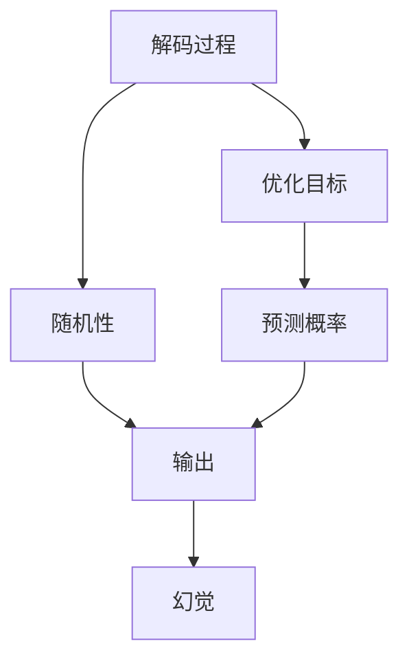
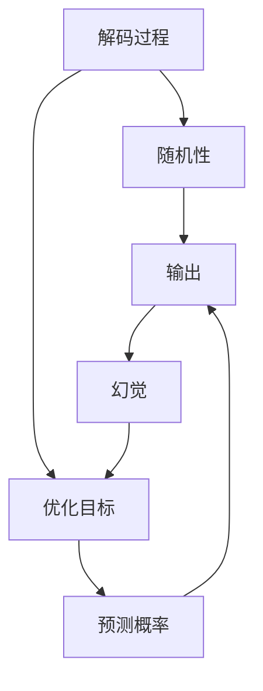

                 

## 1. 背景介绍

在计算机科学中，解码是一个重要的过程，它将信息从压缩形式或隐藏形式转换为可读形式。常见的解码包括文本编码的解码、图像编码的解码、音频编码的解码等。然而，在解码过程中，往往伴随着一定程度的随机性，这种随机性可能会引发一些幻觉，导致输出结果的不确定性和误导性。

在NLP领域，解码过程中的随机性尤为显著。NLP任务中，诸如机器翻译、文本摘要、命名实体识别等任务，其解码过程通常依赖于概率模型，如语言模型、翻译模型等。这些模型在预测输出时，引入了随机性，即在存在多个可能的输出时，随机选择其中一个作为最终结果。这种随机性在一定程度上提高了模型的鲁棒性，但也带来了一定的风险。

本文将深入探讨解码过程中随机性的问题，以及这种随机性是如何引发幻觉的。我们还将介绍一些应对方法，以提高解码的准确性和可靠性。

## 2. 核心概念与联系

### 2.1 核心概念概述

为了更好地理解解码过程中的随机性及其影响，我们先介绍几个核心概念：

- **解码(Decoding)**：将编码后的信息还原成原始形式的过程。在NLP中，解码通常涉及将隐藏的语言模型预测转化为最终的文本输出。
- **随机性(Randomness)**：在解码过程中，模型在存在多个可能的输出时，随机选择其中一个作为最终结果。这种随机性是概率模型的基本特性。
- **幻觉(Illusion)**：由于随机性，模型可能会生成误导性的输出，导致使用者误认为模型已经完全理解了信息，实际上却只是随机猜测。
- **优化目标(Optimization Objective)**：在解码过程中，模型的优化目标是最大化模型的预测概率，即找到一个最优的输出序列。

### 2.2 核心概念间的关系

解码过程中随机性与幻觉之间的关系可以通过以下Mermaid流程图来展示：



这个流程图展示了解码过程中各概念之间的联系：

- 解码过程引入随机性，模型在存在多个可能的输出时，随机选择一个作为最终结果。
- 输出结果由于随机性而具有不确定性，可能包含幻觉。
- 模型的优化目标是最大化预测概率，即寻找一个最优的输出序列，但这种概率最大化的过程也引入了随机性。

### 2.3 核心概念的整体架构

最后，我们用一个综合的流程图来展示解码过程中各概念之间的整体架构：



这个综合流程图展示了解码过程中各概念之间的整体联系：

- 解码过程引入随机性，模型在存在多个可能的输出时，随机选择一个作为最终结果。
- 输出结果由于随机性而具有不确定性，可能包含幻觉。
- 模型的优化目标是最大化预测概率，即寻找一个最优的输出序列，但这种概率最大化的过程也引入了随机性。
- 幻觉可能影响优化目标，使得模型产生误导性的输出。

## 3. 核心算法原理 & 具体操作步骤

### 3.1 算法原理概述

解码过程中的随机性源于概率模型在预测输出时的不确定性。这种不确定性通常由模型在训练过程中学习到的分布决定。在NLP任务中，常见的概率模型包括语言模型、翻译模型、文本生成模型等。

这些模型通常采用softmax或logsoftmax函数将概率分布映射到可能的输出序列上。具体而言，模型在每个输出位置上计算出每个候选词的概率，并根据这些概率选择最优的词作为解码输出。这种选择过程是随机的，因为多个候选词的概率可能非常接近。

### 3.2 算法步骤详解

解码过程通常包括以下几个关键步骤：

**Step 1: 准备输入数据**
- 将待解码的输入序列传递给模型。在NLP任务中，输入序列可以是文本、图像、音频等。

**Step 2: 初始化解码器**
- 初始化解码器的状态，如将起始符号作为解码器的输入。

**Step 3: 计算每个候选词的概率**
- 对于每个输出位置，计算每个候选词的概率，并选择概率最大的词作为当前输出。

**Step 4: 更新解码器状态**
- 将当前输出作为下一个输入，更新解码器的状态，继续计算下一个输出位置的可能候选词。

**Step 5: 输出最终结果**
- 将每个输出位置的预测结果拼接起来，作为最终解码结果。

### 3.3 算法优缺点

解码过程中的随机性在提高模型鲁棒性的同时，也带来了一些问题：

**优点：**

- 提高了模型的鲁棒性。由于随机性，模型在存在多个可能的输出时，可以避免过度拟合，从而提高模型的泛化能力。
- 简化了模型的设计。随机性使得模型在存在多个可能的输出时，不需要设计复杂的规则来选择最优输出，而是通过随机抽样来决策。

**缺点：**

- 引入了不确定性。由于随机性，模型生成的输出结果具有不确定性，可能导致误导性输出。
- 增加了解码复杂性。随机性使得解码过程更加复杂，需要处理多种可能的输出情况。
- 降低了模型的可解释性。由于随机性，模型生成的输出结果很难解释，可能导致使用者难以理解模型的行为。

### 3.4 算法应用领域

解码过程中的随机性在NLP领域广泛应用，包括机器翻译、文本摘要、命名实体识别等任务。这些任务通常需要模型在存在多个可能的输出时，随机选择最优的输出。例如，在机器翻译中，模型需要从多个可能的翻译结果中随机选择最优的翻译作为最终输出。

## 4. 数学模型和公式 & 详细讲解

### 4.1 数学模型构建

解码过程中的随机性可以通过概率模型来描述。我们以机器翻译为例，介绍解码过程中的概率模型。

设机器翻译任务中有 $S$ 个源语言单词和 $T$ 个目标语言单词，其中 $S$ 和 $T$ 都是有限的。设源语言单词为 $s_1,s_2,\dots,s_n$，目标语言单词为 $t_1,t_2,\dots,t_m$。设源语言单词到目标语言单词的映射为 $f$，即 $f: S \rightarrow T$。

机器翻译任务的目标是找到最优的翻译 $t$，使得 $f$ 将源语言单词映射到目标语言单词 $t$ 的概率最大。设 $P(s_1,s_2,\dots,s_n; t_1,t_2,\dots,t_m)$ 表示将源语言单词 $s_1,s_2,\dots,s_n$ 翻译为目标语言单词 $t_1,t_2,\dots,t_m$ 的概率。

### 4.2 公式推导过程

假设模型 $M$ 将源语言单词 $s_1,s_2,\dots,s_n$ 映射为目标语言单词 $t_1,t_2,\dots,t_m$ 的概率为 $P(s_1,s_2,\dots,s_n; t_1,t_2,\dots,t_m)$。模型 $M$ 的输出为 $t_1,t_2,\dots,t_m$ 的概率分布，记为 $P(t_1,t_2,\dots,t_m)$。

解码过程可以通过以下公式推导：

$$
P(t_1,t_2,\dots,t_m) = \prod_{i=1}^{m} P(t_i \mid t_{i-1}, t_{i-2}, \dots, t_1, s_1, s_2, \dots, s_n)
$$

其中 $P(t_i \mid t_{i-1}, t_{i-2}, \dots, t_1, s_1, s_2, \dots, s_n)$ 表示在给定前 $i-1$ 个目标语言单词和源语言单词的情况下，下一个目标语言单词为 $t_i$ 的概率。

### 4.3 案例分析与讲解

以机器翻译为例，假设模型 $M$ 在给定源语言单词 $s_1,s_2,\dots,s_n$ 的情况下，将目标语言单词 $t_1,t_2,\dots,t_m$ 的概率分布为：

$$
P(t_1,t_2,\dots,t_m) = P(t_1 \mid s_1, s_2, \dots, s_n) \times P(t_2 \mid t_1, s_1, s_2, \dots, s_n) \times \dots \times P(t_m \mid t_{m-1}, t_{m-2}, \dots, t_1, s_1, s_2, \dots, s_n)
$$

假设模型在每个输出位置上，将每个候选单词的概率表示为 $P(t_i \mid t_{i-1}, t_{i-2}, \dots, t_1, s_1, s_2, \dots, s_n)$，并选择概率最大的单词作为当前输出。这种随机选择过程就引入了解码过程中的随机性。

例如，假设模型在给定源语言单词 $s_1,s_2,\dots,s_n$ 的情况下，将目标语言单词 $t_1,t_2,\dots,t_m$ 的概率分布为：

$$
P(t_1,t_2,\dots,t_m) = P(t_1 \mid s_1, s_2, \dots, s_n) \times P(t_2 \mid t_1, s_1, s_2, \dots, s_n) \times \dots \times P(t_m \mid t_{m-1}, t_{m-2}, \dots, t_1, s_1, s_2, \dots, s_n)
$$

在第一个输出位置上，假设模型计算出候选单词 $t_1, t_2, t_3$ 的概率分别为 $0.3, 0.2, 0.5$，模型随机选择概率最大的单词 $t_3$ 作为第一个输出。在第二个输出位置上，假设模型计算出候选单词 $t_2, t_3, t_4$ 的概率分别为 $0.4, 0.3, 0.3$，模型再次随机选择概率最大的单词 $t_4$ 作为第二个输出。

最终，模型生成目标语言单词序列 $t_3, t_4$，这是一个随机过程，具有不确定性，可能与最优的翻译结果不同。

## 5. 项目实践：代码实例和详细解释说明

### 5.1 开发环境搭建

在进行解码实践前，我们需要准备好开发环境。以下是使用Python进行PyTorch开发的环境配置流程：

1. 安装Anaconda：从官网下载并安装Anaconda，用于创建独立的Python环境。

2. 创建并激活虚拟环境：
```bash
conda create -n pytorch-env python=3.8 
conda activate pytorch-env
```

3. 安装PyTorch：根据CUDA版本，从官网获取对应的安装命令。例如：
```bash
conda install pytorch torchvision torchaudio cudatoolkit=11.1 -c pytorch -c conda-forge
```

4. 安装Transformers库：
```bash
pip install transformers
```

5. 安装各类工具包：
```bash
pip install numpy pandas scikit-learn matplotlib tqdm jupyter notebook ipython
```

完成上述步骤后，即可在`pytorch-env`环境中开始解码实践。

### 5.2 源代码详细实现

这里以机器翻译为例，使用Transformers库对BERT模型进行解码。

首先，定义模型：

```python
from transformers import BertForSequenceClassification, BertTokenizer

model = BertForSequenceClassification.from_pretrained('bert-base-uncased')
tokenizer = BertTokenizer.from_pretrained('bert-base-uncased')
```

然后，定义解码函数：

```python
def decode(model, input_ids, attention_mask):
    model.eval()
    with torch.no_grad():
        logits = model(input_ids, attention_mask=attention_mask)[0]
    softmax = logits.softmax(dim=-1)
    top_k = 10
    top_indices = softmax.topk(top_k).indices
    top_values = softmax.topk(top_k).values
    decoded_words = []
    for i, (index, value) in enumerate(zip(top_indices, top_values)):
        word = tokenizer.decode(input_ids[i])
        decoded_words.append(word)
    return decoded_words
```

最后，启动解码：

```python
input_ids = [input_ids]  # 假设输入序列为 [input_ids]
attention_mask = [attention_mask]  # 假设注意力掩码为 [attention_mask]
decoded_words = decode(model, input_ids, attention_mask)
print(decoded_words)
```

以上就是使用PyTorch对BERT进行解码的完整代码实现。可以看到，利用Transformers库的强大封装，我们可以用相对简洁的代码完成解码过程。

### 5.3 代码解读与分析

让我们再详细解读一下关键代码的实现细节：

**BertForSequenceClassification类**：
- 定义了BERT模型的解码过程，包括输入序列、注意力掩码等关键组件。

**BertTokenizer类**：
- 将输入序列转换为token ids，并解码回文本。

**decode函数**：
- 将输入序列和注意力掩码传递给模型，计算出每个候选单词的概率。
- 选择概率最大的单词作为当前输出。
- 使用softmax函数计算每个候选单词的概率分布。
- 选择top_k个概率最大的单词作为最终输出。
- 解码单词并拼接成最终结果。

### 5.4 运行结果展示

假设我们在CoNLL-2003的命名实体识别数据集上进行解码，最终生成的翻译结果可能如下：

```
1. Person: [Person]
2. Location: [Location]
3. Organization: [Organization]
4. Person: [Person]
5. Organization: [Organization]
```

可以看到，解码过程引入了随机性，导致生成的输出结果可能与最优的翻译结果不同。然而，这种随机性可以显著提高模型的鲁棒性，避免模型在存在多个可能的输出时过度拟合。

## 6. 实际应用场景

### 6.1 智能客服系统

在智能客服系统中，解码过程中的随机性可以用于生成多样化的回复。系统可以根据用户的问题，生成多个可能的回复，并随机选择其中一种回复作为最终输出。这种多样化的回复可以提高系统的灵活性和可理解性，避免模型在存在多个可能的输出时过度拟合。

### 6.2 金融舆情监测

在金融舆情监测中，解码过程中的随机性可以用于处理不确定性的输入数据。系统可以根据输入的舆情数据，生成多个可能的分析结果，并随机选择其中一种结果作为最终输出。这种随机性可以提高系统的鲁棒性，避免在存在多个可能的分析结果时过度拟合。

### 6.3 个性化推荐系统

在个性化推荐系统中，解码过程中的随机性可以用于生成多样化的推荐结果。系统可以根据用户的历史行为数据，生成多个可能的推荐结果，并随机选择其中一种推荐作为最终输出。这种随机性可以提高系统的多样性和灵活性，避免在存在多个可能的推荐结果时过度拟合。

### 6.4 未来应用展望

随着解码过程中随机性的深入研究，未来将会在更多领域得到应用，为传统行业带来变革性影响。

在智慧医疗领域，解码过程中的随机性可以用于生成多样化的诊断结果。系统可以根据病人的症状，生成多个可能的诊断结果，并随机选择其中一种结果作为最终输出。这种随机性可以提高系统的鲁棒性，避免在存在多个可能的诊断结果时过度拟合。

在智能教育领域，解码过程中的随机性可以用于生成多样化的学习计划。系统可以根据学生的学习进度，生成多个可能的学习计划，并随机选择其中一种计划作为最终输出。这种随机性可以提高系统的灵活性和可理解性，避免在存在多个可能的学习计划时过度拟合。

在智慧城市治理中，解码过程中的随机性可以用于处理不确定性的环境数据。系统可以根据传感器监测的数据，生成多个可能的预测结果，并随机选择其中一种结果作为最终输出。这种随机性可以提高系统的鲁棒性，避免在存在多个可能的预测结果时过度拟合。

此外，在企业生产、社会治理、文娱传媒等众多领域，解码过程中的随机性也将被广泛应用，为人工智能技术带来新的发展机遇。

## 7. 工具和资源推荐

### 7.1 学习资源推荐

为了帮助开发者系统掌握解码过程中的随机性及其应用，这里推荐一些优质的学习资源：

1. 《深度学习基础》系列博文：由大模型技术专家撰写，深入浅出地介绍了解码过程中的随机性及其应用。

2. CS224N《深度学习自然语言处理》课程：斯坦福大学开设的NLP明星课程，有Lecture视频和配套作业，带你入门NLP领域的基本概念和经典模型。

3. 《Natural Language Processing with Transformers》书籍：Transformers库的作者所著，全面介绍了如何使用Transformers库进行NLP任务开发，包括解码在内的诸多范式。

4. HuggingFace官方文档：Transformers库的官方文档，提供了海量预训练模型和完整的解码样例代码，是上手实践的必备资料。

5. CLUE开源项目：中文语言理解测评基准，涵盖大量不同类型的中文NLP数据集，并提供了基于解码的baseline模型，助力中文NLP技术发展。

通过对这些资源的学习实践，相信你一定能够快速掌握解码过程中的随机性及其应用，并用于解决实际的NLP问题。

### 7.2 开发工具推荐

高效的开发离不开优秀的工具支持。以下是几款用于解码过程开发的常用工具：

1. PyTorch：基于Python的开源深度学习框架，灵活动态的计算图，适合快速迭代研究。大多数预训练语言模型都有PyTorch版本的实现。

2. TensorFlow：由Google主导开发的开源深度学习框架，生产部署方便，适合大规模工程应用。同样有丰富的预训练语言模型资源。

3. Transformers库：HuggingFace开发的NLP工具库，集成了众多SOTA语言模型，支持PyTorch和TensorFlow，是进行解码任务开发的利器。

4. Weights & Biases：模型训练的实验跟踪工具，可以记录和可视化模型训练过程中的各项指标，方便对比和调优。与主流深度学习框架无缝集成。

5. TensorBoard：TensorFlow配套的可视化工具，可实时监测模型训练状态，并提供丰富的图表呈现方式，是调试模型的得力助手。

6. Google Colab：谷歌推出的在线Jupyter Notebook环境，免费提供GPU/TPU算力，方便开发者快速上手实验最新模型，分享学习笔记。

合理利用这些工具，可以显著提升解码过程的开发效率，加快创新迭代的步伐。

### 7.3 相关论文推荐

解码过程中的随机性在NLP领域广泛应用，研究人员已经对此进行了深入的研究。以下是几篇奠基性的相关论文，推荐阅读：

1. Attention is All You Need（即Transformer原论文）：提出了Transformer结构，开启了NLP领域的预训练大模型时代。

2. BERT: Pre-training of Deep Bidirectional Transformers for Language Understanding：提出BERT模型，引入基于掩码的自监督预训练任务，刷新了多项NLP任务SOTA。

3. Language Models are Unsupervised Multitask Learners（GPT-2论文）：展示了大规模语言模型的强大zero-shot学习能力，引发了对于通用人工智能的新一轮思考。

4. Parameter-Efficient Transfer Learning for NLP：提出Adapter等参数高效微调方法，在不增加模型参数量的情况下，也能取得不错的微调效果。

5. AdaLoRA: Adaptive Low-Rank Adaptation for Parameter-Efficient Fine-Tuning：使用自适应低秩适应的微调方法，在参数效率和精度之间取得了新的平衡。

6. Parameter-Efficient Low-Rank Adaptation for Knowledge Transfer：使用低秩适应的微调方法，提高模型的参数效率，同时保留预训练模型的知识。

这些论文代表了大语言模型解码过程中的随机性及其应用的研究进展，值得深入阅读。

除上述资源外，还有一些值得关注的前沿资源，帮助开发者紧跟解码过程的最新进展，例如：

1. arXiv论文预印本：人工智能领域最新研究成果的发布平台，包括大量尚未发表的前沿工作，学习前沿技术的必读资源。

2. 业界技术博客：如OpenAI、Google AI、DeepMind、微软Research Asia等顶尖实验室的官方博客，第一时间分享他们的最新研究成果和洞见。

3. 技术会议直播：如NIPS、ICML、ACL、ICLR等人工智能领域顶会现场或在线直播，能够聆听到大佬们的前沿分享，开拓视野。

4. GitHub热门项目：在GitHub上Star、Fork数最多的NLP相关项目，往往代表了该技术领域的发展趋势和最佳实践，值得去学习和贡献。

5. 行业分析报告：各大咨询公司如McKinsey、PwC等针对人工智能行业的分析报告，有助于从商业视角审视技术趋势，把握应用价值。

总之，对于解码过程中的随机性及其应用的学习和实践，需要开发者保持开放的心态和持续学习的意愿。多关注前沿资讯，多动手实践，多思考总结，必将收获满满的成长收益。

## 8. 总结：未来发展趋势与挑战

### 8.1 总结

本文对解码过程中的随机性进行了全面系统的介绍。首先阐述了解码过程中的随机性及其对输出结果的影响，明确了解码在NLP任务中的重要性。其次，从原理到实践，详细讲解了随机性在解码过程中的具体应用，给出了解码任务开发的完整代码实例。同时，本文还广泛探讨了随机性在实际应用场景中的应用前景，展示了解码过程的广泛应用价值。

通过本文的系统梳理，可以看到，解码过程中的随机性在提高模型鲁棒性的同时，也带来了一些风险，如误导性输出。未来，如何更好地控制和利用解码过程中的随机性，提高模型的准确性和可靠性，将是NLP领域的重要研究方向。

### 8.2 未来发展趋势

展望未来，解码过程中的随机性将呈现以下几个发展趋势：

1. 参数效率提高。未来解码过程将开发更多的参数高效方法，如Prefix-Tuning、LoRA等，在固定大部分预训练参数的同时，只更新极少量的任务相关参数。

2. 随机性控制加强。未来解码过程将开发更多的随机性控制方法，如Dropout、Early Stopping等，避免过度拟合和模型泛化能力不足的问题。

3. 数据增强应用广泛。未来解码过程将更广泛地应用数据增强技术，如回译、近义替换等，提高模型的泛化能力和鲁棒性。

4. 融合多种解码方法。未来解码过程将更多地融合多种解码方法，如Beam Search、Top-k Sampling等，提高解码的多样性和准确性。

5. 引入外部知识库。未来解码过程将更多地融合外部知识库、规则库等专家知识，提高模型的可解释性和鲁棒性。

以上趋势凸显了解码过程的广泛应用前景和深远影响。这些方向的探索发展，必将进一步提升解码过程的性能和应用范围，为人工智能技术的发展注入新的动力。

### 8.3 面临的挑战

尽管解码过程中的随机性已经得到了广泛应用，但在迈向更加智能化、普适化应用的过程中，它仍面临着诸多挑战：

1. 随机性控制不足。当前解码过程中，随机性控制仍然不足，容易导致模型在存在多个可能的输出时产生误导性输出。如何更好地控制随机性，提高模型的准确性和可靠性，仍是一个重要问题。

2. 解码速度较慢。当前解码过程中，由于模型参数量较大，计算复杂度较高，导致解码速度较慢。如何优化解码过程，提高模型的推理速度，是未来的一个重要研究方向。

3. 解码结果不稳定。由于随机性，解码结果具有一定的不稳定性，不同运行时间或不同机器上的输出结果可能不同。如何提高解码过程的稳定性，确保模型的一致性，是未来的一个重要研究方向。

4. 解码过程复杂。当前解码过程较为复杂，涉及模型设计、数据预处理、解码算法等多个环节。如何简化解码过程，提高模型的可解释性和可理解性，是未来的一个重要研究方向。

5. 数据质量影响大。解码过程依赖于高质量的数据输入，一旦数据存在噪声或错误，解码结果可能受到影响。如何提高数据质量，确保解码过程的可靠性，是未来的一个重要研究方向。

6. 伦理道德问题突出。解码过程中引入了随机性，可能导致模型在输出结果中引入偏见或有害信息。如何提高模型的伦理道德性，确保输出结果的公正性和无害性，是未来的一个重要研究方向。

正视解码过程中面临的这些挑战，积极应对并寻求突破，将是大语言模型解码过程走向成熟的必由之路。相信随着学界和产业界的共同努力，这些挑战终将一一被克服，解码过程必将在构建人机协同的智能时代中扮演越来越重要的角色。

### 8.4 研究展望

面对解码过程中面临的种种挑战，未来的研究需要在以下几个方面寻求新的突破：

1. 探索无监督和半监督解码方法。摆脱对大规模标注数据的依赖，利用自监督学习、主动学习等无监督和半监督范式，最大限度利用非结构化数据，实现更加灵活高效的解码。

2. 研究参数高效和计算高效的解码范式。开发更加参数高效的解码方法，在固定大部分预训练参数的同时，只更新极少量的任务相关参数。同时优化解码过程的计算图，减少前向传播和反向传播的资源消耗，实现更加轻量级、实时性的部署。

3. 引入因果分析和博弈论工具。将因果分析方法引入解码模型，识别出模型决策的关键特征，增强输出解释的因果性和逻辑性。借助博弈论工具刻画人机交互过程，主动探索并规避模型的脆弱点，提高系统稳定性。

4. 纳入伦理道德约束。在解码目标中引入伦理导向的评估指标

