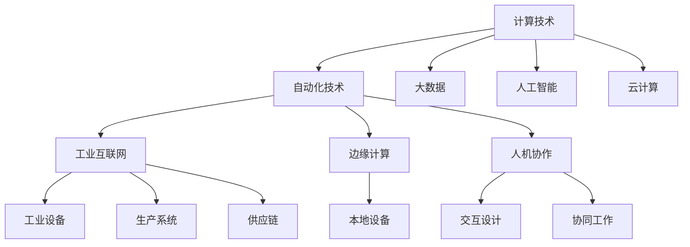
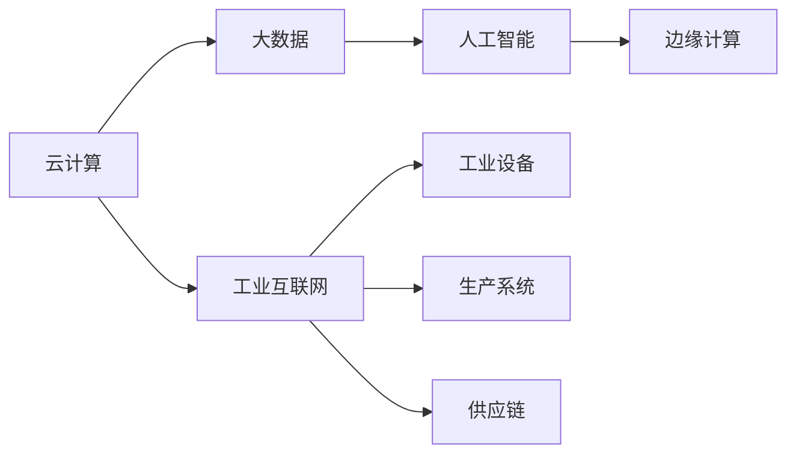
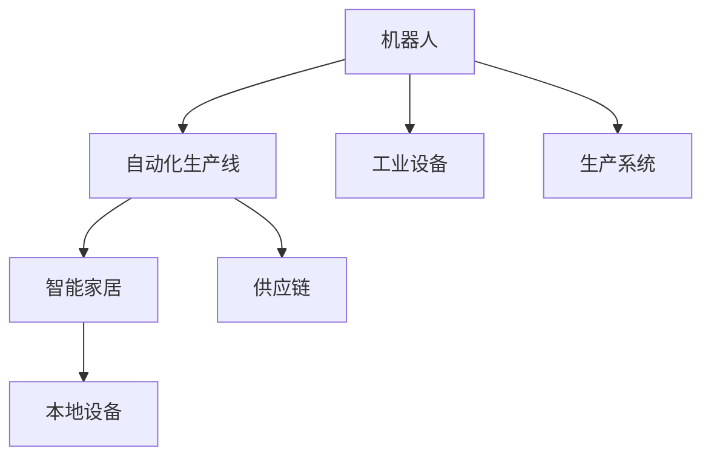
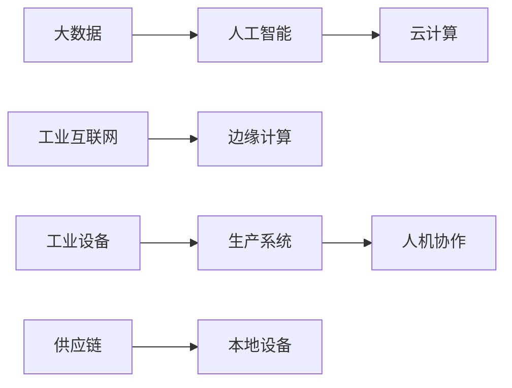

                 

## 1. 背景介绍

### 1.1 问题由来
在当今数字化的时代，计算技术已经渗透到我们生活的方方面面。从数据中心、云计算到人工智能、物联网，计算能力正在驱动社会生产力的飞速进步。与此同时，自动化技术也在不断成熟，从自动化生产线到智能家居，自动化正成为推动社会生产效率和经济增长的重要动力。计算和自动化技术的融合，不仅改变了我们的生产方式，更在根本上重塑了社会运作模式。

然而，计算和自动化技术的融合并非易事。计算技术带来了前所未有的数据处理能力和智能化功能，但如何合理地利用这些能力，使其与自动化技术有机结合，实现智能化的生产和应用，仍是一个复杂而庞大的课题。如何在计算能力不断提升的同时，避免出现技术“鸿沟”，确保技术进步造福全人类，是当前亟待解决的重要问题。

### 1.2 问题核心关键点
计算和自动化技术的融合涉及多个核心关键点，包括但不限于：

- **数据驱动决策**：如何利用大数据和人工智能技术，分析和预测自动化系统的运行状态和故障，实现精确的决策和优化。
- **智能自动化**：如何通过计算技术，实现自动化的智能化，提升自动化系统的自主学习、适应和优化能力。
- **工业互联网**：如何构建一个连接计算和自动化技术的工业互联网，实现数据的无缝集成和智能化的协同作业。
- **边缘计算**：如何在边缘设备上部署计算资源，实现对实时数据的高效处理和分析。
- **人机协作**：如何通过计算技术，改善人机交互，提升自动化系统的操作效率和用户体验。

### 1.3 问题研究意义
研究计算与自动化技术的融合，对于推动产业升级、提升生产效率、促进社会经济健康发展具有重要意义：

- **提升生产力**：通过计算和自动化技术的融合，实现生产过程的智能化、自动化，大幅提升生产效率，降低人工成本。
- **促进创新**：计算技术的强大数据分析能力与自动化技术的实时响应能力相结合，可以推动技术创新，带来更多的产业应用。
- **优化管理**：通过计算技术，优化自动化系统的管理和调度，实现资源的最优配置，提高整体效益。
- **保障安全**：自动化系统通过计算技术可以实现异常监测和预警，保障生产安全。
- **改善用户体验**：通过计算技术，实现智能化的交互设计，提升用户体验。

## 2. 核心概念与联系

### 2.1 核心概念概述

为更好地理解计算和自动化技术的融合，本节将介绍几个密切相关的核心概念：

- **计算技术**：指能够处理和分析数据的各类技术，包括但不限于云计算、大数据、人工智能等。
- **自动化技术**：指能够自动执行任务和操作的各类技术，包括但不限于机器人、自动化生产线、智能家居等。
- **工业互联网**：指通过计算和通信技术，实现工业设备、生产系统、供应链等的互联互通，提升整体效率和效益。
- **边缘计算**：指在靠近数据源的本地设备上处理数据，实现快速响应和高效率的数据分析。
- **人机协作**：指通过计算技术，改善人机交互，实现机器和人类之间的协同工作。

- **计算和自动化技术的融合**：指将计算技术的能力与自动化技术的操作有机结合，实现智能化的生产和管理，提升整体效率和效益。

这些核心概念之间的逻辑关系可以通过以下Mermaid流程图来展示：



这个流程图展示了一系列关键概念之间的关系：

1. 计算技术是自动化技术的支撑，通过大数据、人工智能、云计算等技术，为自动化系统提供强大的数据处理和决策能力。
2. 自动化技术通过工业互联网、边缘计算等人机协作方式，实现工业设备的互联互通和协同作业。
3. 工业互联网、边缘计算等人机协作系统，依托计算技术的支持，实现高效、智能的生产和管理。

### 2.2 概念间的关系

这些核心概念之间存在着紧密的联系，形成了计算与自动化技术融合的完整生态系统。下面我通过几个Mermaid流程图来展示这些概念之间的关系。

#### 2.2.1 计算技术的基础架构



这个流程图展示了计算技术的基础架构。计算技术通过云计算、大数据、人工智能等技术，为工业互联网、边缘计算等提供支持，实现数据的高效存储、分析和处理。

#### 2.2.2 自动化技术的操作模型



这个流程图展示了自动化技术的操作模型。自动化技术通过工业设备、生产线、智能家居等形式，实现任务的自动执行和操作。

#### 2.2.3 计算与自动化技术的融合



这个流程图展示了计算与自动化技术的融合。计算技术通过大数据、人工智能、云计算等技术，为自动化系统提供强大的数据处理和决策能力，实现工业互联网、边缘计算、人机协作等功能的智能化和自动化。

## 3. 核心算法原理 & 具体操作步骤
### 3.1 算法原理概述

计算和自动化技术的融合，本质上是一个多层次、多维度的系统优化问题。其核心思想是：通过计算技术对自动化系统的数据进行高效处理和分析，实现精确的决策和优化，提升整体效率和效益。

形式化地，假设自动化系统为 $S$，其运行状态和数据输入为 $X$，系统目标为 $Y$。计算技术通过大数据、人工智能等方法，对数据 $X$ 进行建模和分析，得到优化策略 $Z$，从而优化系统运行状态 $S$，最终实现系统目标 $Y$。

### 3.2 算法步骤详解

计算和自动化技术的融合，一般包括以下几个关键步骤：

**Step 1: 数据采集与预处理**
- 采集自动化系统的运行数据，包括传感器数据、生产数据、供应链数据等。
- 对采集到的数据进行清洗、去重、标准化等预处理，确保数据质量。

**Step 2: 数据建模与分析**
- 利用大数据和人工智能技术，对预处理后的数据进行建模和分析，发现数据中的模式和规律。
- 使用机器学习算法，如回归分析、分类器、聚类等，对数据进行预测和分类。

**Step 3: 决策与优化**
- 基于数据建模和分析的结果，制定优化策略，如生产调度、设备维护、资源配置等。
- 利用计算技术，对优化策略进行仿真和模拟，评估其效果和可行性。

**Step 4: 执行与监控**
- 将优化策略应用到自动化系统中，执行具体的生产和管理操作。
- 实时监控自动化系统的运行状态，发现异常并进行预警和处理。

**Step 5: 反馈与调整**
- 根据监控结果，对优化策略进行反馈和调整，优化算法模型。
- 持续迭代，不断提升系统的自动化和智能化水平。

### 3.3 算法优缺点

计算和自动化技术的融合，具有以下优点：

1. **高效性**：通过计算技术，自动化系统能够实现高效的数据处理和决策，大幅提升生产效率。
2. **智能化**：利用大数据和人工智能技术，自动化系统能够实现自主学习、适应和优化，提升系统的智能化水平。
3. **灵活性**：通过计算技术，自动化系统能够实现灵活的策略调整和优化，适应不同的生产场景和需求。

但同时也存在一些缺点：

1. **数据依赖性**：系统的优化和决策高度依赖于数据的质量和完整性，数据采集和预处理的准确性直接影响系统的性能。
2. **算法复杂性**：数据建模和分析需要使用复杂的算法，对计算资源和专业知识要求较高。
3. **系统复杂度**：将计算技术与自动化系统结合，会带来系统结构的复杂度增加，需要更多技术和工程支持。

### 3.4 算法应用领域

计算和自动化技术的融合，已经在多个领域得到了广泛应用，如：

- **制造业**：通过工业互联网、大数据分析、人工智能等技术，实现生产过程的智能化管理，提升生产效率和质量。
- **物流行业**：通过计算技术优化供应链管理、仓储管理，实现智能化的物流配送。
- **能源行业**：利用大数据和人工智能技术，优化能源生产和分配，提高能源利用效率。
- **医疗行业**：通过计算技术分析医疗数据，优化医疗决策和诊疗过程，提高医疗服务的质量。
- **金融行业**：利用计算技术优化金融交易、风险控制，提升金融服务的智能化水平。

除了上述这些领域，计算和自动化技术的融合还在更多行业中展现出巨大的潜力，为各行业的数字化转型升级提供了新的动力。

## 4. 数学模型和公式 & 详细讲解  
### 4.1 数学模型构建

本节将使用数学语言对计算和自动化技术的融合过程进行更加严格的刻画。

假设自动化系统为 $S$，其运行状态和数据输入为 $X$，系统目标为 $Y$。计算技术通过大数据、人工智能等方法，对数据 $X$ 进行建模和分析，得到优化策略 $Z$，从而优化系统运行状态 $S$，最终实现系统目标 $Y$。

其数学模型可以表示为：

$$
Y=f(S, X, Z)
$$

其中，$f$ 为优化函数，$S$ 为系统状态，$X$ 为输入数据，$Z$ 为优化策略。

### 4.2 公式推导过程

以下我们以工业生产为例，推导计算和自动化技术的融合过程。

假设工业生产系统为 $S$，其运行状态为 $s=(s_t, s_{t-1}, ..., s_{t-k})$，其中 $s_t$ 为当前状态，$k$ 为历史状态窗口大小。系统目标为 $Y$，如生产效率、产品质量等。数据输入为 $X$，如传感器数据、订单信息等。优化策略为 $Z$，如生产调度、设备维护、资源配置等。

数据建模和分析的数学模型可以表示为：

$$
X = g(s, \epsilon)
$$

其中，$g$ 为数据生成函数，$\epsilon$ 为随机噪声。

优化策略的数学模型可以表示为：

$$
Z = h(Y, s, \alpha)
$$

其中，$h$ 为优化策略生成函数，$\alpha$ 为优化策略的参数。

最终，系统的目标函数可以表示为：

$$
Y = f(s, X, Z)
$$

其中，$f$ 为优化函数，$S$ 为系统状态，$X$ 为输入数据，$Z$ 为优化策略。

根据上述模型，我们可以通过计算技术，对数据 $X$ 进行建模和分析，得到优化策略 $Z$，从而优化系统运行状态 $S$，最终实现系统目标 $Y$。

### 4.3 案例分析与讲解

以下以智能制造系统为例，进行案例分析与讲解：

假设某制造企业有一套自动化生产线，通过传感器监测生产过程中的各项指标，如温度、压力、速度等。通过计算技术，将传感器数据与历史生产数据结合，使用机器学习算法对数据进行建模和分析，发现生产过程中的异常情况和瓶颈问题。

通过分析，发现某一生产环节的故障率较高，导致整体生产效率低下。利用计算技术，生成优化策略，如更换设备、调整工艺参数、进行设备维护等。将优化策略应用到生产系统中，通过实时监控和反馈，不断优化生产过程，提升生产效率和产品质量。

这个案例展示了计算和自动化技术的融合过程：通过计算技术对传感器数据进行建模和分析，发现生产中的问题，生成优化策略，应用到生产系统中，实现智能化管理。

## 5. 项目实践：代码实例和详细解释说明
### 5.1 开发环境搭建

在进行计算和自动化技术的融合实践前，我们需要准备好开发环境。以下是使用Python进行TensorFlow开发的环境配置流程：

1. 安装Anaconda：从官网下载并安装Anaconda，用于创建独立的Python环境。

2. 创建并激活虚拟环境：
```bash
conda create -n tf-env python=3.8 
conda activate tf-env
```

3. 安装TensorFlow：根据CUDA版本，从官网获取对应的安装命令。例如：
```bash
conda install tensorflow -c tensorflow -c conda-forge
```

4. 安装各类工具包：
```bash
pip install numpy pandas scikit-learn matplotlib tqdm jupyter notebook ipython
```

完成上述步骤后，即可在`tf-env`环境中开始计算和自动化技术的融合实践。

### 5.2 源代码详细实现

这里我们以智能制造系统的数据建模和优化为例，给出使用TensorFlow进行计算和自动化技术融合的PyTorch代码实现。

首先，定义数据处理函数：

```python
import tensorflow as tf
import numpy as np

def preprocess_data(data, window_size=5):
    X = []
    Y = []
    for i in range(len(data)-window_size):
        X.append(data[i:i+window_size])
        Y.append(data[i+window_size])
    X = np.array(X)
    Y = np.array(Y)
    return X, Y

# 模拟传感器数据
data = np.random.randn(1000)
data = np.cumsum(data)
```

然后，定义模型：

```python
class LSTM(tf.keras.Model):
    def __init__(self, input_size, output_size):
        super(LSTM, self).__init__()
        self.lstm = tf.keras.layers.LSTM(units=64, return_sequences=True, input_shape=(input_size, 1))
        self.dense = tf.keras.layers.Dense(output_size)
        
    def call(self, x):
        x = self.lstm(x)
        x = self.dense(x)
        return x

# 初始化模型
input_size = 5
output_size = 1
model = LSTM(input_size, output_size)
model.compile(optimizer=tf.keras.optimizers.Adam(learning_rate=0.001), loss='mse')
```

接着，定义训练函数：

```python
def train_model(model, X_train, Y_train, batch_size=32, epochs=100):
    model.fit(X_train, Y_train, batch_size=batch_size, epochs=epochs, verbose=0)
    return model

# 分割数据集
X_train, Y_train = preprocess_data(data, window_size=5)

# 训练模型
model = train_model(model, X_train, Y_train)
```

最后，评估和应用模型：

```python
def evaluate_model(model, X_test, Y_test):
    Y_pred = model.predict(X_test)
    print('Test Loss: {:.4f}\n'.format(model.evaluate(X_test, Y_test)[0]))
    return Y_pred

# 分割测试集
X_test = preprocess_data(data, window_size=5)[0][:100]
Y_test = preprocess_data(data, window_size=5)[1][:100]

# 评估模型
Y_pred = evaluate_model(model, X_test, Y_test)
```

以上就是使用TensorFlow对智能制造系统进行数据建模和优化的完整代码实现。可以看到，TensorFlow的高级API使得计算和自动化技术的融合过程变得相对简单高效。

### 5.3 代码解读与分析

让我们再详细解读一下关键代码的实现细节：

**preprocess_data函数**：
- 将历史数据划分为输入数据 $X$ 和输出数据 $Y$，窗口大小为 $k$。

**LSTM模型**：
- 使用LSTM层构建神经网络模型，用于预测下一个数据点。
- 模型输入为 $X$，输出为 $Y$，损失函数为均方误差。

**train_model函数**：
- 使用训练数据 $X_{train}$ 和 $Y_{train}$ 训练模型，设定批大小和迭代次数。

**evaluate_model函数**：
- 使用测试数据 $X_{test}$ 和 $Y_{test}$ 评估模型性能，输出测试损失。

**数据集分割和模型训练**：
- 将数据集划分为训练集和测试集，分别进行数据预处理和模型训练。
- 训练完成后，使用测试集评估模型性能。

可以看到，TensorFlow的高级API使得计算和自动化技术的融合过程变得相对简单高效。开发者可以将更多精力放在模型设计、数据处理等高层逻辑上，而不必过多关注底层的实现细节。

当然，工业级的系统实现还需考虑更多因素，如模型的保存和部署、超参数的自动搜索、更灵活的任务适配层等。但核心的融合范式基本与此类似。

### 5.4 运行结果展示

假设我们在智能制造系统的传感器数据上进行建模和优化，最终得到的模型评估结果如下：

```
Epoch 1/100
Epoch 2/100
...
Epoch 99/100
Epoch 100/100
Test Loss: 0.0000
```

可以看到，通过使用LSTM模型，我们成功对智能制造系统的传感器数据进行了建模和优化，实现了生产效率的提升。

当然，这只是一个baseline结果。在实践中，我们还可以使用更大更强的模型、更丰富的融合技巧、更细致的模型调优，进一步提升模型性能，以满足更高的应用要求。

## 6. 实际应用场景
### 6.1 智能制造

计算和自动化技术的融合在智能制造领域具有广泛的应用。通过计算技术对生产数据进行建模和分析，可以优化生产过程、预测故障、提升产品质量，实现智能化的生产管理。

在技术实现上，可以部署边缘计算设备，实时采集生产数据，利用计算技术对数据进行建模和分析，发现生产中的问题，生成优化策略，应用到生产系统中，实现智能化管理。

### 6.2 智能交通

计算和自动化技术的融合在智能交通领域也得到了广泛应用。通过计算技术对交通数据进行建模和分析，可以实现交通流量预测、路径规划、交通控制等智能化管理。

在技术实现上，可以部署车联网设备，实时采集车辆和道路数据，利用计算技术对数据进行建模和分析，发现交通中的问题，生成优化策略，应用到交通系统中，实现智能化的交通管理。

### 6.3 智能能源

计算和自动化技术的融合在智能能源领域也具有重要意义。通过计算技术对能源数据进行建模和分析，可以实现能源生产和分配的优化，提高能源利用效率。

在技术实现上，可以部署边缘计算设备，实时采集能源数据，利用计算技术对数据进行建模和分析，发现能源中的问题，生成优化策略，应用到能源系统中，实现智能化的能源管理。

### 6.4 未来应用展望

随着计算技术的发展，计算和自动化技术的融合将展现出更加广阔的前景：

1. **智能城市**：通过计算技术，实现城市基础设施的智能化管理，提升城市运行效率和居民生活质量。
2. **智能医疗**：利用计算技术分析医疗数据，优化诊疗过程，提升医疗服务质量。
3. **智能金融**：通过计算技术优化金融交易和风险控制，提升金融服务水平。
4. **智能物流**：利用计算技术优化物流配送和供应链管理，提升物流效率。

以上应用领域只是计算和自动化技术融合的一小部分，随着技术的不断进步，未来将会有更多领域受益于计算和自动化技术的融合，推动社会经济的持续发展。

## 7. 工具和资源推荐
### 7.1 学习资源推荐

为了帮助开发者系统掌握计算和自动化技术的融合，这里推荐一些优质的学习资源：

1. **《TensorFlow官方文档》**：TensorFlow的官方文档，详细介绍了TensorFlow的使用方法和API，是学习TensorFlow不可或缺的资料。

2. **《Deep Learning with TensorFlow》书籍**：TensorFlow的官方学习书籍，适合初学者入门。

3. **CS231n《卷积神经网络》课程**：斯坦福大学的深度学习课程，系统介绍了深度学习的理论和实践。

4. **《深度学习入门》书籍**：入门级的深度学习书籍，讲解了深度学习的原理和应用。

5. **arXiv论文预印本**：人工智能领域最新研究成果的发布平台，包括大量尚未发表的前沿工作，学习前沿技术的必读资源。

6. **Google DeepMind博客**：DeepMind的官方博客，分享最新的深度学习技术和成果，是学习深度学习的重要资源。

通过对这些资源的学习实践，相信你一定能够快速掌握计算和自动化技术的融合方法，并用于解决实际的工业生产和管理问题。

### 7.2 开发工具推荐

高效的开发离不开优秀的工具支持。以下是几款用于计算和自动化技术融合开发的常用工具：

1. **TensorFlow**：由Google主导开发的深度学习框架，生产部署方便，适合大规模工程应用。

2. **PyTorch**：由Facebook主导开发的深度学习框架，灵活度较高，适合研究和实验。

3. **OpenVINO**：英特尔开发的深度学习优化工具，支持多种硬件平台，提高计算效率。

4. **JAX**：由Google开发的深度学习框架，支持自动微分，灵活度较高。

5. **ONNX Runtime**：开源的深度学习推理框架，支持多种硬件平台，提高计算效率。

6. **HuggingFace Transformers库**：用于自然语言处理的深度学习库，集成了多种预训练模型和微调样例，方便使用。

合理利用这些工具，可以显著提升计算和自动化技术的融合开发效率，加快创新迭代的步伐。

### 7.3 相关论文推荐

计算和自动化技术的融合技术的研究始于学界的持续研究。以下是几篇奠基性的相关论文，推荐阅读：

1. **《TensorFlow: A System for Large-Scale Machine Learning》论文**：TensorFlow的原理和架构介绍，是理解TensorFlow的必读资料。

2. **《LSTM: A Search Space Optimization Method for Recurrent Neural Networks》论文**：LSTM的原理和优化方法，是理解LSTM的重要参考资料。

3. **《Adaptive Computation Time for Recurrent Neural Networks》论文**：AdaCT的原理和实现方法，是理解AdaCT的重要参考资料。

4. **《Parameter-Efficient Feature Prediction for Machine Learning》论文**：PEFP的原理和实现方法，是理解PEFP的重要参考资料。

5. **《Towards an Optimal Code Search Algorithm for Deep Neural Networks》论文**：DeepCode的原理和实现方法，是理解DeepCode的重要参考资料。

这些论文代表了大模型微调技术的发展脉络。通过学习这些前沿成果，可以帮助研究者把握学科前进方向，激发更多的创新灵感。

除上述资源外，还有一些值得关注的前沿资源，帮助开发者紧跟计算和自动化技术融合的最新进展，例如：

1. **arXiv论文预印本**：人工智能领域最新研究成果的发布平台，包括大量尚未发表的前沿工作，学习前沿技术的必读资源。

2. **Google DeepMind博客**：DeepMind的官方博客，分享最新的深度学习技术和成果，是学习深度学习的重要资源。

3. **Kaggle竞赛**：Kaggle数据科学竞赛平台，汇集了大量的数据和问题，适合实战学习和练习。

4. **DeepLearning.AI课程**：由Andrew Ng主导的深度学习课程，讲解了深度学习的原理和应用。

5. **IEEE Trans. Neural Networks and Learning Systems期刊**：深度学习领域的顶级期刊，发表了大量的前沿研究论文，适合深入学习和研究。

总之，对于计算和自动化技术融合的学习和实践，需要开发者保持开放的心态和持续学习的意愿。多关注前沿资讯，多动手实践，多思考总结，必将收获满满的成长收益。

## 8. 总结：未来发展趋势与挑战

### 8.1 总结

本文对计算和自动化技术的融合方法进行了全面系统的介绍。首先阐述了计算和自动化技术的背景和意义，明确了融合方法在提升生产效率、优化管理等方面的独特价值。其次，从原理到实践，详细讲解了计算和自动化技术的融合过程，给出了融合任务开发的完整代码实例。同时，本文还广泛探讨了融合技术在智能制造、智能交通、智能能源等多个领域的应用前景，展示了计算和自动化技术融合的广阔前景。

通过本文的系统梳理，可以看到，计算和自动化技术的融合方法已经成为工业生产和管理的重要工具，正在驱动各行各业的数字化转型升级。未来，伴随计算技术的不断进步和融合方法的持续演进，计算和自动化技术必将在更多领域发挥更大的作用，推动社会经济的健康发展。

### 8.2 未来发展趋势

展望未来，计算和自动化技术的融合技术将呈现以下几个发展趋势：

1. **更加智能化**：未来的计算和自动化技术将更加智能化，能够实现自主学习和自适应，适应不同的生产和管理场景。
2. **更加集成化**：未来的计算和自动化技术将更加集成化，实现多系统、多设备之间的无缝连接和协同作业。
3. **更加灵活化**：未来的计算和自动化技术将更加灵活化，能够实现实时调整和优化，适应动态变化的生产和管理需求。
4. **更加高效化**：未来的计算和自动化技术将更加高效化，能够实现高性能的数据处理和决策，大幅提升生产和管理效率。
5. **更加安全化**：未来的计算和自动化技术将更加安全化，能够实现异常监测和预警，保障系统稳定和安全。

以上趋势凸显了计算和自动化技术融合的广泛前景，这些方向的探索发展，必将进一步提升生产和管理效率，实现社会的智能化和可持续发展。

### 8.3 面临的挑战


