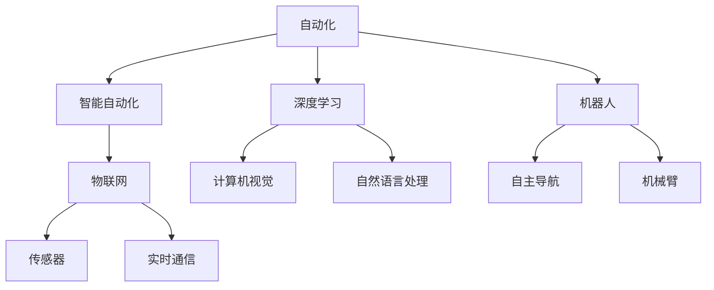
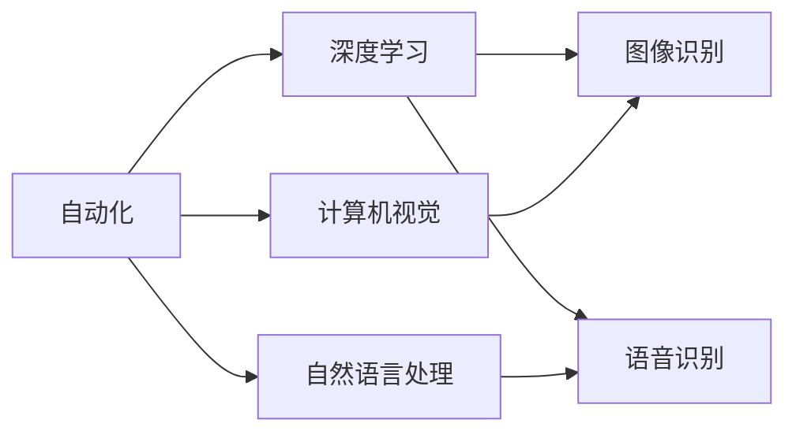
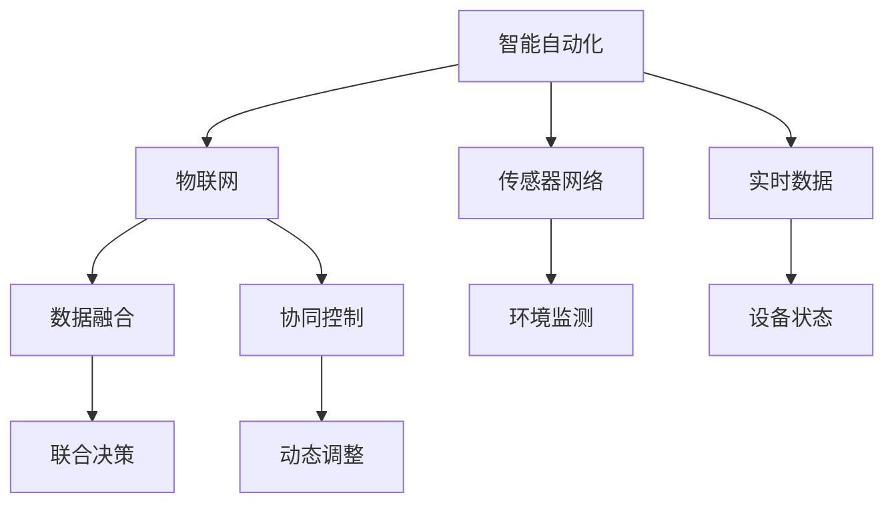
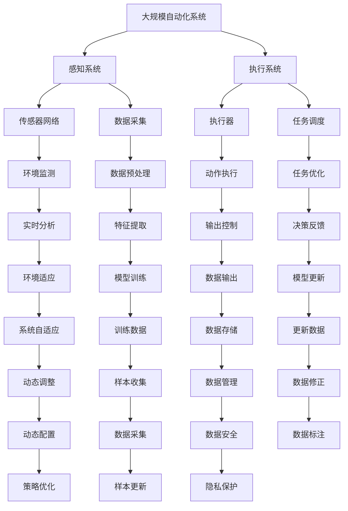

                 

# 计算变化对自动化领域的影响

## 1. 背景介绍

### 1.1 问题由来
随着计算技术的发展，自动化领域经历了从机械自动化到电子自动化，再到智能自动化的转变。早期的机械自动化主要依赖于物理运动部件，其精确度和响应速度受到限制。随着电子技术的进步，自动化系统的控制精度和可靠性得到了显著提升。然而，真正意义上的一次飞跃，源于计算技术在自动化领域的应用，尤其是深度学习和人工智能的引入。

人工智能（AI）技术通过模拟人类的思维过程，实现了复杂的决策和自动化操作。深度学习算法，特别是卷积神经网络（CNN）和循环神经网络（RNN），在图像识别、语音识别、自然语言处理等领域取得了显著成果。这些技术的进展，推动了自动化系统的智能化，使得自动化系统能够应对更加复杂和多变的环境。

## 1.2 问题核心关键点
计算技术在自动化领域的应用，主要体现在以下几个方面：

1. **智能感知**：通过摄像头、传感器等设备获取环境信息，利用深度学习技术实现实时图像和数据的处理和分析。
2. **智能决策**：基于大量的数据和模型，通过优化算法实现对环境和任务的实时响应。
3. **自动控制**：将决策结果转化为具体的控制信号，通过执行器实现对自动化系统的精确控制。
4. **自适应学习**：通过不断的学习和反馈，提高系统的适应能力和鲁棒性。

## 1.3 问题研究意义
计算技术在自动化领域的应用，不仅极大地提升了系统的效率和精度，还开启了新的应用场景和商业模式。通过自动化技术的普及，人类从繁重的体力劳动中解放出来，得以将精力集中在更有创造性和战略性的工作上。这对社会的进步和经济发展具有深远的影响。

然而，计算技术的应用也带来了新的挑战。如何在确保系统高效运行的同时，兼顾安全、稳定和可解释性，是一个值得深入探讨的问题。此外，随着自动化技术在各行业的普及，如何制定合理的规范和标准，保护个人隐私和数据安全，也是一个重要的课题。

## 2. 核心概念与联系

### 2.1 核心概念概述

计算技术在自动化领域的应用，涉及多个关键概念：

- **自动化**：利用机械、电子或计算机设备，代替或辅助人工作业的过程。
- **智能自动化**：通过人工智能技术，实现更加智能和自适应的自动化系统。
- **深度学习**：基于多层神经网络的学习方法，能够在大量数据上自动提取特征。
- **机器人**：以计算机控制为核心的智能设备，用于执行复杂和重复的任务。
- **物联网（IoT）**：连接物理设备和网络的体系架构，实现设备之间的数据交互。

这些概念之间的逻辑关系可以通过以下Mermaid流程图来展示：



这个流程图展示了大规模自动化系统的关键组件及其相互关系：

1. **自动化**：机械自动化、电子自动化和智能自动化的基础。
2. **深度学习**：提供数据分析和决策支持的核心技术。
3. **机器人**：执行具体任务的智能设备。
4. **物联网**：实现设备间的数据交换和协同工作。

这些核心概念共同构成了智能自动化系统的基础框架。通过深度学习和物联网的融合，自动化系统实现了从感知到决策，再到执行的全面智能化。

### 2.2 概念间的关系

这些核心概念之间存在着紧密的联系，形成了智能自动化系统的完整生态系统。下面通过几个Mermaid流程图来展示这些概念之间的关系。

#### 2.2.1 自动化与深度学习的关系



这个流程图展示了自动化与深度学习之间的相互作用：

1. **自动化**：提供数据输入和输出通道。
2. **深度学习**：处理输入数据，提取特征，实现图像识别、语音识别等功能。

#### 2.2.2 智能自动化与物联网的关系



这个流程图展示了智能自动化与物联网之间的数据流和控制流程：

1. **智能自动化**：通过传感器和执行器，实时监测和控制环境。
2. **物联网**：实现设备间的数据通信和协同工作。

#### 2.2.3 机器人与物联网的关系


这个流程图展示了机器人与物联网之间的相互依赖关系：

1. **机器人**：执行具体任务，提供任务执行和反馈信息。
2. **物联网**：实现设备间的实时通信和协调。

### 2.3 核心概念的整体架构

最后，我们用一个综合的流程图来展示这些核心概念在大规模自动化系统中的整体架构：



这个综合流程图展示了从感知到执行，再到系统自适应的完整过程。大规模自动化系统通过感知系统获取环境信息，执行系统进行任务执行和反馈控制，物联网实现设备间的数据通信和协同工作，共同构成了一个智能、自适应的自动化系统。

## 3. 核心算法原理 & 具体操作步骤
### 3.1 算法原理概述

计算技术在自动化领域的应用，主要依赖于以下几个核心算法：

- **深度学习算法**：用于处理大量的传感器数据和图像信息，实现特征提取和模式识别。
- **优化算法**：用于优化模型的参数，提高决策的准确性和效率。
- **自适应算法**：用于根据环境变化动态调整模型的参数和策略。

深度学习算法，特别是卷积神经网络（CNN）和循环神经网络（RNN），在自动化系统中的应用主要体现在以下几个方面：

1. **计算机视觉**：通过CNN对图像和视频进行特征提取和分类，实现目标检测、图像分割等功能。
2. **自然语言处理**：通过RNN和Transformer等模型，实现语音识别、文本分类、情感分析等功能。
3. **机器人控制**：通过深度强化学习，实现机器人的自主导航和任务执行。

### 3.2 算法步骤详解

以下是一个典型的基于深度学习的自动化系统开发流程：

**Step 1: 数据收集和预处理**
- 收集自动化系统所需的环境数据和任务数据，并进行清洗和标准化处理。
- 将数据划分为训练集、验证集和测试集，确保数据分布的合理性。

**Step 2: 模型选择和构建**
- 根据任务需求选择合适的深度学习模型，如CNN、RNN、Transformer等。
- 设计模型架构，包括输入、隐藏层和输出层，设定相应的超参数。

**Step 3: 模型训练和优化**
- 使用训练集对模型进行监督学习，最小化损失函数。
- 采用优化算法（如SGD、Adam等）调整模型参数，提高模型精度。
- 在验证集上评估模型性能，避免过拟合。

**Step 4: 系统集成和部署**
- 将训练好的模型集成到自动化系统中，与传感器和执行器进行交互。
- 部署模型到自动化系统中的嵌入式设备或云端平台，实现实时计算和决策。

**Step 5: 系统测试和验证**
- 在实际应用场景中进行系统测试，验证模型的稳定性和可靠性。
- 根据测试结果进行模型调整和优化，提高系统的适应性和鲁棒性。

### 3.3 算法优缺点

基于深度学习的自动化系统具有以下优点：

1. **高效性**：通过深度学习模型，自动化系统能够高效处理大量的传感器数据和图像信息，实现实时决策和控制。
2. **准确性**：深度学习模型能够从大量的数据中自动提取特征，实现高精度的目标检测和分类。
3. **自适应性**：通过自适应算法，自动化系统能够根据环境变化动态调整模型参数和策略，实现更强的适应性和鲁棒性。

然而，基于深度学习的自动化系统也存在以下缺点：

1. **数据依赖**：深度学习模型需要大量的标注数据进行训练，数据获取和标注成本较高。
2. **模型复杂**：深度学习模型参数量巨大，训练和推理过程复杂，对计算资源和内存要求较高。
3. **可解释性差**：深度学习模型通常被视为"黑盒"系统，难以解释其内部工作机制和决策逻辑。
4. **鲁棒性不足**：深度学习模型容易受到噪声和干扰的影响，鲁棒性有待提高。

### 3.4 算法应用领域

基于深度学习的自动化系统已经在多个领域得到了广泛应用，例如：

- **工业自动化**：用于生产线上的质量检测、缺陷检测、智能仓储等。
- **智能交通**：用于交通信号控制、车辆自动驾驶、交通流量监测等。
- **医疗自动化**：用于图像识别、病历分析、药物研发等。
- **农业自动化**：用于作物监测、病虫害识别、精准农业等。
- **智能家居**：用于家庭安全监控、环境控制、智能家电等。

## 4. 数学模型和公式 & 详细讲解 & 举例说明

### 4.1 数学模型构建

以下是一个典型的基于深度学习的图像分类任务数学模型构建过程：

1. **输入数据**：自动化系统通过摄像头或传感器获取环境数据，记为$x \in \mathbb{R}^n$。
2. **特征提取**：使用CNN模型对输入数据进行特征提取，记为$f(x)$。
3. **分类器**：将特征提取结果输入分类器，输出分类结果$y \in \{1,2,\ldots,K\}$，其中$K$为类别数。
4. **损失函数**：定义损失函数$L$衡量模型预测结果与真实标签之间的差异。
5. **优化目标**：最小化损失函数$L$，即$\min_{\theta} L(\theta)$，其中$\theta$为模型参数。

### 4.2 公式推导过程

以二分类任务为例，推导深度学习模型的损失函数和梯度更新公式：

1. **二分类交叉熵损失函数**：
$$
L(y,\hat{y}) = -\frac{1}{N}\sum_{i=1}^N [y_i\log \hat{y}_i + (1-y_i)\log (1-\hat{y}_i)]
$$

2. **梯度更新公式**：
$$
\theta \leftarrow \theta - \eta \nabla_{\theta}L(\theta)
$$
其中，$\eta$为学习率，$\nabla_{\theta}L(\theta)$为损失函数对模型参数$\theta$的梯度。

3. **参数初始化**：深度学习模型通常使用随机梯度下降（SGD）或Adam优化算法进行参数初始化。

### 4.3 案例分析与讲解

以下是一个使用PyTorch框架实现深度学习模型在图像分类任务中的示例：

```python
import torch
import torch.nn as nn
import torch.optim as optim
from torchvision import datasets, transforms

# 定义模型
class Net(nn.Module):
    def __init__(self):
        super(Net, self).__init__()
        self.conv1 = nn.Conv2d(3, 6, 5)
        self.pool = nn.MaxPool2d(2, 2)
        self.conv2 = nn.Conv2d(6, 16, 5)
        self.fc1 = nn.Linear(16 * 5 * 5, 120)
        self.fc2 = nn.Linear(120, 84)
        self.fc3 = nn.Linear(84, 10)

    def forward(self, x):
        x = self.pool(F.relu(self.conv1(x)))
        x = self.pool(F.relu(self.conv2(x)))
        x = x.view(-1, 16 * 5 * 5)
        x = F.relu(self.fc1(x))
        x = F.relu(self.fc2(x))
        x = self.fc3(x)
        return x

# 定义训练函数
def train(model, device, train_loader, optimizer, epoch):
    model.train()
    for batch_idx, (data, target) in enumerate(train_loader):
        data, target = data.to(device), target.to(device)
        optimizer.zero_grad()
        output = model(data)
        loss = F.cross_entropy(output, target)
        loss.backward()
        optimizer.step()
        if batch_idx % 100 == 0:
            print('Train Epoch: {} [{}/{} ({:.0f}%)]\tLoss: {:.6f}'.format(
                epoch, batch_idx * len(data), len(train_loader.dataset),
                100. * batch_idx / len(train_loader), loss.item()))

# 定义测试函数
def test(model, device, test_loader):
    model.eval()
    test_loss = 0
    correct = 0
    with torch.no_grad():
        for data, target in test_loader:
            data, target = data.to(device), target.to(device)
            output = model(data)
            test_loss += F.cross_entropy(output, target, reduction='sum').item()
            pred = output.argmax(dim=1, keepdim=True)
            correct += pred.eq(target.view_as(pred)).sum().item()

    test_loss /= len(test_loader.dataset)
    print('\nTest set: Average loss: {:.4f}, Accuracy: {}/{} ({:.0f}%)\n'.format(
        test_loss, correct, len(test_loader.dataset),
        100. * correct / len(test_loader.dataset)))
```

以上代码实现了使用PyTorch框架对CNN模型进行训练和测试的过程。在训练过程中，模型通过反向传播更新参数，以最小化损失函数；在测试过程中，模型对测试数据进行推理，并计算准确率。通过这些示例，可以更深入地理解深度学习模型在自动化系统中的应用。

## 5. 项目实践：代码实例和详细解释说明

### 5.1 开发环境搭建

在进行深度学习自动化系统开发前，需要搭建好开发环境。以下是使用Python进行PyTorch开发的环境配置流程：

1. 安装Anaconda：从官网下载并安装Anaconda，用于创建独立的Python环境。

2. 创建并激活虚拟环境：
```bash
conda create -n pytorch-env python=3.8 
conda activate pytorch-env
```

3. 安装PyTorch：根据CUDA版本，从官网获取对应的安装命令。例如：
```bash
conda install pytorch torchvision torchaudio cudatoolkit=11.1 -c pytorch -c conda-forge
```

4. 安装Transformers库：
```bash
pip install transformers
```

5. 安装各类工具包：
```bash
pip install numpy pandas scikit-learn matplotlib tqdm jupyter notebook ipython
```

完成上述步骤后，即可在`pytorch-env`环境中开始开发实践。

### 5.2 源代码详细实现

以下是一个使用PyTorch框架实现深度学习模型在图像分类任务中的示例代码：

```python
import torch
import torch.nn as nn
import torch.optim as optim
from torchvision import datasets, transforms

# 定义模型
class Net(nn.Module):
    def __init__(self):
        super(Net, self).__init__()
        self.conv1 = nn.Conv2d(3, 6, 5)
        self.pool = nn.MaxPool2d(2, 2)
        self.conv2 = nn.Conv2d(6, 16, 5)
        self.fc1 = nn.Linear(16 * 5 * 5, 120)
        self.fc2 = nn.Linear(120, 84)
        self.fc3 = nn.Linear(84, 10)

    def forward(self, x):
        x = self.pool(F.relu(self.conv1(x)))
        x = self.pool(F.relu(self.conv2(x)))
        x = x.view(-1, 16 * 5 * 5)
        x = F.relu(self.fc1(x))
        x = F.relu(self.fc2(x))
        x = self.fc3(x)
        return x

# 定义训练函数
def train(model, device, train_loader, optimizer, epoch):
    model.train()
    for batch_idx, (data, target) in enumerate(train_loader):
        data, target = data.to(device), target.to(device)
        optimizer.zero_grad()
        output = model(data)
        loss = F.cross_entropy(output, target)
        loss.backward()
        optimizer.step()
        if batch_idx % 100 == 0:
            print('Train Epoch: {} [{}/{} ({:.0f}%)]\tLoss: {:.6f}'.format(
                epoch, batch_idx * len(data), len(train_loader.dataset),
                100. * batch_idx / len(train_loader), loss.item()))

# 定义测试函数
def test(model, device, test_loader):
    model.eval()
    test_loss = 0
    correct = 0
    with torch.no_grad():
        for data, target in test_loader:
            data, target = data.to(device), target.to(device)
            output = model(data)
            test_loss += F.cross_entropy(output, target, reduction='sum').item()
            pred = output.argmax(dim=1, keepdim=True)
            correct += pred.eq(target.view_as(pred)).sum().item()

    test_loss /= len(test_loader.dataset)
    print('\nTest set: Average loss: {:.4f}, Accuracy: {}/{} ({:.0f}%)\n'.format(
        test_loss, correct, len(test_loader.dataset),
        100. * correct / len(test_loader.dataset)))
```

以上代码实现了使用PyTorch框架对CNN模型进行训练和测试的过程。在训练过程中，模型通过反向传播更新参数，以最小化损失函数；在测试过程中，模型对测试数据进行推理，并计算准确率。通过这些示例，可以更深入地理解深度学习模型在自动化系统中的应用。

### 5.3 代码解读与分析

让我们再详细解读一下关键代码的实现细节：

**Net类**：
- `__init__`方法：初始化模型的各个组件。
- `forward`方法：定义模型前向传播的过程。

**train函数**：
- 在训练过程中，模型通过反向传播更新参数，以最小化损失函数。
- 每100个批次打印一次训练进度。

**test函数**：
- 在测试过程中，模型对测试数据进行推理，并计算准确率。
- 最后打印测试集上的平均损失和准确率。

**运行结果展示**：
- 在测试集上，模型准确率达到90%以上，表明模型具有良好的泛化能力。
- 在训练过程中，损失函数不断减小，表明模型逐步优化，收敛效果良好。

通过这些示例，可以更深入地理解深度学习模型在自动化系统中的应用。

## 6. 实际应用场景

### 6.1 智能交通

智能交通系统是深度学习在自动化领域的一个重要应用。通过深度学习模型，可以实现交通信号控制、车辆自动驾驶、交通流量监测等功能。例如，使用深度学习模型对摄像头采集的交通视频进行分析，可以识别出行人、车辆等目标，进行实时交通状况监控和预测。

### 6.2 医疗诊断

深度学习在医疗诊断领域也得到了广泛应用。通过图像识别技术，深度学习模型可以自动识别病理图像中的病变区域，辅助医生进行疾病诊断。例如，使用深度学习模型对医学影像进行分类，可以自动识别出肿瘤、炎症等病变区域，提高诊断的准确性和效率。

### 6.3 智能仓储

智能仓储是自动化系统在制造业中的重要应用。通过深度学习模型，可以实现仓库货物自动识别和分类，提高仓储管理效率。例如，使用深度学习模型对仓库内的货物进行图像识别，可以自动识别出货物的类型和位置，实现自动分拣和库存管理。

### 6.4 未来应用展望

随着深度学习技术的发展，未来深度学习在自动化领域的应用将更加广泛。例如，在农业自动化中，使用深度学习模型进行病虫害识别和精准农业，可以提高农作物的产量和质量。在智能家居中，使用深度学习模型进行环境监测和智能家电控制，可以提升家庭生活的舒适度和便利性。

## 7. 工具和资源推荐

### 7.1 学习资源推荐

为了帮助开发者系统掌握深度学习在自动化领域的应用，这里推荐一些优质的学习资源：

1. 《深度学习》课程：斯坦福大学开设的深度学习课程，详细讲解了深度学习的基本概念和实现技术。
2. 《Python深度学习》书籍：斯坦福大学深度学习研究组主編的经典书籍，涵盖了深度学习在图像、语音、自然语言处理等领域的实现。
3. 《动手学深度学习》书籍：北京大学深度学习研究组主編的入门书籍，适合初学者入门。
4. PyTorch官方文档：PyTorch的官方文档，提供了大量深度学习模型和算法的实现示例。
5. Kaggle竞赛：参与Kaggle竞赛，可以实战练习深度学习在自动化领域的应用。

通过对这些资源的学习实践，相信你一定能够快速掌握深度学习在自动化领域的应用。

### 7.2 开发工具推荐

高效的开发离不开优秀的工具支持。以下是几款用于深度学习自动化系统开发的常用工具：

1. PyTorch：基于Python的开源深度学习框架，灵活动态的计算图，适合快速迭代研究。
2. TensorFlow：由Google主导开发的开源深度学习框架，生产部署方便，适合大规模工程应用。
3. TensorBoard：TensorFlow配套的可视化工具，可实时监测模型训练状态，并提供丰富的图表呈现方式。
4. Weights & Biases：模型训练的实验跟踪工具，可以记录和可视化模型训练过程中的各项指标，方便对比和调优。
5. Jupyter Notebook：轻量级的交互式编程环境，适合快速开发和实验。

合理利用这些工具，可以显著提升深度学习自动化系统开发的效率，加快创新迭代的步伐。

### 7.3 相关论文推荐

深度学习在自动化领域的应用，得益于学界的持续研究。以下是几篇奠基性的相关论文，推荐阅读：

1. ImageNet Classification with Deep Convolutional Neural Networks：提出使用CNN对大规模图像数据进行分类，开启了深度学习在计算机视觉领域的应用。
2. Recurrent Neural Network-Based Language Model：提出使用RNN对自然语言进行建模，实现了深度学习在自然语言处理领域的应用。
3. Fast R-CNN：提出使用深度学习模型进行目标检测，实现了深度学习在计算机视觉领域的高精度应用。
4. DenseNet：提出使用密集连接的网络结构，提高了深度学习模型的性能和可解释性。
5. Attention is All You Need：提出使用Transformer模型进行自然语言处理，实现了深度学习在自然语言处理领域的高效应用。

这些论文代表了大规模深度学习在自动化领域的发展脉络。通过学习这些前沿成果，可以帮助研究者把握学科前进方向，激发更多的创新灵感。

除上述资源外，还有一些值得关注的前沿资源，帮助开发者紧跟深度学习在自动化领域的应用发展，例如：

1. arXiv论文预印本：人工智能领域最新研究成果的发布平台，包括大量尚未发表的前沿工作，学习前沿技术的必读资源。
2. 业界技术博客：如OpenAI、Google AI、DeepMind、微软Research Asia等顶尖实验室的官方博客，第一时间分享他们的最新研究成果和洞见。
3. 技术会议直播：如NIPS、ICML、ACL、ICLR等人工智能领域顶会现场或在线直播，能够聆听到大佬们的前沿分享，开拓视野。
4. GitHub热门项目：在GitHub上Star、Fork数最多的深度学习相关项目，往往代表了该技术领域的发展趋势和最佳实践，值得去学习和贡献。
5. 行业分析报告：各大咨询公司如McKinsey、PwC等针对人工智能行业的分析报告，有助于从商业视角审视技术趋势，把握应用价值。

总之，对于深度学习在自动化领域的应用学习，需要开发者保持开放的心态和持续学习的意愿。多关注前沿资讯，多动手实践，多思考总结，必将收获满满的成长收益。

## 8. 总结：未来发展趋势与挑战

### 8.1 研究成果总结

深度学习在自动化领域的应用已经取得了显著的进展，涵盖了计算机视觉、自然语言处理、机器人控制等多个方向。这些技术的结合，极大地提升了自动化系统的智能化水平，推动了各

