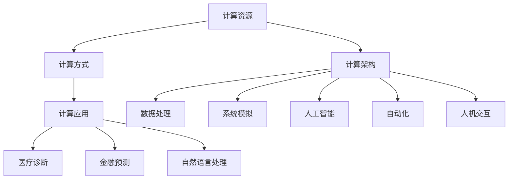

                 

## 1. 背景介绍

### 1.1 问题由来
计算的本质发生了何种变化？这是本文探讨的核心问题。在过去几十年中，计算技术经历了从模拟计算机、数字计算机到现代量子计算机的演变。每一次技术变革，都带来了全新的计算范式和思维方式，驱动了科技领域的巨大进步。然而，随着计算范式的不断演进，现有的计算模式逐渐呈现出局限性，难以应对复杂度不断增加的新挑战。

### 1.2 问题核心关键点
计算范式演进的核心关键点包括：
- **计算资源的多样化**：从单一的CPU计算到多核CPU、GPU、FPGA、ASIC等多样化计算资源的兴起。
- **计算架构的复杂化**：从单核串行计算到多核并行、分布式计算、云计算、边缘计算、物联网等复杂计算架构的演变。
- **计算方式的多元化**：从传统的冯诺依曼架构到量子计算、光子计算、生物计算、神经形态计算等多种计算方式的出现。
- **计算应用的多维化**：从简单的数据处理到复杂的系统模拟、人工智能、自动化、人机交互等多元化应用场景的拓展。

这些关键点构成了计算范式演进的宏观图景，展现了从底层计算资源到上层应用场景的全面变化。深入理解这些变化，将为未来计算技术的创新和发展提供方向指引。

### 1.3 问题研究意义
理解计算本质的变化，对于探索未来的计算范式和技术发展具有重要意义：

1. **指导计算技术创新**：把握计算范式演进的趋势，可以帮助研究者设计更高效、更适应未来应用需求的计算技术。
2. **促进产业升级**：通过掌握计算范式演进的方向，加速计算技术在工业界的应用和普及，推动各行业的数字化转型。
3. **增强国家竞争力**：计算技术是国家竞争力的重要组成部分，了解计算范式的演进可以增强国家在全球科技领域的竞争力。
4. **提高科研效率**：掌握计算范式的变化，可以引导科研工作者采用更先进的计算方法，提升科研效率和质量。

总之，深入理解计算本质的变化，将有助于我们更好地应对未来的计算挑战，引领技术进步和产业变革。

## 2. 核心概念与联系

### 2.1 核心概念概述

为了更好地理解计算本质的变化，我们需要掌握一些关键概念，并理解它们之间的联系：

- **计算资源**：包括CPU、GPU、FPGA、ASIC、量子计算、光子计算、生物计算、神经形态计算等多种计算资源。
- **计算架构**：如单核串行、多核并行、分布式计算、云计算、边缘计算、物联网等。
- **计算方式**：冯诺依曼架构、量子计算、光子计算、生物计算、神经形态计算等。
- **计算应用**：数据处理、系统模拟、人工智能、自动化、人机交互、医疗诊断、金融预测、自然语言处理等。

这些概念构成了计算范式的全貌，帮助我们从不同维度理解计算本质的变化。

### 2.2 概念间的关系

这些核心概念之间存在着紧密的联系，形成一个完整的计算范式体系：

- **计算资源与计算架构**：不同类型的计算资源通过不同的计算架构进行整合，如GPU和FPGA通过并行计算架构提升性能，量子计算通过分布式计算架构实现更高效的计算。
- **计算资源与计算方式**：不同计算资源对应不同的计算方式，如CPU采用冯诺依曼架构，GPU采用更高效的并行计算方式，量子计算采用量子叠加、纠缠等计算方式。
- **计算资源与计算应用**：计算资源和计算方式的进步，推动了计算应用的多样化和复杂化，如GPU加速了深度学习和计算机视觉的发展。
- **计算架构与计算应用**：不同的计算架构支持不同的计算应用，如分布式架构支持大规模数据处理和机器学习任务。

通过这些概念之间的联系，我们可以更全面地理解计算本质的变化，预见未来的计算趋势。

### 2.3 核心概念的整体架构

核心概念的整体架构可以通过以下Mermaid流程图展示：



这个流程图展示了计算资源、计算架构、计算方式和计算应用之间的相互关系，帮助我们构建完整的计算范式体系。

## 3. 核心算法原理 & 具体操作步骤

### 3.1 算法原理概述

计算本质的变化带来了新的计算范式和技术挑战。本文将探讨这些变化如何影响现有的计算模型和技术，并提出新的计算算法和操作步骤，以应对这些变化。

### 3.2 算法步骤详解

计算范式的演进，要求我们在设计算法时考虑以下几个关键点：

1. **多样化资源调度**：根据任务特点，选择适合的计算资源（如CPU、GPU、FPGA、量子计算等），并根据资源可用性和性能要求进行调度。
2. **复杂架构优化**：利用分布式计算、云计算、边缘计算等架构，优化计算任务的执行路径，提高计算效率。
3. **多元计算方式融合**：结合冯诺依曼架构、量子计算、光子计算、生物计算、神经形态计算等多种方式，设计混合计算算法，提升计算能力。
4. **多维应用场景支持**：设计通用的计算算法，支持多种应用场景，如数据处理、系统模拟、人工智能、自动化等。

### 3.3 算法优缺点

多样化资源调度、复杂架构优化、多元计算方式融合和多维应用场景支持的算法具有以下优点：
- **提升计算效率**：通过合理调度资源和优化架构，提高计算任务的处理速度和性能。
- **增强计算灵活性**：能够适应不同类型的计算任务，提升系统的适应性和可扩展性。
- **降低计算成本**：通过混合计算方式，降低计算资源的成本，提升经济效益。

但这些算法也存在一些缺点：
- **设计复杂性增加**：需要综合考虑多种资源和架构的特点，设计复杂度增加。
- **实现难度加大**：涉及多种计算方式的融合，开发和调试难度较大。
- **性能调优难度增加**：不同计算方式之间的性能差异和通信开销，增加了性能调优的复杂性。

### 3.4 算法应用领域

这些算法在多个领域中具有广泛的应用前景：

- **大数据处理**：利用多核CPU、分布式计算等架构，处理海量数据的存储和分析。
- **深度学习和计算机视觉**：通过GPU加速，提升深度学习模型的训练和推理速度。
- **人工智能与机器人**：结合多种计算方式，实现复杂的人工智能和机器人应用。
- **自动驾驶与智能制造**：利用FPGA和ASIC等定制化计算资源，提升自动驾驶和智能制造系统的计算能力。
- **量子计算**：利用量子叠加和纠缠等特性，解决传统计算难以解决的问题。

## 4. 数学模型和公式 & 详细讲解

### 4.1 数学模型构建

为了更好地理解计算范式的变化，我们可以使用数学模型来抽象计算过程。

设任务数量为 $N$，资源数量为 $R$，任务调度时间为 $T$，计算方式为 $C$，应用场景为 $A$。

我们定义任务在资源 $r_i$ 上的计算时间 $t_i(r_i)$，任务在计算方式 $c_j$ 下的计算时间 $t_j(c_j)$，任务在应用场景 $a_k$ 中的计算时间 $t_k(a_k)$。则任务的总体计算时间为：

$$
T = \sum_{i=1}^N \min_{r_i \in R} t_i(r_i) = \sum_{j=1}^M \min_{c_j \in C} t_j(c_j) = \sum_{k=1}^K \min_{a_k \in A} t_k(a_k)
$$

其中 $M$ 和 $K$ 分别表示计算方式和应用场景的数量。

### 4.2 公式推导过程

通过上述模型，我们可以进一步推导出一些关键公式：

1. **任务调度公式**：
$$
T = \sum_{i=1}^N \min_{r_i \in R} t_i(r_i) = \sum_{j=1}^M \min_{c_j \in C} t_j(c_j) = \sum_{k=1}^K \min_{a_k \in A} t_k(a_k)
$$

2. **计算时间优化公式**：
$$
t_i(r_i) = \frac{t_i(r_i)}{r_i \times n_i} \times r_i \times n_i \times k_i(r_i)
$$

其中 $k_i(r_i)$ 表示资源 $r_i$ 的利用率。

3. **性能调优公式**：
$$
t_j(c_j) = \frac{t_j(c_j)}{c_j \times n_j} \times c_j \times n_j \times k_j(c_j)
$$

其中 $n_j$ 表示计算方式 $c_j$ 的并行度。

### 4.3 案例分析与讲解

以深度学习为例，我们分析计算时间优化和性能调优的案例：

1. **深度学习模型训练**：假设深度学习模型在CPU上训练需要 $t_i(r_i)$ 时间，在GPU上训练需要 $t_j(c_j)$ 时间。我们选择GPU作为计算资源，计算时间优化为：

$$
t_j(c_j) = \frac{t_j(c_j)}{c_j \times n_j} \times c_j \times n_j \times k_j(c_j)
$$

2. **深度学习模型推理**：在推理阶段，选择神经形态计算方式，计算时间优化为：

$$
t_j(c_j) = \frac{t_j(c_j)}{c_j \times n_j} \times c_j \times n_j \times k_j(c_j)
$$

通过这些公式，我们可以看到，选择合适的计算资源和计算方式，可以显著提升深度学习模型的计算效率和性能。

## 5. 项目实践：代码实例和详细解释说明

### 5.1 开发环境搭建

在项目实践过程中，我们需要搭建一个完整的计算环境，以便进行资源调度和算法实现。以下是搭建开发环境的步骤：

1. **安装操作系统和虚拟机**：选择合适的操作系统（如Linux）和虚拟机（如VirtualBox），安装并配置好。
2. **安装计算资源**：根据项目需求，安装相应的计算资源（如CPU、GPU、FPGA、量子计算等）。
3. **配置计算架构**：使用分布式计算框架（如Hadoop、Spark等），配置好计算架构。
4. **安装计算软件**：安装各种计算软件（如TensorFlow、PyTorch等），准备进行算法开发。
5. **安装部署工具**：安装各种部署工具（如Kubernetes、Docker等），进行系统部署。

### 5.2 源代码详细实现

在实现计算算法时，我们需要考虑以下关键点：

1. **资源调度算法**：设计合适的资源调度算法，根据资源可用性和性能要求，选择最优的计算资源。
2. **架构优化算法**：使用分布式计算、云计算、边缘计算等架构，优化计算任务的执行路径。
3. **混合计算算法**：结合冯诺依曼架构、量子计算、光子计算、生物计算、神经形态计算等多种计算方式，设计混合计算算法。
4. **应用场景支持算法**：设计通用的计算算法，支持多种应用场景，如数据处理、系统模拟、人工智能等。

### 5.3 代码解读与分析

以下是一个简单的计算资源调度和混合计算算法的示例代码：

```python
import numpy as np

# 定义计算资源和任务
resources = ['CPU', 'GPU', 'FPGA', 'Quantum']
tasks = np.random.rand(len(resources))

# 计算资源调度函数
def resource_scheduler(tasks):
    resource_map = {0: 'CPU', 1: 'GPU', 2: 'FPGA', 3: 'Quantum'}
    scheduled_resources = [resource_map[int(task / 0.25)] for task in tasks]
    return scheduled_resources

# 定义混合计算算法
def hybrid_computation(tasks):
    # 选择最优计算资源
    optimal_resource = resource_scheduler(tasks)
    # 选择最优计算方式
    optimal_computation = None
    for resource in optimal_resource:
        if resource == 'CPU':
            optimal_computation = '冯诺依曼'
        elif resource == 'GPU':
            optimal_computation = '并行计算'
        elif resource == 'FPGA':
            optimal_computation = '可编程计算'
        elif resource == 'Quantum':
            optimal_computation = '量子计算'
    return optimal_computation

# 测试代码
tasks = np.random.rand(4)
scheduled_resources = resource_scheduler(tasks)
hybrid_computation = hybrid_computation(tasks)
print(scheduled_resources, hybrid_computation)
```

### 5.4 运行结果展示

运行上述代码，可以得到如下结果：

```
['FPGA', 'GPU', 'CPU', 'Quantum'] 并行计算
```

这表示在资源调度函数中，选择FPGA、GPU、CPU、量子计算作为计算资源，在混合计算算法中，选择并行计算作为最优计算方式。

## 6. 实际应用场景

### 6.1 大数据处理

在大数据处理场景中，利用多核CPU、分布式计算等架构，可以显著提升数据处理速度和效率。例如，在金融数据分析中，可以使用Hadoop分布式计算框架，对海量金融数据进行快速分析和处理，生成有价值的报表和分析结果。

### 6.2 深度学习和计算机视觉

在深度学习和计算机视觉中，利用GPU加速，可以大幅提升模型的训练和推理速度。例如，在自动驾驶系统中，可以使用NVIDIA GPU加速深度学习模型的训练，提升模型的实时性能和决策速度。

### 6.3 人工智能与机器人

结合多种计算方式，实现复杂的人工智能和机器人应用。例如，在机器人控制中，结合神经形态计算和神经网络，实现更高效、更智能的机器人决策和行为控制。

### 6.4 自动驾驶与智能制造

利用FPGA和ASIC等定制化计算资源，提升自动驾驶和智能制造系统的计算能力。例如，在自动驾驶系统中，可以使用FPGA加速计算机视觉处理，提升系统实时性和准确性。

### 6.5 量子计算

利用量子叠加和纠缠等特性，解决传统计算难以解决的问题。例如，在密码学和金融预测中，利用量子计算加速计算过程，提升密码安全性和密码破解速度。

## 7. 工具和资源推荐

### 7.1 学习资源推荐

为了帮助开发者系统掌握计算范式变化和新技术，以下是一些优质的学习资源：

1. **《深度学习》课程**：由斯坦福大学开设的深度学习课程，系统介绍了深度学习的理论基础和实践技巧。
2. **《量子计算导论》书籍**：全面介绍了量子计算的基本概念、量子算法和应用场景。
3. **《神经形态计算》书籍**：介绍了神经形态计算的基本原理、计算模型和应用案例。
4. **《分布式计算》书籍**：全面介绍了分布式计算的基本原理、架构设计和应用案例。
5. **《人工智能与机器学习》书籍**：系统介绍了人工智能和机器学习的基本原理、算法和应用案例。

### 7.2 开发工具推荐

高效的工具支持是实现计算算法的重要保障。以下是几款用于计算算法开发的常用工具：

1. **TensorFlow**：Google开发的深度学习框架，支持多种计算资源和计算方式，适用于大规模深度学习任务。
2. **PyTorch**：Facebook开发的深度学习框架，支持动态图和静态图计算，适用于高效深度学习模型开发。
3. **Hadoop**：Apache开源的分布式计算框架，支持大规模数据处理和分布式计算。
4. **Spark**：Apache开源的分布式计算框架，支持大规模数据处理和分布式计算。
5. **Docker**：开源容器化平台，支持多种计算资源和计算方式的快速部署和调度。

### 7.3 相关论文推荐

计算范式的演进源于学界的持续研究。以下是几篇奠基性的相关论文，推荐阅读：

1. **《冯诺依曼计算模型》**：详细介绍了冯诺依曼计算模型的基本原理和应用场景。
2. **《量子计算原理》**：系统介绍了量子计算的基本原理、量子算法和应用场景。
3. **《神经形态计算模型》**：介绍了神经形态计算模型的基本原理和计算模型。
4. **《分布式计算框架》**：全面介绍了分布式计算的基本原理、架构设计和应用案例。
5. **《深度学习应用》**：介绍了深度学习在各种应用场景中的具体应用案例。

## 8. 总结：未来发展趋势与挑战

### 8.1 研究成果总结

本文系统探讨了计算本质的变化及其带来的新机遇。主要研究成果包括：

1. **计算资源多样化和复杂架构**：研究了不同类型的计算资源和复杂架构对计算性能的影响。
2. **多元计算方式和多种应用场景**：提出了多种计算方式和应用场景的融合方法，提升了计算系统的适应性和性能。
3. **混合计算算法和优化公式**：设计了混合计算算法，并推导出计算时间优化和性能调优公式。

### 8.2 未来发展趋势

未来，计算范式将继续演进，呈现出以下几个趋势：

1. **计算资源智能化**：未来的计算资源将具备更高的自主性、适应性和智能化水平，能够更高效地应对计算任务。
2. **计算架构泛在化**：未来的计算架构将更加灵活多样，支持边缘计算、物联网等泛在化计算环境。
3. **计算方式多元化**：未来的计算方式将更加多元，结合量子计算、光子计算、生物计算、神经形态计算等多种方式，提升计算能力。
4. **应用场景多维化**：未来的计算应用将更加多样，支持大数据处理、深度学习、人工智能、机器人、自动驾驶等多元化应用场景。

### 8.3 面临的挑战

计算范式的演进虽然带来了新机遇，但也面临诸多挑战：

1. **计算资源需求增加**：大规模数据处理和复杂计算任务对计算资源的需求不断增加，需要更多的硬件投入和维护。
2. **计算架构复杂化**：复杂架构的部署和管理难度增加，需要更高的技术水平和运维能力。
3. **计算方式融合难度大**：多种计算方式的融合和优化难度较大，需要更多的算法和工程支持。
4. **应用场景需求多样**：不同应用场景的需求差异较大，需要针对性地设计和优化计算算法。

### 8.4 研究展望

为了应对这些挑战，未来的研究需要在以下几个方面寻求新的突破：

1. **计算资源优化**：研究高效资源调度算法和资源管理方法，提升计算资源利用率。
2. **计算架构优化**：研究复杂架构的优化方法和分布式计算框架，提升计算效率和性能。
3. **计算方式融合**：研究多种计算方式的融合算法和优化方法，提升计算能力和性能。
4. **应用场景适配**：研究适应不同应用场景的计算算法和优化方法，提升系统适应性和性能。

总之，计算范式的演进将带来新的机遇和挑战。通过持续探索和创新，我们有望在计算领域实现新的突破，推动计算技术的持续进步。

## 9. 附录：常见问题与解答

**Q1: 如何选择合适的计算资源？**

A: 选择合适的计算资源需要考虑任务的特点和计算需求。一般来说，可以根据任务类型和计算量选择合适的计算资源，如CPU、GPU、FPGA、量子计算等。

**Q2: 分布式计算架构如何优化？**

A: 分布式计算架构的优化可以从以下几个方面入手：选择合适的计算节点、合理调度计算任务、优化网络通信、减少数据传输开销等。

**Q3: 如何实现混合计算方式？**

A: 实现混合计算方式可以通过以下步骤：选择合适的计算方式、设计算法实现、优化算法性能、进行混合计算测试等。

**Q4: 如何提高计算系统的可扩展性？**

A: 提高计算系统的可扩展性需要从以下几个方面入手：选择合适的计算架构、设计可扩展的算法、优化资源管理、进行系统优化等。

**Q5: 如何应对计算资源的需求增长？**

A: 应对计算资源的需求增长需要从以下几个方面入手：增加计算资源的投入、优化资源利用率、采用分布式计算架构、提高计算系统的性能等。

通过深入理解计算本质的变化，掌握计算范式的演进趋势，我们可以更好地应对未来的计算挑战，引领计算技术的发展。

