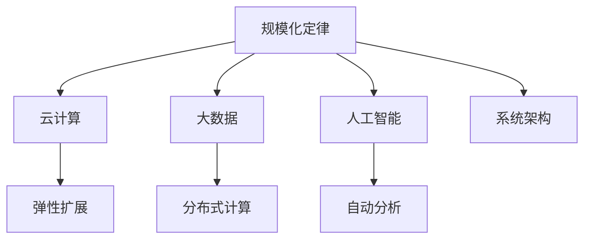
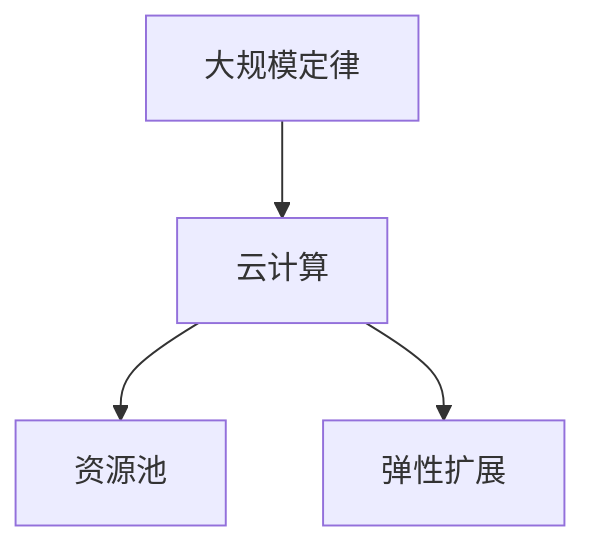
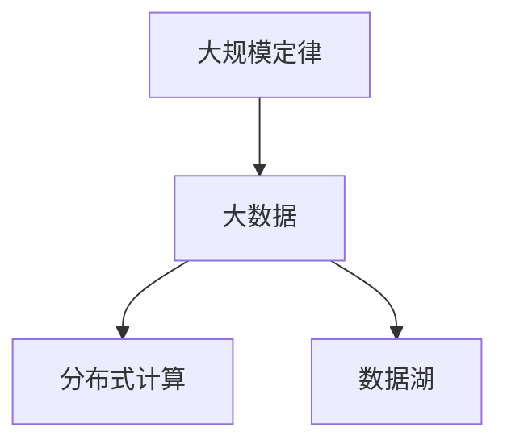
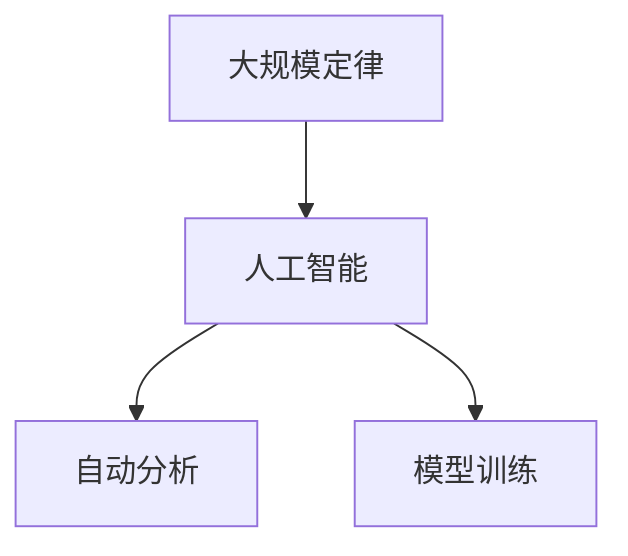
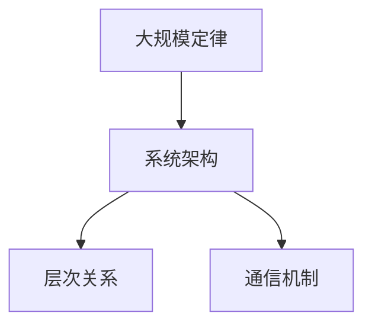
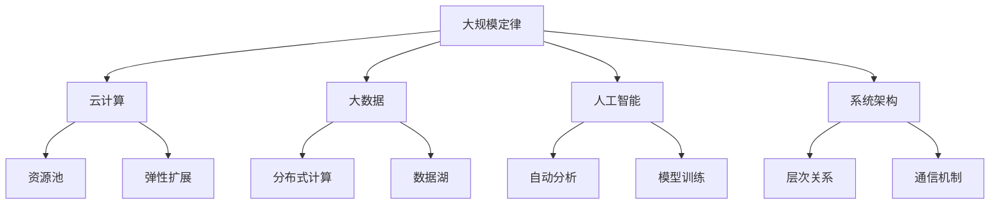

                 

## 1. 背景介绍

### 1.1 问题由来
自1946年计算机诞生以来，信息技术已经深刻改变了世界。今天，我们已经生活在信息爆炸的时代，计算机无处不在，数字化已经成为社会发展的重要驱动力。然而，计算机科学背后，最底层的规律究竟是什么？

### 1.2 问题核心关键点
当我们回顾计算机科学的发展历史时，就会发现，计算机科学的底层规律与生物学和工程学有着惊人的相似之处。其中，**规模化定律**是一个关键的概念，它在大数据、云计算、人工智能等众多领域中得到了广泛应用。

规模化定律指的是，当系统的规模不断增大时，其效率和性能也会呈现出指数级的增长。这一规律在大数据时代尤其明显，它直接推动了云计算和人工智能技术的发展，深刻影响着我们的社会和日常生活。

### 1.3 问题研究意义
深入理解和运用规模化定律，对于计算机科学的研究和应用具有重要意义。它不仅帮助我们更好地设计、优化和部署信息系统，还为云计算、大数据、人工智能等前沿技术的实践提供了理论依据。此外，掌握规模化定律还有助于我们更好地理解计算机系统的工作机制，预测未来技术发展趋势，从而抓住变革的机遇。

## 2. 核心概念与联系

### 2.1 核心概念概述

为了深入理解规模化定律，本节将介绍几个关键概念：

- **规模化定律**：当系统的规模呈指数级增长时，其效率和性能也呈现出指数级增长。这一规律在大数据、云计算、人工智能等领域有广泛应用。
- **云计算**：通过将计算资源和存储资源虚拟化，在互联网中进行资源的分配和共享。云计算实现了资源的按需使用和弹性扩展，极大地提升了系统的可扩展性和可用性。
- **大数据**：指规模巨大、类型繁多、实时性强的数据集合。大数据技术通过分布式计算和存储，处理和分析大规模数据，从而发现隐藏在其中的规律和价值。
- **人工智能**：利用计算机技术模拟人类智能过程，实现对数据的自动分析和决策。人工智能包括机器学习、深度学习、自然语言处理等多个领域。
- **系统架构**：指计算机系统中的组件结构、层次关系、通信机制等。良好的系统架构可以提升系统的可扩展性、可靠性、效率等。

这些核心概念之间的联系可以通过以下Mermaid流程图来展示：



这个流程图展示了大规模定律与其他核心概念之间的联系：

1. 规模化定律是大数据、云计算、人工智能等技术的基础规律。
2. 云计算通过弹性扩展实现了大规模数据的处理和存储。
3. 大数据技术通过分布式计算和存储，提升了对大规模数据的处理能力。
4. 人工智能技术通过自动分析实现了对大数据的深度挖掘和利用。
5. 系统架构通过合理的层次关系和通信机制，确保了系统的可扩展性和可用性。

### 2.2 概念间的关系

这些核心概念之间存在着紧密的联系，形成了现代计算机系统的完整生态系统。下面我们通过几个Mermaid流程图来展示这些概念之间的关系。

#### 2.2.1 大规模定律与云计算的关系



这个流程图展示了规模化定律与云计算之间的关系：

1. 规模化定律是大规模数据处理的基础规律。
2. 云计算通过资源池化和弹性扩展，实现了大规模数据的处理和存储。

#### 2.2.2 大规模定律与大数据的关系



这个流程图展示了规模化定律与大数据之间的关系：

1. 规模化定律是大规模数据处理的基础规律。
2. 大数据通过分布式计算和数据湖，提升了对大规模数据的处理能力。

#### 2.2.3 大规模定律与人工智能的关系



这个流程图展示了规模化定律与人工智能之间的关系：

1. 规模化定律是大规模数据分析的基础规律。
2. 人工智能通过自动分析和模型训练，实现了对大规模数据的深度挖掘和利用。

#### 2.2.4 大规模定律与系统架构的关系



这个流程图展示了规模化定律与系统架构之间的关系：

1. 规模化定律是大规模系统设计的基础规律。
2. 系统架构通过合理的层次关系和通信机制，确保了系统的可扩展性和可用性。

### 2.3 核心概念的整体架构

最后，我们用一个综合的流程图来展示这些核心概念在大数据、云计算、人工智能等领域的整体架构：



这个综合流程图展示了从大规模定律到大数据、云计算、人工智能等技术的应用路径，以及系统架构的构建过程。通过这些核心概念，我们可以更清晰地理解现代计算机系统的设计原则和技术方法。

## 3. 核心算法原理 & 具体操作步骤

### 3.1 算法原理概述

规模化定律在计算机科学中有着广泛的应用，它不仅在数据处理、云计算、人工智能等技术中得到体现，也在系统设计、网络通信等多个领域中有所体现。以下是规模化定律在几个关键领域中的原理概述：

#### 3.1.1 大数据处理

在大数据时代，规模化定律主要体现在数据处理的速度和效率上。通过分布式计算和存储，大数据技术可以处理海量数据，从而发现隐藏在大数据中的规律和价值。分布式计算的关键在于：

- **数据分片**：将大规模数据分成若干小块，分配到不同的计算节点上进行处理。
- **并行计算**：在多个计算节点上同时执行数据处理任务，加快数据处理速度。
- **结果合并**：将各个计算节点处理的结果进行合并，得到最终的处理结果。

#### 3.1.2 云计算

云计算通过规模化定律实现了资源的按需使用和弹性扩展。云计算的关键在于：

- **资源池化**：将物理资源虚拟化，形成资源池，根据需求动态分配和调度。
- **弹性扩展**：根据负载变化，动态调整计算和存储资源，确保系统的高可用性和高扩展性。
- **服务化部署**：将计算和存储服务封装成标准化的接口，便于用户按需使用。

#### 3.1.3 系统架构

系统架构的设计也遵循规模化定律。良好的系统架构可以提升系统的可扩展性、可靠性和效率。系统架构的关键在于：

- **层次设计**：将系统分层，每一层负责特定的功能，提升系统的可维护性和可扩展性。
- **通信机制**：采用高效的网络通信协议，确保数据传输的可靠性和高效性。
- **故障容忍**：设计冗余和容错机制，确保系统在故障情况下仍能正常运行。

### 3.2 算法步骤详解

下面是几个典型场景中的算法步骤详解：

#### 3.2.1 大数据处理算法步骤

1. **数据分片**：将大规模数据分成若干小块，分配到不同的计算节点上进行处理。
2. **并行计算**：在多个计算节点上同时执行数据处理任务，加快数据处理速度。
3. **结果合并**：将各个计算节点处理的结果进行合并，得到最终的处理结果。

#### 3.2.2 云计算算法步骤

1. **资源池化**：将物理资源虚拟化，形成资源池，根据需求动态分配和调度。
2. **弹性扩展**：根据负载变化，动态调整计算和存储资源，确保系统的高可用性和高扩展性。
3. **服务化部署**：将计算和存储服务封装成标准化的接口，便于用户按需使用。

#### 3.2.3 系统架构算法步骤

1. **层次设计**：将系统分层，每一层负责特定的功能，提升系统的可维护性和可扩展性。
2. **通信机制**：采用高效的网络通信协议，确保数据传输的可靠性和高效性。
3. **故障容忍**：设计冗余和容错机制，确保系统在故障情况下仍能正常运行。

### 3.3 算法优缺点

规模化定律在大数据、云计算、人工智能等领域具有以下优缺点：

#### 3.3.1 优点

1. **提升处理能力**：通过分布式计算和存储，大规模定律可以处理海量数据，提升数据处理速度和效率。
2. **灵活扩展**：云计算和系统架构的弹性扩展机制，可以实现系统的按需使用和动态调整。
3. **提升可用性**：云计算和服务化部署机制，提高了系统的可靠性和可用性。

#### 3.3.2 缺点

1. **资源消耗大**：大规模定律需要大量的计算和存储资源，成本较高。
2. **复杂性高**：分布式计算和系统架构的设计和维护需要较高的技术水平。
3. **安全性问题**：大规模定律涉及大量的数据和计算资源，安全问题需要特别注意。

### 3.4 算法应用领域

规模化定律在以下几个领域得到了广泛应用：

1. **大数据处理**：通过分布式计算和存储，处理大规模数据，发现隐藏在大数据中的规律和价值。
2. **云计算**：通过资源池化和弹性扩展，实现资源的按需使用和动态调整。
3. **人工智能**：通过自动分析和模型训练，实现对大规模数据的深度挖掘和利用。
4. **系统架构**：通过层次设计、通信机制和故障容忍，确保系统的可扩展性、可靠性和效率。
5. **网络通信**：通过高效的网络通信协议，提升数据传输的可靠性和高效性。

## 4. 数学模型和公式 & 详细讲解  
### 4.1 数学模型构建

为了更好地理解规模化定律，本节将使用数学语言对规模化定律进行更加严格的刻画。

### 4.2 公式推导过程

以下我们以分布式计算为例，推导其数学模型。

假设有一个大规模数据集，数据集大小为 $n$。使用 $k$ 个计算节点进行分布式计算，每个节点处理的数据量为 $\frac{n}{k}$。设每个节点的计算速度为 $v$，则总的计算时间为 $T = k \times \frac{n}{k} \times \frac{1}{v} = \frac{n}{v}$。

若增加节点数目 $k$，则总计算时间 $T$ 将按比例减少。即：

$$
T' = \frac{n}{kv}
$$

其中，$T'$ 为增加节点后的总计算时间。

可以看到，当节点数目 $k$ 呈指数级增长时，总计算时间 $T'$ 将呈线性级减少。这一规律体现了规模化定律在大数据处理中的应用。

### 4.3 案例分析与讲解

假设有一个社交网络数据集，数据集大小为 $10^{12}$。使用 $100$ 个计算节点进行分布式计算，每个节点处理的数据量为 $10^9$。设每个节点的计算速度为 $1000$ 个数据每秒，则总的计算时间为 $T = \frac{10^{12}}{1000} = 10^8$ 秒。

若增加节点数目 $k$，则总计算时间 $T$ 将按比例减少。即：

$$
T' = \frac{10^{12}}{k \times 1000} = \frac{10^{12}}{10^6k} = \frac{10^6}{k}
$$

当节点数目 $k$ 增加 $10$ 倍时，总计算时间 $T'$ 将减少 $10$ 倍，体现了规模化定律的强大威力。

## 5. 项目实践：代码实例和详细解释说明

### 5.1 开发环境搭建

在进行分布式计算实践前，我们需要准备好开发环境。以下是使用Python进行PyTorch开发的环境配置流程：

1. 安装Anaconda：从官网下载并安装Anaconda，用于创建独立的Python环境。

2. 创建并激活虚拟环境：
```bash
conda create -n pytorch-env python=3.8 
conda activate pytorch-env
```

3. 安装PyTorch：根据CUDA版本，从官网获取对应的安装命令。例如：
```bash
conda install pytorch torchvision torchaudio cudatoolkit=11.1 -c pytorch -c conda-forge
```

4. 安装transformers库：
```bash
pip install transformers
```

5. 安装各类工具包：
```bash
pip install numpy pandas scikit-learn matplotlib tqdm jupyter notebook ipython
```

完成上述步骤后，即可在`pytorch-env`环境中开始分布式计算实践。

### 5.2 源代码详细实现

这里我们以分布式计算为例，给出使用PyTorch和Dask进行分布式计算的Python代码实现。

首先，定义数据集：

```python
import numpy as np

# 定义数据集
n = 10**12
data = np.random.rand(n)
```

然后，使用Dask进行分布式计算：

```python
from dask.distributed import Client
import dask.array as da

# 初始化Dask Client
client = Client('localhost:8786')

# 将数据集分片
dask_data = da.from_array(data, chunks=10**8)

# 并行计算
result = dask_data.mean().compute()

# 关闭Dask Client
client.close()
```

这里使用了Dask分布式计算库，将数据集分片，并在多个计算节点上并行计算。最后，关闭Dask Client以释放资源。

### 5.3 代码解读与分析

让我们再详细解读一下关键代码的实现细节：

**数据集定义**：
- `n` 定义数据集大小为 $10^{12}$。
- `data` 定义随机数据集。

**Dask初始化**：
- `Client` 用于初始化Dask Client，连接到本地计算集群。
- `dask_data` 将数据集 `data` 分片，每个分片大小为 $10^8$，即每个节点处理的数据量。

**并行计算**：
- `dask_data.mean()` 计算分片数据的均值。
- `.compute()` 执行计算，并返回最终结果。

**Dask Client关闭**：
- `client.close()` 关闭Dask Client，释放资源。

可以看到，通过使用Dask，我们可以轻松地进行分布式计算，实现对大规模数据的处理。这一实践展示了规模化定律在大数据处理中的应用。

## 6. 实际应用场景

### 6.1 大数据处理

在实际应用中，规模化定律在大数据处理中得到了广泛应用。以下是几个典型应用场景：

1. **实时数据处理**：通过分布式计算，可以实时处理海量数据，从而快速发现数据中的异常和规律。例如，金融领域可以实时分析交易数据，发现异常交易和市场趋势。
2. **大数据分析**：通过分布式计算和存储，可以处理大规模数据，进行深入的数据分析和挖掘。例如，电商领域可以分析用户行为数据，发现潜在的购买趋势和用户偏好。
3. **数据湖建设**：通过分布式存储和计算，可以构建数据湖，存储和处理海量数据。例如，政府部门可以建设数据湖，存储和分析各类公共数据，提供决策支持。

### 6.2 云计算

规模化定律在云计算中得到了广泛应用，以下是几个典型应用场景：

1. **弹性扩展**：通过弹性扩展机制，云计算可以实现资源的按需使用和动态调整。例如，在用户访问量激增时，可以动态增加服务器和存储资源，确保系统的高可用性和高扩展性。
2. **资源池化**：通过资源池化机制，云计算可以灵活分配和调度计算和存储资源。例如，企业可以根据业务需求，灵活使用云资源，节省资源成本。
3. **服务化部署**：通过服务化部署机制，云计算可以封装成标准化的接口，便于用户按需使用。例如，企业可以按需部署应用，快速上线新功能。

### 6.3 人工智能

规模化定律在人工智能中得到了广泛应用，以下是几个典型应用场景：

1. **模型训练**：通过分布式训练，可以处理大规模数据，训练大规模模型。例如，自然语言处理模型可以使用大规模语料进行训练，提升模型的效果和性能。
2. **数据增强**：通过分布式数据增强，可以生成更多训练样本，提升模型的泛化能力。例如，图像识别模型可以使用大规模图像数据进行增强，提高模型对新图像的识别能力。
3. **自动化分析**：通过分布式自动分析，可以处理大规模数据，发现数据中的规律和价值。例如，医疗领域可以自动化分析病历数据，发现疾病趋势和规律。

## 7. 工具和资源推荐

### 7.1 学习资源推荐

为了帮助开发者系统掌握规模化定律的理论基础和实践技巧，这里推荐一些优质的学习资源：

1. **《大规模数据处理》系列博文**：由大数据专家撰写，深入浅出地介绍了大规模数据处理的原理和实践技巧。
2. **CS229《机器学习》课程**：斯坦福大学开设的机器学习明星课程，涵盖了大数据处理、分布式计算等多个主题，适合深入学习。
3. **《分布式计算与大数据》书籍**：介绍了分布式计算和分布式存储的原理和实践方法，适合全面了解大规模数据处理技术。
4. **Hadoop官方文档**：Apache Hadoop官方文档，提供了详细的Hadoop分布式计算和存储方法，是学习大数据处理的重要资源。
5. **Kubernetes官方文档**：Kubernetes官方文档，介绍了容器编排和自动扩展机制，是云计算的重要学习资源。

通过对这些资源的学习实践，相信你一定能够全面掌握规模化定律的理论基础和实践技巧。

### 7.2 开发工具推荐

高效的开发离不开优秀的工具支持。以下是几款用于规模化定律开发的常用工具：

1. **PyTorch**：基于Python的开源深度学习框架，灵活动态的计算图，适合快速迭代研究。支持分布式计算，可以处理大规模数据。
2. **TensorFlow**：由Google主导开发的开源深度学习框架，生产部署方便，适合大规模工程应用。支持分布式计算和存储，是云计算的重要工具。
3. **Dask**：基于Python的分布式计算库，支持大规模数据处理，适合大数据处理和分析。
4. **Kubernetes**：容器编排系统，支持自动扩展和资源管理，是云计算的重要工具。
5. **Hadoop**：Apache Hadoop分布式计算和存储框架，支持大规模数据处理和存储，是云计算的重要工具。

合理利用这些工具，可以显著提升大规模数据处理的开发效率，加快创新迭代的步伐。

### 7.3 相关论文推荐

规模化定律在大数据、云计算、人工智能等领域的研究已经取得了丰硕的成果。以下是几篇奠基性的相关论文，推荐阅读：

1. **GFS: Google File System**：Google发布的分布式文件系统GFS，是云计算和分布式存储的重要基础。
2. **MapReduce: Simplified Data Processing on Large Clusters**：Google发布的MapReduce计算模型，是分布式计算的重要基础。
3. **Hadoop: The Road to Large-Scale Data Processing**：Apache Hadoop发布的分布式计算和存储框架，是云计算和大数据处理的重要基础。
4. **TensorFlow: A System for Large-Scale Machine Learning**：Google发布的深度学习框架TensorFlow，支持分布式计算和存储，是人工智能的重要工具。
5. **Kubernetes: Kubernetes: Large-Scale Cluster Orchestration**：Kubernetes发布的容器编排系统，支持自动扩展和资源管理，是云计算的重要工具。

这些论文代表了规模化定律的研究进展，是掌握大规模数据处理、云计算、人工智能等技术的必备文献。

除上述资源外，还有一些值得关注的前沿资源，帮助开发者紧跟规模化定律的最新进展，例如：

1. **arXiv论文预印本**：人工智能领域最新研究成果的发布平台，包括大量尚未发表的前沿工作，学习前沿技术的必读资源。
2. **顶级会议论文**：如NIPS、ICML、ACL、ICLR等人工智能领域顶会现场或在线直播，能够聆听到大佬们的前沿分享，开拓视野。
3. **开源项目**：在GitHub上Star、Fork数最多的分布式计算、云计算、人工智能相关项目，往往代表了该技术领域的发展趋势和最佳实践，值得去学习和贡献。

总之，对于规模化定律的学习和实践，需要开发者保持开放的心态和持续学习的意愿。多关注前沿资讯，多动手实践，多思考总结，必将收获满满的成长收益。

## 8. 总结：未来发展趋势与挑战

### 8.1 总结

本文对规模化定律进行了全面系统的介绍。首先阐述了规模化定律的研究背景和意义，明确了规模化定律在数据处理、云计算、人工智能等领域的核心地位。其次，从原理到实践，详细讲解了规模化定律在分布式计算、云计算、系统架构等多个领域的算法步骤和实现细节。同时，本文还广泛探讨了规模化定律在大数据、云计算、人工智能等众多领域的应用前景，展示了规模化定律的巨大潜力。最后，本文精选了规模化定律的学习资源和开发工具，力求为读者提供全方位的技术指引。

通过本文的系统梳理，可以看到，规模化定律是大数据、云计算、人工智能等技术的基础规律，深刻影响着我们的社会和日常生活。理解规模化定律，不仅有助于我们更好地设计、优化和部署信息系统，还为云计算、大数据、人工智能等前沿技术的实践提供了理论依据。未来，伴随规模化定律的持续演进，我们有理由相信，计算机科学将迎来新的辉煌，推动人类社会向更智能、更高效的方向迈进。

### 8.2 未来发展趋势

展望未来，规模化定律将呈现以下几个发展趋势：

1. **人工智能规模化**：规模化定律将继续推动人工智能的发展。通过分布式训练和推理，人工智能模型将具备更强的计算能力和存储能力，处理更复杂的问题。
2. **云计算规模化**：规模化定律将继续推动云计算的发展。通过弹性扩展和资源池化，云计算将实现更高效、更灵活的资源管理，支持更多的应用场景。
3. **大数据规模化**：规模化定律将继续推动大数据的发展。通过分布式计算和存储，大数据将处理更大规模的数据，发现更多有价值的信息。
4. **系统架构规模化**：规模化定律将继续推动系统架构的发展。通过层次设计和通信机制，系统架构将具备更强的可扩展性和可用性。
5. **网络通信规模化**：规模化定律将继续推动网络通信的发展。通过高效的网络协议，网络通信将实现更高速、更稳定的数据传输。

以上趋势凸显了规模化定律在现代计算机系统中的重要地位。这些方向的探索发展，必将进一步提升计算机系统的性能和应用范围，为构建智能、高效、可靠的计算机系统铺平道路。

### 8.3 面临的挑战

尽管规模化定律已经取得了显著成果，但在迈向更加智能化、普适化应用的过程中，它仍面临诸多挑战：

1. **资源消耗大**：大规模定律需要大量的计算和存储资源，成本较高。如何在不增加资源消耗的情况下，提升系统的性能和效率，还需要进一步优化。
2. **复杂性高**：分布式计算和系统架构的设计和维护需要较高的技术水平。如何简化设计，降低复杂性，还需要更多研究和实践。
3. **安全性问题**：大规模定律涉及大量的数据和计算资源，安全问题需要特别注意。如何保障数据和系统的安全，还需要更多研究和实践。
4. **模型鲁棒性不足**：分布式计算和大数据处理中，模型的鲁棒性和稳定性仍然需要进一步提升。如何在保证高效的同时，提高模型的鲁棒性和可靠性，还需要更多研究和实践。

### 8.4 未来突破

面对规模化定律所面临的挑战，未来的研究需要在以下几个方面寻求新的突破：

1. **分布式计算优化**：优化分布式计算算法，提高计算效率，减少资源消耗。例如，通过算法优化、数据分片、任务调度等技术，提升分布式计算的效率和性能。
2. **资源池化和弹性扩展**：进一步优化资源池化机制，实现更高效、更灵活的资源管理。例如，通过资源标签、自动伸缩等技术，提升资源池化和弹性扩展的效率和效果。
3. **网络通信优化**：优化网络通信协议，提高数据传输的效率和稳定性。例如，通过网络拓扑、负载均衡等技术，提升网络通信的效率和可靠性。
4. **系统架构设计**：设计更高效、更可靠的系统架构，提升系统的可扩展性和可用性。例如，通过微服务架构、容器化部署等技术，提升系统架构的效率和可靠性。
5. **数据处理优化**：优化数据处理算法，提升数据处理的效率和效果。例如，通过数据压缩、数据分片等技术，提升数据处理的效率和性能。

这些研究方向将推动规模化定律在现代计算机系统中的应用，为构建智能、高效、可靠的计算机系统提供有力支持。未来，伴随规模化定律的持续演进，我们有理由相信，计算机科学将迎来新的辉煌，推动人类社会向更智能、更高效的方向迈进。

## 9. 附录：常见问题与解答

**Q1：规模化定律是否适用于所有计算任务？**


