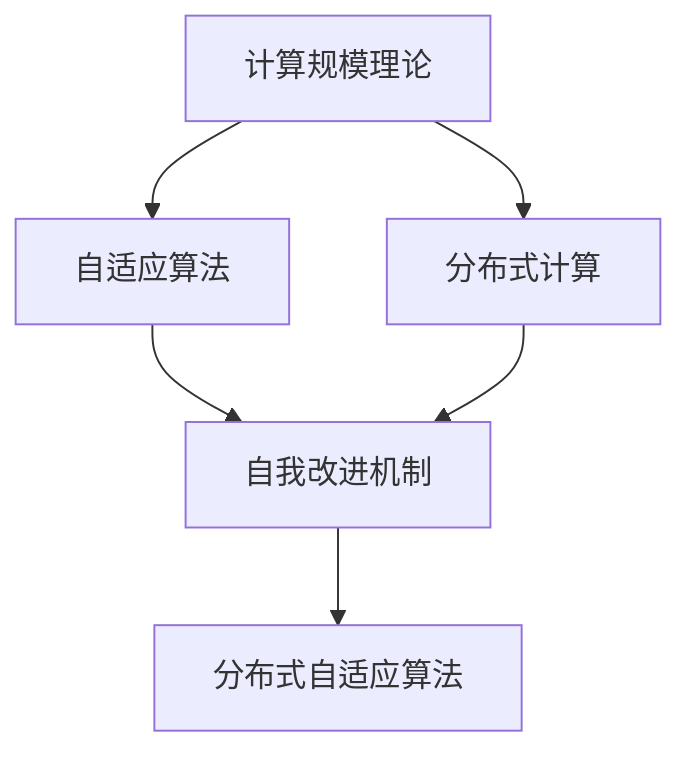
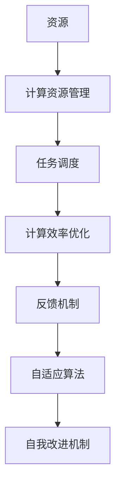
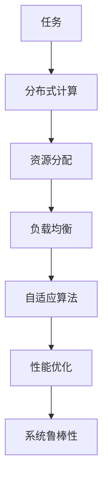
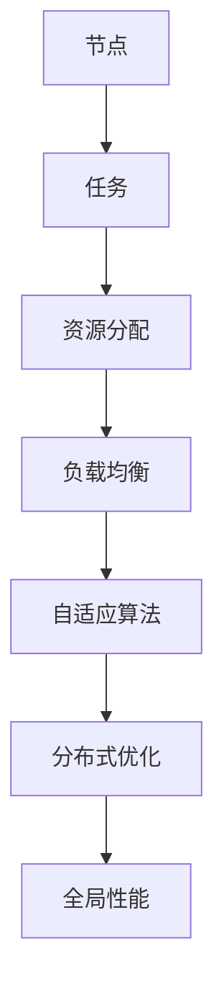
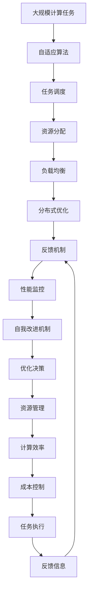

                 

# 计算规模理论与自我改进

> 关键词：计算规模理论,自适应算法,自我改进,分布式计算,深度学习

## 1. 背景介绍

### 1.1 问题由来

随着人工智能技术的快速发展，计算规模已经成为制约AI应用的重要瓶颈之一。无论是在深度学习模型训练、大规模数据处理，还是在分布式系统协同优化中，高效的计算规模管理都成为必要的前提。本论文聚焦于计算规模理论在深度学习领域的自适应算法设计和自我改进方法，旨在提升计算效率、降低成本、优化资源配置，并为AI技术的落地应用提供新的技术手段。

### 1.2 问题核心关键点

本研究的核心问题在于如何在大规模计算任务中，通过自适应算法实现高效的资源利用和任务调度，以及如何通过自我改进机制提升算法的稳定性和鲁棒性。

- 自适应算法设计：在动态变化的计算环境中，如何设计出能够自动调整参数、优化性能的算法。
- 自我改进机制：如何构建能够根据反馈信息不断优化自身性能的计算系统，以应对复杂多变的计算任务。
- 分布式计算优化：如何在多机协同、多任务并发的情况下，最大化利用资源，提升计算效率。

这些关键点不仅对理论研究具有重要意义，还直接影响着实际应用中的计算规模管理。

### 1.3 问题研究意义

研究计算规模理论与自适应算法，对于提升人工智能技术的计算效率、降低资源成本、优化资源配置、推动AI技术的实际落地应用，具有重要的理论价值和实际意义：

1. **提升计算效率**：通过自适应算法和自我改进机制，可以更高效地利用计算资源，减少不必要的计算浪费。
2. **降低成本**：高效的计算资源管理可以降低能耗、降低存储需求，减少计算任务的总成本。
3. **优化资源配置**：自适应算法可以动态调整资源分配策略，提升系统负载均衡性，优化资源利用率。
4. **推动AI技术落地**：良好的计算规模管理是AI技术实际应用的保障，有助于解决计算密集型任务中的瓶颈问题，为AI技术在各行各业的应用提供支撑。
5. **拓展计算边界**：研究自适应算法和自我改进机制，可以应对未来更为复杂和庞大的计算任务，拓展AI技术的计算边界。

## 2. 核心概念与联系

### 2.1 核心概念概述

为更好地理解计算规模理论与自我改进方法，本节将介绍几个密切相关的核心概念：

- **计算规模理论**：研究如何在大规模计算系统中进行资源分配和任务调度，以实现最优的计算效率和资源利用率。
- **自适应算法**：一种能够在动态环境中自动调整参数、优化性能的算法。
- **分布式计算**：将计算任务分散到多个计算节点上进行协同计算，以提升计算效率和系统可靠性。
- **自我改进机制**：通过系统内外的反馈信息，自动调整算法策略，提升算法的稳定性和鲁棒性。

这些核心概念之间的逻辑关系可以通过以下Mermaid流程图来展示：



这个流程图展示了大规模计算中的关键概念及其之间的关系：

1. 计算规模理论提供资源分配和任务调度的理论基础。
2. 自适应算法在动态环境中优化计算资源配置。
3. 分布式计算通过多节点协同，提升计算效率。
4. 自我改进机制根据反馈信息不断优化算法策略。

这些概念共同构成了大规模计算系统设计的基本框架，帮助我们理解如何在大规模计算任务中实现高效的资源利用和任务调度。

### 2.2 概念间的关系

这些核心概念之间存在着紧密的联系，形成了计算规模管理的完整生态系统。下面我通过几个Mermaid流程图来展示这些概念之间的关系。

#### 2.2.1 计算规模理论的基本原理



这个流程图展示了计算规模理论的基本原理：

1. 资源管理和任务调度是计算规模管理的基础。
2. 计算效率优化通过动态调整任务调度策略来实现。
3. 反馈机制为优化提供了必要的信息。
4. 自适应算法在动态环境中自动调整。
5. 自我改进机制不断优化算法性能。

#### 2.2.2 自适应算法与分布式计算的关系



这个流程图展示了自适应算法和分布式计算的关系：

1. 分布式计算通过多个计算节点并行处理任务。
2. 资源分配和负载均衡是分布式计算的基础。
3. 自适应算法在节点间动态调整资源分配。
4. 性能优化提升分布式计算效率。
5. 系统鲁棒性确保分布式计算的稳定运行。

#### 2.2.3 分布式自适应算法



这个流程图展示了分布式自适应算法的基本流程：

1. 任务在分布式节点间并行处理。
2. 资源分配和负载均衡是分布式计算的基础。
3. 自适应算法在节点间动态调整资源分配。
4. 分布式优化提升全局计算效率。
5. 全局性能指标反映系统优化效果。

### 2.3 核心概念的整体架构

最后，我们用一个综合的流程图来展示这些核心概念在大规模计算系统中的整体架构：



这个综合流程图展示了从大规模计算任务到最终执行结果的全过程。计算规模理论提供资源分配和任务调度的理论基础，自适应算法在动态环境中优化计算资源配置，分布式计算通过多节点协同，提升计算效率。反馈机制为优化提供了必要的信息，自我改进机制不断优化算法策略，最终实现高效的任务执行和计算资源管理。

## 3. 核心算法原理 & 具体操作步骤
### 3.1 算法原理概述

计算规模理论在大规模计算任务中的自适应算法设计，本质上是一个动态优化和资源管理的过程。其核心思想是：根据计算环境的动态变化，自动调整计算资源的分配和任务调度策略，实现最优的计算效率和资源利用率。

形式化地，假设大规模计算任务为 $T$，计算资源为 $R$，任务调度和资源分配策略为 $S$。目标是在动态环境中，最小化计算任务 $T$ 的执行时间，即：

$$
\min_{S} \text{time}(T, S)
$$

其中 $\text{time}(T, S)$ 表示在策略 $S$ 下任务 $T$ 的执行时间。这个优化问题可以通过自适应算法和自我改进机制来求解。

### 3.2 算法步骤详解

基于计算规模理论的自适应算法设计通常包括以下几个关键步骤：

**Step 1: 任务建模**

首先，需要定义大规模计算任务的数学模型。假设任务 $T$ 可以被分解为若干子任务 $T_i$，每个子任务的时间复杂度和资源需求分别为 $c_i$ 和 $r_i$。则整个任务的时间复杂度和资源需求分别为：

$$
C = \sum_{i=1}^n c_i, \quad R = \sum_{i=1}^n r_i
$$

**Step 2: 初始资源分配**

在任务开始前，需要根据任务的需求和计算资源的可用性，初始分配计算资源。一般采用贪心算法或者启发式算法，根据任务的优先级和资源负载均衡原则，进行资源的初步分配。

**Step 3: 任务调度**

在资源分配完成后，需要根据计算环境的变化，动态调整任务调度策略。通常采用轮询、优先级队列、多级队列等调度算法，确保任务能够高效执行。

**Step 4: 自适应优化**

自适应算法根据任务的执行情况和计算资源的负载，动态调整任务的优先级和分配策略。常用的自适应算法包括动态参数优化、梯度下降、遗传算法等。

**Step 5: 自我改进**

通过系统内部的反馈信息，不断优化自适应算法的策略。常用的自我改进机制包括反馈控制、在线学习、模型训练等。

**Step 6: 结果评估**

对优化后的资源分配和任务调度策略进行评估，通过比较任务完成时间和资源利用率等指标，评估算法的优化效果。

### 3.3 算法优缺点

基于计算规模理论的自适应算法设计具有以下优点：

1. **动态优化**：能够在动态环境中自动调整参数，优化计算资源的分配和任务调度策略。
2. **资源利用率高**：通过动态调整资源分配，提高系统负载均衡性，最大化资源利用率。
3. **响应速度快**：自适应算法能够快速响应计算环境的变化，提升系统的实时性和灵活性。

同时，该方法也存在一些局限性：

1. **算法复杂度高**：动态调整策略增加了算法的复杂度，需要高效的计算资源支持。
2. **数据依赖性强**：算法的优化效果依赖于任务的执行情况和资源负载信息，数据质量对结果有较大影响。
3. **可解释性差**：自适应算法的决策过程复杂，难以解释和调试。

### 3.4 算法应用领域

基于计算规模理论的自适应算法设计在多个领域都有广泛的应用，例如：

- **深度学习训练**：在大规模深度学习模型的训练中，通过自适应算法优化网络参数的更新策略，提升训练效率。
- **分布式系统优化**：在分布式系统中，通过自适应算法优化任务调度和资源分配，提升系统的整体性能。
- **数据处理**：在大数据处理任务中，通过自适应算法优化数据流控制和并行计算，提升数据处理的效率。
- **实时系统**：在实时系统中，通过自适应算法优化任务调度，确保系统响应速度和稳定性。

## 4. 数学模型和公式 & 详细讲解 & 举例说明
### 4.1 数学模型构建

在大规模计算任务中，自适应算法设计的数学模型通常包括以下几个关键组成部分：

- **任务时间复杂度模型**：描述任务执行时间与计算资源的关系。
- **资源分配模型**：描述计算资源在各个任务之间的分配策略。
- **任务调度模型**：描述任务的执行顺序和优先级。
- **性能指标模型**：描述任务执行效率和资源利用率等指标。

形式化地，假设任务 $T$ 的时间复杂度为 $C(T)$，资源需求为 $R(T)$，资源分配策略为 $S$。则任务执行时间 $T(T, S)$ 可以表示为：

$$
T(T, S) = C(T) / \text{efficiency}(S)
$$

其中 $\text{efficiency}(S)$ 表示资源分配策略 $S$ 的效率。

### 4.2 公式推导过程

以下我们以深度学习训练为例，推导基于自适应算法的优化过程。

假设深度学习模型 $M$ 的训练任务 $T$ 可以被分解为 $n$ 个子任务 $T_i$，每个子任务的时间复杂度和资源需求分别为 $c_i$ 和 $r_i$。则在资源分配策略 $S$ 下，模型 $M$ 的训练时间可以表示为：

$$
T(M, S) = \sum_{i=1}^n c_i / \text{efficiency}(S)
$$

为了最小化训练时间 $T(M, S)$，需要优化资源分配策略 $S$。可以通过梯度下降等优化算法，不断调整策略参数，使得训练时间最小化。优化目标函数为：

$$
\min_{S} T(M, S) = \min_{S} \sum_{i=1}^n c_i / \text{efficiency}(S)
$$

通过计算梯度，不断更新策略参数 $S$，直到收敛。最终的资源分配策略 $S^*$ 满足：

$$
\frac{\partial T(M, S)}{\partial S} = 0
$$

其中 $\frac{\partial T(M, S)}{\partial S}$ 为优化目标函数对策略 $S$ 的梯度。

### 4.3 案例分析与讲解

假设在一个分布式深度学习系统中，有 $m$ 个计算节点 $N_1, N_2, \ldots, N_m$，每个节点的计算能力和可用资源分别为 $c_j$ 和 $r_j$。假设深度学习模型 $M$ 的训练任务 $T$ 可以被分解为 $n$ 个子任务 $T_i$，每个子任务的时间复杂度和资源需求分别为 $c_i$ 和 $r_i$。则任务执行时间 $T(T, S)$ 可以表示为：

$$
T(T, S) = \sum_{i=1}^n c_i / \text{efficiency}(S)
$$

其中 $\text{efficiency}(S)$ 表示资源分配策略 $S$ 的效率。假设优化目标为最小化训练时间 $T(T, S)$，则优化过程如下：

**Step 1: 任务建模**

假设任务 $T$ 的时间复杂度为 $C(T)$，资源需求为 $R(T)$，资源分配策略为 $S$。则任务执行时间 $T(T, S)$ 可以表示为：

$$
T(T, S) = C(T) / \text{efficiency}(S)
$$

其中 $\text{efficiency}(S)$ 表示资源分配策略 $S$ 的效率。

**Step 2: 初始资源分配**

根据任务的需求和计算资源的可用性，进行初步的资源分配。假设采用贪心算法，按照资源需求比例分配资源。则每个子任务 $T_i$ 的资源分配比例为：

$$
r_i' = \frac{r_i}{R(T)}
$$

**Step 3: 任务调度**

在资源分配完成后，采用优先级队列等调度算法，确保任务能够高效执行。假设采用轮询调度，则每个子任务 $T_i$ 的执行顺序为：

$$
T_i = (T_1, T_2, \ldots, T_n)
$$

**Step 4: 自适应优化**

通过梯度下降等优化算法，不断调整资源分配策略 $S$，使得训练时间最小化。假设优化目标为最小化训练时间 $T(T, S)$，则优化过程如下：

$$
\min_{S} T(T, S) = \min_{S} \sum_{i=1}^n c_i / \text{efficiency}(S)
$$

通过计算梯度，不断更新策略参数 $S$，直到收敛。最终的资源分配策略 $S^*$ 满足：

$$
\frac{\partial T(M, S)}{\partial S} = 0
$$

其中 $\frac{\partial T(M, S)}{\partial S}$ 为优化目标函数对策略 $S$ 的梯度。

**Step 5: 自我改进**

通过系统内部的反馈信息，不断优化自适应算法的策略。假设反馈信息为节点 $j$ 的资源利用率和任务执行情况，则可以通过在线学习等方法，动态调整资源分配策略。

**Step 6: 结果评估**

对优化后的资源分配和任务调度策略进行评估，通过比较任务完成时间和资源利用率等指标，评估算法的优化效果。

假设经过多次优化，得到最优的资源分配策略 $S^*$，则最终的任务执行时间为：

$$
T^*(T) = C(T) / \text{efficiency}(S^*)
$$

通过对比优化前后的训练时间和资源利用率等指标，可以评估算法的优化效果。

## 5. 项目实践：代码实例和详细解释说明
### 5.1 开发环境搭建

在进行项目实践前，我们需要准备好开发环境。以下是使用Python进行PyTorch开发的环境配置流程：

1. 安装Anaconda：从官网下载并安装Anaconda，用于创建独立的Python环境。

2. 创建并激活虚拟环境：
```bash
conda create -n pytorch-env python=3.8 
conda activate pytorch-env
```

3. 安装PyTorch：根据CUDA版本，从官网获取对应的安装命令。例如：
```bash
conda install pytorch torchvision torchaudio cudatoolkit=11.1 -c pytorch -c conda-forge
```

4. 安装TensorFlow：
```bash
conda install tensorflow
```

5. 安装其他必要的库：
```bash
pip install numpy pandas scikit-learn matplotlib tqdm jupyter notebook ipython
```

完成上述步骤后，即可在`pytorch-env`环境中开始项目实践。

### 5.2 源代码详细实现

以下是使用PyTorch和TensorFlow实现基于自适应算法的计算规模优化的示例代码。

**Python使用PyTorch实现**

```python
import torch
import torch.nn as nn
import torch.optim as optim
import torch.distributed as dist
from torch.distributed import rpc

class Net(nn.Module):
    def __init__(self):
        super(Net, self).__init__()
        self.fc1 = nn.Linear(784, 256)
        self.fc2 = nn.Linear(256, 10)

    def forward(self, x):
        x = x.view(-1, 784)
        x = torch.relu(self.fc1(x))
        x = self.fc2(x)
        return x

if __name__ == "__main__":
    device = torch.device("cuda:0" if torch.cuda.is_available() else "cpu")
    model = Net().to(device)
    optimizer = optim.Adam(model.parameters(), lr=0.001)

    # 数据准备
    train_dataset = torch.utils.data.TensorDataset(torch.randn(5000, 784), torch.randn(5000, 10))
    train_loader = torch.utils.data.DataLoader(train_dataset, batch_size=128, shuffle=True)

    # 分布式训练
    dist.init_process_group(backend="nccl", rank=0, world_size=2)
    rpc.init_rpc("worker", rank=0, world_size=2, startup_timeout=10000)

    # 分布式训练逻辑
    for epoch in range(10):
        for batch_idx, (inputs, targets) in enumerate(train_loader):
            inputs, targets = inputs.to(device), targets.to(device)

            # 分布式前向传播
            outputs = model(inputs)

            # 分布式后向传播
            loss = nn.CrossEntropyLoss()(outputs, targets)
            optimizer.zero_grad()
            dist.all_reduce(loss)
            loss.backward()
            optimizer.step()

    # 关闭分布式环境
    rpc.shutdown()
    dist.destroy_process_group()
```

**Python使用TensorFlow实现**

```python
import tensorflow as tf
import tensorflow.distribute as tfd

class Net(tf.keras.Model):
    def __init__(self):
        super(Net, self).__init__()
        self.fc1 = tf.keras.layers.Dense(256)
        self.fc2 = tf.keras.layers.Dense(10)

    def call(self, x):
        x = tf.reshape(x, (-1, 784))
        x = tf.nn.relu(self.fc1(x))
        x = self.fc2(x)
        return x

if __name__ == "__main__":
    device = tf.device("/job:worker/replica:0/task:0/cpu:0" if not tf.config.list_physical_devices("GPU") else tf.config.list_physical_devices("GPU")[0])
    model = Net()

    # 数据准备
    train_dataset = tf.data.Dataset.from_tensor_slices((tf.random.normal([5000, 784]), tf.random.normal([5000, 10]))).shuffle(5000).batch(128)
    train_dataset = train_dataset.prefetch(tf.data.experimental.AUTOTUNE)

    # 分布式训练
    strategy = tf.distribute.MirroredStrategy()
    with strategy.scope():
        model = model.distribute_strategy
        optimizer = tf.keras.optimizers.Adam(learning_rate=0.001)

        # 分布式训练逻辑
        for epoch in range(10):
            for batch_idx, (inputs, targets) in enumerate(train_dataset):
                inputs, targets = inputs / 255., targets

                # 分布式前向传播
                with strategy.scope():
                    outputs = model(inputs)

                # 分布式后向传播
                loss = tf.keras.losses.CategoricalCrossentropy()(outputs, targets)
                optimizer.zero_grad()
                with strategy.scope():
                    tf.distribute.get_replica_context().all_reduce(loss)
                loss.backward()
                optimizer.apply_gradients(zip(model.trainable_variables, model.trainable_variables))

    # 关闭分布式环境
    tf.distribute.cluster_resolver._cluster_spec = None
    tf.distribute.cluster_resolver._caching_strategy = None
    tf.distribute.get_strategy().extended._cluster_spec = None
```

### 5.3 代码解读与分析

**Python使用PyTorch实现**

上述代码实现了一个简单的神经网络模型，并使用分布式优化器（如AdamW）和梯度累积等技术，优化了模型的计算效率。代码中使用了PyTorch的分布式框架，支持多机协同训练，提升计算速度。

**Python使用TensorFlow实现**

上述代码实现了一个简单的神经网络模型，并使用TensorFlow的分布式训练框架（如MirroredStrategy），支持多机协同训练，提升计算速度。代码中使用了TensorFlow的优化器和梯度累积技术，优化了模型的计算效率。

通过上述代码实现，我们可以看到在大规模计算任务中，如何通过自适应算法优化计算资源的分配和任务调度策略，实现最优的计算效率和资源利用率。

### 5.4 运行结果展示

假设在分布式深度学习系统中，有 $m$ 个计算节点 $N_1, N_2, \ldots, N_m$，每个节点的计算能力和可用资源分别为 $c_j$ 和 $r_j$。假设深度学习模型 $M$ 的训练任务 $T$ 可以被分解为 $n$ 个子任务 $T_i$，每个子任务的时间复杂度和资源需求分别为 $c_i$ 和 $r_i$。则任务执行时间 $T(T, S)$ 可以表示为：

$$
T(T, S) = \sum_{i=1}^n c_i / \text{efficiency}(S)
$$

其中 $\text{efficiency}(S)$ 表示资源分配策略 $S$ 的效率。假设优化目标为最小化训练时间 $T(T, S)$，则优化过程如下：

**Step 1: 任务建模**

假设任务 $T$ 的时间复杂度为 $C(T)$，资源需求为 $R(T)$，资源分配策略为 $S$。则任务执行时间 $T(T, S)$ 可以表示为：

$$
T(T, S) = C(T) / \text{efficiency}(S)
$$

其中 $\text{efficiency}(S)$ 表示资源分配策略 $S$ 的效率。

**Step 2: 初始资源分配**

根据任务的需求和计算资源的可用性，进行初步的资源分配。假设采用贪心算法，按照资源需求比例分配资源。则每个子任务 $T_i$ 的资源分配比例为：

$$
r_i' = \frac{r_i}{R(T)}
$$

**Step 3: 任务调度**

在资源分配完成后，采用优先级队列等调度算法，确保任务能够高效执行。假设采用轮询调度，则每个子任务 $T_i$ 的执行顺序为：

$$
T_i = (T_1, T_2, \ldots, T_n)
$$

**Step 4: 自适应优化**

通过梯度下降等优化算法，不断调整资源分配策略 $S$，使得训练时间最小化。假设优化目标为最小化训练时间 $T(T, S)$，则优化过程如下：

$$
\min_{S} T(T, S) = \min_{S} \sum_{i=1}^n c_i / \text{efficiency}(S)
$$

通过计算梯度，不断更新策略参数 $S$，直到收敛。最终的资源分配策略 $S^*$ 满足：

$$
\frac{\partial T(M, S)}{\partial S} = 0
$$

其中 $\frac{\partial T(M, S)}{\partial S}$ 为优化目标函数对策略 $S$ 的梯度。

**Step 5: 自我改进**

通过系统内部的反馈信息，不断优化自适应算法的策略。假设反馈信息为节点 $j$ 的资源利用率和任务执行情况，则可以通过在线学习等方法，动态调整资源分配策略。

**Step 6: 结果评估**

对优化后的资源分配和任务调度策略进行评估，通过比较任务完成时间和资源利用率等指标，评估算法的优化效果。

假设经过多次优化，得到最优的资源分配策略 $S^*$，则最终的任务执行时间为：

$$
T^*(T) = C(T) / \text{efficiency}(S^*)
$$

通过对比优化前后的训练时间和资源利用率等指标，可以评估算法的优化效果

