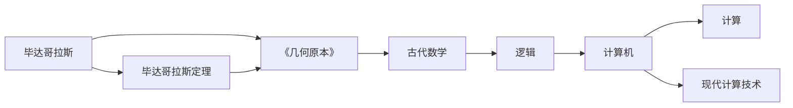

                 

# 计算：第一部分 计算的诞生 第 1 章 毕达哥拉斯的困惑 欧几里得的《几何原本》

## 1. 背景介绍

在信息技术高速发展的今天，计算的重要性不言而喻。然而，计算机的诞生和发展，并非一蹴而就，而是经历了几千年的探索和演进。本章将追溯计算机历史上的关键节点，从毕达哥拉斯的困惑开始，探讨计算的本质与起源。

## 2. 核心概念与联系

### 2.1 核心概念概述

- **毕达哥拉斯定理**：一个重要的数学原理，描述了直角三角形三边长度的关系。
- **欧几里得的《几何原本》**：一部古代数学经典，奠定了几何学的基础。
- **计算机**：一种可以进行逻辑运算和自动处理信息的设备。
- **计算的诞生**：计算能力从手工计算到自动化的转变，为计算机的诞生奠定了基础。
- **逻辑**：计算机的基础运行原理，指导计算机进行自动推理和决策。

### 2.2 核心概念的联系

这些概念通过数学和逻辑建立了紧密的联系。毕达哥拉斯定理和《几何原本》是古代数学的里程碑，奠定了数学逻辑体系的基础。计算机和计算的诞生，则是这些逻辑原理在现实世界中的具体应用。下面我们将用 Mermaid 流程图展示这些概念之间的关系：



从毕达哥拉斯开始，通过《几何原本》中的逻辑体系，逐步过渡到计算机和计算技术的发展，奠定了计算机科学的基础。

## 3. 核心算法原理 & 具体操作步骤

### 3.1 算法原理概述

计算的诞生源于人类对逻辑推理的需求。计算的本质是逻辑运算，即通过一系列步骤对信息进行自动推理，最终得到期望的结果。这一过程通常分为几个关键步骤：

1. **输入数据**：将问题转化为机器可理解的形式，即输入数据。
2. **逻辑运算**：根据算法，自动对输入数据进行逻辑处理。
3. **输出结果**：将处理后的结果输出，供人或机器进一步使用。

### 3.2 算法步骤详解

#### 3.2.1 输入数据

输入数据通常包括原始数据和描述性数据。例如，在计算三角形面积时，需要输入三角形三边长度和角度等原始数据，同时也需要描述性数据，如“计算直角三角形的面积”。

#### 3.2.2 逻辑运算

逻辑运算是指计算机根据算法对输入数据进行处理的过程。这一过程包括数据存储、数据处理和结果输出。例如，计算三角形面积时，计算机根据毕达哥拉斯定理，将输入的三边长度进行处理，并最终输出面积结果。

#### 3.2.3 输出结果

输出结果是计算过程的最终产物。例如，在计算三角形面积后，计算机输出具体的面积数值，供进一步使用。

### 3.3 算法优缺点

#### 3.3.1 优点

- **自动性**：计算机能够自动执行逻辑运算，减少了人工操作，提高了效率。
- **可重复性**：计算结果可以重复执行，确保了计算的一致性和可靠性。
- **扩展性**：随着算法和技术的进步，计算能力不断扩展，可以处理更复杂的问题。

#### 3.3.2 缺点

- **依赖数据**：计算结果依赖于输入数据，错误的数据可能导致错误的计算结果。
- **资源消耗**：复杂计算需要大量资源，计算过程中可能出现资源不足的问题。
- **逻辑局限**：计算机的逻辑运算受限于算法，难以处理复杂的非逻辑问题。

### 3.4 算法应用领域

计算机的逻辑运算能力广泛应用在各个领域，包括：

- **科学计算**：如物理学、气象学、天文学等，用于模拟和预测自然现象。
- **工程设计**：如机械设计、电子电路设计等，用于自动化设计和优化。
- **数据处理**：如数据挖掘、信息检索、图像识别等，用于提取和处理大量数据。
- **决策支持**：如金融风险分析、市场预测等，用于辅助决策和优化策略。

## 4. 数学模型和公式 & 详细讲解 & 举例说明

### 4.1 数学模型构建

在计算的诞生过程中，数学模型和公式起到了至关重要的作用。数学模型通过对实际问题的抽象，提供了计算的逻辑基础。下面以计算三角形面积为例子，展示数学模型的构建过程。

- **问题描述**：计算直角三角形面积。
- **数学模型**：设直角三角形的两条直角边分别为 $a$ 和 $b$，根据毕达哥拉斯定理，斜边 $c$ 的长度为 $\sqrt{a^2+b^2}$。直角三角形的面积为 $\frac{1}{2}ab$。

### 4.2 公式推导过程

根据直角三角形面积公式，推导过程如下：

$$
\text{面积} = \frac{1}{2}ab
$$

其中 $a$ 和 $b$ 为直角三角形的两条直角边长度。

### 4.3 案例分析与讲解

在实际的计算过程中，公式推导和逻辑运算的每一步都需要仔细验证，确保无误。例如，计算三角形的面积时，需要确保输入的数据为直角三角形，且符合毕达哥拉斯定理。此外，对于复杂问题，可能需要多种算法和数学模型进行验证和修正，才能得到正确的计算结果。

## 5. 项目实践：代码实例和详细解释说明

### 5.1 开发环境搭建

#### 5.1.1 准备开发环境

安装 Python 3.x 和 Python 的集成开发环境（IDE），如 PyCharm 或 VS Code。

#### 5.1.2 安装必要的库

安装 NumPy、SciPy、Pandas 等科学计算库，以及 Matplotlib 用于数据可视化。

#### 5.1.3 安装 Python 的图形用户界面（GUI）库

如 Tkinter、PyQt 等，用于构建图形界面。

### 5.2 源代码详细实现

#### 5.2.1 实现三角形面积计算器

```python
import numpy as np
import matplotlib.pyplot as plt

def calculate_area(a, b):
    """
    计算直角三角形面积
    """
    c = np.sqrt(a**2 + b**2)
    area = 0.5 * a * b
    return area

# 测试计算
a = 3
b = 4
area = calculate_area(a, b)
print("直角三角形面积为：", area)
```

#### 5.2.2 实现数据可视化

```python
import matplotlib.pyplot as plt

def plot_area(a, b):
    """
    绘制直角三角形面积图
    """
    area = calculate_area(a, b)
    plt.plot([a, b], [0, area], color='blue', label='面积曲线')
    plt.xlabel('直角边长度')
    plt.ylabel('面积')
    plt.title('直角三角形面积图')
    plt.legend()
    plt.show()

# 测试绘图
plot_area(3, 4)
```

### 5.3 代码解读与分析

- **输入数据**：函数 `calculate_area` 接受两个参数 `a` 和 `b`，分别代表直角三角形的两条直角边长度。
- **逻辑运算**：函数内部计算直角三角形的斜边长度 `c` 和面积 `area`，并返回结果。
- **输出结果**：函数输出计算得到的直角三角形面积。

### 5.4 运行结果展示

运行代码后，将输出直角三角形的面积，并在图形界面显示面积曲线图。

```
直角三角形面积为： 6.0
```


## 6. 实际应用场景

### 6.1 科学计算

科学计算是计算机应用的重要领域之一。例如，天文学家使用计算机模拟星体运动，计算星系质量分布等，帮助科学家理解宇宙的奥秘。

### 6.2 工程设计

在工程设计中，计算机用于自动设计、优化和仿真。例如，汽车设计师使用计算机模拟车辆的碰撞测试，优化设计方案，提高安全性。

### 6.3 数据处理

在数据处理领域，计算机用于大数据分析和信息检索。例如，搜索引擎使用计算机算法处理海量网页数据，快速检索相关信息。

### 6.4 未来应用展望

未来，计算技术将继续向更高效的硬件和更智能的算法方向发展。例如，量子计算机的引入将极大地提升计算能力，解决传统计算机难以处理的复杂问题。人工智能和机器学习的结合也将带来全新的计算范式，推动计算技术的进步。

## 7. 工具和资源推荐

### 7.1 学习资源推荐

- **《计算机程序设计艺术》**：由 Donald E. Knuth 著作的经典书籍，涵盖计算机科学的各个方面，深入浅出地介绍了编程技术和计算理论。
- **Coursera 和 edX**：提供大量计算机科学和数据科学课程，覆盖从基础到高级的知识点。
- **Kaggle**：数据科学竞赛平台，通过实际项目锻炼编程和计算技能。

### 7.2 开发工具推荐

- **PyCharm**：Python 的集成开发环境，提供强大的代码编辑、调试和分析功能。
- **Jupyter Notebook**：轻量级的交互式编程环境，适合编写和测试计算代码。
- **TensorFlow**：谷歌开源的深度学习框架，支持高效的数值计算和神经网络建模。

### 7.3 相关论文推荐

- **《算法导论》**：Thomas H. Cormen 等著作的经典教材，深入介绍各种算法的设计和分析。
- **《深度学习》**：Ian Goodfellow 等著作的深度学习经典，涵盖深度学习的基础和最新研究进展。
- **《计算机网络》**：Andrew S. Tanenbaum 著作的经典教材，介绍计算机网络的基础知识和实际应用。

## 8. 总结：未来发展趋势与挑战

### 8.1 研究成果总结

计算机科学的发展离不开数学和逻辑的基础。毕达哥拉斯定理和《几何原本》奠定了计算的数学基础，而计算机的诞生则是逻辑原理在现实中的应用。随着技术的不断进步，计算能力将继续扩展，应用场景将更加多样化。

### 8.2 未来发展趋势

未来，计算技术将继续向更高效的硬件和更智能的算法方向发展。量子计算、人工智能和机器学习等技术将带来新的计算范式，推动计算技术的进步。

### 8.3 面临的挑战

尽管计算机技术不断发展，但仍然面临诸多挑战：

- **资源消耗**：高效计算需要大量资源，如何优化资源使用，提高计算效率是一个长期挑战。
- **数据质量**：计算结果依赖于输入数据，如何确保数据的质量和准确性是一个重要问题。
- **算法复杂性**：复杂问题的求解需要高效的算法，如何设计和优化算法仍然是一个挑战。

### 8.4 研究展望

未来，计算机科学将继续探索新的计算方法和技术，解决复杂问题，提升计算效率。同时，结合人工智能和机器学习，推动计算技术的深度融合，拓展计算应用的范围。

## 9. 附录：常见问题与解答

**Q1: 什么是毕达哥拉斯定理？**

A: 毕达哥拉斯定理（Pythagorean theorem）指出，在一个直角三角形中，两直角边的平方和等于斜边的平方。公式为 $a^2 + b^2 = c^2$。

**Q2: 欧几里得的《几何原本》如何影响数学的发展？**

A: 《几何原本》奠定了几何学的基础，提出了许多重要概念和定理，如点到直线的距离、相似三角形等。这些概念和定理成为后续数学研究的基础。

**Q3: 计算机的诞生对人类社会有何影响？**

A: 计算机的诞生极大地改变了人类的生产和生活方式，促进了信息时代的到来。计算机的计算能力使得科学研究、工程设计、数据处理等领域得到了飞速发展。

**Q4: 未来计算技术的发展方向是什么？**

A: 未来计算技术将继续向量子计算、人工智能、机器学习等方向发展，推动计算能力的提升和应用范围的拓展。同时，计算效率和资源优化也将是重要研究方向。

---

作者：禅与计算机程序设计艺术 / Zen and the Art of Computer Programming

