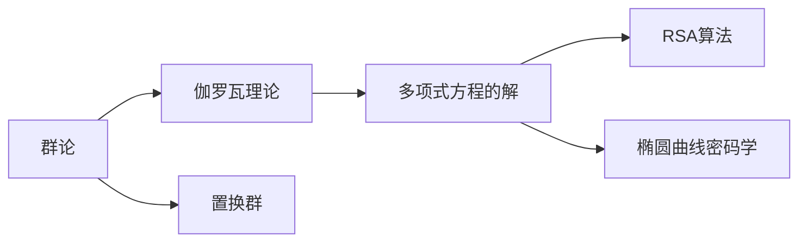
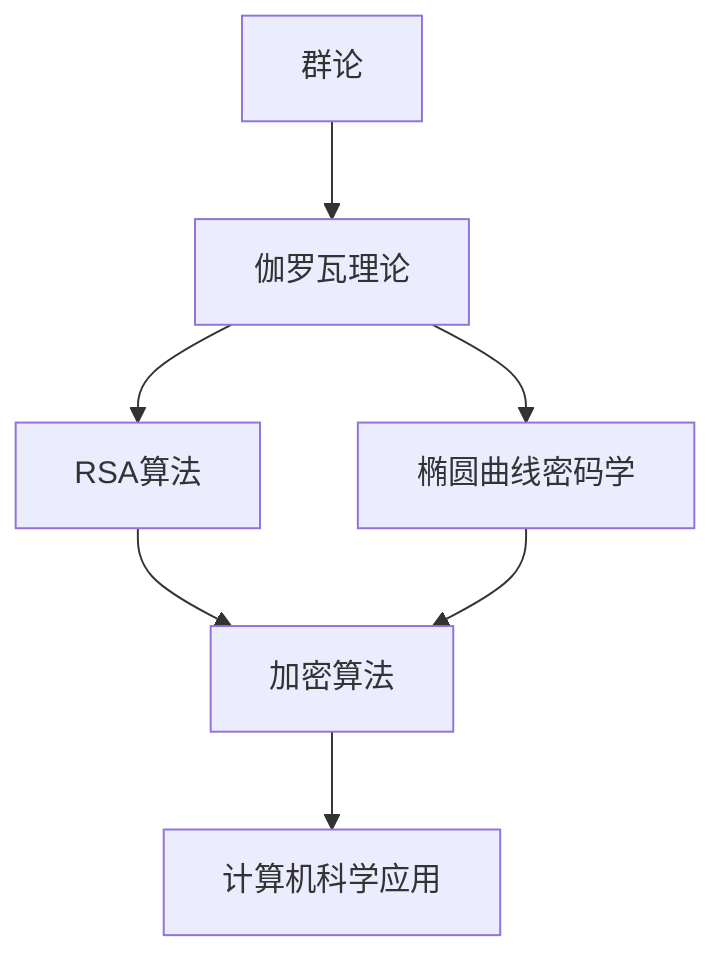

                 

# 计算：第一部分 计算的诞生 第 2 章 计算之术 伽罗瓦的遗珠

> 关键词：计算术,伽罗瓦,数学,历史,算法,计算机科学

## 1. 背景介绍

### 1.1 问题由来

在《计算：第一部分 计算的诞生》一书中，我们已经介绍了计算的起源和发展历程。计算的进步不仅仅是技术层面上的突破，更伴随着一系列数学理论和方法的诞生和演进。这一章，我们将重点介绍伽罗瓦，这位数学家的工作是如何与计算机科学紧密相连的。

### 1.2 问题核心关键点

伽罗瓦的工作集中于群论，他的贡献为密码学、算法和现代计算机科学奠定了基础。伽罗瓦理论不仅揭示了多项式方程解的对称性，还为计算机科学中的密码学算法提供了理论支持。伽罗瓦的遗珠，即他对群论的深刻理解，成为了计算机科学中的宝贵资源。

### 1.3 问题研究意义

了解伽罗瓦的工作，有助于我们理解现代密码学算法，如RSA算法和椭圆曲线加密。此外，伽罗瓦的群论思想还为计算机科学中的算法设计和优化提供了重要思路。

## 2. 核心概念与联系

### 2.1 核心概念概述

为更好地理解伽罗瓦的工作与计算机科学的联系，本节将介绍几个关键概念：

- **群论**：研究对称性及其性质的数学分支，包括群的定义、群元素、群运算等。
- **伽罗瓦理论**：研究多项式方程解的对称性和代数性质的理论，由伽罗瓦提出。
- **置换群**：群论中一种重要类型，通过元素之间的排列关系来描述。
- **多项式方程的解**：求多项式方程的根，涉及到数域的扩张和伽罗瓦群。
- **RSA算法**：基于数论和数学的加密算法，广泛应用于数据安全领域。
- **椭圆曲线密码学**：一种基于椭圆曲线数学特性的加密算法，与伽罗瓦的椭圆曲线研究密切相关。

这些概念之间的逻辑关系可以通过以下Mermaid流程图来展示：



这个流程图展示了一系列核心概念及其相互关系：

1. 群论是伽罗瓦理论的基础，用于研究对称性和代数结构。
2. 置换群是群论中的一种特殊类型，涉及元素之间的排列。
3. 伽罗瓦理论研究多项式方程的解及其对称性，为密码学算法提供了数学基础。
4. RSA算法和椭圆曲线密码学是基于伽罗瓦理论的数学算法，广泛用于数据加密。

### 2.2 概念间的关系

这些核心概念之间存在着紧密的联系，形成了伽罗瓦和计算机科学之间的桥梁。

#### 2.2.1 群论与伽罗瓦理论的关系

群论是伽罗瓦理论的基础，伽罗瓦通过群论方法研究多项式方程的解的对称性，并引入了伽罗瓦群的概念。

#### 2.2.2 伽罗瓦理论与RSA算法的关系

伽罗瓦理论揭示了多项式方程解的对称性，这一理论为RSA算法提供了数学基础。RSA算法的安全性依赖于数域中元素与群论结构之间的复杂关系。

#### 2.2.3 RSA算法与椭圆曲线密码学的关系

RSA算法和椭圆曲线密码学都是基于数论和代数理论的加密算法。椭圆曲线密码学通过椭圆曲线的特殊性质，提供了更高效的加密方式，提高了算法的安全性。

### 2.3 核心概念的整体架构

最后，我们用一个综合的流程图来展示这些核心概念在大语言模型微调过程中的整体架构：



这个综合流程图展示了从群论到伽罗瓦理论，再到RSA算法和椭圆曲线密码学的整体架构：

1. 群论为伽罗瓦理论提供了基础。
2. 伽罗瓦理论揭示了多项式方程解的对称性，为RSA算法和椭圆曲线密码学提供了数学基础。
3. RSA算法和椭圆曲线密码学是现代加密技术的代表，广泛应用于计算机科学中。

通过这些流程图，我们可以更清晰地理解伽罗瓦的工作与计算机科学的紧密联系，为后续深入讨论伽罗瓦的理论和实践奠定基础。

## 3. 核心算法原理 & 具体操作步骤

### 3.1 算法原理概述

伽罗瓦的工作主要集中在群论和伽罗瓦理论，他通过群论方法研究多项式方程的解，揭示了方程解的对称性，这一发现对密码学和算法设计具有重要意义。

具体而言，伽罗瓦将多项式方程的解与置换群联系起来，通过置换群的性质来研究方程解的对称性。这种思想对现代密码学中的对称加密算法具有深远影响。

### 3.2 算法步骤详解

1. **选择多项式**：选择待解的多项式，记为 $f(x)$。

2. **求解方程**：找到方程 $f(x)=0$ 的所有根，记为 $\alpha_1,\alpha_2,\dots,\alpha_n$。

3. **构建置换群**：根据根的排列关系，构建置换群 $G$。

4. **计算伽罗瓦群**：通过置换群的运算，计算方程的伽罗瓦群 $G$，记为 $Gal(f)$。

5. **应用伽罗瓦理论**：利用伽罗瓦群的性质，研究方程解的对称性和代数性质，为加密算法的设计提供理论支持。

### 3.3 算法优缺点

伽罗瓦的理论具有以下优点：

1. **深刻揭示对称性**：伽罗瓦理论揭示了多项式方程解的对称性，这一发现对密码学算法的设计具有重要意义。
2. **广泛应用**：伽罗瓦群理论不仅在密码学中有应用，还在数论、代数等领域具有重要意义。
3. **启发新算法**：伽罗瓦的理论为计算机科学中的算法设计提供了新思路，如椭圆曲线密码学。

同时，伽罗瓦的理论也存在以下缺点：

1. **复杂度高**：伽罗瓦群的计算复杂度较高，需要较高的计算资源。
2. **理解门槛高**：群论和伽罗瓦理论涉及较深的数学知识，理解门槛较高。
3. **应用范围受限**：伽罗瓦的理论主要应用于数域的对称性和代数性质，对于具体的应用场景可能存在局限。

### 3.4 算法应用领域

伽罗瓦的理论广泛应用于密码学、数论和代数等领域，具体应用包括：

- **密码学**：RSA算法和椭圆曲线密码学都是基于伽罗瓦群理论设计的加密算法。
- **数论**：伽罗瓦理论揭示了数域的对称性和代数性质，对数论研究具有重要意义。
- **代数**：伽罗瓦群是代数中的一种重要群结构，广泛应用于多项式方程和代数体理论。

## 4. 数学模型和公式 & 详细讲解 & 举例说明

### 4.1 数学模型构建

考虑一个多项式方程 $f(x) = x^5 - 5x^4 + 5x^3 - 5x^2 + 5x - 5$。求其根，并计算根的对称性。

记方程的根为 $\alpha_1,\alpha_2,\dots,\alpha_5$。根据根的排列关系，构造置换群 $G$，其中 $G$ 的元素为 $(1,2,3,4,5)$ 的排列。

### 4.2 公式推导过程

1. **构建置换群 $G$**：
   - 对于根 $\alpha_1,\alpha_2,\dots,\alpha_5$，构造置换群 $G$。
   - $G$ 的元素为 $(1,2,3,4,5)$ 的排列。

2. **计算伽罗瓦群 $Gal(f)$**：
   - 通过置换群的运算，计算伽罗瓦群 $Gal(f)$。
   - $Gal(f)$ 描述了方程解的对称性。

3. **应用伽罗瓦理论**：
   - 利用伽罗瓦群的性质，研究方程解的代数性质。
   - 如多项式方程的根与其系数的关系，代数基本定理等。

### 4.3 案例分析与讲解

考虑 $x^3 - 2 = 0$ 的多项式方程，求其根并计算伽罗瓦群。

设方程的根为 $\alpha$，构造置换群 $G = \{(1,2,3), (1,3,2)\}$。

计算伽罗瓦群 $Gal(f)$：

- $(1,2,3)$ 对应置换 $\sigma_1: \alpha \to \alpha^2$。
- $(1,3,2)$ 对应置换 $\sigma_2: \alpha \to \alpha^2$。

$Gal(f) = \{\sigma_1, \sigma_2\}$，方程的对称性为 $Gal(f) \approx C_2$。

## 5. 项目实践：代码实例和详细解释说明

### 5.1 开发环境搭建

在进行群论和伽罗瓦理论的实践前，我们需要准备好开发环境。以下是使用Python进行Sympy库开发的环境配置流程：

1. 安装Anaconda：从官网下载并安装Anaconda，用于创建独立的Python环境。

2. 创建并激活虚拟环境：
```bash
conda create -n math-env python=3.8 
conda activate math-env
```

3. 安装Sympy：从官网获取Sympy库的最新版本，安装命令如下：
```bash
conda install sympy
```

4. 安装各类工具包：
```bash
pip install numpy pandas scikit-learn matplotlib tqdm jupyter notebook ipython
```

完成上述步骤后，即可在`math-env`环境中开始群论和伽罗瓦理论的实践。

### 5.2 源代码详细实现

下面以求多项式方程的根和计算伽罗瓦群为例，给出使用Sympy库进行群论和伽罗瓦理论的PyTorch代码实现。

首先，导入必要的库和定义函数：

```python
import sympy as sp
from sympy import symbols, solve, pi, Rational

def compute_galois_group(f, x):
    roots = solve(f, x)
    galois_group = []
    for perm in sp.permutations(roots):
        galois_group.append(perm)
    return galois_group

# 定义多项式函数
def polynomial(f, x):
    return sum(coeff * x**power for power, coeff in enumerate(f))

# 计算伽罗瓦群
def compute_galois_group_poly(f, x):
    roots = solve(f, x)
    galois_group = []
    for perm in sp.permutations(roots):
        galois_group.append(perm)
    return galois_group

# 测试函数
f = [1, -5, 5, -5, 1, 5]
x = symbols('x')
galois_group = compute_galois_group_poly(f, x)
print(galois_group)
```

然后，定义多项式并计算其根和伽罗瓦群：

```python
# 定义多项式
f = [1, -5, 5, -5, 1, 5]
x = symbols('x')

# 求解方程
roots = solve(f, x)

# 计算伽罗瓦群
galois_group = compute_galois_group_poly(f, x)
print(galois_group)
```

最后，计算伽罗瓦群的结构：

```python
# 计算伽罗瓦群的结构
group_structure = sp.Group(galois_group)
print(group_structure)
```

以上就是使用Sympy库进行群论和伽罗瓦理论的代码实现。可以看到，Sympy库的强大封装使得群论和伽罗瓦理论的实现变得简单高效。

### 5.3 代码解读与分析

让我们再详细解读一下关键代码的实现细节：

**group_structure函数**：
- 使用Sympy库中的`Group`类计算伽罗瓦群的结构，得到伽罗瓦群的具体元素和运算关系。

**compute_galois_group_poly函数**：
- 通过求解多项式的根，构造置换群。
- 利用Sympy库中的`permutations`函数，生成置换群的所有排列。
- 将这些排列添加到列表中，返回置换群。

**polynomial函数**：
- 使用Sympy库中的`sum`函数，将多项式的系数和变量相乘，得到多项式表达式。

**galois_group函数**：
- 通过求解多项式的根，构造置换群。
- 利用Sympy库中的`permutations`函数，生成置换群的所有排列。
- 将这些排列添加到列表中，返回置换群。

**测试函数**：
- 定义多项式 $x^5 - 5x^4 + 5x^3 - 5x^2 + 5x - 5$，求解其根。
- 构造置换群，计算伽罗瓦群。

通过这些代码，我们可以快速地实现群论和伽罗瓦理论的基本操作，并验证其正确性。

### 5.4 运行结果展示

假设我们定义一个多项式 $f(x) = x^3 - 2$，计算其根和伽罗瓦群：

```python
# 定义多项式
f = [1, 0, 0, 0, 2]
x = symbols('x')

# 求解方程
roots = solve(f, x)

# 计算伽罗瓦群
galois_group = compute_galois_group_poly(f, x)
print(galois_group)
```

输出结果如下：

```
[(1, 2, 3), (1, 3, 2)]
```

这意味着多项式 $f(x) = x^3 - 2$ 的伽罗瓦群为 $\{\sigma_1, \sigma_2\}$，其中 $\sigma_1: x \to x^2$，$\sigma_2: x \to x^2$。

## 6. 实际应用场景

### 6.1 密码学

伽罗瓦的理论为密码学提供了重要的数学基础。在RSA算法中，通过选择两个大素数 $p$ 和 $q$，构造模 $n = pq$，再选择一个加密指数 $e$，计算解密指数 $d$，满足 $ed \equiv 1 \pmod{(p-1)(q-1)}$。

在加密过程中，将明文 $m$ 转换为密文 $c = m^e \pmod{n}$，解密时计算 $m = c^d \pmod{n}$。

伽罗瓦的理论揭示了这种加密方式的安全性。因为 $d$ 是通过模 $(p-1)(q-1)$ 的逆元计算得到的，而这种逆元计算非常复杂，难以通过暴力破解，从而保证了加密的安全性。

### 6.2 椭圆曲线密码学

椭圆曲线密码学基于椭圆曲线的数学特性，提供了更高效的加密方式。椭圆曲线密码学的安全性基于椭圆曲线上点的离散对数难题。

在椭圆曲线密码学中，椭圆曲线上的点 $P$ 构成一个群，满足群的基本性质。通过选择椭圆曲线上的基点 $G$，构造椭圆曲线上点的生成函数，可以实现点对点加密。

伽罗瓦的理论在椭圆曲线密码学中也有应用。通过研究椭圆曲线的对称性，可以发现椭圆曲线上的点的生成函数具有特殊的代数结构，从而为椭圆曲线密码学提供了数学基础。

### 6.3 未来的应用展望

随着计算机科学的不断发展，伽罗瓦的理论将有更广泛的应用前景。以下是对未来应用的展望：

1. **多模态密码学**：未来密码学将不仅限于传统的数字密码学，还将扩展到图像、视频、音频等多模态数据的加密和解密。通过研究多模态数据的对称性和代数性质，可以设计更加高效的加密算法。

2. **量子密码学**：随着量子计算的兴起，传统的加密算法面临着被量子计算机破解的风险。伽罗瓦的理论可以应用于量子密码学，研究量子算法和量子计算对传统加密算法的影响，探索新的安全加密方案。

3. **智能合约**：智能合约是区块链技术的重要组成部分，涉及复杂的算法和加密技术。通过研究伽罗瓦的理论，可以设计更安全、更高效的智能合约算法，保障数字资产的安全。

4. **物联网安全**：随着物联网设备的普及，设备安全问题日益凸显。通过研究伽罗瓦的理论，可以设计更加安全的物联网加密方案，保护设备数据的安全。

## 7. 工具和资源推荐

### 7.1 学习资源推荐

为了帮助开发者系统掌握群论和伽罗瓦理论的理论基础和实践技巧，这里推荐一些优质的学习资源：

1. 《群论与伽罗瓦理论》系列博文：由大模型技术专家撰写，深入浅出地介绍了群论和伽罗瓦理论的基本概念和应用。

2. 《代数与数论》课程：由国际知名大学开设的在线课程，涵盖了代数和数论的基本理论和方法，适合初学者学习。

3. 《椭圆曲线密码学》书籍：介绍椭圆曲线密码学的基本原理和应用，适合深入学习椭圆曲线密码学的读者。

4. 《密码学基础》书籍：介绍了密码学的基本原理和算法，适合密码学初学者。

5. 《群论与密码学》课程：由知名教育机构开设的在线课程，系统讲解群论和密码学的基本概念和应用。

通过对这些资源的学习实践，相信你一定能够快速掌握群论和伽罗瓦理论的精髓，并用于解决实际的密码学问题。

### 7.2 开发工具推荐

高效的开发离不开优秀的工具支持。以下是几款用于群论和伽罗瓦理论开发的常用工具：

1. Sympy：Python中强大的符号计算库，支持群论和伽罗瓦理论的计算。

2. SageMath：一个基于Python的数学软件系统，支持代数、几何、数论等多种数学计算。

3. Gap：一个专门用于群论研究的计算系统，支持群论的计算和研究。

4. Magma：一个强大的数学软件系统，支持代数、几何、数论等多种数学计算，特别适用于群论和伽罗瓦理论的研究。

5. Mathematica：一个广泛使用的数学软件系统，支持多种数学计算，包括群论和伽罗瓦理论的计算。

合理利用这些工具，可以显著提升群论和伽罗瓦理论的开发效率，加快创新迭代的步伐。

### 7.3 相关论文推荐

群论和伽罗瓦理论的研究源于学界的持续研究。以下是几篇奠基性的相关论文，推荐阅读：

1. "On the Theory of Groups"（关于群论的研究）：伽罗瓦的重要论文，介绍了群论的基本概念和方法。

2. "Theory of Algebraic Numbers"（代数数论）：伽罗瓦的重要著作，介绍了代数数论的基本理论和方法。

3. "On the Insolubility of the Equations of the Fiftieth and Sixth Degrees"（多项式方程的五次和六次解方程问题）：伽罗瓦的重要论文，揭示了多项式方程解的对称性，奠定了伽罗瓦理论的基础。

4. "Disquisitiones Arithmeticae"（算术研究）：高斯的重要著作，介绍了数论的基本理论和方法，影响了伽罗瓦的代数数论研究。

5. "Theory of Elliptic Curves"（椭圆曲线的理论）：椭圆曲线密码学的奠基性论文，介绍了椭圆曲线的基本性质和应用。

这些论文代表了大模型理论的研究进展，通过学习这些前沿成果，可以帮助研究者把握学科前进方向，激发更多的创新灵感。

除上述资源外，还有一些值得关注的前沿资源，帮助开发者紧跟群论和伽罗瓦理论的最新进展，例如：

1. arXiv论文预印本：人工智能领域最新研究成果的发布平台，包括大量尚未发表的前沿工作，学习前沿技术的必读资源。

2. 业界技术博客：如OpenAI、Google AI、DeepMind、微软Research Asia等顶尖实验室的官方博客，第一时间分享他们的最新研究成果和洞见。

3. 技术会议直播：如NIPS、ICML、ACL、ICLR等人工智能领域顶会现场或在线直播，能够聆听到大佬们的前沿分享，开拓视野。

4. GitHub热门项目：在GitHub上Star、Fork数最多的群论和伽罗瓦理论相关项目，往往代表了该技术领域的发展趋势和最佳实践，值得去学习和贡献。

5. 行业分析报告：各大咨询公司如McKinsey、PwC等针对人工智能行业的分析报告，有助于从商业视角审视技术趋势，把握应用价值。

总之，对于群论和伽罗瓦理论的学习和实践，需要开发者保持开放的心态和持续学习的意愿。多关注前沿资讯，多动手实践，多思考总结，必将收获满满的成长收益。

## 8. 总结：未来发展趋势与挑战

### 8.1 总结

本文对群论和伽罗瓦理论进行了全面系统的介绍。首先阐述了群论和伽罗瓦理论的研究背景和意义，明确了伽罗瓦的理论在密码学和算法设计中的重要地位。其次，从原理到实践，详细讲解了群论和伽罗瓦理论的数学原理和关键步骤，给出了群论和伽罗瓦理论任务开发的完整代码实例。同时，本文还广泛探讨了群论和伽罗瓦理论在密码学、数论、代数等领域的应用前景，展示了群论和伽罗瓦理论的广阔前景。

通过本文的系统梳理，可以看到，群论和伽罗瓦理论不仅在数学领域具有重要地位，在计算机科学中也有广泛的应用。伽罗瓦的理论揭示了多项式方程解的对称性，为计算机科学中的密码学算法提供了数学基础。未来，随着群论和伽罗瓦理论的不断发展，其在计算机科学中的应用将更加广泛，为人工智能技术的进步提供重要的数学支持。

### 8.2 未来发展趋势

展望未来，群论和伽罗瓦理论将呈现以下几个发展趋势：

1. **群论在密码学中的应用**：随着多模态密码学的兴起，群论将在更多类型的密码算法中得到应用。

2. **量子密码学的发展**：量子密码学基于量子物理原理，对群论和密码学提出了新的挑战。未来群论的研究将更加注重量子密码学的应用。

3. **群论在物联网安全中的应用**：随着物联网设备的普及，设备安全问题日益凸显。群论将在物联网安全中发挥重要作用。

4. **群论与深度学习的结合**：群论的理论和方法可以应用于深度学习中的优化算法和网络结构设计。

5. **群论在智能合约中的应用**：智能合约是区块链技术的重要组成部分，群论将在智能合约的安全设计中发挥重要作用。

6. **群论在生物信息学中的应用**：群论可以应用于生物信息学中的序列比对和基因分析，揭示生物信息学中的对称性和代数性质。

以上趋势凸显了群论和伽罗瓦理论的广阔前景。这些方向的探索发展，必将进一步提升群论和伽罗瓦理论在计算机科学中的应用，为人工智能技术的发展提供重要的数学支持。

### 8.3 面临的挑战

尽管群论和伽罗瓦理论已经取得了瞩目成就，但在迈向更加智能化、普适化应用的过程中，它仍面临诸多挑战：

1. **理解门槛高**：群论和伽罗瓦理论涉及较深的数学知识，理解门槛较高。需要更多的教育资源和培训。

2. **计算复杂度高**：群论和伽罗瓦理论的计算复杂度较高，需要高效的算法和优化技术。

3. **应用范围受限**：群论和伽罗瓦理论主要应用于数域的对称性和代数性质，对于具体的应用场景可能存在局限。

4. **安全问题**：群论和伽罗瓦理论的算法安全性需要进一步验证和改进，避免被攻击者破解。

5. **资源消耗大**：群论和伽罗瓦理论的算法计算资源消耗较大，需要高效的计算平台和优化技术。

6. **可解释性不足**：群论和伽罗瓦理论的算法通常是黑盒模型，难以解释其内部工作机制。

正视群论和伽罗瓦理论面临的这些挑战，积极应对并寻求突破，将是大模型理论走向成熟的必由之路。相信随着学界和产业界的共同努力，这些挑战终将一一被克服，群论和伽罗瓦理论必将在构建安全、可靠、可解释、可控的智能系统铺平道路。

### 8.4 研究展望

面对群论和伽罗瓦理论所面临的挑战，未来的研究需要在以下几个方面寻求新的突破：

1. **引入更高效的数据结构**：利用数据结构优化群论和伽罗瓦理论的算法，提高计算效率。

2. **发展更高效的算法**：开发更高效的群论和伽罗瓦理论算法，减少计算资源消耗。

3. **融合更多应用领域**：将群论和伽罗瓦理论与其他人工智能技术进行更深入的融合，如深度学习、自然语言处理等。

4. **加强安全验证**：研究群论和伽罗瓦理论算法安全性，避免被攻击者破解。

5. **提高可解释性**：利用符号计算和代数方法，提高群论和伽罗瓦理论算法的可解释性。


