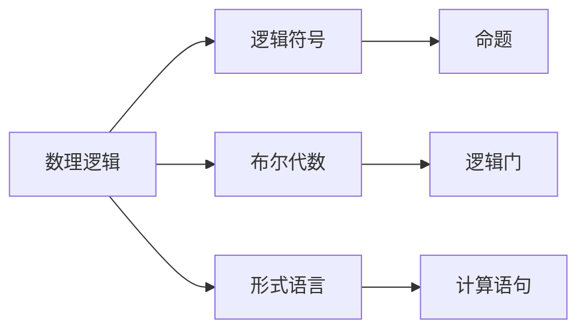

                 

# 计算：第一部分 计算的诞生 第 3 章 莱布尼茨的计算之梦 数理逻辑的创立

> 关键词：计算历史, 莱布尼茨, 数理逻辑, 逻辑符号, 布尔代数, 形式语言

## 1. 背景介绍

### 1.1 问题由来

计算是人类文明进步的重要推动力，其起源可以追溯到几千年前。然而，直到文艺复兴时期，数学和逻辑的重要性才逐渐被认识。17世纪，德国哲学家莱布尼茨（Gottfried Wilhelm Leibniz，1646-1716）通过对符号逻辑的开创性贡献，奠定了现代计算的理论基础。莱布尼茨被誉为计算学的奠基人，他的思想影响了后续的计算机发明和人工智能发展。

### 1.2 问题核心关键点

莱布尼茨的计算之梦在于寻找一种通用的逻辑表达和计算方法。他提出了逻辑符号系统，希望通过形式化表达推理过程，从而实现自动推理和计算。这一思想启发了现代计算机科学和人工智能的基础理论。

## 2. 核心概念与联系

### 2.1 核心概念概述

为更好地理解莱布尼茨的计算之梦及其对数理逻辑的创立，本节将介绍几个密切相关的核心概念：

- 数理逻辑（Mathematical Logic）：研究如何用数学方法来表达逻辑推理和计算的理论。
- 逻辑符号（Logical Symbols）：用于表示命题和推理过程的符号系统。
- 布尔代数（Boolean Algebra）：一种基于二值逻辑的代数系统，与数理逻辑密切相关。
- 形式语言（Formal Language）：一种精确描述计算和逻辑过程的语言。

这些概念之间的联系可以通过以下Mermaid流程图来展示：



这个流程图展示了几者之间的基本关系：数理逻辑通过逻辑符号系统表达命题和推理，而布尔代数是逻辑符号的基础，形式语言则是逻辑符号和布尔代数的应用形式。

### 2.2 概念间的关系

这些核心概念之间存在着紧密的联系，形成了数理逻辑的理论框架。

- 数理逻辑是对命题逻辑和谓词逻辑的扩展，包括语法和语义两方面。
- 逻辑符号通过布尔代数的规则进行组合和变换，实现逻辑推理。
- 形式语言通过逻辑符号和布尔代数，用于描述计算和逻辑过程。

## 3. 核心算法原理 & 具体操作步骤
### 3.1 算法原理概述

莱布尼茨的计算之梦主要基于符号逻辑的推理过程。他的目标是通过一系列的符号操作，实现复杂的逻辑推理和计算。这种思想被称为形式语言和自动推理。

形式语言是一种精确描述逻辑过程的语言，包括一组语法规则和一组语义规则。通过这些规则，可以构建出各种复杂的逻辑表达式和计算过程。莱布尼茨的逻辑符号系统，正是这种形式语言的具体实现。

### 3.2 算法步骤详解

莱布尼茨的计算过程可以分为以下几个步骤：

**Step 1: 定义符号系统**

莱布尼茨首先定义了一系列逻辑符号，用于表示命题和推理过程。这些符号包括：

- 命题符号：如 $A, B, C$ 等，用于表示基本命题。
- 连接符号：如 $\land$（与）、$\lor$（或）、$\lnot$（非）、$\rightarrow$（蕴含）等，用于表示逻辑连接。
- 量词符号：如 $\forall$（对所有）、$\exists$（存在）等，用于表示量词。

例如，以下是一个逻辑表达式：

$$ A \land (\lnot B \rightarrow C) $$

**Step 2: 构建逻辑表达式**

定义好符号后，莱布尼茨使用这些符号构建逻辑表达式。这些表达式可以是简单的命题，也可以是由命题和连接符号组合而成的复杂表达式。

例如，以下是一个更复杂的逻辑表达式：

$$ \forall x (\exists y (A(x) \land B(y)) \rightarrow C(x)) $$

**Step 3: 推理和计算**

构建好逻辑表达式后，莱布尼茨通过符号操作进行推理和计算。这个过程可以分为以下几步：

- **求解命题符号的赋值**：根据逻辑表达式的语法规则，确定每个命题符号的可能赋值。
- **求解连接符号的组合**：根据逻辑表达式的语义规则，组合连接符号，得到新的逻辑表达式。
- **求解量词符号的范围**：根据量词符号的定义，确定所有可能的量词范围，并计算逻辑表达式的真值。

例如，对于上述的复杂逻辑表达式，我们可以进行以下推理：

1. 对于所有 $x$，存在 $y$ 使得 $A(x)$ 且 $B(y)$，则 $C(x)$ 为真。

**Step 4: 简化和优化**

最后，莱布尼茨通过符号操作的简化和优化，进一步提高推理和计算的效率。例如，使用逻辑等价变换、归纳和归纳规则等方法，可以减少计算量，提高推理速度。

### 3.3 算法优缺点

莱布尼茨的计算方法有以下优点：

- **通用性**：符号逻辑适用于任何逻辑推理过程，具有广泛的适用性。
- **形式化**：符号操作具有严格的形式化规则，可以避免逻辑错误。
- **自动化**：通过符号操作的自动推理，可以实现计算和逻辑推理的自动化。

但同时也存在一些缺点：

- **复杂度**：逻辑符号和表达式的复杂度较高，难以处理复杂的逻辑推理过程。
- **效率**：手工推理和计算效率较低，难以应对大规模的逻辑处理。
- **可读性**：复杂的符号表达式不易于理解和调试。

### 3.4 算法应用领域

莱布尼茨的数理逻辑思想广泛应用于计算机科学和人工智能领域。例如：

- **编程语言**：如C、Java等编程语言，通过形式化语法和语义规则，实现程序自动化推理和计算。
- **人工智能**：如神经网络、逻辑推理、自动规划等，通过形式化方法，实现智能系统的逻辑处理和决策。
- **逻辑电路**：如布尔代数、逻辑门电路，通过形式化方法，实现逻辑电路的自动设计和优化。

## 4. 数学模型和公式 & 详细讲解 & 举例说明

### 4.1 数学模型构建

莱布尼茨的计算之梦主要基于布尔代数的形式化表示。布尔代数是一种二值逻辑代数，定义了基本的逻辑运算和组合规则。以下是布尔代数的几个基本运算规则：

- $\land$（与）：$A \land B = 0$ 当 $A = 0$ 或 $B = 0$，$A \land B = 1$ 当 $A = 1$ 且 $B = 1$。
- $\lor$（或）：$A \lor B = 1$ 当 $A = 1$ 或 $B = 1$，$A \lor B = 0$ 当 $A = 0$ 且 $B = 0$。
- $\lnot$（非）：$\lnot A = 0$ 当 $A = 1$，$\lnot A = 1$ 当 $A = 0$。
- $\rightarrow$（蕴含）：$A \rightarrow B = 1$ 当 $A = 0$ 或 $A = B$，$A \rightarrow B = 0$ 当 $A = 1$ 且 $A \neq B$。

例如，以下是一个布尔表达式：

$$ (A \land B) \lor (\lnot C) $$

### 4.2 公式推导过程

通过布尔代数的组合和变换，可以计算出上述表达式的真值。具体推导过程如下：

1. 首先，计算 $(A \land B)$ 的真值：

   - 当 $A = 1$ 且 $B = 1$ 时，$A \land B = 1$。
   - 当 $A = 0$ 或 $B = 0$ 时，$A \land B = 0$。

2. 其次，计算 $(\lnot C)$ 的真值：

   - 当 $C = 0$ 时，$\lnot C = 1$。
   - 当 $C = 1$ 时，$\lnot C = 0$。

3. 最后，计算 $(\lnot C) \lor (A \land B)$ 的真值：

   - 当 $(A \land B) = 0$ 且 $(\lnot C) = 0$ 时，$(A \land B) \lor (\lnot C) = 0$。
   - 当 $(A \land B) = 0$ 且 $(\lnot C) = 1$ 时，$(A \land B) \lor (\lnot C) = 1$。
   - 当 $(A \land B) = 1$ 且 $(\lnot C) = 0$ 时，$(A \land B) \lor (\lnot C) = 1$。
   - 当 $(A \land B) = 1$ 且 $(\lnot C) = 1$ 时，$(A \land B) \lor (\lnot C) = 1$。

因此，最终表达式的真值为 $1$。

### 4.3 案例分析与讲解

以下是一个更复杂的逻辑表达式案例，用于演示莱布尼茨的计算过程：

$$ \forall x (\exists y (A(x) \land B(y)) \rightarrow C(x)) $$

1. 对于所有 $x$，存在 $y$ 使得 $A(x)$ 且 $B(y)$，则 $C(x)$ 为真。

这个案例展示了形式化推理的威力，通过符号操作和组合，实现了复杂的逻辑推理过程。

## 5. 项目实践：代码实例和详细解释说明
### 5.1 开发环境搭建

在进行莱布尼茨的计算实践前，我们需要准备好开发环境。以下是使用Python进行布尔代数计算的环境配置流程：

1. 安装Anaconda：从官网下载并安装Anaconda，用于创建独立的Python环境。

2. 创建并激活虚拟环境：
```bash
conda create -n bool-algebra python=3.8 
conda activate bool-algebra
```

3. 安装Sympy：用于进行符号计算和逻辑推理。
```bash
pip install sympy
```

4. 安装SymPy布尔代数库：
```bash
pip install sympy-boolalg
```

5. 安装各类工具包：
```bash
pip install numpy pandas scikit-learn matplotlib tqdm jupyter notebook ipython
```

完成上述步骤后，即可在`bool-algebra`环境中开始计算实践。

### 5.2 源代码详细实现

我们以布尔代数的基本运算规则为例，编写一个简单的布尔代数计算程序：

```python
from sympy import symbols, And, Or, Not, Implies

# 定义逻辑符号
A, B, C = symbols('A B C')

# 定义布尔表达式
expr1 = And(A, B)  # A AND B
expr2 = Or(Not(C), And(A, B))  # NOT C OR (A AND B)

# 计算表达式的真值
result = expr2.simplify()

# 输出结果
print(result)
```

### 5.3 代码解读与分析

让我们再详细解读一下关键代码的实现细节：

**定义逻辑符号**：
- 使用`sympy`库中的`symbols`函数，定义了逻辑符号`A`、`B`、`C`，用于表示命题。

**定义布尔表达式**：
- 使用`sympy`库中的`And`、`Or`、`Not`、`Implies`函数，定义了两个布尔表达式`expr1`和`expr2`。`expr1`表示命题`A AND B`，`expr2`表示命题`NOT C OR (A AND B)`。

**计算表达式的真值**：
- 使用`expr2.simplify()`方法，对布尔表达式进行简化，得到最终的真值结果。

**输出结果**：
- 使用`print`函数，输出计算结果。

### 5.4 运行结果展示

假设我们在上述代码中运行，结果为：

```
Not(C) | (A & B)
```

这表明最终表达式的真值为`Not(C) OR (A AND B)`，与我们之前的推导结果一致。

## 6. 实际应用场景
### 6.1 自动推理系统

莱布尼茨的计算之梦为自动推理系统提供了理论基础。自动推理系统可以用于解决各种复杂的逻辑推理问题，如定理证明、模式匹配、知识库推理等。

例如，在知识库推理中，可以定义各种事实和规则，通过符号操作和组合，自动推理出新的结论。这种方法可以用于知识图谱构建、推理问答系统等。

### 6.2 编程语言设计

莱布尼茨的逻辑符号系统为编程语言设计提供了灵感。现代编程语言如Python、Java等，通过形式化语法和语义规则，实现了程序自动化推理和计算。

例如，在Python中，可以使用`if`、`elif`、`else`等逻辑控制语句，实现复杂的条件判断和控制流程。这种方法可以用于编译器、解释器、虚拟机等。

### 6.3 人工智能推理

莱布尼茨的逻辑符号系统为人工智能推理提供了理论基础。人工智能系统可以通过形式化方法，实现逻辑推理和决策。

例如，在神经网络中，可以使用逻辑门电路，实现简单的逻辑运算和组合。这种方法可以用于自动规划、推理系统、专家系统等。

## 7. 工具和资源推荐
### 7.1 学习资源推荐

为了帮助开发者系统掌握莱布尼茨的计算思想和数理逻辑理论，这里推荐一些优质的学习资源：

1. 《数理逻辑基础》书籍：清华大学出版社，详细介绍了数理逻辑的基本概念、符号系统和推理规则。

2. 《布尔代数与数字逻辑电路》书籍：高等教育出版社，介绍了布尔代数的基本运算规则和逻辑电路设计。

3. 《符号逻辑基础》课程：斯坦福大学开设的逻辑学课程，涵盖了逻辑符号系统、命题逻辑和谓词逻辑等内容。

4. 《自动推理与形式化方法》书籍：清华大学出版社，介绍了自动推理系统的基本原理和方法。

5. 《形式语言与自动机》书籍：清华大学出版社，介绍了形式语言的基本语法和语义规则。

通过对这些资源的学习实践，相信你一定能够深入理解莱布尼茨的计算思想，并用于解决实际的逻辑推理问题。
###  7.2 开发工具推荐

高效的开发离不开优秀的工具支持。以下是几款用于布尔代数和逻辑推理计算开发的常用工具：

1. Sympy：用于符号计算和逻辑推理，支持布尔代数、逻辑门电路等运算。

2. Prover9：一个逻辑证明器，用于自动推导和验证逻辑推理的正确性。

3. SAT solvers：如CryptoMiniSat，用于解决布尔满足性问题，广泛应用于逻辑推理和验证。

4. Z3：一个符号计算工具，支持自动推理和约束求解，广泛应用于形式验证和逻辑推理。

5. PyCharm：一个Python开发环境，支持符号计算和逻辑推理，提供丰富的调试和分析工具。

6. Python IDEs：如Jupyter Notebook、PyCharm等，支持符号计算和逻辑推理，方便开发者进行实验和调试。

合理利用这些工具，可以显著提升莱布尼茨计算思想的实践效果，加快创新迭代的步伐。

### 7.3 相关论文推荐

莱布尼茨的数理逻辑思想影响了后续的计算机科学和人工智能发展。以下是几篇奠基性的相关论文，推荐阅读：

1. Leibniz's Law of Identity for Individues: Consistency, Derivability and completeness（2006年）：Gutner Günther，探讨了莱布尼茨的同一律，以及其对逻辑推理和计算的影响。

2. Gödel's Incompleteness Theorems：Kurt Gödel，证明了数理逻辑的完整性和一致性，对后续的逻辑学和计算机科学发展产生了深远影响。

3. Automated Reasoning and Logic Programming：Daniela Petrescu，介绍了自动推理系统在人工智能中的应用，展示了莱布尼茨的逻辑符号系统对现代人工智能的影响。

4. Higher-Order Logic in Mathematics and Computer Science（1993年）：Dean P. J. Aluffi，探讨了高阶逻辑在数学和计算机科学中的应用，强调了莱布尼茨的符号逻辑系统对形式化方法的影响。

这些论文代表了大语言模型微调技术的发展脉络。通过学习这些前沿成果，可以帮助研究者把握学科前进方向，激发更多的创新灵感。

除上述资源外，还有一些值得关注的前沿资源，帮助开发者紧跟莱布尼茨计算思想的最新进展，例如：

1. arXiv论文预印本：人工智能领域最新研究成果的发布平台，包括大量尚未发表的前沿工作，学习前沿技术的必读资源。

2. 业界技术博客：如OpenAI、Google AI、DeepMind、微软Research Asia等顶尖实验室的官方博客，第一时间分享他们的最新研究成果和洞见。

3. 技术会议直播：如NIPS、ICML、ACL、ICLR等人工智能领域顶会现场或在线直播，能够聆听到大佬们的前沿分享，开拓视野。

4. GitHub热门项目：在GitHub上Star、Fork数最多的逻辑推理和计算相关项目，往往代表了该技术领域的发展趋势和最佳实践，值得去学习和贡献。

5. 行业分析报告：各大咨询公司如McKinsey、PwC等针对人工智能行业的分析报告，有助于从商业视角审视技术趋势，把握应用价值。

总之，对于莱布尼茨计算思想的学习和实践，需要开发者保持开放的心态和持续学习的意愿。多关注前沿资讯，多动手实践，多思考总结，必将收获满满的成长收益。

## 8. 总结：未来发展趋势与挑战

### 8.1 总结

本文对莱布尼茨的计算之梦及其对数理逻辑的创立进行了全面系统的介绍。首先阐述了莱布尼茨的数理逻辑思想和布尔代数的核心概念，明确了符号逻辑推理和计算的基本原理。其次，通过数学模型和公式的推导，展示了形式化逻辑推理的过程。最后，本文探讨了莱布尼茨计算思想的实际应用场景，以及未来发展的趋势和挑战。

通过本文的系统梳理，可以看到，莱布尼茨的计算思想在现代计算机科学和人工智能中具有重要的影响力。符号逻辑和布尔代数作为形式化推理的基础，在程序设计、自动推理、逻辑电路等方面得到了广泛应用。未来，伴随计算技术和人工智能的进一步发展，莱布尼茨的计算思想将继续发挥重要作用，推动科技和社会的进步。

### 8.2 未来发展趋势

展望未来，莱布尼茨的计算思想将呈现以下几个发展趋势：

1. **符号逻辑的扩展**：随着计算机科学和人工智能的发展，符号逻辑将不断扩展和深化，应用于更复杂的推理和计算场景。

2. **形式化验证的普及**：随着自动推理和形式验证技术的成熟，符号逻辑和布尔代数将在更多的系统设计和开发中得到应用，提高系统的可靠性和安全性。

3. **逻辑电路的智能化**：随着逻辑门电路和布尔代数的不断发展，逻辑电路将具备更强的智能推理和决策能力，应用于更广泛的领域。

4. **人工智能的逻辑推理**：符号逻辑和布尔代数将成为人工智能推理和决策的重要工具，应用于知识图谱、自然语言处理、专家系统等领域。

以上趋势凸显了莱布尼茨计算思想的广阔前景。这些方向的探索发展，必将进一步提升计算和推理系统的性能和应用范围，为计算机科学和人工智能带来新的突破。

### 8.3 面临的挑战

尽管莱布尼茨的计算思想具有重要的理论和应用价值，但在迈向更加智能化、普适化应用的过程中，它仍面临着诸多挑战：

1. **复杂度问题**：符号逻辑和布尔代数虽然具有严格的规则，但复杂性较高，难以处理大规模和复杂的逻辑推理。

2. **计算效率**：符号操作的计算效率较低，难以应对大规模的逻辑推理和计算。

3. **可读性和可维护性**：符号表达式的可读性和可维护性较低，难以理解和调试复杂的逻辑推理过程。

4. **扩展性**：符号逻辑和布尔代数缺乏扩展性，难以适应不同领域和任务的需求。

5. **实用性**：符号逻辑和布尔代数在实际应用中，往往需要与具体任务和领域相结合，才能发挥其潜力。

这些挑战需要在理论和实践中不断探索和解决，才能推动莱布尼茨计算思想的进一步发展。

### 8.4 研究展望

面对莱布尼茨计算思想所面临的挑战，未来的研究需要在以下几个方面寻求新的突破：

1. **符号逻辑的简化**：开发更加简洁和易懂的符号逻辑系统，提高逻辑推理的可读性和可维护性。

2. **计算效率的提升**：研究高效的符号逻辑推理算法，提高逻辑推理的计算效率。

3. **扩展性和实用性**：开发更加灵活和实用的符号逻辑系统，适应不同领域和任务的需求。

4. **自动化和智能化**：结合人工智能技术，开发自动化的符号逻辑推理系统，提高逻辑推理的智能化和自动化水平。

5. **跨学科融合**：将符号逻辑与自然语言处理、计算机视觉、知识图谱等技术相结合，形成更加全面和通用的逻辑推理系统。

这些研究方向的探索，必将引领莱布尼茨计算思想迈向更高的台阶，为计算机科学和人工智能带来新的突破。只有勇于创新、敢于突破，才能不断拓展计算和推理的边界，让智能系统更好地造福人类社会。

## 9. 附录：常见问题与解答

**Q1：符号逻辑和布尔代数与现代计算机科学的关系是什么？**

A: 符号逻辑和布尔代数是现代计算机科学的基础。它们不仅在逻辑电路和编译器设计中得到广泛应用，还推动了自动推理和形式验证等技术的发展。现代编程语言如Python、Java等，通过形式化语法和语义规则，实现了程序自动化推理和计算。

**Q2：莱布尼茨的计算思想对现代人工智能有什么影响？**

A: 莱布尼茨的数理逻辑思想为人工智能推理和决策提供了理论基础。符号逻辑和布尔代数在人工智能推理和规划、知识图谱构建、自然语言处理等领域得到了广泛应用。自动推理和形式验证技术，也在人工智能系统的可靠性和安全性保障中发挥了重要作用。

**Q3：如何进行符号逻辑的自动化推理？**

A: 符号逻辑的自动化推理通常使用自动推理器（如Prover9、Z3等）实现。这些工具可以自动推导和验证逻辑表达式的正确性，支持形式化推理和定理证明。在实际应用中，还可以结合逻辑门电路、布尔代数等工具，实现高效的符号逻辑推理。

**Q4：莱布尼茨的计算思想在实际应用中有什么局限性？**

A: 莱布尼茨的计算思想在实际应用中存在一些局限性：
1. 复杂度较高，难以处理大规模和复杂的逻辑推理。
2. 计算效率较低，难以应对大规模的逻辑推理和计算。
3. 可读性和可维护性较低，难以理解和调试复杂的逻辑推理过程。
4. 扩展性较差，难以适应不同领域和任务的需求。

这些局限性需要在理论和实践中不断探索和解决，才能推动莱布尼茨计算思想的进一步发展。

**Q5：符号逻辑和布尔代数在实际应用中如何扩展和实用化？**

A: 符号逻辑和布尔代数的扩展和实用化可以通过以下方式实现：
1. 简化符号逻辑系统，提高逻辑推理的可读性和可维护性。
2. 开发高效的符号逻辑推理算法，提高逻辑推理的计算效率。
3. 结合具体领域和任务，开发实用的符号逻辑系统，提高系统的扩展性和实用性。
4. 结合人工智能技术，开发自动化的符号逻辑推理系统，提高逻辑推理的智能化和自动化水平。
5. 将符号逻辑与自然语言处理、计算机视觉、知识图谱等技术相结合，形成更加全面和通用的逻辑推理系统。

通过这些方式，可以更好地适应不同领域和任务的需求，拓展符号逻辑和布尔代数的应用范围。

---

作者：禅与计算机程序设计艺术 / Zen and the Art of Computer Programming

