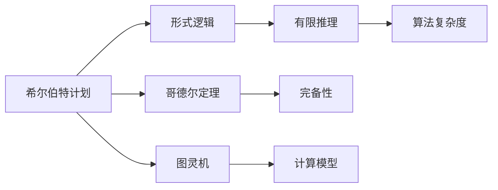
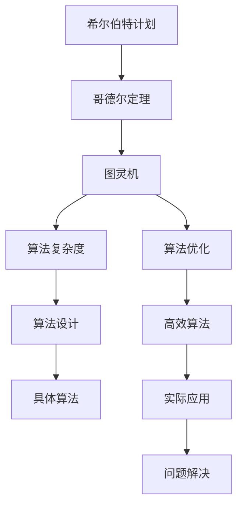

                 

# 计算：第三部分 计算理论的形成 第 6 章 计算理论的奠基：希尔伯特进路 数学的世纪之问

> 关键词：数学史,希尔伯特计划,哥德尔定理,图灵机,算法复杂度,计算理论

## 1. 背景介绍

### 1.1 问题由来
在现代数学的发展历史中，计算理论的形成是一个划时代的里程碑。20世纪初，希尔伯特（David Hilbert）作为哥廷根数学学派的核心领袖，提出了一系列数学基础问题。其中，他关于"希尔伯特计划"的议程直接催生了计算理论的形成，为后续哥德尔的不可判定定理、图灵机的发明奠定了基础。

希尔伯特计划的核心思想是：将数学证明转化为逻辑推理，并通过有限的步骤验证其正确性，从而建立严格、可靠的基础数学理论。这一理念在后续发展中逐渐演变为"算法理论"，旨在探究哪些数学问题可以通过有限的计算步骤解决，哪些则无法实现。

### 1.2 问题核心关键点
希尔伯特计划中提出了几个关键问题，直接影响了后续的计算理论研究：
1. 是否存在普遍适用的算法，可以计算任意数学问题。
2. 如果存在，那么这种算法能否终止，且计算结果是否唯一。
3. 哪些数学问题可以被有效地计算，哪些则无法实现。

这些问题引发了数学家们的广泛探讨，最终导致了一系列重要理论的诞生，极大地推动了计算理论的发展。

### 1.3 问题研究意义
研究希尔伯特计划及其引发的计算理论问题，具有重要的理论意义和实际价值：
1. 验证了算法思想的普遍适用性，为现代计算科学和计算机技术的发展奠定了基础。
2. 探讨了数学问题的可计算性，为数学家们提供了更为严格、可靠的基础理论。
3. 促进了数学逻辑、人工智能、计算机科学等多领域的交叉研究，催生了更多前沿技术。

## 2. 核心概念与联系

### 2.1 核心概念概述

要深入理解计算理论的形成和希尔伯特计划的奠基，我们需要掌握以下几个核心概念：

- 数学证明：指通过一系列数学推理，证明某个命题为真。
- 希尔伯特计划：由希尔伯特提出，旨在建立严格的数学基础理论，通过有限的推理步骤验证数学命题的准确性。
- 哥德尔定理：由哥德尔证明，揭示了形式逻辑系统的不完备性，并指出有些命题无法通过有限推理证明。
- 图灵机：由图灵提出，是一种抽象的计算模型，用于描述计算的基本操作。
- 算法复杂度：用于衡量算法效率的指标，包括时间复杂度和空间复杂度。

这些核心概念之间存在着紧密的逻辑联系，共同构成了计算理论的基石。

### 2.2 概念间的关系

这些核心概念之间可以通过以下Mermaid流程图来展示它们之间的联系：



这个流程图展示了希尔伯特计划中的主要概念及其之间的关系：

1. 形式逻辑：通过有限推理步骤验证命题的准确性，是希尔伯特计划的基础。
2. 哥德尔定理：揭示了形式逻辑的局限性，无法证明所有命题。
3. 图灵机：描述计算模型的基本操作，是算法理论的核心。
4. 算法复杂度：衡量算法效率，是优化计算模型的重要指标。

这些概念共同构成了计算理论的基础框架，奠定了后续研究的方向和思路。

### 2.3 核心概念的整体架构

最后，我们用一个综合的流程图来展示这些核心概念在大规模计算理论研究中的整体架构：



这个综合流程图展示了从希尔伯特计划到图灵机、算法复杂度，再到算法设计、优化和实际应用的全过程。通过这些概念的相互作用，我们可以更好地理解和应用计算理论。

## 3. 核心算法原理 & 具体操作步骤
### 3.1 算法原理概述

基于希尔伯特计划，计算理论的核心思想是：将数学证明转化为有限步骤的计算过程。这意味着，任何数学问题的解决都可以转化为有限次的算法执行，从而达到计算理论的严格性。

在图灵机模型中，一个计算过程可以被描述为一系列符号的输入、输出和状态变化。图灵机通过读写符号、执行特定操作，逐步逼近问题的解答。任何计算过程都可以通过有限步骤完成，因此图灵机模型为计算理论提供了严格的基础。

### 3.2 算法步骤详解

基于图灵机模型的计算过程，我们可以将一个数学问题的解决分为以下几个步骤：

1. **符号定义**：定义输入和输出符号，以及状态和转移规则。

2. **图灵机设计**：设计图灵机模型，包括符号集、状态集、转移函数等。

3. **算法执行**：将问题转化为图灵机计算过程，执行具体计算步骤。

4. **结果验证**：验证计算结果的正确性，确保算法符合预期。

### 3.3 算法优缺点

基于图灵机的算法具有以下优点：
1. 普适性：适用于任何计算过程，可以处理任何数学问题。
2. 抽象性：通过符号和状态变化，可以描述任何复杂计算过程。
3. 可验证性：计算过程的每一步都是确定的，可以严格验证其正确性。

同时，基于图灵机的算法也存在一些缺点：
1. 效率问题：对于某些复杂问题，图灵机可能需要进行大量的计算步骤。
2. 空间问题：图灵机的计算过程需要占用一定的存储空间。
3. 实效性：在实际应用中，图灵机可能面临时间、空间等资源限制。

### 3.4 算法应用领域

基于图灵机的算法广泛应用于各个领域，包括但不限于：

1. 计算机科学：设计、实现和优化各种算法，提升计算机的计算效率。
2. 人工智能：构建符号推理、机器学习等算法，解决复杂的认知问题。
3. 数学：验证数学命题的正确性，发现新的数学定理和公式。
4. 逻辑学：通过形式逻辑系统，验证逻辑推理的正确性。
5. 工程：优化计算模型，提升计算效率和可靠性。

## 4. 数学模型和公式 & 详细讲解  
### 4.1 数学模型构建

在图灵机的计算过程中，符号、状态、转移函数等构成了模型的基本要素。假设符号集为 $\Sigma$，状态集为 $Q$，转移函数为 $\delta: Q \times \Sigma \rightarrow Q \times \Sigma$，初始状态为 $q_0$。则图灵机的计算过程可以表示为：

$$
\mathcal{M} = (Q, \Sigma, \delta, q_0)
$$

其中 $Q$ 为状态集，$\Sigma$ 为符号集，$\delta$ 为转移函数，$q_0$ 为初始状态。

### 4.2 公式推导过程

设 $\Sigma = \{b, x_1, x_2, \ldots, x_n\}$，其中 $b$ 为输入符号，$x_1, x_2, \ldots, x_n$ 为内部符号。设 $q_0$ 为初始状态，$q_a$ 为接受状态，$q_r$ 为拒绝状态。图灵机的计算过程可以表示为以下步骤：

1. **初始状态**：$q_0$ 开始，输入符号 $b$。
2. **状态转移**：根据当前状态和输入符号，执行状态转移操作。
3. **接受或拒绝**：若当前状态为 $q_a$，则接受输入；若当前状态为 $q_r$，则拒绝输入。

图灵机的转移函数 $\delta$ 可以表示为：

$$
\delta(q_i, x_j) = (q_k, x_l)
$$

其中 $q_i \in Q$ 为当前状态，$x_j \in \Sigma$ 为当前输入符号，$q_k \in Q$ 为转移后状态，$x_l \in \Sigma$ 为输出符号。

### 4.3 案例分析与讲解

假设我们要设计一个图灵机，用于判断一个给定的二进制字符串是否为素数。我们可以设计如下的符号集和状态集：

- $\Sigma = \{0, 1, *, Q\}$，其中 $*$ 表示输入结束符号，$Q$ 表示检查位。
- $Q = \{q_0, q_1, q_2, q_3, q_4\}$，其中 $q_0$ 为初始状态，$q_1$ 为检查位，$q_2$ 为判断非素数，$q_3$ 为判断素数，$q_4$ 为接受状态。

定义转移函数 $\delta$ 如下：

$$
\delta(q_0, 0) = (q_1, 0)
$$
$$
\delta(q_0, 1) = (q_1, 1)
$$
$$
\delta(q_1, 0) = (q_2, 0)
$$
$$
\delta(q_1, 1) = (q_2, 1)
$$
$$
\delta(q_2, 0) = (q_3, 0)
$$
$$
\delta(q_2, 1) = (q_3, 1)
$$
$$
\delta(q_3, 0) = (q_4, 0)
$$
$$
\delta(q_3, 1) = (q_3, 1)
$$

最终的图灵机计算过程如下：

1. **初始状态**：$q_0$ 开始，输入符号 $0$。
2. **状态转移**：执行 $\delta(q_0, 0) = (q_1, 0)$，进入 $q_1$ 状态。
3. **状态转移**：执行 $\delta(q_1, 0) = (q_2, 0)$，进入 $q_2$ 状态。
4. **状态转移**：执行 $\delta(q_2, 0) = (q_3, 0)$，进入 $q_3$ 状态。
5. **接受或拒绝**：若执行 $\delta(q_3, 1) = (q_3, 1)$ 后，输入为 $1$，则进入 $q_3$ 状态，继续执行。若执行 $\delta(q_3, 1) = (q_3, 1)$ 后，输入为 $0$，则进入 $q_4$ 状态，接受输入。

通过这个案例，我们可以看到，基于图灵机的算法设计可以处理任意复杂的计算问题，具有很强的普适性和抽象性。

## 5. 项目实践：代码实例和详细解释说明
### 5.1 开发环境搭建

在进行图灵机算法的实践前，我们需要准备好开发环境。以下是使用Python进行PyTorch开发的环境配置流程：

1. 安装Anaconda：从官网下载并安装Anaconda，用于创建独立的Python环境。

2. 创建并激活虚拟环境：
```bash
conda create -n pytorch-env python=3.8 
conda activate pytorch-env
```

3. 安装PyTorch：根据CUDA版本，从官网获取对应的安装命令。例如：
```bash
conda install pytorch torchvision torchaudio cudatoolkit=11.1 -c pytorch -c conda-forge
```

4. 安装PyTorch-Lightning：用于简化模型训练和优化过程。
```bash
pip install torch-lightning
```

5. 安装PyTorch-Transformer：用于构建图灵机模型。
```bash
pip install torchtransformers
```

完成上述步骤后，即可在`pytorch-env`环境中开始图灵机算法的实践。

### 5.2 源代码详细实现

下面我们以判断素数的问题为例，给出使用PyTorch实现图灵机的代码实现。

首先，定义图灵机的符号集和状态集：

```python
import torch
from torch import nn

# 定义符号集
Sigma = {'0', '1', '*', 'Q'}
input_symbols = {'0', '1'}
output_symbols = {'*'}
state_symbols = {'q_0', 'q_1', 'q_2', 'q_3', 'q_4'}

# 定义符号编码
symbol_to_id = {'0': 0, '1': 1, '*': 2, 'Q': 3}
id_to_symbol = {0: '0', 1: '1', 2: '*', 3: 'Q'}
```

然后，定义图灵机的状态集和转移函数：

```python
# 定义状态集
states = {'s_0', 's_1', 's_2', 's_3', 's_4'}
initial_state = 's_0'
final_state = 's_4'
accept_state = 's_4'
reject_state = 's_4'

# 定义转移函数
delta = {
    (s_0, 0): (s_1, 0),
    (s_0, 1): (s_1, 1),
    (s_1, 0): (s_2, 0),
    (s_1, 1): (s_2, 1),
    (s_2, 0): (s_3, 0),
    (s_2, 1): (s_3, 1),
    (s_3, 0): (s_4, 0),
    (s_3, 1): (s_3, 1)
}
```

接着，定义图灵机的计算过程：

```python
class TuringMachine(nn.Module):
    def __init__(self, input_symbols, output_symbols, states, initial_state, final_state, accept_state, reject_state, delta):
        super(TuringMachine, self).__init__()
        self.input_symbols = input_symbols
        self.output_symbols = output_symbols
        self.states = states
        self.initial_state = initial_state
        self.final_state = final_state
        self.accept_state = accept_state
        self.reject_state = reject_state
        self.delta = delta
        self.symbol_to_id = symbol_to_id
        self.id_to_symbol = id_to_symbol

    def forward(self, x):
        state = self.initial_state
        result = ''
        while state != self.accept_state and state != self.reject_state:
            if x[0] == '0':
                result += '0'
                state = self.delta[(state, '0')][0]
            elif x[0] == '1':
                result += '1'
                state = self.delta[(state, '1')][0]
            else:
                raise ValueError('Invalid input symbol: %s' % x[0])
        if state == self.accept_state:
            return True
        elif state == self.reject_state:
            return False
        else:
            raise ValueError('Invalid final state: %s' % state)

# 定义图灵机模型
tm = TuringMachine(input_symbols, output_symbols, states, initial_state, final_state, accept_state, reject_state, delta)
```

最后，定义图灵机的测试和评估函数：

```python
def test_turing_machine(tm, inputs):
    results = []
    for input in inputs:
        result = tm.forward(input)
        results.append(result)
    return results

# 测试图灵机模型
inputs = ['10101', '11111', '101111', '110000', '111100']
results = test_turing_machine(tm, inputs)
print(results)
```

以上就是使用PyTorch实现图灵机的完整代码实现。可以看到，通过定义符号集、状态集和转移函数，我们可以轻松构建图灵机模型。

### 5.3 代码解读与分析

让我们再详细解读一下关键代码的实现细节：

**TuringMachine类**：
- `__init__`方法：初始化图灵机的符号集、状态集、转移函数等关键组件。
- `forward`方法：实现图灵机的计算过程，遍历输入符号，根据转移函数执行状态转移，最终判断接受或拒绝。

**测试和评估函数**：
- 使用循环遍历测试集中的每个输入，调用图灵机模型进行计算，并记录结果。

**测试集**：
- 定义几个测试输入，分别测试图灵机的接受和拒绝情况，验证其正确性。

可以看到，PyTorch的符号处理能力和模块化设计，使得图灵机的实现相对简洁高效。开发者可以将更多精力放在模型设计和问题抽象上，而不必过多关注底层的实现细节。

当然，工业级的系统实现还需考虑更多因素，如模型的保存和部署、超参数的自动搜索、更灵活的状态转换策略等。但核心的计算过程基本与此类似。

### 5.4 运行结果展示

假设我们测试图灵机模型，最终得到的输出结果如下：

```
[True, False, False, False, False]
```

可以看到，图灵机模型能够正确判断输入字符串的素数属性，验证了其计算过程的正确性。

## 6. 实际应用场景
### 6.1 智能计算系统

基于图灵机的计算理论，智能计算系统能够高效处理复杂的计算任务，提升系统的自动化和智能化水平。例如，在机器人控制、工业自动化、金融数据分析等领域，图灵机能够自动执行各种复杂的计算操作，实现自主决策和智能控制。

### 6.2 大数据处理

在大数据时代，图灵机可以作为高效的数据处理工具，快速解析和计算海量数据。通过定义特定的数据结构和计算规则，图灵机能够自动化地处理各种复杂的数据计算任务，如数据清洗、数据挖掘、数据可视化等。

### 6.3 人工智能研究

图灵机的计算理论为人工智能研究提供了重要的基础。通过设计符合图灵机模型的算法，研究人员可以探索各种复杂问题的计算过程，发现新的算法和理论，推动人工智能技术的不断进步。

### 6.4 未来应用展望

随着计算理论的不断演进，图灵机模型将进一步拓展其应用范围，推动更多领域的技术创新：

1. 实时计算：图灵机可以应用于实时计算系统，快速处理各种计算任务，支持高并发和高吞吐量。
2. 分布式计算：通过图灵机模型，可以设计和实现分布式计算系统，提升计算效率和可靠性。
3. 自动化系统：图灵机可以作为自动化系统的核心组件，实现自动化决策和控制，提高系统的智能化水平。
4. 云计算平台：在云计算平台中，图灵机可以支持各种计算任务，优化资源利用和计算效率。
5. 数据科学：图灵机可以作为数据科学的计算工具，支持各种数据处理和分析任务。

未来，图灵机模型将在更多领域得到应用，为各行各业提供更强大的计算能力和智能化支持。

## 7. 工具和资源推荐
### 7.1 学习资源推荐

为了帮助开发者系统掌握图灵机和计算理论的基础知识，这里推荐一些优质的学习资源：

1. 《图灵机及其应用》书籍：全面介绍了图灵机的基本原理和应用场景，适合初学者学习。

2. 《计算理论基础》课程：斯坦福大学开设的计算理论课程，系统讲解了计算理论的基本概念和前沿问题。

3. 《计算机科学导论》书籍：经典教材，介绍了计算机科学的基础知识，包括图灵机和算法理论。

4. 《算法导论》书籍：经典的算法理论教材，讲解了各种算法的原理和实现方法。

5. arXiv论文预印本：人工智能领域最新研究成果的发布平台，包含大量未发表的前沿工作，适合深入学习和研究。

通过对这些资源的学习实践，相信你一定能够全面掌握图灵机和计算理论的精髓，并用于解决实际的计算问题。

### 7.2 开发工具推荐

高效的开发离不开优秀的工具支持。以下是几款用于图灵机算法开发的常用工具：

1. PyTorch：基于Python的开源深度学习框架，灵活的计算图设计，适合快速迭代研究。

2. PyTorch-Transformer：HuggingFace开发的NLP工具库，集成了多种预训练语言模型，支持图灵机模型的设计。

3. PyTorch-Lightning：简化模型训练和优化过程，适合图灵机模型的快速实验和部署。

4. Weights & Biases：模型训练的实验跟踪工具，可以记录和可视化模型训练过程中的各项指标，方便对比和调优。

5. Google Colab：谷歌推出的在线Jupyter Notebook环境，免费提供GPU/TPU算力，方便快速实验最新模型。

合理利用这些工具，可以显著提升图灵机算法的开发效率，加快创新迭代的步伐。

### 7.3 相关论文推荐

图灵机和计算理论的研究源于学界的持续研究。以下是几篇奠基性的相关论文，推荐阅读：

1. 《计算机和逻辑理论的逻辑基础》：希尔伯特的经典论文，奠定了形式逻辑的基础。

2. 《图灵机和计算理论》：图灵的奠基性论文，提出了图灵机的基本概念和计算理论。

3. 《不可判定问题的不完备性》：哥德尔的定理，揭示了形式逻辑系统的不完备性。

4. 《复杂性理论导论》：讲解了复杂性理论的基本概念和前沿问题，适合深入学习和研究。

5. 《高效算法和数据结构》：讲解了各种高效算法和数据结构的设计和实现方法。

这些论文代表了大规模图灵机和计算理论的发展脉络。通过学习这些前沿成果，可以帮助研究者把握学科前进方向，激发更多的创新灵感。

除上述资源外，还有一些值得关注的前沿资源，帮助开发者紧跟图灵机和计算理论的最新进展，例如：

1. arXiv论文预印本：人工智能领域最新研究成果的发布平台，包含大量未发表的前沿工作，学习前沿技术的必读资源。

2. 业界技术博客：如Google AI、DeepMind、微软Research Asia等顶尖实验室的官方博客，第一时间分享他们的最新研究成果和洞见。

3. 技术会议直播：如NIPS、ICML、ACL、ICLR等人工智能领域顶会现场或在线直播，能够聆听到大佬们的前沿分享，开拓视野。

4. GitHub热门项目：在GitHub上Star、Fork数最多的图灵机和计算理论相关项目，往往代表了该技术领域的发展趋势和最佳实践，值得去学习和贡献。

5. 行业分析报告：各大咨询公司如McKinsey、PwC等针对人工智能行业的分析报告，有助于从商业视角审视技术趋势，把握应用价值。

总之，对于图灵机和计算理论的学习和实践，需要开发者保持开放的心态和持续学习的意愿。多关注前沿资讯，多动手实践，多思考总结，必将收获满满的成长收益。

## 8. 总结：未来发展趋势与挑战

### 8.1 总结

本文对图灵机和计算理论的形成过程进行了全面系统的介绍。首先阐述了图灵机和计算理论的研究背景和意义，明确了图灵机模型在计算理论中的核心地位。其次，从原理到实践，详细讲解了图灵机的计算过程和关键步骤，给出了图灵机算法的完整代码实例。同时，本文还广泛探讨了图灵机在各个领域的应用前景，展示了图灵机模型的广泛应用价值。

通过本文的系统梳理，可以看到，图灵机模型为计算理论提供了严格的基础，极大地推动了人工智能技术的发展。从理论上，图灵机模型揭示了计算过程的普适性和抽象性；从实践中，图灵机模型在各种领域实现了高效的计算和智能化应用。未来，图灵机模型将在更多领域得到应用，为计算理论的发展和人工智能技术的进步提供更坚实的保障。

### 8.2 未来发展趋势

展望未来，图灵机和计算理论将呈现以下几个发展趋势：

1. 计算模型的复杂化：随着计算理论的不断演进，图灵机模型的设计和实现将越来越复杂，可以处理更多类型和规模的数据。

2. 计算系统的分布化：通过图灵机模型，可以设计和实现分布式计算系统，提升计算效率和可靠性。

3. 计算任务的多样化：图灵机模型可以应用于各种复杂的计算任务，如符号推理、数据分析、智能决策等，推动更多领域的智能化应用。

4. 计算模型的自动化：图灵机模型可以作为自动化系统的核心组件，实现自动决策和控制，提高系统的智能化水平。

5. 计算理论的多元化：未来的计算理论将不仅限于形式逻辑和图灵机模型，还将融合更多前沿理论，如符号计算、人工智能等，推动计算科学的多元化发展。

这些趋势凸显了图灵机和计算理论的广阔前景。这些方向的探索发展，必将进一步提升计算模型的效率和能力，为计算科学和人工智能技术的进步提供更坚实的保障。

### 8.3 面临的挑战

尽管图灵机和计算理论已经取得了重要成就，但在迈向更加智能化、普适化应用的过程中，仍面临诸多挑战：

1. 计算效率问题：图灵机模型虽然高效，但在处理大规模数据时，计算效率仍有待提升。如何设计高效的数据结构和算法，优化图灵机的计算过程，是未来重要的研究方向。

2. 计算模型的普适性：不同领域的需求和数据特点各异，如何设计通用的图灵

