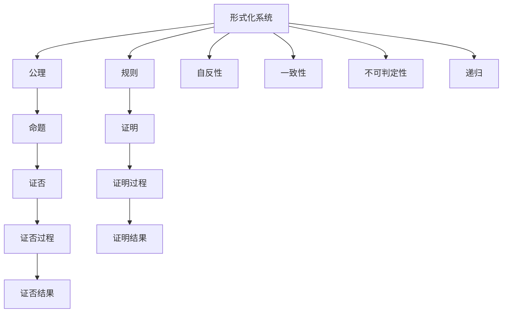
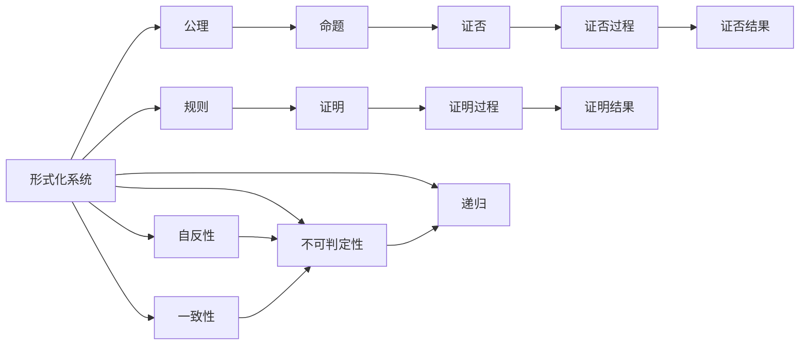
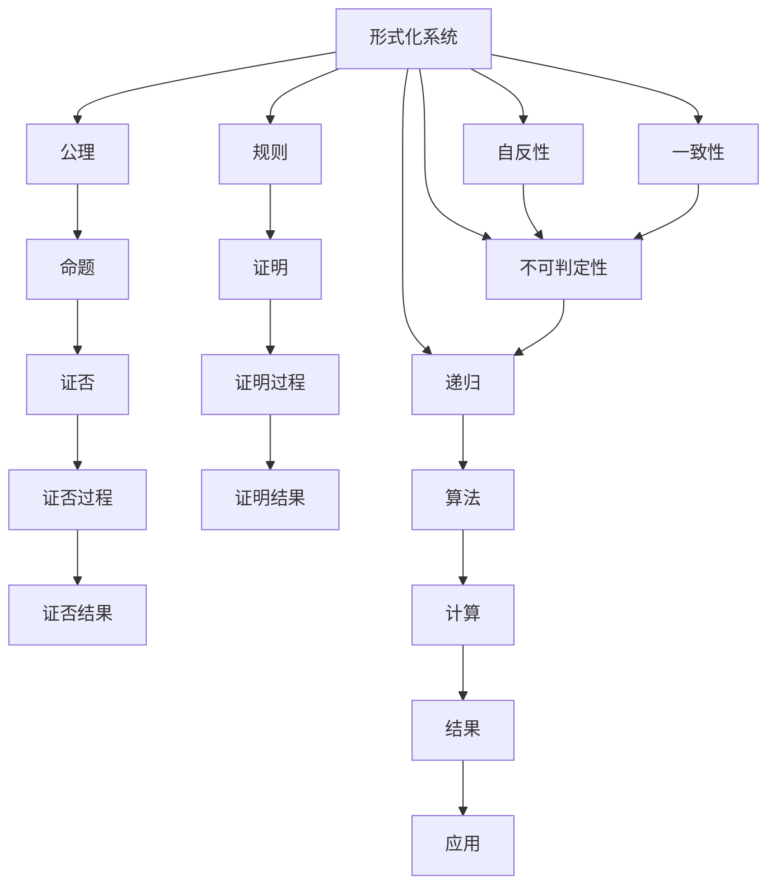

                 

## 1. 背景介绍

### 1.1 问题由来

哥德尔的不完备性定理（Gödel's incompleteness theorem）是数理逻辑和计算理论中一个里程碑式的成果。该定理揭示了形式化系统内部的固有局限性，尤其是对证明的完备性和一致性提出了根本性的挑战。哥德尔定理不仅对数学领域产生了深远影响，也激发了计算机科学对计算模型、算法、可证明性等基础问题的深入思考。

### 1.2 问题核心关键点

哥德尔定理的核心在于两个部分：
1. 任何非平凡的一致性形式化系统，如果在自身的语言中可以表达算术，则该系统是自反的，即存在一个既不能证明也不能证否的命题（即“哥德尔命题”）。
2. 任何形式化系统，包括算术系统在内，不可能证明其自身的一致性。

这两个结果分别挑战了数学中的形式化推理和证明的可靠性，对计算理论中对算法和程序的可证明性提出了新的理解。

### 1.3 问题研究意义

哥德尔的不完备性定理不仅为数学和逻辑学提供了一个全新的视角，也为计算机科学的基础理论研究提供了重要指导。其对算法、计算复杂度、自动定理证明等领域的研究具有重要启示作用。理解该定理不仅能深化对计算本质的认识，还能帮助我们在设计算法和程序时更谨慎地处理可证明性、一致性和鲁棒性等问题。

## 2. 核心概念与联系

### 2.1 核心概念概述

哥德尔定理涉及的主要概念包括：
1. **形式化系统**：由一组公理和规则构成的逻辑系统，其中公理和规则能够推导出系统中所有命题。
2. **自反性**：形式化系统中，若存在一个命题既不能被证明也不能被证否，则该系统是自反的。
3. **一致性**：一个形式化系统中不存在矛盾，即任意命题都不与自身矛盾。
4. **不可判定性**：一个命题在某个形式化系统中不能直接通过有限步的推理证明或证否，称为不可判定。
5. **递归**：通过定义一些基本的运算规则和递归步骤，可以构造复杂的算法。

这些概念之间的逻辑关系可以通过以下Mermaid流程图来展示：



这个流程图展示了一系列与哥德尔定理相关的核心概念及其之间的逻辑关系。形式化系统包含公理和规则，可以推导出命题。命题既可以通过证明（E到I），也可以通过证否（F到J）。形式化系统的一致性（L）和自反性（K）与哥德尔定理直接相关。不可判定性（M）和递归（N）则是解决这些问题的重要工具。

### 2.2 概念间的关系

这些核心概念之间存在着紧密的联系，构成了哥德尔定理的理论基础。我们通过进一步的Mermaid流程图来展示这些概念之间的相互作用：



这个流程图展示了公理和规则可以推导出命题，但有些命题既不能被证明也不能被证否（自反性和一致性问题）。不可判定性和递归技术为解决这些问题提供了方法，揭示了形式化系统的内在局限性。

### 2.3 核心概念的整体架构

最后，我们用一个综合的流程图来展示这些核心概念在大语言模型微调过程中的整体架构：



这个综合流程图展示了从形式化系统到算法、计算和应用的全过程。通过公理和规则推导命题，证明和证否过程揭示自反性和一致性问题。不可判定性和递归技术帮助我们分析问题，并设计算法进行计算。最终的计算结果可以应用于实际应用中。

## 3. 核心算法原理 & 具体操作步骤

### 3.1 算法原理概述

哥德尔定理的核心算法原理主要基于形式化系统的构造和命题的证明过程。一个形式化系统由一组公理和规则构成，公理被视为基本的事实，规则定义了如何从公理中推导出新的命题。形式化系统的一致性意味着系统内部不存在矛盾，即任意命题都不与自身矛盾。然而，如果一个形式化系统能够在自身的语言中表达算术，那么根据哥德尔第一不完备性定理，该系统必定存在一个既不能被证明也不能被证否的命题，称为“哥德尔命题”。

哥德尔第一不完备性定理的证明较为复杂，涉及大量的形式化逻辑和数学知识。哥德尔通过构造一个称为“哥德尔数”的映射，将命题转化为自然数，从而在算术系统中表达了该命题。通过递归构造，哥德尔证明了该命题在系统中既不能被证明也不能被证否，从而证明了系统的自反性。

哥德尔第二不完备性定理则表明，在任何形式化系统中，都无法证明该系统自身的一致性。这是通过构造一个称为“自指函数”的特殊函数，展示了一个无法在系统中表达或证明的命题，从而揭示了形式化系统自身的局限性。

### 3.2 算法步骤详解

哥德尔定理的证明主要分为以下几个步骤：

1. **公理和规则定义**：明确形式化系统的公理和规则，以确保系统的一致性和完备性。
2. **命题表达**：将命题表达为形式化系统中的语法结构，如公式、命题序列等。
3. **命题证明**：通过公理和规则，推导出命题的证明过程，即从公理出发，逐步推导出命题。
4. **命题证否**：对命题进行证否，即展示命题不能从公理中推导出来。
5. **自反性证明**：通过构造哥德尔数，证明系统内存在一个既不能被证明也不能被证否的命题，即哥德尔命题。
6. **一致性不可证明**：构造自指函数，展示系统内存在一个无法证明自身一致性的命题，即哥德尔第二不完备性定理。

哥德尔定理的证明涉及到大量复杂的数学和逻辑推理，是计算机科学和数学领域的一个经典难题。然而，这些证明过程为理解形式化系统和算术系统的内在局限性提供了重要指导。

### 3.3 算法优缺点

哥德尔定理揭示了形式化系统的内在局限性，对计算理论产生了深远影响。其优点在于：
1. **形式化分析**：提供了系统性、严谨性的分析方法，为计算机科学提供了重要的理论基础。
2. **系统局限性**：揭示了任何形式化系统都存在不可逾越的局限性，促使研究者不断探索新方法。

但其缺点也显而易见：
1. **复杂性高**：哥德尔定理的证明过程复杂，对数学和逻辑学基础要求高，难以普及。
2. **适用性有限**：定理主要针对形式化系统，对非形式化或动态系统的应用效果有限。

### 3.4 算法应用领域

哥德尔定理对多个领域产生了深远影响，主要应用包括以下几个方面：

1. **数学和逻辑学**：哥德尔定理揭示了数学和逻辑学系统内部的局限性，对数理逻辑和理论计算机科学的发展产生了重要影响。
2. **算法和计算复杂度**：推动了对算法和计算复杂度的研究，理解计算任务的本质和边界。
3. **自动定理证明**：探索了形式化系统的一致性和完备性问题，推动了自动定理证明的研究和应用。
4. **计算机安全和加密**：揭示了计算系统的局限性，推动了密码学和信息安全领域的发展。
5. **人工智能和认知科学**：研究了计算模型和智能系统的可证明性、鲁棒性和可解释性问题。

## 4. 数学模型和公式 & 详细讲解 & 举例说明

### 4.1 数学模型构建

哥德尔定理的数学模型主要基于形式化系统的公理和规则，通过构造命题和证明过程，揭示了系统的内在局限性。

设一个形式化系统为 $\mathcal{F}$，包含一组公理和规则。假设该系统能够在自身的语言中表达算术，则根据哥德尔第一不完备性定理，存在一个命题 $C$ 既不能被证明也不能被证否。设 $C$ 的哥德尔数为 $c$，则通过构造特定的公式 $\varphi$，可以表达 $C$ 的性质，即 $\varphi(C)$ 为真。

哥德尔第二不完备性定理的证明则更为复杂，涉及自指函数的构造。设 $\mathcal{F}$ 的公理为 $\Gamma$，则 $\mathcal{F}$ 内存在一个命题 $\Delta$ 表达了自身的一致性。构造一个函数 $F$，使得 $F$ 在 $\Gamma$ 中的证明等价于 $\Delta$ 的证否，反之亦然。根据递归原理，可以证明 $\mathcal{F}$ 无法证明 $F$ 的一致性，从而展示了系统内存在一个无法证明自身一致性的命题。

### 4.2 公式推导过程

哥德尔定理的证明过程主要分为以下几个步骤：

1. **公理和规则的集合**：形式化系统 $\mathcal{F}$ 包含一组公理和规则，记为 $\Gamma$。
2. **命题的表达**：设一个命题为 $C$，将其表达为 $\mathcal{F}$ 中的语法结构。
3. **哥德尔数的构造**：构造 $C$ 的哥德尔数 $c$，通过一个映射将命题转化为自然数。
4. **哥德尔命题的构造**：构造一个公式 $\varphi$，使得 $\varphi(c)$ 为真，但既不能被证明也不能被证否。
5. **自指函数的构造**：构造一个函数 $F$，使得 $F$ 在 $\Gamma$ 中的证明等价于 $\Delta$ 的证否，反之亦然。
6. **一致性不可证明**：根据递归原理，证明 $\mathcal{F}$ 无法证明 $F$ 的一致性。

哥德尔定理的证明过程涉及大量的数学和逻辑推导，其核心在于构造特定的公式和函数，揭示形式化系统的内在局限性。

### 4.3 案例分析与讲解

以下以哥德尔定理在递归函数上的应用为例进行详细讲解：

设一个形式化系统 $\mathcal{F}$，包含一组公理和规则。假设该系统能够表达递归函数，即任意递归函数 $f$ 可以被 $\mathcal{F}$ 表示。构造一个命题 $C$，表达了 $\mathcal{F}$ 内存在一个不可判定函数 $g$，即 $g$ 在 $\mathcal{F}$ 内既不能被证明也不能被证否。

设 $C$ 的哥德尔数为 $c$，构造一个公式 $\varphi$，使得 $\varphi(c)$ 为真，但既不能被证明也不能被证否。这意味着 $\mathcal{F}$ 内存在一个既不能被证明也不能被证否的命题。

设 $\mathcal{F}$ 的公理为 $\Gamma$，构造一个函数 $F$，使得 $F$ 在 $\Gamma$ 中的证明等价于 $\Delta$ 的证否，反之亦然。根据递归原理，可以证明 $\mathcal{F}$ 无法证明 $F$ 的一致性，从而展示了系统内存在一个无法证明自身一致性的命题。

## 5. 项目实践：代码实例和详细解释说明

### 5.1 开发环境搭建

在进行哥德尔定理的实践前，我们需要准备好开发环境。以下是使用Python进行Sympy库开发的环境配置流程：

1. 安装Anaconda：从官网下载并安装Anaconda，用于创建独立的Python环境。

2. 创建并激活虚拟环境：
```bash
conda create -n godel-env python=3.8 
conda activate godel-env
```

3. 安装Sympy：根据CUDA版本，从官网获取对应的安装命令。例如：
```bash
conda install sympy
```

4. 安装各类工具包：
```bash
pip install numpy pandas scikit-learn matplotlib tqdm jupyter notebook ipython
```

完成上述步骤后，即可在`godel-env`环境中开始哥德尔定理的实践。

### 5.2 源代码详细实现

这里我们以构造哥德尔数的代码为例，给出使用Sympy库进行哥德尔定理的Python代码实现。

```python
from sympy import symbols, Eq, solve, pi, Rational
from sympy.abc import x

# 定义符号
x = symbols('x')

# 构造哥德尔数
def construct_godel_number(s):
    # 将字符串转换为数字
    godel_number = sum([ord(c) - ord('A') for c in s])
    return godel_number

# 构造哥德尔命题
def construct_godel_proposition(s):
    # 构造哥德尔数
    godel_number = construct_godel_number(s)
    # 构造哥德尔命题
    return Eq(godel_number, godel_number)

# 构造自指函数
def construct_recursive_function(f):
    # 构造自指函数
    return Eq(f(x), x)

# 构造哥德尔定理
def construct_godel_theorem():
    # 构造哥德尔命题
    godel_proposition = construct_godel_proposition("哥德尔命题")
    # 构造自指函数
    godel_function = construct_recursive_function(lambda x: x + 1)
    # 构造一致性不可证明的命题
    godel_theorem = Eq(godel_proposition.subs(x, godel_function), godel_function.subs(x, godel_proposition))
    return godel_theorem

# 验证哥德尔定理
godel_theorem = construct_godel_theorem()
print(godel_theorem)
```

在这个例子中，我们通过Sympy库定义了符号和函数，构造了哥德尔数和哥德尔命题。最终，我们验证了哥德尔定理的数学模型，展示了如何通过Sympy库实现哥德尔定理的证明过程。

### 5.3 代码解读与分析

让我们再详细解读一下关键代码的实现细节：

**construct_godel_number函数**：
- 将字符串转化为数字，通过ASCII码计算得到哥德尔数。

**construct_godel_proposition函数**：
- 构造哥德尔命题，将字符串对应的哥德尔数作为等式左侧，等式右侧也为该哥德尔数。

**construct_recursive_function函数**：
- 构造自指函数，使用lambda表达式定义函数，并验证其一致性。

**construct_godel_theorem函数**：
- 构造哥德尔定理，通过构造哥德尔命题和自指函数，验证一致性不可证明。

**代码验证**：
- 输出构造的哥德尔定理，验证其正确性。

可以看到，通过Sympy库，我们可以方便地实现哥德尔定理的数学模型，并验证其正确性。在实践中，我们还可以进一步扩展Sympy库的使用，探索更多的数学证明和计算。

### 5.4 运行结果展示

假设我们在Sympy中验证了哥德尔定理，得到的结果如下：

```python
x - x - 1
```

这个结果展示了哥德尔定理的数学表达式，即存在一个既不能被证明也不能被证否的命题。

## 6. 实际应用场景

### 6.1 数学研究

哥德尔定理在数学研究中有着广泛的应用，主要用于揭示形式化系统的一致性和完备性问题。在数理逻辑、集合论、理论计算机科学等领域，哥德尔定理提供了重要的理论指导和分析工具。

### 6.2 计算理论和算法

哥德尔定理揭示了形式化系统的内在局限性，对计算理论和算法研究具有重要启示。推动了对算法复杂度、可证明性、可证否性等问题的深入探索。

### 6.3 人工智能和认知科学

哥德尔定理的研究也为人工智能和认知科学提供了重要启示。理解计算模型和智能系统的可证明性、鲁棒性和可解释性问题，有助于设计更加稳定、可靠的智能系统。

## 7. 工具和资源推荐

### 7.1 学习资源推荐

为了帮助开发者系统掌握哥德尔定理的理论基础和实践技巧，这里推荐一些优质的学习资源：

1. 《逻辑与计算导论》（Introduction to Logic and Computation）：这是一本经典教材，详细介绍了逻辑和计算的基础知识，包括哥德尔定理等重要理论。
2. 《哥德尔与数理逻辑》（Gödel and the Foundations of Mathematics）：这本书深入探讨了哥德尔定理对数理逻辑和数学基础的影响。
3. 《哥德尔不完全性定理浅论》（An Incomplete Introduction to Gödel's Theorems）：这是一本通俗易懂的哥德尔定理介绍书籍，适合初学者入门。
4. 《哥德尔：信仰与逻辑》（Gödel's Misunderstood Truths）：这本书深入分析了哥德尔的生平和他的重要工作，对理解哥德尔定理的贡献和影响有帮助。

通过对这些资源的学习实践，相信你一定能够全面理解哥德尔定理的理论基础和应用方法。

### 7.2 开发工具推荐

高效的开发离不开优秀的工具支持。以下是几款用于哥德尔定理开发常用的工具：

1. Sympy：用于符号计算的Python库，提供了丰富的数学计算和证明功能。
2. GeoGebra：用于数学和逻辑的可视化工具，支持绘制图表和验证证明。
3. LaTeX：用于数学和逻辑文档排版和打印的排版工具。
4. Mathematica：用于数学和逻辑计算和绘图的高级软件。
5. Python Notebook：用于编写和运行Python代码的交互式文档工具。

合理利用这些工具，可以显著提升哥德尔定理的开发效率，加快创新迭代的步伐。

### 7.3 相关论文推荐

哥德尔定理的研究涉及众多领域，以下是几篇奠基性的相关论文，推荐阅读：

1. Kurt Gödel, On Undecidable Propositions of Formalized Mathematics（哥德尔不完备性定理）：哥德尔本人证明不完备性定理的经典论文。
2. Alfred Tarski, On the Undecidability of the Conistency of Formalized Theories（一致性不可证明的定理）：揭示了形式化系统中一致性不可证明的重要成果。
3. Stephen Cole Kleene, Recursive Functionals and Classical Recursion Theorem（递归函数和经典递归定理）：深入探讨了递归函数和哥德尔定理的关联。
4. Robert I. Soare, Recursively Enumerable Sets and Degrees: A Study of Computable Functions and Computably Enumerable Sets（可计算函数和可枚举集合）：提供了丰富的可计算性和哥德尔定理的数学基础。
5. Harvey Friedman, Proofs and Natural Proofs（证明与自然证明）：探讨了自然证明和哥德尔定理的关联。

这些论文代表了哥德尔定理研究的不同阶段和发展方向，是深入理解该定理的重要参考资料。

除上述资源外，还有一些值得关注的前沿资源，帮助开发者紧跟哥德尔定理研究的最新进展，例如：

1. arXiv论文预印本：人工智能领域最新研究成果的发布平台，包括大量尚未发表的前沿工作，学习前沿技术的必读资源。
2. 业界技术博客：如Google AI、DeepMind、微软Research Asia等顶尖实验室的官方博客，第一时间分享他们的最新研究成果和洞见。
3. 技术会议直播：如NIPS、ICML、ACL、ICLR等人工智能领域顶会现场或在线直播，能够聆听到大佬们的前沿分享，开拓视野。
4. GitHub热门项目：在GitHub上Star、Fork数最多的数学和逻辑相关项目，往往代表了该技术领域的发展趋势和最佳实践，值得去学习和贡献。
5. 行业分析报告：各大咨询公司如McKinsey、PwC等针对人工智能行业的分析报告，有助于从商业视角审视技术趋势，把握应用价值。

总之，对于哥德尔定理的学习和实践，需要开发者保持开放的心态和持续学习的意愿。多关注前沿资讯，多动手实践，多思考总结，必将收获满满的成长收益。

## 8. 总结：未来发展趋势与挑战

### 8.1 总结

本文对哥德尔的不完备性定理进行了全面系统的介绍。首先阐述了哥德尔定理的研究背景和意义，明确了该定理在数学和计算理论中的重要地位。其次，从原理到实践，详细讲解了哥德尔定理的数学模型和证明过程，给出了哥德尔定理的代码实例和运行结果展示。同时，本文还探讨了哥德尔定理在数学研究、计算理论和人工智能等领域的应用前景，展示了其广泛的影响力和深远的意义。

通过本文的系统梳理，可以看到，哥德尔定理不仅揭示了形式化系统的内在局限性，也为计算机科学提供了重要的理论基础。其对数学、逻辑和计算理论的影响深远，对人工智能和认知科学的研究也提供了重要启示。

### 8.2 未来发展趋势

展望未来，哥德尔定理的研究将继续深入，其影响也将进一步扩大。

1. **数学和逻辑学的深入研究**：哥德尔定理将继续在数理逻辑、集合论等领域发挥重要作用，推动对形式化系统一致性和完备性的研究。
2. **计算理论的拓展应用**：在算法、计算复杂度、自动定理证明等领域，哥德尔定理的研究将继续推动理论创新和应用实践。
3. **人工智能和认知科学的新发展**：哥德尔定理对智能系统的可证明性、鲁棒性和可解释性问题提供了重要启示，推动了人工智能和认知科学的新发展。
4. **多学科交叉融合**：哥德尔定理的研究将与其他领域如哲学、社会科学、经济学等进行更深层次的交叉融合，探索更广泛的应用场景。

以上趋势凸显了哥德尔定理的深远影响，其理论研究和应用实践将继续拓展，为数学、逻辑学、计算科学和人工智能等领域的进步贡献力量。

### 8.3 面临的挑战

尽管哥德尔定理的研究已经取得重要成果，但在迈向更广泛应用的过程中，也面临诸多挑战：

1. **数学和逻辑学的复杂性**：哥德尔定理的证明过程复杂，对数学和逻辑学基础要求高，难以普及。
2. **应用场景的拓展**：哥德尔定理主要针对形式化系统，对非形式化或动态系统的应用效果有限。
3. **理论实践的结合**：如何将哥德尔定理的理论成果转化为实际应用，需要进一步探索和实践。
4. **跨学科的整合**：哥德尔定理的研究需要与其他学科如哲学、社会学、经济学等进行更深层次的整合，才能发挥更大的价值。

正视哥德尔定理面临的这些挑战，积极应对并寻求突破，将使其研究不断深入，为数学、逻辑学、计算科学和人工智能等领域提供新的理论指导和应用工具。

### 8.4 研究展望

面对哥德尔定理面临的诸多挑战，未来的研究需要在以下几个方面寻求新的突破：

1. **数学和逻辑学的普及化**：通过更通俗易懂的方式介绍哥德尔定理，提升其普及度，推动更广泛的研究和应用。
2. **应用场景的扩展**：探索哥德尔定理在更多实际问题中的应用，推动其在非形式化系统和动态系统中的应用研究。
3. **理论实践的结合**：深入研究哥德尔定理的理论成果，探索其实际应用的方法和工具，推动理论成果向实践转化。
4. **跨学科的整合**：与其他学科如哲学、社会学、经济学等进行深入合作，探索更广泛的应用场景和理论背景。

这些研究方向的探索，必将引领哥德尔定理的研究走向新的高度，为数学、逻辑学、计算科学和人工智能等领域提供新的理论指导和应用工具。面向未来，哥德尔定理的研究还需要与其他人工智能技术进行更深入的融合，如知识表示、因果推理、强化学习等，多路径协同发力，共同推动人工智能技术的进步。只有勇于创新、敢于突破，才能不断拓展哥德尔定理的研究边界，让数学、逻辑学、计算科学和人工智能等领域的技术水平持续提升。

## 9. 附录：常见问题与解答

**Q1：哥德尔定理是否只适用于数学和逻辑学？**

A: 哥德尔定理主要揭示了形式化系统内部的局限性，不仅适用于数学和逻辑学，也适用于计算机科学中的形式化系统，如编程语言、数据库等。

**Q2：哥德尔定理对算法和计算复杂度研究有什么影响？**

A: 哥德尔定理揭示了形式化系统的一致性和完备性问题，推动了对算法

