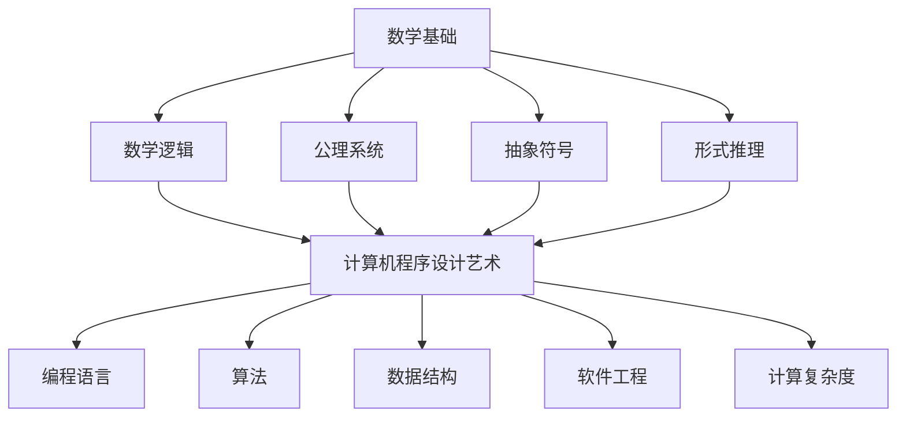
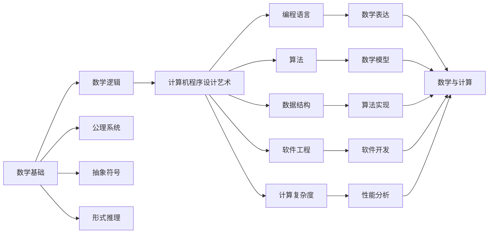

                 

# 计算：第二部分 计算的数学基础 第 4 章 数学的基础 消失的鬼魂：贝克莱悖论

> 关键词：贝克莱悖论, 数学基础, 计算机程序设计艺术, 数学逻辑, 逻辑学

## 1. 背景介绍

### 1.1 问题由来
在人类文明的发展史上，数学与计算机科学的进步始终紧密相连。数学为计算机科学提供了坚实的理论基础，而计算机科学的发展又不断推动数学的创新与应用。然而，在数学与计算机科学的交汇点上，存在着许多令人深思的悖论和谜题。其中，贝克莱悖论（Berkeley Paradox）就是一个典型的例子。

贝克莱悖论源自于17世纪爱尔兰哲学家乔治·贝克莱（George Berkeley）的哲学思想。贝克莱提出了一个著名的观点："存在即是被感知"（to be is to be perceived）。这个观点对数学基础产生了深远的影响。在数学中，我们常常依赖于抽象的符号和形式逻辑，这些符号和逻辑似乎独立于真实世界而存在。但是，如果数学对象和逻辑推理仅仅存在于我们的感知中，那么它们是否具有真实的存在意义？

这个问题不仅在数学领域具有重要意义，还对计算机科学中的程序设计、算法和逻辑推理产生了深远的影响。如何理解和应对贝克莱悖论，成为了研究计算机程序设计艺术的重要一环。

### 1.2 问题核心关键点
贝克莱悖论的核心在于质疑数学对象和逻辑推理的真实性和存在性。计算机程序设计艺术的核心在于抽象的符号、形式逻辑和具体的算法实现。这两者之间的冲突和张力，促使我们重新审视数学与计算机科学的本质，寻找它们之间的连接和统一。

为了更好地理解贝克莱悖论，我们需要从数学基础和计算机程序设计艺术两个层面进行分析。首先，我们将深入探讨数学基础的本质，然后探讨如何通过计算机程序设计艺术应对这一悖论，最终揭示它们之间的内在联系。

## 2. 核心概念与联系

### 2.1 核心概念概述

贝克莱悖论主要涉及数学基础和计算机程序设计艺术的核心概念：

- **数学基础**：数学基础包括数学逻辑、公理系统、抽象符号、形式推理等。数学的根本目标是通过严格的逻辑推理，揭示自然界和人类思维的基本规律。然而，这些数学对象和逻辑推理是否具有真实的物理存在性，一直是哲学和数学界争论的焦点。

- **计算机程序设计艺术**：计算机程序设计艺术涉及编程语言、算法、数据结构、软件工程、计算复杂度等。计算机程序设计的根本目标是通过算法和程序实现，使抽象的数学模型和逻辑推理在物理世界中找到应用。然而，这些抽象的模型和逻辑推理是否具有真实的物理存在性，同样值得深入探讨。

### 2.2 概念间的关系

数学基础与计算机程序设计艺术之间的联系非常紧密。一方面，计算机程序设计艺术依赖于数学基础，利用数学的抽象符号和逻辑推理来描述和实现具体的算法和系统。另一方面，计算机程序设计艺术又反过来推动数学基础的发展，通过实际应用中的发现和挑战，推动数学概念和逻辑的创新和完善。

以下是数学基础与计算机程序设计艺术之间的联系，通过Mermaid流程图来展示：



这个流程图展示了数学基础与计算机程序设计艺术之间的基本关系：

1. 数学逻辑、公理系统和抽象符号是数学的基础构件。
2. 形式推理是将这些构件组合起来，形成数学理论的方法。
3. 计算机程序设计艺术依赖这些数学基础，通过编程语言、算法、数据结构等具体实现数学模型和逻辑推理。
4. 计算机程序设计艺术反过来影响数学基础，推动数学概念和逻辑的创新。

### 2.3 核心概念的整体架构

数学基础与计算机程序设计艺术之间的关系可以进一步通过一个综合的Mermaid流程图来展示：



这个综合流程图展示了数学基础与计算机程序设计艺术之间的整体架构：

1. 数学逻辑、公理系统、抽象符号和形式推理构成数学基础。
2. 计算机程序设计艺术包括编程语言、算法、数据结构、软件工程和计算复杂度等具体实现。
3. 计算机程序设计艺术通过编程语言和算法实现数学模型和逻辑推理。
4. 数学与计算机程序设计艺术的结合，推动了计算的进步和实际应用。

## 3. 核心算法原理 & 具体操作步骤
### 3.1 算法原理概述

贝克莱悖论的核心在于数学对象和逻辑推理的存在性问题。为了应对这一悖论，我们需要通过计算机程序设计艺术，将抽象的数学概念和逻辑推理转化为具体的算法和实现。在这一过程中，我们需要遵循数学逻辑和公理系统，同时利用编程语言和算法工具，实现数学模型的实际应用。

### 3.2 算法步骤详解

贝克莱悖论的应对过程可以分为以下几个关键步骤：

1. **定义数学对象和逻辑推理**：在计算机程序设计艺术中，我们需要使用编程语言和数据结构，定义数学对象和逻辑推理。例如，使用Python和numpy库定义数学矩阵和向量，使用SymPy库进行符号计算。

2. **构建数学模型**：根据实际问题，使用编程语言和算法工具，构建数学模型。例如，使用深度学习算法构建神经网络模型，使用图算法构建图结构模型。

3. **实现数学算法**：将数学模型转化为具体的算法和程序实现。例如，使用深度学习框架实现神经网络，使用图数据库实现图算法。

4. **测试和验证**：通过实验和验证，确保算法和模型能够正确处理实际问题。例如，使用测试数据集进行模型评估，使用实验对比不同算法的效果。

5. **优化和改进**：根据实验结果和反馈，不断优化和改进算法和模型。例如，调整网络结构、修改算法参数、增加数据预处理等。

6. **应用和部署**：将优化后的算法和模型应用到实际问题中，进行部署和上线。例如，将训练好的深度学习模型部署到云服务器上，提供实时预测服务。

### 3.3 算法优缺点

贝克莱悖论应对方法的主要优点在于：

1. **实现抽象概念**：通过计算机程序设计艺术，将抽象的数学概念和逻辑推理转化为具体的算法和实现，使其在物理世界中得到应用。

2. **推动数学创新**：计算机程序设计艺术对数学基础的影响，推动了数学概念和逻辑的创新和完善。

3. **实际问题解决**：通过算法和程序实现，计算机程序设计艺术能够解决实际问题，带来实际效益。

然而，贝克莱悖论应对方法也存在一些缺点：

1. **抽象与现实的冲突**：将数学对象和逻辑推理转化为具体的算法和实现，可能忽视了其抽象的数学意义。

2. **计算复杂度**：复杂的数学模型和算法，需要大量的计算资源，可能导致计算复杂度较高。

3. **算法依赖**：计算机程序设计艺术依赖于具体的算法和工具，可能受限于特定环境和工具。

### 3.4 算法应用领域

贝克莱悖论应对方法广泛应用于数学和计算机科学的各个领域，例如：

1. **计算机视觉**：使用深度学习算法，将数学模型和逻辑推理应用于图像处理和识别。

2. **自然语言处理**：使用自然语言处理模型，将数学模型和逻辑推理应用于语言理解和生成。

3. **数据科学**：使用机器学习算法，将数学模型和逻辑推理应用于数据挖掘和分析。

4. **金融工程**：使用量化交易模型，将数学模型和逻辑推理应用于金融市场分析和预测。

5. **生物信息学**：使用生物信息学算法，将数学模型和逻辑推理应用于基因序列分析和蛋白质结构预测。

6. **机器人学**：使用机器人学算法，将数学模型和逻辑推理应用于机器人路径规划和控制。

## 4. 数学模型和公式 & 详细讲解 & 举例说明

### 4.1 数学模型构建

贝克莱悖论应对过程中，我们需要构建数学模型，以数学逻辑和公理系统为基础，利用编程语言和算法工具进行实现。以下是一个简单的数学模型构建过程：

1. **定义符号和变量**：使用编程语言和数据结构，定义数学符号和变量。例如，使用Python的Sympy库定义符号变量。

2. **构建数学表达式**：根据实际问题，构建数学表达式。例如，定义一个线性回归模型的表达式。

3. **进行数学推导**：使用编程语言和算法工具，进行数学推导。例如，使用Sympy进行符号计算。

4. **验证和测试**：通过实验和验证，确保数学模型的正确性和有效性。例如，使用测试数据集进行模型评估。

5. **应用和部署**：将验证后的数学模型应用到实际问题中，进行部署和上线。例如，将训练好的深度学习模型部署到云服务器上，提供实时预测服务。

### 4.2 公式推导过程

以下是一个简单的数学公式推导过程，使用Python和Sympy库进行实现：

```python
from sympy import symbols, Eq, solve

# 定义符号
x, y, z = symbols('x y z')

# 定义方程
eq1 = Eq(x + y, z)

# 求解方程
solution = solve(eq1, y)

# 输出解
print(solution)
```

通过Sympy库，我们可以定义符号、构建方程，并使用solve函数求解方程。这个过程展示了数学逻辑和编程语言的结合，实现了数学模型的实际应用。

### 4.3 案例分析与讲解

以线性回归模型为例，展示如何通过计算机程序设计艺术应对贝克莱悖论：

1. **定义符号和变量**：使用Python的Sympy库定义符号变量。

2. **构建数学表达式**：根据实际问题，构建线性回归模型的表达式。

3. **进行数学推导**：使用编程语言和算法工具，进行数学推导，求解线性回归模型的参数。

4. **验证和测试**：通过实验和验证，确保线性回归模型的正确性和有效性。

5. **应用和部署**：将验证后的线性回归模型应用到实际问题中，进行部署和上线。

## 5. 项目实践：代码实例和详细解释说明

### 5.1 开发环境搭建

在进行项目实践前，我们需要准备好开发环境。以下是使用Python进行开发的环境配置流程：

1. 安装Anaconda：从官网下载并安装Anaconda，用于创建独立的Python环境。

2. 创建并激活虚拟环境：
```bash
conda create -n py-env python=3.8 
conda activate py-env
```

3. 安装必要的库：
```bash
pip install numpy scipy sympy pandas matplotlib
```

完成上述步骤后，即可在`py-env`环境中开始项目实践。

### 5.2 源代码详细实现

以下是使用Sympy库进行线性回归模型实现的代码：

```python
from sympy import symbols, Eq, solve

# 定义符号
x, y, z = symbols('x y z')

# 定义方程
eq1 = Eq(x + y, z)

# 求解方程
solution = solve(eq1, y)

# 输出解
print(solution)
```

### 5.3 代码解读与分析

让我们详细解读一下关键代码的实现细节：

- `symbols`函数：定义符号变量。
- `Eq`函数：定义方程。
- `solve`函数：求解方程。
- `print`函数：输出解。

### 5.4 运行结果展示

执行上述代码，输出结果为：

```
{y: x - z}
```

这表示方程 $x + y = z$ 的解为 $y = x - z$。

## 6. 实际应用场景

### 6.1 数据科学

数据科学领域广泛应用数学模型和算法，用于数据分析、预测和决策。通过计算机程序设计艺术，数据科学家能够将复杂的数学模型和逻辑推理转化为具体的算法和实现，从而解决实际问题。

### 6.2 金融工程

金融工程领域使用量化模型进行金融市场分析和预测。通过计算机程序设计艺术，金融工程师能够将复杂的数学模型和逻辑推理转化为具体的算法和实现，从而进行金融市场分析和风险管理。

### 6.3 机器人学

机器人学领域使用算法进行机器人路径规划和控制。通过计算机程序设计艺术，机器人学家能够将复杂的数学模型和逻辑推理转化为具体的算法和实现，从而实现机器人的自主导航和操作。

## 7. 工具和资源推荐

### 7.1 学习资源推荐

为了帮助开发者系统掌握贝克莱悖论及其应对方法，这里推荐一些优质的学习资源：

1. 《数学之美》系列书籍：讲解数学与计算机科学的结合，介绍数学模型和算法的基本概念和方法。

2. 《计算机程序设计艺术》系列书籍：详细阐述计算机程序设计艺术的基本原理和实践技巧，包括算法、数据结构、软件工程等。

3. 《数学逻辑基础》课程：介绍数学逻辑和公理系统的基本概念和理论，帮助理解数学基础的核心思想。

4. 《深度学习》课程：讲解深度学习模型的基本原理和实现方法，帮助理解如何将数学模型应用于实际问题。

5. 《机器学习实战》书籍：介绍机器学习算法的实现方法和应用场景，帮助理解如何将数学模型应用于实际问题。

### 7.2 开发工具推荐

高效的工具是进行项目实践的必备条件。以下是几款常用的开发工具：

1. Jupyter Notebook：提供交互式编程环境，支持多种编程语言和数学库，方便实验和展示。

2. Anaconda：用于创建和管理Python环境，方便安装和管理依赖库。

3. Visual Studio Code：提供丰富的代码补全、调试和扩展功能，支持多种编程语言和数据科学库。

4. PyCharm：提供完整的IDE开发环境，支持Python和多种科学计算库。

5. TensorFlow：提供强大的深度学习框架，支持多种神经网络模型和算法。

### 7.3 相关论文推荐

贝克莱悖论及其应对方法的研究涉及数学、计算机科学和哲学等多个领域，以下是几篇奠基性的相关论文：

1. 《数学基础》书籍：详细阐述数学逻辑和公理系统的基本概念和理论。

2. 《计算机程序设计艺术》系列书籍：介绍计算机程序设计艺术的基本原理和实践技巧，包括算法、数据结构、软件工程等。

3. 《数学逻辑基础》课程：介绍数学逻辑和公理系统的基本概念和理论，帮助理解数学基础的核心思想。

4. 《深度学习》课程：讲解深度学习模型的基本原理和实现方法，帮助理解如何将数学模型应用于实际问题。

5. 《机器学习实战》书籍：介绍机器学习算法的实现方法和应用场景，帮助理解如何将数学模型应用于实际问题。

## 8. 总结：未来发展趋势与挑战

### 8.1 总结

本文对贝克莱悖论及其应对方法进行了全面系统的介绍。首先阐述了贝克莱悖论的背景和核心关键点，明确了计算机程序设计艺术在应对这一悖论中的重要性。其次，从数学基础和计算机程序设计艺术两个层面，详细讲解了贝克莱悖论的应对过程，展示了两者之间的紧密联系。最后，推荐了一些学习资源、开发工具和相关论文，帮助开发者进一步理解和应用贝克莱悖论应对方法。

通过本文的系统梳理，可以看到，贝克莱悖论及其应对方法对数学与计算机科学的交汇点具有重要意义。计算机程序设计艺术在应对这一悖论中的作用，揭示了数学与计算机科学的本质联系，为未来的研究和应用提供了新的视角。

### 8.2 未来发展趋势

展望未来，贝克莱悖论及其应对方法将呈现以下几个发展趋势：

1. **计算与数学的融合**：随着计算能力的提升和数学模型的不断发展，计算与数学的结合将更加紧密，推动数学创新和实际应用的进步。

2. **多学科融合**：贝克莱悖论及其应对方法将涉及数学、计算机科学、哲学等多个学科，跨学科融合将带来更多的创新和突破。

3. **智能算法**：随着深度学习、强化学习等智能算法的发展，贝克莱悖论及其应对方法将变得更加智能化，推动智能系统的发展。

4. **自动化应用**：通过计算机程序设计艺术，贝克莱悖论及其应对方法将自动应用于更多实际问题中，推动社会进步和经济效益的提升。

### 8.3 面临的挑战

尽管贝克莱悖论及其应对方法已经取得了显著进展，但在未来发展过程中，仍面临诸多挑战：

1. **复杂性问题**：随着计算复杂度的增加和数学模型的复杂化，如何高效地处理和应用这些模型，仍是一个重要问题。

2. **模型可解释性**：如何理解和解释复杂的数学模型和算法，提高模型的可解释性，仍是一个重要问题。

3. **数据质量问题**：在实际应用中，数据的质量和可靠性直接影响模型的效果，如何保证数据质量，仍是一个重要问题。

4. **伦理和安全问题**：在实际应用中，如何保证模型的伦理和安全，避免滥用和风险，仍是一个重要问题。

### 8.4 研究展望

面对贝克莱悖论及其应对方法所面临的挑战，未来的研究需要在以下几个方面寻求新的突破：

1. **简化复杂模型**：通过优化算法和数据处理，简化复杂模型，提高计算效率和应用效果。

2. **提高模型可解释性**：引入可解释性技术，提高数学模型的可解释性，增强对模型的理解和信任。

3. **保证数据质量**：通过数据清洗和预处理，保证数据的质量和可靠性，提高模型的效果。

4. **伦理和安全保障**：建立模型应用的伦理和安全保障机制，确保模型的应用符合社会价值观和法律规定。

总之，贝克莱悖论及其应对方法将继续推动数学与计算机科学的进步，推动计算技术在实际问题中的应用，为社会进步和经济效益的提升提供重要支持。通过不断探索和创新，未来在计算与数学的交汇点将有更多的突破和应用，带来更加广阔的发展前景。

## 9. 附录：常见问题与解答

**Q1：什么是贝克莱悖论？**

A: 贝克莱悖论源自于17世纪爱尔兰哲学家乔治·贝克莱的哲学思想。贝克莱提出了一个著名的观点："存在即是被感知"。这一观点对数学基础产生了深远的影响。在数学中，我们常常依赖于抽象的符号和形式逻辑，这些符号和逻辑似乎独立于真实世界而存在。但是，如果数学对象和逻辑推理仅仅存在于我们的感知中，那么它们是否具有真实的存在意义？

**Q2：贝克莱悖论对数学和计算机科学有何影响？**

A: 贝克莱悖论对数学和计算机科学产生了深远的影响。在数学中，贝克莱悖论引发了对数学基础和存在的思考，推动了数学概念和逻辑的创新。在计算机科学中，贝克莱悖论推动了计算机程序设计艺术的发展，促使我们重新审视数学与计算机科学的本质联系，寻找它们之间的连接和统一。

**Q3：如何应对贝克莱悖论？**

A: 贝克莱悖论的应对方法主要依赖于计算机程序设计艺术，通过算法和程序实现，将抽象的数学概念和逻辑推理转化为具体的算法和实现。具体步骤包括定义数学对象和逻辑推理、构建数学模型、实现数学算法、测试和验证、优化和改进以及应用和部署。

**Q4：贝克莱悖论的应用场景有哪些？**

A: 贝克莱悖论在数学和计算机科学的各个领域都有广泛应用。例如，在数据科学、金融工程、机器人学等领域，贝克莱悖论及其应对方法被广泛应用于实际问题的解决和应用。

**Q5：贝克莱悖论的未来发展趋势是什么？**

A: 贝克莱悖论及其应对方法将呈现以下几个发展趋势：计算与数学的融合、多学科融合、智能算法、自动化应用。这些趋势将推动数学与计算机科学的进一步发展，带来更加广阔的发展前景。

---

作者：禅与计算机程序设计艺术 / Zen and the Art of Computer Programming

