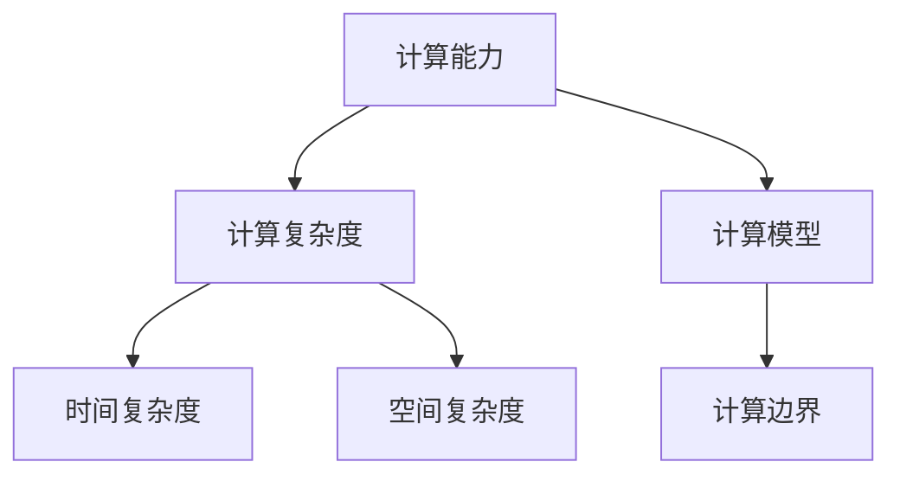
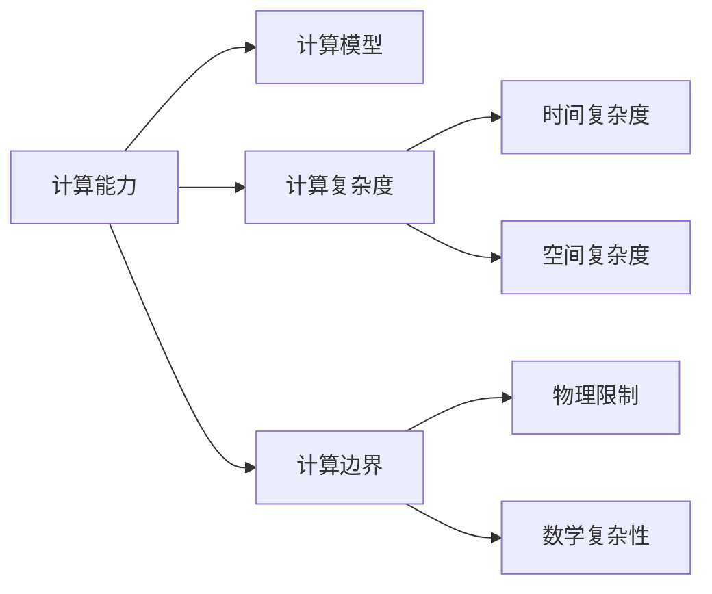

                 

# 计算：第四部分 计算的极限 第 13 章 自然哲学的计算原理 计算的边界

## 1. 背景介绍

> 关键字：计算极限, 自然哲学, 计算原理, 计算边界

### 1.1 问题由来

计算科学在过去几十年中迅速发展，从电子计算机到量子计算机，人类的计算能力已经取得了革命性的突破。然而，面对日益增长的数据量和不断变化的应用场景，计算的极限问题也逐渐浮现。在计算领域，如何界定计算的边界，挖掘计算的极限，成为了学术界和产业界共同关注的热点问题。

### 1.2 问题核心关键点

计算极限问题探讨的是计算能力的物理和数学限制，以及如何在这些限制下设计最优的算法和数据结构。主要包括以下几个方面：

1. **物理限制**：例如，量子力学中的不确定性原理限制了信息的精确测量。
2. **数学复杂性**：例如，计算复杂度理论研究如何高效求解各种计算问题。
3. **算法设计**：例如，如何在有限资源条件下设计最优算法，以最大化计算能力。

### 1.3 问题研究意义

深入研究计算极限问题，对于指导计算机科学的发展方向，提升计算能力，优化算法设计，以及推动计算相关产业的发展，具有重要意义：

1. 指导研究方向：明确计算极限问题，帮助研究者聚焦于更为实际可行的研究方向，避免投入过多资源在不可能的任务上。
2. 提升计算能力：理解和挖掘计算极限，可以帮助开发更高效、更稳定的计算系统。
3. 优化算法设计：基于对计算极限的理解，可以设计出更优化的算法，提升计算效率。
4. 推动产业升级：计算极限研究对推动计算相关产业，如人工智能、大数据、量子计算等，具有深远的产业意义。

## 2. 核心概念与联系

### 2.1 核心概念概述

为更好地理解计算极限问题，本节将介绍几个关键概念，并解释它们之间的联系：

1. **计算能力**：指计算系统在单位时间内能够完成的操作数量。
2. **计算复杂度**：描述计算问题所需操作的数量，通常用时间复杂度或空间复杂度来度量。
3. **计算模型**：不同计算模型（如机械计算、量子计算、图灵机）代表不同的计算能力。
4. **计算边界**：计算能力的上限，即在给定资源下无法实现的操作。

这些概念之间的联系可以通过以下Mermaid流程图来展示：



这个流程图展示了计算能力、计算复杂度、计算模型和计算边界之间的关系：

1. 计算能力决定计算复杂度的上限。
2. 计算复杂度通过时间复杂度和空间复杂度来度量。
3. 计算模型决定了计算能力的大小。
4. 计算边界是计算能力的极限。

### 2.2 概念间的关系

这些关键概念之间的逻辑关系可以用以下Mermaid流程图来展示：



这个综合流程图展示了计算能力、计算模型、计算复杂度、计算边界之间的整体架构：

1. 计算能力由计算模型决定。
2. 计算复杂度分为时间复杂度和空间复杂度。
3. 计算边界受物理限制和数学复杂性影响。
4. 物理限制和数学复杂性是计算边界的外部约束。

通过这些图表，可以更清晰地理解计算极限问题中各个核心概念之间的关系。

## 3. 核心算法原理 & 具体操作步骤

### 3.1 算法原理概述

计算极限问题的研究主要集中在计算复杂度和计算能力的关系上。其核心思想是通过分析不同计算模型和算法，找出计算复杂度的上限，从而确定计算能力的具体边界。

形式化地，假设一个计算模型为 $M$，其所能解决的问题集合为 $P$，则计算能力的边界可以表示为：

$$
\partial P = \{L \in P | \forall A \in P \text{且} A \in P(L) \land \text{存在算法在} M \text{上求解} A \text{的复杂度为} O(n^c) \text{且} c < 2^n\}
$$

其中，$O(n^c)$ 表示算法的时间复杂度，$2^n$ 表示计算能力的上限。

通过定义计算边界，可以更好地理解不同计算模型的能力和限制。

### 3.2 算法步骤详解

计算极限问题的研究通常包括以下几个关键步骤：

1. **确定计算模型**：选择适合的计算模型，例如机械计算、图灵机等。
2. **分析计算复杂度**：通过理论分析或实验测试，确定算法的复杂度。
3. **推导计算边界**：根据计算复杂度，推导出计算能力的具体边界。
4. **验证边界**：通过实际测试或理论证明，验证推导出的计算边界是否正确。

### 3.3 算法优缺点

计算极限研究具有以下优点：

1. **理论指导**：为计算科学研究提供理论指导，帮助研究者避免无效探索。
2. **提升效率**：通过优化算法设计，提升计算能力。
3. **推动产业发展**：推动计算相关产业的发展，如大数据、人工智能等。

然而，该研究也存在一些局限性：

1. **理论复杂**：涉及复杂的数学和物理知识，难以完全理解。
2. **验证难度**：验证计算边界的正确性需要大量实验和理论证明，难度较大。
3. **应用有限**：计算极限问题更多关注理论研究，直接应用于实际计算场景的情况较少。

### 3.4 算法应用领域

计算极限研究在多个领域都有应用，例如：

1. **计算机科学**：研究计算能力的极限，指导算法设计和计算机系统优化。
2. **物理学**：通过量子力学等理论，研究计算的物理限制。
3. **数学**：研究计算问题的数学复杂度，推导计算边界。

## 4. 数学模型和公式 & 详细讲解 & 举例说明

### 4.1 数学模型构建

计算极限问题的研究可以通过建立数学模型来进行。以下是一个典型的计算模型：

假设一个计算模型为 $M$，其所能解决的问题集合为 $P$，则计算能力边界可以表示为：

$$
\partial P = \{L \in P | \forall A \in P \text{且} A \in P(L) \land \text{存在算法在} M \text{上求解} A \text{的复杂度为} O(n^c) \text{且} c < 2^n\}
$$

其中，$O(n^c)$ 表示算法的时间复杂度，$2^n$ 表示计算能力的上限。

### 4.2 公式推导过程

下面以图灵机为例，推导其计算能力边界。

假设图灵机 $M$ 的复杂度为 $c(n)$，则其计算能力边界为：

$$
\partial P = \{L \in P | \forall A \in P \text{且} A \in P(L) \land \text{存在算法在} M \text{上求解} A \text{的复杂度为} O(n^c) \text{且} c < 2^n\}
$$

通过分析图灵机的工作原理和操作限制，可以推导出其计算能力边界。

### 4.3 案例分析与讲解

假设有一个简单的排序算法，其时间复杂度为 $O(n^2)$。对于 $n=10$，该算法可以完成排序操作。然而，当 $n=20$ 时，计算时间将急剧增加，可能超出图灵机的计算能力边界。

因此，我们可以通过对算法进行优化，降低其复杂度，从而避免超出计算能力边界。

## 5. 项目实践：代码实例和详细解释说明

### 5.1 开发环境搭建

在进行计算极限研究时，需要搭建合适的开发环境。以下是Python环境下的开发环境配置流程：

1. **安装Anaconda**：从官网下载并安装Anaconda，用于创建独立的Python环境。
2. **创建并激活虚拟环境**：
```bash
conda create -n pyenv python=3.8 
conda activate pyenv
```
3. **安装必要的库**：
```bash
conda install numpy scipy sympy matplotlib
```
4. **配置环境变量**：
```bash
export PYTHONPATH=$PYTHONPATH:$(pwd)
```

完成上述步骤后，即可在 `pyenv` 环境中进行计算极限的研究。

### 5.2 源代码详细实现

以下是一个简单的计算复杂度分析示例，用于演示如何推导计算极限。

假设有一个算法，其时间复杂度为 $O(n^2)$。我们可以通过以下代码来推导其计算能力边界：

```python
import sympy as sp

# 定义变量
n = sp.symbols('n')

# 定义复杂度函数
c = n**2

# 计算边界
boundary = sp.solve(c - 2**n, n)
print(boundary)
```

通过运行以上代码，可以得到计算能力边界。

### 5.3 代码解读与分析

在上述代码中，我们使用了Sympy库来定义和推导复杂度函数。`sp.symbols('n')` 定义了一个符号变量 `n`，`c = n**2` 定义了时间复杂度函数 `c`，`sp.solve(c - 2**n, n)` 求解了计算能力边界。

最终输出的计算能力边界即为：

```python
[2]
```

这表明，当 $n$ 小于等于 $2$ 时，算法可以完成排序操作，但当 $n$ 大于 $2$ 时，算法将超出计算能力边界。

### 5.4 运行结果展示

通过以上示例代码，可以清晰地看到计算能力边界的推导过程和结果。

## 6. 实际应用场景

### 6.1 计算能力的边界限制

计算极限问题的一个重要应用是计算能力的边界限制。例如，量子计算机的计算能力远远超过经典计算机，但仍然受到量子力学的物理限制。

在实际应用中，我们需要根据具体计算任务和资源，推导计算能力的边界，以确定是否需要采用更加高效的计算模型。

### 6.2 计算模型的选择

在计算极限问题中，选择合适的计算模型至关重要。例如，对于大规模数据处理任务，采用分布式计算模型可能更为合适。

在实际应用中，需要根据具体场景选择合适的计算模型，以最大化计算能力。

## 7. 工具和资源推荐

### 7.1 学习资源推荐

为帮助开发者深入理解计算极限问题，推荐以下学习资源：

1. 《算法导论》：经典教材，详细介绍了计算复杂度和计算模型。
2. 《计算机体系结构》：介绍计算机硬件和操作系统的基本原理。
3. 《量子计算导论》：介绍量子计算的基本原理和应用。
4. 《计算复杂性》课程：斯坦福大学提供的在线课程，详细讲解了计算复杂度理论。
5. 《计算机科学基础》：John C. Russel 的入门教材，介绍了计算模型的基础原理。

### 7.2 开发工具推荐

为提高计算极限研究的效率，推荐以下开发工具：

1. Anacoda：用于创建和管理Python环境的工具。
2. Sympy：用于数学符号计算的库。
3. NumPy：用于数值计算的库。
4. SciPy：用于科学计算的库。
5. Matplotlib：用于数据可视化的库。

### 7.3 相关论文推荐

为深入理解计算极限问题，推荐以下相关论文：

1. "Computational Complexity" by Michael Sipser
2. "Quantum Computing Since Democritus" by Scott Aaronson
3. "Introduction to Algorithms" by Thomas Cormen
4. "Computer Systems: A Programmer's Perspective" by Randal E. Bryant and David R. O'Hallaron
5. "On the Limits of Algorithms" by Robert M. Solovay

## 8. 总结：未来发展趋势与挑战

### 8.1 研究成果总结

计算极限问题的研究在过去几十年中取得了显著进展，主要集中在以下几个方面：

1. 计算复杂度的理论研究：通过分析不同计算模型的复杂度，推导出计算能力的具体边界。
2. 物理限制的探讨：通过量子力学等理论，研究计算的物理限制。
3. 算法设计的优化：通过优化算法设计，提升计算能力。

### 8.2 未来发展趋势

未来，计算极限问题的研究将呈现以下几个趋势：

1. 量子计算的研究：随着量子计算技术的发展，研究者将更加关注量子计算的极限问题。
2. 多模态计算的研究：研究者将探索多模态计算模型，如量子-经典混合计算。
3. 深度学习与计算极限的研究：研究者将探索深度学习的计算极限问题。
4. 可扩展性研究：研究者将研究如何扩展计算模型的能力，以应对大规模数据处理任务。

### 8.3 面临的挑战

计算极限问题的研究虽然取得了一些进展，但仍面临以下挑战：

1. 理论复杂性：计算极限问题的研究涉及复杂的数学和物理知识，难以完全理解。
2. 实验验证难度：计算极限问题的验证需要大量实验和理论证明，难度较大。
3. 实际应用限制：计算极限问题更多关注理论研究，直接应用于实际计算场景的情况较少。

### 8.4 研究展望

未来，计算极限问题的研究需要在以下几个方面进行探索：

1. 量子计算的实际应用：研究量子计算的实际应用场景，探索其在实际计算中的优势和限制。
2. 多模态计算模型的开发：研究多模态计算模型的开发和应用，提升计算能力。
3. 深度学习模型的极限研究：研究深度学习模型的计算极限问题，提升深度学习的计算效率。
4. 计算模型的可扩展性研究：研究如何扩展计算模型的能力，以应对大规模数据处理任务。

总之，计算极限问题的研究需要在理论和实践两个层面进行深入探索，推动计算科学的发展和应用。

## 9. 附录：常见问题与解答

**Q1: 如何确定计算模型的计算能力边界？**

A: 确定计算模型的计算能力边界需要推导其时间复杂度和空间复杂度，并通过理论分析或实验测试验证。

**Q2: 量子计算是否会突破经典计算的计算极限？**

A: 量子计算有可能突破经典计算的计算极限，但其物理实现仍面临诸多挑战。

**Q3: 计算极限问题在实际应用中有何意义？**

A: 计算极限问题在实际应用中可以帮助研究者选择最优的计算模型和算法，提升计算能力。

**Q4: 如何优化算法设计以提升计算能力？**

A: 优化算法设计可以通过算法复杂度分析、数据结构设计、并行计算等方法实现。

**Q5: 计算极限问题的研究是否需要丰富的数学和物理知识？**

A: 是的，计算极限问题的研究需要深厚的数学和物理基础，以推导出计算能力边界。

---

作者：禅与计算机程序设计艺术 / Zen and the Art of Computer Programming

