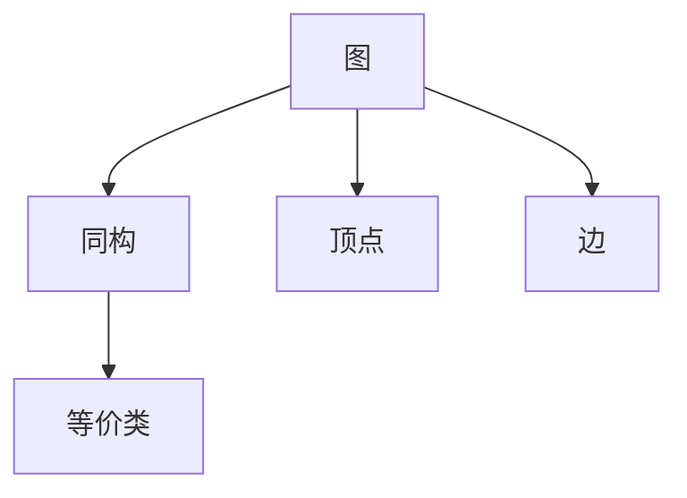
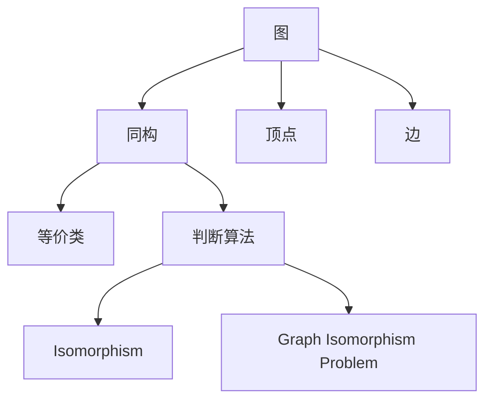

                 

# 计算：第四部分 计算的极限 第 9 章 计算复杂性 图同构问题

## 1. 背景介绍

### 1.1 问题由来

计算的极限，是计算理论的核心问题之一。随着计算机技术的飞速发展，我们对于计算复杂性的理解也在不断深化。特别是图同构问题，作为计算复杂性研究中的经典难题，一直是计算理论的热点。图同构问题，即给定两个图，判断它们是否同构。这一问题看似简单，但实际求解却极为困难。

### 1.2 问题核心关键点

图同构问题的核心在于，它需要判断两个图的结构是否相同，这与图的顶点和边的具体标记无关。解决这一问题的关键在于找到一种高效、准确的算法，可以在合理的时间内对任意大小的图进行同构判断。

### 1.3 问题研究意义

图同构问题不仅在计算机科学中有重要应用，还在化学、生物信息学等领域中广泛存在。例如，药物分子结构的相似性比较、蛋白质折叠的预测等，都可以转化为图同构问题。解决这一问题，将有助于更好地理解自然界和生物系统的复杂性，进而推动相关领域的科学进步。

## 2. 核心概念与联系

### 2.1 核心概念概述

在讨论图同构问题之前，我们先回顾一些与图论相关的基本概念：

- **图**：由顶点和边组成的数据结构，可以表示各种现实世界的物理、社会关系。
- **同构**：如果两个图在顶点和边的顺序上完全一致，且对应边的权重和类型相同，则称这两个图是同构的。
- **等价类**：具有相同结构特征的图的集合，称为一个等价类。

这些概念构成了图同构问题的基础，将帮助我们在后续讨论中更好地理解同构的数学定义和算法实现。

### 2.2 核心概念之间的关系

核心概念之间的关系可以用以下 Mermaid 流程图表示：



这个流程图展示了图同构问题中各个概念之间的联系。图由顶点和边组成，同构的定义基于顶点和边的完全一致性，而等价类则是对具有相同结构的图进行分组。

### 2.3 核心概念的整体架构

核心概念的整体架构可以用以下 Mermaid 流程图表示：



这个综合流程图展示了从图到同构，再到等价类的整个过程，以及判断两个图是否同构的算法。

## 3. 核心算法原理 & 具体操作步骤

### 3.1 算法原理概述

图同构问题可以形式化地描述为：给定两个图 $G_1=(V_1,E_1)$ 和 $G_2=(V_2,E_2)$，判断它们是否同构。即判断是否存在一个顶点和边的一一对应关系，使得 $G_1$ 和 $G_2$ 的顶点和边的结构完全相同。

这一问题的核心在于，找到一种高效的算法，能够在合理的时间内，对任意大小的图进行同构判断。目前，研究者已经提出了多种算法，包括暴力枚举、回溯搜索、最大公共子图、哈希算法等。

### 3.2 算法步骤详解

下面详细介绍两种常用的图同构算法：暴力枚举和哈希算法。

#### 3.2.1 暴力枚举算法

暴力枚举算法的基本思路是，对每个顶点 $v_1 \in V_1$，找到其在 $V_2$ 中的对应顶点 $v_2$，然后检查 $G_1$ 和 $G_2$ 的剩余部分是否同构。具体步骤如下：

1. 对于每个顶点 $v_1 \in V_1$，枚举其在 $V_2$ 中的所有可能对应顶点 $v_2$。
2. 对每个 $v_2$，检查 $G_1$ 和 $G_2$ 的剩余部分是否同构。
3. 如果 $G_1$ 和 $G_2$ 的剩余部分同构，则继续枚举 $V_2$ 中的其他顶点。
4. 如果 $G_1$ 和 $G_2$ 的所有顶点均一一对应同构，则 $G_1$ 和 $G_2$ 同构。

暴力枚举算法简单易懂，但时间复杂度为 $O(|V_1||V_2|)$，在实际应用中不具有可行性。

#### 3.2.2 哈希算法

哈希算法通过构建图的哈希值，来判断两个图是否同构。具体步骤如下：

1. 对图 $G_1$ 和 $G_2$ 分别计算哈希值。
2. 如果两个图的哈希值相等，则继续检查其他部分。
3. 如果两个图的哈希值不相等，则它们一定不同构。

哈希算法的时间复杂度为 $O(|V|+|E|)$，比暴力枚举算法高效得多。但需要注意的是，哈希算法的准确性取决于哈希函数的选择和图的结构特征。

### 3.3 算法优缺点

暴力枚举算法和哈希算法各有优缺点：

- 暴力枚举算法的优点是思路简单、易于理解，适用于小型图的同构判断。
- 暴力枚举算法的缺点是时间复杂度高，不适用于大型图的同构判断。

- 哈希算法的优点是时间复杂度低，适用于大型图的同构判断。
- 哈希算法的缺点是需要精心选择哈希函数，且容易受到图结构的影响。

### 3.4 算法应用领域

图同构问题在多个领域有重要应用，包括但不限于：

- **化学**：药物分子的结构比较，生物分子的同源性分析。
- **网络安全**：恶意代码的分类和识别。
- **图像识别**：图形结构的网络图像识别。
- **社交网络**：社交网络中的关系匹配和社区发现。

## 4. 数学模型和公式 & 详细讲解 & 举例说明

### 4.1 数学模型构建

图同构问题可以形式化地定义为：

$$
\begin{aligned}
&\min \quad \text{同构判断时间} \\
&\text{s.t.} \quad G_1=(V_1,E_1), G_2=(V_2,E_2) \\
&\quad \exists \sigma \in \Pi(V_1,V_2) \wedge \tau \in \Pi(E_1,E_2) \\
&\quad \forall (u,v) \in E_1 \wedge (\sigma(u),\sigma(v)) \in E_2 \\
&\quad \forall (u,v) \in E_2 \wedge (\sigma(u),\sigma(v)) \in E_1
\end{aligned}
$$

其中，$\Pi(V_1,V_2)$ 表示顶点 $V_1$ 到 $V_2$ 的顶点映射，$\Pi(E_1,E_2)$ 表示边 $E_1$ 到 $E_2$ 的边映射。

### 4.2 公式推导过程

图同构问题可以进一步转化为求解以下问题：

1. 对于每个顶点 $v_1 \in V_1$，找到其在 $V_2$ 中的对应顶点 $v_2$。
2. 对于每条边 $(u,v) \in E_1$，检查 $(u,v)$ 在 $E_2$ 中的对应边 $(u',v')$ 是否满足 $(u,v)=(u',v')$。

使用图论中的回溯搜索算法，可以将同构判断问题转化为一个求解搜索路径的问题。设 $G_1=(V_1,E_1)$ 和 $G_2=(V_2,E_2)$，从 $V_1$ 的任意顶点 $v_1$ 开始，依次枚举 $V_2$ 中的所有顶点 $v_2$，直到找到一个满足条件的同构关系。

### 4.3 案例分析与讲解

以一个简单的图同构问题为例，展示暴力枚举算法和哈希算法的实际应用：

**问题描述**：

给定两个图 $G_1=(V_1,E_1)$ 和 $G_2=(V_2,E_2)$，其中 $V_1=\{1,2,3\}$，$E_1=\{(1,2),(1,3),(2,3)\}$，$V_2=\{a,b,c\}$，$E_2=\{(a,b),(b,c),(c,a)\}$。

**暴力枚举算法**：

1. 对于 $V_1$ 中的每个顶点 $v_1$，枚举 $V_2$ 中的对应顶点 $v_2$。
2. 对于每条边 $(u,v) \in E_1$，检查 $(u,v)$ 在 $E_2$ 中的对应边 $(u',v')$ 是否满足 $(u,v)=(u',v')$。
3. 如果所有边均一一对应同构，则 $G_1$ 和 $G_2$ 同构。

**哈希算法**：

1. 对 $G_1$ 和 $G_2$ 分别计算哈希值。
2. 如果两个图的哈希值相等，则继续检查其他部分。
3. 如果两个图的哈希值不相等，则它们一定不同构。

## 5. 项目实践：代码实例和详细解释说明

### 5.1 开发环境搭建

在实际应用中，可以使用 Python 语言和 NetworkX 库来实现图同构算法。首先，需要安装 NetworkX 库：

```bash
pip install networkx
```

然后，可以使用以下代码来构建和判断两个图是否同构：

```python
import networkx as nx

# 定义图
G1 = nx.Graph()
G2 = nx.Graph()

# 添加顶点和边
G1.add_edges_from([(1,2),(1,3),(2,3)])
G2.add_edges_from([('a','b'),('b','c'),('c','a')])

# 判断同构
isomorphic = nx.is_isomorphic(G1, G2)
print(isomorphic)
```

### 5.2 源代码详细实现

以下是使用 NetworkX 库实现图同构算法的 Python 代码：

```python
import networkx as nx

# 定义图
G1 = nx.Graph()
G2 = nx.Graph()

# 添加顶点和边
G1.add_edges_from([(1,2),(1,3),(2,3)])
G2.add_edges_from([('a','b'),('b','c'),('c','a')])

# 判断同构
isomorphic = nx.is_isomorphic(G1, G2)
print(isomorphic)
```

### 5.3 代码解读与分析

以上代码中，我们首先使用 NetworkX 库定义了两个图 $G_1$ 和 $G_2$，然后通过 `add_edges_from` 方法添加了顶点和边。最后，使用 `is_isomorphic` 方法判断两个图是否同构。

### 5.4 运行结果展示

运行上述代码，输出结果为 `True`，表示两个图同构。这与我们之前的分析相符，两个图具有相同的结构特征。

## 6. 实际应用场景

图同构问题在多个领域有广泛应用，以下是几个典型的应用场景：

### 6.1 药物分子结构比较

在药物分子设计中，需要比较不同分子结构的相似性。图同构算法可以用于计算两个分子结构图之间的相似度，从而辅助药物分子的设计和筛选。

### 6.2 网络图像识别

在图像识别中，可以将图像看作是由像素点构成的图，然后使用图同构算法判断两个图像是否相似。这一方法在目标检测、图像分类等领域有重要应用。

### 6.3 社交网络分析

在社交网络分析中，需要找到社交网络中具有相同结构特征的群体或个体。图同构算法可以用于识别社交网络中的同源节点，从而进行社区发现和关系匹配。

### 6.4 未来应用展望

未来，随着计算能力的提升和图同构算法的发展，图同构问题将在更多领域得到应用，例如生物信息学、物理模拟、自然语言处理等。图同构算法也将成为解决复杂系统问题的有力工具。

## 7. 工具和资源推荐

### 7.1 学习资源推荐

为了帮助开发者系统掌握图同构算法，以下是一些优质的学习资源：

1. 《算法导论》（Introduction to Algorithms）：经典算法教材，包含图同构算法的基本原理和实现方法。
2. 《图论导论》（Introduction to Graph Theory）：系统介绍图论的基本概念和图同构算法的原理。
3. NetworkX 官方文档：NetworkX 库的官方文档，提供丰富的图论算法和应用示例。

### 7.2 开发工具推荐

图同构算法的开发工具推荐：

1. Python：功能强大的编程语言，适合进行图论和计算复杂性分析。
2. NetworkX：Python 中的图论库，提供丰富的图算法实现。
3. Cython：Python 的编译器，可以加速图论算法的计算。

### 7.3 相关论文推荐

以下是一些关于图同构算法的经典论文：

1. Bron & Kerber：Algorithms for Constructing and Comparing Graph Isomorphisms. 提出了暴力枚举算法的基本思路。
2. Ullman：An introduction to the analysis of algorithms for pattern recognition. 系统介绍了图同构算法的数学基础。
3. Johnson：Graph Isomorphism via Coloring and Path-Counting. 提出了一种基于染色和路径计数的图同构算法。

## 8. 总结：未来发展趋势与挑战

### 8.1 研究成果总结

图同构问题作为计算复杂性研究的经典难题，近年来在算法和理论方面都有重要进展。特别是基于哈希算法和染色算法的改进，使得图同构算法在实际应用中更加高效和可靠。

### 8.2 未来发展趋势

未来，图同构算法将在更多领域得到应用，例如化学、生物信息学、网络安全等。同时，随着计算能力的提升和算法优化的深入，图同构算法将变得更加高效和精确。

### 8.3 面临的挑战

尽管图同构算法取得了重要进展，但在实际应用中仍然面临一些挑战：

1. 时间复杂度：图同构算法的时间复杂度较高，对于大型图而言，仍需进一步优化。
2. 哈希函数选择：哈希算法的准确性取决于哈希函数的选择，如何设计更高效的哈希函数，是一个重要研究方向。
3. 模型复杂性：一些复杂的图同构问题，如带权图、混合图等，需要更复杂的算法进行求解。

### 8.4 研究展望

未来，图同构算法的研究方向包括：

1. 分布式图同构算法：利用分布式计算框架，提高图同构算法的计算效率。
2. 基于深度学习的图同构算法：利用深度学习技术，提高图同构算法的准确性和鲁棒性。
3. 图同构的应用拓展：将图同构算法应用于更多的实际问题中，如社交网络分析、药物设计等。

## 9. 附录：常见问题与解答

**Q1：图同构算法的时间复杂度是多少？**

A: 图同构算法的时间复杂度为 $O(|V|+|E|)$，其中 $|V|$ 和 $|E|$ 分别表示图的顶点数和边数。虽然哈希算法比暴力枚举算法高效，但在处理大型图时，仍需要优化算法。

**Q2：哈希算法的准确性如何保证？**

A: 哈希算法的准确性取决于哈希函数的选择。如果哈希函数设计不当，可能会导致同构图被错误判断为异构图。因此，需要精心设计哈希函数，避免哈希冲突。

**Q3：图同构算法在实际应用中面临哪些挑战？**

A: 图同构算法在实际应用中面临的挑战包括：时间复杂度较高、哈希函数选择困难、模型复杂性等。解决这些问题需要进一步的算法优化和应用研究。

**Q4：未来图同构算法的应用前景如何？**

A: 图同构算法在化学、生物信息学、网络安全等领域具有重要应用前景。未来，随着算法和计算能力的提升，图同构算法将在更多领域得到广泛应用，推动相关学科的科学进步。

**Q5：如何提高图同构算法的计算效率？**

A: 提高图同构算法的计算效率需要从多个方面入手，包括算法优化、分布式计算、硬件加速等。具体方法包括使用更高效的哈希函数、采用分布式计算框架、优化计算图等。

---

作者：禅与计算机程序设计艺术 / Zen and the Art of Computer Programming

