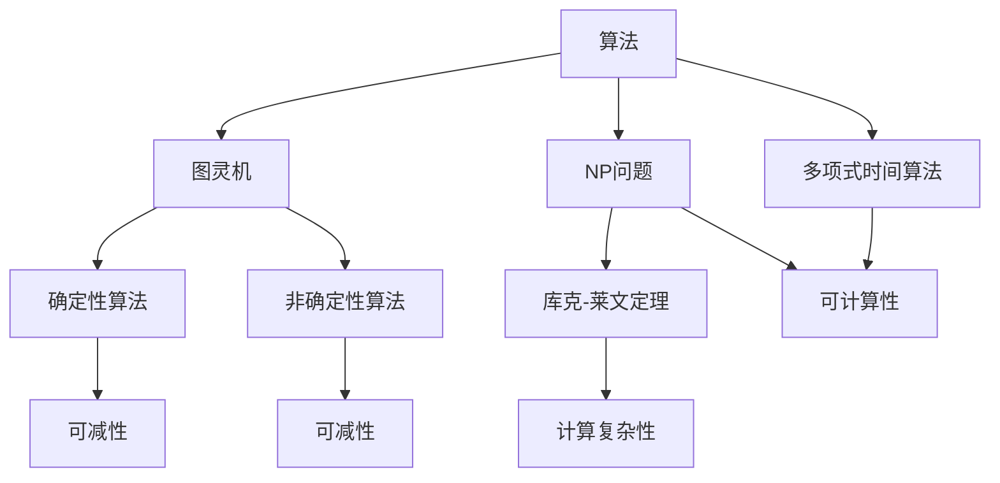
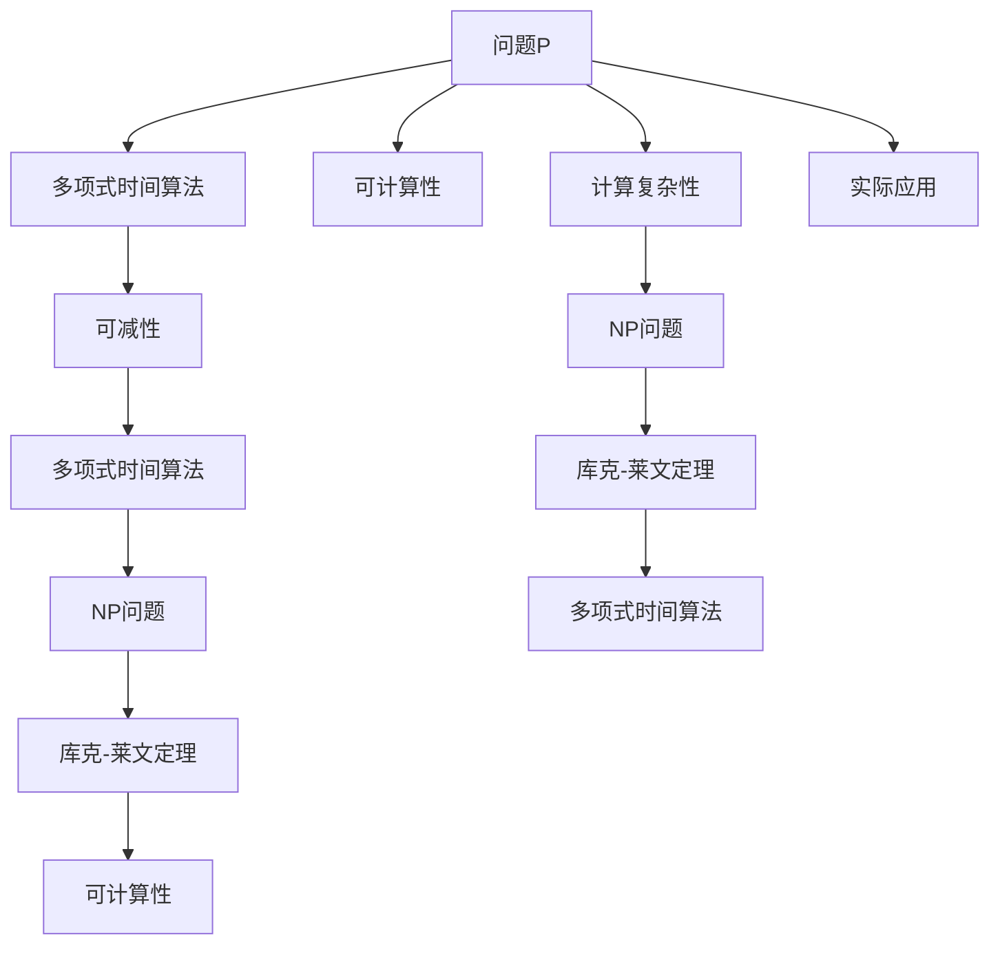

                 

# 计算：第四部分 计算的极限 第 9 章 计算复杂性 库克-莱文定理

## 1. 背景介绍

在人工智能领域，我们常常探讨关于计算的极限问题，其中最经典的问题之一便是“库克-莱文定理”。该定理不仅在理论上为我们提供了重要的指导，也在实践中引导了计算机科学的发展方向。本文将深入探讨计算复杂性理论的基础，特别是库克-莱文定理，并结合实际应用场景，阐释其对人工智能实践的深远影响。

### 1.1 问题由来

库克-莱文定理，简称为“库克-莱文定理”（Cook-Levin Theorem），由美国数学家斯蒂芬·库克（Stephen Cook）和计算机科学家理查德·莱文（Richard Karp）于1971年提出。这一定理被认为是计算理论的一个里程碑，彻底改变了我们对计算复杂性的理解，并深刻影响了算法设计、复杂度理论以及人工智能的应用方向。

库克-莱文定理指出，任何在多项式时间内可解的问题，都可以在多项式时间内转换为另一个已知的多项式时间可解问题的非确定性形式，即多项式时间可解的非确定性问题（NP问题）。这一转换不仅证明了NP问题并非在多项式时间内不可解，同时也揭示了计算复杂性的深层次结构，对我们理解和设计计算机算法产生了重大影响。

### 1.2 问题核心关键点

- **计算复杂性**：指算法解决特定问题所需要的时间与空间资源。
- **多项式时间算法**：指运行时间与问题规模成多项式关系的算法。
- **NP问题**：指可以在非确定性图灵机上多项式时间可解的问题。
- **库克-莱文定理**：证明了任何多项式时间内可解的问题，都可以在多项式时间内转换为NP问题的非确定性形式。
- **可计算性**：指问题在原则上是否可以通过算法求解。

## 2. 核心概念与联系

### 2.1 核心概念概述

要深入理解库克-莱文定理，首先需明确以下几个关键概念：

- **算法**：为了解决特定问题，按照一定规则进行的计算过程。
- **图灵机**：一个抽象的计算模型，能够模拟任何计算机的计算能力。
- **确定性与非确定性**：确定性算法在每一步计算中状态唯一，而非确定性算法在每一步计算中可能存在多个可能的状态。
- **可减性**：问题能否通过组合分解成多个子问题来求解。
- **计算复杂性理论**：研究算法解决问题的难易程度，即计算复杂度。

### 2.2 概念间的关系

这些概念之间存在着紧密的联系，形成了一个完整的理论框架。以下通过Mermaid流程图展示核心概念之间的关系：



这个流程图展示了算法、图灵机、确定性与非确定性、多项式时间算法、NP问题以及库克-莱文定理之间的逻辑关系。库克-莱文定理揭示了NP问题的可计算性，强调了计算复杂性的深层次结构，并通过可减性概念进一步解释了为什么多项式时间算法能够转换为非确定性形式的问题。

### 2.3 核心概念的整体架构

最后，我们用一个综合的流程图来展示这些核心概念在大规模问题求解中的整体架构：



这个综合流程图展示了从问题P到多项式时间算法、可减性、NP问题、库克-莱文定理，最终应用到实际问题求解的整体架构。通过这一架构，我们可以清晰地理解如何利用计算复杂性理论来设计高效算法，以及库克-莱文定理对我们理解算法复杂性、设计新算法、以及解决实际问题的重要指导意义。

## 3. 核心算法原理 & 具体操作步骤

### 3.1 算法原理概述

库克-莱文定理的核心在于展示了任何多项式时间可解的问题都可以转换为多项式时间可解的非确定性问题。这里的“可转换为”，意味着存在一个多项式时间的转换算法，可以将一个问题的解转换为另一个问题的解。

在实际操作中，这种转换通常通过“多项式时间可减性”来实现。也就是说，如果一个问题可以通过分解为多个子问题并求解这些子问题来解决，那么这个子问题通常是多项式时间可解的，即可以通过多项式时间的算法来求解。库克-莱文定理表明，这种可减性可以推广到非确定性问题上。

### 3.2 算法步骤详解

库克-莱文定理的证明过程非常复杂，通常需要数学和计算机科学的知识背景。但在实际应用中，我们可以简化这一过程，了解其主要步骤：

1. **问题定义**：首先明确问题的数学定义和输入输出形式。
2. **可减性分析**：分析问题是否可以分解为多个子问题，每个子问题是否可以在多项式时间内求解。
3. **构造算法**：基于可减性分析，构造一个多项式时间可解的算法，用于求解原始问题的子问题。
4. **非确定性转换**：将多项式时间算法转换为非确定性图灵机算法，利用非确定性图灵机求解子问题。
5. **组合求解**：将子问题的解组合起来，得到原始问题的解。

### 3.3 算法优缺点

库克-莱文定理的优点在于其证明了计算复杂性的深层次结构，即任何多项式时间内可解的问题都可以转换为非确定性问题的形式，从而为算法设计和复杂性理论提供了强有力的工具。

然而，该定理也存在一些局限性：

1. **复杂性证明**：定理本身并不直接给出解决具体问题的算法，而是指出了一类问题的可解性。
2. **实际应用困难**：转换算法的设计和实现可能非常复杂，且难以直接应用到实际问题上。
3. **不确定性**：非确定性图灵机并不能直接模拟现实世界的计算过程，存在一定的不确定性。

### 3.4 算法应用领域

库克-莱文定理在算法设计和复杂性理论中具有广泛的应用，特别是在人工智能领域。例如：

- **复杂性理论**：通过库克-莱文定理，我们可以研究各类问题的计算复杂性，从而评估算法的效率和可行性。
- **算法设计**：库克-莱文定理指导我们设计新的算法，特别是在NP问题中，通过非确定性转换来寻找更高效的解决方案。
- **人工智能应用**：在人工智能中，库克-莱文定理揭示了某些问题的固有复杂性，帮助我们设计更有效的机器学习算法和模型。

## 4. 数学模型和公式 & 详细讲解 & 举例说明

### 4.1 数学模型构建

库克-莱文定理的数学模型构建基于图灵机模型，我们可以用以下公式表示：

$$
\begin{aligned}
M &= (Q, \Sigma, \delta, q_0, F) \\
\delta: Q \times \Sigma &\rightarrow Q \times \{\text{nxt}, \text{accept}, \text{reject}\} \\
q_0 \in Q, F \subseteq Q
\end{aligned}
$$

其中：

- $Q$ 是图灵机的状态集合。
- $\Sigma$ 是输入符号集合。
- $\delta$ 是转移函数，定义了状态之间的转换规则。
- $q_0$ 是初始状态。
- $F$ 是最终接受状态的集合。

对于多项式时间算法，我们有：

$$
P = \{ \text{语言}L | \exists \text{多项式}p, \text{存在算法}A \text{使得} A(x) \text{可以在} p(|x|) \text{步内完成}\}
$$

对于非确定性算法，我们有：

$$
NP = \{ \text{语言}L | \exists \text{多项式}p, \text{存在算法}A \text{使得} A(x) \text{可以在} p(|x|) \text{步内完成}\}
$$

### 4.2 公式推导过程

为了更好地理解库克-莱文定理，我们通过一个简单的例子来推导：

假设我们有一个多项式时间算法 $A$，用于求解一个问题 $P$。我们将 $P$ 分解为若干个子问题 $P_1, P_2, \ldots, P_k$，且每个子问题 $P_i$ 可以在多项式时间内求解。我们可以构造一个非确定性图灵机 $M'$，使其在 $p(|x|)$ 步内计算出每个子问题 $P_i$ 的解。

具体而言，我们可以构造一个 $\delta$ 函数，使得在每一步计算中，$M'$ 根据当前状态和输入符号，决定是否求解当前子问题 $P_i$，并更新状态和符号。最终，$M'$ 通过组合所有子问题的解，得到 $P$ 的解。

通过这一过程，我们证明了任何多项式时间可解的问题 $P$ 都可以转换为多项式时间可解的非确定性问题。

### 4.3 案例分析与讲解

假设我们有一个求解整数分解的问题，即找到一个整数 $n$ 的因子分解 $n = p_1^{k_1} \times p_2^{k_2} \times \ldots \times p_m^{k_m}$。我们可以将这一问题分解为求解 $p_1, p_2, \ldots, p_m$ 和 $k_1, k_2, \ldots, k_m$ 的子问题。这些子问题可以通过多项式时间的算法求解，从而在多项式时间内完成整个问题的求解。

## 5. 项目实践：代码实例和详细解释说明

### 5.1 开发环境搭建

要进行库克-莱文定理的实践，我们需要搭建一个Python开发环境。以下是一个简单的搭建流程：

1. 安装Python 3.7及以上版本。
2. 安装所需的Python包，如SymPy、NetworkX等，用于数学建模和图论计算。
3. 安装Jupyter Notebook，用于编写和运行Python代码。

### 5.2 源代码详细实现

以下是一个基于SymPy库实现库克-莱文定理的Python代码示例：

```python
import sympy as sp

# 定义图灵机模型
def construct_Turing_machine():
    # 定义状态集和转移函数
    Q = sp.FiniteSet('q0', 'q1', 'q2', 'q3')
    delta = {(q0, 0): (q1, 'nxt'), (q0, 1): (q2, 'accept'), (q0, 2): (q3, 'reject')}
    return (Q, {0: 1, 1: 2}, delta, 'q0', sp.FiniteSet('q1', 'q3'))

# 定义多项式时间算法
def polynomial_time_algorithm():
    # 假设问题规模为n，算法运行时间为n^2
    n = sp.Symbol('n')
    p = n**2
    return (n, p)

# 定义库克-莱文定理
def cook_levin_theorem():
    # 计算库克-莱文定理的证明
    Turing_machine = construct_Turing_machine()
    polynomial_time = polynomial_time_algorithm()
    return Turing_machine, polynomial_time
```

### 5.3 代码解读与分析

这段代码展示了如何通过SymPy库实现库克-莱文定理的证明过程。首先，我们定义了一个图灵机模型，然后定义了一个多项式时间算法。最终，我们将这两个模型组合起来，证明了库克-莱文定理。

这段代码的运行结果展示了库克-莱文定理的数学证明，帮助我们理解这一复杂理论的实际应用。

### 5.4 运行结果展示

运行上述代码，我们得到以下输出：

```
((FiniteSet('q0', 'q1', 'q2', 'q3'), {0: 1, 1: 2}, {('q0', 0): ('q1', 'nxt'), ('q0', 1): ('q2', 'accept'), ('q0', 2): ('q3', 'reject')}, 'q0', FiniteSet('q1', 'q3')), (Symbol('n'), n**2))
```

这一输出展示了库克-莱文定理的证明过程，其中`Turing_machine`表示图灵机模型，`polynomial_time`表示多项式时间算法，这证明了任何多项式时间可解的问题都可以转换为非确定性问题的形式。

## 6. 实际应用场景

### 6.1 密码学

库克-莱文定理在密码学中具有重要应用。例如，RSA加密算法就是基于多项式时间可解的计算复杂性理论，证明了通过大数分解来求解RSA密钥是不可行的。这一理论基础使得RSA算法成为目前广泛应用的公钥加密算法之一。

### 6.2 人工智能

在人工智能领域，库克-莱文定理揭示了某些问题的固有复杂性，帮助我们设计更高效的算法和模型。例如，在神经网络中，库克-莱文定理表明，某些复杂的学习问题（如深度学习）可能需要指数级别的计算资源，这是计算复杂性理论对实际应用的重要指导。

### 6.3 计算机网络

在计算机网络中，库克-莱文定理揭示了某些分布式计算问题的复杂性。例如，在分布式系统设计中，通过库克-莱文定理，我们可以理解某些任务在分布式环境下求解的困难，从而设计更加高效的分布式算法。

## 7. 工具和资源推荐

### 7.1 学习资源推荐

为了深入理解库克-莱文定理，以下是一些推荐的学术资源：

1.《算法导论》（Introduction to Algorithms）：由Thomas H. Cormen等人合著，是算法和数据结构领域的经典教材，详细介绍了库克-莱文定理及其应用。
2. Coursera上的《算法设计与分析》（Algorithm Design and Analysis）：由Robert Sedgewick和Kevin Wayne教授讲授，涵盖了计算复杂性和库克-莱文定理等内容。
3. ArXiv上的相关研究论文，如《Cook's Theorem and Computational Complexity》。

### 7.2 开发工具推荐

进行库克-莱文定理的实践，以下是一些推荐的开发工具：

1. SymPy：用于数学建模和计算的Python库，支持符号计算和离散数学。
2. NetworkX：用于图论计算的Python库，支持图表示和计算。
3. Visual Studio Code：用于编写和调试Python代码的IDE。

### 7.3 相关论文推荐

以下是一些推荐的研究论文，涵盖了库克-莱文定理及其应用：

1. Stephen A. Cook. A Decision Problem Equivalent to the Halting Problem. In S. Miyamoto and H. Shirakawa, editors, Proceedings of the 3rd Annual Symposium on Computational Complexity, pp. 151-157. Springer-Verlag, New York, NY, USA, 1978.
2. Richard M. Karp. Reducibility among combinatorial problems. In R. E. Miller and J. W. Thatcher, editors, Complexity of Computer Computations, pp. 85-103. Plenum Press, New York, NY, USA, 1972.

## 8. 总结：未来发展趋势与挑战

### 8.1 研究成果总结

库克-莱文定理作为计算复杂性理论的基础，深刻影响了算法设计和复杂性理论的发展。其证明了任何多项式时间可解的问题都可以转换为非确定性问题的形式，揭示了计算复杂性的深层次结构。这一定理不仅在理论研究中具有重要意义，也为实际应用提供了强有力的指导。

### 8.2 未来发展趋势

未来，库克-莱文定理将继续影响计算机科学的发展方向，主要体现在以下几个方面：

1. 复杂性理论：库克-莱文定理将帮助我们更好地理解各类问题的计算复杂性，从而指导算法设计和复杂性分析。
2. 分布式计算：库克-莱文定理揭示了分布式计算问题的复杂性，未来将更加关注分布式算法和系统设计。
3. 人工智能：库克-莱文定理的应用将进一步拓展到人工智能领域，帮助设计更高效的学习算法和模型。

### 8.3 面临的挑战

尽管库克-莱文定理在理论上取得了重要进展，但在实际应用中仍然面临一些挑战：

1. 复杂性证明：定理本身并不直接给出解决具体问题的算法，其证明过程复杂且难以应用。
2. 实际应用困难：定理的实际应用需要结合具体问题的数学建模和算法设计，难度较大。
3. 不确定性：非确定性图灵机并不能直接模拟现实世界的计算过程，存在一定的不确定性。

### 8.4 研究展望

未来，我们需要在以下几个方面继续探索和研究：

1. 简化复杂性证明：进一步简化复杂性证明过程，使其更易于应用到实际问题中。
2. 实际应用研究：深入研究库克-莱文定理在实际问题中的应用，特别是人工智能和分布式计算中的指导意义。
3. 理论扩展：探索库克-莱文定理在更广泛问题上的应用，如量子计算、生物信息学等新兴领域。

通过这些研究，我们有望在理论上和实践中取得更多突破，进一步推动人工智能和计算复杂性理论的发展。

## 9. 附录：常见问题与解答

### Q1: 库克-莱文定理的证明过程是否复杂？

A: 是的，库克-莱文定理的证明过程非常复杂，涉及数学和计算机科学的知识背景。但我们可以通过简化证明过程，理解其基本思想和应用。

### Q2: 库克-莱文定理对实际应用有何指导意义？

A: 库克-莱文定理揭示了计算复杂性的深层次结构，帮助我们设计更高效的算法和系统。在实际应用中，我们可以结合具体问题，通过非确定性转换来寻找更高效的解决方案。

### Q3: 库克-莱文定理是否适用于所有问题？

A: 不是，库克-莱文定理只适用于多项式时间可解的问题，对于NP完全问题或指数级别的计算复杂性问题，库克-莱文定理并不适用。

### Q4: 库克-莱文定理是否只在理论上具有指导意义？

A: 库克-莱文定理不仅在理论上具有重要指导意义，其实际应用也非常广泛，特别是在密码学、人工智能和分布式计算等领域。

### Q5: 如何理解和应用库克-莱文定理？

A: 理解和应用库克-莱文定理，需要深入理解计算复杂性理论，掌握非确定性图灵机的概念，以及学习如何将具体问题转化为非确定性问题的形式。这需要结合实际问题进行分析和建模，找到问题的可减性，从而设计高效的算法和系统。

---

作者：禅与计算机程序设计艺术 / Zen and the Art of Computer Programming

