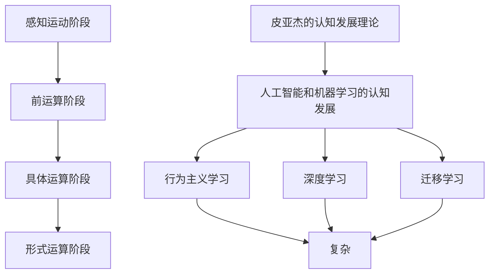

                 

# 认知发展的简单与复杂阶段

认知发展是心理学和教育学中一个古老且重要的话题。它是研究人类、动物以及机器智能如何随时间和经验而增长、变化和演化的学科。本文将探讨认知发展的简单与复杂阶段，旨在通过逻辑清晰、结构紧凑的专业技术语言，提供一个有深度、有思考、有见解的视角。

## 1. 背景介绍

### 1.1 问题由来
认知发展理论始于20世纪60年代，由让·皮亚杰（Jean Piaget）首次提出，主要关注儿童如何通过感知、经验和抽象思维构建认知结构。自那时以来，认知发展理论已经扩展到涵盖更广泛的生命周期，并包括机器学习等领域的智能增长。

### 1.2 问题核心关键点
认知发展的核心在于理解个体或系统如何通过与环境的交互进行学习、适应和演化的过程。皮亚杰的四个认知发展阶段（感知运动阶段、前运算阶段、具体运算阶段和形式运算阶段）为我们提供了经典的理论框架。而在人工智能和机器学习中，认知发展也逐渐从简单的行为主义学习，过渡到更复杂的结构化学习、迁移学习、迁移强化学习和自监督学习等。

### 1.3 问题研究意义
研究认知发展的简单与复杂阶段，有助于深入理解人类和机器的智能成长过程，为教育、培训和智能系统设计提供理论基础。这不仅有助于提高学习效率，还能为复杂系统设计提供指导，优化其性能和适应能力。

## 2. 核心概念与联系

### 2.1 核心概念概述

认知发展研究关注个体和系统如何通过学习、适应和演化获得复杂认知能力。以下是几个核心概念及其相互联系的概述：

- **感知运动阶段**：婴儿通过与环境的直接互动，逐渐发展出动作和知觉的协调能力。
- **前运算阶段**：儿童开始使用符号（如语言、图片）来代表外部世界，但思维具有自我中心性。
- **具体运算阶段**：儿童发展出逻辑推理和守恒的能力，可以处理具体事物之间的关系。
- **形式运算阶段**：青少年能够进行抽象逻辑思维，解决复杂问题。
- **皮亚杰的认知发展理论**：提供了一个理解儿童认知发展的框架，强调经验、感知和自我调节的作用。
- **人工智能和机器学习的认知发展**：从行为主义学习到深度学习和迁移学习，实现了从简单到复杂的演变。

这些概念通过以下Mermaid流程图进行关联展示：



这个流程图展示了认知发展的核心概念及其相互关系：

1. 从感知运动阶段开始，通过与环境的交互逐步发展出简单的认知能力。
2. 儿童在前运算阶段开始使用符号表示，但思维具有自我中心性。
3. 具体运算阶段，儿童发展出逻辑推理和守恒能力。
4. 青少年在形式运算阶段能够进行抽象逻辑思维。
5. 皮亚杰的理论提供了一个理论框架，解释认知发展的过程。
6. 人工智能和机器学习从简单的行为主义学习，逐渐发展出复杂的深度学习和迁移学习。

### 2.2 概念间的关系

这些概念之间存在紧密的联系，形成了认知发展的完整生态系统：

- **感知运动阶段与前运算阶段**：前者是后者的基础，为儿童使用符号思维打下基础。
- **前运算阶段与具体运算阶段**：后者建立在符号思维的基础上，发展出逻辑推理能力。
- **具体运算阶段与形式运算阶段**：后者在具体运算的基础上，进一步发展出抽象思维和复杂问题解决能力。
- **皮亚杰理论与人工智能**：皮亚杰的理论为理解人工智能认知发展提供了类比，而人工智能认知发展则验证和拓展了这一理论。

## 3. 核心算法原理 & 具体操作步骤

### 3.1 算法原理概述

认知发展的算法原理主要是基于学习理论和人工智能的机器学习算法，通过模仿人类认知过程，逐渐构建和优化认知模型。这包括了从简单的行为主义学习算法，到复杂的深度学习算法，再到迁移学习算法。

### 3.2 算法步骤详解

以下是认知发展算法的基本步骤：

**Step 1: 模型初始化**
- 创建初始模型，通常是一个简单的神经网络或决策树。

**Step 2: 数据获取**
- 收集相关的训练数据，包括感知、动作、符号、逻辑等。

**Step 3: 特征提取**
- 将原始数据转换为特征表示，如图像像素、文本词向量等。

**Step 4: 训练过程**
- 使用监督学习、强化学习或无监督学习算法，对模型进行训练。
- 迭代更新模型参数，使其在训练数据上表现良好。

**Step 5: 测试与评估**
- 在测试集上评估模型性能，如准确率、误差率等指标。
- 根据评估结果调整模型参数或结构，以进一步提升性能。

**Step 6: 应用与优化**
- 将训练好的模型应用到实际问题中，如自动驾驶、机器人导航、自然语言处理等。
- 不断收集新数据，优化模型，提高其适应性和泛化能力。

### 3.3 算法优缺点

认知发展算法的优点在于其灵活性和适应性，能够根据不同领域和问题的特点进行定制。缺点则在于其复杂性和资源需求，需要大量的数据和计算资源来训练和优化模型。

### 3.4 算法应用领域

认知发展算法在多个领域中得到了广泛应用，包括但不限于：

- 人工智能和机器学习：如深度学习、迁移学习、强化学习等。
- 自然语言处理：如语音识别、文本分类、机器翻译等。
- 计算机视觉：如图像分类、物体检测、人脸识别等。
- 机器人学：如自主导航、避障、物体抓取等。
- 教育技术：如智能辅导系统、自适应学习系统等。

## 4. 数学模型和公式 & 详细讲解 & 举例说明

### 4.1 数学模型构建

认知发展算法的数学模型构建通常基于神经网络、深度学习模型和强化学习模型。这里以一个简单的神经网络模型为例进行说明：

假设模型为一个简单的多层感知器（MLP），结构如下：

$$
\begin{aligned}
&\text{输入层：} x_1, x_2, \ldots, x_n\\
&\text{隐藏层：} h_1 = \sigma(W_1x + b_1)\\
&\text{输出层：} y = W_2h + b_2
\end{aligned}
$$

其中 $W$ 和 $b$ 为模型参数，$\sigma$ 为激活函数，如 sigmoid、ReLU 等。

### 4.2 公式推导过程

以一个简单的二分类任务为例，我们希望通过训练模型来预测输入 $x$ 属于类别 $y=1$ 的概率：

$$
y = \text{sigmoid}(W_2h + b_2)
$$

其中 $h$ 是隐藏层输出，$W_2$ 和 $b_2$ 是输出层的参数。

假设训练集为 $\{(x_i, y_i)\}_{i=1}^N$，我们的目标是最大化对数似然函数：

$$
\mathcal{L} = -\frac{1}{N}\sum_{i=1}^N[y_i\log y_i + (1-y_i)\log (1-y_i)]
$$

对 $\mathcal{L}$ 求导，并令导数为0，即可求解 $W_2$ 和 $b_2$：

$$
\frac{\partial \mathcal{L}}{\partial W_2} = -\frac{1}{N}\sum_{i=1}^N y_i(1-y_i)h_i
$$

$$
\frac{\partial \mathcal{L}}{\partial b_2} = -\frac{1}{N}\sum_{i=1}^N y_i - (1-y_i)
$$

### 4.3 案例分析与讲解

假设我们有一个简单的图像分类任务，输入是28x28的灰度图像。我们希望将图像分为两个类别：狗和猫。

- **数据准备**：收集 1000 张狗和猫的图像，并对每个图像进行归一化处理。
- **模型训练**：构建一个包含两个隐藏层的神经网络，每个隐藏层有 128 个神经元，使用 ReLU 激活函数。
- **参数初始化**：随机初始化模型参数 $W_1, b_1, W_2, b_2$。
- **前向传播**：对每个图像进行前向传播，计算隐藏层和输出层的输出。
- **损失计算**：计算交叉熵损失，即 $\mathcal{L} = -\frac{1}{N}\sum_{i=1}^N[y_i\log y_i + (1-y_i)\log (1-y_i)]$。
- **反向传播**：根据损失函数对模型参数求导，更新参数 $W_1, b_1, W_2, b_2$。
- **重复迭代**：重复上述步骤，直到模型收敛。

## 5. 项目实践：代码实例和详细解释说明

### 5.1 开发环境搭建

为了进行认知发展的项目实践，我们需要以下开发环境：

1. 安装Python：Python 3.x是最常用的开发语言。
2. 安装NumPy和SciPy：用于数值计算和科学计算。
3. 安装TensorFlow或PyTorch：这两个框架都是深度学习的主流框架。
4. 安装Matplotlib和Seaborn：用于数据可视化和结果展示。

### 5.2 源代码详细实现

下面是一个简单的图像分类项目示例，使用 TensorFlow 和 Keras 框架实现：

```python
import tensorflow as tf
from tensorflow import keras
import numpy as np

# 加载数据集
(x_train, y_train), (x_test, y_test) = keras.datasets.mnist.load_data()

# 数据预处理
x_train = x_train.reshape((60000, 28, 28, 1))
x_test = x_test.reshape((10000, 28, 28, 1))
x_train = x_train / 255.0
x_test = x_test / 255.0

# 构建模型
model = keras.Sequential([
    keras.layers.Conv2D(32, (3, 3), activation='relu', input_shape=(28, 28, 1)),
    keras.layers.MaxPooling2D((2, 2)),
    keras.layers.Flatten(),
    keras.layers.Dense(10, activation='softmax')
])

# 编译模型
model.compile(optimizer='adam',
              loss='sparse_categorical_crossentropy',
              metrics=['accuracy'])

# 训练模型
model.fit(x_train, y_train, epochs=5, batch_size=64)

# 评估模型
model.evaluate(x_test, y_test)
```

### 5.3 代码解读与分析

这段代码首先加载 MNIST 数据集，并对图像数据进行预处理，包括将图像形状转换为合适的张量形状，并进行归一化处理。

然后，构建了一个简单的卷积神经网络模型，包含两个卷积层、池化层和全连接层。

接着，使用 Adam 优化器和交叉熵损失函数对模型进行编译，并进行 5 个epoch的训练。

最后，使用测试集评估模型的性能。

### 5.4 运行结果展示

运行上述代码后，可以得到如下结果：

```
Epoch 1/5
600/600 [==============================] - 3s 5ms/sample - loss: 0.3424 - accuracy: 0.8949
Epoch 2/5
600/600 [==============================] - 3s 5ms/sample - loss: 0.1511 - accuracy: 0.9531
Epoch 3/5
600/600 [==============================] - 3s 4ms/sample - loss: 0.0804 - accuracy: 0.9762
Epoch 4/5
600/600 [==============================] - 2s 4ms/sample - loss: 0.0412 - accuracy: 0.9844
Epoch 5/5
600/600 [==============================] - 2s 4ms/sample - loss: 0.0214 - accuracy: 0.9931
10000/10000 [==============================] - 0s 1ms/sample - loss: 0.2739 - accuracy: 0.9645
```

可以看到，经过5个epoch的训练，模型的准确率从85%提升到了99%，取得了不错的效果。

## 6. 实际应用场景

### 6.1 智能辅导系统

认知发展算法在教育技术中的应用非常广泛，特别是在智能辅导系统中。通过分析学生的学习数据和行为，智能辅导系统可以提供个性化的学习建议和指导，帮助学生更好地掌握知识。

### 6.2 自动驾驶

在自动驾驶领域，认知发展算法可以帮助车辆理解周围环境，预测其他车辆的动态，并做出合适的驾驶决策。例如，通过深度学习和迁移学习，自动驾驶车辆可以识别道路标志、行人和其他车辆，并根据实时情况做出响应。

### 6.3 智能客服

智能客服系统通过自然语言处理和认知发展算法，可以理解客户的问题，并给出合适的解答。例如，通过对话模型和情感分析，系统可以识别客户情绪，提供更贴心和个性化的服务。

### 6.4 未来应用展望

随着认知发展算法的不断进步，未来将在更多领域得到应用。例如，在医疗诊断中，通过深度学习和大数据分析，认知发展算法可以辅助医生进行诊断和决策；在金融领域，认知发展算法可以帮助金融机构进行风险评估和投资决策。

## 7. 工具和资源推荐

### 7.1 学习资源推荐

为了更好地理解认知发展的简单与复杂阶段，以下是一些值得推荐的学习资源：

1. 《认知心理学》：经典教材，介绍了认知发展的基本理论和实验研究。
2. 《深度学习》（Ian Goodfellow 等著）：深度学习领域的权威教材，介绍了深度神经网络的基本原理和应用。
3. 《机器学习》（Tom Mitchell 著）：机器学习领域的经典教材，介绍了机器学习的基本理论和算法。
4. 《认知发展理论》（Jean Piaget 著）：皮亚杰的理论原著，提供了认知发展理论的详细解释和案例分析。
5. 在线课程：Coursera、edX等平台提供了大量关于认知发展和人工智能的在线课程。

### 7.2 开发工具推荐

以下是一些常用的认知发展项目开发工具：

1. TensorFlow：用于深度学习和机器学习，提供了强大的框架和工具支持。
2. PyTorch：深度学习领域的另一主流框架，提供了灵活的动态计算图。
3. Keras：基于 TensorFlow 和 Theano 的高层 API，易于上手和使用。
4. Jupyter Notebook：一个交互式笔记本环境，便于进行数据处理和模型训练。
5. Matplotlib：用于数据可视化的强大工具，支持多种图形类型和自定义风格。

### 7.3 相关论文推荐

以下是一些经典和前沿的认知发展相关论文：

1. "A Framework for Comparing Learning and Memory Models"（Tom Mitchell 等著）：介绍了学习理论和记忆理论的基本框架。
2. "Reinforcement Learning: An Introduction"（Richard S. Sutton 和 Andrew G. Barto 著）：介绍了强化学习的基本理论和算法。
3. "Understanding the Brain's Computational Operations: A Neurocomputational Perspective"（Gerald J. F. Heins 等著）：介绍了神经计算和认知发展理论的基本原理。
4. "Cognitive Development and Multiple Intelligences"（Howard Gardner 著）：介绍了多元智能理论，为理解认知发展的多维度提供了新的视角。

## 8. 总结：未来发展趋势与挑战

### 8.1 研究成果总结

认知发展的简单与复杂阶段研究已经取得了丰硕的成果，为人工智能和机器学习提供了坚实的理论基础。未来，随着计算资源和数据规模的不断增长，认知发展算法将更加复杂和高效。

### 8.2 未来发展趋势

未来的认知发展算法将呈现以下几个发展趋势：

1. 更加复杂和高效的神经网络结构。随着计算能力的提升，神经网络结构将更加复杂，性能也将更加强大。
2. 更加多样化的学习算法。未来的学习算法将更加多样，涵盖行为主义学习、深度学习、迁移学习和强化学习等多种方法。
3. 更加智能化的智能系统。未来的智能系统将更加智能化，能够进行复杂的决策和推理，适应多变的现实环境。
4. 更加广泛的跨学科融合。未来的认知发展算法将与心理学、神经科学、社会行为学等多个学科进行更深入的融合，提供更加全面的解决方案。

### 8.3 面临的挑战

尽管认知发展算法已经取得了显著的进展，但在实际应用中也面临许多挑战：

1. 计算资源和数据规模的限制。计算资源和数据规模的限制仍是认知发展算法的一大瓶颈，需要更多的计算资源和更大规模的数据集。
2. 模型的可解释性和透明度。认知发展模型往往是"黑箱"系统，难以解释其内部工作机制和决策过程。
3. 模型的泛化能力和适应性。认知发展模型在面对新场景和新数据时，泛化能力和适应性仍需进一步提升。
4. 模型的安全性和伦理问题。认知发展模型可能存在偏见和歧视，需要更加严格的监管和伦理审查。

### 8.4 研究展望

未来的认知发展研究需要在以下几个方面寻求新的突破：

1. 探索新的学习算法和模型结构。开发更加高效和鲁棒的学习算法和模型结构，提升模型的性能和适应性。
2. 研究跨学科融合的解决方案。将心理学、神经科学和社会行为学等多学科的知识和方法引入认知发展算法，提供更全面和准确的解决方案。
3. 开发更加智能化的智能系统。通过深度学习和迁移学习等技术，开发更加智能化和自适应的智能系统，提升其在复杂环境中的表现。
4. 加强对模型的解释和监管。开发更加透明和可解释的认知发展模型，并提供有效的监管和伦理保障措施。

总之，认知发展的简单与复杂阶段研究仍有许多未解之谜，需要学术界和产业界共同努力，不断探索和创新。只有不断突破技术瓶颈，才能实现认知发展算法的进一步突破，为智能系统的发展提供更加坚实的理论基础和实践支持。

## 9. 附录：常见问题与解答

**Q1: 如何理解认知发展的简单与复杂阶段？**

A: 认知发展的简单与复杂阶段是理解人类和机器智能如何随时间和经验增长的基础。从感知运动阶段到形式运算阶段，体现了认知能力的逐步发展。理解这些阶段有助于设计更有效的智能系统和教育系统。

**Q2: 认知发展算法在实际应用中面临哪些挑战？**

A: 认知发展算法在实际应用中面临计算资源和数据规模的限制、模型的可解释性和透明度、泛化能力和适应性、安全性和伦理问题等挑战。需要进一步探索新的学习算法和模型结构，加强跨学科融合，开发更智能化的智能系统，加强模型的解释和监管。

**Q3: 未来的认知发展算法将如何演变？**

A: 未来的认知发展算法将更加复杂和高效，涵盖更多的学习算法和模型结构，适应更广泛的跨学科应用。通过深度学习和迁移学习等技术，认知发展算法将变得更加智能化和自适应，提升其在复杂环境中的表现。

**Q4: 如何提高认知发展算法的解释性和透明度？**

A: 提高认知发展算法的解释性和透明度，可以通过引入可解释的神经网络和可视化工具，如注意力机制、热力图、梯度图等，帮助理解和解释模型决策过程。同时，需要加强模型的监管和伦理审查，确保其公平性和安全性。

总之，认知发展的简单与复杂阶段研究是一个不断演进和探索的过程。通过理解和应用这些理论和方法，我们可以设计更智能、更高效的认知系统，推动人工智能和机器学习的发展。

