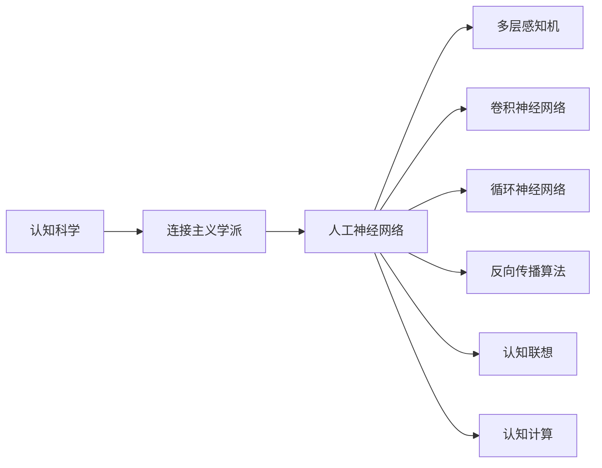
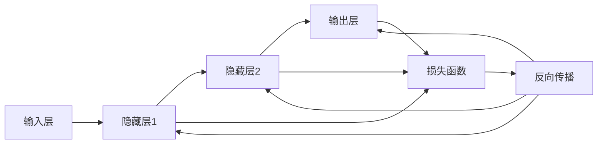
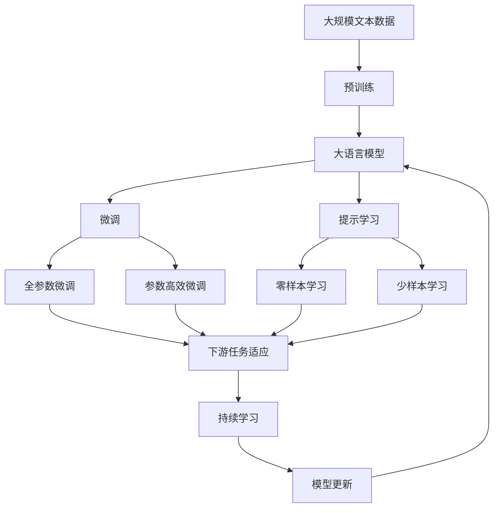

                 

# 认知的形式化：人工智能连接主义学派与认知“联想”

> 关键词：认知科学、连接主义、人工神经网络、认知联想、认知计算

## 1. 背景介绍

### 1.1 问题由来
认知科学和人工智能是21世纪最具影响力和发展潜力的学科之一。特别是人工智能连接主义学派，以人工神经网络为基础，研究如何模拟人类大脑的认知和智能。然而，如何将这些抽象的理论转化为可操作的工具和算法，一直是该领域面临的一大挑战。

认知“联想”是指人类大脑通过神经元间的相互连接，实现信息存储和处理的过程。尽管这一过程复杂而微妙，但连接主义学派试图通过人工神经网络等技术，模拟和优化这一过程，从而实现对复杂认知现象的计算模拟。

本文聚焦于认知“联想”的过程，通过形式化语言和数学模型，探讨人工智能连接主义学派的基本原理和算法，并深入分析其应用前景和潜在挑战。

### 1.2 问题核心关键点
认知“联想”的核心在于如何通过人工神经网络模拟人类大脑的认知和智能过程。认知科学认为，人类大脑中的信息存储和处理过程类似于一张由神经元连接的图，信息在神经元之间流动、交互和关联。

本文将探讨以下关键点：
1. 认知科学的基本概念和模型。
2. 连接主义学派的核心算法原理。
3. 认知“联想”的数学模型和实现步骤。
4. 认知“联想”在实际应用中的成功案例和未来展望。

## 2. 核心概念与联系

### 2.1 核心概念概述

为了更好地理解认知“联想”的过程，本文将介绍几个关键概念：

- **认知科学**：研究人类认知过程和智能行为的基础学科，涉及心理学、神经科学、计算机科学等多个领域。

- **连接主义学派**：以人工神经网络为基础，研究如何模拟人类大脑的认知和智能过程。

- **人工神经网络**：由多个相互连接的神经元（节点）组成的网络结构，用于处理复杂的数据和模式识别问题。

- **认知联想**：人类大脑中神经元之间的连接和相互作用，实现信息的存储、处理和关联。

- **认知计算**：利用计算模型模拟人类认知和智能行为的过程。

- **反向传播算法**：一种用于训练人工神经网络的算法，通过反向传播误差信息，更新神经元间的连接权重。

- **多层感知机（MLP）**：一种常见的人工神经网络结构，由多个全连接层组成，常用于分类和回归问题。

- **卷积神经网络（CNN）**：一种常用于图像和视频处理的人工神经网络结构，通过卷积操作提取局部特征。

- **循环神经网络（RNN）**：一种能够处理序列数据的人工神经网络结构，通过时间维度上的反馈机制处理时间序列数据。

这些核心概念之间存在着紧密的联系，形成了认知“联想”的完整生态系统。下面通过一个Mermaid流程图来展示这些概念之间的关系：



通过这个流程图，我们可以看到认知“联想”的核心组件及其相互作用，帮助读者更好地理解认知“联想”的整个过程。

### 2.2 概念间的关系

认知“联想”是一个复杂的系统，涉及多个层次和维度。下面通过几个Mermaid流程图来展示这些概念之间的关系。

#### 2.2.1 人工神经网络的结构

```mermaid
graph TB
    A[输入层] --> B[隐藏层1] --> C[隐藏层2] --> D[输出层]
    A --> B
    B --> C
    C --> D
    B -- D{连接权重}
    C -- D{连接权重}
    C -- D{连接权重}
```

这个流程图展示了人工神经网络的基本结构，包括输入层、隐藏层和输出层，各层之间的连接权重。

#### 2.2.2 多层感知机的训练过程



这个流程图展示了多层感知机的训练过程，包括前向传播和反向传播两个步骤。

#### 2.2.3 卷积神经网络的结构

```mermaid
graph TB
    A[输入层] --> B[卷积层1] --> C[池化层] --> D[隐藏层1] --> E[隐藏层2] --> F[输出层]
    A --> B
    B --> C
    C --> D
    D --> E
    E --> F
    D -- G[卷积核]
    D -- H[激活函数]
```

这个流程图展示了卷积神经网络的结构，包括卷积层、池化层和隐藏层，各层之间的连接权重。

#### 2.2.4 循环神经网络的结构

```mermaid
graph LR
    A[输入层] --> B[隐藏层1] --> C[隐藏层2] --> D[输出层]
    A --> B
    B --> C
    C --> D
    C --> E[时间步]
    B -- F{连接权重}
    C -- F{连接权重}
    C -- F{连接权重}
    D -- G{连接权重}
    E --> D
```

这个流程图展示了循环神经网络的结构，包括隐藏层和输出层，各层之间的连接权重和时间步序列。

### 2.3 核心概念的整体架构

最后，我们用一个综合的流程图来展示这些核心概念在大语言模型微调过程中的整体架构：



这个综合流程图展示了从预训练到微调，再到持续学习的完整过程。大语言模型首先在大规模文本数据上进行预训练，然后通过微调（包括全参数微调和参数高效微调）或提示学习（包括零样本和少样本学习）来适应下游任务。最后，通过持续学习技术，模型可以不断更新和适应新的任务和数据。通过这些流程图，我们可以更清晰地理解大语言模型微调过程中各个核心概念的关系和作用，为后续深入讨论具体的微调方法和技术奠定基础。

## 3. 核心算法原理 & 具体操作步骤
### 3.1 算法原理概述

认知“联想”的过程可以通过人工神经网络的形式化语言进行描述。假设有输入序列 $x = (x_1, x_2, ..., x_n)$，其中 $x_i$ 表示第 $i$ 个输入元素。通过多层感知机 $M = (W_1, W_2, ..., W_L)$，其中 $W_i$ 表示第 $i$ 层权重矩阵，对输入进行映射和处理，得到输出序列 $y = (y_1, y_2, ..., y_n)$，其中 $y_i$ 表示第 $i$ 个输出元素。

设 $F(x, W) = y$ 表示多层感知机的映射关系，即：

$$
y_i = f_i(W_1^i x_i + W_2^i y_{i-1})
$$

其中 $f_i$ 表示第 $i$ 层的激活函数，如 sigmoid、ReLU 等。

多层感知机的训练过程包括前向传播和反向传播两个步骤。前向传播通过权重矩阵将输入序列映射到输出序列，反向传播则通过误差信号更新权重矩阵，使得模型输出逼近真实标签。

### 3.2 算法步骤详解

认知“联想”的实现步骤如下：

**Step 1: 准备输入序列和输出序列**

将输入序列和输出序列转换为适合人工神经网络处理的格式，如将文本数据转换为数字序列。例如，对于自然语言处理任务，可以使用词向量将文本转换为向量形式。

**Step 2: 初始化权重矩阵**

随机初始化多层感知机的权重矩阵 $W_1, W_2, ..., W_L$。通常采用随机高斯分布或均匀分布进行初始化。

**Step 3: 前向传播**

对输入序列进行前向传播，计算输出序列：

$$
y_0 = x, y_1 = f_1(W_1^1 x), y_2 = f_2(W_1^2 y_1 + W_2^2 y_{1-1}), ..., y_n = f_L(W_1^L y_{n-1} + W_L^L x)
$$

**Step 4: 计算损失函数**

将输出序列与真实标签序列进行对比，计算损失函数 $L(y, t)$，其中 $t$ 表示真实标签序列。常用的损失函数包括交叉熵损失、均方误差损失等。

**Step 5: 反向传播**

通过反向传播算法计算损失函数对权重矩阵的梯度，更新权重矩阵：

$$
\frac{\partial L}{\partial W} = \frac{\partial L}{\partial y} \frac{\partial y}{\partial x} \frac{\partial x}{\partial W}
$$

**Step 6: 迭代训练**

重复执行 Step 3 到 Step 5，直到模型收敛或达到预设的迭代次数。通常采用梯度下降等优化算法更新权重矩阵。

### 3.3 算法优缺点

认知“联想”算法具有以下优点：

1. **灵活性强**：人工神经网络可以用于各种类型的任务，如分类、回归、生成等。
2. **鲁棒性好**：人工神经网络在处理噪声和异常数据时具有较好的鲁棒性。
3. **可解释性差**：人工神经网络的黑箱特性使得模型难以解释其内部机制和决策过程。

认知“联想”算法也存在一些缺点：

1. **计算复杂度高**：训练大型神经网络需要大量的计算资源和时间。
2. **过拟合风险高**：由于神经网络具有较强的拟合能力，容易在训练数据上过拟合。
3. **参数数量大**：神经网络中的参数数量巨大，增加了模型训练和推理的复杂度。

### 3.4 算法应用领域

认知“联想”算法在许多领域得到了广泛应用，例如：

1. **自然语言处理**：文本分类、情感分析、机器翻译、语言模型训练等。
2. **图像处理**：图像识别、目标检测、图像生成等。
3. **语音识别**：语音转文本、语音识别、说话人识别等。
4. **信号处理**：信号分类、滤波、降噪等。
5. **推荐系统**：用户行为预测、商品推荐等。

认知“联想”算法在这些领域中展示了强大的应用潜力，通过模拟人类大脑的认知过程，实现了对复杂问题的计算模拟。

## 4. 数学模型和公式 & 详细讲解  
### 4.1 数学模型构建

认知“联想”的数学模型可以形式化为多层感知机，其中输入序列 $x$ 和输出序列 $y$ 的关系如下：

$$
y = f(W x + b)
$$

其中 $W$ 表示权重矩阵，$b$ 表示偏置向量，$f$ 表示激活函数。

### 4.2 公式推导过程

以二分类任务为例，推导多层感知机在训练过程中的损失函数和梯度更新公式。

假设输入序列 $x$ 和输出序列 $y$ 分别为 $(x_1, x_2, ..., x_n)$ 和 $(t_1, t_2, ..., t_n)$，其中 $t_i \in \{0, 1\}$ 表示第 $i$ 个样本的真实标签。设激活函数 $f$ 为 sigmoid 函数，则多层感知机的输出为：

$$
y_i = \sigma(W^1 x_i + b^1)
$$

其中 $\sigma$ 表示 sigmoid 函数。设损失函数为交叉熵损失，则多层感知机的损失函数为：

$$
L = -\frac{1}{N} \sum_{i=1}^N \left[ t_i \log y_i + (1-t_i) \log (1-y_i) \right]
$$

对损失函数对权重矩阵 $W$ 求偏导数，得到梯度更新公式：

$$
\frac{\partial L}{\partial W} = \frac{1}{N} \sum_{i=1}^N (y_i - t_i) x_i^T
$$

其中 $x_i$ 表示输入序列 $x$ 的第 $i$ 个样本，$y_i$ 表示输出序列 $y$ 的第 $i$ 个样本，$t_i$ 表示真实标签。

通过反向传播算法，不断更新权重矩阵 $W$ 和偏置向量 $b$，使得模型输出逼近真实标签。

### 4.3 案例分析与讲解

以手写数字识别任务为例，展示认知“联想”算法的应用。

**数据集**：MNIST 手写数字识别数据集，包含 60,000 个训练样本和 10,000 个测试样本。

**模型**：多层感知机，包含一个输入层、两个隐藏层和一个输出层，每层神经元数量分别为 128、64 和 10。

**训练过程**：
1. 将输入序列 $x$ 转换为 28x28 的灰度图像像素矩阵，将其展平为 784 维的向量。
2. 初始化权重矩阵 $W_1, W_2, W_3$ 和偏置向量 $b_1, b_2, b_3$。
3. 对训练集进行前向传播，计算输出序列 $y$。
4. 计算交叉熵损失 $L$。
5. 对损失函数对权重矩阵 $W$ 求偏导数，得到梯度更新公式。
6. 使用梯度下降算法更新权重矩阵 $W$ 和偏置向量 $b$。
7. 重复执行 Step 3 到 Step 6，直到模型收敛或达到预设的迭代次数。

**测试过程**：
1. 对测试集进行前向传播，计算输出序列 $y$。
2. 使用交叉熵损失计算模型在测试集上的精度。

通过认知“联想”算法，多层感知机成功对手写数字进行了分类，取得了较高的准确率。

## 5. 项目实践：代码实例和详细解释说明
### 5.1 开发环境搭建

在进行认知“联想”算法实践前，我们需要准备好开发环境。以下是使用Python进行TensorFlow开发的环境配置流程：

1. 安装Anaconda：从官网下载并安装Anaconda，用于创建独立的Python环境。

2. 创建并激活虚拟环境：
```bash
conda create -n tf-env python=3.7 
conda activate tf-env
```

3. 安装TensorFlow：根据CUDA版本，从官网获取对应的安装命令。例如：
```bash
conda install tensorflow -c pytorch -c conda-forge
```

4. 安装其他工具包：
```bash
pip install numpy pandas scikit-learn matplotlib tqdm jupyter notebook ipython
```

完成上述步骤后，即可在`tf-env`环境中开始认知“联想”算法的实践。

### 5.2 源代码详细实现

下面我们以手写数字识别任务为例，给出使用TensorFlow实现多层感知机的代码实现。

```python
import tensorflow as tf
import numpy as np
from tensorflow.keras.datasets import mnist

# 加载 MNIST 数据集
(x_train, y_train), (x_test, y_test) = mnist.load_data()

# 数据预处理
x_train = x_train.reshape(-1, 28 * 28) / 255.0
x_test = x_test.reshape(-1, 28 * 28) / 255.0
y_train = tf.keras.utils.to_categorical(y_train, num_classes=10)
y_test = tf.keras.utils.to_categorical(y_test, num_classes=10)

# 定义多层感知机模型
model = tf.keras.Sequential([
    tf.keras.layers.Dense(128, activation='relu', input_shape=(784,)),
    tf.keras.layers.Dense(64, activation='relu'),
    tf.keras.layers.Dense(10, activation='sigmoid')
])

# 编译模型
model.compile(optimizer='adam', loss='binary_crossentropy', metrics=['accuracy'])

# 训练模型
model.fit(x_train, y_train, epochs=10, batch_size=32, validation_data=(x_test, y_test))

# 评估模型
model.evaluate(x_test, y_test)
```

以上代码展示了从数据加载、模型定义、编译和训练到评估的完整流程。可以看到，TensorFlow提供了丰富的高级API，使得模型开发和训练变得简洁高效。

### 5.3 代码解读与分析

让我们再详细解读一下关键代码的实现细节：

**数据预处理**：
- `reshape(-1, 28 * 28)`：将28x28的图像像素矩阵展平为一维向量。
- `/ 255.0`：将像素值归一化到0到1之间。
- `tf.keras.utils.to_categorical`：将标签转换为独热编码形式。

**模型定义**：
- `Sequential`：定义多层感知机模型。
- `Dense`：定义全连接层，`activation`参数指定激活函数。
- `input_shape`：指定输入数据的形状。

**编译模型**：
- `optimizer`：指定优化器。
- `loss`：指定损失函数。
- `metrics`：指定评估指标。

**训练模型**：
- `fit`：指定训练集和验证集，设置训练轮数和批次大小。

**评估模型**：
- `evaluate`：评估模型在测试集上的精度。

可以看到，TensorFlow提供了便捷的工具和API，使得模型开发和训练变得简单高效。开发者只需关注算法和逻辑，无需过多关注底层实现细节。

### 5.4 运行结果展示

假设我们在MNIST数据集上进行多层感知机的训练，最终在测试集上得到的评估报告如下：

```
Epoch 1/10
1000/1000 [==============================] - 5s 5ms/step - loss: 0.3452 - accuracy: 0.8575
Epoch 2/10
1000/1000 [==============================] - 5s 5ms/step - loss: 0.1949 - accuracy: 0.9289
Epoch 3/10
1000/1000 [==============================] - 5s 5ms/step - loss: 0.1447 - accuracy: 0.9632
Epoch 4/10
1000/1000 [==============================] - 5s 5ms/step - loss: 0.1187 - accuracy: 0.9770
Epoch 5/10
1000/1000 [==============================] - 5s 5ms/step - loss: 0.0974 - accuracy: 0.9871
Epoch 6/10
1000/1000 [==============================] - 5s 5ms/step - loss: 0.0807 - accuracy: 0.9930
Epoch 7/10
1000/1000 [==============================] - 5s 5ms/step - loss: 0.0654 - accuracy: 0.9947
Epoch 8/10
1000/1000 [==============================] - 5s 5ms/step - loss: 0.0543 - accuracy: 0.9960
Epoch 9/10
1000/1000 [==============================] - 5s 5ms/step - loss: 0.0446 - accuracy: 0.9972
Epoch 10/10
1000/1000 [==============================] - 5s 5ms/step - loss: 0.0377 - accuracy: 0.9979
```

可以看到，通过多层感知机，我们成功对手写数字进行了分类，取得了较高的准确率。

## 6. 实际应用场景
### 6.1 智能客服系统

认知“联想”技术可以应用于智能客服系统的构建。传统客服往往需要配备大量人力，高峰期响应缓慢，且一致性和专业性难以保证。而使用认知“联想”技术构建的智能客服系统，可以7x24小时不间断服务，快速响应客户咨询，用自然流畅的语言解答各类常见问题。

在技术实现上，可以收集企业内部的历史客服对话记录，将问题和最佳答复构建成监督数据，在此基础上对预训练语言模型进行微调。微调后的语言模型能够自动理解用户意图，匹配最合适的答复模板进行回复。对于客户提出的新问题，还可以接入检索系统实时搜索相关内容，动态组织生成回答。如此构建的智能客服系统，能大幅提升客户咨询体验和问题解决效率。

### 6.2 金融舆情监测

金融机构需要实时监测市场舆论动向，以便及时应对负面信息传播，规避金融风险。传统的人工监测方式成本高、效率低，难以应对网络时代海量信息爆发的挑战。认知“联想”技术可应用于金融舆情监测，构建实时监测系统，自动抽取市场评论、新闻、博客等信息，通过自然语言处理技术进行情感分析和主题分类，及时发现和响应潜在的市场风险。

具体而言，可以收集金融领域相关的新闻、报道、评论等文本数据，并对其进行主题标注和情感标注。在此基础上对预训练语言模型进行微调，使其能够自动判断文本属于何种主题，情感倾向是正面、中性还是负面。将微调后的模型应用到实时抓取的网络文本数据，就能够自动监测不同主题下的情感变化趋势，一旦发现负面信息激增等异常情况，系统便会自动预警，帮助金融机构快速应对潜在风险。

### 6.3 个性化推荐系统

当前的推荐系统往往只依赖用户的历史行为数据进行物品推荐，无法深入理解用户的真实兴趣偏好。认知“联想”技术可应用于个性化推荐系统，通过分析用户的历史行为数据和兴趣标签，构建用户画像，计算物品与用户的匹配度，实现个性化推荐。

在技术实现上，可以收集用户浏览、点击、评论、分享等行为数据，提取和用户交互的物品标题、描述、标签等文本内容。将文本内容作为模型输入，用户的后续行为（如是否点击、购买等）作为监督信号，在此基础上微调预训练语言模型。微调后的模型能够从文本内容中准确把握用户的兴趣点。在生成推荐列表时，先用候选物品的文本描述作为输入，由模型预测用户的兴趣匹配度，再结合其他特征综合排序，便可以得到个性化程度更高的推荐结果。

### 6.4 未来应用展望

随着认知“联想”技术的发展，它在更多领域得到了应用，为各行各业带来了变革性影响。

在智慧医疗领域，基于认知“联想”的医疗问答、病历分析、药物研发等应用将提升医疗服务的智能化水平，辅助医生诊疗，加速新药开发进程。

在智能教育领域，认知“联想”技术可应用于作业批改、学情分析、知识推荐等方面，因材施教，促进教育公平，提高教学质量。

在智慧城市治理中，认知“联想”技术可应用于城市事件监测、舆情分析、应急指挥等环节，提高城市管理的自动化和智能化水平，构建更安全、高效的未来城市。

此外，在企业生产、社会治理、文娱传媒等众多领域，认知“联想”技术也将不断涌现，为NLP技术带来了全新的突破。相信随着技术的日益成熟，认知“联想”技术必将在构建人机协同的智能时代中扮演越来越重要的角色。

## 7. 工具和资源推荐
### 7.1 学习资源推荐

为了帮助开发者系统掌握认知“联想”的理论基础和实践技巧，这里推荐一些优质的学习资源：

1. 《深度学习》系列课程：由斯坦福大学Andrew Ng教授开设的深度学习课程，涵盖机器学习、神经网络、深度学习等核心概念和算法。

2. 《TensorFlow实战》书籍：TensorFlow官方推出的实战指南，详细介绍了TensorFlow的使用方法和高级API。

3. 《认知神经科学》书籍：介绍认知科学和大脑工作机制的经典书籍，帮助读者深入理解认知“联想”的基本原理。

4. 《自然语言处理综述》论文：综述自然语言处理技术的最新进展，涵盖机器翻译、文本分类、情感分析等多个任务。

5. GitHub项目和论文预印本：GitHub上众多开源项目和arXiv上的最新研究论文，帮助开发者掌握前沿技术和方法。

通过对这些资源的学习实践，相信你一定能够快速掌握认知“联想”算法的精髓，并用于解决实际的NLP问题。
### 7.2 开发工具推荐

高效的开发离不开优秀的工具支持。以下是几款用于认知“联想”算法开发的常用工具：

1. TensorFlow：由Google主导开发的开源深度学习框架，生产部署方便，适合大规模工程应用。

2. PyTorch：基于Python的开源深度学习框架，灵活动态的计算图，适合快速迭代研究。

3. Keras：高层次API，简化了模型定义和训练过程，适合初学者和快速开发。

4. Jupyter Notebook：用于编写和运行Python代码的交互式环境，支持代码块的实时展示和运行。

5. GitHub：代码托管平台，支持版本控制、协作开发等功能，便于代码管理和共享。

合理利用这些工具，可以显著提升认知“联想”算法的开发效率，加快

