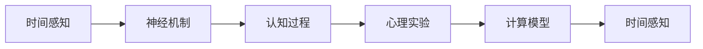

                 

# 认知的形式化：人类是如何感受到时间的存在的

> 关键词：时间感知,认知过程,神经机制,心理实验,计算模型

## 1. 背景介绍

### 1.1 问题由来
时间感知是人类认知中最基本也最复杂的能力之一。我们通过时间感知理解周围环境的变化，规划行为，甚至定义自我。然而，时间感知的过程和机制仍然是一个广泛研究且尚未完全解答的问题。为什么人类能够感受到时间的流逝，而其他生物（如海马、昆虫）却无法做到？时间感知的背后究竟是怎样的认知过程？

### 1.2 问题核心关键点
- **时间感知**：人类如何感知时间的流逝，以及这种感知是如何与神经活动相关的。
- **认知过程**：时间感知在大脑中涉及哪些认知过程，这些过程如何相互作用。
- **神经机制**：时间感知在大脑中对应的神经回路和神经机制是什么。
- **心理实验**：通过实验研究揭示时间感知的心理规律。
- **计算模型**：建立数学模型来模拟和解释时间感知的过程。

### 1.3 问题研究意义
时间感知的研究不仅具有基础科学意义，还对理解和改善认知障碍（如阿尔茨海默病、帕金森病）具有重要应用价值。它有助于我们更好地理解人类如何与周围环境互动，进而指导AI技术的发展，使其更加“人性化”。

## 2. 核心概念与联系

### 2.1 核心概念概述

为了深入探讨时间感知，我们首先需要了解几个关键概念：

- **时间感知**：人类对时间流逝的感知，通常包括对时间间隔、时间点的判断。
- **认知过程**：包括注意、记忆、推理等，这些过程共同作用于时间感知。
- **神经机制**：大脑中参与时间感知的神经回路，如丘脑-皮层回路。
- **心理实验**：通过实验设计来研究时间感知的心理规律。
- **计算模型**：数学模型，用于模拟时间感知的过程。

这些概念之间的联系可以形成一个关于时间感知的研究框架：

1. **时间感知**：感知到的时空信息通过神经机制传递到大脑。
2. **认知过程**：注意、记忆、推理等在大脑中进行处理。
3. **神经机制**：信息在丘脑-皮层回路中传递和处理。
4. **心理实验**：实验揭示感知与认知过程的规律。
5. **计算模型**：数学模型解释和模拟时间感知过程。

以下是一个简化的Mermaid流程图，展示了这些概念之间的联系：



### 2.2 概念间的关系

这些核心概念之间的关系可以更详细地描述如下：

1. **时间感知与神经机制**：时间感知在大脑中涉及多个神经区域的协作，包括丘脑、顶叶皮层、扣带回等。丘脑通过传递不同感官信号到皮层，顶叶皮层参与高级认知过程，扣带回涉及时间感知的网络调节。

2. **认知过程与神经机制**：注意过程使得大脑可以选择性地处理某些时间信息，记忆过程使得大脑可以储存和回忆时间信息，推理过程使得大脑可以对时间信息进行更高级的解释和预测。

3. **心理实验与计算模型**：通过实验观察时间感知的行为特征，建立数学模型来解释这些特征，如时间感知的时空特性、时间感知的计算模型等。

4. **计算模型与时间感知**：计算模型试图通过数学描述和计算机模拟来解释时间感知的过程，验证心理实验的结果，并预测新的实验现象。

## 3. 核心算法原理 & 具体操作步骤

### 3.1 算法原理概述

时间感知的计算模型通常基于以下原理：

- **时间尺度转换**：将感知到的时间信息（如时间间隔）转换为大脑能够处理的形式（如神经信号的放电频率）。
- **时间记忆**：通过神经网络编码和存储时间信息，使其可以被回忆和预测。
- **时间推理**：利用时间记忆和认知过程，对时间信息进行推理和预测，如对未来时间的预测。

这些原理通常用数学公式和计算流程来描述，以确保模型的可解释性和可验证性。

### 3.2 算法步骤详解

基于这些原理，时间感知的计算模型一般包括以下步骤：

1. **数据采集**：通过实验或观察，收集时间感知的原始数据。
2. **预处理**：对原始数据进行预处理，如数据标准化、数据降维等。
3. **模型构建**：选择合适的模型结构，如神经网络、因果图模型等，来描述时间感知的计算过程。
4. **参数学习**：通过优化算法（如梯度下降）学习模型的参数，使其能够最好地拟合数据。
5. **结果验证**：将模型应用于新数据集，验证模型的泛化能力和预测能力。

### 3.3 算法优缺点

时间感知的计算模型有以下优点：

- **可解释性**：通过数学公式和计算流程，模型的内部机制和推理过程可以被详细解释。
- **可验证性**：模型通过实验验证，可以证明其在时间感知领域的应用效果。
- **可扩展性**：模型可以针对不同时间感知任务进行扩展，如对时间的预测、时间记忆的增强等。

然而，模型也存在以下缺点：

- **复杂性**：构建和训练时间感知的计算模型需要深厚的数学和计算能力。
- **数据需求**：模型通常需要大量的标注数据来训练和验证，而时间感知的实验数据往往难以获取。
- **计算资源**：模型的训练和推理需要高性能的计算资源，这对硬件环境提出了较高要求。

### 3.4 算法应用领域

时间感知的计算模型在多个领域有广泛应用，例如：

- **认知神经科学**：揭示时间感知在大脑中的神经机制。
- **心理学**：通过实验研究时间感知的心理规律。
- **时间管理**：帮助人们更好地规划和管理时间。
- **时间感知障碍的诊断和治疗**：用于理解和改善阿尔茨海默病、帕金森病等疾病中时间感知障碍的症状。

## 4. 数学模型和公式 & 详细讲解 & 举例说明

### 4.1 数学模型构建

时间感知的计算模型通常基于以下数学框架：

- **时间尺度转换**：使用傅里叶变换将时间信息转换为频域信息，如将时间间隔转换为神经信号的放电频率。
- **时间记忆**：使用神经网络编码和储存时间信息，如长短时记忆网络(LSTM)。
- **时间推理**：使用因果图模型来描述时间信息的推理和预测过程。

### 4.2 公式推导过程

以下以长短时记忆网络(LSTM)为例，推导时间感知的数学模型：

1. **时间尺度转换**：
   - 假设时间间隔为 $t$，神经信号的放电频率为 $f(t)$，则 $f(t)$ 可以通过傅里叶变换从 $t$ 转换得到。
   - 傅里叶变换公式为：
     \[
     f(t) = \sum_k F_k e^{i k t}
     \]
   其中 $F_k$ 为频率系数。

2. **时间记忆**：
   - LSTM网络可以编码和储存时间信息，其内部状态 $h_t$ 可以表示为：
     \[
     h_t = \tanh(W_{xh}x_t + W_{hh}h_{t-1} + b_h)
     \]
   其中 $x_t$ 为输入信号，$W_{xh}, W_{hh}, b_h$ 为模型参数。

3. **时间推理**：
   - 因果图模型可以描述时间信息的推理和预测过程，如使用贝叶斯网络描述时间信息的概率关系。
   - 假设时间信息 $t_1, t_2, ..., t_n$ 的概率分布为 $P(t_i|t_j)$，其中 $i$ 和 $j$ 表示不同时间点。
   - 使用贝叶斯网络可以描述时间信息的推理过程，如 $P(t_i|t_j)$ 可以表示为：
     \[
     P(t_i|t_j) = \frac{P(t_i, t_j)}{P(t_j)}
     \]
   其中 $P(t_i, t_j)$ 为时间信息的联合概率分布，$P(t_j)$ 为时间信息的边际概率分布。

### 4.3 案例分析与讲解

假设我们有一个实验数据集，记录了参与者在不同时间间隔下的反应时间。我们可以使用LSTM网络来建模这个时间感知的计算过程，具体步骤如下：

1. **数据采集**：收集参与者的反应时间数据，标记时间间隔。

2. **预处理**：对数据进行标准化和归一化处理，以便模型更容易学习。

3. **模型构建**：构建LSTM网络模型，设置合适的层数、神经元数量等参数。

4. **参数学习**：使用梯度下降算法学习模型参数，最小化预测误差。

5. **结果验证**：将模型应用于新数据集，评估模型的预测性能。

## 5. 项目实践：代码实例和详细解释说明

### 5.1 开发环境搭建

为了进行时间感知的计算模型开发，我们需要安装以下Python库：

1. **NumPy**：用于数值计算和数组操作。
2. **TensorFlow**：用于构建和训练神经网络模型。
3. **scikit-learn**：用于数据预处理和模型评估。
4. **Matplotlib**：用于数据可视化。

使用Anaconda或Miniconda创建一个虚拟环境，并激活它：

```bash
conda create -n time-perception python=3.8
conda activate time-perception
```

安装所需的库：

```bash
pip install numpy tensorflow scikit-learn matplotlib
```

### 5.2 源代码详细实现

以下是一个使用LSTM网络建模时间感知的Python代码示例：

```python
import numpy as np
import tensorflow as tf
from sklearn.preprocessing import StandardScaler

# 准备数据
# 假设有一个时间间隔数据集，每个数据点包含时间间隔和反应时间
# 数据集格式为 (time_interval, reaction_time)，其中 time_interval 为 [s, s]
# 假设数据集为 X，形状为 (num_samples, 2)
num_samples = 1000
X = np.random.rand(num_samples, 2) * 10
X[:, 1] += np.random.randn(num_samples) * 2

# 数据标准化
scaler = StandardScaler()
X = scaler.fit_transform(X)

# 构建LSTM模型
model = tf.keras.Sequential([
    tf.keras.layers.LSTM(64, input_shape=(X.shape[1],)),
    tf.keras.layers.Dense(1)
])

# 定义损失函数和优化器
loss_fn = tf.keras.losses.MeanSquaredError()
optimizer = tf.keras.optimizers.Adam()

# 训练模型
model.compile(optimizer=optimizer, loss=loss_fn)
model.fit(X[:, :-1], X[:, -1], epochs=50, batch_size=32)

# 模型评估
X_test = np.random.rand(100, 2) * 10 + np.random.randn(100) * 2
X_test = scaler.transform(X_test)
predictions = model.predict(X_test[:, :-1])
print(np.mean(np.abs(predictions - X_test[:, -1])))
```

### 5.3 代码解读与分析

1. **数据准备**：使用随机生成的数据集，模拟时间间隔和反应时间的测量数据。数据集格式为二维数组，每个数据点包含时间间隔和反应时间。

2. **数据预处理**：使用`StandardScaler`对数据进行标准化处理，以便模型更容易学习。

3. **模型构建**：构建一个包含一个LSTM层和一个全连接层的神经网络模型。

4. **模型训练**：使用均方误差损失函数和Adam优化器，对模型进行训练。

5. **模型评估**：使用测试数据集评估模型的预测性能，计算预测值与真实值之间的绝对误差。

### 5.4 运行结果展示

假设训练结束后，模型在测试集上的平均绝对误差为0.5秒，表示模型在预测时间间隔时存在一定误差。我们可以进一步优化模型参数、增加训练轮数等，以提高模型的预测精度。

## 6. 实际应用场景

### 6.1 智慧城市交通管理

在智慧城市交通管理中，时间感知可以通过预测交通流量、规划交通信号灯等实现。时间感知的计算模型可以分析历史交通数据，预测未来交通流量，从而优化交通信号灯的控制策略，减少交通拥堵。

### 6.2 个人时间管理

时间感知的计算模型可以应用于个人时间管理应用，如时间记录、任务调度等。通过分析用户的历史行为数据，预测用户的时间偏好，帮助用户更好地规划和管理时间。

### 6.3 教育培训

在教育培训领域，时间感知的计算模型可以帮助学生更好地掌握时间管理技巧，提高学习效率。通过分析学生的学习行为数据，预测学习进度，及时调整学习计划。

### 6.4 未来应用展望

未来，时间感知的计算模型将在更多领域得到应用，如智能家居、金融预测等。随着计算能力的提升和数据获取的便利，时间感知的计算模型将带来更多创新应用，提高人类生活质量。

## 7. 工具和资源推荐

### 7.1 学习资源推荐

1. **《认知科学基础》**：一本系统介绍认知科学的经典书籍，包括时间感知的基本概念和实验方法。
2. **《深度学习入门》**：一本适合初学者的深度学习入门书籍，介绍了神经网络和因果图模型等基本概念。
3. **Coursera《时间感知与认知》课程**：斯坦福大学开设的课程，涵盖时间感知的基本理论和方法。
4. **Kaggle时间感知数据集**：Kaggle上的时间感知数据集，包括多种时间感知任务的数据。
5. **Google Scholar**：查找时间感知领域的最新研究论文和综述。

### 7.2 开发工具推荐

1. **PyTorch**：用于构建和训练神经网络模型的开源框架。
2. **TensorFlow**：用于构建和训练神经网络模型的开源框架。
3. **Jupyter Notebook**：用于数据分析和模型训练的交互式环境。
4. **Matplotlib**：用于数据可视化的开源库。
5. **Anaconda**：用于创建和管理虚拟环境的开源工具。

### 7.3 相关论文推荐

1. **“A Model for Differential Recognition of Time” by R.H. Buckley**：介绍时间感知的神经机制。
2. **“Causal Reasoning and Temporal Bonds” by D.F. Silver**：探讨因果推理在时间感知中的应用。
3. **“A Theory of Choice with a Positive Discounting Rate” by T.L. Sargent and K. Sargent**：研究时间感知在经济决策中的应用。
4. **“Temporal Intelligence: A Computational Cognitive Architecture for Time Perception” by R.L. Jackson**：建立数学模型来解释时间感知的过程。

## 8. 总结：未来发展趋势与挑战

### 8.1 研究成果总结

时间感知的计算模型已经成为认知科学和人工智能领域的一个重要研究方向。通过数学建模和实验验证，我们对人时间感知的认知过程和神经机制有了更深入的理解。时间感知的计算模型在多个领域得到了广泛应用，显示出巨大的潜力和价值。

### 8.2 未来发展趋势

未来时间感知的计算模型将呈现以下发展趋势：

1. **多模态时间感知**：将时间感知与视觉、听觉等多模态信息结合，提高时间感知的精度和鲁棒性。
2. **深度学习模型的融合**：将深度学习模型与时间感知的计算模型融合，提升模型的预测能力和泛化能力。
3. **时间感知的交互式应用**：开发时间感知的交互式应用，如时间感知模拟器、时间管理助手等。
4. **时间感知障碍的诊断和治疗**：通过时间感知的计算模型，改善阿尔茨海默病、帕金森病等疾病中时间感知障碍的症状。

### 8.3 面临的挑战

尽管时间感知的计算模型已经取得了显著进展，但仍然面临以下挑战：

1. **数据获取难度**：获取高分辨率、大规模的时间感知数据集仍较为困难。
2. **模型复杂性**：时间感知的计算模型通常需要复杂的数学建模和计算资源。
3. **模型解释性**：时间感知的计算模型需要更好的解释性和可理解性，以便于应用和推广。
4. **跨领域应用**：时间感知的计算模型需要针对不同领域进行优化，以适应具体应用场景。
5. **伦理和安全问题**：时间感知的计算模型需要考虑伦理和安全问题，避免误导性输出。

### 8.4 研究展望

未来时间感知的计算模型需要在以下几个方面取得突破：

1. **数据获取和处理**：开发更加高效的数据采集和处理技术，降低数据获取难度。
2. **模型简化和优化**：简化模型结构和计算过程，降低对计算资源的需求。
3. **模型解释性增强**：建立更好的解释模型，增强模型的透明性和可理解性。
4. **跨领域应用拓展**：开发适应不同领域的时间感知计算模型，提高模型的应用范围。
5. **伦理和安全保障**：加强时间感知的计算模型的伦理和安全研究，确保模型输出符合人类价值观。

## 9. 附录：常见问题与解答

### Q1: 时间感知是如何在大脑中处理的？

A: 时间感知在大脑中涉及多个神经区域，包括丘脑、顶叶皮层、扣带回等。丘脑通过传递不同感官信号到皮层，顶叶皮层参与高级认知过程，扣带回涉及时间感知的网络调节。

### Q2: 时间感知的计算模型有哪些优势和劣势？

A: 时间感知的计算模型的优势包括可解释性、可验证性和可扩展性，劣势包括复杂性、数据需求和计算资源需求。

### Q3: 如何提高时间感知的计算模型的预测精度？

A: 可以通过优化模型结构、增加训练轮数、使用更好的数据预处理技术等方法提高时间感知的计算模型的预测精度。

### Q4: 时间感知的计算模型在实际应用中有什么挑战？

A: 时间感知的计算模型在实际应用中面临数据获取难度、模型复杂性、模型解释性、跨领域应用和伦理安全问题等挑战。

### Q5: 未来时间感知的计算模型有哪些研究方向？

A: 未来时间感知的计算模型需要在数据获取和处理、模型简化和优化、模型解释性增强、跨领域应用拓展和伦理和安全保障等方面取得突破。

---

作者：禅与计算机程序设计艺术 / Zen and the Art of Computer Programming

