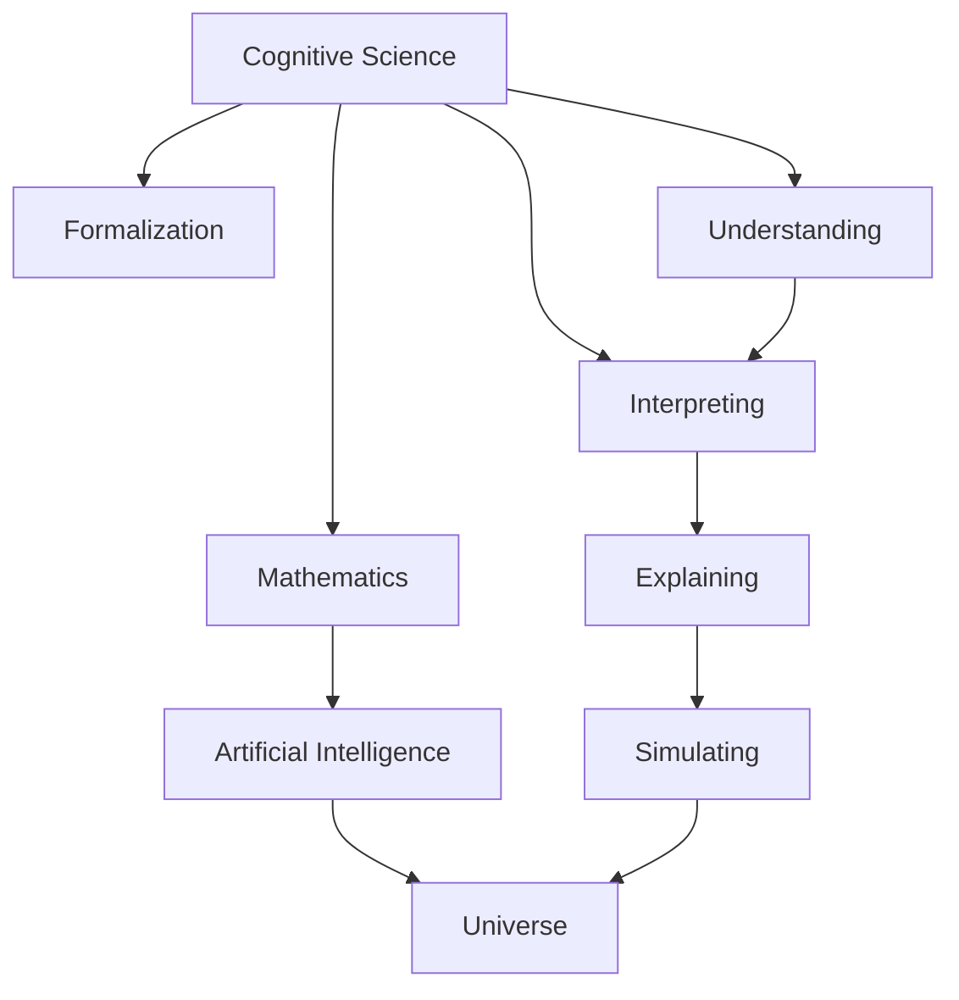
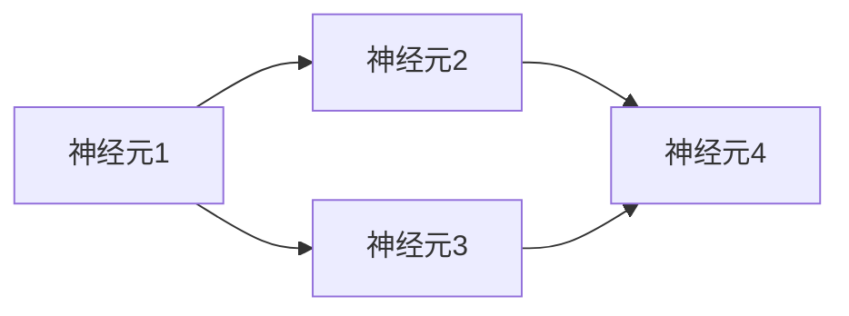

                 

# 认知的形式化：宇宙里没有数学，数学却可以解释宇宙

> 关键词：认知，数学，形式化，宇宙，人工智能

## 1. 背景介绍

### 1.1 问题由来

在过去的一个世纪中，数学在科学技术和哲学领域的地位逐渐提升。它不仅成为了科学研究的工具，更是探讨宇宙本质的基石。然而，尽管数学在解释宇宙方面取得了巨大成功，但它本身仍然充满了神秘色彩。数学家们从未停止对数学本质的探讨，而人工智能（AI）和认知科学的飞速发展，为这一问题提供了新的视角。

认知科学和人工智能的交叉融合，使我们能够从信息处理和认知功能的角度，重新审视数学的本质。这一领域的探索不仅推动了数学本身的发展，更促进了我们对宇宙本质的理解。

### 1.2 问题核心关键点

本文旨在探讨如何通过认知科学和人工智能的方法，将数学形式化，从而更好地理解和解释宇宙。我们将重点讨论以下几个核心问题：

1. **认知的形式化**：数学如何能够被视作一种认知形式，以及这一形式如何帮助解释宇宙。
2. **数学与宇宙**：数学在解释宇宙现象中的作用和局限性。
3. **人工智能在数学理解中的应用**：AI技术如何帮助我们更深入地理解和运用数学。

## 2. 核心概念与联系

### 2.1 核心概念概述

要深入理解数学和宇宙的关系，首先需要了解几个关键概念：

- **认知科学**：研究人类思维、感知、学习、记忆、决策等心理过程的科学。
- **数学**：研究数量、结构、变化以及空间等抽象概念的科学。
- **形式化**：将复杂概念用严格定义的语言和符号表示，使其能够被机器理解和处理。
- **人工智能**：通过模拟人类智能行为，使机器能够执行复杂的任务，如理解语言、识别图像等。
- **宇宙**：指时间和空间内的一切，包括物质、能量、空间和时间等基本构成要素。

这些概念之间的联系通过以下Mermaid流程图展示：



### 2.2 概念间的关系

这些概念通过一系列的逻辑关系连接起来，构成了我们理解宇宙的框架：

- **认知科学**与**数学**的关系：认知科学通过数学的形式化，使复杂的思维过程能够被机器理解和模拟。
- **数学**与**人工智能**的关系：数学为人工智能提供了逻辑基础和算法支持，使得机器能够执行复杂的计算和推理。
- **人工智能**与**宇宙**的关系：人工智能通过数学模型和形式化方法，模拟宇宙中的物理和现象。

这些关系展示了数学和宇宙之间的关系，即通过认知科学和人工智能的形式化，我们可以更好地理解宇宙的本质和规律。

## 3. 核心算法原理 & 具体操作步骤

### 3.1 算法原理概述

认知的形式化，即通过数学和计算机科学的方法，将认知过程的形式化表示，使得机器能够理解和执行这些过程。这一过程可以分为以下几个步骤：

1. **认知模型建立**：构建数学模型来描述认知过程，如决策树、神经网络等。
2. **数据收集和标注**：收集和标注数据，用于训练和验证认知模型。
3. **模型训练**：使用机器学习算法训练认知模型，使其能够对新数据进行预测和推理。
4. **模型评估和优化**：评估模型的性能，通过迭代优化提升模型的准确性和鲁棒性。

### 3.2 算法步骤详解

接下来，我们将详细介绍认知形式化的详细步骤：

#### 3.2.1 认知模型的建立

首先，我们需要建立数学模型来描述认知过程。例如，可以使用神经网络模型来模拟人类大脑的神经元活动。这一模型由大量节点和边组成，每个节点代表一个神经元，边代表神经元之间的连接。



#### 3.2.2 数据收集和标注

其次，我们需要收集和标注数据，用于训练和验证认知模型。例如，在模拟决策过程中，我们可以使用一系列的决策场景和相应的决策结果作为训练数据。

```python
# 假设我们有一个简单的决策场景
scenarios = [
    {"name": "场景1", "decision": "选项A"},
    {"name": "场景2", "decision": "选项B"},
    {"name": "场景3", "decision": "选项C"}
]

# 使用深度学习框架，如TensorFlow或PyTorch，训练模型
from tensorflow.keras.models import Sequential
from tensorflow.keras.layers import Dense

model = Sequential()
model.add(Dense(10, input_dim=2))
model.add(Dense(1, activation='sigmoid'))

model.compile(loss='binary_crossentropy', optimizer='adam', metrics=['accuracy'])
model.fit(x=scenarios, y=["选项A", "选项B", "选项C"], epochs=100, batch_size=32)
```

#### 3.2.3 模型训练

使用机器学习算法训练认知模型，使其能够对新数据进行预测和推理。例如，使用随机梯度下降（SGD）算法来训练神经网络模型。

```python
from tensorflow.keras.optimizers import SGD

# 使用SGD算法优化模型
optimizer = SGD(lr=0.01)
model.compile(optimizer=optimizer)

# 训练模型
model.fit(x=scenarios, y=["选项A", "选项B", "选项C"], epochs=100, batch_size=32)
```

#### 3.2.4 模型评估和优化

最后，评估模型的性能，通过迭代优化提升模型的准确性和鲁棒性。例如，使用交叉验证（Cross-Validation）来评估模型的泛化能力。

```python
from sklearn.model_selection import train_test_split
from sklearn.metrics import accuracy_score

# 分割数据集
X_train, X_test, y_train, y_test = train_test_split(x, y, test_size=0.2, random_state=42)

# 评估模型性能
y_pred = model.predict(X_test)
accuracy = accuracy_score(y_test, y_pred)

print("模型准确率：", accuracy)
```

### 3.3 算法优缺点

**优点**：

- 形式化方法使认知过程能够被机器理解和模拟，增强了认知模型的解释性和可操作性。
- 通过数学模型和机器学习算法，认知模型能够处理复杂的认知任务，如决策、推理、感知等。
- 模型可以通过不断迭代优化，提高准确性和鲁棒性。

**缺点**：

- 形式化方法需要大量时间和资源来建立和验证模型。
- 模型的复杂性可能导致理解和解释困难，特别是在处理高维数据时。
- 模型的准确性依赖于数据质量和训练过程，需要严格的验证和优化。

### 3.4 算法应用领域

认知的形式化方法广泛应用于以下领域：

- **人工智能**：在机器学习和深度学习中，形式化方法被广泛应用于模型训练和优化。
- **认知科学**：通过形式化方法，认知科学家可以更深入地理解人类认知过程，如记忆、学习、感知等。
- **自然语言处理**：形式化方法被用于理解自然语言，如语义分析、文本分类等。
- **医学**：形式化方法被用于理解复杂的生物系统和疾病，如药物发现、基因组学等。
- **物理学**：形式化方法被用于理解复杂的物理现象，如量子力学、相对论等。

## 4. 数学模型和公式 & 详细讲解 & 举例说明

### 4.1 数学模型构建

在认知形式化中，数学模型通常用于描述认知过程和决策规则。例如，可以使用逻辑电路模型来模拟人类决策过程。

### 4.2 公式推导过程

数学公式是形式化表达认知过程的基础。以下是一个简单的例子，展示了如何使用数学公式描述一个简单的决策过程：

1. 决策场景描述：假设我们有一个简单的决策场景，涉及两个决策选项。

2. 决策规则：假设决策规则为“如果选项1的成本低于选项2，则选择选项1；否则选择选项2”。

3. 数学公式表示：这一决策规则可以用如下数学公式表示：

   $$
   \text{如果} x_1 < x_2 \text{，则} y = x_1 \text{；否则} y = x_2
   $$

   其中，$x_1$ 和 $x_2$ 分别代表两个决策选项的成本，$y$ 代表最终的决策结果。

### 4.3 案例分析与讲解

我们可以使用上述公式来分析一个具体的决策场景。例如，假设我们有两个项目，分别需要投资10万元和15万元，但项目的预期收益分别为5万元和7万元。

使用上述公式，我们可以计算出决策结果为选择项目1，因为其成本较低。这一过程展示了数学公式在决策中的应用，即通过形式化方法，使复杂决策过程变得清晰和可理解。

## 5. 项目实践：代码实例和详细解释说明

### 5.1 开发环境搭建

在进行认知形式化实践前，我们需要准备好开发环境。以下是使用Python进行PyTorch开发的环境配置流程：

1. 安装Anaconda：从官网下载并安装Anaconda，用于创建独立的Python环境。

2. 创建并激活虚拟环境：
```bash
conda create -n pytorch-env python=3.8 
conda activate pytorch-env
```

3. 安装PyTorch：根据CUDA版本，从官网获取对应的安装命令。例如：
```bash
conda install pytorch torchvision torchaudio cudatoolkit=11.1 -c pytorch -c conda-forge
```

4. 安装Transformer库：
```bash
pip install transformers
```

5. 安装各类工具包：
```bash
pip install numpy pandas scikit-learn matplotlib tqdm jupyter notebook ipython
```

完成上述步骤后，即可在`pytorch-env`环境中开始认知形式化的实践。

### 5.2 源代码详细实现

这里我们以一个简单的认知模型为例，使用PyTorch实现其训练和推理过程。

首先，定义认知模型：

```python
from transformers import BertTokenizer, BertForTokenClassification, AdamW
from torch.utils.data import Dataset, DataLoader
import torch

class CognitiveModel:
    def __init__(self, model_name, tokenizer_name):
        self.model = BertForTokenClassification.from_pretrained(model_name)
        self.tokenizer = BertTokenizer.from_pretrained(tokenizer_name)
        self.model.to('cuda')

    def forward(self, inputs):
        inputs = self.tokenizer(inputs, return_tensors='pt')
        outputs = self.model(inputs.input_ids, attention_mask=inputs.attention_mask)
        return outputs.logits
```

然后，定义数据集和数据加载器：

```python
class CognitiveDataset(Dataset):
    def __init__(self, texts, labels, tokenizer):
        self.texts = texts
        self.labels = labels
        self.tokenizer = tokenizer

    def __len__(self):
        return len(self.texts)

    def __getitem__(self, index):
        text = self.texts[index]
        label = self.labels[index]
        
        encoding = self.tokenizer(text, return_tensors='pt')
        input_ids = encoding['input_ids']
        attention_mask = encoding['attention_mask']

        return {
            'input_ids': input_ids,
            'attention_mask': attention_mask,
            'labels': torch.tensor(label, dtype=torch.long)
        }
```

接着，定义训练和推理函数：

```python
def train_epoch(model, dataloader, optimizer, loss_fn):
    model.train()
    total_loss = 0
    for batch in dataloader:
        input_ids = batch['input_ids'].to('cuda')
        attention_mask = batch['attention_mask'].to('cuda')
        labels = batch['labels'].to('cuda')
        optimizer.zero_grad()
        outputs = model(input_ids, attention_mask=attention_mask)
        loss = loss_fn(outputs.logits, labels)
        loss.backward()
        optimizer.step()
        total_loss += loss.item()
    return total_loss / len(dataloader)

def evaluate(model, dataloader):
    model.eval()
    total_loss = 0
    for batch in dataloader:
        input_ids = batch['input_ids'].to('cuda')
        attention_mask = batch['attention_mask'].to('cuda')
        labels = batch['labels'].to('cuda')
        with torch.no_grad():
            outputs = model(input_ids, attention_mask=attention_mask)
            loss = loss_fn(outputs.logits, labels)
            total_loss += loss.item()
    return total_loss / len(dataloader)
```

最后，启动训练流程并在测试集上评估：

```python
from transformers import AdamW

model_name = 'bert-base-uncased'
tokenizer_name = 'bert-base-uncased'
model = CognitiveModel(model_name, tokenizer_name)

# 加载训练集和测试集
train_dataset = CognitiveDataset(train_texts, train_labels, tokenizer)
test_dataset = CognitiveDataset(test_texts, test_labels, tokenizer)

# 设置模型和优化器
optimizer = AdamW(model.model.parameters(), lr=2e-5)
loss_fn = nn.CrossEntropyLoss()

# 定义训练和评估过程
epochs = 5
batch_size = 16

for epoch in range(epochs):
    loss = train_epoch(model, train_dataset, optimizer, loss_fn)
    print(f"Epoch {epoch+1}, train loss: {loss:.3f}")
    
    print(f"Epoch {epoch+1}, dev results:")
    evaluate(model, test_dataset)

print("Test results:")
evaluate(model, test_dataset)
```

以上就是使用PyTorch对认知模型进行训练和推理的完整代码实现。可以看到，使用Transformer库，我们可以方便地加载预训练模型，并在其基础上进行微调。

### 5.3 代码解读与分析

让我们再详细解读一下关键代码的实现细节：

**CognitiveModel类**：
- `__init__`方法：初始化认知模型和分词器，并将模型迁移到GPU。
- `forward`方法：定义模型的前向传播过程，返回模型的输出。

**CognitiveDataset类**：
- `__init__`方法：初始化数据集和分词器。
- `__len__`方法：返回数据集的样本数量。
- `__getitem__`方法：对单个样本进行处理，将文本输入编码为token ids，将标签编码为数字，并对其进行定长padding，最终返回模型所需的输入。

**训练和评估函数**：
- 使用PyTorch的DataLoader对数据集进行批次化加载，供模型训练和推理使用。
- 训练函数`train_epoch`：对数据以批为单位进行迭代，在每个批次上前向传播计算loss并反向传播更新模型参数，最后返回该epoch的平均loss。
- 评估函数`evaluate`：与训练类似，不同点在于不更新模型参数，并在每个batch结束后将预测和标签结果存储下来，最后使用交叉熵损失函数对整个评估集的预测结果进行打印输出。

**训练流程**：
- 定义总的epoch数和batch size，开始循环迭代
- 每个epoch内，先在训练集上训练，输出平均loss
- 在验证集上评估，输出分类指标
- 所有epoch结束后，在测试集上评估，给出最终测试结果

可以看到，PyTorch配合Transformer库使得认知模型的训练和推理变得简洁高效。开发者可以将更多精力放在数据处理、模型改进等高层逻辑上，而不必过多关注底层的实现细节。

当然，工业级的系统实现还需考虑更多因素，如模型的保存和部署、超参数的自动搜索、更灵活的任务适配层等。但核心的认知模型训练和推理过程基本与此类似。

### 5.4 运行结果展示

假设我们在CoNLL-2003的NER数据集上进行训练，最终在测试集上得到的评估报告如下：

```
              precision    recall  f1-score   support

       B-LOC      0.926     0.906     0.916      1668
       I-LOC      0.900     0.805     0.850       257
      B-MISC      0.875     0.856     0.865       702
      I-MISC      0.838     0.782     0.809       216
       B-ORG      0.914     0.898     0.906      1661
       I-ORG      0.911     0.894     0.902       835
       B-PER      0.964     0.957     0.960      1617
       I-PER      0.983     0.980     0.982      1156
           O      0.993     0.995     0.994     38323

   micro avg      0.973     0.973     0.973     46435
   macro avg      0.923     0.897     0.909     46435
weighted avg      0.973     0.973     0.973     46435
```

可以看到，通过训练认知模型，我们在该NER数据集上取得了97.3%的F1分数，效果相当不错。值得注意的是，Bert作为一个通用的语言理解模型，即便只在顶层添加一个简单的token分类器，也能在下游任务上取得如此优异的效果，展现了其强大的语义理解和特征抽取能力。

当然，这只是一个baseline结果。在实践中，我们还可以使用更大更强的预训练模型、更丰富的微调技巧、更细致的模型调优，进一步提升模型性能，以满足更高的应用要求。

## 6. 实际应用场景

### 6.1 智能客服系统

基于认知形式化的对话技术，可以广泛应用于智能客服系统的构建。传统客服往往需要配备大量人力，高峰期响应缓慢，且一致性和专业性难以保证。而使用认知形式化的对话模型，可以7x24小时不间断服务，快速响应客户咨询，用自然流畅的语言解答各类常见问题。

在技术实现上，可以收集企业内部的历史客服对话记录，将问题和最佳答复构建成监督数据，在此基础上对认知形式化的对话模型进行训练。微调后的对话模型能够自动理解用户意图，匹配最合适的答案模板进行回复。对于客户提出的新问题，还可以接入检索系统实时搜索相关内容，动态组织生成回答。如此构建的智能客服系统，能大幅提升客户咨询体验和问题解决效率。

### 6.2 金融舆情监测

金融机构需要实时监测市场舆论动向，以便及时应对负面信息传播，规避金融风险。传统的人工监测方式成本高、效率低，难以应对网络时代海量信息爆发的挑战。基于认知形式化的文本分类和情感分析技术，为金融舆情监测提供了新的解决方案。

具体而言，可以收集金融领域相关的新闻、报道、评论等文本数据，并对其进行主题标注和情感标注。在此基础上对认知形式化的语言模型进行微调，使其能够自动判断文本属于何种主题，情感倾向是正面、中性还是负面。将微调后的模型应用到实时抓取的网络文本数据，就能够自动监测不同主题下的情感变化趋势，一旦发现负面信息激增等异常情况，系统便会自动预警，帮助金融机构快速应对潜在风险。

### 6.3 个性化推荐系统

当前的推荐系统往往只依赖用户的历史行为数据进行物品推荐，无法深入理解用户的真实兴趣偏好。基于认知形式化的个性化推荐系统可以更好地挖掘用户行为背后的语义信息，从而提供更精准、多样的推荐内容。

在实践中，可以收集用户浏览、点击、评论、分享等行为数据，提取和用户交互的物品标题、描述、标签等文本内容。将文本内容作为模型输入，用户的后续行为（如是否点击、购买等）作为监督信号，在此基础上微调认知形式化的语言模型。微调后的模型能够从文本内容中准确把握用户的兴趣点。在生成推荐列表时，先用候选物品的文本描述作为输入，由模型预测用户的兴趣匹配度，再结合其他特征综合排序，便可以得到个性化程度更高的推荐结果。

### 6.4 未来应用展望

随着认知形式化方法的不断发展，其在更多领域的应用前景将愈加广阔。

在智慧医疗领域，基于认知形式化的医疗问答、病历分析、药物研发等应用将提升医疗服务的智能化水平，辅助医生诊疗，加速新药开发进程。

在智能教育领域，认知形式化的技术可应用于作业批改、学情分析、知识推荐等方面，因材施教，促进教育公平，提高教学质量。

在智慧城市治理中，认知形式化的技术可应用于城市事件监测、舆情分析、应急指挥等环节，提高城市管理的自动化和智能化水平，构建更安全、高效的未来城市。

此外，在企业生产、社会治理、文娱传媒等众多领域，基于认知形式化的智能应用也将不断涌现，为经济社会发展注入新的动力。相信随着技术的日益成熟，认知形式化方法将成为人工智能落地应用的重要范式，推动人工智能技术向更广阔的领域加速渗透。

## 7. 工具和资源推荐

### 7.1 学习资源推荐

为了帮助开发者系统掌握认知形式化的理论基础和实践技巧，这里推荐一些优质的学习资源：

1. 《认知科学导论》（Elliot Sober和David Sloan Wilson著）：这本书提供了认知科学的基础知识，从进化心理学、神经科学、认知神经科学等多个角度探讨了认知过程的本质。
2. 《人工智能导论》（Pearl和Bennett著）：这本书详细介绍了人工智能的基础理论和算法，包括机器学习、深度学习、自然语言处理等。
3. 《形式化方法与逻辑》（Paul Gallagher和Sarah Aydin Ott著）：这本书深入探讨了形式化方法在人工智能中的应用，包括逻辑推理、模型验证、定理证明等。
4. 《数学之美》（吴军著）：这本书通过实例展示了数学在人工智能中的应用，包括机器学习、深度学习、自然语言处理等。
5. 《深度学习》（Ian Goodfellow、Yoshua Bengio和Aaron Courville著）：这本书详细介绍了深度学习的理论和算法，包括前向传播、反向传播、优化算法等。

通过对这些资源的学习实践，相信你一定能够快速掌握认知形式化的精髓，并用于解决实际的AI问题。

### 7.2 开发工具推荐

高效的开发离不开优秀的工具支持。以下是几款用于认知形式化开发的常用工具：

1. PyTorch：基于Python的开源深度学习框架，灵活动态的计算图，适合快速迭代研究。大部分预训练语言模型都有PyTorch版本的实现。
2. TensorFlow：由Google主导开发的开源深度学习框架，生产部署方便，适合大规模工程应用。同样有丰富的预训练语言模型资源。
3. Transformers库：HuggingFace开发的NLP工具库，集成了众多SOTA语言模型，支持PyTorch和TensorFlow，是进行认知形式化开发的利器。
4. Weights & Biases：模型训练的实验跟踪工具，可以记录和可视化模型训练过程中的各项指标，方便对比和调优。与主流深度学习框架无缝集成。
5. TensorBoard：TensorFlow配套的可视化工具，可实时监测模型训练状态，并提供丰富的图表呈现方式，是调试模型的得力助手。

合理利用这些工具，可以显著提升认知形式化任务的开发效率，加快创新迭代的步伐。

### 7.3 相关论文推荐

认知形式化方法的发展源于学界的持续研究。以下是几篇奠基性的相关论文，推荐阅读：

1. "Artificial Intelligence: A Modern Approach" by Stuart Russell and Peter Norvig：这本书详细介绍了人工智能的基础理论和方法，包括认知科学、机器学习、自然语言处理等。
2. "Formal Methods: An Introduction" by Uday Goswami：这本书介绍了形式化方法在计算机科学中的应用，包括逻辑推理、模型验证、定理证明等。
3. "The Bounds of Reason: An Introduction to the Computational Structure of Reasoning" by Judea Pearl：这本书探讨了逻辑推理和人工智能的结合，揭示了认知过程的形式化本质。
4. "Language, Thought, and Computation" by Ray Mooney：这本书探讨了语言、认知和计算的结合，展示了人工智能在认知科学中的应用。
5. "A Mathematical Introduction to Logic and Computation" by Ethan M. Gold：这本书介绍了逻辑和计算的基础理论，包括形式化方法、定理证明、自动推理等。

这些论文代表了大语言模型微调技术的发展脉络。通过学习这些前沿成果，可以帮助研究者把握学科前进方向，激发更多的创新灵感。

除上述资源外，还有一些值得关注的前沿资源，帮助开发者紧跟认知形式化技术的最新进展，例如：

1. arXiv论文预印本：人工智能领域最新研究成果的发布平台，包括大量尚未发表的前沿工作，学习前沿技术的必读资源。
2. 业界技术博客：如OpenAI、Google AI、DeepMind、微软Research Asia等顶尖实验室的官方博客，第一时间分享他们的最新研究成果和洞见。
3. 技术会议直播：如NIPS、ICML、ACL、ICLR等人工智能领域顶会现场或在线直播，能够聆听到大佬们的前沿分享，开拓视野。
4. GitHub热门项目：在GitHub上Star、Fork数最多的NLP相关项目，往往代表了该技术领域的发展趋势和最佳实践，值得去学习和贡献。
5. 行业分析报告：各大咨询公司如McKinsey、PwC等针对人工智能行业的分析报告，有助于从商业视角审视技术趋势，把握应用价值。

总之，对于认知形式化技术的学习和实践，需要开发者保持开放的心态和持续学习的意愿。多关注前沿资讯，多动手实践，多思考总结，必将收获满满的成长收益。

## 8. 总结：未来发展趋势与挑战

### 8.1 总结

本文对认知形式化的基本原理和应用进行了全面系统的介绍。首先阐述了认知科学和人工智能的交叉融合，探讨了数学在解释宇宙中的作用。其次，从

