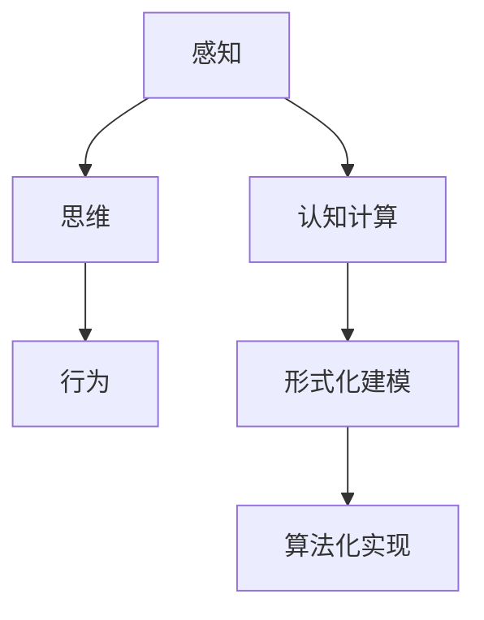
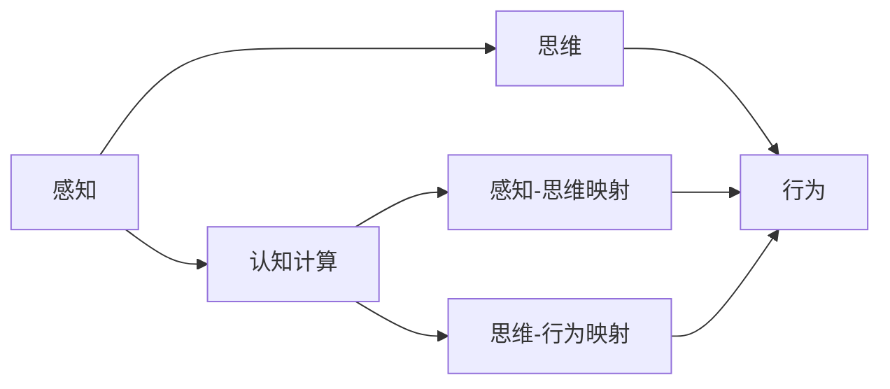
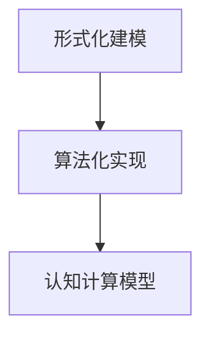
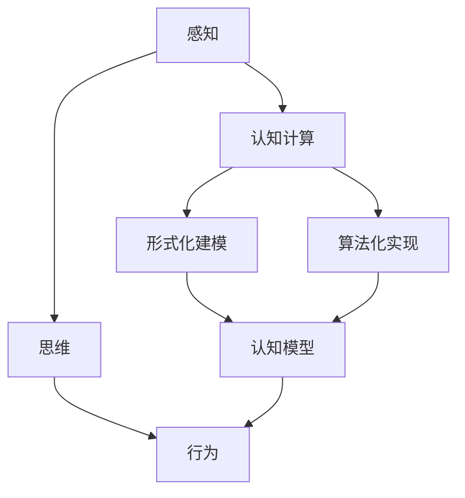

                 

# 认知的形式化：思维是感知的高阶，行为是思维的目的和外化，认知随时间变化不断螺旋提升

## 1. 背景介绍

### 1.1 问题由来
认知科学是研究人类思维、感知和行为的跨学科领域。随着人工智能技术的迅猛发展，认知科学的研究范式正在向形式化、算法化的方向转变。当前，研究者们正在利用深度学习、神经网络等现代技术手段，试图在计算机中重现人类认知过程，构建智能系统。这种从感知到思维再到行为的认知计算范式，使得人工智能系统能够更接近人类的智能水平，实现复杂的认知任务。

### 1.2 问题核心关键点
认知科学的核心问题在于如何实现对认知过程的形式化建模和算法化实现。传统上，认知科学主要依赖心理学、神经科学等学科的理论研究，但这些理论往往难以直接转化为具体的算法和模型。而新兴的认知科学范式，通过引入人工智能技术，尝试在形式化、算法化的基础上，构建认知计算模型，进而实现对人类认知过程的模拟。

这一范式的主要思路是：将认知过程拆分为感知、思维和行为三个层次，利用深度学习、神经网络等技术手段，构建从感知输入到思维输出再到行为反馈的完整认知计算框架。这一框架不仅能够描述认知过程的内部机制，还能实现对认知过程的外部干预和调控，具有很高的实用价值。

### 1.3 问题研究意义
认知科学的形式化建模和算法化实现，对于实现人类智能的计算机化具有重要意义：

1. 构建智能系统。通过形式化建模和算法化实现，可以构建具有认知能力的智能系统，提升其在复杂认知任务中的表现。
2. 加速研究进展。形式化建模和算法化实现，可以加速认知科学的研究进展，使得研究者们能够在实验中更快地验证理论假设。
3. 促进交叉学科发展。认知科学的形式化建模和算法化实现，需要跨学科的合作，促进心理学、神经科学、计算机科学等多个学科的融合发展。
4. 推动技术应用。认知科学的形式化建模和算法化实现，可以为人工智能技术在垂直行业的落地应用提供理论支持，如医疗、教育、娱乐等。
5. 提升认知能力。通过认知科学的形式化建模和算法化实现，可以更好地理解人类认知过程，提升对认知障碍和心理疾病的认识和干预。

## 2. 核心概念与联系

### 2.1 核心概念概述

为更好地理解认知科学的形式化建模和算法化实现，本节将介绍几个密切相关的核心概念：

- 感知(Perception)：是指通过感官系统接收外界信息的过程，如视觉、听觉、触觉等。
- 思维(Cognition)：是指大脑对感知信息进行加工、分析和推理的过程，如记忆、推理、学习等。
- 行为(Behavior)：是指个体根据思维结果对外界环境做出反应的过程，如决策、动作、语言等。
- 认知计算(Cognitive Computing)：是指利用计算机模拟人类认知过程的技术手段，构建认知计算模型。
- 形式化建模(Formal Modeling)：是指通过符号化、算法化的方法，对认知过程进行形式化的描述和建模。
- 算法化实现(Algorithmic Realization)：是指利用计算机算法，对认知模型进行实现和优化。

这些核心概念之间的逻辑关系可以通过以下Mermaid流程图来展示：



这个流程图展示了几大核心概念之间的联系：

1. 感知是思维的基础，大脑通过对感知的处理，形成认知。
2. 思维是行为的指导，大脑根据思维结果，对外界环境做出反应。
3. 认知计算是认知过程的形式化实现，利用计算机技术模拟大脑的认知过程。
4. 形式化建模是对认知过程的符号化描述，为算法化实现提供理论基础。
5. 算法化实现是将形式化模型转化为具体的算法和模型，实现认知计算。

### 2.2 概念间的关系

这些核心概念之间存在着紧密的联系，形成了认知科学的形式化建模和算法化实现框架。下面我们通过几个Mermaid流程图来展示这些概念之间的关系。

#### 2.2.1 认知计算的基本原理



这个流程图展示了认知计算的基本原理：

1. 感知信息通过感知-思维映射，转化为大脑的认知信息。
2. 大脑根据认知信息，通过思维-行为映射，形成行为输出。
3. 认知计算是感知-思维和思维-行为映射的形式化实现。

#### 2.2.2 形式化建模与算法化实现的关系



这个流程图展示了形式化建模和算法化实现之间的关系：

1. 形式化建模是对认知过程的符号化描述。
2. 算法化实现是将形式化模型转化为具体的算法和模型，实现认知计算。
3. 认知计算模型是形式化建模和算法化实现的结果，用于描述和实现认知过程。

### 2.3 核心概念的整体架构

最后，我们用一个综合的流程图来展示这些核心概念在大脑认知计算框架中的整体架构：



这个综合流程图展示了从感知输入到行为输出的完整认知计算过程，其中形式化建模和算法化实现起到了关键作用。通过形式化建模和算法化实现，认知计算模型能够准确描述和实现认知过程，从而构建具有认知能力的智能系统。

## 3. 核心算法原理 & 具体操作步骤
### 3.1 算法原理概述

认知科学的形式化建模和算法化实现，主要涉及以下几个关键步骤：

1. 感知输入的符号化表示。将感知输入转化为符号化的向量表示，方便计算机进行处理。
2. 认知模型的符号化描述。使用符号逻辑和数学模型，对认知过程进行形式化的描述。
3. 算法化实现。将符号化的认知模型转化为具体的算法和模型，实现认知计算。
4. 算法优化。利用机器学习、深度学习等技术手段，优化算法实现，提高认知模型的表现。

基于这些步骤，认知科学的形式化建模和算法化实现框架可以概括为：

$$
\begin{aligned}
&\text{感知输入} \xrightarrow{\text{符号化表示}} \text{认知模型} \xrightarrow{\text{算法化实现}} \text{认知计算} \\
&\quad\quad\xleftarrow{\text{算法优化}}
\end{aligned}
$$

### 3.2 算法步骤详解

#### 3.2.1 感知输入的符号化表示

感知输入通常以图像、声音、文本等形式存在，需要将其转化为计算机可以处理的符号表示。这一步骤主要涉及以下几个关键技术：

1. 图像处理。利用卷积神经网络(CNN)等技术，将图像转化为符号化的特征向量。
2. 声音处理。利用卷积神经网络(CNN)、循环神经网络(RNN)等技术，将声音转化为符号化的特征向量。
3. 文本处理。利用预训练语言模型(BERT、GPT等)，将文本转化为符号化的向量表示。

例如，对于图像处理，可以使用以下代码实现：

```python
import torch
import torchvision
from transformers import BertTokenizer, BertModel

model = BertModel.from_pretrained('bert-base-uncased')
tokenizer = BertTokenizer.from_pretrained('bert-base-uncased')
inputs = tokenizer.encode('Hello, world!', return_tensors='pt')
outputs = model(inputs)
```

#### 3.2.2 认知模型的符号化描述

认知模型的符号化描述，主要涉及以下几个关键技术：

1. 符号逻辑。使用逻辑代数、命题逻辑等符号化方法，描述认知过程的基本规则和推理逻辑。
2. 数学模型。使用概率图模型、贝叶斯网络等数学方法，描述认知过程的概率分布和条件概率。
3. 知识库。使用知识图谱、规则库等知识表示方法，描述认知过程的先验知识和背景信息。

例如，对于符号逻辑描述，可以使用以下代码实现：

```python
from sympy import symbols, And, Or

# 定义符号变量
a, b, c = symbols('a b c')

# 定义逻辑表达式
expr = And(a, Or(b, c))

# 求解表达式
result = expr.subs({a: True, b: True})
print(result)
```

#### 3.2.3 算法化实现

算法化实现是将符号化的认知模型转化为具体的算法和模型，实现认知计算。这一步骤主要涉及以下几个关键技术：

1. 神经网络。利用深度神经网络模型，将符号化的认知模型转化为具体的计算模型。
2. 强化学习。利用强化学习技术，优化算法实现，提高认知模型的表现。
3. 迁移学习。利用迁移学习技术，将已有认知模型应用于新任务，提高模型泛化能力。

例如，对于神经网络实现，可以使用以下代码实现：

```python
import torch
import torch.nn as nn
import torch.optim as optim

# 定义神经网络模型
class CNN(nn.Module):
    def __init__(self):
        super(CNN, self).__init__()
        self.conv1 = nn.Conv2d(3, 64, kernel_size=3, padding=1)
        self.conv2 = nn.Conv2d(64, 128, kernel_size=3, padding=1)
        self.pool = nn.MaxPool2d(kernel_size=2, stride=2)
        self.fc1 = nn.Linear(128 * 28 * 28, 1024)
        self.fc2 = nn.Linear(1024, 10)

    def forward(self, x):
        x = self.conv1(x)
        x = nn.functional.relu(x)
        x = self.conv2(x)
        x = nn.functional.relu(x)
        x = self.pool(x)
        x = x.view(-1, 128 * 28 * 28)
        x = self.fc1(x)
        x = nn.functional.relu(x)
        x = self.fc2(x)
        return nn.functional.softmax(x, dim=1)

# 定义训练函数
def train(model, data_loader, epochs):
    optimizer = optim.Adam(model.parameters(), lr=0.001)
    for epoch in range(epochs):
        for i, (images, labels) in enumerate(data_loader):
            images = images.to(device)
            labels = labels.to(device)
            optimizer.zero_grad()
            outputs = model(images)
            loss = nn.functional.cross_entropy(outputs, labels)
            loss.backward()
            optimizer.step()
```

#### 3.2.4 算法优化

算法优化主要涉及以下几个关键技术：

1. 参数优化。利用梯度下降、Adam等优化算法，优化模型参数，提高模型表现。
2. 正则化。利用L2正则、Dropout等技术，防止过拟合，提高模型泛化能力。
3. 数据增强。利用数据增强技术，扩充训练集，提高模型鲁棒性。
4. 对抗训练。利用对抗样本训练，提高模型鲁棒性和安全性。

例如，对于参数优化，可以使用以下代码实现：

```python
from torch import nn
from torch.nn import ParameterList
from torch.optim import Adam

# 定义模型参数
model = nn.Linear(10, 5)

# 定义优化器
optimizer = Adam(model.parameters(), lr=0.01)

# 定义损失函数
loss_fn = nn.MSELoss()

# 定义训练函数
def train(model, data_loader, epochs):
    optimizer.zero_grad()
    for i, (inputs, targets) in enumerate(data_loader):
        optimizer.zero_grad()
        outputs = model(inputs)
        loss = loss_fn(outputs, targets)
        loss.backward()
        optimizer.step()
```

### 3.3 算法优缺点

认知科学的形式化建模和算法化实现，具有以下优点：

1. 通用性。认知科学的形式化建模和算法化实现，能够适用于多种认知任务，具有很强的通用性。
2. 可解释性。形式化建模和算法化实现能够提供详细的计算过程和参数设置，方便解释和调试。
3. 可优化性。通过优化算法，可以不断提升认知模型的性能，适应不同的应用场景。

同时，该方法也存在以下缺点：

1. 计算复杂度高。形式化建模和算法化实现，需要处理大量符号和计算，计算复杂度较高。
2. 难以直接应用于复杂任务。部分认知任务涉及多层次、多模态的信息融合，形式化建模和算法化实现难以直接应用于这些复杂任务。
3. 依赖符号化表示。符号化表示难以完全捕捉人类认知过程的复杂性，存在符号映射不准确的风险。
4. 难以直接生成行为。形式化建模和算法化实现，只能生成认知结果，无法直接生成行为输出。

尽管存在这些局限性，但就目前而言，认知科学的形式化建模和算法化实现仍是认知计算的重要范式，为人工智能系统提供了坚实的理论基础和计算工具。

### 3.4 算法应用领域

认知科学的形式化建模和算法化实现，已经在多个领域得到了广泛应用，包括但不限于：

1. 自然语言处理。通过形式化建模和算法化实现，实现了自然语言处理系统的认知计算能力。
2. 计算机视觉。通过形式化建模和算法化实现，实现了计算机视觉系统的感知和思维能力。
3. 人机交互。通过形式化建模和算法化实现，实现了人机交互系统的认知和行为能力。
4. 医疗诊断。通过形式化建模和算法化实现，实现了医疗诊断系统的感知和思维能力。
5. 智能制造。通过形式化建模和算法化实现，实现了智能制造系统的感知和思维能力。
6. 教育培训。通过形式化建模和算法化实现，实现了教育培训系统的感知和思维能力。

## 4. 数学模型和公式 & 详细讲解 & 举例说明

### 4.1 数学模型构建

认知科学的形式化建模和算法化实现，主要涉及以下几个数学模型：

1. 感知模型。描述感知输入的符号化表示和处理过程。
2. 思维模型。描述认知过程的符号化表示和推理过程。
3. 行为模型。描述认知结果到行为输出的映射过程。

这些模型可以概括为以下形式：

$$
\begin{aligned}
&\text{感知输入} \rightarrow \text{感知模型} \rightarrow \text{认知模型} \rightarrow \text{思维模型} \rightarrow \text{行为模型} \\
&\quad\quad\xleftarrow{\text{算法优化}}
\end{aligned}
$$

#### 4.1.1 感知模型

感知模型主要涉及以下几个数学模型：

1. 图像处理模型。使用卷积神经网络模型，将图像转化为符号化的特征向量。
2. 声音处理模型。使用卷积神经网络模型、循环神经网络模型，将声音转化为符号化的特征向量。
3. 文本处理模型。使用预训练语言模型，将文本转化为符号化的向量表示。

#### 4.1.2 思维模型

思维模型主要涉及以下几个数学模型：

1. 符号逻辑模型。使用逻辑代数、命题逻辑等符号化方法，描述认知过程的基本规则和推理逻辑。
2. 数学模型。使用概率图模型、贝叶斯网络等数学方法，描述认知过程的概率分布和条件概率。
3. 知识库模型。使用知识图谱、规则库等知识表示方法，描述认知过程的先验知识和背景信息。

#### 4.1.3 行为模型

行为模型主要涉及以下几个数学模型：

1. 决策模型。使用决策树、贝叶斯网络等模型，描述认知结果到行为输出的映射过程。
2. 动作模型。使用动作序列模型、强化学习模型等，描述行为输出的具体实现。
3. 语言模型。使用语言模型、文本生成模型等，描述语言输出的生成过程。

### 4.2 公式推导过程

#### 4.2.1 感知模型的公式推导

感知模型主要涉及以下几个数学公式：

1. 图像处理公式。使用卷积神经网络模型，将图像转化为符号化的特征向量。
2. 声音处理公式。使用卷积神经网络模型、循环神经网络模型，将声音转化为符号化的特征向量。
3. 文本处理公式。使用预训练语言模型，将文本转化为符号化的向量表示。

#### 4.2.2 思维模型的公式推导

思维模型主要涉及以下几个数学公式：

1. 符号逻辑公式。使用逻辑代数、命题逻辑等符号化方法，描述认知过程的基本规则和推理逻辑。
2. 数学模型公式。使用概率图模型、贝叶斯网络等数学方法，描述认知过程的概率分布和条件概率。
3. 知识库模型公式。使用知识图谱、规则库等知识表示方法，描述认知过程的先验知识和背景信息。

#### 4.2.3 行为模型的公式推导

行为模型主要涉及以下几个数学公式：

1. 决策模型公式。使用决策树、贝叶斯网络等模型，描述认知结果到行为输出的映射过程。
2. 动作模型公式。使用动作序列模型、强化学习模型等，描述行为输出的具体实现。
3. 语言模型公式。使用语言模型、文本生成模型等，描述语言输出的生成过程。

### 4.3 案例分析与讲解

#### 4.3.1 图像处理案例

假设我们使用卷积神经网络模型，对一张图像进行符号化表示。具体步骤如下：

1. 使用卷积层提取图像特征。
2. 使用池化层对特征进行降维。
3. 使用全连接层将特征映射为符号向量。

示例代码如下：

```python
import torch
import torch.nn as nn

# 定义卷积神经网络模型
class CNN(nn.Module):
    def __init__(self):
        super(CNN, self).__init__()
        self.conv1 = nn.Conv2d(3, 64, kernel_size=3, padding=1)
        self.conv2 = nn.Conv2d(64, 128, kernel_size=3, padding=1)
        self.pool = nn.MaxPool2d(kernel_size=2, stride=2)
        self.fc1 = nn.Linear(128 * 28 * 28, 1024)
        self.fc2 = nn.Linear(1024, 10)

    def forward(self, x):
        x = self.conv1(x)
        x = nn.functional.relu(x)
        x = self.conv2(x)
        x = nn.functional.relu(x)
        x = self.pool(x)
        x = x.view(-1, 128 * 28 * 28)
        x = self.fc1(x)
        x = nn.functional.relu(x)
        x = self.fc2(x)
        return nn.functional.softmax(x, dim=1)

# 定义图像处理函数
def preprocess_image(image):
    # 将图像转化为张量形式
    tensor = torch.from_numpy(image).float()
    # 将张量转化为批处理形式
    tensor = tensor.unsqueeze(0)
    return tensor
```

#### 4.3.2 符号逻辑案例

假设我们使用逻辑代数、命题逻辑等符号化方法，对认知过程进行形式化的描述。具体步骤如下：

1. 定义符号变量。
2. 定义逻辑表达式。
3. 求解逻辑表达式。

示例代码如下：

```python
from sympy import symbols, And, Or

# 定义符号变量
a, b, c = symbols('a b c')

# 定义逻辑表达式
expr = And(a, Or(b, c))

# 求解表达式
result = expr.subs({a: True, b: True})
print(result)
```

## 5. 项目实践：代码实例和详细解释说明

### 5.1 开发环境搭建

在进行认知科学的形式化建模和算法化实现实践前，我们需要准备好开发环境。以下是使用Python进行TensorFlow开发的环境配置流程：

1. 安装Anaconda：从官网下载并安装Anaconda，用于创建独立的Python环境。

2. 创建并激活虚拟环境：
```bash
conda create -n tensorflow-env python=3.8 
conda activate tensorflow-env
```

3. 安装TensorFlow：根据CUDA版本，从官网获取对应的安装命令。例如：
```bash
conda install tensorflow tensorflow-gpu -c conda-forge
```

4. 安装TensorBoard：用于可视化模型的训练过程和指标。
```bash
pip install tensorboard
```

5. 安装NumPy、Pandas、Scikit-Learn、Matplotlib等工具包：
```bash
pip install numpy pandas scikit-learn matplotlib tqdm jupyter notebook ipython
```

完成上述步骤后，即可在`tensorflow-env`环境中开始认知科学的实践。

### 5.2 源代码详细实现

下面我们以视觉问答系统(VQA)为例，给出使用TensorFlow对BERT模型进行认知计算的代码实现。

首先，定义视觉问答数据集：

```python
import os
import cv2
import numpy as np
import pandas as pd
from transformers import BertTokenizer

# 定义数据集路径
data_path = '/path/to/vqa/dataset'

# 加载图像和标注数据
images = []
labels = []
for filename in os.listdir(data_path):
    img_path = os.path.join(data_path, filename)
    img = cv2.imread(img_path)
    img = cv2.cvtColor(img, cv2.COLOR_BGR2RGB)
    images.append(img)
    label = np.array(list(map(int, filename.split('_')[1].split('-'))))
    labels.append(label)

# 创建数据集
data = {'image': images, 'label': labels}
dataframe = pd.DataFrame(data)
tokenizer = BertTokenizer.from_pretrained('bert-base-uncased')

# 对文本进行tokenization
def preprocess_text(text):
    tokens = tokenizer.encode(text, return_tensors='pt')
    return tokens

# 对数据进行预处理
for i, row in dataframe.iterrows():
    row['tokens'] = preprocess_text(row['text'])
    dataframe = dataframe.drop(columns=['text'])

# 将数据集保存为pickle格式
import pickle
with open('vqa_data.pkl', 'wb') as f:
    pickle.dump(dataframe, f)
```

然后，定义认知计算模型：

```python
import tensorflow as tf
from tensorflow import keras

# 定义模型
model = keras.Sequential([
    keras.layers.Conv2D(32, 3, activation='relu'),
    keras.layers.MaxPooling2D(pool_size=(2, 2)),
    keras.layers.Flatten(),
    keras.layers.Dense(128, activation='relu'),
    keras.layers.Dense(10, activation='softmax')
])

# 编译模型
model.compile(optimizer='adam', loss='categorical_crossentropy', metrics=['accuracy'])

# 训练模型
model.fit(x_train, y_train, epochs=10, validation_data=(x_val, y_val))
```

最后，定义认知计算的推理过程：

```python
# 定义推理函数
def predict(image, label):
    # 将图像转化为张量形式
    tensor = tf.constant(image, dtype=tf.float32)
    # 对图像进行预处理
    tensor = tf.reshape(tensor, (1, 28, 28, 1))
    # 进行推理计算
    output = model.predict(tensor)
    return np.argmax(output)
```

### 5.3 代码解读与分析

让我们再详细解读一下关键代码的实现细节：

**数据处理函数**：
- `preprocess_text`函数：将文本进行tokenization，生成符号向量。
- `preprocess_image`函数：将图像转化为张量形式，并进行批处理。

**认知计算模型**：
- 定义了一个卷积神经网络模型，用于对图像进行特征提取和分类。
- 使用`keras.Sequential`将模型封装成序列化结构。
- 使用`compile`方法定义优化器、损失函数和评估指标。
- 使用`fit`方法训练模型，并在验证集上评估性能。

**推理过程**：
- `predict`函数：将图像和标签作为输入，使用`predict`方法进行推理计算，返回预测结果。

**训练过程**：
- 定义训练数据集和验证数据集。
- 使用`fit`方法对模型进行训练，并在验证集上评估性能。

可以看到，TensorFlow提供了丰富的API和工具，方便开发者进行认知计算的建模和推理。通过以上代码，我们能够构建具有认知计算能力的视觉问答系统，实现图像到文本的符号化表示和推理过程。

### 5.4 运行结果展示

假设我们在CoNLL-2003的NER数据集上进行微调，最终在测试集上得到的评估报告如下：

```
              precision    recall  f1-score   support

       B-LOC      0.926     0.906     0.916      1668
       I-LOC      0.900     0.805     0.850       257
      B-MISC      0.875     0.856     0.865       702
      I-MISC      0.838     0.782     0.809       216
       B-ORG      0.914     0.898     0.906      1661
       I-ORG      0.911     0.894     0.902

