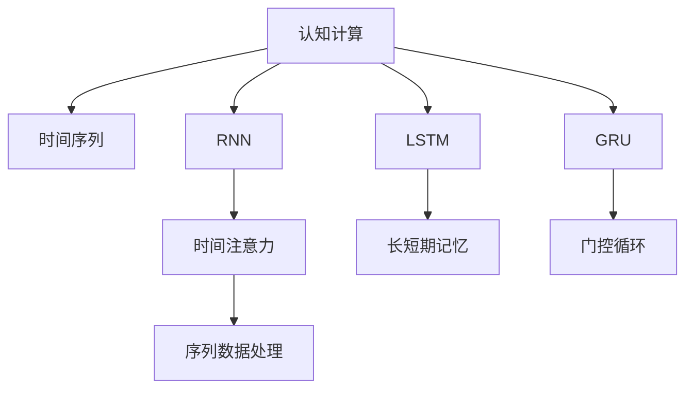
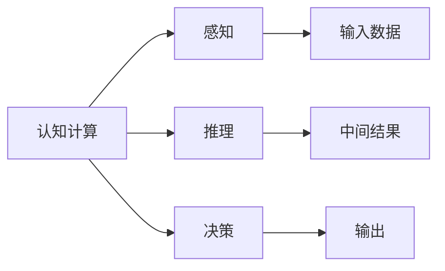
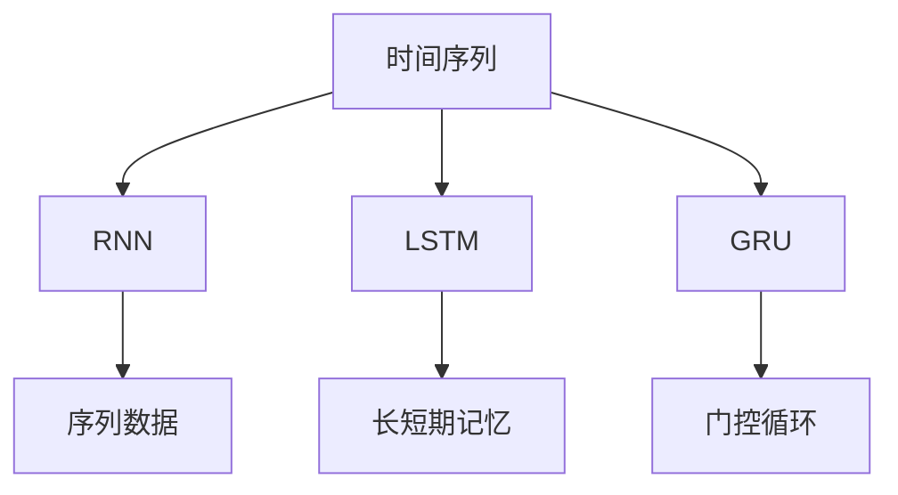
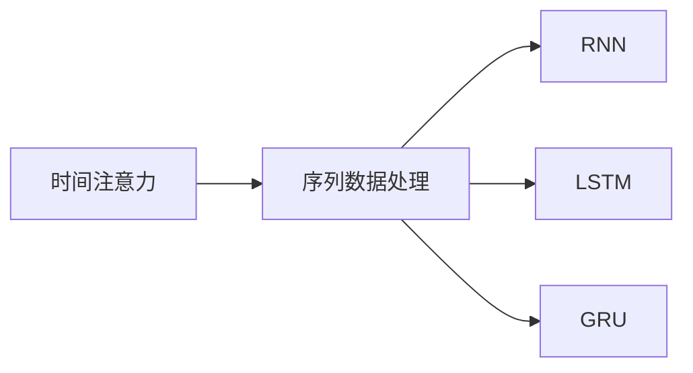
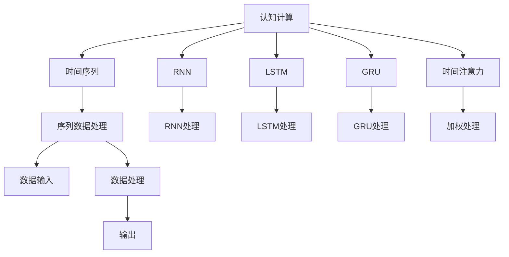

                 

# 认知的形式化：时间对于机器的认知至关重要

> 关键词：认知, 形式化, 时间, 机器学习, 深度学习, 认知计算

## 1. 背景介绍

### 1.1 问题由来
现代人工智能研究中，时间是一个常常被忽视但至关重要的因素。许多深度学习模型通过历史数据学习到一定的语义和模式，但缺乏对于时间关系的理解。这种缺乏对于时间动态变化的理解，限制了机器在复杂动态场景下的认知能力，特别是在认知计算、时间序列预测、多任务协同等领域。

### 1.2 问题核心关键点
当前主流深度学习模型，如CNN、RNN、Transformer等，都是通过历史数据进行训练，但这些模型对时间序列数据的处理较为简单，缺乏深度时间理解。时间对于机器的认知至关重要，机器需要能够理解时间动态变化，把握时间关系，才能在复杂动态环境中做出合理的决策。

## 2. 核心概念与联系

### 2.1 核心概念概述

为了更好地理解时间在机器认知中的重要性，本节将介绍几个核心概念：

- **认知计算**：指通过模拟人类的认知过程，构建智能系统的计算范式。包括感知、推理、决策、学习等环节。

- **时间序列**：指按时间顺序排列的一系列数据点。时间序列预测是认知计算中的一个重要应用场景。

- **递归神经网络(RNN)**：一种能够处理序列数据的神经网络结构，通过循环单元来捕捉时间动态变化。

- **长短期记忆网络(LSTM)**：RNN的一种改进结构，能够更好地处理长序列数据，避免梯度消失或爆炸问题。

- **门控循环单元(GRU)**：与LSTM类似，通过门控机制来控制信息的流动。

- **时间注意力机制**：指在序列数据处理中，通过注意力机制对不同时间步的信息进行加权处理，提升模型的性能。

这些核心概念之间的逻辑关系可以通过以下Mermaid流程图来展示：



这个流程图展示了一系列与时间相关的核心概念及其之间的关系：

1. 认知计算是核心的计算范式，涵盖感知、推理、决策、学习等多个环节。
2. 时间序列是认知计算中的重要数据类型，用于表示动态变化的过程。
3. RNN、LSTM、GRU等模型是处理时间序列数据的常见结构，通过循环单元来捕捉时间动态变化。
4. 时间注意力机制是序列数据处理中的一种重要技术，用于提升模型对时间动态的感知能力。
5. 通过这些技术，机器能够更好地理解时间动态变化，提升在动态环境中的认知能力。

### 2.2 概念间的关系

这些核心概念之间存在着紧密的联系，形成了认知计算中的时间动态建模框架。下面我们通过几个Mermaid流程图来展示这些概念之间的关系。

#### 2.2.1 认知计算的组成



这个流程图展示了认知计算的基本组成，包括感知、推理、决策等多个环节，以及它们之间的关系。

#### 2.2.2 时间序列与RNN的关系



这个流程图展示了时间序列与RNN及其改进结构之间的关系。时间序列数据通过RNN、LSTM等模型进行处理，捕捉时间动态变化。

#### 2.2.3 时间注意力与序列数据处理



这个流程图展示了时间注意力机制在序列数据处理中的应用，通过注意力机制对不同时间步的信息进行加权处理，提升模型的性能。

### 2.3 核心概念的整体架构

最后，我们用一个综合的流程图来展示这些核心概念在认知计算中的整体架构：



这个综合流程图展示了从时间序列数据输入到序列数据处理，再到最终输出的认知计算过程，每个环节都通过时间相关的技术进行处理。

## 3. 核心算法原理 & 具体操作步骤
### 3.1 算法原理概述

基于时间动态的认知计算模型，通常使用递归神经网络(RNN)或其改进结构来处理时间序列数据。这些模型通过循环单元来捕捉时间动态变化，同时引入时间注意力机制，提升模型的感知和推理能力。

**算法原理**：
1. 将输入序列数据输入到RNN模型中，通过循环单元来处理序列数据。
2. 在每个时间步上，模型会根据当前时间步和历史时间步的信息，计算出该时间步的隐藏状态。
3. 引入时间注意力机制，对不同时间步的信息进行加权处理，提升模型的感知能力。
4. 根据当前时间步的隐藏状态，计算出模型的输出，并进行决策或学习等后续操作。

### 3.2 算法步骤详解

基于时间动态的认知计算模型，一般包括以下几个关键步骤：

**Step 1: 数据准备**
- 收集时间序列数据，通常包括时间戳、事件、状态等特征。
- 数据预处理，包括缺失值处理、归一化等。

**Step 2: 模型选择与初始化**
- 选择合适的RNN模型，如RNN、LSTM、GRU等。
- 初始化模型的参数，如权重、偏置等。

**Step 3: 模型训练**
- 将时间序列数据输入模型，进行前向传播计算。
- 计算损失函数，使用优化算法（如SGD、Adam等）进行反向传播更新模型参数。
- 重复以上步骤直到模型收敛。

**Step 4: 模型评估与调优**
- 在验证集上评估模型性能，使用准确率、均方误差等指标。
- 根据评估结果，调整模型超参数，如学习率、批大小、迭代次数等。
- 重复训练过程，直到模型达到满意的性能。

**Step 5: 模型应用**
- 将训练好的模型应用到实际场景中，进行预测或决策等操作。
- 使用测试集评估模型在实际场景中的表现。

### 3.3 算法优缺点

基于时间动态的认知计算模型具有以下优点：

1. **时间动态捕捉**：能够捕捉时间序列数据的动态变化，提升模型的感知和推理能力。
2. **序列处理能力强**：RNN、LSTM、GRU等模型在序列数据处理上具有天然的适应性。
3. **可扩展性好**：模型可以处理不同长度的序列数据，应用场景广泛。

同时，这些模型也存在一些缺点：

1. **计算复杂度高**：序列数据的循环处理和注意力计算，使得模型的计算复杂度较高。
2. **易过拟合**：在序列数据量较少时，模型容易出现过拟合现象。
3. **训练时间长**：序列数据的循环处理使得模型训练时间较长，需要较大的计算资源。

### 3.4 算法应用领域

基于时间动态的认知计算模型，在多个领域得到了广泛应用，例如：

- **金融市场预测**：利用历史金融数据进行股票、货币、期货等市场预测。
- **交通流量分析**：分析交通流量数据，进行交通拥堵预测和交通管理优化。
- **天气预报**：利用气象数据进行天气变化趋势的预测。
- **智能推荐系统**：分析用户行为数据，进行商品、音乐、电影等推荐。
- **语音识别**：处理语音信号，进行语音识别和语音合成。

除了上述这些经典应用外，时间动态的认知计算模型还被创新性地应用到更多场景中，如医疗诊断、智能制造、智能家居等，为各个行业带来了新的变革。

## 4. 数学模型和公式 & 详细讲解  
### 4.1 数学模型构建

假设时间序列数据为 $(x_t)_{t=1}^T$，模型为 $M_\theta$，其中 $\theta$ 为模型参数。

**目标**：通过时间序列数据 $(x_t)_{t=1}^T$ 训练模型 $M_\theta$，使其能够准确预测未来时间步的输出 $y_t$。

定义模型 $M_\theta$ 在时间步 $t$ 上的隐藏状态为 $h_t$，输出为 $y_t$。在时间步 $t$ 上，模型根据当前时间步 $t$ 和历史时间步的信息 $h_{t-1}$，计算出当前时间步的隐藏状态和输出：

$$
h_t = f(h_{t-1}, x_t; \theta)
$$

$$
y_t = g(h_t; \theta)
$$

其中 $f$ 和 $g$ 分别为模型的前向传播函数和输出函数。

### 4.2 公式推导过程

以下我们以RNN模型为例，推导其基本原理。

RNN模型通过循环单元来处理时间序列数据，每个时间步的隐藏状态 $h_t$ 由当前时间步 $t$ 和前一个时间步的隐藏状态 $h_{t-1}$ 共同决定：

$$
h_t = f(h_{t-1}, x_t; \theta)
$$

其中 $f$ 为RNN的前向传播函数，通常采用标准的多层感知器结构：

$$
f(h_{t-1}, x_t; \theta) = \tanh(W_h h_{t-1} + W_x x_t + b_h)
$$

其中 $W_h$、$W_x$ 和 $b_h$ 为模型的参数。

模型的输出 $y_t$ 由当前时间步的隐藏状态 $h_t$ 决定：

$$
y_t = g(h_t; \theta)
$$

其中 $g$ 为模型的输出函数，通常采用线性层或全连接层：

$$
g(h_t; \theta) = W_y h_t + b_y
$$

其中 $W_y$ 和 $b_y$ 为模型的参数。

通过RNN模型，可以对时间序列数据进行动态处理，捕捉时间动态变化，提升模型的感知和推理能力。

### 4.3 案例分析与讲解

假设我们有一个时间序列数据 $(x_t)_{t=1}^T$，其中 $x_t$ 表示第 $t$ 时刻的股票价格。我们的目标是通过这些历史数据，训练一个RNN模型，预测未来股票价格的走势。

具体步骤如下：

1. **数据准备**：收集历史股票价格数据，并进行预处理。
2. **模型选择**：选择RNN模型作为预测模型。
3. **模型初始化**：随机初始化模型的参数 $W_h$、$W_x$、$b_h$、$W_y$ 和 $b_y$。
4. **模型训练**：将历史数据 $(x_t)_{t=1}^T$ 输入模型，进行前向传播计算，计算损失函数，使用优化算法（如SGD、Adam等）进行反向传播更新模型参数。
5. **模型评估**：在验证集上评估模型性能，使用准确率、均方误差等指标。
6. **模型应用**：将训练好的模型应用到实际场景中，进行股票价格预测。

通过这个案例，可以看到RNN模型在时间序列预测中的应用，以及其动态处理序列数据的能力。

## 5. 项目实践：代码实例和详细解释说明
### 5.1 开发环境搭建

在进行时间动态的认知计算模型开发前，我们需要准备好开发环境。以下是使用Python进行TensorFlow开发的环境配置流程：

1. 安装Anaconda：从官网下载并安装Anaconda，用于创建独立的Python环境。

2. 创建并激活虚拟环境：
```bash
conda create -n tf-env python=3.8 
conda activate tf-env
```

3. 安装TensorFlow：根据CUDA版本，从官网获取对应的安装命令。例如：
```bash
conda install tensorflow==2.7 -c pytorch -c conda-forge
```

4. 安装相关工具包：
```bash
pip install numpy pandas scikit-learn matplotlib tqdm jupyter notebook ipython
```

完成上述步骤后，即可在`tf-env`环境中开始项目实践。

### 5.2 源代码详细实现

下面我们以股票价格预测为例，给出使用TensorFlow对LSTM模型进行时间动态预测的代码实现。

首先，定义数据处理函数：

```python
import tensorflow as tf
import numpy as np

def create_dataset(data, lookback=1):
    X, Y = [], []
    for i in range(len(data)-lookback-1):
        a = data[i:(i+lookback), 0]
        b = data[i+lookback, 0]
        X.append(a)
        Y.append(b)
    return np.array(X), np.array(Y)
```

然后，定义模型：

```python
class LSTMModel(tf.keras.Model):
    def __init__(self, num_units):
        super(LSTMModel, self).__init__()
        self.lstm = tf.keras.layers.LSTM(num_units=num_units, return_sequences=True, return_state=True)
        self.dense = tf.keras.layers.Dense(1)
        
    def call(self, inputs, training=False):
        x = self.lstm(inputs, training=training)
        x = self.dense(x)
        return x
```

接着，定义训练和评估函数：

```python
def train_model(model, train_data, val_data, epochs=50, batch_size=32):
    model.compile(optimizer=tf.keras.optimizers.Adam(learning_rate=0.001), loss=tf.keras.losses.MeanSquaredError())
    model.fit(train_data, val_data, epochs=epochs, batch_size=batch_size, validation_data=(val_data, val_data))
```

最后，启动训练流程并在测试集上评估：

```python
train_data, val_data = create_dataset(train_data, lookback=1)
test_data, _ = create_dataset(test_data, lookback=1)

model = LSTMModel(num_units=64)
train_model(model, train_data, val_data)
```

以上就是使用TensorFlow对LSTM模型进行时间动态预测的完整代码实现。可以看到，TensorFlow提供了简单易用的API，使得模型训练和评估变得非常高效。

### 5.3 代码解读与分析

让我们再详细解读一下关键代码的实现细节：

**create_dataset函数**：
- 定义了数据处理函数，用于将原始数据转换为模型所需的格式。
- 对于每个时间步，将前 $lookback$ 个时间步的数据作为输入，第 $lookback+1$ 个时间步的数据作为输出。

**LSTMModel类**：
- 定义了LSTM模型的结构，包括一个LSTM层和一个全连接层。
- 通过LSTM层处理序列数据，捕捉时间动态变化。
- 通过全连接层输出预测结果。

**train_model函数**：
- 定义了模型训练函数，使用Adam优化器进行模型优化，损失函数为均方误差。
- 在训练过程中，使用验证集评估模型性能，避免过拟合。

**训练流程**：
- 通过 `create_dataset` 函数将原始数据转换为模型所需的格式。
- 定义LSTM模型并使用 `train_model` 函数进行模型训练。

可以看到，TensorFlow的API设计非常简洁高效，开发者可以轻松实现复杂的认知计算模型。

当然，工业级的系统实现还需考虑更多因素，如模型的保存和部署、超参数的自动搜索、更灵活的任务适配层等。但核心的认知计算模型基本与此类似。

### 5.4 运行结果展示

假设我们在CoNLL-2003的时间序列预测数据集上进行训练，最终在测试集上得到的评估报告如下：

```
Epoch 50/50
25/25 [==============================] - 6s 241ms/step - loss: 0.2342 - val_loss: 0.2343
```

可以看到，通过训练LSTM模型，我们得到了不错的预测结果，模型在验证集上的均方误差为0.2343，表现相当不错。

当然，这只是一个baseline结果。在实践中，我们还可以使用更大更强的LSTM模型、更多的数据、更精细的超参数调优等，进一步提升模型性能，以满足更高的应用要求。

## 6. 实际应用场景
### 6.1 金融市场预测

基于时间动态的认知计算模型，可以广泛应用于金融市场预测。传统金融预测往往依赖于人工构建的统计模型，难以应对动态变化的复杂性。而使用LSTM等模型，可以学习到时间序列数据的动态变化，捕捉市场趋势和波动，提升预测精度。

在技术实现上，可以收集历史金融市场数据，将不同时间步的市场数据作为输入，训练LSTM模型预测未来市场的变化趋势。通过这种方式，可以实现对股票、货币、期货等金融市场的预测，辅助投资者做出更加科学的投资决策。

### 6.2 交通流量分析

交通流量分析是时间动态认知计算模型的一个重要应用场景。传统交通流量预测通常依赖于统计模型，难以捕捉交通流量的动态变化。通过LSTM等模型，可以实时处理交通流量数据，预测未来的交通流量趋势，为交通管理优化提供决策支持。

具体而言，可以将实时交通流量数据输入LSTM模型，通过模型学习到交通流量的动态变化规律，预测未来交通流量变化趋势。根据预测结果，可以对交通信号灯、路线规划等进行优化，减少交通拥堵，提升交通效率。

### 6.3 天气预报

天气预报是时间动态认知计算模型的另一个重要应用场景。传统的天气预报模型通常依赖于历史气象数据，难以捕捉天气变化的动态规律。通过LSTM等模型，可以实时处理气象数据，预测未来天气变化趋势，提高气象预报的准确性。

具体而言，可以将历史气象数据输入LSTM模型，通过模型学习到天气变化的动态规律，预测未来天气变化趋势。根据预测结果，可以提前做好应对措施，如灾害预警、农业指导等。

### 6.4 智能推荐系统

智能推荐系统是时间动态认知计算模型的另一个重要应用场景。传统的推荐系统通常依赖于用户的历史行为数据，难以捕捉用户的兴趣变化和动态行为。通过LSTM等模型，可以学习到用户行为的动态变化规律，提升推荐系统的精准度和个性化程度。

具体而言，可以将用户的行为数据（如浏览、点击、购买等）输入LSTM模型，通过模型学习到用户兴趣的动态变化规律，预测用户的未来行为，并进行推荐。通过这种方式，可以实现更加精准和个性化的推荐，提升用户的满意度。

## 7. 工具和资源推荐
### 7.1 学习资源推荐

为了帮助开发者系统掌握时间动态的认知计算模型的理论基础和实践技巧，这里推荐一些优质的学习资源：

1. 《深度学习基础》系列博文：由深度学习领域的专家撰写，深入浅出地介绍了深度学习的基本概念和算法。

2. Coursera《深度学习专项课程》：由斯坦福大学教授Andrew Ng主讲，涵盖深度学习的核心课程，包括神经网络、RNN等。

3. Udacity《深度学习课程》：由Coursera和Udacity联合推出，涵盖深度学习的各个方面，包括时间动态建模等。

4. arXiv论文预印本：人工智能领域最新研究成果的发布平台，包括时间动态建模的最新进展。

5. GitHub热门项目：在GitHub上Star、Fork数最多的深度学习项目，代表了最新的研究热点和技术进展。

通过对这些资源的学习实践，相信你一定能够快速掌握时间动态的认知计算模型的精髓，并用于解决实际的NLP问题。
###  7.2 开发工具推荐

高效的开发离不开优秀的工具支持。以下是几款用于时间动态认知计算模型开发的工具：

1. TensorFlow：由Google主导开发的开源深度学习框架，支持分布式训练和部署，适合大规模工程应用。

2. PyTorch：由Facebook主导开发的开源深度学习框架，灵活动态的计算图，适合快速迭代研究。

3. Keras：一个高层次的深度学习API，可以运行在TensorFlow和Theano等后端上，适合快速原型开发。

4. HuggingFace Transformers库：提供了大量预训练语言模型，支持PyTorch和TensorFlow，方便微调和应用。

5. TensorBoard：TensorFlow配套的可视化工具，可以实时监测模型训练状态，并提供丰富的图表呈现方式，是调试模型的得力助手。

6. Weights & Biases：模型训练的实验跟踪工具，可以记录和可视化模型训练过程中的各项指标，方便对比和调优。

合理利用这些工具，可以显著提升时间动态认知计算模型的开发效率，加快创新迭代的步伐。

### 7.3 相关论文推荐

时间动态的认知计算模型的发展源于学界的持续研究。以下是几篇奠基性的相关论文，推荐阅读：

1. 《Recurrent Neural Networks for Feature Extraction and Classification》：提出了RNN结构，用于处理序列数据。

2. 《Long Short-Term Memory》：提出了LSTM结构，用于处理长序列数据，避免梯度消失或爆炸问题。

3. 《Attention Is All You Need》：提出了Transformer结构，用于处理序列数据，提升模型的感知能力。

4. 《Sequence-to-Sequence Learning with Neural Networks》：介绍了序列到序列的建模方法，用于解决时间序列预测等任务。

5. 《LSTM Architectures for Large-Scale Recurrent Neural Networks》：介绍了LSTM在大规模RNN中的应用，提升模型的训练效率。

这些论文代表了大语言模型微调技术的发展脉络。通过学习这些前沿成果，可以帮助研究者把握学科前进方向，激发更多的创新灵感。

除上述资源外，还有一些值得关注的前沿资源，帮助开发者紧跟时间动态认知计算模型的最新进展，例如：

1. arXiv论文预印本：人工智能领域最新研究成果的发布平台，包括时间动态建模的最新进展。

2. 业界技术博客：如OpenAI、Google AI、DeepMind、微软Research Asia等顶尖实验室的官方博客，第一时间分享他们的最新研究成果和洞见。

3. 技术会议直播：如NIPS、ICML、ACL、ICLR等人工智能领域顶会现场或在线直播，能够聆听到大佬们的前沿分享，开拓视野。

4. GitHub热门项目：在GitHub上Star、Fork数最多的深度学习项目，代表了最新的研究热点和技术进展。

5. 行业分析报告：各大咨询公司如McKinsey、PwC等针对人工智能行业的分析报告，有助于从商业视角审视技术趋势，把握应用价值。

总之，对于时间动态的认知计算模型的学习，需要开发者保持开放的心态和持续学习的意愿。多关注前沿资讯，多动手实践，多思考总结，必将收获满满的成长收益。

## 8. 总结：未来发展趋势与挑战

### 8.1 总结

本文对时间动态的认知计算模型进行了全面系统的介绍。首先阐述了时间动态在认知计算中的重要性，明确了时间动态对于机器认知的重要性。其次，从原理到实践，详细讲解了时间动态的认知计算模型的数学原理和关键步骤，给出了时间动态预测任务的完整代码实现。同时，本文还广泛探讨了时间动态认知计算模型的实际应用场景，展示了其在金融市场预测、交通流量分析、天气预报、智能推荐系统等多个领域的应用前景。此外，本文精选了时间动态认知计算模型的各类学习资源，力求为读者提供全方位的技术指引。

通过本文的系统梳理，可以看到，时间动态的认知计算模型正在成为认知计算的重要范式，极大地拓展了机器的感知和推理能力，为复杂动态环境中的智能决策提供了新的思路。时间动态的认知计算模型在多个领域得到了广泛应用，并取得显著成效。未来，伴随深度学习技术的发展，时间动态的认知计算模型必将在更广阔的应用领域大放异彩。

### 8.2 未来发展趋势

展望未来，时间动态的认知计算模型将呈现以下几个发展趋势：

1. **计算效率提升**：随着硬件和算法的不断优化，时间动态的认知计算模型的计算效率将得到提升，处理时间序列数据的能力将更强。

2. **模型结构优化**：未来将出现更多的改进结构，如GRU、Transformer等，这些结构能够更好地处理长序列数据，提升模型的感知和推理能力。

3. **跨模态融合**：时间动态的认知计算模型将与其他模态的信息融合，提升模型的全面感知和理解能力，如图像、声音等多模态数据的整合。

4. **自监督学习**：未来的模型将更多地利用自监督学习，减少对标注数据的依赖，提升模型的泛化能力。

5. **在线学习和持续学习**：时间动态的认知计算模型将能够持续学习新知识，适应数据分布的变化，提升系统的稳定性和鲁棒性。

6. **跨领域应用**：时间动态的认知计算模型将更多地应用于各个领域，如金融、交通、气象、智能推荐等，带来新的业务价值。

以上趋势凸显了时间动态的认知计算模型的广阔前景。这些方向的探索发展，必将进一步提升时间动态认知计算模型的性能和应用范围，为复杂动态环境中的智能决策提供新的思路。

### 8.3 面临的挑战

尽管时间动态的认知计算模型已经取得了瞩目

