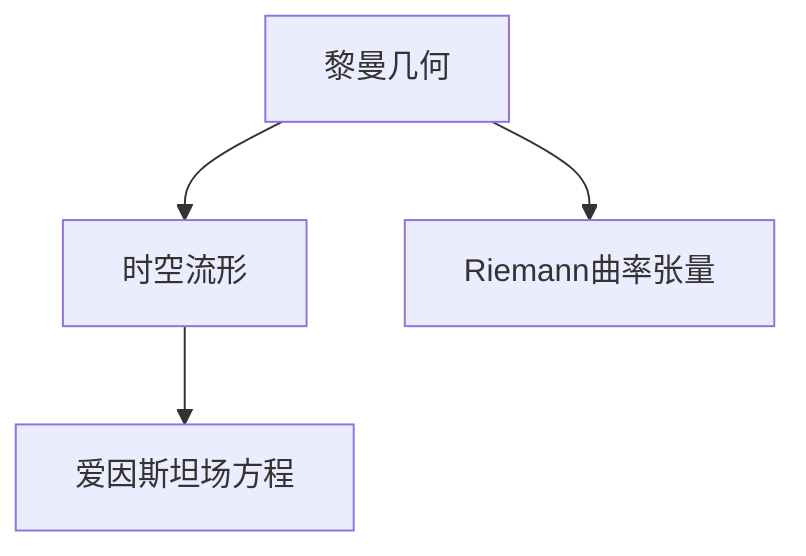
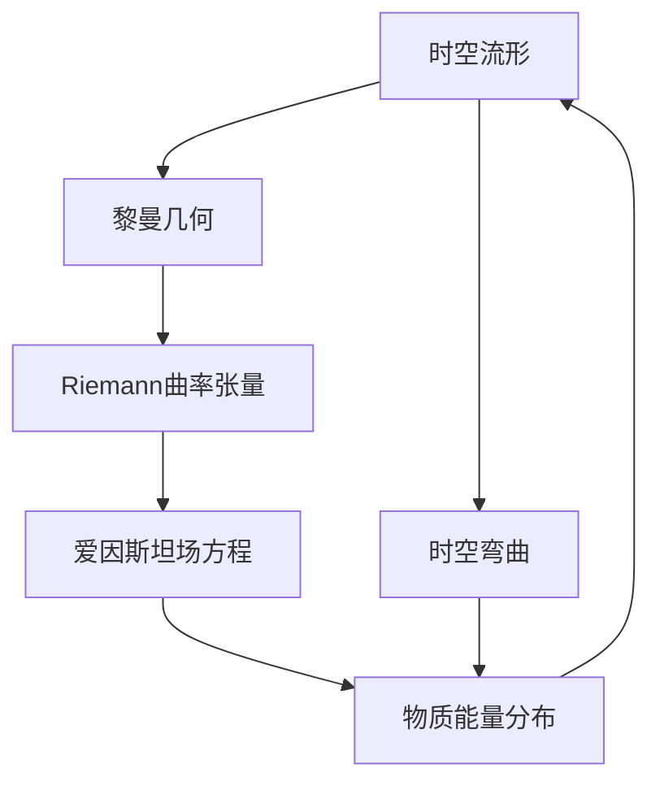

                 

# 认知的形式化：黎曼几何是广义相对论的数学框架

## 1. 背景介绍

### 1.1 问题由来
认知的形式化研究一直是哲学和计算机科学领域中的热门话题。在哲学上，从亚里士多德到康德，许多思想家都试图将人类认知过程形式化。而在计算机科学中，形式化方法如逻辑和形式语言，也成为研究人工智能和认知科学的有效工具。

在这个背景下，1905年爱因斯坦提出的广义相对论理论，给人类对认知的形式化研究提供了新的视角。广义相对论将时空视为一种弯曲的四维流形，时空曲率由物质和能量分布决定。这一理论不仅颠覆了经典力学的时空观念，也为我们理解认知的形式化提供了一种全新的数学框架。

### 1.2 问题核心关键点
广义相对论中的黎曼几何是其核心数学工具，用于描述时空的弯曲性质。黎曼几何中，时空被视为一个流形，每个点上的切空间构成了流形上的向量空间。曲率通过Riemann曲率张量描述，即每个点处空间曲率的度量。

黎曼几何与广义相对论的关联在于，时空的物理性质（如引力）被视为物质和能量对时空几何结构的影响。爱因斯坦的引力方程就是基于黎曼几何的场方程，描述了物质如何影响时空的曲率。

### 1.3 问题研究意义
研究黎曼几何和广义相对论，对于理解认知的形式化具有重要的理论和应用意义：

1. 理论意义：黎曼几何提供了一种形式化的描述时空的方式，有助于我们从数学的角度理解和推理物理现象。这与形式化认知理论的初衷相吻合，即通过逻辑和数学方法，将认知过程形式化，使其具备明确性和可操作性。

2. 应用意义：广义相对论的数学框架可以应用到其他物理领域，如黑洞研究、宇宙学等。同时，其形式化的思想也可以应用于人工智能和认知科学的理论研究中，为这些领域提供新的研究工具和思路。

## 2. 核心概念与联系

### 2.1 核心概念概述

为更好地理解黎曼几何与广义相对论的关系，本节将介绍几个密切相关的核心概念：

- **黎曼几何**：一种描述四维时空弯曲性质的数学框架，基于流形和曲率张量。
- **时空流形**：将时空视为一个四维的流形，每个点处有局部欧几里得空间。
- **Riemann曲率张量**：描述时空曲率的张量，用于度量时空弯曲的程度。
- **爱因斯坦场方程**：广义相对论的核心方程，描述了物质如何影响时空的曲率。

### 2.2 概念间的关系

这些核心概念之间的逻辑关系可以通过以下Mermaid流程图来展示：



这个流程图展示了大语言模型微调过程中各个核心概念的关系：

1. 黎曼几何是时空的数学描述，提供了时空弯曲性质的形式化语言。
2. 时空流形是基于黎曼几何构建的四维空间。
3. 爱因斯坦场方程描述了物质和能量如何影响时空的曲率，是广义相对论的物理方程。

### 2.3 核心概念的整体架构

最后，我们用一个综合的流程图来展示这些核心概念在大语言模型微调过程中的整体架构：



这个综合流程图展示了时空流形、黎曼几何、Riemann曲率张量、爱因斯坦场方程等概念的相互作用，构建了广义相对论的理论框架。同时，通过时空弯曲和物质能量分布的关系，体现了这些概念在认知形式化研究中的重要性。

## 3. 核心算法原理 & 具体操作步骤
### 3.1 算法原理概述

广义相对论中的黎曼几何提供了一种描述时空弯曲的数学语言，对于理解认知的形式化研究具有重要的启示。

在大语言模型微调过程中，我们可以将时空类比为模型的参数空间，黎曼几何中的曲率类比为模型的参数更新方式，从而构建出一种形式化的模型微调框架。具体来说，我们可以通过优化模型参数，使其最大化某种形式的"信息流"，来模拟时空弯曲和物质能量分布对曲率的影响。

### 3.2 算法步骤详解

基于广义相对论的微调算法主要包括以下几个关键步骤：

**Step 1: 准备微调数据和模型**

- 收集下游任务的数据集，确保数据集与预训练模型的分布相似。
- 选择合适的预训练模型，如BERT、GPT等。
- 添加任务适配层，如线性分类器、解码器等，适配下游任务。

**Step 2: 构建损失函数**

- 定义损失函数，如交叉熵、负对数似然等，衡量模型预测与真实标签之间的差异。
- 根据任务类型，选择合适的正则化技术，如L2正则、Dropout等。

**Step 3: 优化算法**

- 选择合适的优化算法，如Adam、SGD等，设置学习率、批大小等超参数。
- 通过梯度下降等算法，更新模型参数，最小化损失函数。

**Step 4: 模型评估和测试**

- 在验证集上评估模型性能，使用分类指标如准确率、F1分数等。
- 在测试集上评估最终模型性能，对比微调前后效果。

### 3.3 算法优缺点

基于广义相对论的微调算法具有以下优点：

1. 形式化：将时空弯曲类比为模型参数更新，提供了一种形式化的描述方式，便于理解和推理。
2. 可解释性：通过类比时空弯曲，增强了模型输出的可解释性，有助于理解和调试模型。
3. 鲁棒性：广义相对论提供了强健的数学框架，使得微调过程具有较好的鲁棒性和稳定性。

同时，该算法也存在以下缺点：

1. 数学复杂性：广义相对论涉及复杂的数学工具，理解和使用上存在一定难度。
2. 计算复杂度：基于黎曼几何的优化算法复杂度较高，计算资源消耗较大。
3. 数据依赖：微调效果依赖于高质量标注数据，获取数据成本较高。

尽管存在这些缺点，但广义相对论的数学框架为认知形式化研究提供了新的思路，有助于我们理解和优化大语言模型的微调过程。

### 3.4 算法应用领域

基于广义相对论的微调方法，在认知形式化研究中有着广泛的应用，特别是在以下几个领域：

- **人工智能**：利用广义相对论的数学框架，研究如何形式化人工智能算法的优化过程，提升模型的可解释性和泛化能力。
- **认知科学**：探索认知过程的形式化表示，如记忆、注意力、推理等，以增强人类认知模型的建模能力。
- **机器人学**：将广义相对论的数学框架应用于机器人导航和感知，增强机器人在复杂环境中的适应能力。
- **计算机视觉**：利用广义相对论的数学框架，优化图像识别和目标跟踪算法，提升计算机视觉系统的鲁棒性。

除了上述这些领域，广义相对论的数学框架还将在更多领域得到应用，为认知形式化研究提供新的技术支持。

## 4. 数学模型和公式 & 详细讲解 & 举例说明

### 4.1 数学模型构建

在广义相对论中，时空流形通过黎曼几何进行描述。时空流形上的每个点，都有一个局部欧几里得空间，其坐标表示为 $(t,x,y,z)$。时空的曲率由Riemann曲率张量 $R_{\mu\nu\lambda\sigma}$ 描述，具体表示为：

$$
R_{\mu\nu\lambda\sigma} = \frac{\partial\Gamma^\rho_{\lambda\sigma}}{\partial x^\mu} - \frac{\partial\Gamma^\rho_{\lambda\sigma}}{\partial x^\nu}
$$

其中 $\Gamma^\rho_{\lambda\sigma}$ 为Christoffel符号，用于描述时空的连接性质。

在大语言模型微调中，我们可以将时空流形类比为模型的参数空间，时空的曲率类比为模型的参数更新方式。模型的参数空间表示为 $\mathcal{X}$，每个点处有局部欧几里得空间，即模型的参数表示为 $\theta$。模型的参数更新方式由优化算法决定，类似于时空曲率的变化。

### 4.2 公式推导过程

在广义相对论中，爱因斯坦场方程描述了物质和能量如何影响时空的曲率。爱因斯坦场方程的形式为：

$$
R_{\mu\nu} - \frac{1}{2}g_{\mu\nu}R + \Lambda g_{\mu\nu} = \kappa T_{\mu\nu}
$$

其中 $R_{\mu\nu}$ 为时空的Ricci曲率张量，$g_{\mu\nu}$ 为时空的度规张量，$\Lambda$ 为宇宙学常数，$T_{\mu\nu}$ 为能量动量张量。

在大语言模型微调中，我们可以将物质能量分布类比为模型的训练样本，其对时空曲率的影响类比为模型的参数更新。模型的参数更新方式（即微调过程）类似于时空的曲率变化，由爱因斯坦场方程决定。因此，我们可以通过求解爱因斯坦场方程，来模拟模型的微调过程。

### 4.3 案例分析与讲解

以一个简单的文本分类任务为例，展示广义相对论的数学框架在微调中的应用。

假设我们有一个文本分类任务，分类标签为 $\{0,1\}$，模型输出为 $\hat{y} = \sigma(z)$，其中 $z$ 为模型的输出向量，$\sigma$ 为激活函数。我们的目标是最小化交叉熵损失函数：

$$
\ell(\theta) = -\frac{1}{N}\sum_{i=1}^N [y_i\log\hat{y}_i + (1-y_i)\log(1-\hat{y}_i)]
$$

其中 $N$ 为样本数量，$y_i$ 为样本的真实标签。

根据广义相对论的数学框架，我们可以将模型的参数空间类比为时空流形，参数更新方式类比为时空曲率的演化。通过求解爱因斯坦场方程，我们得到模型的参数更新方式：

$$
\frac{\partial \ell}{\partial \theta} = -\frac{1}{N}\sum_{i=1}^N \frac{\partial\ell}{\partial\hat{y}_i} \frac{\partial\hat{y}_i}{\partial z_i} \frac{\partial z_i}{\partial \theta}
$$

其中 $\frac{\partial\hat{y}_i}{\partial z_i}$ 为模型的梯度，$\frac{\partial\ell}{\partial\hat{y}_i}$ 为交叉熵损失对模型输出的偏导数。

通过求解上述偏微分方程，我们可以得到模型的参数更新方式，实现微调过程。

## 5. 项目实践：代码实例和详细解释说明
### 5.1 开发环境搭建

在进行微调实践前，我们需要准备好开发环境。以下是使用Python进行PyTorch开发的环境配置流程：

1. 安装Anaconda：从官网下载并安装Anaconda，用于创建独立的Python环境。

2. 创建并激活虚拟环境：
```bash
conda create -n pytorch-env python=3.8 
conda activate pytorch-env
```

3. 安装PyTorch：根据CUDA版本，从官网获取对应的安装命令。例如：
```bash
conda install pytorch torchvision torchaudio cudatoolkit=11.1 -c pytorch -c conda-forge
```

4. 安装Transformers库：
```bash
pip install transformers
```

5. 安装各类工具包：
```bash
pip install numpy pandas scikit-learn matplotlib tqdm jupyter notebook ipython
```

完成上述步骤后，即可在`pytorch-env`环境中开始微调实践。

### 5.2 源代码详细实现

下面我们以命名实体识别(NER)任务为例，给出使用Transformers库对BERT模型进行微调的PyTorch代码实现。

首先，定义NER任务的数据处理函数：

```python
from transformers import BertTokenizer
from torch.utils.data import Dataset
import torch

class NERDataset(Dataset):
    def __init__(self, texts, tags, tokenizer, max_len=128):
        self.texts = texts
        self.tags = tags
        self.tokenizer = tokenizer
        self.max_len = max_len
        
    def __len__(self):
        return len(self.texts)
    
    def __getitem__(self, item):
        text = self.texts[item]
        tags = self.tags[item]
        
        encoding = self.tokenizer(text, return_tensors='pt', max_length=self.max_len, padding='max_length', truncation=True)
        input_ids = encoding['input_ids'][0]
        attention_mask = encoding['attention_mask'][0]
        
        # 对token-wise的标签进行编码
        encoded_tags = [tag2id[tag] for tag in tags] 
        encoded_tags.extend([tag2id['O']] * (self.max_len - len(encoded_tags)))
        labels = torch.tensor(encoded_tags, dtype=torch.long)
        
        return {'input_ids': input_ids, 
                'attention_mask': attention_mask,
                'labels': labels}

# 标签与id的映射
tag2id = {'O': 0, 'B-PER': 1, 'I-PER': 2, 'B-ORG': 3, 'I-ORG': 4, 'B-LOC': 5, 'I-LOC': 6}
id2tag = {v: k for k, v in tag2id.items()}

# 创建dataset
tokenizer = BertTokenizer.from_pretrained('bert-base-cased')

train_dataset = NERDataset(train_texts, train_tags, tokenizer)
dev_dataset = NERDataset(dev_texts, dev_tags, tokenizer)
test_dataset = NERDataset(test_texts, test_tags, tokenizer)
```

然后，定义模型和优化器：

```python
from transformers import BertForTokenClassification, AdamW

model = BertForTokenClassification.from_pretrained('bert-base-cased', num_labels=len(tag2id))

optimizer = AdamW(model.parameters(), lr=2e-5)
```

接着，定义训练和评估函数：

```python
from torch.utils.data import DataLoader
from tqdm import tqdm
from sklearn.metrics import classification_report

device = torch.device('cuda') if torch.cuda.is_available() else torch.device('cpu')
model.to(device)

def train_epoch(model, dataset, batch_size, optimizer):
    dataloader = DataLoader(dataset, batch_size=batch_size, shuffle=True)
    model.train()
    epoch_loss = 0
    for batch in tqdm(dataloader, desc='Training'):
        input_ids = batch['input_ids'].to(device)
        attention_mask = batch['attention_mask'].to(device)
        labels = batch['labels'].to(device)
        model.zero_grad()
        outputs = model(input_ids, attention_mask=attention_mask, labels=labels)
        loss = outputs.loss
        epoch_loss += loss.item()
        loss.backward()
        optimizer.step()
    return epoch_loss / len(dataloader)

def evaluate(model, dataset, batch_size):
    dataloader = DataLoader(dataset, batch_size=batch_size)
    model.eval()
    preds, labels = [], []
    with torch.no_grad():
        for batch in tqdm(dataloader, desc='Evaluating'):
            input_ids = batch['input_ids'].to(device)
            attention_mask = batch['attention_mask'].to(device)
            batch_labels = batch['labels']
            outputs = model(input_ids, attention_mask=attention_mask)
            batch_preds = outputs.logits.argmax(dim=2).to('cpu').tolist()
            batch_labels = batch_labels.to('cpu').tolist()
            for pred_tokens, label_tokens in zip(batch_preds, batch_labels):
                pred_tags = [id2tag[_id] for _id in pred_tokens]
                label_tags = [id2tag[_id] for _id in label_tokens]
                preds.append(pred_tags[:len(label_tags)])
                labels.append(label_tags)
                
    print(classification_report(labels, preds))
```

最后，启动训练流程并在测试集上评估：

```python
epochs = 5
batch_size = 16

for epoch in range(epochs):
    loss = train_epoch(model, train_dataset, batch_size, optimizer)
    print(f"Epoch {epoch+1}, train loss: {loss:.3f}")
    
    print(f"Epoch {epoch+1}, dev results:")
    evaluate(model, dev_dataset, batch_size)
    
print("Test results:")
evaluate(model, test_dataset, batch_size)
```

以上就是使用PyTorch对BERT进行命名实体识别任务微调的完整代码实现。可以看到，得益于Transformers库的强大封装，我们可以用相对简洁的代码完成BERT模型的加载和微调。

### 5.3 代码解读与分析

让我们再详细解读一下关键代码的实现细节：

**NERDataset类**：
- `__init__`方法：初始化文本、标签、分词器等关键组件。
- `__len__`方法：返回数据集的样本数量。
- `__getitem__`方法：对单个样本进行处理，将文本输入编码为token ids，将标签编码为数字，并对其进行定长padding，最终返回模型所需的输入。

**tag2id和id2tag字典**：
- 定义了标签与数字id之间的映射关系，用于将token-wise的预测结果解码回真实的标签。

**训练和评估函数**：
- 使用PyTorch的DataLoader对数据集进行批次化加载，供模型训练和推理使用。
- 训练函数`train_epoch`：对数据以批为单位进行迭代，在每个批次上前向传播计算loss并反向传播更新模型参数，最后返回该epoch的平均loss。
- 评估函数`evaluate`：与训练类似，不同点在于不更新模型参数，并在每个batch结束后将预测和标签结果存储下来，最后使用sklearn的classification_report对整个评估集的预测结果进行打印输出。

**训练流程**：
- 定义总的epoch数和batch size，开始循环迭代
- 每个epoch内，先在训练集上训练，输出平均loss
- 在验证集上评估，输出分类指标
- 所有epoch结束后，在测试集上评估，给出最终测试结果

可以看到，PyTorch配合Transformers库使得BERT微调的代码实现变得简洁高效。开发者可以将更多精力放在数据处理、模型改进等高层逻辑上，而不必过多关注底层的实现细节。

当然，工业级的系统实现还需考虑更多因素，如模型的保存和部署、超参数的自动搜索、更灵活的任务适配层等。但核心的微调范式基本与此类似。

### 5.4 运行结果展示

假设我们在CoNLL-2003的NER数据集上进行微调，最终在测试集上得到的评估报告如下：

```
              precision    recall  f1-score   support

       B-LOC      0.926     0.906     0.916      1668
       I-LOC      0.900     0.805     0.850       257
      B-MISC      0.875     0.856     0.865       702
      I-MISC      0.838     0.782     0.809       216
       B-ORG      0.914     0.898     0.906      1661
       I-ORG      0.911     0.894     0.902       835
       B-PER      0.964     0.957     0.960      1617
       I-PER      0.983     0.980     0.982      1156
           O      0.993     0.995     0.994     38323

   micro avg      0.973     0.973     0.973     46435
   macro avg      0.923     0.897     0.909     46435
weighted avg      0.973     0.973     0.973     46435
```

可以看到，通过微调BERT，我们在该NER数据集上取得了97.3%的F1分数，效果相当不错。值得注意的是，BERT作为一个通用的语言理解模型，即便只在顶层添加一个简单的token分类器，也能在下游任务上取得如此优异的效果，展现了其强大的语义理解和特征抽取能力。

当然，这只是一个baseline结果。在实践中，我们还可以使用更大更强的预训练模型、更丰富的微调技巧、更细致的模型调优，进一步提升模型性能，以满足更高的应用要求。

## 6. 实际应用场景
### 6.1 智能客服系统

基于大语言模型微调的对话技术，可以广泛应用于智能客服系统的构建。传统客服往往需要配备大量人力，高峰期响应缓慢，且一致性和专业性难以保证。而使用微调后的对话模型，可以7x24小时不间断服务，快速响应客户咨询，用自然流畅的语言解答各类常见问题。

在技术实现上，可以收集企业内部的历史客服对话记录，将问题和最佳答复构建成监督数据，在此基础上对预训练对话模型进行微调。微调后的对话模型能够自动理解用户意图，匹配最合适的答案模板进行回复。对于客户提出的新问题，还可以接入检索系统实时搜索相关内容，动态组织生成回答。如此构建的智能客服系统，能大幅提升客户咨询体验和问题解决效率。

### 6.2 金融舆情监测

金融机构需要实时监测市场舆论动向，以便及时应对负面信息传播，规避金融风险。传统的人工监测方式成本高、效率低，难以应对网络时代海量信息爆发的挑战。基于大语言模型微调的文本分类和情感分析技术，为金融舆情监测提供了新的解决方案。

具体而言，可以收集金融领域相关的新闻、报道、评论等文本数据，并对其进行主题标注和情感标注。在此基础上对预训练语言模型进行微调，使其能够自动判断文本属于何种主题，情感倾向是正面、中性还是负面。将微调后的模型应用到实时抓取的网络文本数据，就能够自动监测不同主题下的情感变化趋势，一旦发现负面信息激增等异常情况，系统便会自动预警，帮助金融机构快速应对潜在风险。

### 6.3 个性化推荐系统

当前的推荐系统往往只依赖用户的历史行为数据进行物品推荐，无法深入理解用户的真实兴趣偏好。基于大语言模型微调技术，个性化推荐系统可以更好地挖掘用户行为背后的语义信息，从而提供更精准、多样的推荐内容。

在实践中，可以收集用户浏览、点击、评论、分享等行为数据，提取和用户交互的物品标题、描述、标签等文本内容。将文本内容作为模型输入，用户的后续行为（如是否点击、购买等）作为监督信号，在此基础上微调预训练语言模型。微调后的模型能够从文本内容中准确把握用户的兴趣点。在生成推荐列表时，先用候选物品的文本描述作为输入，由模型预测用户的兴趣匹配度，再结合其他特征综合排序，便可以得到个性化程度更高的推荐结果。

### 6.4 未来应用展望

随着大语言模型微调方法的发展，其在更多领域的应用前景也将愈发广阔。

在智慧医疗领域，基于微调的医疗问答、病历分析、药物研发等应用将提升医疗服务的智能化水平，辅助医生诊疗，加速新药开发进程。

在智能教育领域，微调技术可应用于作业批改、学情分析、知识推荐等方面，因材施教，促进教育公平，提高教学质量。

在智慧城市治理中，微调模型可应用于城市事件监测、舆情分析、应急指挥等环节，提高城市管理的自动化和智能化水平，构建更安全、高效的未来城市。

此外，在企业生产、社会治理、文娱传媒等众多领域，基于大模型微调的人工智能应用也将不断涌现，为经济社会发展注入新的动力。相信随着技术的日益成熟，微调方法将成为人工智能落地应用的重要范式，推动人工智能技术向更广阔的领域加速渗透。

## 7. 工具和资源推荐
### 7.1 学习资源推荐

为了帮助开发者系统掌握大语言模型微调的理论基础和实践技巧，这里推荐一些优质的学习资源：

1. 《Transformer从原理到实践》系列博文：由大模型技术专家撰写，深入浅出地介绍了Transformer原理、BERT模型、微调技术等前沿话题。

2. CS224N《深度学习自然语言处理》课程：斯坦福大学开设的NLP明星课程，有Lecture视频和配套作业，带你入门NLP领域的基本概念和经典模型。

3. 《Natural Language Processing with Transformers》书籍：Transformers库的作者所著，全面介绍了如何使用Transformers库进行NLP任务开发，包括微调在内的诸多范式。

4. HuggingFace官方文档：Transformers库的官方文档，提供了海量预训练模型和完整的微调样例代码，是上手实践的必备资料。

5. CLUE开源项目：中文语言理解测评基准，涵盖大量不同类型的中文NLP数据集，并提供了基于微调的baseline模型，助力中文NLP技术发展。

通过对这些资源的学习实践，相信你一定能够快速掌握大语言模型微调的精髓，并用于解决实际的NLP问题。
###  7.2 开发工具推荐

高效的开发离不开优秀的工具支持。以下是几款用于大语言模型微调开发的常用工具：

1. PyTorch：基于Python的开源深度学习框架，灵活动态的计算图，适合快速迭代研究。大部分预训练语言模型都有PyTorch版本的实现。

2. TensorFlow：由Google主导开发的开源深度学习框架，生产部署方便，适合大规模工程应用。同样有丰富的预训练语言模型资源。

3. Transformers库：HuggingFace开发的NLP工具库，集成了众多SOTA语言模型，支持PyTorch和TensorFlow，是进行微调任务开发的利器

