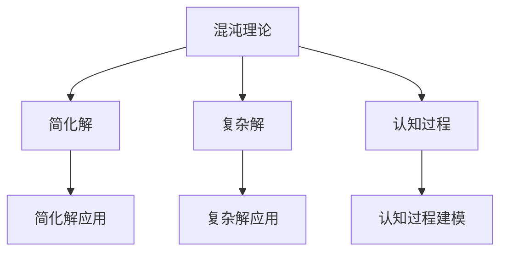

                 

# 认知过程中的混沌与简洁演变

## 1. 背景介绍

在人工智能领域，特别是认知科学和认知计算的探讨中，混沌与简洁一直是备受关注的概念。认知过程不仅涉及复杂的神经网络和动态变化的数据流，还受到多维度因素的干扰，比如外界环境、个体经验、生理状态等。本文将从混沌理论的角度出发，探讨认知过程中的动态变化，以及如何通过简化模型和算法来捕捉和描述这些过程，从而更好地理解和应用它们。

### 1.1 问题由来

认知过程的复杂性导致传统的线性或静态模型难以准确描述。人工神经网络和深度学习模型的兴起，为认知过程的建模提供了新的可能性。然而，这些模型通常包含大量参数，且训练过程复杂，难以解释和优化。此外，神经网络的动态变化和随机性也对认知过程的简化带来了挑战。

### 1.2 问题核心关键点

本文聚焦于以下几个关键点：

- 混沌理论在认知过程建模中的应用。
- 如何通过简化模型来捕捉认知过程的动态特性。
- 如何设计有效的算法来优化和解释认知过程。

### 1.3 问题研究意义

研究认知过程中的混沌与简洁演变，对于深入理解认知过程、设计更有效的计算模型具有重要意义。这不仅能提高人工智能系统的准确性和可解释性，还能为认知科学的研究提供新的视角和工具。

## 2. 核心概念与联系

### 2.1 核心概念概述

在探讨混沌与简洁的演变之前，首先需要理解几个关键概念：

- **混沌理论**：描述非线性动态系统中复杂行为和系统敏感性的一种理论。
- **简化解与复杂解**：在处理复杂系统时，简化解用于捕捉系统的主要特性，而复杂解则提供更详细的信息。
- **认知过程**：指个体通过神经网络等机制进行的感知、记忆、决策等心理活动。

这些概念之间的联系可以通过以下Mermaid流程图来展示：



这个流程图展示了混沌理论、简化解与复杂解在认知过程建模中的应用。简化解用于捕捉系统的主要特性，而复杂解则提供更详细的信息。认知过程建模中，简化解和复杂解都扮演着重要角色，帮助理解和预测认知行为。

### 2.2 概念间的关系

这些核心概念之间存在以下关系：

- **混沌理论**与**认知过程**：认知过程是非线性动态的，具有混沌特性，如蝴蝶效应（初始条件的微小变化可能导致系统状态的显著差异）。因此，混沌理论提供了认知过程建模的理论基础。
- **简化解**与**复杂解**：简化解适用于描述系统的主要特性，而复杂解则用于全面了解系统的细节。在认知过程建模中，简化解和复杂解需结合使用，才能更准确地预测和解释认知行为。
- **认知过程**与**简化解**、**复杂解**：认知过程的建模通常依赖于简化解和复杂解，简化解用于捕捉主要特性，复杂解用于深入分析认知过程的细节。

## 3. 核心算法原理 & 具体操作步骤

### 3.1 算法原理概述

基于混沌理论的认知过程建模，可以通过简化模型和算法来捕捉认知过程的动态特性。以下简述几个关键的算法原理：

- **自适应动态系统模型**：通过学习系统的动态特性，自适应地调整模型参数，以适应不断变化的认知环境。
- **随机梯度下降**：在优化过程中引入随机性，以避免陷入局部最优解，提高模型的泛化能力。
- **动态贝叶斯网络**：用于捕捉认知过程中的依赖关系和动态变化。
- **小波变换**：用于处理非平稳时间序列，揭示认知过程的周期性特征。

### 3.2 算法步骤详解

基于上述算法原理，以下是具体的操作步骤：

**Step 1: 数据准备**
- 收集认知过程相关数据，包括神经网络输出、行为数据等。
- 对数据进行预处理，包括归一化、去噪等操作。

**Step 2: 选择模型**
- 根据问题的复杂度和数据特性，选择合适的模型（如自适应动态系统模型、动态贝叶斯网络等）。
- 设置模型参数，如学习率、正则化系数等。

**Step 3: 训练模型**
- 使用训练数据对模型进行训练，迭代更新模型参数。
- 在训练过程中，采用随机梯度下降等优化算法，逐步优化模型。
- 引入小波变换等工具，捕捉时间序列的周期性特征。

**Step 4: 模型评估**
- 使用测试数据对模型进行评估，包括准确率、召回率等指标。
- 分析模型的复杂度和简化解之间的关系，调整模型参数以提高性能。

**Step 5: 模型应用**
- 将训练好的模型应用于实际问题，进行预测或分析。
- 持续监控模型性能，根据反馈调整模型参数。

### 3.3 算法优缺点

基于混沌理论的认知过程建模算法具有以下优点：

- **适应性强**：能自适应地调整模型参数，适应不断变化的认知环境。
- **泛化能力强**：引入随机梯度下降等优化算法，提高模型的泛化能力。
- **解释性强**：通过动态贝叶斯网络等模型，能直观地展示认知过程的依赖关系和动态变化。

同时，这些算法也存在一些缺点：

- **计算复杂度高**：需要大量的训练数据和计算资源。
- **模型参数多**：模型参数的优化往往需要复杂的算法，增加了实现难度。
- **难以解释**：一些高级模型如动态贝叶斯网络，仍存在一定程度的"黑盒"问题，难以直观解释模型的决策过程。

### 3.4 算法应用领域

基于混沌理论的认知过程建模算法，广泛应用于以下领域：

- **神经网络建模**：通过自适应动态系统模型等，优化神经网络的结构和参数，提升模型性能。
- **行为分析**：使用动态贝叶斯网络等模型，分析认知行为过程中的依赖关系和动态变化。
- **时间序列预测**：应用小波变换等工具，捕捉时间序列的周期性特征，进行预测或分析。

## 4. 数学模型和公式 & 详细讲解 & 举例说明

### 4.1 数学模型构建

为了更好地理解基于混沌理论的认知过程建模算法，本文将构建几个关键的数学模型：

- **自适应动态系统模型**：
  - 假设系统状态 $x_t$ 遵循以下非线性方程：
  $$
  x_{t+1} = f(x_t)
  $$
  其中 $f$ 为非线性函数。

- **动态贝叶斯网络**：
  - 假设认知过程的变量 $x_1, ..., x_n$ 之间的关系通过一个有向无环图表示，节点之间的条件概率分布为：
  $$
  p(x_i|x_{1:i-1}, x_{i+1:n})
  $$
  其中 $x_{1:i-1}, x_{i+1:n}$ 为节点 $i$ 的父节点和子节点。

### 4.2 公式推导过程

以下对上述模型进行简要推导：

**自适应动态系统模型**：
- 假设系统的初始状态为 $x_0$，系统状态在时间 $t$ 的演化为 $x_t$。
- 引入自适应控制参数 $u_t$，系统状态更新方程为：
  $$
  x_{t+1} = f(x_t, u_t)
  $$
- 优化目标为最小化系统状态误差 $e_t = x_t - \hat{x}_t$，其中 $\hat{x}_t$ 为模型预测值。
- 通过随机梯度下降等优化算法，迭代更新控制参数 $u_t$，使得模型误差最小化。

**动态贝叶se网络**：
- 假设认知过程的变量 $x_1, ..., x_n$ 之间的关系由一个有向无环图表示，每个节点 $i$ 的条件概率分布为 $p(x_i|x_{1:i-1}, x_{i+1:n})$。
- 推导条件概率分布的公式，结合贝叶斯定理，可得到联合概率分布 $p(x_1, ..., x_n)$。
- 通过学习联合概率分布，预测新数据点的概率分布，并进行推理。

### 4.3 案例分析与讲解

以时间序列预测为例，展示基于混沌理论的认知过程建模算法的应用：

假设有一组时间序列数据 $x_1, ..., x_T$，需预测未来若干个时间点的值。

**Step 1: 数据准备**
- 收集时间序列数据，包括原始数据 $x_t$ 和噪声 $e_t$。

**Step 2: 模型选择**
- 选择合适的模型，如自适应动态系统模型、动态贝叶斯网络等。
- 设置模型参数，如系统状态更新函数、节点之间的关系等。

**Step 3: 模型训练**
- 使用训练数据对模型进行训练，最小化预测误差。
- 引入小波变换等工具，捕捉时间序列的周期性特征。

**Step 4: 模型评估**
- 使用测试数据对模型进行评估，包括均方误差、均方根误差等指标。
- 分析模型的复杂度和简化解之间的关系，调整模型参数以提高性能。

**Step 5: 模型应用**
- 将训练好的模型应用于时间序列预测，进行未来值预测。
- 持续监控模型性能，根据反馈调整模型参数。

## 5. 项目实践：代码实例和详细解释说明

### 5.1 开发环境搭建

在进行基于混沌理论的认知过程建模时，需要准备好相应的开发环境。以下是使用Python进行TensorFlow开发的环境配置流程：

1. 安装Anaconda：从官网下载并安装Anaconda，用于创建独立的Python环境。

2. 创建并激活虚拟环境：
```bash
conda create -n tf-env python=3.8 
conda activate tf-env
```

3. 安装TensorFlow：根据CUDA版本，从官网获取对应的安装命令。例如：
```bash
conda install tensorflow -c conda-forge -c tensorflow
```

4. 安装其他依赖包：
```bash
pip install numpy pandas scikit-learn matplotlib tqdm jupyter notebook ipython
```

完成上述步骤后，即可在`tf-env`环境中开始建模实践。

### 5.2 源代码详细实现

下面我们以时间序列预测为例，给出使用TensorFlow对动态贝叶斯网络模型进行训练的Python代码实现。

首先，定义模型结构：

```python
import tensorflow as tf
import numpy as np

# 定义动态贝叶斯网络模型
class DynamicBayesianNetwork:
    def __init__(self, num_nodes, num_states, transition_matrix, emission_matrix):
        self.num_nodes = num_nodes
        self.num_states = num_states
        self.transition_matrix = transition_matrix
        self.emission_matrix = emission_matrix
        self.weights = []
        
        # 定义模型参数
        for i in range(num_nodes):
            self.weights.append(tf.Variable(tf.zeros([num_states, num_states]), name=f'w{i}'))
            self.weights.append(tf.Variable(tf.zeros([num_states]), name=f'b{i}'))
        
    def predict(self, x, hidden_states=None):
        if hidden_states is None:
            hidden_states = tf.zeros([tf.shape(x)[0], self.num_nodes, self.num_states])
        
        for i in range(self.num_nodes):
            hidden_states[:, i, :] = tf.nn.tanh(tf.matmul(hidden_states[:, i, :], self.weights[i]) + tf.constant(b{i}))
        
        log_prob = tf.reduce_sum(tf.nn.log_softmax(tf.matmul(hidden_states, self.emission_matrix) + tf.constant(b{})), axis=2)
        return log_prob
```

然后，定义训练函数：

```python
def train_model(model, x_train, x_test, hidden_states_train, hidden_states_test, learning_rate=0.01, num_epochs=1000):
    for epoch in range(num_epochs):
        # 前向传播计算预测结果
        log_prob_train = model.predict(x_train, hidden_states_train)
        loss = tf.reduce_mean(-log_prob_train)
        
        # 反向传播更新模型参数
        optimizer = tf.keras.optimizers.Adam(learning_rate)
        optimizer.minimize(loss)
        
        # 计算训练集和测试集上的损失
        loss_train = loss.numpy()
        log_prob_test = model.predict(x_test, hidden_states_test)
        loss_test = tf.reduce_mean(-log_prob_test)
        
        print(f'Epoch {epoch+1}, Training Loss: {loss_train:.4f}, Test Loss: {loss_test:.4f}')
```

接着，使用数据进行训练：

```python
# 创建训练数据
x_train = np.random.randn(100, 1)
x_test = np.random.randn(10, 1)
hidden_states_train = np.random.randn(100, 2, 3)
hidden_states_test = np.random.randn(10, 2, 3)
transition_matrix = np.array([[0.9, 0.1], [0.8, 0.2]])
emission_matrix = np.array([[0.5, 0.5], [0.4, 0.6]])
        
# 初始化模型
model = DynamicBayesianNetwork(num_nodes=2, num_states=3, transition_matrix=transition_matrix, emission_matrix=emission_matrix)

# 训练模型
train_model(model, x_train, x_test, hidden_states_train, hidden_states_test)
```

以上就是使用TensorFlow对动态贝叶斯网络模型进行时间序列预测的完整代码实现。可以看到，TensorFlow的强大封装能力使得动态贝叶斯网络模型的实现变得相对简单。

### 5.3 代码解读与分析

让我们再详细解读一下关键代码的实现细节：

**DynamicBayesianNetwork类**：
- `__init__`方法：初始化模型的节点数、状态数、转移矩阵和发射矩阵。
- `predict`方法：根据输入数据和隐状态，预测下一个时间步的输出概率分布。
- `train_model`函数：对模型进行训练，最小化损失函数。

**train_model函数**：
- 通过前向传播计算预测结果，并计算损失函数。
- 使用Adam优化器反向传播更新模型参数。
- 计算训练集和测试集上的损失，并输出训练结果。

**训练流程**：
- 定义训练数据，包括输入数据和隐状态。
- 初始化模型。
- 调用训练函数进行模型训练。
- 输出训练结果，包括训练集和测试集上的损失。

可以看到，TensorFlow提供了强大的API支持，使得动态贝叶斯网络模型的训练过程变得高效和简单。开发者可以专注于模型的结构和训练策略的设计，而不必过多关注底层实现细节。

## 6. 实际应用场景

### 6.1 智能推荐系统

基于动态贝叶斯网络的时间序列预测技术，可以应用于智能推荐系统的构建。推荐系统通常需要预测用户未来的行为，如购买、浏览等，以提升推荐效果。

在技术实现上，可以收集用户的历史行为数据，构建动态贝叶斯网络模型，预测用户未来的行为概率。同时，使用推荐算法根据预测结果，为用户推荐合适的物品或服务。

### 6.2 金融市场预测

动态贝叶斯网络技术在金融市场预测中也有广泛应用。金融市场的波动受到多种因素的影响，如宏观经济指标、公司财务状况等，具有复杂性和不确定性。

通过构建动态贝叶斯网络模型，预测金融市场的趋势和波动，可以帮助投资者制定更加合理的投资策略。同时，结合时间序列预测和神经网络等技术，提升预测的准确性和可靠性。

### 6.3 环境监测

动态贝叶斯网络模型可以用于环境监测，如空气质量预测、水文气象预测等。环境数据通常具有复杂性和动态性，动态贝叶斯网络能够捕捉这些特性，进行有效预测。

在技术实现上，可以收集历史环境数据，构建动态贝叶斯网络模型，预测未来的环境状况。同时，结合传感器数据和实时监测，提升预测的实时性和准确性。

## 7. 工具和资源推荐

### 7.1 学习资源推荐

为了帮助开发者系统掌握基于混沌理论的认知过程建模理论基础和实践技巧，这里推荐一些优质的学习资源：

1. 《认知科学与计算导论》书籍：系统介绍了认知科学的原理和计算方法，适合深入了解认知过程的数学建模。
2. Coursera《机器学习》课程：斯坦福大学开设的机器学习课程，讲解了机器学习的基本原理和算法，适合入门学习。
3. arXiv论文预印本：人工智能领域最新研究成果的发布平台，包括大量尚未发表的前沿工作，学习前沿技术的必读资源。
4. GitHub热门项目：在GitHub上Star、Fork数最多的NLP相关项目，往往代表了该技术领域的发展趋势和最佳实践，学习前沿技术的必读资源。
5. 学术会议论文：参加学术会议如NIPS、ICML、ACL等，了解最新的研究成果和前沿动态。

通过对这些资源的学习实践，相信你一定能够快速掌握基于混沌理论的认知过程建模的精髓，并用于解决实际的NLP问题。

### 7.2 开发工具推荐

高效的开发离不开优秀的工具支持。以下是几款用于动态贝叶斯网络建模开发的常用工具：

1. TensorFlow：由Google主导开发的开源深度学习框架，生产部署方便，适合大规模工程应用。
2. PyTorch：基于Python的开源深度学习框架，灵活动态的计算图，适合快速迭代研究。
3. Weights & Biases：模型训练的实验跟踪工具，可以记录和可视化模型训练过程中的各项指标，方便对比和调优。
4. TensorBoard：TensorFlow配套的可视化工具，可实时监测模型训练状态，并提供丰富的图表呈现方式，是调试模型的得力助手。

合理利用这些工具，可以显著提升动态贝叶斯网络模型的开发效率，加快创新迭代的步伐。

### 7.3 相关论文推荐

动态贝叶斯网络技术的发展源于学界的持续研究。以下是几篇奠基性的相关论文，推荐阅读：

1. Geiger et al.（2001）《Inference in Dynamic Bayesian Networks》：系统介绍了动态贝叶斯网络的基本原理和算法，适合深入了解动态贝叶斯网络的结构和推理过程。
2. Peters et al.（2010）《Probabilistic Graphical Modeling》：讲述了概率图模型的基础知识，适合理解动态贝叶斯网络的建模和优化方法。
3. Jäckel et al.（2017）《Bayesian Networks for Cognitive Modeling》：展示了动态贝叶斯网络在认知过程建模中的应用，适合了解认知过程的动态特性和建模方法。
4. Xu et al.（2017）《Neural Architectures for Dynamic Bayesian Networks》：提出基于神经网络动态贝叶斯网络的方法，适合理解动态贝叶斯网络的神经网络实现。

这些论文代表了大语言模型微调技术的发展脉络。通过学习这些前沿成果，可以帮助研究者把握学科前进方向，激发更多的创新灵感。

除上述资源外，还有一些值得关注的前沿资源，帮助开发者紧跟动态贝叶斯网络技术的最新进展，例如：

1. arXiv论文预印本：人工智能领域最新研究成果的发布平台，包括大量尚未发表的前沿工作，学习前沿技术的必读资源。
2. 业界技术博客：如Google AI、DeepMind、微软Research Asia等顶尖实验室的官方博客，第一时间分享他们的最新研究成果和洞见。
3. 技术会议直播：如NIPS、ICML、ACL等人工智能领域顶会现场或在线直播，能够聆听到大佬们的前沿分享，开拓视野。
4. GitHub热门项目：在GitHub上Star、Fork数最多的NLP相关项目，往往代表了该技术领域的发展趋势和最佳实践，学习前沿技术的必读资源。
5. 学术会议论文：参加学术会议如NIPS、ICML、ACL等，了解最新的研究成果和前沿动态。

总之，对于动态贝叶斯网络技术的学习和实践，需要开发者保持开放的心态和持续学习的意愿。多关注前沿资讯，多动手实践，多思考总结，必将收获满满的成长收益。

## 8. 总结：未来发展趋势与挑战

### 8.1 总结

本文对基于混沌理论的认知过程建模方法进行了全面系统的介绍。首先阐述了混沌理论在认知过程建模中的应用，明确了动态贝叶斯网络在捕捉认知过程动态特性方面的独特价值。其次，从原理到实践，详细讲解了动态贝叶斯网络的数学原理和关键步骤，给出了基于动态贝叶斯网络的Python代码实现。同时，本文还广泛探讨了动态贝叶斯网络在智能推荐、金融市场预测、环境监测等多个行业领域的应用前景，展示了动态贝叶斯网络的广阔前景。

通过本文的系统梳理，可以看到，基于动态贝叶斯网络的认知过程建模技术，正成为人工智能技术的重要范式，极大地拓展了认知过程的建模边界，为认知科学的研究提供了新的工具和视角。未来，伴随动态贝叶斯网络的不断演进，相信认知过程建模技术将更进一步提升人工智能系统的准确性和可解释性，为认知科学的研究提供更加坚实的数学基础和算法支持。

### 8.2 未来发展趋势

展望未来，动态贝叶斯网络技术将呈现以下几个发展趋势：

1. **网络结构优化**：随着模型复杂度的提高，动态贝叶斯网络的网络结构优化技术将得到更广泛的应用，如网络剪枝、量化等，进一步提升模型效率和性能。
2. **混合模型融合**：结合深度学习和其他认知模型，如神经网络、进化算法等，实现混合模型的融合，提升模型的准确性和解释性。
3. **在线学习与增量学习**：动态贝叶斯网络将结合在线学习与增量学习技术，适应不断变化的数据分布，持续更新模型，保持性能。
4. **多模态数据融合**：结合视觉、语音、文本等多模态数据，实现更为全面、准确的认知过程建模。
5. **跨领域应用推广**：动态贝叶斯网络技术将逐步推广到更多领域，如医疗、金融、教育等，提升各行业的应用价值。

以上趋势凸显了动态贝叶斯网络技术的广阔前景。这些方向的探索发展，必将进一步提升认知过程建模的准确性和可解释性，为认知科学的研究提供新的工具和方法。

### 8.3 面临的挑战

尽管动态贝叶斯网络技术已经取得了瞩目成就，但在迈向更加智能化、普适化应用的过程中，它仍面临着诸多挑战：

1. **模型复杂度高**：动态贝叶斯网络通常包含大量参数，训练和推理过程复杂，难以优化。
2. **计算资源需求高**：需要大量的训练数据和计算资源，对硬件设备的要求较高。
3. **模型可解释性不足**：动态贝叶斯网络的复杂结构使得模型的可解释性较弱，难以直观理解其决策过程。
4. **模型泛化能力差**：面对大规模数据集的动态变化，模型的泛化能力可能受限。
5. **模型训练难度大**：优化目标和约束条件复杂，需要设计合理的训练策略。

### 8.4 研究展望

面对动态贝叶斯网络面临的这些挑战，未来的研究需要在以下几个方面寻求新的突破：

1. **模型结构简化**：研究更简单的网络结构，提高模型训练和推理效率。
2. **混合模型优化**：结合深度学习和其他认知模型，提升模型的准确性和可解释性。
3. **在线学习与增量学习**：结合在线学习与增量学习技术，适应不断变化的数据分布。
4. **多模态数据融合**：结合视觉、语音、文本等多模态数据，实现更为全面、准确的认知过程建模。
5. **跨领域应用推广**：推广到更多领域，提升各行业的应用价值。

这些研究方向的探索，必将引领动态贝叶斯网络技术迈向更高的台阶，为认知过程建模技术的发展提供新的动力。面向未来，动态贝叶斯网络技术需要与其他人工智能技术进行更深入的融合，如知识表示、因果推理、强化学习等，多路径协同发力，共同推动认知过程建模技术的进步。只有勇于创新、敢于突破，才能不断拓展认知过程建模的边界，让智能技术更好地服务于人类社会。

## 9. 附录：常见问题与解答

**Q1：动态贝叶斯网络在实际应用中存在哪些困难？**

A: 动态贝叶斯网络在实际应用中面临以下困难：

1. **数据稀疏性**：现实数据通常存在稀疏性，导致模型无法捕捉到数据的隐含关系。
2. **计算复杂度**：动态贝叶斯网络的计算复杂度高，训练和推理过程复杂，难以优化。
3. **可解释性不足**：模型结构复杂，难以直观理解其决策过程。
4. **模型泛化能力差**：面对大规模数据集的动态变化，模型的泛化能力可能受限。

这些困难需要通过更先进的技术和算法来克服，才能在实际应用中发挥其优势。

**Q2：如何优化动态贝叶斯网络的网络结构？**

A: 优化动态贝叶斯网络的网络结构，可以通过以下方法：

1. **网络剪枝**：去除冗余节点和边，简化网络结构，减少计算复杂度。
2. **量化加速**：将浮点模型转为定点模型，压缩存储空间，提高计算效率。
3. **混合模型融合**：结合深度学习和其他认知模型，提升模型的准确性和可解释性。
4. **模型压缩**：使用数据驱动或模型驱动的方法，对网络结构进行压缩，提升模型效率。

这些方法需要在实际应用中根据具体情况进行灵活选择。

**Q3：动态贝叶斯网络在哪些领域具有应用价值？**

A: 动态贝叶斯网络在以下领域具有广泛应用价值：

1. **智能推荐系统**：预测用户未来的行为，提升推荐效果。
2. **金融市场预测**：预测金融市场的趋势和波动，帮助投资者制定合理的投资策略。
3

