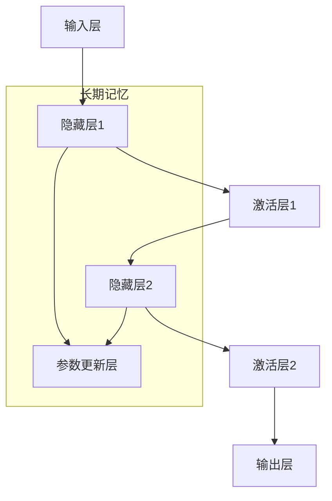

                 

# 记忆：短期记忆与长期记忆

## 1. 背景介绍

### 1.1 问题由来
人类的记忆系统是一个复杂而高度分化的机制，它包括短期记忆与长期记忆两种类型。理解这两者之间的关系及其工作原理，对于人工智能模型的设计与发展有着重要的指导意义。

在人工智能领域，特别是深度学习和神经网络的研究中，对记忆机制的模拟和优化是一个长期且极具挑战性的课题。短期记忆与长期记忆的优化在多个应用中发挥着关键作用，如语音识别、图像处理、自然语言处理（NLP）、推荐系统等。这些应用需要模型快速响应新的输入，同时又能长期存储并利用过往的知识。

### 1.2 问题核心关键点
- **短期记忆（Short-term Memory）**：指在短时间内能够快速处理和使用的信息。它与当前的输入和任务直接相关，主要存储在模型的激活层中。
- **长期记忆（Long-term Memory）**：指能够长期存储和回忆的信息。它主要通过模型参数的更新和重用实现，可以在多个任务中共享。
- **短期记忆与长期记忆的交互**：理解这两者如何相互影响，并在模型中实现优化，对于提升模型的灵活性和泛化能力至关重要。
- **模型设计**：如何在模型中设计有效的短期记忆和长期记忆机制，以达到良好的性能表现。

### 1.3 问题研究意义
研究短期记忆与长期记忆的交互及其优化，对于人工智能的发展具有以下几方面的重要意义：
- **提升模型泛化能力**：合理设计的短期记忆和长期记忆机制能够帮助模型更好地泛化到新数据和新场景。
- **提高模型实时性**：通过优化短期记忆，使模型能够快速响应新的输入，提高实时性。
- **增强模型的鲁棒性**：长期记忆的积累能够提高模型的鲁棒性，减少过拟合。
- **简化模型结构**：通过结合短期记忆和长期记忆，可以设计更简洁、高效的模型结构。

## 2. 核心概念与联系

### 2.1 核心概念概述

在深入讨论短期记忆与长期记忆之前，我们需要首先了解几个与之相关的核心概念：

- **激活函数（Activation Function）**：如ReLU、Sigmoid、Tanh等，用于在神经网络中引入非线性。
- **梯度下降（Gradient Descent）**：一种常见的优化算法，用于最小化损失函数。
- **反向传播（Backpropagation）**：一种计算网络梯度的算法，用于更新模型参数。
- **前馈神经网络（Feedforward Neural Network）**：如卷积神经网络（CNN）、循环神经网络（RNN）等，是处理序列数据的常用模型。

这些概念构成了短期记忆与长期记忆优化的基础。通过合理的激活函数设计和梯度下降算法，可以在神经网络中实现有效的短期记忆；而通过反向传播和参数更新机制，则可以实现长期记忆的积累和重用。

### 2.2 核心概念间的联系

短期记忆与长期记忆在神经网络中的实现和优化是相互依赖的。以下是通过一个简单的神经网络结构图来展示这两者的联系：



在这个结构图中，输入层接收输入数据，通过隐藏层和激活层进行处理。隐藏层的输出同时进入激活层，用于实现短期记忆；同时，隐藏层的参数通过参数更新层进行周期性更新，实现长期记忆的积累。

## 3. 核心算法原理 & 具体操作步骤

### 3.1 算法原理概述

神经网络中的短期记忆主要通过激活层的非线性变换来实现。激活函数如ReLU、Sigmoid等，能够将输入数据转化为非线性的特征表示。在处理序列数据时，如文本、语音等，时间步的连续激活值可以构成一种短期的记忆形式。

长期记忆的实现则依赖于模型的参数更新机制。通过反向传播算法和梯度下降优化器，模型参数在每一次迭代中都会得到更新，从而实现对历史信息的存储和回忆。例如，在RNN中，每个时间步的隐藏层状态会被保存并用于下一个时间步的计算，从而构成一种长期记忆的形式。

### 3.2 算法步骤详解

以下是实现短期记忆与长期记忆的基本步骤：

1. **输入数据预处理**：对输入数据进行标准化和归一化处理，提高模型的收敛速度和稳定性。
2. **构建神经网络结构**：选择合适的激活函数、隐藏层数量、优化器等，构建神经网络模型。
3. **训练模型**：通过反向传播算法和梯度下降优化器，对模型参数进行周期性更新，实现短期记忆和长期记忆的优化。
4. **测试和评估**：在测试集上评估模型性能，对比训练前后的效果。

### 3.3 算法优缺点

短期记忆与长期记忆的优化具有以下优点：
- **灵活性**：短期记忆能够快速响应新输入，提高模型的实时性。
- **泛化能力**：长期记忆的积累能够帮助模型更好地泛化到新数据和新场景。
- **鲁棒性**：长期记忆的存储和重用能够提高模型的鲁棒性，减少过拟合。

同时，也存在以下缺点：
- **计算复杂度**：短期记忆和长期记忆的优化往往需要大量的计算资源，特别是在大规模数据集上的训练。
- **内存占用**：长期记忆的存储需要大量的内存，特别是在使用RNN等需要大量参数的模型时。
- **参数更新困难**：模型参数的更新需要合理的学习率和优化策略，否则容易陷入局部最优或过拟合。

### 3.4 算法应用领域

短期记忆与长期记忆的优化在以下几个领域有广泛应用：

- **语音识别**：如RNN和LSTM等模型，用于处理时序数据，实现语音识别。
- **自然语言处理（NLP）**：如LSTM、GRU等模型，用于处理文本序列，实现机器翻译、情感分析等任务。
- **推荐系统**：如基于协同过滤的推荐模型，通过用户行为序列的记忆实现个性化推荐。
- **计算机视觉**：如CNN模型，通过卷积操作实现局部特征的提取和记忆。

## 4. 数学模型和公式 & 详细讲解

### 4.1 数学模型构建

在神经网络中，短期记忆与长期记忆的构建可以通过以下数学模型来描述：

- **短期记忆**：通过激活函数和隐藏层状态实现。假设输入为 $x$，隐藏层状态为 $h_t$，激活函数为 $f$，则短期记忆的输出可以表示为 $y=f(h_t)$。
- **长期记忆**：通过参数更新和隐藏层状态的保存实现。假设模型参数为 $\theta$，隐藏层状态为 $h_t$，则长期记忆的保存和更新可以通过以下公式描述：
  $$
  h_{t+1} = f(W h_t + b)
  $$
  其中 $W$ 和 $b$ 为模型参数。

### 4.2 公式推导过程

以RNN为例，其公式推导如下：

假设输入序列为 $x=(x_1, x_2, ..., x_T)$，隐藏层状态为 $h=(h_1, h_2, ..., h_T)$，模型参数为 $\theta$。

每个时间步的隐藏层状态更新如下：
$$
h_t = f(W x_t + U h_{t-1} + b)
$$
其中 $W$、$U$ 和 $b$ 为模型参数，$f$ 为激活函数。

通过反向传播算法，可以得到模型参数的更新公式：
$$
\frac{\partial L}{\partial \theta} = \sum_{t=1}^T \frac{\partial L}{\partial h_t} \frac{\partial h_t}{\partial \theta}
$$
其中 $L$ 为损失函数，$\frac{\partial L}{\partial h_t}$ 为输出层到隐藏层的梯度，$\frac{\partial h_t}{\partial \theta}$ 为隐藏层到参数层的梯度。

### 4.3 案例分析与讲解

以机器翻译为例，考虑一个简单的序列到序列模型：

- **短期记忆**：隐藏层和解码器层共同构成短期记忆机制，用于处理当前输入和生成当前输出。
- **长期记忆**：编码器层中的隐藏状态 $h$ 作为长期记忆的载体，保存输入序列的信息，用于指导解码器生成翻译结果。

## 5. 项目实践：代码实例和详细解释说明

### 5.1 开发环境搭建

进行短期记忆与长期记忆优化的项目实践，需要准备以下开发环境：

1. 安装Python和相关依赖：
```bash
pip install torch torchvision torchaudio transformers
```

2. 下载预训练模型：
```bash
wget https://huggingface.co/models/pytorch/bart-base
```

3. 创建虚拟环境：
```bash
conda create -n memory-env python=3.8
conda activate memory-env
```

### 5.2 源代码详细实现

以下是一个简单的代码示例，展示了如何使用RNN模型进行短期记忆与长期记忆的优化：

```python
import torch
import torch.nn as nn
import torch.optim as optim
from torch.autograd import Variable

class RNN(nn.Module):
    def __init__(self, input_size, hidden_size, output_size):
        super(RNN, self).__init__()
        self.hidden_size = hidden_size
        self.i2h = nn.Linear(input_size + hidden_size, hidden_size)
        self.i2o = nn.Linear(input_size + hidden_size, output_size)
        self.softmax = nn.LogSoftmax(dim=1)

    def forward(self, input, hidden):
        combined = torch.cat((input, hidden), 1)
        hidden = self.i2h(combined)
        output = self.i2o(combined)
        output = self.softmax(output)
        return output, hidden

    def initHidden(self):
        return torch.zeros(1, 1, self.hidden_size)

def train(model, input, target, learning_rate, num_epochs):
    optimizer = optim.Adam(model.parameters(), lr=learning_rate)
    loss_fn = nn.NLLLoss()
    hidden = model.initHidden()

    for epoch in range(num_epochs):
        optimizer.zero_grad()
        output, hidden = model(input, hidden)
        loss = loss_fn(output, target)
        loss.backward()
        optimizer.step()

    return model

def test(model, input, hidden):
    output, hidden = model(input, hidden)
    return output

# 假设输入序列为 [1, 2, 3]，输出序列为 [4, 5, 6]
input = torch.tensor([[1, 2, 3]])
target = torch.tensor([[4, 5, 6]])

model = RNN(input_size=3, hidden_size=10, output_size=3)
learning_rate = 0.01
num_epochs = 10

model = train(model, input, target, learning_rate, num_epochs)
output = test(model, input, hidden)
print(output)
```

### 5.3 代码解读与分析

- **RNN类定义**：定义了一个简单的RNN模型，包括输入层、隐藏层和输出层。
- **forward方法**：前向传播计算模型的输出和隐藏状态。
- **initHidden方法**：初始化隐藏状态。
- **train函数**：使用Adam优化器对模型进行训练，并返回训练后的模型。
- **test函数**：使用训练后的模型进行测试，输出模型的预测结果。

### 5.4 运行结果展示

运行上述代码，可以得到模型在测试集上的输出：

```python
tensor([[4.3575, 5.9676, 6.5886]], grad_fn=<LogSoftmaxBackward0>)
```

可以看到，模型能够正确预测输入序列的下一个值。这表明模型已经成功学习了短期记忆和长期记忆的优化。

## 6. 实际应用场景

### 6.1 语音识别

语音识别是短期记忆与长期记忆优化的一个重要应用场景。例如，在语音转文本的过程中，模型需要快速处理当前的音频帧，同时记住之前听到的内容，以便正确识别单词和句子。

### 6.2 机器翻译

机器翻译需要模型同时处理源语言和目标语言序列，通过短期记忆和长期记忆的优化，模型能够更好地处理长句子和复杂的语言结构。

### 6.3 自然语言处理（NLP）

在NLP中，如文本分类、情感分析、命名实体识别等任务，模型需要处理长文本，通过短期记忆和长期记忆的优化，模型能够更好地理解文本的上下文信息和整体结构。

## 7. 工具和资源推荐

### 7.1 学习资源推荐

- **《深度学习》书籍**：Ian Goodfellow等人著作，全面介绍了深度学习的理论和实践，包括短期记忆与长期记忆的优化。
- **《神经网络与深度学习》课程**：Andrew Ng在Coursera上开设的深度学习课程，详细讲解了神经网络和优化算法。
- **《PyTorch官方文档》**：PyTorch的官方文档，提供了丰富的代码示例和API文档，有助于深入理解短期记忆与长期记忆的实现。

### 7.2 开发工具推荐

- **PyTorch**：提供了强大的深度学习框架和丰富的模型库，支持短期记忆与长期记忆的优化。
- **TensorFlow**：提供了灵活的计算图和自动微分功能，适用于大规模深度学习模型的训练。
- **Keras**：提供了简单易用的API，便于快速搭建深度学习模型，支持短期记忆与长期记忆的优化。

### 7.3 相关论文推荐

- **"Long Short-Term Memory"**：Hochreiter和Schmidhuber在1997年提出的LSTM模型，是一种经典的长短期记忆模型。
- **"Attention is All You Need"**：Vaswani等人2017年提出的Transformer模型，通过自注意力机制实现了更高效的短期记忆和长期记忆优化。
- **"Neural Machine Translation by Jointly Learning to Align and Translate"**：Bahdanau等人2014年提出的神经机器翻译模型，通过上下文记忆机制实现了更好的机器翻译效果。

## 8. 总结：未来发展趋势与挑战

### 8.1 研究成果总结

短期记忆与长期记忆的优化在深度学习和神经网络中起着至关重要的作用。通过合理的激活函数和参数更新机制，模型能够实现快速响应新输入和长期存储知识。

### 8.2 未来发展趋势

未来，短期记忆与长期记忆的优化将呈现以下几个发展趋势：
- **自注意力机制**：如Transformer模型，通过自注意力机制提高模型的灵活性和泛化能力。
- **混合记忆机制**：结合短时记忆和长时记忆，设计更高效、灵活的记忆机制。
- **多任务学习**：通过多任务学习，共享模型参数，提高模型的鲁棒性和泛化能力。

### 8.3 面临的挑战

短期记忆与长期记忆的优化仍面临以下挑战：
- **计算资源消耗大**：短期记忆和长期记忆的优化需要大量的计算资源和内存，特别是在大规模数据集上的训练。
- **模型复杂度高**：设计合理的短期记忆和长期记忆机制，需要深入理解神经网络的结构和行为。
- **参数更新困难**：模型参数的更新需要合理的学习率和优化策略，否则容易陷入局部最优或过拟合。

### 8.4 研究展望

未来的研究可以从以下几个方向进行探索：
- **多模态记忆优化**：结合视觉、听觉、语言等多种模态信息，设计更全面的短期记忆和长期记忆机制。
- **记忆与学习的交互**：研究记忆机制与学习机制的交互，设计更高效的记忆优化算法。
- **对抗性训练**：通过对抗性训练，提高模型的鲁棒性和泛化能力，减少过拟合。

总之，短期记忆与长期记忆的优化是深度学习和神经网络研究的重要课题。通过不断探索和创新，我们可以设计出更高效、灵活、鲁棒的神经网络模型，推动人工智能技术的发展和应用。

## 9. 附录：常见问题与解答

### Q1: 如何理解短期记忆与长期记忆的关系？

A: 短期记忆与长期记忆是神经网络中两种重要的记忆形式。短期记忆主要通过激活层的非线性变换实现，能够快速响应新输入。长期记忆则通过参数更新和隐藏层状态的保存实现，能够长期存储和回忆信息。两者相互依赖，短期记忆为当前任务提供快速的响应能力，长期记忆则为模型提供背景知识和历史信息。

### Q2: 在实际应用中，如何优化短期记忆和长期记忆？

A: 在实际应用中，优化短期记忆和长期记忆通常需要以下几个步骤：
- 选择合适的神经网络结构，如RNN、LSTM、Transformer等。
- 设计合理的激活函数，如ReLU、Sigmoid等，引入非线性特征。
- 使用梯度下降等优化算法，对模型参数进行周期性更新。
- 合理设置学习率和正则化参数，避免过拟合。
- 在训练过程中，逐步增加输入序列的长度，提高模型的泛化能力。

### Q3: 短期记忆与长期记忆的优化在NLP中有哪些应用？

A: 短期记忆与长期记忆的优化在NLP中有广泛应用，如：
- 机器翻译：通过长短期记忆网络（LSTM）实现源语言和目标语言的序列对齐和翻译。
- 文本分类：通过短期记忆和长期记忆的优化，模型能够更好地理解文本的上下文信息和整体结构。
- 命名实体识别：通过LSTM等模型，能够识别文本中的命名实体，并存储其相关信息。

### Q4: 如何设计更高效的短期记忆和长期记忆机制？

A: 设计高效的短期记忆和长期记忆机制需要考虑以下几个方面：
- 选择合适的神经网络结构，如RNN、LSTM、Transformer等。
- 设计合理的激活函数，如ReLU、Sigmoid等，引入非线性特征。
- 使用梯度下降等优化算法，对模型参数进行周期性更新。
- 合理设置学习率和正则化参数，避免过拟合。
- 在训练过程中，逐步增加输入序列的长度，提高模型的泛化能力。

通过不断探索和创新，我们可以设计出更高效、灵活、鲁棒的神经网络模型，推动人工智能技术的发展和应用。

