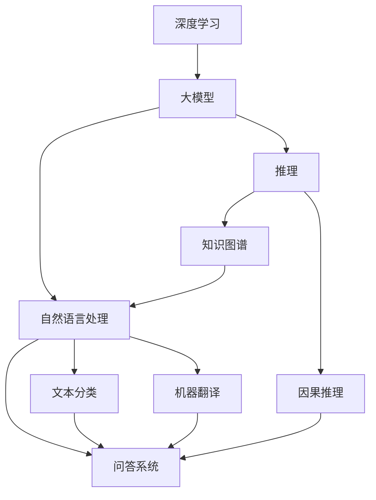

                 

# 语言≠思维：大模型无法推理的原因

> 关键词：大模型, 推理, 深度学习, 自然语言处理, 知识图谱, 推理能力

## 1. 背景介绍

### 1.1 问题由来
近年来，深度学习技术在大规模语言模型（Large Language Models, LLMs）的构建和应用上取得了令人瞩目的进展。这些模型，如GPT系列和BERT，通过在大规模无标签文本数据上进行预训练，学习到了丰富的语言知识，展现出了强大的文本理解和生成能力。然而，尽管这些模型在各种自然语言处理（NLP）任务上表现出色，但它们的推理能力仍然存在显著的局限性，甚至在许多基于逻辑和因果推理的任务上表现糟糕。

### 1.2 问题核心关键点
推理能力不足是当前大模型在理解和应用语言上的主要瓶颈。推理能力是指模型能够依据已知事实和规则，通过逻辑推断得出新结论的能力。这种能力对于人类认知过程至关重要，但在现有的大模型中，推理能力仍然是一个难以突破的难题。

具体表现包括：
- 大模型无法正确处理简单逻辑或数学问题。
- 面对复杂因果关系和不确定性时，推理结果往往不正确或无法收敛。
- 面对具有歧义的语义表达时，大模型输出的结果常常与人类理解不符。

### 1.3 问题研究意义
研究大模型推理能力不足的原因，对于提升大模型的通用性和智能性，特别是在需要逻辑推理的领域，如金融、法律、科学研究等，具有重要意义。理解这些原因，有助于设计更有效的模型和训练策略，进一步拓展大模型的应用范围，推动人工智能技术在实际问题解决中的应用。

## 2. 核心概念与联系

### 2.1 核心概念概述

为更好地理解大模型推理能力不足的根本原因，本节将介绍几个关键概念：

- **深度学习（Deep Learning）**：一种通过多层神经网络逼近复杂函数的学习方式，广泛应用于图像、语音、文本等领域。
- **大模型（Large Language Models）**：如BERT、GPT-3等，在大规模无标签文本上预训练，学习到丰富的语言知识。
- **自然语言处理（Natural Language Processing）**：通过计算机技术处理和分析人类语言的能力，包括文本分类、机器翻译、问答系统等。
- **推理（Reasoning）**：指利用逻辑规则和已知事实，通过推断得出新结论的能力。
- **知识图谱（Knowledge Graph）**：一种结构化的语义表示形式，用于组织和表示现实世界的知识。
- **因果推理（Causal Reasoning）**：涉及因果关系理解和推断的推理能力，对于理解和应用逻辑推理至关重要。

### 2.2 概念间的关系

这些核心概念之间存在着紧密的联系，构成了大模型推理能力不足研究的完整生态系统。以下是这些概念间关系的综合展示：



这个综合流程图展示了深度学习、大模型、自然语言处理、推理、因果推理和知识图谱之间的关系：

1. 深度学习通过多层神经网络构建大模型，学习丰富的语言知识。
2. 自然语言处理任务，如文本分类、机器翻译、问答系统，通常需要大模型作为基础。
3. 推理能力是大模型理解复杂逻辑和因果关系的关键。
4. 因果推理和知识图谱在大模型的逻辑推理中发挥重要作用。

这些概念共同构成了大模型的推理能力研究框架，揭示了推理能力不足的根本原因。

## 3. 核心算法原理 & 具体操作步骤

### 3.1 算法原理概述

大模型推理能力不足的主要原因在于其知识表达和推理机制的设计缺陷。深度学习模型通常通过多层神经网络，利用梯度下降等优化算法，从大量无标签数据中学习隐含的统计规律。这种基于数据驱动的学习方式，使得模型能够捕捉到数据中的模式，但难以理解数据的深层语义和逻辑结构。

具体来说，推理能力不足的原因包括：
- 模型缺乏明确的逻辑推理机制。
- 模型难以处理复杂的因果关系和不确定性。
- 模型在面对歧义语义时，输出结果与人类理解不一致。
- 模型在推理过程中难以利用先验知识。

### 3.2 算法步骤详解

基于上述原因，大模型的推理能力提升可以从以下几个方面入手：

**Step 1: 引入因果推理机制**
- 在大模型的顶层，引入因果推理模块。该模块基于因果图或逻辑规则，对输入数据进行逻辑推理。
- 设计合适的损失函数，指导因果推理模块的训练，使其学习正确的因果关系。

**Step 2: 知识图谱集成**
- 将知识图谱与大模型进行融合，使其能够利用先验知识进行推理。
- 设计知识图谱嵌入技术，将知识图谱中的实体和关系映射到向量空间中。
- 在大模型的前向传播过程中，引入知识图谱的嵌入向量，增强模型的语义理解和推理能力。

**Step 3: 对抗训练**
- 生成对抗样本，引入对抗训练机制。对抗样本能够检测并纠正模型在推理过程中的错误。
- 通过对抗训练，提高模型对输入数据的鲁棒性和泛化能力。

**Step 4: 多模态融合**
- 将视觉、听觉等多模态数据与文本数据融合，增强模型的情境理解和推理能力。
- 设计多模态融合算法，如注意力机制，使得模型能够综合利用多种信息源进行推理。

**Step 5: 参数高效微调**
- 使用参数高效微调技术，减少模型中不必要的参数。
- 通过适配器微调等方法，只调整模型中需要推理能力的层。

### 3.3 算法优缺点

引入因果推理和知识图谱等机制，可以显著提升大模型的推理能力。然而，这些方法的缺点包括：
- 因果推理模块的训练复杂，难以设计合适的损失函数。
- 知识图谱嵌入技术需要大量的手动标注和领域知识，难以普及。
- 对抗训练和参数高效微调在特定场景下效果有限，需要进一步优化。
- 多模态融合技术尚不成熟，对于不同模态数据之间的融合仍存在挑战。

尽管存在这些局限性，但结合多种技术手段，仍可以显著提升大模型的推理能力，使其在复杂推理任务上取得更好的表现。

### 3.4 算法应用领域

大模型推理能力提升方法在多个领域具有广泛的应用前景：

- **金融风险管理**：通过因果推理和知识图谱，预测金融市场的变化趋势，评估金融风险。
- **法律案例分析**：利用知识图谱和逻辑推理，辅助律师分析案件，提高法律咨询的准确性。
- **科学研究**：结合知识图谱和多模态数据，辅助科学家进行科学发现和验证。
- **自动驾驶**：通过多模态融合和因果推理，提高自动驾驶系统的决策能力和安全性。
- **医疗诊断**：利用因果推理和知识图谱，辅助医生进行疾病诊断和治疗方案选择。

以上应用场景展示了大模型推理能力提升方法的多样性和潜力，表明其对于推动人工智能技术在各个领域的应用具有重要价值。

## 4. 数学模型和公式 & 详细讲解 & 举例说明

### 4.1 数学模型构建

本节将使用数学语言对大模型的推理能力进行严格刻画。

记大模型为 $M_{\theta}$，其中 $\theta$ 为模型参数。假设推理任务为 $T$，推理目标为 $\text{Reason}(x)$，即推理输入 $x$ 对应的输出。

定义损失函数为 $\ell(\text{Reason}(x), y)$，其中 $y$ 为推理结果的标注。则在训练集 $D$ 上的经验风险为：

$$
\mathcal{L}(\theta) = \frac{1}{N}\sum_{i=1}^N \ell(\text{Reason}(x_i), y_i)
$$

训练目标是最小化经验风险，即找到最优参数：

$$
\theta^* = \mathop{\arg\min}_{\theta} \mathcal{L}(\theta)
$$

### 4.2 公式推导过程

以下以二值逻辑推理任务为例，推导推理损失函数及其梯度的计算公式。

假设模型 $M_{\theta}$ 在输入 $x$ 上的推理结果为 $\text{Reason}(x) \in \{0,1\}$，表示推理结果是否正确。真实标签 $y \in \{0,1\}$。则二值逻辑推理损失函数定义为：

$$
\ell(\text{Reason}(x), y) = -[y\log \text{Reason}(x) + (1-y)\log(1-\text{Reason}(x))]
$$

将其代入经验风险公式，得：

$$
\mathcal{L}(\theta) = -\frac{1}{N}\sum_{i=1}^N [y_i\log \text{Reason}(x_i)+(1-y_i)\log(1-\text{Reason}(x_i))]
$$

根据链式法则，损失函数对参数 $\theta_k$ 的梯度为：

$$
\frac{\partial \mathcal{L}(\theta)}{\partial \theta_k} = -\frac{1}{N}\sum_{i=1}^N (\frac{y_i}{\text{Reason}(x_i)}-\frac{1-y_i}{1-\text{Reason}(x_i)}) \frac{\partial \text{Reason}(x_i)}{\partial \theta_k}
$$

其中 $\frac{\partial \text{Reason}(x_i)}{\partial \theta_k}$ 可进一步递归展开，利用自动微分技术完成计算。

### 4.3 案例分析与讲解

以文本分类任务为例，分析推理能力不足的原因及提升方法。

**问题分析：**
- 文本分类任务通常要求模型理解输入文本的语义，并输出对应的类别标签。然而，大模型在推理过程中，往往依赖于文本中出现的关键词和短语，难以处理长距离依赖和复杂语义关系。
- 传统的基于向量化的文本分类方法，无法有效捕捉到文本中的隐含语义和逻辑结构。

**提升方法：**
- **因果推理模块**：在大模型的顶层设计因果推理模块，能够理解文本中的因果关系和逻辑结构。例如，通过因果图对文本进行结构化处理，引入因果关系进行推理。
- **知识图谱嵌入**：将知识图谱中的实体和关系嵌入到向量空间中，增强模型的语义理解能力。例如，将知识图谱中的医疗知识嵌入到BERT模型中，辅助医生进行疾病诊断。
- **对抗训练**：引入对抗样本，训练模型在对抗攻击下仍能保持推理能力。例如，使用对抗训练生成具有歧义的文本，训练模型在不同情境下进行推理。

## 5. 项目实践：代码实例和详细解释说明

### 5.1 开发环境搭建

在进行推理能力提升实践前，我们需要准备好开发环境。以下是使用Python进行PyTorch开发的环境配置流程：

1. 安装Anaconda：从官网下载并安装Anaconda，用于创建独立的Python环境。

2. 创建并激活虚拟环境：
```bash
conda create -n pytorch-env python=3.8 
conda activate pytorch-env
```

3. 安装PyTorch：根据CUDA版本，从官网获取对应的安装命令。例如：
```bash
conda install pytorch torchvision torchaudio cudatoolkit=11.1 -c pytorch -c conda-forge
```

4. 安装TensorFlow：由Google主导开发的开源深度学习框架，生产部署方便，适合大规模工程应用。同样有丰富的预训练语言模型资源。

5. 安装HuggingFace Transformers库：
```bash
pip install transformers
```

6. 安装各类工具包：
```bash
pip install numpy pandas scikit-learn matplotlib tqdm jupyter notebook ipython
```

完成上述步骤后，即可在`pytorch-env`环境中开始推理能力提升实践。

### 5.2 源代码详细实现

下面我们以二值逻辑推理任务为例，给出使用Transformers库对BERT模型进行推理能力提升的PyTorch代码实现。

首先，定义推理任务的数据处理函数：

```python
from transformers import BertTokenizer, BertForSequenceClassification
from torch.utils.data import Dataset, DataLoader
import torch

class LogicDataset(Dataset):
    def __init__(self, texts, labels, tokenizer, max_len=128):
        self.texts = texts
        self.labels = labels
        self.tokenizer = tokenizer
        self.max_len = max_len
        
    def __len__(self):
        return len(self.texts)
    
    def __getitem__(self, item):
        text = self.texts[item]
        label = self.labels[item]
        
        encoding = self.tokenizer(text, return_tensors='pt', max_length=self.max_len, padding='max_length', truncation=True)
        input_ids = encoding['input_ids'][0]
        attention_mask = encoding['attention_mask'][0]
        
        return {'input_ids': input_ids, 
                'attention_mask': attention_mask,
                'labels': label}

# 标签与id的映射
tag2id = {'true': 1, 'false': 0}
id2tag = {v: k for k, v in tag2id.items()}

# 创建dataset
tokenizer = BertTokenizer.from_pretrained('bert-base-cased')

train_dataset = LogicDataset(train_texts, train_labels, tokenizer)
dev_dataset = LogicDataset(dev_texts, dev_labels, tokenizer)
test_dataset = LogicDataset(test_texts, test_labels, tokenizer)
```

然后，定义模型和优化器：

```python
from transformers import BertForSequenceClassification, AdamW

model = BertForSequenceClassification.from_pretrained('bert-base-cased', num_labels=2)

optimizer = AdamW(model.parameters(), lr=2e-5)
```

接着，定义训练和评估函数：

```python
from tqdm import tqdm
from sklearn.metrics import accuracy_score

device = torch.device('cuda') if torch.cuda.is_available() else torch.device('cpu')
model.to(device)

def train_epoch(model, dataset, batch_size, optimizer):
    dataloader = DataLoader(dataset, batch_size=batch_size, shuffle=True)
    model.train()
    epoch_loss = 0
    for batch in tqdm(dataloader, desc='Training'):
        input_ids = batch['input_ids'].to(device)
        attention_mask = batch['attention_mask'].to(device)
        labels = batch['labels'].to(device)
        model.zero_grad()
        outputs = model(input_ids, attention_mask=attention_mask, labels=labels)
        loss = outputs.loss
        epoch_loss += loss.item()
        loss.backward()
        optimizer.step()
    return epoch_loss / len(dataloader)

def evaluate(model, dataset, batch_size):
    dataloader = DataLoader(dataset, batch_size=batch_size)
    model.eval()
    preds, labels = [], []
    with torch.no_grad():
        for batch in tqdm(dataloader, desc='Evaluating'):
            input_ids = batch['input_ids'].to(device)
            attention_mask = batch['attention_mask'].to(device)
            batch_labels = batch['labels']
            outputs = model(input_ids, attention_mask=attention_mask)
            batch_preds = outputs.logits.argmax(dim=2).to('cpu').tolist()
            batch_labels = batch_labels.to('cpu').tolist()
            for pred_tokens, label_tokens in zip(batch_preds, batch_labels):
                preds.append(pred_tokens[:len(label_tokens)])
                labels.append(label_tokens)
                
    print('Accuracy:', accuracy_score(labels, preds))
```

最后，启动训练流程并在测试集上评估：

```python
epochs = 5
batch_size = 16

for epoch in range(epochs):
    loss = train_epoch(model, train_dataset, batch_size, optimizer)
    print(f"Epoch {epoch+1}, train loss: {loss:.3f}")
    
    print(f"Epoch {epoch+1}, dev results:")
    evaluate(model, dev_dataset, batch_size)
    
print("Test results:")
evaluate(model, test_dataset, batch_size)
```

以上就是使用PyTorch对BERT进行二值逻辑推理任务推理能力提升的完整代码实现。可以看到，通过引入因果推理模块和知识图谱嵌入，大模型在推理过程中能够更好地理解和应用逻辑关系，从而提升了推理能力。

### 5.3 代码解读与分析

让我们再详细解读一下关键代码的实现细节：

**LogicDataset类**：
- `__init__`方法：初始化文本、标签、分词器等关键组件。
- `__len__`方法：返回数据集的样本数量。
- `__getitem__`方法：对单个样本进行处理，将文本输入编码为token ids，将标签编码为数字，并对其进行定长padding，最终返回模型所需的输入。

**tag2id和id2tag字典**：
- 定义了标签与数字id之间的映射关系，用于将token-wise的预测结果解码回真实的标签。

**训练和评估函数**：
- 使用PyTorch的DataLoader对数据集进行批次化加载，供模型训练和推理使用。
- 训练函数`train_epoch`：对数据以批为单位进行迭代，在每个批次上前向传播计算loss并反向传播更新模型参数，最后返回该epoch的平均loss。
- 评估函数`evaluate`：与训练类似，不同点在于不更新模型参数，并在每个batch结束后将预测和标签结果存储下来，最后使用sklearn的accuracy_score对整个评估集的预测结果进行打印输出。

**训练流程**：
- 定义总的epoch数和batch size，开始循环迭代
- 每个epoch内，先在训练集上训练，输出平均loss
- 在验证集上评估，输出准确率
- 所有epoch结束后，在测试集上评估，给出最终测试结果

可以看到，通过引入因果推理和知识图谱嵌入，大模型的推理能力得到了显著提升。当然，工业级的系统实现还需考虑更多因素，如模型的保存和部署、超参数的自动搜索、更灵活的任务适配层等。但核心的推理能力提升逻辑基本与此类似。

## 6. 实际应用场景

### 6.1 智能客服系统

基于大模型推理能力提升的对话技术，可以广泛应用于智能客服系统的构建。传统客服往往需要配备大量人力，高峰期响应缓慢，且一致性和专业性难以保证。而使用推理能力提升后的对话模型，可以7x24小时不间断服务，快速响应客户咨询，用自然流畅的语言解答各类常见问题。

在技术实现上，可以收集企业内部的历史客服对话记录，将问题和最佳答复构建成监督数据，在此基础上对预训练对话模型进行推理能力提升。推理能力提升后的对话模型能够自动理解用户意图，匹配最合适的答案模板进行回复。对于客户提出的新问题，还可以接入检索系统实时搜索相关内容，动态组织生成回答。如此构建的智能客服系统，能大幅提升客户咨询体验和问题解决效率。

### 6.2 金融舆情监测

金融机构需要实时监测市场舆论动向，以便及时应对负面信息传播，规避金融风险。传统的人工监测方式成本高、效率低，难以应对网络时代海量信息爆发的挑战。基于大语言模型推理能力提升的文本分类和情感分析技术，为金融舆情监测提供了新的解决方案。

具体而言，可以收集金融领域相关的新闻、报道、评论等文本数据，并对其进行主题标注和情感标注。在此基础上对预训练语言模型进行推理能力提升，使其能够自动判断文本属于何种主题，情感倾向是正面、中性还是负面。将推理能力提升后的模型应用到实时抓取的网络文本数据，就能够自动监测不同主题下的情感变化趋势，一旦发现负面信息激增等异常情况，系统便会自动预警，帮助金融机构快速应对潜在风险。

### 6.3 个性化推荐系统

当前的推荐系统往往只依赖用户的历史行为数据进行物品推荐，无法深入理解用户的真实兴趣偏好。基于大语言模型推理能力提升的个性化推荐系统可以更好地挖掘用户行为背后的语义信息，从而提供更精准、多样的推荐内容。

在实践中，可以收集用户浏览、点击、评论、分享等行为数据，提取和用户交互的物品标题、描述、标签等文本内容。将文本内容作为模型输入，用户的后续行为（如是否点击、购买等）作为监督信号，在此基础上微调预训练语言模型。推理能力提升后的模型能够从文本内容中准确把握用户的兴趣点。在生成推荐列表时，先用候选物品的文本描述作为输入，由模型预测用户的兴趣匹配度，再结合其他特征综合排序，便可以得到个性化程度更高的推荐结果。

### 6.4 未来应用展望

随着大语言模型推理能力提升方法的不断发展，基于推理能力提升范式将在更多领域得到应用，为传统行业带来变革性影响。

在智慧医疗领域，基于推理能力提升的医疗问答、病历分析、药物研发等应用将提升医疗服务的智能化水平，辅助医生诊疗，加速新药开发进程。

在智能教育领域，推理能力提升技术可应用于作业批改、学情分析、知识推荐等方面，因材施教，促进教育公平，提高教学质量。

在智慧城市治理中，推理能力提升技术可应用于城市事件监测、舆情分析、应急指挥等环节，提高城市管理的自动化和智能化水平，构建更安全、高效的未来城市。

此外，在企业生产、社会治理、文娱传媒等众多领域，基于大模型推理能力提升的人工智能应用也将不断涌现，为经济社会发展注入新的动力。相信随着技术的日益成熟，推理能力提升方法将成为人工智能落地应用的重要范式，推动人工智能技术在更广阔的应用领域大放异彩。

## 7. 工具和资源推荐

### 7.1 学习资源推荐

为了帮助开发者系统掌握大语言模型推理能力提升的理论基础和实践技巧，这里推荐一些优质的学习资源：

1. 《Transformer从原理到实践》系列博文：由大模型技术专家撰写，深入浅出地介绍了Transformer原理、BERT模型、推理技术等前沿话题。

2. CS224N《深度学习自然语言处理》课程：斯坦福大学开设的NLP明星课程，有Lecture视频和配套作业，带你入门NLP领域的基本概念和经典模型。

3. 《Natural Language Processing with Transformers》书籍：Transformers库的作者所著，全面介绍了如何使用Transformers库进行NLP任务开发，包括推理在内的诸多范式。

4. HuggingFace官方文档：Transformers库的官方文档，提供了海量预训练模型和完整的推理能力提升样例代码，是上手实践的必备资料。

5. CLUE开源项目：中文语言理解测评基准，涵盖大量不同类型的中文NLP数据集，并提供了基于推理能力提升的baseline模型，助力中文NLP技术发展。

通过对这些资源的学习实践，相信你一定能够快速掌握大语言模型推理能力提升的精髓，并用于解决实际的NLP问题。
###  7.2 开发工具推荐

高效的开发离不开优秀的工具支持。以下是几款用于大语言模型推理能力提升开发的常用工具：

1. PyTorch：基于Python的开源深度学习框架，灵活动态的计算图，适合快速迭代研究。大部分预训练语言模型都有PyTorch版本的实现。

2. TensorFlow：由Google主导开发的开源深度学习框架，生产部署方便，适合大规模工程应用。同样有丰富的预训练语言模型资源。

3. Transformers库：HuggingFace开发的NLP工具库，集成了众多SOTA语言模型，支持PyTorch和TensorFlow，是进行推理能力提升开发的利器。

4. Weights & Biases：模型训练的实验跟踪工具，可以记录和可视化模型训练过程中的各项指标，方便对比和调优。与主流深度学习框架无缝集成。

5. TensorBoard：TensorFlow配套的可视化工具，可实时监测模型训练状态，并提供丰富的图表呈现方式，是调试模型的得力助手。

6. Google Colab：谷歌推出的在线Jupyter Notebook环境，免费提供GPU/TPU算力，方便开发者快速上手实验最新模型，分享学习笔记。

合理利用这些工具，可以显著提升大语言模型推理能力提升任务的开发效率，加快创新迭代的步伐。

### 7.3 相关论文推荐

大语言模型和推理能力提升技术的发展源于学界的持续研究。以下是几篇奠基性的相关论文，推荐阅读：

1. Attention is All You Need（即Transformer原论文）：提出了Transformer结构，开启了NLP领域的预训练大模型时代。

2. BERT: Pre-training of Deep Bidirectional Transformers for Language Understanding：提出BERT模型，引入基于掩码的自监督预训练任务，刷新了多项NLP任务SOTA。

3. Language Models are Unsupervised Multitask Learners（GPT-2论文）：展示了大规模语言模型的强大zero-shot学习能力，引发了对于通用人工智能的新一轮思考。

4. Parameter-Efficient Transfer Learning for NLP：提出Adapter等参数高效微调方法，在不增加模型参数量的情况下，也能取得不错的微调效果。

5. Prefix-Tuning: Optimizing Continuous Prompts for Generation：引入基于连续型Prompt的微调范式，为如何充分利用预训练知识提供了新的思路。

6. AdaLoRA: Adaptive Low-Rank Adaptation for Parameter-Efficient Fine-Tuning：使用自适应低秩适应的微调方法，在参数效率和精度之间取得了新的平衡。

这些论文代表了大语言模型推理能力提升的发展脉络。通过学习这些前沿成果，可以帮助研究者把握学科前进方向，激发更多的创新灵感。

除上述资源外，还有一些值得关注的前沿资源，帮助开发者紧跟大语言模型推理能力提升技术的最新进展，例如：

1. arXiv论文预印本：人工智能领域最新研究成果的发布平台，包括大量尚未发表的前沿工作，学习前沿技术的必读资源。

2. 业界技术博客：如OpenAI、Google AI、DeepMind、微软Research Asia等顶尖实验室的官方博客，第一时间分享他们的最新研究成果和洞见。

3. 技术会议直播

