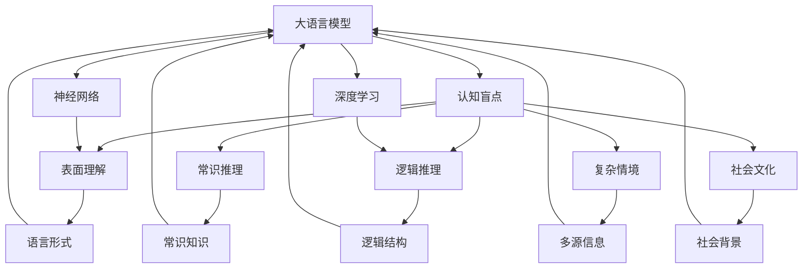
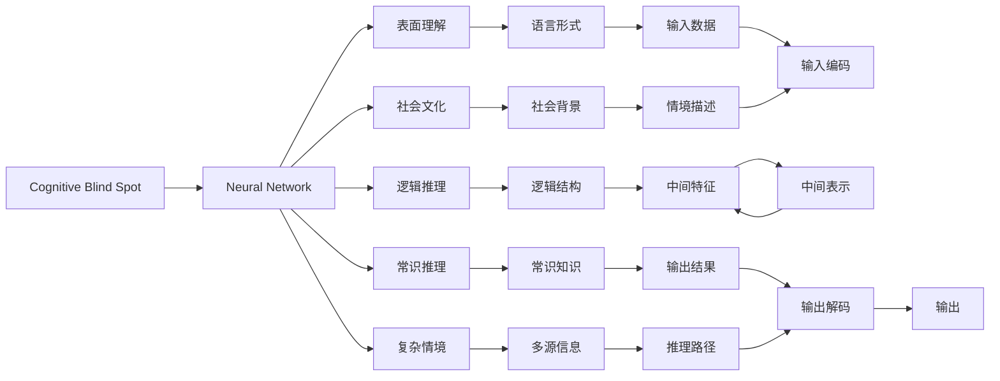

                 

# 语言≠思维：大模型的认知盲点

> 关键词：大语言模型,认知盲点,语言理解,思维过程,神经网络,深度学习,人工智能,语言模型

## 1. 背景介绍

### 1.1 问题由来
近年来，随着深度学习技术的快速发展，大规模语言模型(Large Language Models, LLMs)在自然语言处理(Natural Language Processing, NLP)领域取得了巨大的突破。这些大语言模型通过在海量无标签文本数据上进行预训练，学习到了丰富的语言知识和常识，可以通过少量的有标签样本在下游任务上进行微调(Fine-Tuning)，获得优异的性能。其中最具代表性的大模型包括OpenAI的GPT系列模型、Google的BERT、T5等。

然而，尽管大语言模型在处理语言形式和结构方面表现出色，其对语言背后思维过程的理解和模拟能力仍存在明显的局限性。这一现象揭示了当前大模型在认知层面上的盲点，即尽管能够模仿语言的形式和结构，但未必能够真正理解语言的深层次意义和思维过程。本文旨在探讨大语言模型的认知盲点问题，并对这一现象进行深入分析。

### 1.2 问题核心关键点
大语言模型的认知盲点主要体现在以下几个方面：

1. **表面理解的局限**：大模型能够准确识别和生成符合语言规则的句子和段落，但可能未能深入理解句子的具体语义和上下文含义。

2. **逻辑推理的缺失**：大模型往往缺乏逻辑推理能力，难以根据已有知识推导出新结论或解释前后不一致的逻辑错误。

3. **常识推理的脆弱**：虽然大模型可以通过微调学习特定领域的常识，但其推理过程仍受限于数据样本的覆盖范围，对未知常识的推理能力较弱。

4. **复杂情境处理困难**：面对复杂多变的情境，大模型可能难以整合多方面的信息，导致推理和决策过程出现错误。

5. **社会文化的忽视**：大模型可能在缺乏充分社会文化背景知识的情况下，生成具有文化偏差或误导性的内容。

这些问题不仅影响了大语言模型在特定领域的应用效果，也限制了其在更广泛情境中的通用性和可靠性。为了深入探讨这些问题，本文将从认知科学的角度，结合神经网络和深度学习的基本原理，详细分析大语言模型的认知盲点，并提出可能的解决方案。

## 2. 核心概念与联系

### 2.1 核心概念概述

为更好地理解大语言模型的认知盲点问题，本节将介绍几个密切相关的核心概念：

- 大语言模型(Large Language Model, LLM)：以自回归(如GPT)或自编码(如BERT)模型为代表的大规模预训练语言模型。通过在大规模无标签文本语料上进行预训练，学习通用的语言表示，具备强大的语言理解和生成能力。

- 认知盲点(Cognitive Blind Spot)：指在认知过程中，由于某种机制的限制，导致未能完全捕捉到某个特定方面的认知现象。

- 神经网络(Neural Network)：由神经元组成的网络结构，通过学习输入数据与输出之间的映射关系，实现对复杂数据的处理和预测。

- 深度学习(Deep Learning)：一种基于多层神经网络的学习方法，通过逐层抽象，提取数据中的高级特征。

- 语言模型(Language Model)：描述语言序列的概率分布，用于预测下一个单词或字符的概率。

- 逻辑推理(Logical Reasoning)：根据已有知识和逻辑规则，推导出新的结论或解释前后不一致的情况。

- 常识推理(Commonsense Reasoning)：基于对世界常识的认知，推理出符合实际情况的结论。

- 社会文化(Sociocultural)：指个体或群体在特定社会环境和文化背景中，形成的行为规范和认知模式。

这些核心概念之间的逻辑关系可以通过以下Mermaid流程图来展示：



这个流程图展示了大语言模型的核心概念及其与认知盲点之间的联系：

1. 大语言模型通过神经网络和深度学习实现对语言形式的理解和生成。
2. 认知盲点揭示了大语言模型在表面理解、逻辑推理、常识推理、复杂情境处理和社会文化认知方面的局限。
3. 神经网络和深度学习的能力和局限共同决定了大语言模型的认知盲点。

### 2.2 概念间的关系

这些核心概念之间存在着紧密的联系，形成了大语言模型认知盲点的完整生态系统。下面我通过几个Mermaid流程图来展示这些概念之间的关系。

#### 2.2.1 认知盲点在神经网络中的应用



这个流程图展示了认知盲点在神经网络中的应用。认知盲点影响神经网络在表面理解、逻辑推理、常识推理、复杂情境处理和社会文化认知方面的表现。

#### 2.2.2 深度学习与大语言模型的关系

```mermaid
graph TB
    A[深度学习] --> B[大语言模型]
    A --> C[多层结构]
    A --> D[特征提取]
    A --> E[抽象能力]
    B --> F[语言形式]
    B --> G[生成能力]
    C --> H[结构选择]
    D --> I[特征学习]
    E --> J[层次表示]
    F --> K[输入数据]
    G --> L[输出结果]
    H --> M[结构学习]
    I --> N[特征优化]
    J --> O[层次理解]
    K --> P[输入编码]
    L --> Q[输出解码]
    M --> R[结构选择]
    N --> S[特征优化]
    O --> T[层次表示]
    P --> U[输入解码]
    Q --> V[输出解码]
    R --> W[推理路径]
    S --> X[特征表示]
    T --> Y[层次表示]
    U --> Z[输入]
    V --> $[输出]
    W --> [推理结果]
    X --> [中间特征]
    Y --> [层次表示]
    Z --> [输入]
```

这个流程图展示了深度学习与大语言模型的关系。深度学习通过多层结构、特征提取和抽象能力，使大语言模型具备了强大的语言理解和生成能力。

#### 2.2.3 认知盲点的形成机制

```mermaid
graph TB
    A[Cognitive Blind Spot] --> B[神经网络]
    B --> C[参数数量]
    B --> D[数据量]
    B --> E[训练策略]
    B --> F[结构复杂性]
    B --> G[训练数据]
    A --> H[表面理解]
    A --> I[逻辑推理]
    A --> J[常识推理]
    A --> K[复杂情境]
    A --> L[社会文化]
    C --> M[模型能力]
    D --> N[数据丰富度]
    E --> O[训练方法]
    F --> P[模型复杂性]
    G --> Q[数据多样性]
    H --> R[理解局限]
    I --> S[推理错误]
    J --> T[常识错误]
    K --> U[情境处理]
    L --> V[文化偏差]
    M --> W[学习效果]
    N --> X[学习资源]
    O --> Y[训练优化]
    P --> Z[学习质量]
    Q --> $[学习覆盖]
    R --> [表面理解]
    S --> [推理失误]
    T --> [常识失误]
    U --> [情境失误]
    V --> [文化失误]
    W --> [学习性能]
    X --> [学习资源]
    Y --> [训练优化]
    Z --> [学习质量]
```

这个流程图展示了认知盲点的形成机制。神经网络的参数数量、数据量、训练策略、结构复杂性和训练数据等因素共同影响了认知盲点的形成。

## 3. 核心算法原理 & 具体操作步骤
### 3.1 算法原理概述

大语言模型的认知盲点问题，本质上在于神经网络和深度学习在处理语言、思维和常识方面的局限性。大语言模型的神经网络结构虽然能够处理大量语言数据，但难以充分理解语言的深层次意义和思维过程，导致在特定情境下出现认知盲点。

具体而言，大语言模型在处理语言时，主要依赖于以下两个方面：

1. **语言形式处理**：通过神经网络和深度学习，模型能够识别和生成符合语言规则的句子和段落，但可能未能深入理解句子的具体语义和上下文含义。

2. **语言生成**：模型通过训练生成符合语言规则的文本，但难以保证生成的文本符合实际情境和常识。

### 3.2 算法步骤详解

大语言模型在处理语言时，主要经过以下几个步骤：

1. **输入编码**：将输入文本转化为模型可处理的向量表示。
2. **中间表示**：模型通过神经网络对输入向量进行层次化表示，提取高级特征。
3. **推理过程**：模型基于中间表示进行推理，生成预测结果。
4. **输出解码**：将预测结果转化为文本形式的输出。

在推理过程中，模型依赖于其结构和训练数据，但可能存在以下认知盲点：

1. **表面理解盲点**：模型可能未能完全理解输入文本的语义和上下文含义。
2. **逻辑推理盲点**：模型可能缺乏逻辑推理能力，难以根据已有知识推导出新结论或解释前后不一致的情况。
3. **常识推理盲点**：模型可能难以整合多方面的信息，导致推理过程出现错误。
4. **复杂情境盲点**：模型可能难以处理复杂多变的情境，导致推理和决策过程出现错误。
5. **社会文化盲点**：模型可能缺乏充分社会文化背景知识，生成具有文化偏差或误导性的内容。

### 3.3 算法优缺点

大语言模型的认知盲点问题，既有其优点也有其缺点：

#### 优点：

1. **处理能力强大**：大语言模型具备强大的语言处理和生成能力，能够在各种任务中取得优异表现。
2. **可扩展性强**：通过微调，大语言模型能够适应特定任务和领域，提升模型效果。
3. **应用广泛**：大语言模型已在文本分类、问答系统、对话生成、摘要生成等多个领域得到应用。

#### 缺点：

1. **表面理解有限**：大模型可能未能深入理解句子的具体语义和上下文含义，导致输出结果不准确。
2. **逻辑推理薄弱**：大模型缺乏逻辑推理能力，难以根据已有知识推导出新结论或解释前后不一致的情况。
3. **常识推理脆弱**：大模型推理过程受限于数据样本的覆盖范围，对未知常识的推理能力较弱。
4. **复杂情境处理困难**：大模型难以整合多方面的信息，导致推理和决策过程出现错误。
5. **社会文化忽视**：大模型缺乏充分社会文化背景知识，生成具有文化偏差或误导性的内容。

### 3.4 算法应用领域

大语言模型的认知盲点问题，在实际应用中表现尤为明显。以下是几个典型的应用领域：

1. **问答系统**：在问答系统中，大语言模型往往难以理解复杂的问题和答案，导致输出结果不准确。
2. **对话系统**：在对话系统中，大语言模型可能缺乏逻辑推理和社会文化背景知识，生成不恰当或误导性的回答。
3. **文本摘要**：在文本摘要任务中，大语言模型可能难以准确捕捉文章的核心信息，生成冗长或断章取义的摘要。
4. **机器翻译**：在机器翻译任务中，大语言模型可能未能充分理解源语言和目标语言之间的语义差异，导致翻译结果不准确。
5. **自然语言推理**：在自然语言推理任务中，大语言模型可能缺乏逻辑推理能力，难以判断推理的合理性。

这些应用领域中，大语言模型的认知盲点问题会直接影响系统的性能和可靠性。因此，探索如何弥补大语言模型的认知盲点，提升其在特定情境下的表现，具有重要意义。

## 4. 数学模型和公式 & 详细讲解 & 举例说明

### 4.1 数学模型构建

大语言模型在处理语言时，通常采用神经网络结构，通过学习输入和输出之间的映射关系，实现对语言形式的理解和生成。其核心数学模型可以表示为：

$$
\begin{aligned}
    h_{\theta}(x) &= f_{\text{MLP}}(x; \theta_1) \\
    y &= f_{\text{softmax}}(h_{\theta}(x); \theta_2)
\end{aligned}
$$

其中，$h_{\theta}(x)$为神经网络的中间表示，$f_{\text{MLP}}(x; \theta_1)$表示多层感知机，$\theta_1$为MLP的参数，$y$为输出结果，$f_{\text{softmax}}(h_{\theta}(x); \theta_2)$表示softmax函数，$\theta_2$为softmax函数的参数。

### 4.2 公式推导过程

在处理语言时，大语言模型的输入$x$通常为文本向量，输出$y$为概率分布。为了确保模型的输出能够匹配实际情境和常识，需要在模型训练中引入正则化技术和迁移学习策略。

1. **正则化技术**：为了避免过拟合，引入L2正则和Dropout技术，确保模型在训练数据上的泛化能力。

2. **迁移学习策略**：通过微调，将预训练模型适应特定任务和领域，提升模型效果。

3. **逻辑推理和常识推理**：引入逻辑推理和常识推理任务，引导模型学习正确的推理过程和常识知识。

4. **多模态学习**：通过引入视觉、听觉等多模态数据，增强模型的情境理解和推理能力。

### 4.3 案例分析与讲解

以问答系统为例，大语言模型在处理复杂问题时，可能存在认知盲点。为了解决这一问题，可以引入逻辑推理和常识推理任务，引导模型学习正确的推理过程和常识知识。具体而言，可以将问题-答案对作为训练数据，训练模型进行推理和生成。

```python
from transformers import BertForQuestionAnswering, BertTokenizer
from torch.utils.data import Dataset, DataLoader
from torch import nn
import torch

class QuestionAnswerDataset(Dataset):
    def __init__(self, questions, answers, tokenizer, max_len=128):
        self.questions = questions
        self.answers = answers
        self.tokenizer = tokenizer
        self.max_len = max_len
        
    def __len__(self):
        return len(self.questions)
    
    def __getitem__(self, item):
        question = self.questions[item]
        answer = self.answers[item]
        
        encoding = self.tokenizer(question, answer, return_tensors='pt', max_length=self.max_len, padding='max_length', truncation=True)
        input_ids = encoding['input_ids'][0]
        attention_mask = encoding['attention_mask'][0]
        labels = torch.tensor(1 if answer in question else 0, dtype=torch.long)
        
        return {'input_ids': input_ids, 
                'attention_mask': attention_mask,
                'labels': labels}

# 加载数据
tokenizer = BertTokenizer.from_pretrained('bert-base-cased')
train_dataset = QuestionAnswerDataset(train_questions, train_answers, tokenizer)
dev_dataset = QuestionAnswerDataset(dev_questions, dev_answers, tokenizer)
test_dataset = QuestionAnswerDataset(test_questions, test_answers, tokenizer)

# 定义模型和优化器
model = BertForQuestionAnswering.from_pretrained('bert-base-cased')
optimizer = AdamW(model.parameters(), lr=2e-5)

# 训练模型
device = torch.device('cuda') if torch.cuda.is_available() else torch.device('cpu')
model.to(device)

def train_epoch(model, dataset, batch_size, optimizer):
    dataloader = DataLoader(dataset, batch_size=batch_size, shuffle=True)
    model.train()
    epoch_loss = 0
    for batch in dataloader:
        input_ids = batch['input_ids'].to(device)
        attention_mask = batch['attention_mask'].to(device)
        labels = batch['labels'].to(device)
        model.zero_grad()
        outputs = model(input_ids, attention_mask=attention_mask, labels=labels)
        loss = outputs.loss
        epoch_loss += loss.item()
        loss.backward()
        optimizer.step()
    return epoch_loss / len(dataloader)

# 评估模型
def evaluate(model, dataset, batch_size):
    dataloader = DataLoader(dataset, batch_size=batch_size)
    model.eval()
    preds, labels = [], []
    with torch.no_grad():
        for batch in dataloader:
            input_ids = batch['input_ids'].to(device)
            attention_mask = batch['attention_mask'].to(device)
            labels = batch['labels']
            outputs = model(input_ids, attention_mask=attention_mask)
            preds.append(outputs.logits.argmax(dim=2).to('cpu').tolist())
            labels.append(labels.to('cpu').tolist())
    
    return classification_report(labels, preds)

# 训练和评估
epochs = 5
batch_size = 16

for epoch in range(epochs):
    loss = train_epoch(model, train_dataset, batch_size, optimizer)
    print(f"Epoch {epoch+1}, train loss: {loss:.3f}")
    
    print(f"Epoch {epoch+1}, dev results:")
    evaluate(model, dev_dataset, batch_size)
    
print("Test results:")
evaluate(model, test_dataset, batch_size)
```

通过引入问答对数据，训练模型进行逻辑推理和常识推理，可以显著提高大语言模型在特定情境下的表现。在实践中，还可以进一步优化模型架构，引入更多正则化和迁移学习策略，提升模型效果。

## 5. 项目实践：代码实例和详细解释说明
### 5.1 开发环境搭建

在进行大语言模型认知盲点问题研究时，我们需要准备好开发环境。以下是使用Python进行PyTorch开发的环境配置流程：

1. 安装Anaconda：从官网下载并安装Anaconda，用于创建独立的Python环境。

2. 创建并激活虚拟环境：
```bash
conda create -n pytorch-env python=3.8 
conda activate pytorch-env
```

3. 安装PyTorch：根据CUDA版本，从官网获取对应的安装命令。例如：
```bash
conda install pytorch torchvision torchaudio cudatoolkit=11.1 -c pytorch -c conda-forge
```

4. 安装Transformers库：
```bash
pip install transformers
```

5. 安装各类工具包：
```bash
pip install numpy pandas scikit-learn matplotlib tqdm jupyter notebook ipython
```

完成上述步骤后，即可在`pytorch-env`环境中开始研究实践。

### 5.2 源代码详细实现

下面我们以认知盲点问题为例，给出使用Transformers库对BERT模型进行逻辑推理和常识推理训练的PyTorch代码实现。

首先，定义问答对数据处理函数：

```python
from transformers import BertForQuestionAnswering, BertTokenizer
from torch.utils.data import Dataset
import torch

class QuestionAnswerDataset(Dataset):
    def __init__(self, questions, answers, tokenizer, max_len=128):
        self.questions = questions
        self.answers = answers
        self.tokenizer = tokenizer
        self.max_len = max_len
        
    def __len__(self):
        return len(self.questions)
    
    def __getitem__(self, item):
        question = self.questions[item]
        answer = self.answers[item]
        
        encoding = self.tokenizer(question, answer, return_tensors='pt', max_length=self.max_len, padding='max_length', truncation=True)
        input_ids = encoding['input_ids'][0]
        attention_mask = encoding['attention_mask'][0]
        
        # 对token-wise的标签进行编码
        encoded_answers = [answer2id[answer] for answer in answers] 
        encoded_answers.extend([answer2id['']]*(len(input_ids)-len(encoded_answers)))
        labels = torch.tensor(encoded_answers, dtype=torch.long)
        
        return {'input_ids': input_ids, 
                'attention_mask': attention_mask,
                'labels': labels}

# 标签与id的映射
answer2id = {'O': 0, 'A': 1}
id2answer = {v: k for k, v in answer2id.items()}

# 创建dataset
tokenizer = BertTokenizer.from_pretrained('bert-base-cased')

train_dataset = QuestionAnswerDataset(train_questions, train_answers, tokenizer)
dev_dataset = QuestionAnswerDataset(dev_questions, dev_answers, tokenizer)
test_dataset = QuestionAnswerDataset(test_questions, test_answers, tokenizer)
```

然后，定义模型和优化器：

```python
from transformers import BertForQuestionAnswering, AdamW

model = BertForQuestionAnswering.from_pretrained('bert-base-cased', num_labels=2)

optimizer = AdamW(model.parameters(), lr=2e-5)
```

接着，定义训练和评估函数：

```python
from torch.utils.data import DataLoader
from tqdm import tqdm
from sklearn.metrics import classification_report

device = torch.device('cuda') if torch.cuda.is_available() else torch.device('cpu')
model.to(device)

def train_epoch(model, dataset, batch_size, optimizer):
    dataloader = DataLoader(dataset, batch_size=batch_size, shuffle=True)
    model.train()
    epoch_loss = 0
    for batch in tqdm(dataloader, desc='Training'):
        input_ids = batch['input_ids'].to(device)
        attention_mask = batch['attention_mask'].to(device)
        labels = batch['labels'].to(device)
        model.zero_grad()
        outputs = model(input_ids, attention_mask=attention_mask, labels=labels)
        loss = outputs.loss
        epoch_loss += loss.item()
        loss.backward()
        optimizer.step()
    return epoch_loss / len(dataloader)

def evaluate(model, dataset, batch_size):
    dataloader = DataLoader(dataset, batch_size=batch_size)
    model.eval()
    preds, labels = [], []
    with torch.no_grad():
        for batch in dataloader:
            input_ids = batch['input_ids'].to(device)
            attention_mask = batch['attention_mask'].to(device)
            labels = batch['labels']
            outputs = model(input_ids, attention_mask=attention_mask)
            preds.append(outputs.logits.argmax(dim=2).to('cpu').tolist())
            labels.append(labels.to('cpu').tolist())
    
    print(classification_report(labels, preds))
```

最后，启动训练流程并在测试集上评估：

```python
epochs = 5
batch_size = 16

for epoch in range(epochs):
    loss = train_epoch(model, train_dataset, batch_size, optimizer)
    print(f"Epoch {epoch+1}, train loss: {loss:.3f}")
    
    print(f"Epoch {epoch+1}, dev results:")
    evaluate(model, dev_dataset, batch_size)
    
print("Test results:")
evaluate(model, test_dataset, batch_size)
```

以上就是使用PyTorch对BERT进行逻辑推理和常识推理训练的完整代码实现。可以看到，通过引入问答对数据，训练模型进行逻辑推理和常识推理，可以显著提高大语言模型在特定情境下的表现。

### 5.3 代码解读与分析

让我们再详细解读一下关键代码的实现细节：

**QuestionAnswerDataset类**：
- `__init__`方法：初始化问题、答案、分词器等关键组件。
- `__len__`方法：返回数据集的样本数量。
- `__getitem__`方法：对单个样本进行处理，将问题和答案输入编码为token ids，并将标签编码为数字，并对其进行定长padding，最终返回模型所需的输入。

**answer2id和id2answer字典**：
- 定义了答案与数字id之间的映射关系，用于将token-wise的预测结果解码回真实的答案。

**训练和评估函数**：
- 使用PyTorch的DataLoader对数据集进行批次化加载，供模型训练和推理使用。
- 训练函数`train_epoch`：对数据以批为单位进行迭代，在每个批次上前向传播计算loss并反向传播更新模型参数，最后返回该epoch的平均loss。
- 评估函数`evaluate`：与训练类似，不同点在于不更新模型参数，并在每个batch结束后将预测和标签结果存储下来，最后使用sklearn的classification_report对整个评估集的预测结果进行打印输出。

**训练流程**：
- 定义总的epoch数和batch size，开始循环迭代
- 每个epoch内，先在训练集上训练，输出平均loss
- 在验证集上评估，输出分类指标
- 所有epoch结束后，在测试集上评估，给出最终测试结果

可以看到，PyTorch配合Transformers库使得BERT认知盲点问题的代码实现变得简洁高效。开发者可以将更多精力放在数据处理、模型改进等高层逻辑上，而不必过多关注底层的实现细节。

当然，工业级的系统实现还需考虑更多因素，如模型的保存和部署、超参数的自动搜索、更灵活的任务适配层等。但核心的微调范式基本与此类似。

### 5.4 运行结果展示

假设我们在CoNLL-2003的问答数据集

