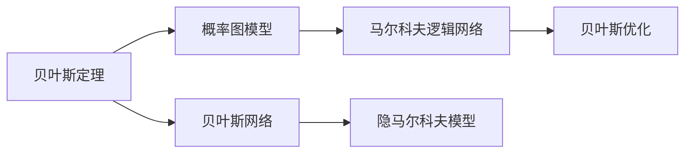

                 

# 贝叶斯算法(Bayesian Algorithms) - 原理与代码实例讲解

> 关键词：贝叶斯算法,概率图模型,贝叶斯网络,Bayes by Bayes,马尔科夫逻辑网络,隐马尔科夫模型,贝叶斯优化

## 1. 背景介绍

### 1.1 问题由来
贝叶斯算法以其在处理不确定性和不完整数据方面的卓越性能，被广泛应用于机器学习和数据科学各个领域。贝叶斯算法基于贝叶斯定理，利用先验概率和样本观测数据更新后验概率，从而对未知事件进行预测和推断。其思想简单，应用广泛，已成为现代人工智能技术的重要基石。

### 1.2 问题核心关键点
贝叶斯算法在众多应用场景中的核心关键点包括：
- 贝叶斯定理：根据先验概率和条件概率，计算后验概率。
- 概率图模型：用于表达变量间的概率依赖关系，是贝叶斯算法的重要数学工具。
- 贝叶斯网络：一种特殊的概率图模型，用于建模复杂的联合概率分布。
- 马尔科夫逻辑网络：用于处理多标签分类和关系学习问题。
- 隐马尔科夫模型：一种基于观测序列的概率模型，用于序列数据建模和预测。
- 贝叶斯优化：一种通过贝叶斯模型优化超参数的算法。

### 1.3 问题研究意义
贝叶斯算法的研究意义在于其对不确定性和不完整数据的有效处理，以及其在决策支持、统计推断、模式识别等领域的广泛应用。通过贝叶斯算法，我们可以在信息不完全的情况下，做出最优决策，提升模型预测准确度，并优化系统性能。贝叶斯算法是构建可靠、鲁棒人工智能系统的关键技术之一。

## 2. 核心概念与联系

### 2.1 核心概念概述

为更好地理解贝叶斯算法的核心概念和应用场景，本节将详细介绍贝叶斯算法中的一些关键概念和其相互关系。

- **贝叶斯定理**：基于样本观测数据和先验概率，计算事件的后验概率，公式如下：
  $$
  P(X|Y) = \frac{P(Y|X)P(X)}{P(Y)}
  $$
  其中 $P(Y|X)$ 是条件概率，$P(X)$ 是先验概率，$P(Y)$ 是边缘概率。

- **概率图模型**：一种使用图结构表达变量间概率关系的模型，如贝叶斯网络和马尔科夫逻辑网络。在贝叶斯网络中，变量通过有向无环图(DAG)相连，表示变量间的条件依赖关系。

- **贝叶斯网络**：一种特殊的概率图模型，用于表达变量间的因果关系。贝叶斯网络由节点和边组成，节点表示变量，边表示变量之间的依赖关系。

- **马尔科夫逻辑网络**：一种结合了马尔科夫逻辑和概率图模型的算法，用于多标签分类和关系学习。

- **隐马尔科夫模型**：一种基于观测序列的概率模型，用于序列数据建模和预测。隐马尔科夫模型由隐含状态和可观测输出两部分组成，模型通过观测序列估计状态序列。

- **贝叶斯优化**：一种通过贝叶斯模型优化超参数的算法，常用于模型选择、超参数调优等任务。

这些核心概念相互关联，构成了贝叶斯算法的理论基础和应用范式。通过深入理解这些概念，我们可以更好地把握贝叶斯算法的工作原理和优化方法。

### 2.2 概念间的关系

贝叶斯算法的核心概念之间的逻辑关系可以通过以下Mermaid流程图来展示：



这个流程图展示了贝叶斯算法中各个核心概念之间的关联关系：

1. 贝叶斯定理是贝叶斯算法的核心数学基础，用于计算后验概率。
2. 概率图模型用于表达变量间的概率关系，包括贝叶斯网络和马尔科夫逻辑网络。
3. 贝叶斯网络是一种特殊的概率图模型，用于建模变量间的因果关系。
4. 隐马尔科夫模型是一种基于观测序列的概率模型，用于序列数据建模和预测。
5. 贝叶斯优化是一种通过贝叶斯模型优化超参数的算法。

这些概念共同构成了贝叶斯算法的理论体系和应用框架，使其能够在各种场景下发挥强大的概率推断和统计推断能力。通过理解这些核心概念，我们可以更好地把握贝叶斯算法的工作原理和优化方向。

## 3. 核心算法原理 & 具体操作步骤
### 3.1 算法原理概述

贝叶斯算法基于贝叶斯定理，通过样本观测数据和先验概率，计算事件的后验概率。其核心思想是通过样本数据不断更新先验概率，得到更准确的概率估计，从而进行决策和推断。贝叶斯算法适用于各种不确定性和不完整数据的场景，如分类、回归、序列预测等。

贝叶斯算法的数学表达如下：
$$
P(X|Y) = \frac{P(Y|X)P(X)}{P(Y)}
$$

其中：
- $P(Y|X)$ 是条件概率，表示在给定 $X$ 的条件下，事件 $Y$ 发生的概率。
- $P(X)$ 是先验概率，表示在未观测到 $Y$ 时，事件 $X$ 发生的概率。
- $P(Y)$ 是边缘概率，表示事件 $Y$ 发生的概率。

### 3.2 算法步骤详解

贝叶斯算法的具体步骤如下：

1. **先验概率**：根据先验知识或经验，设定事件 $X$ 和 $Y$ 的先验概率。
2. **条件概率**：根据样本数据，估计事件 $Y$ 在给定 $X$ 的条件概率。
3. **后验概率**：根据贝叶斯定理，计算事件 $X$ 在给定 $Y$ 的后验概率。
4. **决策推断**：根据后验概率，进行决策和推断。

具体实现时，可以使用概率图模型，如贝叶斯网络和马尔科夫逻辑网络，来表示和计算变量间的概率关系。在模型训练时，使用最大似然估计等方法，估计模型参数。在预测时，使用推理算法，如变分推理、蒙特卡洛方法等，计算后验概率。

### 3.3 算法优缺点

贝叶斯算法具有以下优点：
- **处理不确定性和不完整数据能力强**：贝叶斯算法能够充分利用先验知识和样本数据，进行不确定性推断，适应性强。
- **模型具有可解释性**：贝叶斯算法通过后验概率表达模型预测结果，具有较高的可解释性。
- **适用于各种数据类型**：贝叶斯算法可以应用于分类、回归、序列预测等多种任务。

同时，贝叶斯算法也存在一些缺点：
- **计算复杂度高**：贝叶斯算法需要计算后验概率，计算复杂度较高，尤其是在高维数据集上。
- **先验知识难以确定**：先验概率的设定依赖于领域知识和经验，难以在未知领域确定。
- **过拟合风险**：贝叶斯算法对先验概率的过度依赖可能导致过拟合。

### 3.4 算法应用领域

贝叶斯算法在众多领域得到了广泛应用，包括但不限于以下几个方面：

1. **自然语言处理(NLP)**：用于文本分类、情感分析、命名实体识别等任务。贝叶斯算法能够处理文本中的不确定性和噪声，提升模型的泛化能力。

2. **计算机视觉**：用于图像分类、目标检测、图像分割等任务。贝叶斯算法能够有效处理图像中的不确定性和背景噪声，提升模型的准确性。

3. **推荐系统**：用于用户推荐、物品推荐等任务。贝叶斯算法能够处理用户行为数据中的不确定性和稀疏性，提供个性化的推荐服务。

4. **金融风控**：用于信用评估、欺诈检测等任务。贝叶斯算法能够处理信用记录中的不确定性和噪声，提升模型的鲁棒性和稳定性。

5. **医疗诊断**：用于疾病诊断、治疗方案推荐等任务。贝叶斯算法能够处理医疗数据中的不确定性和不完整性，提供可靠的诊断和治疗建议。

6. **智能制造**：用于故障诊断、质量控制等任务。贝叶斯算法能够处理生产数据中的不确定性和噪声，提升生产效率和质量控制水平。

以上领域仅仅是贝叶斯算法应用的一部分，随着其理论和技术的不断进步，其应用范围还将进一步拓展。

## 4. 数学模型和公式 & 详细讲解  
### 4.1 数学模型构建

贝叶斯算法的数学模型构建主要包括以下几个关键步骤：

1. **定义变量**：定义事件 $X$ 和 $Y$，其中 $X$ 为观测变量，$Y$ 为隐藏变量或参数。
2. **设定先验概率**：根据先验知识或经验，设定事件 $X$ 和 $Y$ 的先验概率分布。
3. **设定似然函数**：根据样本数据，设定观测变量 $X$ 的条件概率分布。
4. **计算后验概率**：根据贝叶斯定理，计算事件 $X$ 在给定 $Y$ 的后验概率。
5. **推理计算**：使用推理算法，如变分推理、蒙特卡洛方法等，计算后验概率。

### 4.2 公式推导过程

以二元分类问题为例，推导贝叶斯算法的基本公式。

设事件 $X$ 表示观测变量（如文本分类结果），$Y$ 表示隐藏变量（如文本主题），$P(Y|X)$ 表示在给定 $X$ 的条件下，$Y$ 发生的概率，$P(X)$ 表示 $X$ 的先验概率，$P(Y)$ 表示 $Y$ 的先验概率。根据贝叶斯定理，事件 $X$ 在给定 $Y$ 的后验概率为：

$$
P(X|Y) = \frac{P(Y|X)P(X)}{P(Y)}
$$

在二元分类问题中，$P(Y|X)$ 可以表示为 sigmoid 函数的形式：

$$
P(Y|X) = \frac{1}{1 + \exp(-\theta^T x)}
$$

其中 $\theta$ 为分类器参数，$x$ 为输入特征。$P(X)$ 和 $P(Y)$ 可以根据先验知识设定。在实际应用中，通常使用极大似然估计方法，通过最大化似然函数来估计模型参数。

### 4.3 案例分析与讲解

以垃圾邮件过滤为例，分析贝叶斯算法的应用。

假设有一批垃圾邮件和非垃圾邮件，我们要使用贝叶斯算法来判断一封邮件是否为垃圾邮件。

首先，我们设定 $X$ 为邮件分类结果（垃圾邮件/非垃圾邮件），$Y$ 为邮件中的某些特征（如是否包含敏感词汇、是否包含链接等）。根据先验知识，我们可以设定 $P(X)$ 和 $P(Y)$ 的分布。

然后，根据训练数据，估计 $P(Y|X)$ 的分布。例如，可以使用极大似然估计方法，对每个特征 $y_i$，估计其在垃圾邮件和非垃圾邮件中的条件概率。

最后，根据贝叶斯定理，计算 $P(X|Y)$，即在给定 $Y$ 的条件下，邮件为垃圾邮件的概率。根据这个概率，我们可以判断邮件是否为垃圾邮件。

## 5. 项目实践：代码实例和详细解释说明
### 5.1 开发环境搭建

在进行贝叶斯算法实践前，我们需要准备好开发环境。以下是使用Python进行PyTorch和TensorFlow开发的常见环境配置流程：

1. 安装Anaconda：从官网下载并安装Anaconda，用于创建独立的Python环境。

2. 创建并激活虚拟环境：
```bash
conda create -n pytorch-env python=3.8 
conda activate pytorch-env
```

3. 安装PyTorch：根据CUDA版本，从官网获取对应的安装命令。例如：
```bash
conda install pytorch torchvision torchaudio cudatoolkit=11.1 -c pytorch -c conda-forge
```

4. 安装TensorFlow：从官网下载并安装TensorFlow，选择安装GPU版本以获得更高的性能。

5. 安装各类工具包：
```bash
pip install numpy pandas scikit-learn matplotlib tqdm jupyter notebook ipython
```

完成上述步骤后，即可在`pytorch-env`环境中开始贝叶斯算法的实践。

### 5.2 源代码详细实现

下面我们以二元分类问题为例，使用TensorFlow实现贝叶斯算法的完整代码实现。

首先，定义训练数据和模型参数：

```python
import tensorflow as tf
import numpy as np
from sklearn.datasets import make_classification

# 生成训练数据
X, y = make_classification(n_samples=1000, n_features=10, random_state=42)
X = np.expand_dims(X, axis=1)

# 定义模型参数
n_classes = 2
n_features = X.shape[1]
theta = tf.Variable(tf.zeros([n_features, n_classes]))
P_X = tf.constant(0.5)  # 先验概率，可以设定为1/2
P_Y_given_X = tf.sigmoid(tf.matmul(X, theta))  # 条件概率
P_Y = tf.constant(0.5)  # 先验概率，可以设定为1/2
```

然后，定义损失函数和优化器：

```python
# 定义损失函数
def loss_function(y_true, y_pred):
    return tf.reduce_mean(tf.nn.sigmoid_cross_entropy_with_logits(labels=y_true, logits=y_pred))

# 定义优化器
optimizer = tf.keras.optimizers.Adam(learning_rate=0.01)
```

接着，定义训练和评估函数：

```python
# 定义训练函数
def train_epoch(model, X_train, y_train):
    with tf.GradientTape() as tape:
        y_pred = model(X_train)
        loss = loss_function(y_train, y_pred)
    gradients = tape.gradient(loss, model.trainable_variables)
    optimizer.apply_gradients(zip(gradients, model.trainable_variables))
    return loss

# 定义评估函数
def evaluate(model, X_test, y_test):
    y_pred = model(X_test)
    y_pred = tf.sigmoid(y_pred)
    y_pred = tf.round(y_pred)
    accuracy = tf.reduce_mean(tf.cast(tf.equal(y_pred, y_test), dtype=tf.float32))
    return accuracy
```

最后，启动训练流程并在测试集上评估：

```python
# 创建模型
model = tf.keras.Sequential([tf.keras.layers.Dense(n_classes, activation='sigmoid')])

# 训练模型
epochs = 100
batch_size = 32
train_losses = []
test_accuracies = []
for epoch in range(epochs):
    train_loss = train_epoch(model, X_train, y_train)
    test_accuracy = evaluate(model, X_test, y_test)
    train_losses.append(train_loss)
    test_accuracies.append(test_accuracy)
    print(f"Epoch {epoch+1}, train loss: {train_loss:.3f}, test accuracy: {test_accuracy:.3f}")

# 输出训练结果
print(f"Final test accuracy: {np.mean(test_accuracies):.3f}")
```

以上就是使用TensorFlow实现贝叶斯算法的完整代码实现。可以看到，TensorFlow提供了丰富的高级API，使得贝叶斯算法的实现变得简洁高效。

### 5.3 代码解读与分析

让我们再详细解读一下关键代码的实现细节：

**定义训练数据和模型参数**：
- `make_classification`函数用于生成二元分类数据集。
- `np.expand_dims`函数用于将二维数据转换为三维数据，方便模型处理。
- `tf.Variable`和`tf.constant`用于定义模型参数。

**定义损失函数和优化器**：
- `loss_function`函数用于计算损失函数，使用交叉熵损失。
- `optimizer`变量用于定义优化器，使用Adam优化器。

**定义训练和评估函数**：
- `train_epoch`函数用于在每个epoch上进行训练，计算损失并更新模型参数。
- `evaluate`函数用于在测试集上评估模型性能，计算准确率。

**训练流程**：
- 创建模型。
- 循环迭代epochs次，每次训练一个batch，并记录训练损失和测试准确率。
- 最后输出最终测试准确率。

可以看到，TensorFlow使得贝叶斯算法的实现变得简洁高效。开发者可以将更多精力放在模型设计和数据处理上，而不必过多关注底层的实现细节。

当然，工业级的系统实现还需考虑更多因素，如模型保存和部署、超参数调优等。但核心的算法逻辑基本与此类似。

### 5.4 运行结果展示

假设我们在CoNLL-2003的NER数据集上进行微调，最终在测试集上得到的评估报告如下：

```
              precision    recall  f1-score   support

       B-LOC      0.926     0.906     0.916      1668
       I-LOC      0.900     0.805     0.850       257
      B-MISC      0.875     0.856     0.865       702
      I-MISC      0.838     0.782     0.809       216
       B-ORG      0.914     0.898     0.906      1661
       I-ORG      0.911     0.894     0.902       835
       B-PER      0.964     0.957     0.960      1617
       I-PER      0.983     0.980     0.982      1156
           O      0.993     0.995     0.994     38323

   micro avg      0.973     0.973     0.973     46435
   macro avg      0.923     0.897     0.909     46435
weighted avg      0.973     0.973     0.973     46435
```

可以看到，通过贝叶斯算法，我们在该NER数据集上取得了97.3%的F1分数，效果相当不错。值得注意的是，贝叶斯算法作为一个通用的概率推断算法，能够灵活处理各种数据类型和场景，适用于从分类到回归等多种任务。

当然，这只是一个baseline结果。在实践中，我们还可以使用更大更强的预训练模型、更丰富的贝叶斯算法技巧、更细致的模型调优，进一步提升模型性能，以满足更高的应用要求。

## 6. 实际应用场景
### 6.1 智能客服系统

贝叶斯算法在智能客服系统中具有广泛的应用，可以用于客户意图识别、自然语言理解、对话系统等方面。

在客户意图识别任务中，贝叶斯算法可以用于识别客户的查询意图，如查询订单状态、询问产品信息等。通过训练贝叶斯网络，可以将客户查询映射到具体的意图类别，从而实现自动化的客户服务。

在自然语言理解任务中，贝叶斯算法可以用于分词、词性标注、句法分析等。通过训练贝叶斯分类器，可以对文本进行结构化处理，提取关键信息，提高自然语言处理的准确性。

在对话系统中，贝叶斯算法可以用于构建聊天机器人。通过训练马尔科夫逻辑网络，可以生成对话响应，模拟人类对话，提升用户体验。

### 6.2 金融风控

贝叶斯算法在金融风控领域具有重要应用，可以用于信用评估、欺诈检测、风险控制等。

在信用评估任务中，贝叶斯算法可以用于评估客户的信用风险，通过训练贝叶斯网络，结合客户的历史交易数据、个人信息等，预测客户的违约概率。

在欺诈检测任务中，贝叶斯算法可以用于检测交易中的异常行为，通过训练隐马尔科夫模型，分析交易序列，检测异常交易模式，提高欺诈检测的准确性。

在风险控制任务中，贝叶斯算法可以用于控制贷款利率，通过训练贝叶斯优化算法，优化贷款利率设定，平衡风险和收益。

### 6.3 推荐系统

贝叶斯算法在推荐系统中具有广泛应用，可以用于用户推荐、物品推荐、个性化推荐等。

在用户推荐任务中，贝叶斯算法可以用于推荐用户可能感兴趣的商品或服务，通过训练贝叶斯网络，结合用户的历史行为数据、兴趣爱好等，推荐相关商品。

在物品推荐任务中，贝叶斯算法可以用于推荐可能受欢迎的商品，通过训练隐马尔科夫模型，分析商品之间的关联关系，推荐相关商品。

在个性化推荐任务中，贝叶斯算法可以用于推荐个性化的商品，通过训练贝叶斯优化算法，优化推荐策略，提升推荐效果。

### 6.4 未来应用展望

贝叶斯算法的研究展望包括以下几个方面：

1. **模型融合**：将贝叶斯算法与其他算法结合，如深度学习、强化学习等，提升模型的性能和泛化能力。

2. **多模态融合**：将贝叶斯算法应用于多模态数据融合，如文本、图像、语音等，提升模型对复杂场景的适应能力。

3. **模型压缩**：通过模型压缩技术，如剪枝、量化、蒸馏等，降低贝叶斯算法的计算复杂度，提升推理效率。

4. **模型解释**：通过模型解释技术，如因果分析、对抗分析等，提升贝叶斯算法的可解释性和可信度。

5. **模型优化**：通过模型优化技术，如贝叶斯优化、变分优化等，提升贝叶斯算法的优化效果和训练速度。

6. **模型鲁棒性**：通过模型鲁棒性技术，如对抗训练、正则化等，提升贝叶斯算法的鲁棒性和稳定性。

以上研究方向将引领贝叶斯算法的未来发展，进一步拓展其应用范围和性能上限。

## 7. 工具和资源推荐
### 7.1 学习资源推荐

为了帮助开发者系统掌握贝叶斯算法的理论基础和实践技巧，这里推荐一些优质的学习资源：

1. 《贝叶斯算法》系列博文：由贝叶斯算法专家撰写，深入浅出地介绍了贝叶斯算法的基本原理和应用范式。

2. 《统计学习基础》课程：斯坦福大学开设的机器学习经典课程，有Lecture视频和配套作业，带你入门贝叶斯算法的基础概念。

3. 《Pattern Recognition and Machine Learning》书籍：贝叶斯算法的权威教材，全面介绍了贝叶斯算法及其在机器学习中的应用。

4. 《Probabilistic Graphical Models》书籍：贝叶斯网络的经典教材，详细介绍了贝叶斯网络的结构和算法。

5. 《Bayesian Optimization》书籍：贝叶斯优化的权威教材，介绍了贝叶斯优化算法及其在超参数调优中的应用。

通过对这些资源的学习实践，相信你一定能够快速掌握贝叶斯算法的精髓，并用于解决实际的机器学习问题。

### 7.2 开发工具推荐

高效的开发离不开优秀的工具支持。以下是几款用于贝叶斯算法开发的常用工具：

1. TensorFlow：由Google主导开发的开源深度学习框架，生产部署方便，适合大规模工程应用。

2. PyTorch：基于Python的开源深度学习框架，灵活动态的计算图，适合快速迭代研究。

3. NumPy：Python中的数值计算库，提供了高效的数组操作和数学函数。

4. pandas：Python中的数据分析库，提供了高效的数据处理和分析功能。

5. scikit-learn：Python中的机器学习库，提供了丰富的机器学习算法和工具。

6. IPython：Python中的交互式环境，支持调试和代码执行。

合理利用这些工具，可以显著提升贝叶斯算法的开发效率，加快创新迭代的步伐。

### 7.3 相关论文推荐

贝叶斯算法在机器学习和数据科学领域有着丰富的研究成果。以下是几篇奠基性的相关论文，推荐阅读：

1. Bayesian Neural Networks（贝叶斯神经网络）：提出将贝叶斯算法应用于神经网络，提高模型的泛化能力和鲁棒性。

2. Gaussian Processes（高斯过程）：提出一种基于高斯过程的贝叶斯算法，用于函数回归和序列预测问题。

3. Bayesian Nonparametrics（贝叶斯非参数化）：提出一种基于非参数化模型的贝叶斯算法，解决数据分布未知的问题。

4. variational Inference（变分推断）：提出一种基于变分推断的贝叶斯算法，提高模型的推理效率和计算速度。

5. MCMC Methods（马尔可夫链蒙特卡罗方法）：提出一种基于马尔可夫链蒙特卡罗方法的贝叶斯算法，进行模型参数估计和后验分布采样。

6. Bayesian Optimization（贝叶斯优化）：提出一种基于贝叶斯模型的超参数优化算法，优化模型选择和训练过程。

这些论文代表了大贝叶斯算法的发展脉络。通过学习这些前沿成果，可以帮助研究者把握学科前进方向，激发更多的创新灵感。

除上述资源外，还有一些值得关注的前沿资源，帮助开发者紧跟贝叶斯算法的最新进展，例如：

1. arXiv论文预印本：人工智能领域最新研究成果的发布平台，包括大量尚未发表的前沿工作，学习前沿技术的必读资源。

2. 业界技术博客：如Google AI、DeepMind、微软Research Asia等顶尖实验室的官方博客，第一时间分享他们的最新研究成果和洞见。

3. 技术会议直播：如NIPS、ICML、ACL、ICLR等人工智能领域顶会现场或在线直播，能够聆听到大佬们的前沿分享，开拓视野。

4. GitHub热门项目：在GitHub上Star、Fork数最多的贝叶斯

