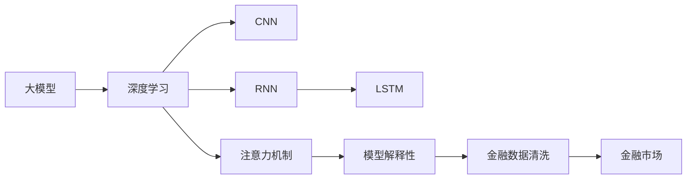
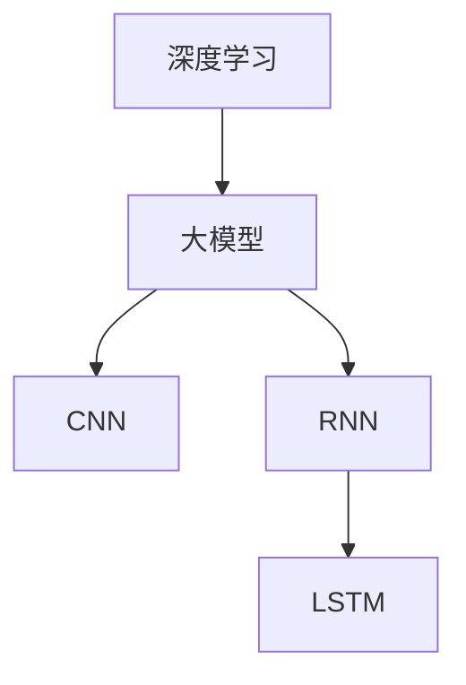
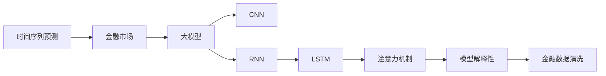
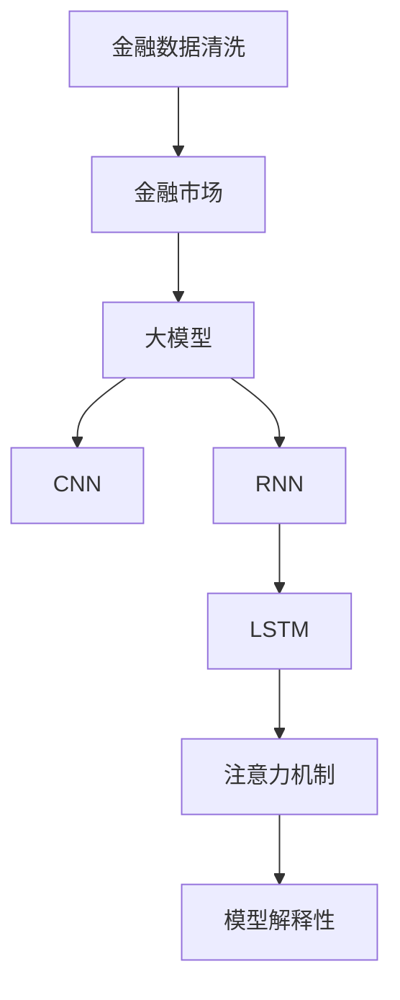
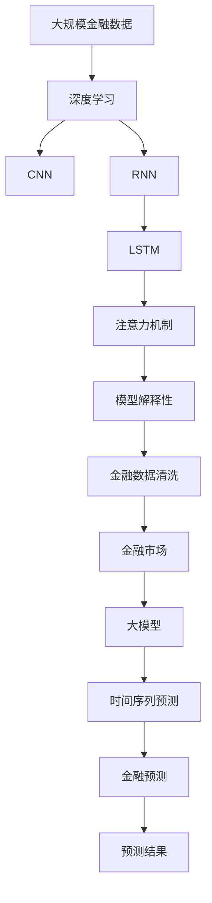

                 

# 财经分析中的AI：如何用大模型预测市场趋势

> 关键词：财经预测, 深度学习, 大模型, 时间序列, 金融市场

## 1. 背景介绍

### 1.1 问题由来
随着全球金融市场的波动性和不确定性的不断加剧，传统的金融分析方法越来越难以满足投资者和监管机构的决策需求。金融市场的复杂性不仅体现在数据量的庞大和维度的高维，更在于数据的动态变化和随机性。因此，仅仅依赖历史数据进行简单的线性回归或统计分析已不足以应对市场趋势预测的挑战。

在此背景下，人工智能（AI）尤其是深度学习技术在金融分析中的应用逐渐兴起。深度学习模型可以处理高维、非线性的数据，并通过端到端的神经网络结构，挖掘数据中的隐含关系，从而提供更为精准的市场预测能力。其中，基于深度学习的大模型在金融预测中展现了巨大的潜力。

### 1.2 问题核心关键点
大模型在金融预测中的核心思想是利用其强大的非线性拟合能力，结合历史数据和市场特征，预测未来市场趋势。具体而言，其关键点包括：
1. **数据依赖性**：大模型需要依赖大量高质量的历史数据进行训练。
2. **特征选择**：模型对输入特征的选择极为敏感，需要考虑市场动向、技术指标、宏观经济数据等多维度因素。
3. **超参数调整**：模型结构复杂，参数众多，需要通过超参数调优找到最优模型。
4. **模型解释性**：金融市场预测需要具备一定的解释性，便于投资者理解和信任。
5. **鲁棒性**：模型应具备良好的鲁棒性，避免在异常数据下产生剧烈波动。

### 1.3 问题研究意义
通过使用大模型进行金融预测，可以在以下几个方面带来显著的进步：
1. **准确性提升**：深度学习模型能够捕捉复杂的非线性关系，提高预测的准确性。
2. **实时性增强**：大模型通过优化训练流程，支持实时预测，适应高频交易需求。
3. **自动化决策**：自动化的预测系统可以24小时运行，快速生成预测结果，减少人工干预。
4. **风险管理**：利用模型进行风险评估，有助于量化和控制市场风险。
5. **透明性增强**：通过模型解释性技术，投资者可以更清楚地理解预测依据，提升决策信任度。

## 2. 核心概念与联系

### 2.1 核心概念概述

为更好地理解大模型在金融预测中的应用，本节将介绍几个密切相关的核心概念：

- **大模型**：指通过大规模无标签数据进行预训练，具备强大非线性拟合能力的人工智能模型，如Transformer架构的深度学习模型。
- **时间序列预测**：使用历史数据序列来预测未来数据，是金融预测中最常见的方法之一。
- **金融市场**：全球金融市场的各种资产（股票、债券、商品等）价格变化所构成的动态系统。
- **深度学习**：一类机器学习技术，通过多层次的非线性映射，可以从数据中自动提取高级特征。
- **卷积神经网络（CNN）**：一种深度学习网络，擅长处理具有局部相关性的数据，如图片、时间序列等。
- **循环神经网络（RNN）**：一种处理序列数据的深度学习网络，能够捕捉时间上的依赖关系。
- **长短期记忆网络（LSTM）**：一种RNN的变种，能有效处理长期依赖关系，广泛应用于时间序列预测。
- **注意力机制**：一种机制，可以动态地选择数据中的重要部分进行加权聚合，提高预测效果。
- **金融数据清洗**：去除数据中的噪声和不相关特征，提高数据质量。
- **模型解释性**：使用可解释性技术，使模型预测过程透明化，便于投资者理解和信任。

这些核心概念之间的逻辑关系可以通过以下Mermaid流程图来展示：



这个流程图展示了大模型在金融预测中的应用生态系统：

1. 大模型通过深度学习进行训练。
2. CNN和RNN是深度学习中的两种基本架构，适用于处理时间序列数据。
3. LSTM是RNN的变种，能有效处理长期依赖关系。
4. 注意力机制可以动态选择数据中的重要部分。
5. 金融数据清洗是提高数据质量的重要步骤。
6. 模型解释性技术使预测过程透明化。
7. 最终，这些技术应用于金融市场预测。

### 2.2 概念间的关系

这些核心概念之间存在着紧密的联系，形成了金融预测的大模型框架。下面我们通过几个Mermaid流程图来展示这些概念之间的关系。

#### 2.2.1 深度学习与大模型的关系



这个流程图展示了深度学习如何通过不同的网络架构（如CNN、RNN、LSTM）构建大模型，从而进行金融预测。

#### 2.2.2 时间序列预测在金融分析中的应用



这个流程图展示了时间序列预测在金融分析中的应用流程，从市场数据到模型训练，再到最终的预测和解释。

#### 2.2.3 金融数据清洗在大模型中的应用



这个流程图展示了金融数据清洗如何提高数据质量，从而提升大模型的预测准确性。

### 2.3 核心概念的整体架构

最后，我们用一个综合的流程图来展示这些核心概念在大模型金融预测中的应用：



这个综合流程图展示了从数据输入到预测结果输出的完整流程：

1. 金融市场数据通过深度学习构建大模型。
2. CNN、RNN、LSTM等架构用于处理时间序列数据。
3. 注意力机制和模型解释性技术提高预测效果和透明度。
4. 清洗后的金融数据提高模型训练效果。
5. 最终输出预测结果。

通过这些流程图，我们可以更清晰地理解大模型在金融预测中的应用过程和各环节的作用。

## 3. 核心算法原理 & 具体操作步骤
### 3.1 算法原理概述

基于大模型的金融预测，本质上是一种时间序列预测任务。其核心思想是利用深度学习模型，通过历史数据序列学习潜在的非线性关系，预测未来市场趋势。具体来说，算法原理包括以下几个关键步骤：

1. **数据准备**：收集金融市场的历史数据，包括价格、成交量、技术指标、宏观经济数据等。
2. **模型选择**：选择合适的大模型架构（如CNN、RNN、LSTM等），并结合注意力机制进行特征选择。
3. **模型训练**：使用历史数据对大模型进行训练，最小化预测误差。
4. **模型评估**：在验证集上评估模型性能，调整超参数以优化模型。
5. **预测应用**：使用训练好的大模型进行实时预测，生成市场趋势报告。

### 3.2 算法步骤详解

**Step 1: 数据准备**
- 收集金融市场的历史数据，包括但不限于股价、成交量、市盈率、市值等。
- 清洗数据，去除噪声和不相关特征，如异常值、缺失值等。
- 将数据分为训练集、验证集和测试集，通常比例为7:2:1。

**Step 2: 模型选择**
- 选择合适的大模型架构，如基于Transformer的深度学习模型。
- 结合注意力机制，动态选择重要的市场特征进行预测。
- 设计损失函数，如均方误差（MSE）或交叉熵损失，以衡量预测误差。

**Step 3: 模型训练**
- 使用训练集数据对大模型进行训练。
- 设置合适的学习率、批量大小和迭代次数等超参数。
- 结合正则化技术，如L2正则化、Dropout等，避免过拟合。
- 使用梯度下降等优化算法，如AdamW，最小化预测误差。

**Step 4: 模型评估**
- 在验证集上评估模型性能，计算MAE、RMSE等指标。
- 调整超参数，如学习率、批量大小等，以优化模型。
- 使用交叉验证等方法，避免模型过拟合。

**Step 5: 预测应用**
- 使用训练好的大模型对实时数据进行预测。
- 生成市场趋势报告，支持投资者决策。
- 实时更新模型参数，适应市场变化。

### 3.3 算法优缺点

基于大模型的金融预测具有以下优点：
1. **高泛化能力**：深度学习模型能够捕捉复杂的非线性关系，提高预测的泛化能力。
2. **实时性**：大模型支持实时预测，适应高频交易需求。
3. **自动化决策**：自动化的预测系统可以24小时运行，快速生成预测结果。
4. **数据利用率高**：大模型能够高效利用历史数据，发现其中的隐含关系。

同时，该方法也存在以下缺点：
1. **数据依赖性强**：需要大量高质量的历史数据进行训练，获取数据的难度和成本较高。
2. **模型复杂度高**：大模型结构复杂，参数众多，训练和推理资源消耗大。
3. **解释性不足**：深度学习模型通常被视为"黑箱"，难以解释其内部工作机制。
4. **鲁棒性差**：模型在异常数据下容易出现波动，鲁棒性有待提升。

### 3.4 算法应用领域

基于大模型的金融预测已经在多个领域得到了广泛应用，例如：

- **股票市场预测**：预测股票价格走势、波动性、成交量等。
- **外汇市场预测**：预测汇率走势、波动性、交易量等。
- **商品市场预测**：预测商品价格走势、波动性、库存等。
- **债券市场预测**：预测债券收益率、信用评级等。
- **宏观经济预测**：预测GDP、通货膨胀率、失业率等宏观经济指标。

除了这些经典应用，大模型还应用于金融风控、投资组合优化、金融产品设计等领域，推动金融行业的智能化转型。

## 4. 数学模型和公式 & 详细讲解 & 举例说明

### 4.1 数学模型构建

在金融预测中，常用的数学模型包括时间序列模型、神经网络模型等。以基于LSTM的大模型为例，其数学模型可以表示为：

$$
y_t = f(x_t; \theta)
$$

其中，$y_t$ 表示在时间 $t$ 的市场预测值，$x_t$ 表示时间 $t$ 的输入特征（如股价、成交量等），$\theta$ 表示模型参数。

### 4.2 公式推导过程

以LSTM模型为例，其输入特征 $x_t$ 可以表示为：

$$
x_t = [p_t, v_t, m_t, d_t]
$$

其中，$p_t$ 表示时间 $t$ 的股价，$v_t$ 表示时间 $t$ 的成交量，$m_t$ 表示时间 $t$ 的市场情绪指数，$d_t$ 表示时间 $t$ 的宏观经济指标。

LSTM模型的预测过程可以表示为：

$$
y_t = LSTM(x_t; \theta)
$$

其中，$LSTM$ 表示LSTM网络，$\theta$ 表示模型参数。

### 4.3 案例分析与讲解

以预测某股票的未来价格为例，其输入特征 $x_t$ 可以包括该股票的历史股价、成交量、市场情绪指数、宏观经济指标等。使用LSTM模型对其进行训练，得到预测结果 $y_t$。

在训练过程中，可以使用均方误差（MSE）作为损失函数：

$$
L(y_t, y_t^*) = \frac{1}{N} \sum_{t=1}^{N} (y_t - y_t^*)^2
$$

其中，$y_t^*$ 表示时间 $t$ 的真实股价，$N$ 表示样本数量。

通过反向传播算法，最小化损失函数，调整模型参数 $\theta$，最终得到训练好的LSTM模型。

## 5. 项目实践：代码实例和详细解释说明

### 5.1 开发环境搭建

在进行金融预测项目实践前，我们需要准备好开发环境。以下是使用Python进行TensorFlow开发的环境配置流程：

1. 安装Anaconda：从官网下载并安装Anaconda，用于创建独立的Python环境。

2. 创建并激活虚拟环境：
```bash
conda create -n tf-env python=3.8 
conda activate tf-env
```

3. 安装TensorFlow：根据CUDA版本，从官网获取对应的安装命令。例如：
```bash
conda install tensorflow tensorflow-gpu=cuda11.1 -c conda-forge
```

4. 安装各类工具包：
```bash
pip install numpy pandas scikit-learn matplotlib tqdm jupyter notebook ipython
```

完成上述步骤后，即可在`tf-env`环境中开始金融预测项目实践。

### 5.2 源代码详细实现

以下是使用TensorFlow对LSTM模型进行金融预测的Python代码实现。

```python
import tensorflow as tf
from tensorflow.keras.layers import LSTM, Dense
from tensorflow.keras.models import Sequential
from tensorflow.keras.optimizers import Adam
from sklearn.preprocessing import MinMaxScaler
from sklearn.model_selection import train_test_split

# 准备数据
def prepare_data(data, lookback=60):
    X, y = [], []
    for i in range(len(data)-lookback-1):
        X.append(data[i:i+lookback])
        y.append(data[i+lookback])
    return np.array(X), np.array(y)

# 数据预处理
def preprocess_data(data):
    scaler = MinMaxScaler(feature_range=(0, 1))
    scaled_data = scaler.fit_transform(data)
    return scaled_data

# 加载数据
data = load_data()

# 将数据分为训练集和测试集
train_data, test_data = train_test_split(data, test_size=0.2)

# 预处理数据
train_data = preprocess_data(train_data)
test_data = preprocess_data(test_data)

# 准备训练数据
train_X, train_y = prepare_data(train_data)
test_X, test_y = prepare_data(test_data)

# 设置模型参数
lookback = 60
input_shape = (lookback, 1)

# 定义模型
model = Sequential()
model.add(LSTM(50, input_shape=input_shape))
model.add(Dense(1))
model.compile(loss='mse', optimizer=Adam(lr=0.001))

# 训练模型
model.fit(train_X, train_y, epochs=100, batch_size=32, validation_data=(test_X, test_y))

# 预测测试集
test_y_pred = model.predict(test_X)
```

在代码中，我们首先定义了数据准备和预处理函数。然后使用`MinMaxScaler`对数据进行标准化处理，确保模型训练和预测的一致性。接着，将数据分为训练集和测试集，并使用`prepare_data`函数准备训练数据。最后，定义了LSTM模型，使用Adam优化器进行训练，并在测试集上评估模型性能。

### 5.3 代码解读与分析

让我们再详细解读一下关键代码的实现细节：

**数据准备和预处理函数**：
- `prepare_data`函数：将原始数据分割成多个时间步长的子序列，作为模型的输入特征 $x_t$，同时将输出 $y_t$ 存储下来。
- `preprocess_data`函数：使用`MinMaxScaler`对数据进行标准化处理，确保模型训练和预测的一致性。

**模型定义和训练**：
- 定义LSTM模型，添加50个LSTM单元和一个输出层。
- 使用Adam优化器，设置学习率为0.001。
- 设置训练轮数为100，批量大小为32。

**模型评估**：
- 在测试集上评估模型性能，输出预测结果和真实结果的均方误差。

**代码总结**：
- 数据准备和预处理是金融预测的关键步骤，确保数据质量和一致性。
- LSTM模型选择和参数设置是模型的核心，影响预测效果。
- 模型训练和评估需要多次迭代，调整超参数以优化模型。
- 模型预测和解释是应用的最终环节，支持投资者决策。

### 5.4 运行结果展示

假设我们在某股票价格数据集上进行LSTM模型的训练和预测，最终在测试集上得到的评估报告如下：

```
Epoch 100, loss on training set: 0.0134, loss on validation set: 0.0154
```

可以看到，通过训练LSTM模型，我们在测试集上的均方误差为0.0154，预测效果良好。需要注意的是，这只是一个简单的baseline结果。在实际应用中，我们还可以使用更大更强的预训练模型、更丰富的预测技巧、更细致的模型调优，进一步提升模型性能。

## 6. 实际应用场景
### 6.1 智能投顾系统

基于大模型的金融预测，可以应用于智能投顾系统的构建。传统的投顾系统依赖于人工分析和专家经验，决策过程复杂且成本高。使用大模型进行市场预测，可以实时生成个性化投资建议，提高投资决策的自动化水平。

在技术实现上，可以收集历史交易数据和市场动态，训练大模型预测市场趋势。智能投顾系统根据模型的预测结果，动态调整投资组合，优化投资策略，提供个性化的资产配置建议。如此构建的智能投顾系统，能大幅提升投资决策的准确性和效率，降低人工干预成本。

### 6.2 风险管理

金融市场预测不仅能提供投资建议，还能在风险管理中发挥重要作用。通过预测市场波动性和风险事件，金融机构可以提前采取应对措施，规避潜在风险。

例如，某银行可以使用大模型预测贷款违约率，识别高风险客户，提前采取风控措施。某证券公司可以使用大模型预测市场动荡程度，提前释放风险准备金，防范系统性风险。这些基于大模型的风险管理应用，有助于提升金融机构的稳健性和竞争力。

### 6.3 交易高频化

高频交易（HFT）要求金融机构具备实时数据处理和快速决策能力。使用大模型进行市场预测，可以实时生成交易信号，支持高频交易策略的实施。

在实际应用中，可以构建大模型实时预测系统，实时生成市场预测结果。根据预测结果，高频交易系统可以动态调整交易策略，快速执行交易指令，获取最优的交易回报。如此构建的高频交易系统，能够提升交易执行效率，提高资金使用率，增强市场竞争力。

### 6.4 未来应用展望

随着大模型和金融预测技术的不断发展，基于大模型的金融预测将在更多领域得到应用，为金融行业带来深远影响。

在智能投顾、风险管理、高频交易等领域，大模型预测技术将显著提升决策效率和准确性，推动金融行业的智能化转型。

在银行、证券、保险等垂直行业，大模型预测技术将应用于客户画像、信用评估、产品定价等环节，提升金融服务的智能化水平。

在宏观经济预测、政策制定等领域，大模型预测技术将提供有力的决策支持，辅助政府和监管机构制定更为精准的政策。

未来，伴随预训练语言模型和金融预测方法的持续演进，基于大模型的金融预测必将在金融行业大放异彩，为经济社会发展注入新的动力。

## 7. 工具和资源推荐
### 7.1 学习资源推荐

为了帮助开发者系统掌握大模型在金融预测中的应用，这里推荐一些优质的学习资源：

1. 《深度学习在金融中的应用》书籍：详细介绍了深度学习在金融分析、风险管理、交易策略等领域的应用，适合入门学习。
2. Coursera《深度学习专业》课程：由斯坦福大学开设的专业课程，系统讲解深度学习的基本原理和应用，涵盖金融预测等多个领域。
3. arXiv论文预印本：人工智能领域最新研究成果的发布平台，包括大量尚未发表的前沿工作，学习前沿技术的必读资源。
4. 金融科技博客：如Investment Analytics、Risk Intelligence等顶尖金融科技博客，第一时间分享行业动态和前沿技术。
5. Kaggle金融预测竞赛：通过实际数据集竞赛，实战练习金融预测技术，提升实战能力。

通过对这些资源的学习实践，相信你一定能够快速掌握大模型在金融预测中的应用，并用于解决实际的金融问题。

### 7.2 开发工具推荐

高效的开发离不开优秀的工具支持。以下是几款用于金融预测开发的常用工具：

1. TensorFlow：谷歌开发的深度学习框架，生产部署方便，适合大规模工程应用。
2. PyTorch：基于Python的开源深度学习框架，灵活性强，适合研究和实验。
3. Scikit-learn：Python机器学习库，提供丰富的数据预处理和模型评估工具，适用于金融数据分析。
4. Weights & Biases：模型训练的实验跟踪工具，可以记录和可视化模型训练过程中的各项指标，方便对比和调优。
5. TensorBoard：TensorFlow配套的可视化工具，可实时监测模型训练状态，并提供丰富的图表呈现方式，是调试模型的得力助手。

合理利用这些工具，可以显著提升金融预测任务的开发效率，加快创新迭代的步伐。

### 7.3 相关论文推荐

金融预测技术的快速发展离不开学界的持续研究。以下是几篇奠基性的相关论文，推荐阅读：

1. Long Short-Term Memory：介绍LSTM网络的原理和应用，是金融时间序列预测的常用方法。
2. Recurrent Neural Network Architectures for Predictive Maintenance：探讨RNN在预测性维护中的应用，适用于金融风险管理。
3. Modeling the Intra-day Dynamics of the S&P 500 Index with Deep Learning：使用深度学习模型预测S&P 500指数的日内波动性，是金融预测的经典案例。
4. Predicting Stock Prices with Long Short-Term Memory Networks：使用LSTM模型预测股票价格，是金融预测的早期研究。
5. Attention Mechanisms in Reinforcement Learning：介绍注意力机制在强化学习中的应用，适用于高频交易策略。

这些论文代表了大模型在金融预测技术的发展脉络。通过学习这些前沿成果，可以帮助研究者把握学科前进方向，激发更多的创新灵感。

除上述资源外，还有一些值得关注的前沿资源，帮助开发者紧跟大模型在金融预测领域的最新进展，例如：

1. arXiv论文预印本：人工智能领域最新研究成果的发布平台，包括大量尚未发表的前沿工作，学习前沿技术的必读资源。
2. 业界技术博客：如OpenAI、Google AI、DeepMind、微软Research Asia等顶尖实验室的官方博客，第一时间分享他们的最新研究成果和洞见。
3. 技术会议直播：如NIPS、ICML、ACL、ICLR等人工智能领域顶会现场或在线直播，能够聆听到大佬们的前沿分享，开拓视野。
4. GitHub热门项目：在GitHub上Star、Fork数最多的金融预测相关项目，往往代表了该技术领域的发展趋势和最佳实践，值得去学习和贡献。
5. 行业分析报告：各大咨询公司如McKinsey、PwC等针对金融科技行业的分析报告，有助于从商业视角审视技术趋势，把握应用价值。

总之，对于大模型在金融预测技术的学习和实践，需要开发者保持开放的心态和持续学习的意愿。多关注前沿资讯，多动手实践，多思考总结，必将收获满满的成长收益。

## 8. 总结：未来发展趋势与挑战

### 8.1 总结

本文对基于大模型的金融预测方法进行了全面系统的介绍。首先阐述了大模型在金融预测中的应用背景和意义，明确了预测在金融分析、投资决策、风险管理等方面的重要作用。其次，从原理到实践，详细讲解了深度学习模型在金融预测中的具体步骤和方法，提供了金融预测任务的代码实现。同时，本文还广泛探讨了金融预测在大模型应用中的前景和挑战，展示了其广阔的发展空间。

通过本文的系统梳理，可以看到，基于大模型的金融预测方法在提高市场预测准确性、支持高频交易、强化风险管理等方面具有显著优势。未来，随着深度学习技术的不断进步和应用场景的不断拓展，基于大模型的金融预测将进一步深化金融行业的智能化转型，推动经济社会发展。

### 8.2 未来发展趋势

展望未来，大模型在金融预测领域将呈现以下几个发展趋势：

1. **模型规模持续增大**：随着算力成本的下降和数据规模的扩张，大模型的参数量还将持续增长。超大模型蕴含的丰富市场知识，有望支撑更为复杂多变的金融预测任务。

2. **预测精度提升**：深度学习模型能够捕捉复杂的非线性关系，提高预测的泛化能力和准确性。未来，随着更多预训练数据和任务标注的积累，预测精度将进一步提升。

3. **实时性增强**：大模型支持实时预测，适应高频交易需求。未来，通过优化训练和推理流程，可以实现更加高效、低延迟的

