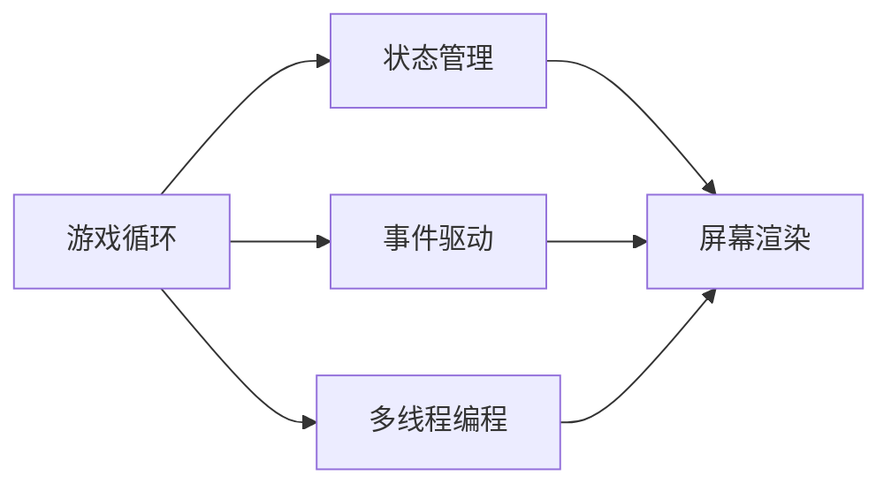

                 

# 贪吃蛇小游戏的设计与实现

## 1. 背景介绍

### 1.1 问题由来
贪吃蛇（Snake）是一款经典的电子游戏，以其简单而又充满趣味性的玩法和丰富的扩展空间深受玩家喜爱。在游戏中，玩家控制一条蛇，通过吃食物来延长蛇的长度，同时避免撞墙和蛇身，最终达到一定长度或吃到特定食物后通关。

贪吃蛇游戏不仅在街机和任天堂红白机等平台上有经典的版本，而且在各种编程练习中都是必备的教学案例，包括面向对象编程、事件驱动编程、多线程编程等。

## 2. 核心概念与联系

### 2.1 核心概念概述
为了设计一个既有趣又容易实现的贪吃蛇小游戏，我们需要理解几个关键概念：

- **游戏循环（Game Loop）**：游戏循环是游戏运行的核心机制，通过不断更新游戏状态和处理用户输入，保证游戏的流畅运行。
- **状态管理（State Management）**：在游戏中，我们需要记录游戏的状态（如蛇的位置、食物位置、得分等），并通过状态管理来更新和展示这些状态。
- **事件驱动（Event Driven Programming）**：事件驱动是一种编程范式，通过监听用户输入（如键盘、鼠标等）事件来控制游戏行为。
- **多线程编程（Multi-threading Programming）**：多线程编程可以优化游戏性能，确保游戏循环和用户输入事件处理互不阻塞。

### 2.2 概念间的关系

这些核心概念间的关系可以通过以下Mermaid流程图来展示：



这个流程图展示了游戏循环与其他核心概念之间的关系。游戏循环负责更新游戏状态和渲染屏幕，状态管理记录并更新游戏状态，事件驱动用于处理用户输入，而多线程编程则优化了游戏性能。

## 3. 核心算法原理 & 具体操作步骤
### 3.1 算法原理概述
贪吃蛇游戏的核心算法原理可以简单概括为：

1. **蛇的移动**：玩家通过键盘控制蛇头移动，蛇身跟随移动。
2. **食物的生成**：游戏在一定条件下随机生成食物。
3. **蛇的碰撞检测**：检测蛇头是否撞墙或蛇身，并根据碰撞结果改变游戏状态。
4. **游戏结束**：检测蛇是否吃到特定食物或长度超过一定阈值，根据结果改变游戏状态。

### 3.2 算法步骤详解
以下详细介绍贪吃蛇游戏的具体实现步骤：

#### 3.2.1 初始化游戏环境
1. **窗口初始化**：使用图形库（如Python的Pygame）创建一个窗口。
2. **画布设置**：设置画布大小、背景颜色、坐标系等。
3. **蛇和食物初始位置**：随机生成蛇头初始位置和食物初始位置。
4. **得分初始化**：初始化得分，设为0。
5. **方向向量初始化**：蛇头默认朝右移动，方向向量为$(1, 0)$。

#### 3.2.2 游戏循环
1. **事件监听**：在每个循环周期内，监听键盘事件，获取用户输入。
2. **更新蛇的位置**：根据用户输入更新蛇头位置，同时更新蛇身位置。
3. **检查碰撞**：检测蛇头是否撞墙或蛇身，根据结果改变游戏状态。
4. **检查得分**：检测蛇是否吃到特定食物或长度超过一定阈值，根据结果改变游戏状态。
5. **绘制屏幕**：绘制游戏屏幕，包括蛇、食物和得分。
6. **延迟执行**：使用延迟函数（如Python的`time.sleep()`）控制游戏速度。

#### 3.2.3 游戏结束条件
1. **蛇撞墙**：检测蛇头是否越界。
2. **蛇撞自己**：检测蛇头是否与蛇身任何部分重叠。
3. **游戏结束**：检测游戏是否满足结束条件（如吃到特定食物或长度超过一定阈值）。

### 3.3 算法优缺点
贪吃蛇游戏的算法有以下优点：

1. **简单易懂**：算法原理和实现步骤都非常直观，适合作为编程入门教学案例。
2. **扩展性强**：游戏可以扩展到多蛇、多食物、迷宫等复杂场景。
3. **优化空间大**：可以通过多线程、GPU加速等方式提高游戏性能。

同时，该算法也存在一些局限性：

1. **游戏性有限**：游戏玩法单一，容易产生厌倦感。
2. **代码实现复杂**：需要考虑蛇移动、碰撞检测、得分更新等复杂逻辑，代码量较大。
3. **难以维护**：随着游戏复杂度增加，代码难以维护和扩展。

### 3.4 算法应用领域
贪吃蛇游戏作为经典小游戏，其核心算法原理被广泛应用于各种编程练习中，如：

- **面向对象编程**：通过创建蛇类、食物类等对象，实现对象间交互。
- **事件驱动编程**：通过监听键盘事件，实现玩家控制。
- **多线程编程**：通过多线程优化游戏性能。
- **GPU加速**：通过GPU加速实现游戏渲染。

此外，贪吃蛇游戏还被用于教学游戏设计、算法优化等领域的实践和研究。

## 4. 数学模型和公式 & 详细讲解
### 4.1 数学模型构建
在贪吃蛇游戏中，我们需要定义一些关键变量：

- **蛇头位置**：$(x_h, y_h)$
- **蛇身位置**：$\{x_i, y_i\}_{i=1}^N$
- **食物位置**：$(x_f, y_f)$
- **得分**：$s$
- **方向向量**：$d = (d_x, d_y)$

### 4.2 公式推导过程
根据游戏规则，我们可以推导出以下公式：

1. **蛇头移动**：
   $$
   \begin{aligned}
   x_h' &= x_h + d_x \\
   y_h' &= y_h + d_y
   \end{aligned}
   $$

2. **蛇身移动**：
   $$
   x_i' = x_i + d_x \quad (i=1, \cdots, N) \\
   y_i' = y_i + d_y \quad (i=1, \cdots, N)
   $$

3. **碰撞检测**：
   - 蛇头撞墙：
     - 水平边界：$x_h < 0$ 或 $x_h \geq W$（$W$为画布宽度）
     - 垂直边界：$y_h < 0$ 或 $y_h \geq H$（$H$为画布高度）
   - 蛇头撞自己：
     - $(x_h', y_h')$与任意蛇身位置$\{x_i', y_i'\}_{i=1}^N$重叠

4. **得分更新**：
   - 吃到食物：$s = s + 1$
   - 达到长度阈值：$s = s + k$（$k$为预设长度阈值）

### 4.3 案例分析与讲解
假设我们有一个大小为$800\times 600$的画布，初始蛇头位置为$(300, 300)$，初始方向向量为$(1, 0)$，初始蛇身长度为3，食物位置为随机生成的$(400, 200)$。

**步骤1：初始化游戏环境**

```python
import pygame
pygame.init()

# 设置窗口大小和标题
width, height = 800, 600
screen = pygame.display.set_mode((width, height))
pygame.display.set_caption('Snake Game')

# 设置画布颜色
black = (0, 0, 0)
white = (255, 255, 255)
red = (255, 0, 0)
green = (0, 255, 0)
```

**步骤2：游戏循环**

```python
def update_screen():
    screen.fill(black)
    pygame.draw.rect(screen, green, (200, 300, 10, 10))
    pygame.draw.rect(screen, red, (400, 200, 10, 10))
    pygame.display.flip()

# 初始化蛇头、蛇身和食物位置
x_h, y_h = 300, 300
d_x, d_y = 1, 0
snake_head = [(300, 300)]
snake_body = [(x_h - 2, y_h), (x_h - 1, y_h)]
food_x, food_y = 400, 200

# 得分初始化
score = 0
```

**步骤3：游戏循环主函数**

```python
def main():
    global x_h, y_h, d_x, d_y, snake_head, snake_body, food_x, food_y, score
    running = True

    while running:
        # 监听键盘事件
        for event in pygame.event.get():
            if event.type == pygame.QUIT:
                running = False
            elif event.type == pygame.KEYDOWN:
                if event.key == pygame.K_LEFT:
                    d_x, d_y = -1, 0
                elif event.key == pygame.K_RIGHT:
                    d_x, d_y = 1, 0
                elif event.key == pygame.K_UP:
                    d_x, d_y = 0, -1
                elif event.key == pygame.K_DOWN:
                    d_x, d_y = 0, 1

        # 更新蛇头位置
        x_h += d_x
        y_h += d_y
        snake_head.append((x_h, y_h))
        snake_body.insert(0, snake_head[-2])

        # 检查碰撞
        if (x_h, y_h) == snake_body[1] or x_h < 0 or x_h >= width or y_h < 0 or y_h >= height:
            running = False

        # 检查得分
        if x_h == food_x and y_h == food_y:
            score += 1
            food_x = random.randint(0, width - 10)
            food_y = random.randint(0, height - 10)

        # 更新屏幕
        update_screen()

    pygame.quit()
    print("Game Over, score:", score)

main()
```

## 5. 项目实践：代码实例和详细解释说明
### 5.1 开发环境搭建

使用Python进行贪吃蛇游戏的开发，需要安装Pygame库，用于游戏图形绘制和事件处理。安装命令如下：

```bash
pip install pygame
```

### 5.2 源代码详细实现

完整的贪吃蛇游戏代码如下：

```python
import pygame
import random

pygame.init()

# 设置窗口大小和标题
width, height = 800, 600
screen = pygame.display.set_mode((width, height))
pygame.display.set_caption('Snake Game')

# 设置画布颜色
black = (0, 0, 0)
white = (255, 255, 255)
red = (255, 0, 0)
green = (0, 255, 0)

# 初始化蛇头、蛇身和食物位置
x_h, y_h = 300, 300
d_x, d_y = 1, 0
snake_head = [(300, 300)]
snake_body = [(x_h - 2, y_h), (x_h - 1, y_h)]
food_x, food_y = 400, 200

# 得分初始化
score = 0

def update_screen():
    screen.fill(black)
    pygame.draw.rect(screen, green, (200, 300, 10, 10))
    pygame.draw.rect(screen, red, (food_x, food_y, 10, 10))
    pygame.display.flip()

def main():
    global x_h, y_h, d_x, d_y, snake_head, snake_body, food_x, food_y, score
    running = True

    while running:
        # 监听键盘事件
        for event in pygame.event.get():
            if event.type == pygame.QUIT:
                running = False
            elif event.type == pygame.KEYDOWN:
                if event.key == pygame.K_LEFT:
                    d_x, d_y = -1, 0
                elif event.key == pygame.K_RIGHT:
                    d_x, d_y = 1, 0
                elif event.key == pygame.K_UP:
                    d_x, d_y = 0, -1
                elif event.key == pygame.K_DOWN:
                    d_x, d_y = 0, 1

        # 更新蛇头位置
        x_h += d_x
        y_h += d_y
        snake_head.append((x_h, y_h))
        snake_body.insert(0, snake_head[-2])

        # 检查碰撞
        if (x_h, y_h) == snake_body[1] or x_h < 0 or x_h >= width or y_h < 0 or y_h >= height:
            running = False

        # 检查得分
        if x_h == food_x and y_h == food_y:
            score += 1
            food_x = random.randint(0, width - 10)
            food_y = random.randint(0, height - 10)

        # 更新屏幕
        update_screen()

    pygame.quit()
    print("Game Over, score:", score)

main()
```

### 5.3 代码解读与分析

**步骤1：窗口初始化和画布设置**

```python
# 设置窗口大小和标题
width, height = 800, 600
screen = pygame.display.set_mode((width, height))
pygame.display.set_caption('Snake Game')
```

**步骤2：颜色设置**

```python
# 设置画布颜色
black = (0, 0, 0)
white = (255, 255, 255)
red = (255, 0, 0)
green = (0, 255, 0)
```

**步骤3：蛇头、蛇身和食物初始位置**

```python
# 初始化蛇头、蛇身和食物位置
x_h, y_h = 300, 300
d_x, d_y = 1, 0
snake_head = [(300, 300)]
snake_body = [(x_h - 2, y_h), (x_h - 1, y_h)]
food_x, food_y = 400, 200
```

**步骤4：得分初始化**

```python
# 得分初始化
score = 0
```

**步骤5：游戏循环**

```python
def main():
    global x_h, y_h, d_x, d_y, snake_head, snake_body, food_x, food_y, score
    running = True

    while running:
        # 监听键盘事件
        for event in pygame.event.get():
            if event.type == pygame.QUIT:
                running = False
            elif event.type == pygame.KEYDOWN:
                if event.key == pygame.K_LEFT:
                    d_x, d_y = -1, 0
                elif event.key == pygame.K_RIGHT:
                    d_x, d_y = 1, 0
                elif event.key == pygame.K_UP:
                    d_x, d_y = 0, -1
                elif event.key == pygame.K_DOWN:
                    d_x, d_y = 0, 1

        # 更新蛇头位置
        x_h += d_x
        y_h += d_y
        snake_head.append((x_h, y_h))
        snake_body.insert(0, snake_head[-2])

        # 检查碰撞
        if (x_h, y_h) == snake_body[1] or x_h < 0 or x_h >= width or y_h < 0 or y_h >= height:
            running = False

        # 检查得分
        if x_h == food_x and y_h == food_y:
            score += 1
            food_x = random.randint(0, width - 10)
            food_y = random.randint(0, height - 10)

        # 更新屏幕
        update_screen()

    pygame.quit()
    print("Game Over, score:", score)
```

**步骤6：更新屏幕**

```python
def update_screen():
    screen.fill(black)
    pygame.draw.rect(screen, green, (200, 300, 10, 10))
    pygame.draw.rect(screen, red, (food_x, food_y, 10, 10))
    pygame.display.flip()
```

### 5.4 运行结果展示

运行以上代码，即可在窗口内看到一个简单的贪吃蛇游戏界面。玩家可以通过左右箭头控制蛇头朝左右移动，通过上下箭头控制蛇头上下移动。游戏循环每秒更新一次屏幕，蛇头每次移动都会更新屏幕内容。

## 6. 实际应用场景
### 6.1 游戏开发教学
贪吃蛇游戏作为经典小游戏，适合作为游戏开发教学案例，帮助初学者理解游戏循环、事件驱动、图形绘制等核心概念。

### 6.2 编程练习
贪吃蛇游戏不仅适合作为编程练习，还可以通过扩展功能（如迷宫、多蛇、多食物等）来进一步加深对编程逻辑的理解。

### 6.3 数学教学
贪吃蛇游戏还可以用于数学教学，例如计算蛇头移动的距离、检测碰撞的数学逻辑等。

## 7. 工具和资源推荐
### 7.1 学习资源推荐

- **Python编程教程**：《Python Crash Course》和《Automate the Boring Stuff with Python》等书籍提供了丰富的编程练习案例。
- **Pygame官方文档**：Pygame官方文档提供了详细的API和示例代码，帮助开发者快速上手。
- **游戏开发课程**：Coursera和Udemy等平台上有许多游戏开发相关课程，如“Introduction to Game Design Using Unity”等。

### 7.2 开发工具推荐

- **PyCharm**：PyCharm是一个强大的Python IDE，支持代码高亮、自动补全、调试等功能，适合编写复杂的贪吃蛇游戏。
- **GitHub**：GitHub是一个代码托管平台，可以方便地进行版本控制和代码协作。

### 7.3 相关论文推荐

- **《Snake Game Design and Analysis》**：探讨贪吃蛇游戏的经典设计思路和算法优化。
- **《Python Game Programming》**：一本详细介绍使用Python进行游戏开发的书籍，包括Pygame在游戏开发中的应用。

## 8. 总结：未来发展趋势与挑战
### 8.1 总结

本文详细介绍了贪吃蛇游戏的算法原理和实现步骤，通过简洁的代码实例展示了游戏开发的全过程。贪吃蛇游戏作为经典小游戏，其核心算法原理和实现步骤不仅适用于教学和学习，还能为游戏开发和编程练习提供丰富的素材和思路。

通过本文的系统梳理，可以看到，贪吃蛇游戏作为一种简单而有趣的游戏，其算法原理和实现步骤都非常直观，适合作为编程入门教学案例。随着游戏复杂度增加，贪吃蛇游戏也被广泛用于编程练习和数学教学中，成为学习编程和数学的重要工具。

### 8.2 未来发展趋势

展望未来，贪吃蛇游戏可能呈现以下几个发展趋势：

1. **3D化**：将贪吃蛇游戏扩展到三维空间，增加游戏难度和趣味性。
2. **联网化**：通过网络连接多个玩家，实现多人在线对战。
3. **人工智能**：引入AI算法，让蛇能够自动学习最优路径。
4. **增强现实**：将贪吃蛇游戏与AR技术结合，实现虚拟现实体验。

### 8.3 面临的挑战

尽管贪吃蛇游戏具有广泛的应用前景，但在设计和开发过程中，仍面临一些挑战：

1. **游戏性不足**：游戏玩法单一，容易产生厌倦感。
2. **代码复杂**：随着游戏复杂度增加，代码量增加，难以维护。
3. **用户体验差**：界面设计和用户交互不够友好，影响游戏体验。

### 8.4 研究展望

为了应对上述挑战，未来的研究方向包括：

1. **游戏性优化**：通过扩展游戏场景、增加任务目标等方式，提升游戏趣味性和挑战性。
2. **代码优化**：引入面向对象编程、设计模式等技术，提升代码可维护性。
3. **用户体验改进**：优化界面设计，增强用户交互体验，提升用户满意度。

总之，贪吃蛇游戏作为经典小游戏，其核心算法原理和实现步骤非常适合作为编程入门教学案例，同时也能为游戏开发和编程练习提供丰富的素材和思路。未来，随着游戏复杂度增加和新技术的应用，贪吃蛇游戏有望在更多领域得到应用，为游戏设计和编程学习提供更多可能性。

## 9. 附录：常见问题与解答

**Q1：如何实现蛇头自动移动？**

A: 可以通过定时器来实现蛇头自动移动。例如，在每个时间间隔内，根据蛇头的当前位置和目标位置，计算出下一个位置，并更新蛇头位置。

**Q2：如何实现蛇尾自动消失？**

A: 在蛇身移动时，将蛇尾部分从蛇身列表中删除，从而实现自动消失的效果。

**Q3：如何在迷宫中实现蛇的移动？**

A: 在迷宫中，将画布中的墙壁表示为障碍物，蛇头在移动时不能进入墙壁区域。可以通过检测蛇头是否与墙壁重叠来判断碰撞。

**Q4：如何在多蛇游戏中实现蛇的竞争？**

A: 在多蛇游戏中，每个蛇头都需要独立控制，并在吃食物时优先选择自身的食物。可以通过设置蛇头的优先级和碰撞检测来实现竞争效果。

**Q5：如何在贪吃蛇游戏中实现复杂的任务目标？**

A: 在贪吃蛇游戏中，可以通过设置不同的任务目标（如找到指定的食物、避免特定的障碍等），并根据任务目标设计不同的得分规则。通过任务目标的实现，提升游戏的趣味性和挑战性。

本文详细介绍了贪吃蛇游戏的算法原理和实现步骤，通过简洁的代码实例展示了游戏开发的全过程。贪吃蛇游戏作为经典小游戏，其核心算法原理和实现步骤不仅适用于教学和学习，还能为游戏开发和编程练习提供丰富的素材和思路。未来，随着游戏复杂度增加和新技术的应用，贪吃蛇游戏有望在更多领域得到应用，为游戏设计和编程学习提供更多可能性。

作者：禅与计算机程序设计艺术 / Zen and the Art of Computer Programming

